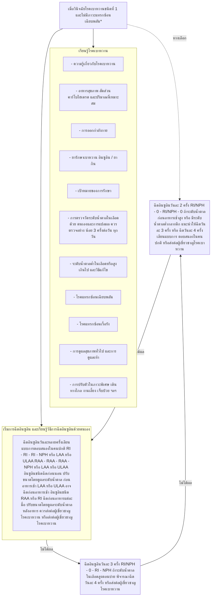
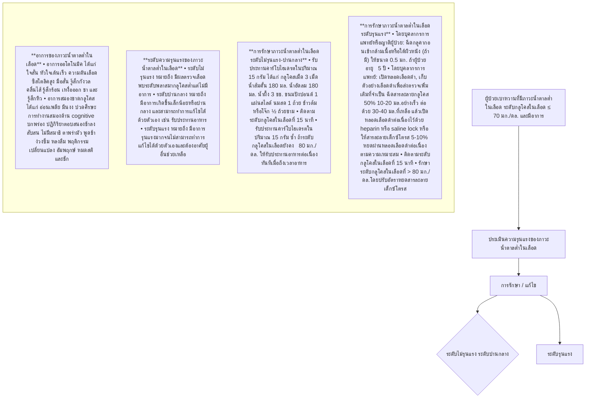
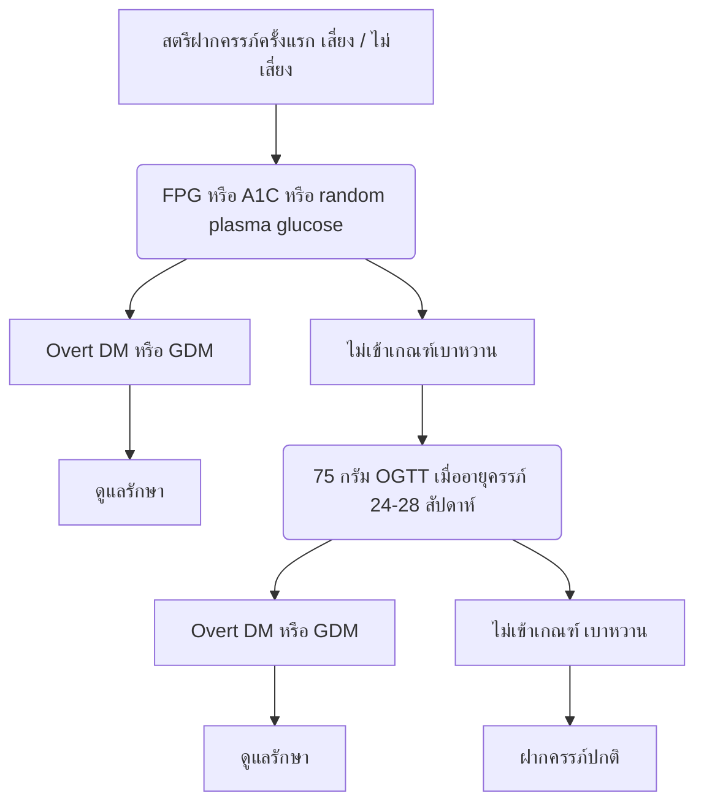

# โรค: เบาหวาน (Diabetes)

## แหล่งข้อมูล: Clinical Practice Guideline for Diabetes 2023

## แนวทางเวชปฏิบัติ สำหรับโรคเบาหวาน 2566

### Clinical Practice Guideline for Diabetes 2023

ราชวิทยาลัยอายุรแพทย์แห่งประเทศไทย ในพระบรมราชูปถัมภ์

สมาคมโรคเบาหวานแห่งประเทศไทย ในพระราชูปถัมภ์สมเด็จพระเทพรัตนราชสุดาฯ สยามบรมราชกุมารี

สมาคมต่อมไร้ท่อแห่งประเทศไทย

กรมการแพทย์ กระทรวงสาธารณสุข

สำนักงานหลักประกันสุขภาพแห่งชาติ

## แนวทางเวชปฏิบัติสำหรับโรคเบาหวาน

## 2566

Clinical Practice Guideline for Diabetes 2023

ราชวิทยาลัยอายุรแพทย์แห่งประเทศไทย ในพระบรมราชูปถัมภ์

สมาคมโรคเบาหวานแห่งประเทศไทย ในพระราชูปถัมภ์สมเด็จพระเทพรัตนราชสุดาฯ สยามบรมราชกุมารี

สมาคมต่อมไร้ท่อแห่งประเทศไทย

กรมการแพทย์ กระทรวงสาธารณสุข

สำนักงานหลักประกันสุขภาพแห่งชาติ

**พิมพ์ครั้งที่ 1** : กรกฎาคม 2566

**จำนวนพิมพ์** : 500 เล่ม

**จัดทำโดย** : สมาคมโรคเบาหวานแห่งประเทศไทย ในพระบรมราชูปถัมภ์สมเด็จพระเทพรัตนราชสุดาฯ สยามบรมราชกุมารี

อาคารเฉลิมพระบารมี 50 ปี ชั้น 11 เลขที่ 2 ซอยเพชรบุรี 47 ถนนเพชรบุรีตัดใหม่ แขวงบางกะปิ เขตห้วยขวาง กรุงเทพมหานคร 10310

โทรศัพท์ 0 2716 5412 โทรสาร 0 2716 5411

**สมาคมต่อมไร้ท่อแห่งประเทศไทย**

อาคารเฉลิมพระบารมี 50 ปี ชั้น 10 เลขที่ 2 ซอยเพชรบุรี 47 ถนนเพชรบุรีตัดใหม่ แขวงบางกะปิ เขตห้วยขวาง กรุงเทพมหานคร 10310

โทรศัพท์ 0 2716 6337 โทรสาร 0 2716 6338

**ISBN** : 978-616-93248-4-3

**พิมพ์ที่** : บริษัท ศรีเมืองการพิมพ์ จำกัด

5/37-41 รองเมืองซอย 5 แขวงรองเมือง เขตปทุมวัน กรุงเทพมหานคร 10330

โทรศัพท์ 0 2214 4660 E-mail : smprt1966@gmail.com

## ค่านิยม

โรคเบาหวานเป็นโรคที่พบบ่อยและมีความสำคัญมากอยู่ในกลุ่มโรคไม่ติดต่อที่พบบ่อยและเป็นปัญหาทางสาธารณสุขของประเทศหรือของโลก โรคเบาหวานทำให้เกิดภาวะแทรกซ้อนที่เป็นอันตรายต่อสุขภาพทั้งชนิดเฉียบพลันและชนิดเรื้อรัง จึงจำเป็นอย่างยิ่งที่จะต้องรักษาและป้องกันภาวะแทรกซ้อนเหล่านี้ ถ้าได้รับการวินิจฉัยตั้งแต่เริ่มเป็นโรคจะช่วยไม่ให้เกิดภาวะแทรกซ้อนต่าง ๆ ทำให้ผู้ป่วยมีสุขภาพดี มีความเป็นอยู่อย่างมีความสุขสบาย

หนังสือแนวทางเวชปฏิบัติสำหรับโรคเบาหวาน พ.ศ. 2566 เล่มนี้ ได้รวบรวมเรื่องราวเกี่ยวกับชนิดของโรคเบาหวาน การประเมินความเสี่ยง แนวทางการคัดกรอง การวินิจฉัยโรคเบาหวาน และการประเมินทางคลินิกเมื่อแรกวินิจฉัย เป้าหมายการรักษา การติดตาม การประเมินผลการรักษา และการส่งปรึกษา การให้ความรู้และสร้างทักษะเพื่อการดูแลโรคเบาหวานด้วยตนเอง พฤติกรรมการดำเนินชีวิตเพื่อป้องกันและควบคุมเบาหวาน และการสร้างเสริมสุขภาพ การดูแลรักษาโดยปรับพฤติกรรมการดำเนินชีวิตให้เข้าสู่โรคเบาหวานระยะสงบ การให้ยาเพื่อควบคุมระดับน้ำตาลในเลือดผู้ใหญ่ การดูแลตนเองในเดือนรอมฎอน (ถือศีลอด) การรักษาเบาหวานในผู้เป็นโรคไตเรื้อรัง การตรวจติดตามระดับน้ำตาลเพื่อบรรลุเป้าหมายการรักษา การวินิจฉัย ประเมิน รักษา และป้องกันภาวะน้ำตาลต่ำในเลือด ในผู้ป่วยเบาหวานผู้ใหญ่ การวินิจฉัย ประเมินรักษา และป้องกันภาวะฉุกเฉินของระดับน้ำตาลในเลือดสูงในผู้ป่วยเบาหวาน แนวทางการตรวจค้น และดูแลรักษาภาวะแทรกซ้อนจากเบาหวานที่ตาและไต แนวทางการป้องกัน และรักษาภาวะแทรกซ้อนของหลอดเลือดหัวใจ และหลอดเลือดสมอง แนวทางการตรวจค้น การป้องกัน และการดูแลรักษาแผลที่เท้าของผู้ป่วยเบาหวาน รวมทั้งเบาหวานในเด็กและหญิงมีครรภ์ โดยผู้ทรงคุณวุฒิ ผู้เชี่ยวชาญโรคเบาหวานจากสถาบันต่าง ๆ ช่วยกันเรียบเรียงขึ้น

ผมขอแสดงความชื่นชมต่อคณะผู้จัดทำหนังสือแนวทางสำหรับโรคเบาหวาน พ.ศ. 2566 ที่ได้มีความวิริยะอุตสาหะในการรวบรวมทุกแง่ทุกมุมเกี่ยวกับโรคเบาหวานจัดทำเป็นหนังสือเล่มนี้ขึ้น ซึ่งจะเป็นประโยชน์สำหรับผู้สนใจ ผู้ป่วยโรคเบาหวาน ตลอดจนแพทย์ผู้ให้การดูแลรักษา จะได้ใช้เป็นแนวทางในการดูแลผู้ป่วย ทำให้ผู้ป่วยมีสุขภาพดีไม่เกิดโรคแทรกซ้อนที่รุนแรง รวมทั้งการป้องกันโรคเบาหวาน มีความรู้ความเข้าใจเกี่ยวกับโรคเบาหวานได้ดียิ่งขึ้น

(พลโท รองศาสตราจารย์นายแพทย์วิชัย ประยูรวิวัฒน์)
ประธานราชวิทยาลัยอายุรแพทย์แห่งประเทศไทย

แนวทางเวชปฏิบัติสำหรับโรคเบาหวาน 2566 | ก

## ค่านิยม

สภาพสังคมและสิ่งแวดล้อมในปัจจุบันที่เปลี่ยนแปลงไป กระทบต่อชีวิตและความเป็นอยู่ของคนในสังคม ส่งผลให้มีผู้ป่วยโรคไม่ติดต่อเรื้อรังเพิ่มขึ้นเป็นจำนวนมาก โดยเฉพาะโรคเบาหวานที่ก่อให้เกิดความสูญเสียในด้านสุขภาพ และเกิดภาวะแทรกซ้อนต่ออวัยวะต่าง ๆ อาทิ เบาหวานเข้าจอประสาทตาส่งผลให้ตาบอด การทำงานของไตลดลงและต้องล้างไตในที่สุด รวมถึงส่งผลต่อการเกิดโรคหัวใจและหลอดเลือดสมองได้ แนวทางเวชปฏิบัติสำหรับโรคเบาหวาน 2566 จะเป็นคู่มือทางวิชาการสำหรับแพทย์และบุคลากรสาธารณสุขและผู้สนใจ สามารถใช้ดูแลผู้ป่วยและเป็นเอกสารอ้างอิงทางวิชาการได้เป็นอย่างดี เนื้อหาวิชาการครอบคลุมการคัดกรอง การวินิจฉัย การรักษา ตลอดจนการป้องกันภาวะแทรกซ้อนจากเบาหวานได้

แนวทางเวชปฏิบัติสำหรับโรคเบาหวาน 2566 ฉบับนี้ กลั่นกรองจากภูมิรู้ของผู้เชี่ยวชาญด้านโรคเบาหวาน มีความทันสมัย เข้าใจได้ง่าย คุณค่าของหนังสือนี้ คือเจตนารมณ์ที่จะให้ผู้อ่านสามารถดูแลรักษาบนพื้นฐานที่มีข้อมูลทางวิชาการสนับสนุน เพื่อให้ผู้ป่วยเบาหวานมีคุณภาพชีวิตที่ดีขึ้น

นายแพทย์ธงชัย กีรติหัตถยากร
อธิบดีกรมการแพทย์

ข | แนวทางเวชปฏิบัติสำหรับโรคเบาหวาน 2566

## ค่านิยม

เบาหวานเป็นปัญหาสาธารณสุขที่สำคัญของประเทศ ในปี 2551-2552 สำนักงานหลักประกันสุขภาพแห่งชาติ โดยการสนับสนุนทางด้านวิชาการจากสมาคมโรคเบาหวานแห่งประเทศไทยฯ ร่วมกับหน่วยบริการในสังกัดกระทรวงสาธารณสุขนำร่องการจัดบริการดูแลผู้ป่วยเบาหวานที่มีคุณภาพอย่างต่อเนื่องเพื่อป้องกันหรือชะลอภาวะแทรกซ้อนในผู้ป่วย ส่งเสริมคุณภาพชีวิตที่ดี จนนำไปสู่การตัดสินใจของคณะกรรมการหลักประกันสุขภาพแห่งชาติในการเพิ่มเงินจำนวนหนึ่ง นอกเหนือจากงบเหมาจ่ายรายหัวผู้ป่วยในและผู้ป่วยนอก สำหรับการควบคุมป้องกันและรักษาโรคเรื้อรัง (เบาหวานและความดันโลหิตสูง) โดยเน้นการคัดกรองภาวะแทรกซ้อนและป้องกัน ตั้งแต่ปีงบประมาณ 2553 จนถึงปัจจุบัน

เพื่อสนับสนุนนโยบายของคณะกรรมการหลักประกันสุขภาพแห่งชาติ สมาคมโรคเบาหวานแห่งประเทศไทยฯ ร่วมกับสมาคมต่อมไร้ท่อแห่งประเทศไทยและภาคีที่เกี่ยวข้อง ได้พัฒนาและจัดทำแนวทางเวชปฏิบัติสำหรับโรคเบาหวาน เพื่อเป็นแนวทางแก่แพทย์และบุคลากรด้านการแพทย์และสาธารณสุขประกอบการจัดบริการดูแลผู้ป่วยเบาหวานที่มีคุณภาพและมาตรฐาน มาแล้ว 4 ครั้ง คือ ในปี 2551, 2554, 2557 และ 2560 ตามลำดับ นับเป็นคุณูปการอย่างยิ่งต่อการดูแลผู้ป่วยเบาหวานของประเทศ เมื่อมีข้อมูลทางวิชาการใหม่ๆ และ ความก้าวหน้าด้านเทคโนโลยี สมาคมโรคเบาหวานแห่งประเทศไทยฯ และสมาคมต่อมไร้ท่อแห่งประเทศไทย ได้ปรับปรุงแนวทางเวชปฏิบัติสำหรับโรคเบาหวาน 2566 ฉบับนี้ให้ทันสมัย รวมถึงการดูแลเบาหวานให้เข้าสู่ระยะสงบ (Diabetes Remission) การดูแลภาวะฉุกเฉินเมื่อมีระดับน้ำตาลในเลือดสูง ตลอดจน การสนับสนุนส่งเสริมให้ผู้ป่วยดูแลจัดการตนเองได้

สำนักงานหลักประกันสุขภาพแห่งชาติ ขอขอบคุณสมาคมโรคเบาหวานแห่งประเทศไทยฯ และสมาคมต่อมไร้ท่อแห่งประเทศไทย ที่จัดทำแนวทางเวชปฏิบัติสำหรับโรคเบาหวาน 2566 และหวังอย่างยิ่งว่าจะเป็นเครื่องมือสำคัญประกอบการจัดบริการดูแลผู้ป่วยเบาหวานของแพทย์และบุคลากรด้านการแพทย์และสาธารณสุขในทุกระดับต่อไป

นายแพทย์จเด็จ ธรรมธัชอารี

เลขาธิการ สำนักงานหลักประกันสุขภาพแห่งชาติ

แนวทางเวชปฏิบัติสำหรับโรคเบาหวาน 2566 | ค


โรคเบาหวานเป็นหนึ่งในกลุ่มโรคไม่ติดต่อ (non-communication diseases, NCDs) ที่พบบ่อยและเป็นภาระต่อระบบสาธารณสุขของแต่ละประเทศทั่วโลก เมื่อวันที่ 19 กันยายน พ.ศ. 2554 องค์การสหประชาชาติได้ประกาศมติหมายเลขที่ 66/2 จากที่ประชุมสมัชชาฯ ด้วยนัยทางการเมือง (Political Declaration of High-level Meeting) ให้แต่ละประเทศสมาชิก มีการขับเคลื่อนเพื่อให้เกิดนโยบายการป้องกันและควบคุมกลุ่มโรคไม่ติดต่ออย่างจริงจัง โดยมีองค์การอนามัยโลกทำหน้าที่กำกับ กระตุ้น และติดตามการดำเนินงาน สำหรับประเทศไทย โดยกรมควบคุมโรค กระทรวงสาธารณสุข ได้กำหนดให้โรคเบาหวานและความดันโลหิตสูงเป็นเป้าหมายแรกที่ต้องเร่งดำเนินการ

โรคเบาหวานต้องรับการดูแลรักษาต่อเนื่อง การรักษามีจุดประสงค์และเป้าหมายเพื่อป้องกันไม่ให้เกิดโรคแทรกซ้อนจากเบาหวาน ให้ผู้ป่วยมีสุขภาพดี และมีคุณภาพชีวิตที่ดี โดยมีทีมสหสาขาวิชาชีพร่วมกันให้บริการดูแลรักษา เน้นการให้ความรู้เกี่ยวกับโรค วิธีการรักษา การสร้างทักษะการกินการอยู่ถูกต้อง โน้มน้าวสร้างแรงจูงใจให้ผู้ป่วยปฏิบัติได้จริง กิจกรรมเหล่านี้นอกจากได้ประโยชน์ในการรักษาโรคเบาหวานแล้ว ยังเกิดประโยชน์ในการป้องกันโรคเบาหวานและการส่งเสริมสุขภาพด้วย

การคัดกรอง ค้นหา ผู้ที่มีความเสี่ยงที่จะเป็นโรคและผู้ที่เป็นโรคเบาหวานในระยะเริ่มแรก มีความสำคัญอย่างยิ่ง เพื่อให้การป้องกันไม่ให้กลุ่มเสี่ยงเกิดโรคเบาหวาน และกลุ่มที่เป็นโรคได้รับการวินิจฉัยและรักษาอย่างถูกต้องเหมาะสมและทันกาล มีโอกาสให้โรคเบาหวานเข้าสู่ระยะสงบ (diabetes remission) หวังว่าแนวทางเวชปฏิบัตินี้จะเป็นประโยชน์ในการจัดการโรคเบาหวานสำหรับทีมดูแลรักษาโรคเบาหวานทุกระดับ

คณะผู้จัดทำ

แนวทางเวชปฏิบัติสำหรับโรคเบาหวาน 2566

แนวทางเวชปฏิบัติสำหรับโรคเบาหวาน 2566

คณะทำงานจัดทำแนวทางเวชปฏิบัติสำหรับโรคเบาหวาน 2566

 
   
     
         ศาสตราจารย์นายแพทย์สุทิน ศรีอัษฎาพร 
         ที่ปรึกษา 
     
     
         ศาสตราจารย์นายแพทย์พัฒน์ มหาโชคเลิศวัฒนา 
         ที่ปรึกษา 
     
     
         ศาสตราจารย์เกียรติคุณแพทย์หญิงวรรณี นิธิยานันท์ 
         ประธาน 
     
     
         พลตรีหญิง ศาสตราจารย์คลินิกแพทย์หญิงอัมพา สุทธิจำรูญ 
         กรรมการ 
     
     
         เจ้านางแพทย์หญิงเขมรัสมี ขุนศึกเม็งราย 
         กรรมการ 
     
     
         รองศาสตราจารย์แพทย์หญิงรัตนา ลีลาวัฒนา 
         กรรมการ 
     
     
         ศาสตราจารย์นายแพทย์ชัชลิต รัตรสาร 
         กรรมการ 
     
     
         ศาสตราจารย์คลินิกแพทย์หญิงสุภาวดี ลิขิตมาศกุล 
         กรรมการ 
     
     
         รองศาสตราจารย์นายแพทย์เพชร รอดอารีย์ 
         กรรมการ 
     
     
         ศาสตราจารย์นายแพทย์ธงชัย ประฏิภาณวัตร 
         กรรมการ 
     
     
         ศาสตราจารย์แพทย์หญิงเปรมฤดี ภูมิถาวร 
         กรรมการ 
     
     
         รองศาสตราจารย์แพทย์หญิงอภิรดี ศรีวิจิตรกมล 
         กรรมการ 
     
     
         รองศาสตราจารย์แพทย์หญิงจีรันดา สันติประภพ 
         กรรมการ 
     
     
         รองศาสตราจารย์แพทย์หญิงระวีวรรณ เลิศวัฒนารักษ์ 
         กรรมการ 
     
     
         รองศาสตราจารย์แพทย์หญิงประไพ เดชคำรณ 
         กรรมการ 
     
     
         รองศาสตราจารย์แพทย์หญิงทิพาพร ธาระวานิช 
         กรรมการ 
     
     
         ศาสตราจารย์แพทย์หญิงธนินี สหกิจรุ่งเรือง 
         กรรมการ 
     
     
         รองศาสตราจารย์นายแพทย์วีรชัย ศรีวณิชชากร 
         กรรมการ 
     
     
         รองศาสตราจารย์ ดร.วันทนีย์ เกรียงสินยศ 
         กรรมการ 
     
     
         รองศาสตราจารย์ ดร.เภสัชกรเนติ สุขสมบูรณ์ 
         กรรมการ 
     
     
         รองศาสตราจารย์แพทย์หญิงพิมพ์ใจ อันทนานนท์ 
         กรรมการ 
     
     
         แพทย์หญิงฐิตินันท์ อนุสรณ์วงศ์ชัย 
         กรรมการ 
     
     
         พันเอกหญิง แพทย์หญิงสิรกานต์ เตชะวณิช 
         กรรมการ 
     
     
         พันเอกหญิง ดร.กรกต วีรเธียร 
         กรรมการ 
     
     
         นายแพทย์เอกลักษณ์ วโนทยาโรจน์ 
         กรรมการ 
     
     
         แพทย์หญิงปัณณิกา ปราชญ์โกสินทร์ 
         กรรมการ 
     
     
         รองศาสตราจารย์ ดร.อังศินันท์ อินทรกำแหง 
         กรรมการ 
     
     
         ศาสตราจารย์คลินิกนายแพทย์ชัยชาญ ดีโรจนวงศ์ 
         กรรมการและเลขานุการ 
     
   
 

แนวทางเวชปฏิบัติสำหรับโรคเบาหวาน 2566 | จ

## หลักการของแนวทางเวชปฏิบัติสำหรับโรคเบาหวาน 2566

แนวทางเวชปฏิบัติสำหรับโรคเบาหวานฉบับนี้ เป็นเครื่องมือส่งเสริมคุณภาพของการบริการโรคเบาหวานที่เหมาะสมกับทรัพยากรและเงื่อนไขของสังคมไทย โดยหวังผลในการส่งเสริมและพัฒนาบริการโรคเบาหวานให้มีประสิทธิภาพดี มีประสิทธิผลตามเป้าหมาย เกิดประโยชน์สูงสุดและคุ้มค่า ข้อแนะนำต่าง ๆ ในแนวทางเวชปฏิบัติไม่ใช่ข้อบังคับของการปฏิบัติดูแลรักษาโรคเบาหวาน ผู้ใช้สามารถปฏิบัติแตกต่างไปจากข้อแนะนำที่กำหนดไว้ในกรณีที่สถานการณ์แตกต่างออกไป หรือ มีข้อจำกัดของสถานพยาบาลและทรัพยากร หรือ มีเหตุผลอันสมควรอื่น โดยใช้วิจารณญาณซึ่งเป็นที่ยอมรับและอยู่บนพื้นฐานหลักวิชาการและจรรยาบรรณ

ฉ | แนวทางเวชปฏิบัติสำหรับโรคเบาหวาน 2566

## คำชี้แจงคุณภาพหลักฐานและน้ำหนักคำแนะนำ

### คุณภาพหลักฐาน (Quality of Evidence)

### คุณภาพหลักฐานระดับ 1 หมายถึง หลักฐานที่ได้จาก

1.1 การทบทวนแบบมีระบบ (systematic review) จากการศึกษาแบบกลุ่มสุ่มตัวอย่าง-ควบคุม (randomized-controlled clinical trial) หรือ

1.2 การศึกษาแบบกลุ่มสุ่มตัวอย่าง-ควบคุมที่มีคุณภาพดีเยี่ยม อย่างน้อย 1 ฉบับ (well-designed randomized-controlled clinical trial)

### คุณภาพหลักฐานระดับ 2 หมายถึง หลักฐานที่ได้จาก

2.1 การทบทวนแบบมีระบบของการศึกษาควบคุมแต่ไม่ได้สุ่มตัวอย่าง (non-randomized controlled clinical trial) หรือ

2.2 การศึกษาควบคุมแต่ไม่สุ่มตัวอย่างที่มีคุณภาพดีเยี่ยม (well-designed non-randomized controlled clinical trial)

2.3 หลักฐานจากรายงานการศึกษาตามแผนติดตามไปหาผล (cohort) หรือ การศึกษาวิเคราะห์ควบคุมกรณี ย้อนหลัง (case control analytic studies) ที่ได้รับการออกแบบวิจัยเป็นอย่างดี ซึ่งมาจากสถาบันหรือกลุ่มวิจัยมากกว่าหนึ่งแห่ง/กลุ่ม หรือ

2.4 หลักฐานจากพหุกาลานุกรม (multiple time series) ซึ่งมีหรือไม่มีมาตรการดำเนินการ หรือหลักฐานที่ได้จากการวิจัยทางคลินิกรูปแบบอื่นหรือทดลองแบบไม่มีการควบคุมซึ่งมีผลประจักษ์ถึงประโยชน์หรือ โทษจากการปฏิบัติมาตรการที่เด่นชัดมาก เช่น ผลของการนำยาเพ็นนิซิลินมาใช้ในราว พ.ศ. 2480 จะได้รับการจัดอยู่ในหลักฐานประเภทนี้

### คุณภาพหลักฐานระดับ 3 หมายถึง หลักฐานที่ได้จาก

3.1 การศึกษาพรรณนา (descriptive studies) หรือ

3.2 การศึกษาควบคุมที่มีคุณภาพพอใช้ (fair-designed controlled clinical trial)

### คุณภาพหลักฐานระดับ 4 หมายถึง หลักฐานที่ได้จาก

4.1 รายงานของคณะกรรมการผู้เชี่ยวชาญ ประกอบกับความเห็นพ้องหรือฉันทามติ (consensus) ของคณะผู้เชี่ยวชาญ บนพื้นฐานประสบการณ์ทางคลินิก หรือ

4.2 รายงานอนุกรมผู้ป่วยจากการศึกษาในประชากรต่างกลุ่ม และคณะผู้ศึกษาต่างคณะอย่างน้อย 2 ฉบับ รายงานหรือความเห็นที่ไม่ได้ผ่านการวิเคราะห์แบบมีระบบ

4.3 เช่น เกร็ดรายงานผู้ป่วยเฉพาะราย (anecdotal report) ความเห็นของผู้เชี่ยวชาญเฉพาะราย จะไม่ได้รับการพิจารณาว่าเป็นหลักฐานที่มีคุณภาพในการจัดทำแนวทางเวชปฏิบัตินี้

แนวทางเวชปฏิบัติสำหรับโรคเบาหวาน 2566 | ช

## นํ้าหนักคําแนะนํา (Strength of Recommendation)

**นํ้าหนักคําแนะนํา ++** หมายถึง ความมั่นใจของคําแนะนําให้ทําอยู่ในระดับสูง เพราะมาตรการดังกล่าวมีประโยชน์อย่างยิ่งต่อผู้ป่วยและคุ้มค่า (cost effective) “ควรทํา”

**นํ้าหนักคําแนะนํา +** หมายถึง ความมั่นใจของคําแนะนําให้ทําอยู่ในระดับปานกลาง เนื่องจากมาตรการดังกล่าวอาจมีประโยชน์ต่อผู้ป่วยและอาจคุ้มค่าในภาวะจําเพาะ “น่าทํา”

**นํ้าหนักคําแนะนํา +/-** หมายถึง ความมั่นใจยังไม่เพียงพอในการให้คําแนะนํา เนื่องจาก มาตรการดังกล่าวยังมีหลักฐานไม่เพียงพอ ในการสนับสนุนหรือคัดค้านว่าอาจมีหรืออาจไม่มีประโยชน์ต่อผู้ป่วย และอาจไม่คุ้มค่า แต่ไม่ก่อให้เกิดอันตรายต่อผู้ป่วยเพิ่มขึ้น ดังนั้นการตัดสินใจกระทําขึ้นอยู่กับปัจจัยอื่น ๆ “อาจทําหรือไม่ทํา”

**นํ้าหนักคําแนะนํา -** หมายถึง ความมั่นใจของคําแนะนําห้ามทําอยู่ในระดับปานกลาง เนื่องจากมาตรการดังกล่าวไม่มีประโยชน์ต่อผู้ป่วยและไม่คุ้มค่า หากไม่จําเป็น “ไม่น่าทํา”

**นํ้าหนักคําแนะนํา - -** หมายถึง ความมั่นใจของคําแนะนําห้ามทําอยู่ในระดับสูง เพราะมาตรการดังกล่าวอาจเกิดโทษหรือก่อให้เกิดอันตรายต่อผู้ป่วย “ไม่ควรทํา”

ซ | แนวทางเวชปฏิบัติสําหรับโรคเบาหวาน 2566

## คำย่อภาษาอังกฤษที่ใช้ประจำ

* **A1C**: Hemoglobin A1c
* **ABI**: ankle brachial index
* **ACEI**: angiotensin converting enzyme inhibitor
* **Anti-GAD**: glutamic acid decarboxylase antibody
* **ARB**: Angiotensin II receptor blocker
* **BGM**: Blood glucose monitoring
* **CGM**: Continuous glucose monitoring
* **CKD-EPI**: Chronic Kidney Disease Epidemiology Collaboration
* **DPP-4**: Dipeptidyl peptidase-4
* **DSMES**: diabetes self-management education and supports
* **DSMP**: Diabetes Self-Management Program
* **DSMP NS**: Diabetes Self-Management Program Network System
* **eGFR**: Estimated glomerular filtration rate
* **ESRD**: End stage renal disease
* **FPG**: Fasting plasma glucose
* **GFR**: Glomerular filtration rate
* **GLP-1 RA**: Glucagon like peptide-1 receptor agonist
* **HD**: Hemodialysis
* **HDL-C**: High density lipoprotein cholesterol
* **ICR**: Insulin to carb ratio
* **IFG**: Impaired fasting glucose
* **IGT**: Impaired glucose tolerance
* **ISF**: Insulin sensitivity factor
* **LDL-C**: Low density lipoprotein cholesterol
* **LOPS**: Loss of protective sensation
* **NGSP**: National Glycohemoglobin Standardization Program
* **OGTT**: Oral glucose tolerance test
* **PAD**: Peripheral arterial disease
* **PD**: Peritoneal dialysis
* **RAS blockade**: Renin angiotensin system blockade
* **SGLT2-I**: Sodium glucose cotransporter 2 inhibitor
* **T1DDAR CN**: Thai Type 1 Diabetes and Diabetes diagnosed before Age 30 years Registry, Care and Network
* **UACR**: Urinary albumin to creatinine ratio

แนวทางเวชปฏิบัติสำหรับโรคเบาหวาน 2566 | ฌ

## คำย่อภาษาไทยที่ใช้ประจำ

 
   
     
         กก. 
         กิโลกรัมของน้ำหนักตัว 
     
     
         ชม. 
         ชั่วโมง 
     
     
         ซม. 
         เซ็นติเมตร 
     
     
         ดล. 
         เดซิลิตร 
     
     
         ตร.ม. 
         ตารางเมตร 
     
     
         มก. 
         มิลลิกรัม 
     
     
         มม. 
         มิลลิเมตร 
     
     
         มล. 
         มิลลิลิตร 
     
   
 

ญ | แนวทางเวชปฏิบัติสำหรับโรคเบาหวาน 2566


คํานิยม ก
คํานํา ง
คณะทํางานจัดทําแนวทางเวชปฏิบัติสําหรับโรคเบาหวาน จ
หลักการของแนวทางเวชปฏิบัติสําหรับโรคเบาหวาน 2566 ฉ
คําชี้แจงคุณภาพหลักฐานและนํ้าหนักคําแนะนํา ช
คําย่อภาษาอังกฤษที่ใช้ประจํา ฌ
คําย่อภาษาไทยที่ใช้ประจํา ญ
สารบัญ ฎ
เนื้อหาที่ปรับเปลี่ยนและเพิ่มเติมในแนวทางเวชปฏิบัติสําหรับโรคเบาหวาน 2566 1

**หมวด 1. โรคเบาหวาน**
บทที่ 1 ชนิดของโรคเบาหวาน 9
บทที่ 2 การประเมินความเสี่ยง แนวทางการคัดกรอง การวินิจฉัยโรคเบาหวานในผู้ใหญ่ และการประเมินทางคลินิกเมื่อแรกวินิจฉัย 15
บทที่ 3 เป้าหมายการรักษา การติดตาม การประเมินผลการรักษาและการส่งปรึกษา 29

**หมวด 2. การรักษา**
บทที่ 4 การให้ความรู้และสร้างทักษะเพื่อการดูแลโรคเบาหวานด้วยตนเอง 39
บทที่ 5 พฤติกรรมการดําเนินชีวิตเพื่อป้องกันและควบคุมเบาหวานและการสร้างเสริมสุขภาพ 49
บทที่ 6 การดูแลรักษาโดยปรับพฤติกรรมการดําเนินชีวิตให้เข้าสู่โรคเบาหวานระยะสงบ 67
บทที่ 7 การให้ยาเพื่อควบคุมระดับนํ้าตาลในเลือดผู้ใหญ่ 77
บทที่ 8 การดูแลตนเองในเดือนรอมฎอน (ถือศีลอด) 89
บทที่ 9 การรักษาเบาหวานในผู้เป็นโรคไตเรื้อรัง 95
บทที่ 10 การตรวจติดตามระดับนํ้าตาลเพื่อบรรลุเป้าหมายการรักษา 105

**หมวด 3. ภาวะแทรกซ้อน**
บทที่ 11 การวินิจฉัย ประเมิน รักษา และป้องกันภาวะนํ้าตาลตํ่าในเลือดในผู้ป่วยเบาหวานผู้ใหญ่ 119
บทที่ 12 การวินิจฉัย ประเมิน รักษาและป้องกันภาวะฉุกเฉินของระดับนํ้าตาลในเลือดสูงในผู้ป่วยเบาหวาน 137
บทที่ 13 แนวทางการตรวจค้นและดูแลรักษาภาวะแทรกซ้อนจากเบาหวานที่ตาและไต 149
บทที่ 14 แนวทางการป้องกันและรักษาภาวะแทรกซ้อนของหลอดเลือดหัวใจและหลอดเลือดสมอง 159
บทที่ 15 แนวทางการตรวจค้น การป้องกัน และการดูแลรักษาแผลที่เท้าของผู้ป่วยเบาหวาน 165

แนวทางเวชปฏิบัติสําหรับโรคเบาหวาน 2566 ฎ

## หมวด 4. เบาหวานในเด็กและหญิงมีครรภ์

บทที่ 16 การคัดกรอง การวินิจฉัย และเป้าหมายการรักษาเบาหวานในเด็กและวัยรุ่น 185
บทที่ 17 การป้องกันและแก้ไขภาวะแทรกซ้อนเฉียบพลันในผู้ป่วยเบาหวานเด็กและวัยรุ่น 209
บทที่ 18 เบาหวานในหญิงมีครรภ์ 217

### หมวด 5. การบริหารจัดการ
บทที่ 19 บทบาทสถานบริการและตัวชี้วัด 227
บทที่ 20 การดูแลเบาหวานในโรงพยาบาลส่งเสริมสุขภาพตำบล 233
บทที่ 21 การดูแลเบาหวานโดยร้านยาคุณภาพ 237

### ภาคผนวก
ภาคผนวก 1. วิธีการทดสอบความทนต่อกลูโคส (Oral Glucose Tolerance Test) 245
ภาคผนวก 2. การให้คำปรึกษา สร้างแรงจูงใจ แรงผลักดันเพื่อปรับเปลี่ยนพฤติกรรมในการป้องกันและรักษาโรคเบาหวาน 247
ภาคผนวก 3. ภาวะก่อนเบาหวาน 259

ฏ | แนวทางเวชปฏิบัติสำหรับโรคเบาหวาน 2566

เนื้อหาที่ปรับเปลี่ยนและเพิ่มเติมในแนวทางเวชปฏิบัติสำหรับโรคเบาหวาน 2566

### การเปลี่ยนแปลงในภาพรวม

เนื่องจากความรู้เกี่ยวกับโรคเบาหวานมีการเปลี่ยนแปลงอย่างมากในช่วง 10 ปีที่ผ่านมา ไม่ว่าจะเป็นการแบ่งชนิด การตรวจคัดกรอง ตลอดจนการติดตามการดูแลรักษา จึงได้มีการจัดทำแนวทางเวชปฏิบัติสำหรับโรคเบาหวาน ฉบับปี พ.ศ. 2566 ขึ้น โดยปรับปรุงจากแนวทางเวชปฏิบัติสำหรับโรคเบาหวาน ฉบับปี พ.ศ. 2560 และมีเนื้อหาเพิ่มเติมใหม่จำนวน 5 บท ได้แก่ 1. พฤติกรรมการดำเนินชีวิตเพื่อป้องกันและควบคุมเบาหวานและการสร้างเสริมสุขภาพ 2. การดูแลรักษาโดยปรับพฤติกรรมการดำเนินชีวิตให้เข้าสู่โรคเบาหวานระยะสงบ 3. การวินิจฉัย ประเมิน รักษาและป้องกันภาวะฉุกเฉินของระดับน้ำตาลในเลือดสูงในผู้ป่วยเบาหวาน 4. การให้คำปรึกษา สร้างแรงจูงใจ แรงผลักดันเพื่อปรับเปลี่ยนพฤติกรรมในการป้องกันและรักษาโรคเบาหวาน และ 5. ภาวะก่อนเบาหวาน ได้สรุปรายละเอียดของการเปลี่ยนแปลงและเนื้อหาที่เพิ่มขึ้นในแต่ละบทไว้ในส่วนนี้

### บทที่ 1. ชนิดของโรคเบาหวาน

มีการเปลี่ยนการแบ่งชนิดของโรคเบาหวานตามการจำแนกขององค์การอนามัยโลก (WHO 2019) ซึ่งมีการเพิ่มโรคเบาหวานชนิดผสมระหว่างชนิดที่ 1 และ 2 (hybrid form) ได้แก่ slowly evolving immune diabetes และ ketosis prone type 2 diabetes และเน้นความสำคัญของการตรวจระดับ C-peptide และ anti-GAD ในผู้ป่วยเบาหวานที่มีลักษณะไม่ชัดเจนว่าจะเป็นโรคเบาหวานชนิดที่ 1 หรือ ชนิดที่ 2

### บทที่ 2. การประเมินความเสี่ยง แนวทางการคัดกรอง การวินิจฉัยโรคเบาหวานในผู้ใหญ่ และการประเมินทางคลินิกเมื่อแรกวินิจฉัย

การคัดกรองแบ่งการคัดกรองเป็น การคัดกรองสำหรับประชาชนทั่วไป โดยใช้แบบประเมินความเสี่ยงและประวัติทางการแพทย์ ซึ่งสามารถทำได้ด้วยตนเองโดยไม่ต้องใช้ผลเลือด และการคัดกรองในกลุ่มเสี่ยงซึ่งใช้การตรวจเลือดและการวินิจฉัยโดยแพทย์ ตามขั้นตอนและเงื่อนไขที่ระบุไว้ในแผนภูมิที่ทำขึ้นใหม่ นอกจากนี้การประเมินความเสี่ยงในการเกิดโรคเบาหวานโดยใช้ Thai Diabetes Risk Score แบบใหม่ซึ่งใช้ข้อมูลจากผลการศึกษาการสำรวจสุขภาพคนไทยทั่วประเทศ มีความแม่นยำในการพยากรณ์ความเสี่ยง โดยอาจใช้หรือไม่ใช้ระดับน้ำตาลขณะอดอาหาร (FPG) ร่วมด้วย และแนะนำให้พิจารณาให้ทำ oral glucose tolerance test ในรายที่มีความเสี่ยงสูง และเป็น prediabetes ที่มีค่า FPG อยู่ในช่วง 110-125 มก./ดล. จะทำให้ตรวจพบผู้ที่เป็นโรคเบาหวานเพิ่มขึ้นและเร็วขึ้น

ปรับคำแนะนำให้ใช้ระดับ A1C ในการวินิจฉัยโรคเบาหวานได้ โดยค่าดังกล่าวจะต้องเป็นผลตรวจจากห้องปฏิบัติการที่ได้มาตรฐานระดับชาติ ผ่านการรับรองของกรมวิทยาศาสตร์การแพทย์ที่ทำ standardization ให้ ซึ่งห้องปฏิบัติการนั้น ๆ ไม่จำเป็นต้องขอการรับรองการตรวจ A1C ตาม National Glycohemoglobin Standardization Program (NGSP) จากต่างประเทศ

เน้นให้มีการส่งผู้ที่มีความเสี่ยงสูงหรือมีภาวะก่อนเบาหวาน เข้าสู่การบริการปรับเปลี่ยนพฤติกรรมในการดำเนินชีวิตเพื่อลดโอกาสในการเกิดโรคเบาหวาน

แนวทางเวชปฏิบัติสำหรับโรคเบาหวาน 2566 | 1

## บทที่ 3. เป้าหมายการรักษา การติดตาม การประเมินผลการรักษา และการส่งปรึกษา

เป้าหมาย A1C มีการปรับให้เข้ากับลักษณะของผู้ที่เป็นเบาหวาน ได้แก่ ผู้ป่วยที่มีภาวะน้ำตาลต่ำในเลือดบ่อยหรือรุนแรง ผู้ป่วยที่มีโรคแทรกซ้อนรุนแรงหรือมีโรคร่วมหลายโรค เป้าหมาย A1C  65 ปี) ให้พิจารณาสุขภาพโดยรวมของผู้ป่วย และแบ่งผู้ป่วยเป็น 3 กลุ่มเพื่อกำหนดเป้าหมายในการรักษา ในแต่ละกลุ่ม มีการกล่าวถึงปัจจัยที่ส่งผลต่อการตรวจ A1C ที่ทำให้เกิดข้อจำกัดในการแปลผล

เป้าหมายของระดับ แอล ดี แอล คอเลสเตอรอล มีการปรับให้ควบคุมเข้มงวดขึ้น โดยแบ่งผู้ป่วยเป็น 3 กลุ่มตามอายุและความเสี่ยงในการเกิดโรคหัวใจและหลอดเลือด โดยเฉพาะในผู้ป่วยที่มีโรคหัวใจและหลอดเลือดร่วมด้วย ควรควบคุมให้ระดับน้อยกว่า 55 มก./ดล. และลดลงจากเดิมก่อนการรักษา ≥ 50% นอกจากนี้ เป้าหมายความดันโลหิตมีการปรับเป็น 130/80 มม.ปรอท

มีการปรับข้อพิจารณาในการส่งปรึกษาในกรณีที่มีโรคแทรกซ้อนทางไต โดยเพิ่มภาวะไตวายเฉียบพลันร่วม หรือ glomerular filtration rate (GFR) ลดลงเร็วและต่อเนื่อง คือลดลงร้อยละ 25 จากค่าเดิม หรือ > 5 มล./นาที/1.73 ตร.ม./ปี และเพิ่มภาวะมีเม็ดเลือดแดง > 20 เซลล์/high power field โดยไม่มีสาเหตุที่อธิบายได้

## บทที่ 4. การให้ความรู้และสร้างทักษะเพื่อการดูแลโรคเบาหวานด้วยตนเอง

เพิ่มความสำคัญของความต้องการและทัศนคติของผู้เรียน (person-centered need and attitude) ในส่วนผลลัพธ์ของการให้ความรู้และสร้างทักษะ เพิ่มการลดการเสียชีวิตจากทุกสาเหตุด้วย มีข้อมูลว่าการให้ความรู้โรคเบาหวานโดยการใช้เทคโนโลยีสารสนเทศ ให้ผลลัพธ์ในการดูแลโรคเบาหวานดีกว่าวิธีปกติ การใช้ CGM มีประโยชน์ในการประเมินเป้าหมายและติดตามการรักษาโรคเบาหวาน ในส่วนโรคที่พบร่วมกับเบาหวานมีการเพิ่มโรคตับคั่งไขมัน และภาวะหยุดหายใจขณะหลับ ส่วนของการดูแลสุขภาพทั่วไป เพิ่มการให้ความรู้เกี่ยวกับวัคซีนบางตัวที่ผู้ป่วยโรคเบาหวานสูงอายุควรได้รับ เช่น วัคซีนปอดอักเสบ วัคซีนงูสวัด สำหรับสื่อในการให้ความรู้และเทคโนโลยีดิจิตอลมีการปรับให้ทันสมัยในยุคปัจจุบัน

## บทที่ 5. พฤติกรรมการดำเนินชีวิตเพื่อป้องกันและควบคุมเบาหวานและการสร้างเสริมสุขภาพ

บทนี้เดิมใช้ชื่อการปรับเปลี่ยนพฤติกรรมชีวิต ได้เขียนขึ้นใหม่โดยรวบรวมพฤติกรรมการดำเนินชีวิตที่ดีทุกด้าน รวมทั้งการรับประทานอาหาร กิจกรรมทางกาย การนอน การเลี่ยงปัจจัยเสี่ยงอื่น ตลอดจนการดูแลสุขภาพทางจิตใจ ซึ่งใช้สำหรับการสร้างเสริมสุขภาพในคนที่ยังไม่เป็นเบาหวานด้วย

## บทที่ 6. การดูแลรักษาโดยปรับพฤติกรรมการดำเนินชีวิตให้เข้าสู่โรคเบาหวานระยะสงบ

เป็นบทใหม่ แนะนำการปรับเปลี่ยนพฤติกรรมการดำเนินชีวิตที่เน้นการควบคุมอาหาร และการเพิ่มกิจกรรมทางกายอย่างเคร่งครัด ยึดการลดน้ำหนักตัวเป็นเป้าหมาย และติดตามการเปลี่ยนแปลงของน้ำหนักตัวและระดับน้ำตาลในเลือดด้วยตนเอง โดยมีผู้ให้การรักษาให้คำแนะนำและติดตามใกล้ชิด โรคเบาหวานระยะสงบ คือ ระดับน้ำตาลในเลือดน้อยกว่า 126 มก./ดล. และระดับ A1C ต่ำกว่า 6.5%

2 | แนวทางเวชปฏิบัติสำหรับโรคเบาหวาน 2566

## บทที่ 7. การให้ยาเพื่อควบคุมระดับน้ำตาลในเลือดในผู้ใหญ่

เพิ่มยาในกลุ่ม SGLT2 inhibitors หรือ GLP-1 analog เป็นยาทางเลือก โดยใช้เป็นยาตัวแรกในกรณีไม่สามารถใช้ยา metformin ได้ และเพิ่มตัวยา GLP-1 analog ชนิดเม็ดเป็นทางเลือกในการรักษา กำหนดเกณฑ์ระดับ eGFR > 15 มล./นาที/1.73 ตร.ม. สำหรับการใช้ยาในกลุ่ม GLP-1 analog ทั้งชนิดฉีดและชนิดเม็ด และเปลี่ยนแปลงเกณฑ์ระดับ eGFR สำหรับการใช้ยาในกลุ่ม SGLT2 inhibitors เป็น > 20-30 มล./นาที/1.73 ตร.ม. (ขึ้นกับชนิดยา) ยา glitazone มีการตัดข้อความ "อาจเพิ่มความเสี่ยงต่อการเกิดมะเร็งกระเพาะปัสสาวะออก" เนื่องจากยากลุ่มนี้ใช้มานานมากกว่า 10 ปี และไม่มีข้อมูลรายงานการเกิดมะเร็งชนิดนี้เพิ่มขึ้นจากการใช้ยานี้ และเปลี่ยนข้อความ "เพิ่มความเสี่ยงต่อการเกิดโรคกระดูกพรุนและกระดูกหัก" เป็น "เพิ่มความเสี่ยงในผู้สูงอายุ เพศหญิง"

มีการปรับเกณฑ์แนะนำการใช้ยากลุ่ม SGLT2 inhibitors และ GLP-1 analog ในกรณีไม่มีปัญหาค่าใช้จ่าย (แผนภูมิ 2) โดยเพิ่มข้อบ่งชี้การใช้ยา SGLT2 inhibitors หรือ GLP-1 analog ในผู้ที่มีดัชนีมวลกาย > 30 กก./ตร.ม. และพิจารณาใช้ยา SGLT2 inhibitors ในผู้ที่มีโรคไตเรื้อรังที่มี eGFR   200 มก./ก.

ปรับลดเกณฑ์ระดับ A1C สำหรับการเริ่มรักษาด้วยอินซูลิน โดยให้เริ่มการรักษาด้วยอินซูลิน ร่วมกับยาเม็ดลดน้ำตาลในผู้ที่มีระดับ A1C > 10% และมีอาการจากระดับน้ำตาลในเลือดสูง แนะนำให้ส่งต่อแพทย์ผู้เชี่ยวชาญโรคเบาหวานในผู้ที่ฉีดอินซูลินวันละหลายครั้ง (basal bolus)

## บทที่ 8. การดูแลตนเองในเดือนรอมฎอน (ถือศีลอด)

มีการปรับเปลี่ยนเล็กน้อยเพื่อให้เข้ากับคำแนะนำของ IDF Guideline ปี ค.ศ. 2016

## บทที่ 9. การรักษาเบาหวานในผู้เป็นโรคไตเรื้อรัง

มีข้อมูลว่า การควบคุมเบาหวานในผู้เป็นโรคไตเรื้อรัง ยังมีประโยชน์ในการลดภาวะแทรกซ้อนทางหลอดเลือดแดงขนาดเล็ก ทั้งอาการทางตาและระบบประสาท กำหนดเป้าหมาย A1C สำหรับผู้ป่วยเบาหวานที่มีโรคไตเรื้อรัง ขึ้นกับอายุ โรคร่วมอื่น ๆ และระยะของโรคไตเรื้อรัง การให้อินซูลินแบบ basal-bolus หรือ prandial insulin จะเหมาะสมมากที่สุดในผู้ป่วยไตเรื้อรัง (ESRD) ที่ได้รับการทำ HD หรือ PD เนื่องจากมีความยืดหยุ่นในการปรับขนาดอินซูลินให้เหมาะสมกับระดับน้ำตาลในเลือด ซึ่งอาจมีความผันผวนค่อนข้างมากโดยเฉพาะในช่วงระหว่างการทำ HD หรือ PD มีการปรับค่า GFR ในการใช้ยาในกลุ่ม SGLT-2 inhibitor และ GLP-1 receptor agonist

## บทที่ 10. การตรวจติดตามระดับน้ำตาลเพื่อบรรลุเป้าหมายการรักษา

มีการปรับเปลี่ยนคำว่า การตรวจระดับน้ำตาลในเลือดด้วยตนเอง (self-monitoring blood glucose; SMBG) เป็น การติดตามระดับน้ำตาลในเลือด (blood glucose monitoring; BGM) และเพิ่มข้อบ่งชี้ในการทำ BGM สำหรับผู้ป่วยเบาหวานที่มีความจำเป็น ในผู้ที่ใช้เครื่องตรวจติดตามระดับน้ำตาลแบบต่อเนื่อง (continuous glucose monitoring, CGM) ในบางสถานการณ์ เช่น เพื่อยืนยันผลการตรวจน้ำตาลจากเครื่อง CGM ในกรณีที่ผลขัดแย้งกับอาการ มีการเพิ่มเนื้อหาเกี่ยวกับเครื่องตรวจติดตามน้ำตาลแบบต่อเนื่องและเพิ่มข้อบ่งชี้ในผู้ที่ใช้อินซูลินปั๊ม

แนวทางเวชปฏิบัติสำหรับโรคเบาหวาน 2566 | 3

## บทที่ 11. การวินิจฉัย ประเมิน รักษาและป้องกันภาวะน้ำตาลต่ำในเลือดในผู้ป่วยเบาหวานผู้ใหญ่

มีการเพิ่มการป้องกันภาวะน้ำตาลต่ำในเลือดโดยการใช้ continuous glucose monitoring (CGM) ซึ่งมีการใช้กันอย่างแพร่หลาย โดยเฉพาะอย่างยิ่งแนะนำให้ใช้ในผู้ป่วยเบาหวานชนิดที่ 1 หรือ ชนิดที่ 2 ที่รักษาด้วยอินซูลิน ที่มีภาวะน้ำตาลในเลือดต่ำบ่อยครั้ง หรือมีภาวะ hypoglycemia unawareness

## บทที่ 12. การวินิจฉัย ประเมิน รักษา และป้องกันภาวะฉุกเฉินของระดับน้ำตาลในเลือดสูงในผู้ป่วยเบาหวาน

เป็นบทใหม่ มีรายละเอียดของเกณฑ์ในการวินิจฉัย การรักษา และป้องกันการเกิดภาวะฉุกเฉินของระดับน้ำตาลในเลือดสูงในผู้ป่วยเบาหวาน ซึ่งได้แก่ ภาวะ diabetic ketoacidosis, euglycemic diabetic ketoacidosis และภาวะ hyperglycemic hyperosmolar state

## บทที่ 13. แนวทางการตรวจค้นและดูแลรักษาภาวะแทรกซ้อนจากเบาหวานที่ตาและไต

ภาวะแทรกซ้อนที่ตามีการเพิ่ม การฉีด anti-VEGF แนะนำให้เป็นการรักษาทางเลือก (alternative treatment) ของผู้ป่วยโรคเบาหวานที่มีข้อบ่งชี้ในการรักษาด้วยการยิงแสงเลเซอร์ที่จอประสาทตา ซึ่งเป็นการรักษามาตรฐาน และเป็นการรักษาทางแรก (first-line treatment) สำหรับการรักษาภาวะจอประสาทตาบวมจากเบาหวาน (diabetic macular edema) ที่ทำให้การมองเห็นลดลง สามารถทำให้การมองเห็นดีขึ้นและลดความจำเป็นต้องได้รับการรักษาด้วยเลเซอร์ มีหลักฐานการศึกษาพบว่าการใช้ยาลดไขมัน fenofibrate ในผู้ที่มีภาวะจอตาผิดปกติจากเบาหวาน สามารถชะลอการดำเนินโรคและลดการต้องรักษาด้วยเลเซอร์ได้

ภาวะแทรกซ้อนทางไต มีการแบ่งระยะของภาวะแทรกซ้อนตามอัตราการกรอง และประมานอัลบูมินในปัสสาวะ ซึ่งสอดคล้องกับคำแนะนำของ Kidney Disease: Improving Global Outcomes (KDIGO) และสมาคมโรคเบาหวานแห่งสหรัฐอเมริกา นอกจากนี้ ยากลุ่ม SGLT 2 inhibitions และ mineralocorticoid receptor antagonists ได้รับการแนะนำให้เป็นยาที่ใช้ในผู้ป่วยโรคเบาหวานแทรกซ้อนที่ไตที่ได้รับการรักษาด้วย RAS blockade ในขนาดที่เหมาะสมแล้ว

## บทที่ 14. แนวทางการป้องกันและรักษาภาวะแทรกซ้อนของหลอดเลือดหัวใจและหลอดเลือดสมอง

มีการเปลี่ยนแปลงเป้าหมายของการควบคุมความดันโลหิตในผู้ป่วยเบาหวานเป็น  Ketosis prone type 2 diabetes 9-10 ผู้ป่วยที่เป็นโรคเบาหวานชนิดนี้จะมาพบแพทย์ด้วยภาวะเลือดเป็นกรดจากสารคีโตนคั่งโดยไม่มีภาวะ stress ที่รุนแรงร่วมด้วย ต่อมาความต้องการอินซูลินจะลดลงอย่างมาก อาจมีภาวะสงบจากโรคเบาหวานในบางราย และไม่จำเป็นต้องใช้อินซูลินในการควบคุมระดับน้ำตาลเป็นระยะเวลานานได้หลายๆ ปี ซึ่งจะมีลักษณะเหมือนผู้ป่วยเบาหวานชนิดที่ 2 อย่างไรก็ตามภาวะเลือดเป็นกรดจากสารคีโตนคั่งสามารถเกิดซ้ำได้อีกในช่วง 10 ปีหลังจากเป็นครั้งแรก กลไกในการเกิดโรค เชื่อว่ามีความผิดปกติของเบตาเซลล์ของตับอ่อนในการหลั่งอินซูลินอย่างรุนแรงชั่วคราวเป็นระยะสั้นๆ และสามารถฟื้นตัวกลับสู่ภาวะปกติได้ในระยะสงบของโรค โรคเบาหวานชนิดนี้จะตรวจไม่พบ autoantibodies ต่อเบตาเซลล์ของตับอ่อน

## โรคเบาหวานที่มีสาเหตุจำเพาะ (other specific types)

เป็นโรคเบาหวานที่มีสาเหตุชัดเจน ได้แก่ โรคเบาหวานที่เกิดจากความผิดปกติทางพันธุกรรมเดี่ยว (Monogenic diabetes) โรคเบาหวานที่เกิดจากโรคของตับอ่อน จากความผิดปกติของต่อมไร้ท่อ จากยา จากการติดเชื้อ จากปฏิกิริยาภูมิคุ้มกัน หรือโรคเบาหวานที่พบร่วมกับกลุ่มอาการต่างๆ ผู้ป่วยจะมีลักษณะจำเพาะของโรคหรือกลุ่มอาการนั้นๆ หรือมีอาการและอาการแสดงของโรคที่ทำให้เกิดเบาหวาน

1. โรคเบาหวานที่เกิดจากความผิดปกติบนสายพันธุกรรมเดี่ยวที่ควบคุมการทำงานของเบต้าเซลล์ ได้แก่ Maturity-onset diabetes in the young (MODY), Neonatal diabetes และกลุ่มอาการทางยีนส์ที่มีลักษณะทางคลินิกที่จำเพาะ11

- MODY 3 มีความผิดปกติของ Chromosome 12 ที่ HNF-1alpha โรคเบาหวานชนิดนี้จะตอบสนองได้ดีต่อยา sulfonylurea ผู้ป่วยหลายคนสามารถหยุดอินซูลินและควบคุมระดับน้ำตาลได้ด้วยยา sulfonylurea ตัวเดียว

- MODY 2 มีความผิดปกติของ Chromosome 7 ที่ glucokinase โรคเบาหวานชนิดนี้มักจะมีระดับน้ำตาลในเลือดขณะอดอาหารสูงเล็กน้อย และไม่ค่อยเกิดภาวะแทรกซ้อนทางหลอดเลือด

- MODY 1 มีความผิดปกติของ Chromosome 20 ที่ HNF-4 alpha อาการทางคลินิกจะคล้ายกับ MODY 3 ยกเว้นว่ามักจะมีประวัติ macrosomia และระดับน้ำตาลต่ำในเลือดชั่วคราวขณะแรกคลอด

- Transient neonatal diabetes (most commonly ZAC/HYAMI imprinting defect บน chromosome 6q24)

- Permanent neonatal diabetes (most commonly KCNJ11 gene encoding Kir 6.2 subunit ของ β-cell K ATP  channel) โรคนี้สามารถรักษาได้ด้วย sulfonylurea

Neonatal diabetes มักจะเกิดขึ้นภายในอายุ 6 เดือนแรก ซึ่งจะแตกต่างจากเบาหวานชนิดที่ 1 ซึ่งมักจะพบในอายุมากกว่า 6 เดือนขึ้นไป

- Maternally inherited diabetes and deafness (MIDD) เกิดจาก mitochondrial gene mutation นอกจาก โรคเบาหวานและหูหนวกแล้ว ยังอาจพบร่วมกับ myopathy, pigmented retinopathy, cardiomyopathy และ focal glomerulosclerosis

แนวทางเวชปฏิบัติสำหรับโรคเบาหวาน 2566 | 11

2. โรคเบาหวานที่เกิดจากความผิดปกติบนสายพันธุกรรมที่ควบคุมการทำงานของอินซูลิน เช่น Type A insulin resistance, Leprechaunism, Lipoatrophic diabetes, Rabson-Mendenhall syndrome

3. โรคเบาหวานที่เกิดจากโรคที่ตับอ่อน เช่น hemochromatosis, cystic fibrosis ตับอ่อนอักเสบ ถูกตัดตับอ่อน และ fibrocalculous pancreatopathy เป็นต้น

4. โรคเบาหวานที่เกิดจากโรคของต่อมไร้ท่อ เช่น acromegaly, Cushing syndrome, primary aldosteronism, pheochromocytoma, hyperthyroidism, glucagonoma

5. โรคเบาหวานที่เกิดจากยาหรือสารเคมีบางชนิด เช่น pentamidine, glucocorticoids, gamma-interferon, phenytoin, nicotinic acid, diazoxide, vacor

6. โรคเบาหวานที่เกิดจากโรคติดเชื้อ เช่น congenital rubella, cytomegalovirus

7. โรคเบาหวานที่เกิดจากปฏิกิริยาภูมิคุ้มกันที่พบไม่บ่อย เช่น anti-insulin receptor antibodies, Stiff-man syndrome

8. โรคเบาหวานที่พบร่วมกับกลุ่มอาการต่างๆ เช่น Down syndrome, Turner syndrome, Klinefelter syndrome, Prader-Willi syndrome, Friedreich ataxia, Huntington chorea, myotonic dystrophy, porphyria

## โรคเบาหวานที่วินิจฉัยครั้งแรกขณะตั้งครรภ์ (hyperglycemia first detected during pregnancy)

โรคเบาหวานที่ได้รับการวินิจฉัยครั้งแรกขณะตั้งครรภ์ แบ่งได้เป็น 2 ชนิดคือ โรคเบาหวานที่ระดับน้ำตาลในเลือดเข้าเกณฑ์กับการวินิจฉัยโรคเบาหวานในคนที่ไม่ตั้งครรภ์ (diabetes mellitus in pregnancy) จะมีระดับน้ำตาลในเลือดขณะอดอาหารเท่ากับหรือมากกว่า 126 มก./ดล. หรือระดับน้ำตาลที่สองชั่วโมงหลังดื่มน้ำตาลกลูโคส 75 กรัม เท่ากับหรือมากกว่า 200 มก./ดล. หรือระดับ A1C เท่ากับหรือมากกว่า 6.5% และโรคเบาหวานที่เกิดจากการตั้งครรภ์ (gestational diabetes)1,2 โรคเบาหวานที่เกิดจากการตั้งครรภ์เกิดจากการที่มีภาวะดื้อต่ออินซูลินมากขึ้นในระหว่างตั้งครรภ์จากปัจจัยจากรก หรือ อื่นๆ และตับอ่อนของมารดาไม่สามารถผลิตอินซูลินให้เพียงพอกับความต้องการได้ สามารถตรวจพบจากการทำ oral glucose tolerance test (OGTT) ในหญิงมีครรภ์ในไตรมาสที่ 2 หรือ 3 โดยจะตรวจที่อายุครรภ์ 24-28 สัปดาห์ด้วยวิธี "one-step" ซึ่งเป็นการทำการตรวจครั้งเดียวโดยการใช้ 75 กรัม OGTT หรือ "two-step" ซึ่งจะใช้การตรวจคัดกรองด้วย 50 กรัม glucose challenge test แล้วตรวจยืนยันด้วย 100 กรัม OGTT ดังที่จะกล่าวต่อไปในบทโรคเบาหวานในหญิงตั้งครรภ์ โรคเบาหวานที่เกิดจากการตั้งครรภ์นี้มักจะหายไปหลังคลอด


1. World Health Organization (WHO). 2019. Classification of Diabetes Mellitus. Geneva: April. https://www.who.int/publications-detail/classification-of-diabetes-mellitus.

2. Thomas NJ, Jones SE, Weedon MN, Shields BM, Oram RA, Hattersley AT. Frequency and phenotype of type 1 diabetes in the first six decades of life: a cross-sectional, genetically stratified survival analysis from UK Biobank. Lancet Diabetes Endocrinol 2018; 6: 122–129.

3. Eisenbarth GS. Update in type 1 diabetes. J Clin Endocrinol Metab. 2007; 92: 2403–7.

แนวทางเวชปฏิบัติสำหรับโรคเบาหวาน 2566

4. American Diabetes Association. Classification and diagnosis of diabetes: standards of medical care in diabetes—2023. Diabetes Care 2023; 46 (Suppl1): S19–S40.

5. Hanafusa T, Imagawa A. Fulminant type 1 diabetes: a novel clinical entity requiring special attention by all medical practitioners. Nat Clin Pract Endocrinol Metab. 2007; 3: 36–45.

6. Klingensmith GJ, Pyle L, Arslanian S, et al, and the TODAY Study Group. The presence of GAD and IA-2 antibodies in youth with a type 2 diabetes phenotype: results from the TODAY study. Diabetes Care 2010; 33: 1970–75.

7. Zimmet PZ, Tuomi T, Mackay IR, Rowley MJ, Knowles W, Cohen M, et al. Latent autoimmune diabetes mellitus in adults (LADA): the role of antibodies to glutamic acid decarboxylase in diagnosis and prediction of insulin dependency. Diabet Med 1994; 11: 299–303.

8. Reinehr T, Schober E, Wiegand S, Thon A, Holl R, and the DPV-Wiss Study Group. $\beta$-cell autoantibodies in children with type 2 diabetes mellitus: subgroup or misclassification? Arch Dis Child. 2006; 91: 473–77.

9. Mauvais-Jarvis F, Sobngwi E, Porcher R, Riveline J-P, Kevorkian J-P, Vaisse C, et al. Ketosis-prone type 2 diabetes in patients of Sub-Saharan African origin. Clinical pathophysiology and natural history of $\beta$-cell dysfunction and insulin resistance. Diabetes 2004; 53: 645–53.

10. Sobngwi E, Gautier JF. Adult-onset idiopathic Type I or ketosis-prone type II diabetes: evidence to revisit diabetes classification. Diabetologia 2002; 45: 283–285.

11. Greeley SAW, Polak M, Njølstad PR, Barbetti F, Williams R, et al. ISPAD Clinical Practice Consensus Guidelines 2022. The diagnosis and management of monogenic diabetes in children and adolescents. Pediatr Diabetes. 2022; 23: 1188-211.

12. Diagnostic criteria and classification of hyperglycaemia first detected in pregnancy: a World Health Organization Guideline. Diabetes Res Clin Pract 2014; 103: 341–63.

แนวทางเวชปฏิบัติสำหรับโรคเบาหวาน 2566 | 13

บทที่ 2

## การประเมินความเสี่ยง แนวทางการคัดกรอง การวินิจฉัยโรคเบาหวานในผู้ใหญ่ และการประเมินทางคลินิกเมื่อแรกวินิจฉัย

### โรคเบาหวานและความเสี่ยงต่อโรคเบาหวาน

การสำรวจสุขภาพประชาชนไทยโดยการตรวจร่างกายในช่วงเวลา 10 ปีที่ผ่านมา ตั้งแต่ปี พ.ศ. 2552 ถึง 2563 พบว่าความชุกของโรคเบาหวานเพิ่มขึ้นประมาณร้อยละ 21¹ ในการสำรวจครั้งที่ 6 เมื่อปี พ.ศ. 2563 ความชุกของโรคเบาหวานในประชากรไทยอายุตั้งแต่ 15 ปีขึ้นไป พบเป็นร้อยละ 9.5 การสำรวจนี้มีการตรวจวินิจฉัยด้วย A1C ซึ่งพบความชุกของโรคเบาหวานจากระดับ A1C ≥ 6.5 % ถึงร้อยละ 11.0 ในจำนวนนี้ผู้ป่วยเบาหวานร้อยละ 30.6 ไม่ทราบว่าตนเองป่วยเป็นโรคเบาหวาน² กลุ่มอายุ 15-44 ปี โดยเฉพาะผู้ชาย เป็นกลุ่มที่ไม่ทราบว่าตนเองป่วยเป็นโรคเบาหวานมากที่สุด นอกจากนี้ ผู้ที่มีความผิดปกติของระดับน้ำตาลในเลือดตอนเช้าขณะอดอาหาร (Impaired fasting glucose; IFG) คือ มีค่าระดับน้ำตาลในเลือด 100-125 มก./ดล. พบในอัตราร้อยละ 10.7

การศึกษาในคนไทยอายุ 35-65 ปี ที่มีปัจจัยเสี่ยงต่อการเกิดโรคเบาหวานโดยการตรวจระดับน้ำตาลในเลือดหลังอดอาหาร 8 ชั่วโมง (Fasting Plasma Glucose; FPG) และการตรวจความทนทานต่อน้ำตาลกลูโคส (oral glucose tolerance test; OGTT) ระดับน้ำตาลในเลือดที่ 2 ชั่วโมงหลังดื่มน้ำที่มีกลูโคส 75 กรัม ละลายอยู่มีค่า 140-199 มก./ดล. หมายถึงมีความทนทานต่อน้ำตาลกลูโคสผิดปกติ (impaired glucose tolerance; IGT) ความชุกของผู้ที่เป็น IGT พบมากถึงร้อยละ 38

ทั้ง IGT และ IFG ถือเป็นภาวะก่อนเบาหวาน (prediabetes) มีความเสี่ยงที่จะเป็นโรคเบาหวานในอนาคต³ (รายละเอียดเพิ่มเติมในภาคผนวก 3)

### การตรวจคัดกรองโรคเบาหวาน

การตรวจคัดกรอง (screening test) โรคเบาหวาน มีประโยชน์ในการค้นหาผู้ที่มีภาวะก่อนเบาหวาน หรือผู้ที่เป็นโรคเบาหวานที่ยังไม่มีอาการ เพื่อให้ได้รับการปรับเปลี่ยนพฤติกรรมดำเนินชีวิตเพื่อป้องกันไม่ให้เกิดโรคเบาหวาน4,5,6 (คุณภาพหลักฐาน 1, น้ำหนักคำแนะนำ ++) หรือให้การรักษาอย่างเข้มงวดตั้งแต่ระยะเริ่มต้น7,8 (คุณภาพหลักฐาน 1, น้ำหนักคำแนะนำ ++) ซึ่งได้ผลดีในการควบคุมโรคเบาหวาน อาจทำให้เข้าสู่โรคเบาหวานระยะสงบ (diabetes remission)⁹ และการควบคุมเบาหวานได้ดีสามารถลดภาวะแทรกซ้อนเรื้อรังจากโรคเบาหวาน¹⁰ (คุณภาพหลักฐาน 1, น้ำหนักคำแนะนำ ++)

แนวทางเวชปฏิบัติสำหรับโรคเบาหวาน 2566 | 15

การกำหนดแนวทางในการตรวจคัดกรองผู้ที่มีความเสี่ยงและความผิดปกติของระดับน้ำตาลในเลือดตั้งแต่ในระยะเริ่มแรก ให้มีความครอบคลุมและสามารถดำเนินการได้ตามบริบทของประเทศไทย และควรมีการตรวจยืนยันเพื่อให้ผู้ที่มีความเสี่ยงหรือเป็นผู้ป่วยได้รับการดูแลอย่างจริงจัง¹¹ (คุณภาพหลักฐาน 2, น้ำหนักคำแนะนำ ++) การตรวจคัดกรองโรคเบาหวานประกอบด้วย

1. การคัดกรองในประชาชนทั่วไป (general population screening) เป็นการค้นหาผู้ที่มีความเสี่ยงที่จะเป็นโรคเบาหวาน เพื่อเข้าสู่กระบวนการคัดกรองขั้นต่อไป และ

2. การคัดกรองในกลุ่มเสี่ยงสูง (high risk screening) เป็นการคัดกรองผู้ที่มีโอกาสที่จะเกิดโรคเบาหวานสูงด้วยวิธีการตรวจที่มีความจำเพาะสูง เพื่อเข้าสู่กระบวนการวินิจฉัยหรือการรักษาต่อไป

## แนวปฏิบัติในการประเมินความเสี่ยงและการคัดกรองโรคเบาหวาน

แนวทางนี้ใช้เพื่อการประเมินและคัดกรองโรคเบาหวานชนิดที่ 2 และภาวะก่อนเบาหวานสำหรับประชากรผู้ใหญ่ทั่วไปและผู้ที่มีความเสี่ยงต่อการเกิดโรคเบาหวาน โดยไม่รวมหญิงขณะตั้งครรภ์ ประเมินโดยใช้คะแนนความเสี่ยงต่อการเกิดโรคเบาหวานของคนไทย (Thai diabetes risk score) สามารถประเมินได้ด้วยตนเอง (ตารางที่ 1) หรือการประเมินบุคคลเพื่อหาปัจจัยเสี่ยงหรือภาวะ/โรคที่สัมพันธ์กับโรคเบาหวาน

### ขั้นตอนที่ 1 การประเมินความเสี่ยง

1.1 การประเมินโดยใช้คะแนนความเสี่ยงต่อการเกิดโรคเบาหวานของไทย

1.2 ประเมินผู้ที่มีปัจจัยเสี่ยงหรือมีภาวะหรือโรคที่เสี่ยงต่อโรคเบาหวาน โดยหากพบมีข้อใดข้อหนึ่งต่อไปนี้ ถือว่ามีปัจจัยเสี่ยงต่อการเกิดโรคเบาหวาน¹² ให้รับการตรวจระดับน้ำตาลในเลือดเพื่อคัดกรองโรคเบาหวาน

- มีอายุ 35 ปีขึ้นไป

- อ้วน* และมี พ่อ แม่ พี่ หรือ น้อง เป็นโรคเบาหวาน

- เป็นโรคความดันโลหิตสูงหรือกำลังรับประทานยาควบคุมความดันโลหิต

- มีระดับไขมันในเลือดผิดปกติ (ระดับไตรกลีเซอไรด์ ≥250 มก./ดล. และ/หรือ เอช ดี แอล คอเลสเตอรอล  
   
     
         ปัจจัยเสี่ยงของโรคเบาหวานชนิดที่ 2** 
         คะแนนความเสี่ยง 
     
     
         ไม่มี FPG 
         มี FPG 
     
   
   
     
         อายุ 
         35 - &lt;45 ปี 
     
     
         45 – 49 ปี 
     
     
         50 – 59 ปี 
     
     
         ตั้งแต่ 60 ปีขึ้นไป 
     
     
         ดัชนีมวลกาย (กก./ตร.ม.) 
         ต่ำกว่า 23 กก./ตร.ม. 
     
     
         body mass index, BMI (kg/m²) 
         23 กก./ตร.ม. - 27.49 กก./ตร.ม. 
     
     
         ตั้งแต่ 27.5 กก./ตร.ม. ขึ้นไป 
     
     
         รอบเอวต่อความสูง 
         ≤0.5 
     
     
         (waist to height ratio) 
         &gt;0.5 - 0.6 
     
     
         &gt;0.6 
     
     
         ความดันโลหิตสูง (mmHg) 
         ไม่มี 
     
     
         เป็น (120 - &lt;140/90) 
     
     
         เป็น (≥140/90) 
     
     
         ประวัติโรคเบาหวานในญาติสายตรง 
         ไม่มี 
     
     
         (พ่อ แม่ พี่ หรือน้อง) 
         มี 
     
     
         น้ำตาลในเลือดหลังอดอาหาร 
         &lt;100 มก./ดล. 
           
     
     
         (Fasting Plasma Glucose, FPG) 
         100 - 125 มก./ดล. 
         - 
     
     
         คะแนนรวม 
           
     
     
         ระดับความเสี่ยงต่อการเกิดโรคเบาหวานใน 10 ปีข้างหน้า 
     
     
         น้อย (0-5%) 
           
         ≤6 
         ≤7 
     
     
         น้อย-ปานกลาง (6-10%) 
           
         7-9 
         8-10 
     
     
         ปานกลาง-สูง (11-20%) 
           
         10-12 
         11-14 
     
     
         สูง (21-30%) 
           
         13-14 
         15-16 
     
     
         สูงมาก (≥30%) 
           
         ≥15 
         ≥17 
     
   
 

*ที่มา: วิชัย เอกพลากร และคณะ รายงานการวิจัยและนวัตกรรมฉบับสมบูรณ์ สำรวจสุขภาพประชาชนไทยและจัดตั้งโครงสร้างพื้นฐานเพื่อพัฒนานวัตกรรมด้านสุขภาพและนโยบาย¹

**กรณีที่ไม่สามารถทำแบบประเมินได้ด้วยตนเอง ให้ประเมินโดยบุคลากรทางการแพทย์หรืออาสาสมัครสาธารณสุข

#### ผลการประเมินด้วยคะแนนความเสี่ยงหรือมีปัจจัยเสี่ยงต่อการเกิดโรคเบาหวานและคำแนะนำ

1. ผู้ที่มีคะแนนความเสี่ยงน้อยกว่า 8 คะแนน และไม่มีปัจจัยเสี่ยงใดๆ ถือว่ามีความเสี่ยงต่อการเกิดโรคเบาหวานต่ำ ให้ทำแบบประเมินความเสี่ยงด้วยตนเองทุก 5 ปี จนอายุ 35 ปี

2. ถ้ามีคะแนนความเสี่ยงเท่ากับหรือมากกว่า 8 คะแนน หรือ มีปัจจัยเสี่ยงต่อการเกิดโรคเบาหวานข้อใดข้อหนึ่ง ให้เข้าสู่ขั้นตอนการประเมินด้วยการตรวจเลือด ถ้าผลการตรวจเลือดปกติ ถือว่ามีความเสี่ยงต่อการเกิดโรคเบาหวานปานกลาง ให้ทำแบบประเมินตนเองทุก 3 ปี (คุณภาพหลักฐาน 2, น้ำหนักคำแนะนำ ++)

แนวทางเวชปฏิบัติสำหรับโรคเบาหวาน 2566 | 17

## ขั้นตอนที่ 2 การตรวจเลือดในผู้ที่มีความเสี่ยงต่อการเกิดโรคเบาหวาน

วิธีการตรวจเลือดเพื่อคัดกรองและวินิจฉัยโรคเบาหวานทำโดยวิธีใดวิธีหนึ่ง ขึ้นอยู่กับศักยภาพของสถานพยาบาล และ ลักษณะทางคลินิกของผู้เข้ารับการตรวจที่อาจมีผลต่อการแปลผลการตรวจ

### 2.1 การตรวจระดับน้ำตาลในเลือดขณะอดอาหาร

- การตรวจวัดพลาสมากลูโคสขณะอดอาหาร (fasting plasma glucose, FPG, venous blood) โดยตรวจเลือดจากหลอดเลือดดำ (คุณภาพหลักฐาน 1, น้ำหนักคำแนะนำ ++) หรือ

- การตรวจน้ำตาลในเลือดโดยวิธีเจาะจากปลายนิ้วขณะอดอาหาร (fasting capillary blood glucose, FCBG) (คุณภาพหลักฐาน 4, น้ำหนักคำแนะนำ ++)

#### ผลการประเมินและคำแนะนำ

- ถ้าระดับ FPG (หรือ FCBG) $\ge$ 126 มก./ดล. ถือว่ามีความเป็นไปได้ที่จะเป็นเบาหวาน (possible diabetes mellitus) ให้ตรวจยืนยันด้วย FPG อีกครั้งหนึ่งในวันหรือสัปดาห์ถัดไป ถ้าพบว่า FPG $\ge$ 126 มก./ดล. ให้วินิจฉัยว่าเป็นโรคเบาหวาน และเข้าสู่กระบวนการรักษาโรคเบาหวาน

- ถ้าระดับ FPG มีค่า 100-125 มก./ดล. ให้วินิจฉัยว่าเป็นภาวะระดับน้ำตาลในเลือดขณะอดอาหารผิดปกติ (Impaired Fasting Glucose; IFG) มีภาวะก่อนเบาหวาน (prediabetes) ซึ่งมีความเสี่ยงต่อการเกิดโรคเบาหวาน13 (คุณภาพหลักฐาน 1, น้ำหนักคำแนะนำ ++) โดยถ้า

    * FPG เท่ากับ 100-109 มก./ดล. ให้เข้าสู่กระบวนการปรับเปลี่ยนพฤติกรรม และติดตามด้วยการตรวจ FPG เป็นประจำทุกปี4 (คุณภาพหลักฐาน 1, น้ำหนักคำแนะนำ ++)

    * ถ้า FPG เท่ากับ 110-125 มก./ดล. ให้ตรวจด้วยการทำ OGTT หรือการตรวจ A1C14-18 (คุณภาพหลักฐาน 1, น้ำหนักคำแนะนำ ++)

- ถ้าระดับ FPG น้อยกว่า 100 มล./ดล. ถือว่ามีความเสี่ยงต่อการเกิดโรคเบาหวานปานกลาง ให้ติดตามการตรวจ FPG ทุก 3 ปี

### 2.2 การตรวจความทนต่อกลูโคส (Oral Glucose Tolerance Test; OGTT) มาตรฐานคือใช้กลูโคส 75 กรัม ละลายในน้ำ 250-300 มล. ให้ตรวจในกรณีต่อไปนี้

- ผู้ที่มีความเสี่ยงต่อการเกิดโรคเบาหวานสูงที่มี FPG 110-125 มก./ดล.14-18 (คุณภาพหลักฐาน 1, น้ำหนักคำแนะนำ ++)

- ผู้หญิงที่เป็นเบาหวานขณะตั้งครรภ์ GDM หรือมีทารกน้ำหนักแรกคลอดมากกว่า 4,000 กรัม ให้ตรวจหลังคลอดบุตร 4 ถึง 6 สัปดาห์

- ผู้ที่มีลักษณะดื้อต่ออินซูลิน เช่น เป็นโรคอ้วนรุนแรงและมีประวัติครอบครัวเป็นเบาหวาน มี acanthosis nigricans

- ผู้ที่ไม่มีอาการของโรคเบาหวาน แต่เคยมีผลการตรวจ OGTT ผิดปกติ

แนวทางเวชปฏิบัติสำหรับโรคเบาหวาน 2566

## ผลการประเมินและคำแนะนำ (แผนภูมิที่ 1)

*   ถ้าผลตรวจน้ำตาลในเลือดที่ 2 ชั่วโมง (2-hr plasma glucose; 2-hr PG) ได้เท่ากับหรือมากกว่า 200 มก./ดล. ถือว่าอาจเป็นเบาหวาน (possible Diabetes Mellitus) ให้พบแพทย์เพื่อการตรวจยืนยันการวินิจฉัยและให้การรักษาโรคเบาหวาน
*   ถ้าผลตรวจ 2-hr PG มีค่าระหว่าง 140-199 มก./ดล. ถือว่า ความทนต่อน้ำตาลบกพร่อง (impaired glucose tolerance; IGT) เป็นภาวะก่อนเบาหวาน (prediabetes) ให้เข้าโปรแกรมการปรับพฤติกรรมแบบเข้มข้น (Intensive lifestyle modification)⁴ (คุณภาพหลักฐาน 1, น้ำหนักคำแนะนำ ++)
*   ถ้าผลตรวจ 2-hr PG มีค่าน้อยกว่า 140 มก./ดล. ถือว่า OGTT ปกติ แต่หากมี FPG ผิดปกติ 100-125 มก./ดล. เป็นภาวะก่อนเบาหวาน และมีความเสี่ยงต่อการเกิดโรคเบาหวาน แนะนำให้ปรับเปลี่ยนพฤติกรรมการดำเนินชีวิต และติดตามด้วยการตรวจ FPG หรือ FCBG เป็นประจำทุกปี⁴ (คุณภาพหลักฐาน 1, น้ำหนักคำแนะนำ ++)

### 2.3 การตรวจระดับ A1C
การใช้ระดับ A1C สะดวกเพราะสามารถเจาะเลือดตรวจเวลาใดก็ได้ ในคนปกติมีระดับ A1C เท่ากับ 5.6% หรือน้อยกว่า สามารถใช้วินิจฉัยโรคเบาหวานได้เมื่อระดับ A1C ≥6.5% ผู้ที่มีระดับ A1C 5.7-6.4% ถือว่าเป็นภาวะก่อนเบาหวาน

**หมายเหตุ**

1.  การตรวจ capillary blood glucose โดยไม่อดอาหาร ในสถานการณ์ที่ไม่สามารถตรวจเลือดหลังอดอาหารได้ และจำเป็นต้องใช้การตรวจวัด capillary blood glucose จากปลายนิ้วโดยที่ไม่ต้องอดอาหาร แต่เนื่องจากค่า capillary blood glucose ที่ได้มีโอกาสที่จะมีความคลาดเคลื่อน ดังนั้น ถ้าระดับ capillary blood glucose ขณะที่ไม่อดอาหารมากกว่าหรือเท่ากับ 110 มก./ดล. ควรได้รับการตรวจยืนยันด้วยค่า FPG¹⁹ (คุณภาพหลักฐานระดับ 3, น้ำหนักคำแนะนำ +/-) แต่ถ้าระดับ capillary blood glucose ขณะที่ไม่อดอาหารต่ำกว่า 110 มก./ดล. มีโอกาสจะพบความผิดปกติของระดับน้ำตาลในเลือดน้อย ให้ตรวจซ้ำทุก 3 ปี (คุณภาพหลักฐานระดับ 3, น้ำหนักคำแนะนำ +/-)
2.  การทดสอบ OGTT ควรแนะนำให้ผู้ที่จะเข้ารับการตรวจรับประทานอาหารข้าว/แป้งอย่างน้อย 150 กรัมต่อวัน อย่างน้อย 3 วันก่อนการทดสอบ เพื่อไม่ให้เกิดผลบวกลวง การตรวจความทนต่อกลูโคส มีความไวในการวินิจฉัยเบาหวานมากกว่า FPG³ ถ้าระดับพลาสมากลูโคส 2 ชั่วโมงหลังการทดสอบ 200 มก./ดล. ให้ตรวจยืนยันอีกครั้งหนึ่งในสัปดาห์ถัดไป ถ้าระดับพลาสมากลูโคส 2 ชั่วโมงหลังการทดสอบยังคง 200 มก./ดล. ให้การวินิจฉัยว่าเป็นโรคเบาหวาน
3.  การใช้ A1C ในขั้นตอนการตรวจเลือดผู้ที่เสี่ยงต่อการเกิดโรคเบาหวาน เพื่อการวินิจฉัยโรคเบาหวาน¹² มีเงื่อนไขดังนี้ (คุณภาพหลักฐานระดับ 2, น้ำหนักคำแนะนำ +/-)
    3.1 ห้องปฏิบัติการที่ตรวจและรายงานผล ต้องได้รับการรับรองจากกรมวิทยาศาสตร์การแพทย์ หรือสถาบันที่ให้การรับรอง และมีการเทียบค่ากับ National Glycohemoglobin Standardization Program (NGSP)²⁰

แนวทางเวชปฏิบัติสำหรับโรคเบาหวาน 2566

3.2 ห้องปฏิบัติการที่ทำการทดสอบได้รับการรับรองมาตรฐานระดับชาติหรือนานาชาติ

3.3 ห้องปฏิบัติการมีการควบคุมคุณภาพภายในอย่างสม่ำเสมอ

3.4 ห้องปฏิบัติการเข้าร่วมโครงการทดสอบความชำนาญ หรือโครงการประกันคุณภาพโดยองค์กรภายนอก [Proficiency Testing (PT)]/External Quality Assessment (EQA)] อย่างสม่ำเสมอ

3.5 โปรแกรม PT/EQA ควรประเมินผลโดยเปรียบเทียบผลของห้องปฏิบัติการกับค่ามาตรฐานกลาง (ไม่ใช่ค่าเฉลี่ยของกลุ่มแยกตามแต่ละวิธีการทดสอบ) เช่น กรมวิทยาศาสตร์การแพทย์ เป็นต้น

3.6 ไม่ใช้ A1C ในการวินิจฉัยโรคเบาหวาน ในผู้ที่มีความผิดปกติของเม็ดเลือดแดงหรือมีภาวะที่รบกวนการตรวจ A1C และทำให้ผลการตรวจ A1C ไม่สอดคล้องกับระดับน้ำตาลในเลือดด้วยวิธีการตรวจที่ใช้อยู่ เช่น ธัลลัสซีเมีย G-6-PD deficiency, HIV, Hemodialysis การเสียเลือด หรือได้รับเลือดมาไม่นาน ได้รับ Erythropoietin ระหว่างการตั้งครรภ์ใน 2nd trimester, 3rd trimester และ หลังคลอด เป็นต้น12

เนื่องจากเบาหวานชนิดที่ 2 พบในคนอายุน้อยได้บ่อยขึ้น ประเมินโดยใช้ Thai Diabetes Risk Score ร่วมกับปัจจัยเสี่ยง (แผนภูมิที่ 1)

```mermaid
graph TD
    Start1[ประชากรอายุ   Eval1[ประเมินปีละครั้ง • คะแนนความเสี่ยงโรคเบาหวานไทย ≥ 8 • มีปัจจัยเสี่ยงอื่น: Obesity, HT, DLP, CVD, PCOS, GDM, Infant BW ≥ 4 Kg]
    Eval1 -- ไม่มี --> NoRisk[ไม่มีข้อใดข้อหนึ่ง]
    Eval1 -- มี --> Risk[มีข้อใดข้อหนึ่ง]
    Risk --> Test1[ตรวจ FPG or FCBG]
    
    Test1 --> Res1[FPG or FCBG   Res2[FPG or FCBG 100-125 มก./ดล.]
    
    Res1 --> Advice1[ปรับพฤติกรรมลดเสี่ยง อาหาร กิจกรรม ออกแรง ลดน้ำหนัก ≥ 7 กก. (ถ้าเกิน)]
    Advice1 --> Normal[2hr PG   Eval2[ประเมินทุก 1 ปี คะแนนความเสี่ยงโรคเบาหวานไทย + FPG or FCBG]
    Eval2 -- ไม่มี --> RiskLow[คะแนนความเสี่ยงโรคเบาหวานไทย ≥ 8 หรือ FPG or FCBG 100-125 มก./ดล.]
    
    RiskLow --> RiskMid[คะแนนความเสี่ยงโรคเบาหวานไทย ≥ 8 FPG or FCBG 100-109 มก./ดล.]
    RiskLow --> RiskHigh[FPG or FCBG 110-125 มก./ดล.]
    
    RiskMid --> FPG_Yearly[FPG or FCBG ปีละครั้ง]
    RiskHigh --> OGTT[Oral Glucose Tolerance Test (OGTT 75 ก. กลูโคส)]
    
    Eval2 --> DiagDM[FPG or FCBG ≥ 126 มก./ดล.]
    DiagDM --> Recheck[ตรวจซ้ำ FPG ≥ 126 มก./ดล.]
    Recheck --> Remission[DM Remission (เบาหวานระยะสงบ)]
    Recheck --> FinalDM[ส่งพบแพทย์ วินิจฉัย/รักษา ลงทะเบียน  ปรับพฤติกรรมเข้มข้น อาหาร กิจกรรมออก แรง ลดน้ำหนัก ≥ 10 กก. (ถ้าเกิน)]
    
    OGTT --> IGT[2hr PG 140-199 มก./ดล. Impaired Glucose Tolerance (IGT)]
    OGTT --> DM_Result[2hr PG ≥ 200 มก./ดล. Diabetes Mellitus (DM)]
    
    IGT --> Advice2[ปรับพฤติกรรมเข้มข้น อาหาร กิจกรรมออก แรง ลดน้ำหนัก ≥ 10 กก. (ถ้าเกิน)]
    Advice2 --> DM_Result
    
    FPG_Yearly -.-> Test1
    Res2 -.-> RiskLow
```

แผนภูมิที่ 1. แนวทางการคัดกรองโรคเบาหวานในประชากรไทย ผู้ใหญ่อายุ 15 ปี ขึ้นไป (CVD = cardiovascular diseases; HT = hypertension; DLP = triglyceride ≥ 250 มก./ดล. และ/หรือ HDL-cholesterol  
   
     
         สถานะ 
         ปกติ 
         ภาวะก่อนเบาหวาน (Prediabetes) 
         โรคเบาหวาน 
     
     
           
           
         impaired fasting glucose (IFG) 
         impaired glucose tolerance (IGT) 
           
     
   
   
     
         พลาสมากลูโคสขณะอดอาหาร ตอนเช้า (FPG) 
         &lt;100 มก./ดล. 
         100-125 มก./ดล. 
         - 
         ≥126 มก./ดล. 
     
     
         พลาสมากลูโคสที่ 2 ชั่วโมง หลังดื่มน้ำตาลกลูโคส 75 กรัม 2 h-PG (OGTT) 
         &lt;140 มก./ดล. 
         - 
         140–199 มก./ดล. 
         ≥200 มก./ดล. 
     
     
         พลาสมากลูโคสที่เวลาใดๆ ในผู้ที่มีอาการชัดเจน 
         - 
         - 
         - 
         ≥200 มก./ดล. 
     
     
         ฮีโมโกลบินเอวันซี (A1C) 
         &lt;5.7 % 
         5.7-6.4 % 
         ≥6.5 % 
     
   
 

### เงื่อนไขการวินิจฉัย

1. กรณีมีอาการของโรคเบาหวาน เช่น กระหายน้ำบ่อย ปัสสาวะบ่อยและมาก น้ำหนักลดโดยไม่มีสาเหตุ สามารถให้การวินิจฉัยโรคเบาหวานได้ตามเกณฑ์ผลการตรวจเลือดด้วยวิธีที่ระบุ
2. กรณีไม่มีอาการของโรคเบาหวาน แต่ผลการตรวจเลือดผิดปกติตามเกณฑ์การวินิจฉัยโรคเบาหวาน ขอให้ทำการตรวจเลือดซ้ำด้วยวิธีการเดิมในวันต่อไปที่สามารถปฏิบัติได้ เพื่อยืนยันการวินิจฉัยโรคเบาหวาน
3. กรณีที่มีอาการของโรคเบาหวาน มีลักษณะเข้าได้กับโรคเบาหวานชนิดที่ 1 ให้ตรวจระดับ ซี-เปปไทด์ และตรวจปฏิกิริยาภูมิคุ้มกันต่อส่วนของเซลล์ไอส์เล็ท (รายละเอียดในชนิดของโรคเบาหวาน) เพื่อยืนยันการวินิจฉัย
4. กรณีที่อายุน้อยกว่า 30 ปี มีอาการของโรคเบาหวาน แต่ลักษณะไม่ใช่โรคเบาหวานชนิดที่ 1 หรืออาจไม่มีอาการ ไม่มีลักษณะทางคลินิกของโรคเบาหวานชนิดที่ 2 อย่างชัดเจน และมีญาติสายตรง (first degree relative) อย่างน้อย 2 generation เป็นโรคเบาหวานให้ส่ง molecular genetic study

22 | แนวทางเวชปฏิบัติสำหรับโรคเบาหวาน 2566

## การประเมินทางคลินิกเมื่อแรกวินิจฉัยโรคเบาหวาน²³

ผู้ป่วยเบาหวานเมื่อได้รับการวินิจฉัยโรคว่าเป็นโรคเบาหวานครั้งแรก ควรได้รับการซักประวัติ ตรวจร่างกาย และการตรวจทางห้องปฏิบัติการ เพื่อเป็นข้อมูลพื้นฐานสำหรับการตัดสินใจในการวางแผนการดูแลผู้ที่เป็นเบาหวาน (ตารางที่ 3) โดยใช้ผู้ป่วยเป็นศูนย์กลาง²⁴ ซึ่งควรครอบคลุมวัฒนธรรม ความเชื่อ ความรอบรู้ทางสุขภาพ ความสามารถและความร่วมมือในการดูแลตนเองตามคำแนะนำ สถานะทางเศรษฐกิจและสังคม เพื่อวางแผนการรักษาให้ผู้ป่วยได้รับการดูแลที่เหมาะสม และมีคุณภาพชีวิตที่ดี ดังต่อไปนี้²³ (คุณภาพหลักฐานระดับ 2, น้ำหนักคำแนะนำ ++)

### การซักประวัติ ประกอบด้วย

1. การประเมินลักษณะทั่วไปของผู้ป่วย โรคประจำตัว พฤติกรรมสุขภาพ สุขภาพจิต ความรอบรู้ทางสุขภาพ ปัจจัยทางสังคมและสิ่งแวดล้อมที่มีผลต่อสุขภาพของผู้ป่วย
2. การประเมินปัจจัยที่มีผลต่อการพิจารณาวิธีการและการใช้ยารักษาโรคเบาหวาน เป้าหมายการรักษาตามปัญหาเฉพาะบุคคล ความเสี่ยงในการเกิดน้ำตาลในเลือดต่ำ ประวัติการแพ้ยา และความสามารถในการเข้าถึงการรักษา

### การตรวจร่างกาย ประกอบด้วย

1. การตรวจทั่วไป ชั่งน้ำหนัก วัดส่วนสูง เส้นรอบเอว ความดันโลหิต คลำชีพจรส่วนปลายที่เท้า และตรวจเสียงฟู่ที่หลอดเลือดคาโรติด (carotid bruit) การตรวจผิวหนัง เท้า ฟัน เหงือก
2. ตรวจค้นหาภาวะหรือโรคแทรกซ้อนเรื้อรังที่จอตา (diabetic retinopathy) ไต (diabetic nephropathy) ปลายประสาท (diabetic neuropathy) และโรคระบบหัวใจและหลอดเลือด (ถ้าเป็นผู้ป่วยเบาหวานชนิดที่ 1 ให้ตรวจค้นหาโรคแทรกซ้อนเรื้อรังข้างต้นหลังการวินิจฉัย 5 ปี)

การวัดเส้นรอบเอว (waist circumference) การวัดรอบเอวให้ทำในช่วงเช้า ขณะยังไม่ได้รับประทานอาหาร ตำแหน่งที่วัดไม่ควรมีเสื้อผ้าปิด หากมีให้เป็นเสื้อผ้าเนื้อบาง สำหรับคนไทยใช้เกณฑ์ที่เหมาะสม คือ เส้นรอบเอวไม่เกินความสูงหารด้วย 2 ทั้งชายและหญิง หรือน้อยกว่า 90 เซนติเมตรในผู้ชาย และน้อยกว่า 80 เซนติเมตรในผู้หญิง วิธีวัดที่แนะนำ คือ

1. อยู่ในท่ายืน เท้า 2 ข้างห่างกันประมาณ 10 เซนติเมตร
2. หาตำแหน่งจุดกึ่งกลางระหว่างขอบบนของกระดูกเชิงกรานและขอบล่างของชายโครง
3. ใช้สายวัดพันรอบเอวในตำแหน่งดังกล่าว โดยให้สายวัดอยู่ในแนวขนานกับพื้น หรืออาจใช้การวัดที่ระดับสะดือแทนได้
4. วัดในช่วงหายใจออก โดยให้สายวัดแนบกับลำตัวพอดีไม่รัดแน่น

แนวทางเวชปฏิบัติสำหรับโรคเบาหวาน 2566 23

ตารางที่ 3. การประเมินทางคลินิกและการตรวจทางห้องปฏิบัติการเมื่อแรกวินิจฉัยโรคเบาหวาน

 
   
     
         ส่วนที่ประเมิน 
         การประเมิน 
     
   
   
     
         1. ประวัติการเจ็บป่วย 
         - อายุที่เริ่มมีอาการ/ตรวจพบว่าเป็นเบาหวาน - อาการเมื่อแรกพบว่าเป็นเบาหวาน (ไม่มีอาการ/มีอาการ หิวน้ำบ่อย ปัสสาวะบ่อย น้ำหนักลด) - อุปนิสัยการรับประทานอาหาร - กิจกรรมเคลื่อนไหว การออกกำลังกาย และการนอน - โรคอื่นๆ ที่เกี่ยวข้องกับโรคเบาหวานได้แก่ ความดันโลหิตสูง ภาวะไขมันในเลือดผิดปกติ โรคระบบหลอดเลือดหัวใจและสมอง และโรคเกาต์ - ประวัติการรักษาที่ผ่านมา ยาที่เคยได้รับหรือกำลังรับประทานอยู่ โดยเฉพาะยากลุ่มสเตียรอยด์ - อาการของโรคแทรกซ้อนจากเบาหวาน เช่น ตามัว ชาปลายเท้า ปัสสาวะเป็นฟอง เดินแล้วปวดน่อง - ความรู้ความเข้าใจเกี่ยวกับโรคเบาหวาน - การประเมินความเครียด ภาวะซึมเศร้า - ประวัติการรับวัคซีนป้องกันโรค - การสูบบุหรี่ การใช้สารเสพติด และการดื่มสุรา 
     
     
         2. การตรวจร่างกาย 
         - ชั่งน้ำหนัก วัดส่วนสูง วัดรอบเอว - วัดความดันโลหิต อัตราการเต้นของหัวใจ - การตรวจร่างกายตามระบบต่างๆ - การตรวจตาและจอประสาทตา - การตรวจเท้า ตรวจดูผิวหนัง ตาปลา แผล ประสาทรับความรู้สึกที่เท้า คลำชีพจรที่ข้อเท้า - ตรวจสุขภาพช่องปาก 
     
     
         3. การตรวจทางห้องปฏิบัติการ 
         - A1C เพื่อประเมินระดับน้ำตาลในเลือดในระยะที่ผ่านมา - Lipid profiles (total cholesterol, HDL-cholesterol, triglycerides) - AST, ALT ดูสภาพตับ / หาโรคตับคั่งไขมัน (fatty liver disease) - serum creatinine / eGFR - urine exam ถ้าไม่พบ proteinuria ให้ส่งตรวจ microalbuminuria 
     
     
         4. การส่งต่อพบแพทย์ / ผู้เชี่ยวชาญเฉพาะทาง 
         - นักโภชนาการ/นักกำหนดอาหาร เพื่อกำหนดอาหาร ลดน้ำหนัก - จักษุแพทย์ เมื่อตรวจพบความผิดปกติของตา จอตา - อายุแพทย์โรคไต เมื่อตรวจพบว่าไตผิดปกติ - อายุรแพทย์โรคหัวใจ เมื่อพบว่ามีความผิดปกติของคลื่นไฟฟ้าหัวใจ - ทันตแพทย์ เมื่อตรวจพบว่ามีความผิดปกติของเหงือกและฟัน 
     
   
 

### การตรวจทางห้องปฏิบัติการ

1. เจาะเลือดจากหลอดเลือดดำเพื่อวัดระดับ FPG, A1C, total cholesterol, triglycerides, HDL-cholesterol (LDL-cholesterol อาจใช้การคำนวณ หรือ วัดระดับ LDL-cholesterol ในเลือดโดยตรง), serum creatinine และ eGFR, ตรวจปัสสาวะ (urinalysis) หากตรวจไม่พบสารโปรตีนให้ตรวจหา albuminuria ในกรณีที่มีอาการบ่งชี้ของโรคหลอดเลือดหัวใจหรือผู้สูงอายุควรตรวจคลื่นไฟฟ้าหัวใจ (ECG) และ/หรือตรวจเอ็กซ์เรย์ปอด

แนวทางเวชปฏิบัติสำหรับโรคเบาหวาน 2566

2. ในรายที่สงสัยว่าอาจไม่ใช่เบาหวานชนิดที่ 2 เช่น รูปร่างผอมมาก ไม่มีไขมันใต้ผิวหนัง รูปร่างหน้าตาผิดปกติ ตัวเตี้ย หูหนวก ให้ส่งตรวจวินิจฉัยเพิ่มเติมเพื่อระบุชนิดของโรคเบาหวาน เช่น ตรวจ C-peptide, GAD antibodies หรือตรวจความผิดปกติของพันธุกรรม เช่น HNF-4a, HNF-1b, insulin promoter factor-1 (IPF-1) หรือ โรคเบาหวานเป็นส่วนหนึ่งของกลุ่มอาการต่างๆ เช่น Down syndrome, Turner syndrome, Klinefelter syndrome, Prader-Willi syndrome

### การส่งต่อพบแพทย์ / ผู้เชี่ยวชาญเฉพาะทาง

ในกรณีตรวจพบว่ามีภาวะแทรกซ้อนจากโรคเบาหวานตั้งแต่แรกวินิจฉัย ให้พิจารณาส่งต่อผู้เชี่ยวชาญเฉพาะทางเพื่อทำการประเมินและพิจารณาแนวทางการดูแลภาวะแทรกซ้อนต่างๆ เหล่านั้น


1. วิชัย เอกพลากร. Thai National Health Examination Survey and System Development for Innovation and Policy Making Utilization. Bangkok: มหาวิทยาลัยมหิดล; 2022.

2. วิชัย เอกพลากร, หทัยชนก พรรคเจริญ, วราภรณ์ เสถียรนพเก้า. การสำรวจสุขภาพประชาชนไทยโดยการตรวจร่างกาย ครั้งที่ 6 พ.ศ. 2562-2563. มหาวิทยาลัยมหิดล, สถาบันวิจัยระบบสาธารณสุข, กระทรวงสาธารณสุข; 2564.

3. Aekplakorn W, Tantayotai V, Numsangkul S, Sripho W, Tatsato N, Burapasiriwat T, et al. Detecting prediabetes and diabetes: agreement between fasting plasma glucose and oral glucose tolerance test in Thai adults. J Diabetes Res 2015; 2015: 396505. doi: 10.1155/2015/396505. Epub 2015 Aug 6.

4. Galaviz KI, Weber MBP, Suvada KBS, Gujral UPP, Wei JP, Merchant RMD, et al. Interventions for reversing prediabetes: a systematic review and meta-analysis. Am J Prev Med 2022; 62: 614-25.

5. Astbury NM, Aveyard P, Nickless A, Hood K, Corfield K, Lowe R, et al. Doctor referral of overweight people to low energy total diet replacement treatment (DROPLET): pragmatic randomised controlled trial. BMJ (Clinical research ed) 2018; 362: k3760.

6. Lean MEJ, Leslie WS, Barnes AC, Brosnahan N, Thom G, McCombie L, et al. Durability of a primary care-led weight-management intervention for remission of type 2 diabetes: 2-year results of the DiRECT open-label, cluster-randomised trial. Lancet Diabetes Endocrinol 2019; 7: 344-55.

7. Gregg EW, Chen H, Wagenknecht LE, Clark JM, Delahanty LM, Bantle J, et al. Association of an intensive lifestyle intervention with remission of type 2 diabetes. JAMA. 2012; 308: 2489-96.

8. Churuangsuk C, Hall J, Reynolds A, Griffin SJ, Combet E, Lean MEJ. Diets for weight management in adults with type 2 diabetes: an umbrella review of published meta-analyses and systematic review of trials of diets for diabetes remission. Diabetologia 2022; 65: 14-36.

แนวทางเวชปฏิบัติสำหรับโรคเบาหวาน 2566 | 25

9. Riddle MC, Cefalu WT, Evans PH, Gerstein HC, Nauck MA, Oh WK, et al. Consensus report: definition and interpretation of remission in type 2 diabetes. Diabetes Care 2021; 44: 2438-44.

10. American Diabetes Association Professional Practice Committee, Draznin B, Aroda VR, Bakris G, Benson G, Brown FM, et al. Glycemic targets: Standards of Medical Care in Diabetes-2022. Diabetes Care. 2022; 45 (Suppl 1): S83-S96.

11. Barry E, Roberts S, Oke J, Vijayaraghavan S, Normansell R, Greenhalgh T. Efficacy and effectiveness of screen and treat policies in prevention of type 2 diabetes: systematic review and meta-analysis of screening tests and interventions. BMJ (Clinical research ed) 2017; 356: i6538.

12. ElSayed NA, Aleppo G, Aroda VR, Bannuru RR, Brown FM, Bruemmer D, et al. Classification and diagnosis of diabetes: Standards of Care in Diabetes-2023. Diabetes Care 2023; 46 (Suppl 1): S19-S40.

13. Warren B, Pankow JS, Matsushita K, Punjabi NM, Daya NR, Grams M, et al. Comparative prognostic performance of definitions of prediabetes: a prospective cohort analysis of the Atherosclerosis Risk in Communities (ARIC) study. Lancet Diabetes Endocrinol 2017; 5: 34-42.

14. World Health Organization, International Diabetes Federation. Definition and diagnosis of diabetes mellitus and intermediate hyperglycaemia: report of a WHO/IDF consultation. Geneva: World Health Organization; 2006.

15. Lu J, He J, Li M, Tang X, Hu R, Shi L, et al. Predictive value of fasting glucose, postload glucose, and hemoglobin A1c on risk of diabetes and complications in Chinese adults. Diabetes Care 2019; 42: 1539-48. https://doi.org/10.2337/dc18-1390.

16. Sitasuwan T, Lertwattanarak R. Prediction of type 2 diabetes mellitus using fasting plasma glucose and HbA1c levels among individuals with impaired fasting plasma glucose: a cross-sectional study in Thailand. BMJ Open 2020; 10: e041269.

17. Kim DL, Kim SD, Kim SK, Park S, Song KH. Is an oral glucose tolerance test still valid for diagnosing diabetes mellitus? Diabetes Metab J 2016; 40: 118-28.

18. Washirasaksiri C, Srivanichakorn W, Borrisut N, Sitasuwan T, Tinmanee R, Kositamongkol C, et al. Fasting plasma glucose and HbA1c levels predict the risk of type 2 diabetes and diabetic retinopathy in a Thai high-risk population with prediabetes. Front Pharmacol 2022; 13: 950225.

19. Puavilai G, Kheesukapan P, Chanprasertyotin S, Chantraraprasert S, Suwanvilaikorn S, Nitiyanant W, et al. Random capillary plasma glucose measurement in the screening of diabetes mellitus in high-risk subjects in Thailand. Diabetes Res Clin Pract 2001; 51: 125-31.

26 | แนวทางเวชปฏิบัติสำหรับโรคเบาหวาน 2566

20. Little RR, Rohlfing C, Sacks DB. The National Glycohemoglobin Standardization Program: Over 20 Years of Improving Hemoglobin A(1c) Measurement. Clin Chem 2019; 65: 839-48.

21. Alberti KGMM, Zimmet PZ. Definition, diagnosis and classification of diabetes mellitus and its complications. Part 1: diagnosis and classification of diabetes mellitus. Provisional report of a WHO Consultation. Diabet Med 2004; 15: 539-53.

22. World Health Organization. Classification of diabetes mellitus. Geneva: World Health Organization; 2019.

23. ElSayed NA, Aleppo G, Aroda VR, Bannuru RR, Brown FM, Bruemmer D, et al. Comprehensive Medical Evaluation and Assessment of Comorbidities: Standards of Care in Diabetes–2023. Diabetes Care 2022; 46 (Supple 1): S49-S67.

24. Davies MJ, Aroda VR, Collins BS, Gabbay RA, Green J, Maruthur NM, et al. Management of Hyperglycemia in Type 2 Diabetes, 2022. A Consensus Report by the American Diabetes Association (ADA) and the European Association for the Study of Diabetes (EASD). Diabetes Care 2022; 45: 275.

แนวทางเวชปฏิบัติสำหรับโรคเบาหวาน 2566 | 27

บทที่ 3

## เป้าหมายการรักษา การติดตาม การประเมินผลการรักษา และการส่งปรึกษา

วัตถุประสงค์ในการรักษาโรคเบาหวานคือ

1. รักษาอาการที่เกิดขึ้นจากภาวะน้ำตาลในเลือดสูง
2. ป้องกันและรักษาภาวะแทรกซ้อนเฉียบพลัน
3. ป้องกันหรือชะลอการเกิดโรคแทรกซ้อนเรื้อรัง
4. ให้ผู้ป่วยมีคุณภาพชีวิตที่ดีใกล้เคียงกับคนปกติ
5. สำหรับเด็กและวัยรุ่นให้มีการเจริญเติบโตสมวัยและเป็นปกติ

### เป้าหมายของการรักษาโรคเบาหวาน

เพื่อให้บรรลุวัตถุประสงค์ข้างต้น ควรกำหนดเป้าหมายในการดูแลผู้ป่วยเบาหวานตั้งแต่เริ่มวินิจฉัยว่าเป็นเบาหวาน และกำหนดเป้าหมายให้เหมาะกับผู้ป่วยแต่ละราย โดยคำนึงถึงปัจจัยต่างๆ ได้แก่ อายุ ความเสี่ยงต่อการเกิดภาวะน้ำตาลต่ำในเลือด ระยะเวลาที่เป็นโรคเบาหวาน การมีโรคแทรกซ้อนเรื้อรัง ความเจ็บป่วยหรือความพิการร่วมและความรุนแรง ความต้องการของผู้ป่วย รวมถึงทรัพยากรและบุคคลที่ดูแลผู้ป่วย ทั้งนี้ควรให้มีการประเมินการรักษาเพื่อให้การรักษาบรรลุเป้าหมายโดยเร็ว1-3 และควรมีการประเมินระดับน้ำตาลเป้าหมายเป็นรายบุคคลตลอดระยะเวลาการรักษา เนื่องจากอาจมีการเปลี่ยนแปลงระดับน้ำตาลเป้าหมายได้

โดยทั่วไประดับน้ำตาลเป้าหมายในเลือดขณะอดอาหาร ควรอยู่ที่ 80-130 มก./ดล. ส่วนเป้าหมาย A1C ในผู้ป่วยแต่ละรายพิจารณาตามปัจจัย1-3 ได้แก่

1. ผู้ใหญ่ที่เป็นโรคเบาหวานในระยะเวลาไม่นาน ไม่มีภาวะแทรกซ้อนหรือโรคร่วมอื่น ควรควบคุมระดับน้ำตาลในเลือดให้เป็นปกติหรือใกล้เคียงปกติตลอดเวลา โดยทั่วไปเป้าหมายการควบคุมคือ A1C  65 ปี) ควรพิจารณาสุขภาพโดยรวมของผู้ป่วย และแบ่งผู้ป่วยเป็น 3 กลุ่มเพื่อกำหนดเป้าหมายในการรักษา (ตารางที่ 2)4 (คุณภาพหลักฐานระดับ 3, น้ำหนักคำแนะนำ +)

3.1 ผู้ป่วยสูงอายุที่สุขภาพดีไม่มีโรคร่วม ให้ควบคุมในระดับเข้มงวดคือใช้เป้าหมาย A1c 7.0-7.5%

3.2 ผู้ป่วยสูงอายุที่มีความซับซ้อนปานกลาง ได้แก่ ผู้สูงอายุที่ยังสามารถช่วยเหลือตัวเองในการดำเนินกิจวัตรประจำวันได้ (functionally independent) แต่มีโรคร่วม (comorbidity) หลายอย่าง หรือ ภาวะความรู้คิดบกพร่องเล็กน้อยถึงปานกลาง (cognitive impairment) ที่ต้องได้รับการดูแลร่วมด้วย เป้าหมาย A1c  
   
     
         การควบคุม เบาหวาน 
         เป้าหมาย 
     
     
         ควบคุมเข้มงวด 
         ควบคุมทั่วไป 
     
   
   
     
         ระดับน้ำตาลในเลือดขณะอดอาหาร 
         &gt;70-110 มก./ดล. 
         80-130 มก./ดล. 
     
     
         ระดับน้ำตาลในเลือดหลังอาหาร 2 ชั่วโมง 
         &lt;140 มก./ดล. 
           
     
     
         ระดับน้ำตาลในเลือดสูงสุดหลังอาหาร* 
           
         &lt;180 มก./ดล. 
     
     
         A1C (% of total hemoglobin) 
         &lt;6.5% 
         &lt;7.0% 
     
   
 

* พิจารณาระดับน้ำตาลในเลือดหลังอาหารเป็นเป้าหมาย หาก A1C สูงเกินเป้าหมาย แต่ระดับน้ำตาลในเลือดขณะอดอาหารเป็นตามเป้าหมายแล้ว

แม้ว่า A1C จะมีความสัมพันธ์กับค่าน้ำตาลเฉลี่ย (estimated average glucose) อย่างชัดเจน5, 6 และยังเป็นตัวทำนายการเกิดภาวะแทรกซ้อน7 อย่างไรก็ตาม การตรวจระดับ A1C ยังมีข้อจำกัดบางประการ เช่น ภาวะที่ส่งผลต่ออายุของเม็ดเลือดแดง (red blood cell turnover) ส่งผลให้ระดับ A1C มีค่าคลาดเคลื่อนได้ (ตารางที่ 3) นอกจากนี้ A1C ไม่สามารถแสดงถึงเรื่อง glycemic variability หรือภาวะน้ำตาลต่ำในเลือดได้ ปัจจุบันมีการประเมินระดับน้ำตาล โดยการใช้ผลที่ได้จากการตรวจติดตามระดับน้ำตาลในเลือดที่บ้าน (blood glucose monitoring; BGM) หรือใช้เครื่องตรวจติดตามน้ำตาลแบบต่อเนื่อง (continuous glucose monitoring; CGM) นอกเหนือจากการใช้ระดับน้ำตาลในเลือดก่อนและหลังมื้ออาหาร และ A1C (ดูบทการตรวจติดตามระดับน้ำตาลในเลือดและการตรวจติดตามน้ำตาลแบบต่อเนื่อง)

แนวทางเวชปฏิบัติสำหรับโรคเบาหวาน 2566

ตารางที่ 2. เป้าหมายในการควบคุมระดับน้ำตาลในเลือดสำหรับผู้ป่วยเบาหวานสูงอายุ4

 
   
     
         สภาวะผู้ป่วยเบาหวานสูงอายุ 
         เป้าหมายระดับ A1C† 
         ระดับน้ำตาลในเลือด ขณะอดอาหาร (มก./ดล.) 
     
   
   
     
         ผู้มีสุขภาพดี ไม่มีโรคร่วม 
         7.0-7.5 % 
         80-130 
     
     
         ผู้สูงอายุที่มีความซับซ้อนปานกลาง* 
         &lt;8% 
         90-150 
     
     
         ผู้สูงอายุที่มีความซับซ้อนมาก** 
         ไม่ได้ระบุค่า ให้การรักษาที่หลีกเลี่ยงภาวะ น้ำตาลต่ำในเลือด และไม่ให้เกิดอาการ จากภาวะน้ำตาลสูงในเลือด 
         100-180 
     
   
 

† เป้าหมายระดับ A1C สามารถกำหนดให้ต่ำลงได้ ถ้าไม่เกิดภาวะน้ำตาลต่ำในเลือด ภาวะน้ำตาลต่ำในเลือดรุนแรง หรือไม่ก่อให้เกิดภาระหนักในการดูแลรักษา

* ได้แก่ ผู้สูงอายุที่มีโรคเรื้อรังซึ่งต้องการการรักษาด้วยยาหรือการปรับเปลี่ยนพฤติกรรม (ตั้งแต่ 3 โรคขึ้นไป ได้แก่ ข้อเสื่อม มะเร็ง ภาวะหัวใจล้มเหลว โรคซึมเศร้า โรคถุงลมโป่งพอง ภาวะความดันโลหิตสูง ภาวะกลั้นปัสสาวะไม่ได้ โรคไตเรื้อรังระดับ 3 ขึ้นไป โรคกล้ามเนื้อหัวใจตาย โรคหลอดเลือดสมอง) หรือ สูญเสียความสามารถในการทำกิจวัตรประจำวันขั้นสูง (instrumental activities of daily living) ตั้งแต่ 2 อย่างขึ้นไป หรือ มีภาวะความรู้คิดบกพร่องเล็กน้อยถึงปานกลาง (cognitive impairment)

** ได้แก่ ผู้สูงอายุที่มีภาวะพึ่งพิง (long term care) หรือ ระยะท้ายของโรคเรื้อรัง (ตั้งแต่ 1 โรคขึ้นไป ได้แก่ ภาวะหัวใจล้มเหลว ระยะ 3-4 โรคปอดที่พึ่งพิงออกซิเจน โรคไตเรื้อรังที่ต้องทำการฟอกไต มะเร็งระยะแพร่กระจาย ซึ่งโรคเหล่านี้ก่อให้เกิดอาการหรือสูญเสียการทำงานและลดอายุขัย (life expectancy)) หรือ สูญเสียความสามารถในการทำกิจวัตรประจำวันขั้นพื้นฐานตั้งแต่ 2 อย่างขึ้นไป หรือ มีภาวะความรู้คิดบกพร่องปานกลางถึงรุนแรง

ตารางที่ 3. ปัจจัยที่ส่งผลต่อการตรวจ A1C8, 9

 
   
     
         เพิ่มขึ้น 
         ลดลง 
         เพิ่มขึ้นหรือลดลง 
     
   
   
     
         ภาวะไม่มีม้าม 
         ภาวะเม็ดเลือดแดงแตก 
         การได้รับเลือด 
     
     
         ภาวะซีดจากขาดเหล็ก/โฟเลต/วิตามิน B12 
         ภาวะซีดจากโรคเรื้อรัง 
         Hemoglobinopathy 
     
     
           
         การได้รับ erythropoietin 
         โรคไตเรื้อรังระยะสุดท้าย 
     
   
 

ในกรณีผู้ป่วยเบาหวานเด็กและวัยรุ่น และเบาหวานในหญิงมีครรภ์ มีเป้าหมายของการรักษาต่างกันไป (ดูบทการคัดกรอง การวินิจฉัย การรักษาผู้ป่วยเบาหวานเด็กและวัยรุ่น และเบาหวานในหญิงมีครรภ์)

นอกจากนี้ ควรควบคุมและลดปัจจัยเสี่ยงต่างๆ ที่ส่งเสริมการเกิดโรคแทรกซ้อนเรื้อรังจากเบาหวานให้ได้ตามเป้าหมายหรือใกล้เคียงที่สุด (ตารางที่ 4) ได้แก่ น้ำหนักตัวและเส้นรอบเอว ควบคุมระดับไขมันในเลือดที่ผิดปกติ ความดันโลหิตสูง การงดสูบบุหรี่และสุรา ให้มีการออกกำลังกายอย่างสม่ำเสมอและเพียงพอ

แนวทางเวชปฏิบัติสำหรับโรคเบาหวาน 2566 | 31

ตารางที่ 4. เป้าหมายการควบคุมปัจจัยเสี่ยงของภาวะแทรกซ้อนที่หลอดเลือด

 
   
     
         การควบคุม / การปฏิบัติตัว 
         เป้าหมาย 
     
   
   
     
         ระดับแอล ดี แอล คอเลสเตอรอล10, 11 
           
     
     
         - อายุ 20-40 ปี และมีปัจจัยเสี่ยงของโรคหัวใจและหลอดเลือด ≥ 2 ปัจจัย หรือ อายุ 40-75 ปี และมีปัจจัยเสี่ยงของโรคหัวใจและหลอดเลือด &lt; 2 ปัจจัย 
         &lt;100 มก./ดล. และลดลงจาก ค่าตั้งต้น ≥30% 
     
     
         - อายุ 40-75 ปี และมีปัจจัยเสี่ยงของโรคหัวใจและหลอดเลือด ≥ 2 ปัจจัย 
         &lt;70 มก./ดล. และลดลงจาก ค่าตั้งต้น ≥50% 
     
     
         - อายุ 40-75 ปี และเป็นโรคหัวใจและหลอดเลือด 
         &lt;55 มก./ดล. และลดลงจาก ค่าตั้งต้น ≥50% 
     
     
         (คุณภาพหลักฐานระดับ 2, น้ำหนักคำแนะนำ +) 
           
     
     
         ความดันโลหิต10, 12* 
           
     
     
         - ความดันโลหิตซิสโตลิค (systolic BP) 
         &lt;130 มม.ปรอท 
     
     
         - ความดันโลหิตไดแอสโตลิค (diastolic BP) 
         &lt;80 มม.ปรอท 
     
     
         (คุณภาพหลักฐานระดับ 2, น้ำหนักคำแนะนำ +) 
           
     
     
         น้ำหนักตัว 
           
     
     
         ลดน้ำหนักในผู้ที่น้ำหนักเกินหรืออ้วน 
         ≥5% น้ำหนักตั้งต้น 
     
     
         (คุณภาพหลักฐานระดับ 1, น้ำหนักคำแนะนำ ++) 
           
     
     
         - ดัชนีมวลกาย 
         18.5-22.9 กก./ตร.ม. หรือใกล้เคียง 
     
     
         - รอบเอวเฉพาะบุคคล (ทั้งสองเพศ)13 
         ไม่เกินส่วนสูงหาร 2 
     
     
         การสูบบุหรี่ 
         ไม่สูบบุหรี่และหลีกเลี่ยงการรับ 
     
     
         (คุณภาพหลักฐานระดับ 1, น้ำหนักคำแนะนำ ++) 
         ควันบุหรี่ 
     
     
         การดื่มสุรา 
         ไม่ดื่ม (หากไปร่วมงานสังสรรค์ 
     
     
         (น้ำหนักคำแนะนำ ++) 
         เป็นครั้งคราว ดื่มตามคำแนะนำ**) 
     
     
         การออกกำลังกาย 
         ตามคำแนะนำของแพทย์ 
     
     
         (คุณภาพหลักฐานระดับ 2, น้ำหนักคำแนะนำ +) 
           
     
   
 

* ถ้าไม่ทำให้เกิดภาวะแทรกซ้อนของการรักษา; ** ตามคำแนะนำหน้า 61

## การติดตามและการประเมินผลการรักษาทั่วไป

การติดตามผลการรักษาขึ้นอยู่กับ ความรุนแรงของโรคและวิธีการรักษา ในระยะแรกอาจจะต้องนัดผู้ป่วยทุก 1-4 สัปดาห์ เพื่อให้ความรู้เกี่ยวกับโรคเบาหวานให้ผู้ป่วยสามารถดูแลตนเองได้ ติดตามระดับน้ำตาลในเลือดและปรับขนาดของยา จนควบคุมระดับน้ำตาลในเลือดได้ตามเป้าหมายภายใน 3-6 เดือน ระยะต่อไปติดตามทุก 1-3 เดือน เพื่อประเมินการควบคุมว่ายังคงได้ตามเป้าหมายที่ตั้งไว้ รวมทั้งตรวจสอบว่ามีการปฏิบัติตามแผนการรักษาอย่างสม่ำเสมอและถูกต้องหรือไม่ หรือมีอุปสรรคในการรักษาอย่างไร การติดตามการรักษาประกอบด้วยซักถามถึงอาการทั่วไป อาการของภาวะแทรกซ้อนทั้ง microvascular และ macrovascular ผลข้างเคียงของการใช้ยา เช่น อาการภาวะน้ำตาลต่ำในเลือด เป็นต้น ชั่งน้ำหนักตัว วัดความดันโลหิต ตรวจตำแหน่งที่ฉีดยาอินซูลิน การเจาะตรวจระดับน้ำตาลในเลือดทุกครั้งที่พบแพทย์ ประเมินและทบทวนการควบคุมอาหาร การออกกำลังกาย และการใช้ยา (ถ้ามี) (คุณภาพหลักฐานระดับ 1, น้ำหนักคำแนะนำ ++)14

32 | แนวทางเวชปฏิบัติสำหรับโรคเบาหวาน 2566

การประเมินผลการรักษาด้วยระดับน้ำตาลในเลือดทั้งก่อนอาหารและระดับ A1C ถ้า A1C ไม่เป็นตามเป้าหมายทั้งๆ ที่ระดับน้ำตาลในเลือดขณะอดอาหารอยู่ในเป้าหมายแล้ว พิจารณาการตรวจระดับน้ำตาลในเลือดหลังอาหาร รวมถึงการทำ BGM หรือ CGM ในกรณีที่มีข้อบ่งชี้ ถ้าระดับน้ำตาลอยู่ในเป้าหมายให้ทำการตรวจ A1C อย่างน้อยปีละ 2 ครั้ง ถ้ามีการปรับยาหรือระดับน้ำตาลไม่อยู่ในเป้าหมาย ให้ทำการตรวจ A1C อย่างน้อยปีละ 4 ครั้ง (คุณภาพหลักฐานระดับ 4, น้ำหนักคำแนะนำ +)¹ โดยควรมีการประเมินระดับน้ำตาลเป้าหมายเป็นรายบุคคลตลอดระยะเวลาการรักษา เนื่องจากสามารถเปลี่ยนแปลงระดับน้ำตาลเป้าหมายได้

การตรวจระดับไขมันในเลือด (lipid profiles) ในผู้ที่ยังไม่ได้รับยาลดไขมัน ควรทำการตรวจเมื่อวินิจฉัยเบาหวาน และหลังจากนั้นควรตรวจซ้ำทุก 5 ปี ถ้าระดับอยู่ตามเกณฑ์ และอายุ  20/high power field โดยไม่มีสาเหตุที่อธิบายได้
- มีการดำเนินโรคของไตเรื้อรังต่อเนื่อง ตั้งแต่ 1 ข้อ ดังต่อไปนี้ (คุณภาพหลักฐานระดับ 4, น้ำหนักคำแนะนำ +)
    * มีการลดลงของระยะไตเรื้อรัง ร่วมกับ eGFR ลดลง 25% จากค่าเดิม
    * มีการลดลงของ eGFR อย่างรวดเร็วและต่อเนื่อง คือ >5 มล./นาที/1.73 ตร.ม./ปี

แนวทางเวชปฏิบัติสำหรับโรคเบาหวาน 2566

ตารางที่ 5. การประเมินผู้ป่วยเพื่อหาความเสี่ยง/ระยะของโรคแทรกซ้อนและการส่งปรึกษา/ส่งต่อ

 
   
     
         รายการ 
         ความเสี่ยงต่ำ/ ไม่มีโรคแทรกซ้อน 
         ความเสี่ยงปานกลาง/ โรคแทรกซ้อนระยะต้น* 
         ความเสี่ยงสูง/ โรคแทรกซ้อนระยะกลาง* 
         มีโรคแทรกซ้อน เรื้อรังรุนแรง** 
     
   
   
     
         การควบคุมระดับ น้ำตาลในเลือด 
         A1C &lt;7% 
         A1C 7.0-7.9% 
         A1C ≥8% หรือ มี hypoglycemia &gt;3 ครั้งต่อสัปดาห์ 
           
     
     
         โรคแทรกซ้อนที่ไต 
         ไม่มี proteinuria, UACR &lt;30 มก./กรัม 
         มี UACR 30-300 มก./กรัม 
         มี UACR 300 มก./กรัม หรือ ✝eGFR 30-59 ml/min/1.73 ตร.ม. 
         eGFR &lt;30 ml/min/1.73 ตร.ม. 
     
     
         โรคแทรกซ้อนที่ตา 
         ไม่มี retinopathy 
         mild NPDR 
         moderate NPDR หรือ VA ผิดปกติ 
         severe NPDR PDR macular edema 
     
     
         โรคหัวใจและ หลอดเลือด 
         ไม่มี hypertension ไม่มี dyslipidemia ไม่มีอาการของระบบ หัวใจและหลอดเลือด 
         มี hypertension และ/หรือ dyslipidemia และควบคุมได้ตาม เป้าหมาย 
         ควบคุม hypertension และ/หรือ dyslipidemia ไม่ได้ ตามเป้าหมาย 
         มี angina pectoris หรือ CAD หรือ myocardial infarction หรือ ผ่าตัด CABG มี heart failure มี CVA 
     
     
         โรคแทรกซ้อน ที่เท้า 
         Protective sensation ปกติ peripheral pulse ปกติ 
         มี peripheral neuropathy peripheral pulse ลดลง 
         มีประวัติแผลที่เท้า previous amputation มี intermittent claudication 
         มี rest pain พบ gangrene 
     
   
 

* ผู้ป่วยที่มีความเสี่ยงปานกลางและความเสี่ยงสูงควรส่งพบอายุรแพทย์หรือแพทย์เชี่ยวชาญเฉพาะทางเป็นระยะ

** ผู้ป่วยที่มีโรคแทรกซ้อนเรื้อรังรุนแรงควรส่งพบแพทย์เชี่ยวชาญเฉพาะโรคเพื่อดูแลรักษาต่อเนื่อง

✝ สูตรคำนวณตาม CKD-EPI

CABG = coronary artery bypass graft; CAD = coronary artery disease; CVA = cerebrovascular accident; eGFR = estimated glomerular filtration rate; NPDR = non-proliferative diabetic retinopathy; PDR = proliferative diabetic retinopathy; UACR = urinary albumin-to-creatinine ratio; VA = visual acuity

## การประเมินสุขภาพและการติดตามในกรณีที่ยังไม่มีโรคแทรกซ้อนจากเบาหวาน

นอกจากการควบคุมระดับน้ำตาลในเลือดแล้ว ควรจะประเมินปัจจัยเสี่ยง และตรวจหาภาวะหรือโรคแทรกซ้อนเป็นระยะดังนี้ (คุณภาพหลักฐานระดับ 1, น้ำหนักคำแนะนำ ++)¹⁴

* ตรวจร่างกายอย่างละเอียดรวมทั้งการตรวจเท้าอย่างน้อยปีละครั้ง

* ตรวจตาปีละ 1 ครั้ง

* ตรวจสุขภาพช่องปากและฟันโดยทันตแพทย์อย่างน้อยปีละครั้ง

* ตรวจปัสสาวะ spot UACR และประเมิน eGFR (คำนวณตามสูตร CKD-EPI) อย่างน้อยปีละ 1 ครั้ง (คุณภาพหลักฐานระดับ 2, น้ำหนักคำแนะนำ +)¹⁶

แนวทางเวชปฏิบัติสำหรับโรคเบาหวาน 2566

- การสูบบุหรี่ ไม่สูบบุหรี่ ผู้สูบบุหรี่ให้เลิกสูบบุหรี่ (รวมบุหรี่ไฟฟ้าและผลิตภัณฑ์ยาสูบอื่นๆ)
- ผู้ไม่ดื่มแอลกอฮอล์ไม่แนะนำให้ดื่มแอลกอฮอล์ หากจำเป็น เช่น ร่วมงานสังสรรค์ควรดื่มในปริมาณจำกัดคือวันละ ไม่เกิน 1 ส่วน สำหรับผู้หญิง หรือ 2 ส่วน สำหรับผู้ชาย (1 ส่วน เท่ากับ วิสกี้ 45 มล. หรือไวน์ 120 มล. หรือเบียร์ชนิดอ่อน 330 มล.)
- ประเมินคุณภาพชีวิตและสุขภาพจิตของผู้ป่วยและครอบครัว
- ได้รับการฉีดวัคซีนไข้หวัดใหญ่ปีละ 1 ครั้ง และวัคซีนอื่นๆ ตามคำแนะนำของกระทรวงสาธารณสุข

## การประเมินและการติดตามในกรณีที่มีโรคแทรกซ้อนจากเบาหวาน

เมื่อตรวจพบภาวะหรือโรคแทรกซ้อนจากเบาหวานระยะเริ่มแรกที่อวัยวะใดก็ตาม จำเป็นต้องเน้นการควบคุมระดับน้ำตาลในเลือดให้ได้ตามเป้าหมาย รวมทั้งปัจจัยเสี่ยงต่างๆ ที่พบร่วมด้วย เมื่อมีโรคแทรกซ้อนเกิดขึ้นแล้ว ควรเลือกใช้ยาเบาหวานที่พิสูจน์แล้วว่าลดภาวะแทรกซ้อนได้ ความถี่ของการประเมินและติดตามมีรายละเอียดจำเพาะตามโรคและระยะของโรค (ดูรายละเอียดการประเมินและติดตามจำเพาะโรค)


1. ElSayed NA, Aleppo G, Aroda VR, Bannuru RR, Brown FM, Bruemmer D, et al. Glycemic Targets: Standards of Care in Diabetes-2023. Diabetes Care 2023; 46 (Suppl 1): S97-S110.
2. Aschner P. New IDF clinical practice recommendations for managing type 2 diabetes in primary care. Diabetes Res Clin Pract 2017; 132: 169-70.
3. Blonde L, Umpierrez GE, Reddy SS, McGill JB, Berga SL, Bush M, et al. American Association of Clinical Endocrinology Clinical Practice Guideline: Developing a Diabetes Mellitus Comprehensive Care Plan-2022 Update. Endocr Pract 2022; 28: 923-1049.
4. ElSayed NA, Aleppo G, Aroda VR, Bannuru RR, Brown FM, Bruemmer D, et al. Older Adults: Standards of Care in Diabetes-2023. Diabetes Care 2023; 46 (Suppl 1): S216-S29.
5. Nathan DM, Kuenen J, Borg R, Zheng H, Schoenfeld D, Heine RJ, et al. Translating the A1C assay into estimated average glucose values. Diabetes Care 2008; 31: 1473-8.
6. Wei N, Zheng H, Nathan DM. Empirically establishing blood glucose targets to achieve HbA1c goals. Diabetes Care. 2014; 37: 1048-51.
7. Stratton IM, Adler AI, Neil HA, Matthews DR, Manley SE, Cull CA, et al. Association of glycaemia with macrovascular and microvascular complications of type 2 diabetes (UKPDS 35): prospective observational study. BMJ 2000; 321: 405-12.
8. Campbell L, Pepper T, Shipman K. HbA1c: a review of non-glycaemic variables. J Clin Pathol 2019; 72: 12-9.
9. Kidney Disease: Improving Global Outcomes Diabetes Work G. KDIGO 2020 Clinical Practice Guideline for Diabetes Management in Chronic Kidney Disease. Kidney Int 2020; 98 (4S): S1-S115.

แนวทางเวชปฏิบัติสำหรับโรคเบาหวาน 2566 | 35

10. ElSayed NA, Aleppo G, Aroda VR, Bannuru RR, Brown FM, Bruemmer D, et al. Cardiovascular Disease and Risk Management: Standards of Care in Diabetes-2023. Diabetes Care 2023; 46 (Suppl 1): S158-S190.

11. Mach F, Baigent C, Catapano AL, Koskinas KC, Casula M, Badimon L, et al. 2019 ESC/EAS Guidelines for the management of dyslipidaemias: lipid modification to reduce cardiovascular risk. Eur Heart J 2020; 41: 111-88.

12. Zhang W, Zhang S, Deng Y, Wu S, Ren J, Sun G, et al. Trial of Intensive Blood-Pressure Control in Older Patients with Hypertension. N Engl J Med 2021; 385: 1268-79.

13. Ashwell M, Gunn P, Gibson S. Waist-to-height ratio is a better screening tool than waist circumference and BMI for adult cardiometabolic risk factors: systematic review and meta-analysis. Obes Rev 2012; 13: 275-86.

14. ElSayed NA, Aleppo G, Aroda VR, Bannuru RR, Brown FM, Bruemmer D, et al. Comprehensive Medical Evaluation and Assessment of Comorbidities: Standards of Care in Diabetes-2023. Diabetes Care 2023; 46 (Suppl 1): S49-S67.

15. Summary of Recommendation Statements. Kidney Int Suppl (2011). 2013; 3: 5-14.

16. ElSayed NA, Aleppo G, Aroda VR, Bannuru RR, Brown FM, Bruemmer D, et al. Chronic Kidney Disease and Risk Management: Standards of Care in Diabetes-2023. Diabetes Care 2023; 46 (Suppl 1): S191-S202.

36 | แนวทางเวชปฏิบัติสำหรับโรคเบาหวาน 2566

## หมวด 2

### การรักษา

บทที่ 4

## การให้ความรู้และสร้างทักษะเพื่อการดูแลโรคเบาหวานด้วยตนเอง

การให้ความรู้และสร้างทักษะเพื่อการดูแลโรคเบาหวานด้วยตนเอง (Diabetes Self-Management Education and Support, DSMES) เป็นสิ่งที่มีความสำคัญในการดูแลสุขภาพทางร่างกายและจิตใจของผู้ป่วยเบาหวาน และผู้ที่มีความเสี่ยงต่อการเกิดโรคเบาหวาน

จุดมุ่งหมายของการให้ความรู้โรคเบาหวานและสร้างทักษะเพื่อการดูแลตนเอง เพื่อให้ผู้ป่วยเบาหวาน ผู้ดูแลผู้ป่วยเบาหวาน และผู้ที่มีความเสี่ยงต่อการเกิดโรคเบาหวาน มีความรู้เกี่ยวกับโรคเบาหวาน สร้างทักษะเพื่อการดูแลตนเอง มีความมั่นใจที่ยอมรับว่าตนเองมีความรับผิดชอบในการดูแลรักษาโรคเบาหวานด้วยตนเอง โดยทำร่วมกันกับผู้ให้การดูแลรักษาโรคเบาหวาน¹ ผลลัพธ์ของการให้ความรู้โรคเบาหวานและสร้างทักษะเพื่อการดูแลตนเองทำให้ผู้ป่วยเบาหวานควบคุมระดับน้ำตาลในเลือดได้ดีขึ้น ลดการเกิดภาวะแทรกซ้อนทั้งชนิดเฉียบพลันและชนิดเรื้อรัง ลดความเสี่ยงในการเสียชีวิตจากทุกสาเหตุและเพิ่มคุณภาพชีวิต²⁻⁵ การให้ความรู้โรคเบาหวานสามารถลดการเกิดโรคเบาหวานในผู้ที่มีความเสี่ยงต่อการเกิดโรคเบาหวาน และมีความคุ้มค่า⁶ (คุณภาพหลักฐานระดับ 1 น้ำหนักคำแนะนำ ++ )

ผู้ให้ความรู้โรคเบาหวานและสร้างทักษะเพื่อการดูแลตนเอง ได้แก่ แพทย์ พยาบาล นักกำหนดอาหาร โภชนากร เภสัชกร นักกายภาพบำบัด เป็นต้น ผู้ให้ความรู้โรคเบาหวานต้องมีความรู้ความเข้าใจโรคเบาหวานเป็นอย่างดี มีความมุ่งมั่นและทักษะในการถ่ายทอดความรู้ทั้งด้านทฤษฎี และด้านปฏิบัติให้ครอบคลุมโรคเบาหวาน โดยทำงานร่วมกันกับผู้รับความรู้ การให้ความรู้โรคเบาหวานและสร้างทักษะเพื่อการดูแลตนเอง ควรคำนึงถึงความต้องการ และทัศนคติของผู้เรียน (person-centered need and attitude) จึงจะประสบผลสำเร็จในการดูแลโรคเบาหวาน¹'⁷⁻⁹

ผู้ให้ความรู้โรคเบาหวานควรมีความสามารถในการสร้างแรงจูงใจและเสริมพลัง (empowerment) ให้แก่ผู้ป่วยเบาหวาน ผู้ดูแลผู้ป่วยเบาหวาน และผู้ที่มีความเสี่ยงต่อการเกิดโรคเบาหวาน ให้สามารถปฏิบัติดูแลตนเองได้จริง¹⁰⁻¹³

### วิธีการให้ความรู้โรคเบาหวานและสร้างทักษะเพื่อการดูแลตนเอง¹'⁷⁻⁹

วิธีการให้ความรู้โรคเบาหวานและสร้างทักษะเพื่อการดูแลตนเองที่ดี ควรให้ความรู้โดยที่ผู้รับความรู้เป็นศูนย์กลางของการเรียนรู้ วิธีการนี้ทำให้ผู้รับความรู้ ได้แก่ ผู้ป่วยเบาหวาน ผู้ดูแลผู้ป่วยเบาหวาน และผู้ที่มีความเสี่ยงต่อการเกิดโรคเบาหวาน มีการปรับเปลี่ยนพฤติกรรมการดูแลสุขภาพได้ดีขึ้นกว่าเดิม การใช้เทคนิค motivational interviewing ในการให้ความรู้โรคเบาหวาน โดยการสัมภาษณ์ และจูงใจให้ผู้ป่วยเบาหวาน หรือผู้ที่เสี่ยงต่อการเกิดโรคเบาหวานพูดถึงเรื่องของตนเอง โดยที่ผู้ให้ความรู้โรคเบาหวานจะพูดซักถามหรือเสริม

แนวทางเวชปฏิบัติสำหรับโรคเบาหวาน 2566 | 39

เกี่ยวกับโรคเบาหวานเป็นครั้งคราว เทคนิค motivational interviewing ใช้ได้ผลดีในการปรับเปลี่ยนพฤติกรรม และช่วยในการสร้างทักษะเพื่อการดูแลตนเอง ดังนั้นผู้ให้ความรู้โรคเบาหวานควรพัฒนาการให้ความรู้โรคเบาหวานด้วยเทคนิคนี้ 14-15

การให้ความรู้โรคเบาหวานโดยการใช้เทคโนโลยีสารสนเทศ (internet-based) โดยใช้คอมพิวเตอร์ โทรศัพท์มือถือ หรือผ่านโปรแกรมต่างๆ ของเทคโนโลยีสารสนเทศในการให้ความรู้โรคเบาหวานและการติดตามผลการดูแลรักษา (digital DSMES and digital coaching) พบว่า การให้ความรู้โรคเบาหวานโดยการใช้เทคโนโลยีสารสนเทศให้ผลลัพธ์ในการดูแลโรคเบาหวานดีกว่าวิธีปกติ16-20

การให้ความรู้โรคเบาหวานและสร้างทักษะเพื่อการดูแลตนเอง ประกอบด้วย 5 ขั้นตอนคือ

1. **การประเมิน** มีการเก็บข้อมูลของผู้ป่วยเบาหวานและครอบครัว ข้อมูลพฤติกรรมสุขภาพในขณะปัจจุบัน ทำให้ทราบว่าควรให้ความรู้เรื่องใดก่อน ผู้ป่วยเบาหวานมีทักษะดูแลตนเองเป็นอย่างไร รวมทั้งการประเมินอุปสรรคต่อการเรียนรู้ เช่น เศรษฐานะ วัฒนธรรม เป็นต้น

2. **การตั้งเป้าหมาย** มีการตั้งเป้าหมายร่วมกับผู้ป่วยโรคเบาหวาน และผู้ที่มีความเสี่ยงต่อการเกิดโรคเบาหวาน เพื่อให้ได้รับแรงจูงใจและเพิ่มพูนความสำเร็จของการเรียนรู้ และสร้างทักษะเพื่อการดูแลตนเอง

3. **การวางแผน** ผู้ให้ความรู้โรคเบาหวานและสร้างทักษะเพื่อการดูแลตนเอง ควรเลือกวิธีการให้ที่เหมาะสมกับความต้องการ ค่านิยมและวัฒนธรรมของแต่ละบุคคล

4. **การปฏิบัติ** มีการสอนภาคปฏิบัติในการสร้างทักษะเพื่อการดูแลตนเอง 7 ประการคือ อาหาร การมีกิจกรรมทางกายหรือการออกกำลังกาย การใช้ยารักษาเบาหวานอย่างถูกต้อง การตรวจวัดระดับน้ำตาลในเลือดด้วยตนเอง การแก้ไขปัญหาได้ด้วยตนเองที่บ้าน เช่น ภาวะน้ำตาลต่ำหรือสูงในเลือด การดูแลตนเองเพื่อลดการเกิดภาวะแทรกซ้อนทั้งชนิดฉุกเฉินและชนิดเรื้อรัง การดูแลหรือปรับด้านอารมณ์และจิตใจ

5. **การประเมินผลและการติดตาม** กำหนดวันและเวลาที่วัดผลการเรียนรู้หรือการสร้างทักษะเพื่อการดูแลตนเอง มีตัวชี้วัดที่แน่นอน วัดได้ เช่น ค่าน้ำตาลสะสมเฉลี่ย การปรับเปลี่ยนพฤติกรรม คุณภาพชีวิต

## เนื้อหาความรู้เรื่องโรคเบาหวาน7,21

เนื้อหาความรู้เรื่องโรคเบาหวานที่จำเป็นในการให้ความรู้ ประกอบด้วย

1. ความรู้เบื้องต้นเกี่ยวกับโรคเบาหวาน
2. โภชนบำบัด
3. การออกกำลังกาย
4. ยารักษาเบาหวาน
5. การตรวจวัดระดับน้ำตาลในเลือดด้วยตนเองและการแปลผล
6. ภาวะน้ำตาลต่ำหรือสูงในเลือดและวิธีป้องกันแก้ไข
7. โรคแทรกซ้อนจากเบาหวาน และโรคที่พบร่วมกับเบาหวาน
8. การดูแลสุขภาพโดยทั่วไป
9. การดูแลรักษาเท้า
10. การดูแลสุขภาพช่องปาก
11. การดูแลในภาวะพิเศษ เช่น ตั้งครรภ์ ขึ้นเครื่องบิน เดินทางไกล ไปงานเลี้ยง เล่นกีฬา เมื่อมีการงดหรือเลื่อนเวลาของมื้ออาหารในขณะถือศีล เป็นต้น

แนวทางเวชปฏิบัติสำหรับโรคเบาหวาน 2566

## ความรู้เบื้องต้นเกี่ยวกับโรคเบาหวาน

จุดประสงค์เพื่อให้เกิดการเรียนรู้รายละเอียดของการเกิดโรคเบาหวานและวิธีการดูแลที่ถูกต้อง รายละเอียดของเนื้อหาประกอบด้วย

- เบาหวานคืออะไร
- ชนิดของโรคเบาหวาน
- อาการโรคเบาหวาน
- ปัจจัยเสี่ยงในการเกิดโรคเบาหวาน
- ผลของโรคเบาหวานต่อระบบต่างๆ ของร่างกาย
- เป้าหมายของการรักษาโรคเบาหวาน เช่น การควบคุมระดับน้ำตาลในเลือดโดยวัดค่าระดับน้ำตาลในเลือดขณะอดอาหาร และหลังรับประทานอาหาร, ค่าน้ำตาลสะสมเฉลี่ย (A1C), ค่าระดับน้ำตาลจากสารน้ำแทรก (interstitial fluid กรณีใช้ continuous glucose monitoring, CGM)

### โภชนบำบัด

จุดประสงค์เพื่อให้สามารถตัดสินใจเลือกอาหาร และจัดการโภชนาการตามความเหมาะสมในชีวิตประจำวัน รายละเอียดของเนื้อหาประกอบด้วย

- ความสำคัญของการควบคุมอาหารในโรคเบาหวาน
- สารอาหารชนิดต่างๆ
- ปริมาณอาหารและการแบ่งมื้ออาหารที่เหมาะสมตามวัยและสภาวะ
- หลักการเลือกอาหารที่เหมาะสมเพื่อการควบคุมระดับน้ำตาลในเลือด และน้ำหนักตัว
- อาหารเฉพาะในสภาวะต่างๆ เช่น ไขมันในเลือดสูง โรคไต โรคตับ เป็นต้น
- สัดส่วนคาร์โบไฮเดรตที่ต้องได้แต่ละมื้อต่อวัน
- การแลกเปลี่ยนคาร์โบไฮเดรตแต่ละมื้อ

### การออกกำลังกาย

จุดประสงค์เพื่อให้สามารถออกกำลังกายได้อย่างถูกต้องเหมาะสม ทำให้การใช้ชีวิตประจำวันกระฉับกระเฉงขึ้น รายละเอียดของเนื้อหาประกอบด้วย

- ผลของการออกกำลังกายต่อสุขภาพ
- ประโยชน์และผลเสียของการออกกำลังกายในผู้ป่วยเบาหวาน
- การเลือกออกกำลังกายที่เหมาะสมสำหรับผู้ป่วยแต่ละคน และวิธีการออกกำลังกายที่ถูกต้อง

### ยารักษาเบาหวาน

จุดประสงค์เพื่อให้เข้าใจการใช้ยาและอุปกรณ์ที่เกี่ยวข้องในการดูแลรักษาเบาหวานอย่างถูกต้องและมีประสิทธิภาพ รายละเอียดของเนื้อหาประกอบด้วย

- ยาเม็ดลดระดับน้ำตาลชนิดต่างๆ
- อินซูลินและการออกฤทธิ์ของอินซูลิน
- อุปกรณ์การฉีดอินซูลิน วิธีการใช้ รวมทั้งเทคนิคและทักษะ

แนวทางเวชปฏิบัติสำหรับโรคเบาหวาน 2566 | 41

- การเก็บยาที่ถูกต้อง
- ยารักษาเบาหวานชนิดฉีดที่ไม่ใช่อินซูลิน เช่น GLP-1 receptor agonist เป็นต้น
- ปฏิกิริยาต่อกันระหว่างยา
- อาการข้างเคียงหรืออาการไม่พึงประสงค์ของยาในกลุ่มต่างๆ

กรณีผู้ป่วยเบาหวานชนิดที่ 2 ที่ใช้ยาอินซูลิน หรือยาฉีด GLP-1 receptor agonist หรือผู้ป่วยเบาหวานชนิดที่ 1 ควรเน้นและให้ความสำคัญในเรื่อง ยาอินซูลิน หรือยาฉีด GLP-1 receptor agonist ชนิด การออกฤทธิ์ ความสัมพันธ์ของยาอินซูลิน หรือยาฉีด GLP-1 receptor agonist กับ อาหาร การออกกำลังกาย การประเมินผลการควบคุมเบาหวานด้วยตนเองด้วยการตรวจวัดระดับน้ำตาลในเลือด (monitoring blood glucose, BGM) ด้วยเครื่องตรวจน้ำตาลในเลือดจากปลายนิ้ว (glucometer) หรือการตรวจน้ำตาลจากสารน้ำแทรกอย่างต่อเนื่องด้วย CGM

### การตรวจวัดระดับน้ำตาลในเลือดด้วยตนเองและการแปลผล

จุดประสงค์เพื่อให้ทราบวิธีการติดตาม ควบคุม กำกับระดับน้ำตาลในเลือด ทำให้สามารถควบคุมเบาหวานได้อย่างมีประสิทธิภาพ รายละเอียดของเนื้อหาประกอบด้วย

- ความสำคัญในการติดตามผลการควบคุมเบาหวานด้วยตนเอง
- การใช้เครื่องมือตรวจน้ำตาลด้วยตนเองโดยใช้ glucometer และ/หรือ CGM สำหรับผู้ที่ใช้เครื่องมือ CGM ควรได้รับความรู้เรื่อง time in range (TIR) และ glucose management indicator (GMI)⁷
- การแปลผลและการปรับเปลี่ยนการรักษา

### ภาวะน้ำตาลต่ำหรือสูงในเลือดและวิธีป้องกันแก้ไข

จุดประสงค์เพื่อให้ผู้ป่วยสามารถค้นพบด้วยตนเองว่ามีอาการ หรือเกิดภาวะน้ำตาลต่ำหรือสูงในเลือด รู้วิธีป้องกันและแก้ไขปัญหาภาวะน้ำตาลต่ำหรือสูงในเลือดได้ รายละเอียดของเนื้อหาประกอบด้วย

- อาการของภาวะน้ำตาลต่ำหรือสูงในเลือด
- ปัจจัยที่ทำให้เกิดภาวะน้ำตาลต่ำหรือสูงในเลือด
- วิธีการแก้ไขภาวะน้ำตาลต่ำหรือสูงในเลือด

### โรคแทรกซ้อนจากเบาหวานและโรคที่พบร่วมกับเบาหวาน

จุดประสงค์เพื่อให้เข้าใจหลักการและวิธีการค้นหาความเสี่ยง การป้องกันและรักษาภาวะแทรกซ้อนเฉียบพลันและเรื้อรังอันเนื่องมาจากเบาหวาน รายละเอียดของเนื้อหาประกอบด้วย

- โรคแทรกซ้อนเฉียบพลันได้แก่ ภาวะน้ำตาลต่ำในเลือด ภาวะเลือดเป็นกรดจากสารคีโตน (diabetic ketoacidosis, DKA) ภาวะเลือดข้นจากระดับน้ำตาลในเลือดที่สูงมาก (hyperglycemic hyperosmolar state, HHS) ให้รู้และเข้าใจสาเหตุการเกิด วิธีการป้องกันและการแก้ไข
- โรคแทรกซ้อนเรื้อรัง เช่น โรคแทรกซ้อนเรื้อรังที่ตา ไต ระบบประสาท ปัญหาที่เท้าจากเบาหวาน ให้รู้และเข้าใจปัจจัยที่ทำให้เกิดและการป้องกัน

แนวทางเวชปฏิบัติสำหรับโรคเบาหวาน 2566

- โรคที่มักพบร่วมกับเบาหวาน เช่น ไขมันในเลือดสูง ความดันโลหิตสูง โรคอ้วน ตับคั่งไขมันที่ไม่ไดเกิดจากแอลกอฮอล์ (Nonalcoholic fatty liver disease, NAFLD) ภาวะหยุดหายใจขณะหลับ (sleep apnea) ควรให้ความรู้ ปรึกษาผู้เชี่ยวชาญการดูแลรักษาโรคร่วมเหล่านี้อย่างถูกต้องและเหมาะสม

### การดูแลสุขภาพโดยทั่วไป

จุดประสงค์เพื่อการส่งเสริมสุขภาพ การแก้ไขปัญหาในการใช้ชีวิตประจำวัน และบูรณาการจัดการปัญหาด้านจิตวิทยาสังคมในชีวิตประจำวัน รายละเอียดของเนื้อหาประกอบด้วย

- การดูแลตนเองทั่วไปในภาวะปกติ การตรวจสุขภาพประจำปี รวมทั้งตรวจสุขภาพช่องปาก
- การค้นหาปัจจัยเสี่ยงและตรวจหาภาวะแทรกซ้อนในระยะต้นประจำปี รู้และเข้าใจวิธีแก้ไข
- ปัญหาที่ควรแจ้งให้แพทย์หรือทีมงานเบาหวานทราบ รวมถึงการเปลี่ยนแปลงทางอารมณ์และความรู้สึก ปัญหาที่ควรพบแพทย์โดยเร็วหรือเร่งด่วน
- ผู้ป่วยเบาหวานทุกคนควรได้รับการฉีดวัคซีนไข้หวัดใหญ่ทุกปี และวัคซีนอื่นๆ ตามคำแนะนำของกระทรวงสาธารณสุข
- ควรให้ความรู้เกี่ยวกับวัคซีนที่ผู้ป่วยโรคเบาหวานสูงอายุควรได้รับ เช่น วัคซีนปอดอักเสบ วัคซีนงูสวัด เป็นต้น

### การดูแลรักษาเท้า

จุดประสงค์เพื่อป้องกันภาวะแทรกซ้อนที่เท้า สามารถค้นหาความผิดปกติที่เท้าในระยะต้นได้ รายละเอียดของเนื้อหาประกอบด้วย

- การตรวจและดูแลเท้าในชีวิตประจำวัน
- การเลือกรองเท้าที่เหมาะสม
- การดูแลบาดแผลเบื้องต้นและแผลที่ไม่รุนแรงด้วยตนเอง

### การดูแลสุขภาพช่องปาก22-24

จุดประสงค์เพื่อให้ความรู้แก่ผู้ป่วยเบาหวานให้ทราบว่า โรคเบาหวานเพิ่มความเสี่ยงและความรุนแรงของโรคปริทันต์ และ โรคปริทันต์อักเสบ อาจมีผลทำให้การควบคุมระดับน้ำตาลในเลือดได้ไม่ดี และผู้ป่วยเบาหวานควรได้รับความรู้และการฝึกทักษะในการดูแลอนามัยช่องปากด้วยตัวเองเป็นประจำทุกวันเพื่อลดความเสี่ยงในการเกิดโรคปริทันต์ (คุณภาพหลักฐานระดับ 1, คำแนะนำ ++) โดย

- แปรงฟันอย่างถูกต้องอย่างน้อยวันละสองครั้ง
- ทำความสะอาดซอกฟันโดยการใช้ไหมขัดฟันหรืออุปกรณ์อื่นๆอย่างน้อยวันละ 1 ครั้ง และหรือร่วมกับการใช้น้ำยาบ้วนปากในผู้ป่วยที่ไม่สามารถดูแลอนามัยช่องปากได้ดีเพียงพอ
- ผู้ป่วยเบาหวานควรได้รับการตรวจสุขภาพช่องปากเป็นประจำอย่างน้อยปีละหนึ่งครั้ง
- ผู้ป่วยเบาหวานควรได้รับการรักษาทางทันตกรรมเมื่อมีข้อบ่งชี้ เช่น เหงือกบวมแดง เลือดออกขณะแปรงฟัน ฟันโยกคลอน มีกลิ่นปาก เป็นต้น เพื่อลดการอักเสบภายในช่องปาก และควรได้รับการขูดหินน้ำลาย (scaling) และเกลารากฟัน (root planning) โดยทันตแพทย์

แนวทางเวชปฏิบัติสำหรับโรคเบาหวาน 2566

- ผู้ป่วยเบาหวานควรได้รับการควบคุมระดับน้ำตาลในเลือดขณะอดอาหารให้น้อยกว่า 180 มก./ดล. ก่อนเข้ารับการรักษาทางทันตกรรม (ยกเว้นกรณีฉุกเฉิน)

### การดูแลในภาวะพิเศษ

- การตั้งครรภ์ เพื่อให้เข้าใจการดูแลสุขภาพตั้งแต่ก่อนการปฏิสนธิ การส่งเสริมสุขภาพระหว่างตั้งครรภ์ และการควบคุมเบาหวานให้ได้ตามเป้าหมาย
- การดูแลตนเองขณะที่เจ็บป่วย เช่น ไม่สบาย เป็นหวัด เกิดโรคติดเชื้อต่างๆ เป็นต้น
- การดูแลตนเองในสถานการณ์พิเศษ เช่น มีการงดอาหารเพื่อทำหัตถการต่างๆ หรือการผ่าตัดที่ไม่ต้องนอนในโรงพยาบาล (one-day surgery) เป็นต้น
- การไปงานเลี้ยง เล่นกีฬา เดินทางโดยเครื่องบินระหว่างประเทศ เพื่อให้ผู้ป่วยมีความรู้ความเข้าใจสิ่งที่อาจเกิดขึ้น สามารถปฏิบัติตัว ปรับยารักษาเบาหวาน ปรับและหรือแลกเปลี่ยนชนิดของอาหารได้อย่างถูกต้อง ทำให้การใช้ชีวิตประจำวันในสังคมได้เป็นปกติ

### สื่อให้ความรู้และเทคโนโลยีดิจิตอล (diabetes technology)⁷

สื่อให้ความรู้มีได้หลายชนิด ขึ้นอยู่กับเนื้อหาที่ต้องการสอน ได้แก่ แผ่นพับ โปสเตอร์ แบบจำลอง หรือตัวอย่างของจริง เช่น อาหาร เอกสารแจกประกอบการบรรยาย คู่มือหรือหนังสือให้ความรู้โรคเบาหวาน สื่ออิเล็กทรอนิกส์ การให้ความรู้โรคเบาหวานผ่านทางสื่ออิเล็กทรอนิกส์ เช่น Telemedicine หรือ mobile health (mHealth) ได้ผลดีโดยเฉพาะผู้อยู่ในชนบท²⁵⁻²⁷

ขณะนี้มีความก้าวหน้าเกี่ยวกับเทคโนโลยีดิจิตอล (diabetes technology) ซึ่งประกอบด้วย insulin delivery และ digital health systems

**insulin delivery:** insulin syringes, pens, connected pens, pumps, automated insulin delivery (AID) system (combine insulin pump and CGM with software automating varying degrees of insulin delivery)

**digital health systems:** combine technology with online coaching

ผู้ให้ความรู้โรคเบาหวานควรเลือกให้ความรู้เรื่องเทคโนโลยีดิจิตอลเกี่ยวกับโรคเบาหวานแก่ผู้ป่วยเบาหวานที่เหมาะสมเป็นรายๆ

### ช่วงเวลาที่สมควรให้ความรู้และหรือทบทวนโรคเบาหวาน ได้แก่ ¹,⁷⁻⁹

1. เมื่อได้รับการวินิจฉัยว่าเป็นเบาหวาน
2. หลังจากให้ความรู้โรคเบาหวานครั้งแรก ควรมีการประเมินและทบทวนความรู้เกี่ยวกับโรคเบาหวาน อาหาร และความต้องการทางอารมณ์ (emotional needs) อย่างน้อยทุก 1 ปี
3. เมื่อมีปัญหาภาวะแทรกซ้อนของโรคเบาหวาน หรือ ปัจจัยอื่นๆ ที่มีผลต่อการดูแลตนเอง
4. เมื่อมีการเปลี่ยนแปลงการดูแลรักษาโรคเบาหวาน เช่น จากวัยเด็ก วัยรุ่น สู่วัยผู้ใหญ่ การวางแผนการตั้งครรภ์เป็นต้น

แนวทางเวชปฏิบัติสำหรับโรคเบาหวาน 2566

## ขั้นตอนวิธีการให้ความรู้โรคเบาหวานและสร้างทักษะเพื่อการดูแลตนเอง1,7,28

แบ่งเป็น 2 ขั้นตอน คือ

1. การให้ความรู้โรคเบาหวานและสร้างทักษะเพื่อการดูแลตนเองขั้นพื้นฐาน
   1.1 เวลาที่ควรให้ความรู้: เมื่อได้รับคำวินิจฉัยว่าเป็นโรคเบาหวานเป็นครั้งแรกที่แผนกผู้ป่วยนอก หรือเมื่อเข้ารับการรักษาในโรงพยาบาลด้วยโรคเบาหวาน
   1.2 เรื่องที่ควรสอน
      - ยารักษาโรคเบาหวาน: ชื่อ ชนิด ขนาด ผลข้างเคียงของยา
      - อาหารสำหรับโรคเบาหวาน
      - การมีกิจกรรมทางกายหรือการออกกำลังกาย
      - การตรวจวัดระดับน้ำตาลในเลือดด้วยตนเอง จำเป็นอย่างมากในผู้ป่วยเบาหวานที่ต้องการควบคุมโรคเบาหวานอย่างเข้มงวด และผู้ที่มีโอกาสที่จะเกิดภาวะน้ำตาลต่ำในเลือด ควรแนะนำให้มีการจดบันทึกผลเลือด และเรียนรู้วิธีการปรับยารักษาโรคเบาหวาน

2. การนำความรู้ไปปรับใช้สำหรับผู้ป่วยเฉพาะราย ความรู้โรคเบาหวานที่ครอบคลุมเนื้อหาของโรคเบาหวาน ควรให้ความรู้ในหัวข้อที่สัมพันธ์กับปัญหาของผู้ป่วยเบาหวาน เพื่อเน้นการให้ความรู้แบบการแก้ไขปัญหามากกว่าการบรรยาย วิธีการให้ความรู้อาจทำได้ครั้งละราย หรือเป็นกลุ่มย่อยก็ได้ ข้อดีของวิธีการให้ความรู้เป็นกลุ่มย่อยคือ ผู้ป่วยเบาหวานคนอื่นอาจจะให้ประสบการณ์ในการดูแลตนเองที่แก้ไขปัญหาเดียวกัน เป็นการเพิ่มกำลังใจ หรือเพิ่มแรงจูงใจให้ผู้ป่วยเบาหวานสร้างทักษะเพื่อการดูแลตนเอง ผู้ให้ความรู้โรคเบาหวานควรทำหน้าที่เป็นเสมือนพี่เลี้ยงและแก้ไขข้อมูลความรู้โรคเบาหวานและแนะนำ การสร้างทักษะเพื่อการดูแลตนเองอย่างถูกต้องและทันสมัยกับความรู้ที่พัฒนาไป โดยใช้เทคนิค Motivational interviewing ร่วมด้วย พบว่าเพิ่มประสิทธิภาพในการให้ความรู้โรคเบาหวาน

### การประเมินและติดตามผลจากโปรแกรมให้ความรู้โรคเบาหวานและสร้างทักษะเพื่อการดูแลตนเอง

ควรมีการประเมินวิธีการและ/หรือโปรแกรมที่นำมาใช้ในการให้ความรู้โรคเบาหวาน ถึงความถูกต้องเหมาะสม ภายหลังที่นำมาปฏิบัติหรือดำเนินการไปแล้วระยะหนึ่ง เพราะโปรแกรมหนึ่งอาจไม่เหมาะกับทุกสถานที่ เช่น วัฒนธรรมที่ต่างกัน การกินอยู่ต่างกัน การสอนเรื่องอาหาร มีความแตกต่างกันระหว่างอาหารภาคเหนือ ภาคตะวันออกเฉียงเหนือ ภาคกลาง หรือภาคใต้ เป็นต้น

การประเมินผลของการให้ความรู้โรคเบาหวานและสร้างทักษะในการดูแลตนเอง อาจทำเป็นรายบุคคล โดยให้ผู้ป่วยบันทึกข้อมูลลงในสมุดพกประจำตัว ร่วมกับผลตรวจระดับน้ำตาลในเลือด เพื่อประเมินความเข้าใจ และใช้ติดตามการปฏิบัติตามจุดประสงค์ที่กำหนด

แนวทางเวชปฏิบัติสำหรับโรคเบาหวาน 2566 | 45


1. Powers MA, Bardsley JK, Cypress M, Funnell MM, Harms D, Hess-Fischl A, et al. Diabetes self-management education and support in adults with type 2 diabetes: a consensus report of the American Diabetes Association, the Association of Diabetes Care & Education Specialists, the Academy of Nutrition and Dietetics, the American Academy of Family Physicians, the American Academy of PAs, the American Association of Nurse Practitioners, and the American Pharmacists Association. Diabetes Care 2020; 43: 1636–49.

2. Chrvala CA, Sherr D, Lipman RD. Diabetes self-management education for adults with type 2 diabetes mellitus: a systematic review of the effect on glycemic control. Patient Educ Couns 2016; 99: 926–43.

3. He X, Li J, Wang B, Yao Q, Li L, Song R, et al. Diabetes self-management education reduces risk of all-cause mortality in type 2 diabetes patients: a systematic review and meta-analysis. Endocrine 2017; 55: 712–731.

4. Humayun MA, Jenkins E, Knott J, Ryder J, Shaban C, Weiss M, et al. Intensive structured education for type 1 diabetes management using BERTIE: long-term follow-up to assess impact on glycemic control and quality of life indices. Diabetes Res Clin Pract 2018; 143: 275–81.

5. Bluml BM, Kolb LE, Lipman R. Evaluating the impact of year-long, augmented diabetes self-management support. Popul Health Manag 2019; 22: 522–28.

6. Odnoletkova I, Goderis G, Pil L, Nobels F, Aertgeerts B, Annemans L, et al. Cost-effectiveness of therapeutic education to prevent the development and progression of type 2 diabetes: systematic review. J Diabetes Metab 2014; 5: 1-7.

7. American Diabetes Association. Facilitating behavior change and well-being to improve health outcomes: standards of medical care in diabetes—2023. Diabetes Care 2023; 46 (Suppl 1): S68–S96.

8. Davis J, Fischl AH, Beck J, Browning L, Carter A, Condon JE, et al. 2022 National Standards for Diabetes Self-Management Education and Support. Diabetes Care 2022; 45: 484–494.

9. Davis J, Fischl AH, Beck J, Browning L, Carter A, Condon JE, et al. 2022 National Standards for Diabetes Self-Management Education and Support. Sci Diabetes Self Manag Care 2022; 48: 44-59.

10. Peyrot M, Kovacs Burns K, Davies M, Forbes A, Hermanns N, Holt R, et al. Diabetes Attitudes Wishes and Needs 2 (DAWN2): a multinational, multi-stakeholder study of psychosocial issues and person-centered diabetes care. Diabetes Res Clin Pract 2013; 99: 174–84.

11. Funnell MM, Bootle S, Stuckey HL. The Diabetes Attitudes, Wishes and Needs second study. Clinical Diabetes 2015; 33: 32–36.

46 | แนวทางเวชปฏิบัติสำหรับโรคเบาหวาน 2566

12. Marrero DG, Ard J, Delamater AM, Peragallo-Dittko V, Mayer-Davis EJ, Nwankwo R, et al. Twenty-first century behavioral medicine: a context for empowering clinicians and patients with diabetes: a consensus report. Diabetes Care 2013; 36: 463–70.

13. Pearson TL, Bardsley J, Weiner S, Kolb L. Population health: the diabetes educator’s evolving role. Diabetes Educ 2019; 45: 333–48.

14. Welch G, Rose G, Ernst D. Motivational Interviewing and Diabetes: What Is It, How Is It Used, and Does It Work? Diabetes Spectrum 2006; 19: 5-11.

15. Welch G, Zagarins SE, Feinberg RG, Garb JL. Motivational interviewing delivered by diabetes educators: does it improve blood glucose control among poorly controlled type 2 diabetes patients? Diabetes Res Clin Pract 2011; 91: 54-60.

16. Pereira K, Phillips B, Johnson C, Vorderstrasse A. Internet delivered diabetes self-management education: a review. Diabetes Technol Ther 2015; 17: 55–63.

17. Greenwood DA, Gee PM, Fatkin KJ, Peeples MA. Systemic review of reviews evaluating technology-enabled diabetes self-management education and support. J Diabetes Sci Technol 2017; 11: 1015-27.

18. Kumar S, Moseson H, Uppal J, Juusola JL. A diabetes mobile app with in-app coaching from a certified diabetes educator reduces A1C for individuals with type 2 diabetes. Diabetes Educ 2018; 44: 226–36.

19. Xu T, Pujara S, Sutton S, Rhee M. Telemedicine in the management of type 1 diabetes. Prev Chronic Dis 2018; 15: E13.

20. Dening J, Islam SMS, George E, Maddison R. Web-based interventions for dietary behavior in adults with type 2 diabetes: systematic review of randomized controlled trials. J Med Internet Res 2020; 22: e16437.

21. การให้ความรู้เพื่อจัดการโรคเบาหวานด้วยตนเอง. สมเกียรติ โพธิสัตย์, วรรณี นิธิยานันท์, อัมพา สุทธิจำรูญ, ยุพิน เบ็ญจสุรัตน์วงศ์, บรรณาธิการ. ชุมนุมสหกรณ์การเกษตรแห่งประเทศไทย กรุงเทพมหานคร 2553.

22. แนวทางการดูแลสุขภาพช่องปากผู้ป่วยเบาหวาน สำหรับทันตบุคลากรและบุคลากรสาธารณสุข. สำนักทันตสาธารณสุข กรมอนามัย กระทรวงสาธารณสุข [อินเตอร์เนต]. [เข้าถึงเมื่อ กรกฎาคม 2566]. จาก https://dental.anamai.moph.go.th/th/handbook/download?id=94141&mid=35799&m-key=m_document&lang=th&did=29274.

23. Salvi GE, Carollo-Bittel B, Lang NP. Effects of diabetes mellitus on periodontal and peri-implant conditions: update on associations and risks. J Clin Periodontol 2008; 35 (Suppl. 8): 398–409.

24. Araujo M, Charles C, Weinstein B, McGuire J, Parikh-Das A; Qiong Du, et al. Meta-analysis of the effect of an essential oil–containing mouth rinse on gingivitis and plaque. JADA 2015: 146: 610-22.

แนวทางเวชปฏิบัติสำหรับโรคเบาหวาน 2566 | 47

25. Shea S, Weinstock RS, Teresi JA, Palnas W, Starren J, Cimino JJ, et al.; IDEATel Consortium. A randomized trial comparing telemedicine case management with usual care in older, ethnically diverse, medically underserved patients with diabetes mellitus: 5 year results of the IDEATel study. J Am Med Inform Assoc 2009; 16: 446–56.

26. Siminerio L, Ruppert K, Huber K, Toledo FG. Telemedicine for Reach, Education, Access, and Treatment (TREAT): linking telemedicine with diabetes self-management education to improve care in rural communities. Diabetes Educ 2014; 40: 797–805.

27. Yardley L, Morrison L, Bradbury K, Muller I. The person-based approach to intervention development: application to digital health-related behavior change interventions. J Med Internet Res 2015; 17: e30.

28. Schreiner B. The Diabetes Self-Management Education Process. In: The Art and Science of Diabetes Self-Management Education Desk Reference, Mensing C, et al. 4th edition. American Association of Diabetes Educator, Chicago, Illinois, 2019.

48 | แนวทางเวชปฏิบัติสำหรับโรคเบาหวาน 2566

บทที่ 5

## พฤติกรรมการดำเนินชีวิตเพื่อป้องกัน และควบคุมเบาหวานและการสร้างเสริมสุขภาพ

พฤติกรรมการดำเนินชีวิตที่ดี หมายถึง วิถีการดำรงชีวิตประจำวันที่นำมาซึ่งสุขภาพที่ดีโดยรวมในระยะยาว ทั้งยังสามารถป้องกันและรักษาโรคไม่ติดต่อเรื้อรังที่เกิดจากพฤติกรรมสุขภาพที่ไม่เหมาะสม รวมถึงโรคเบาหวานได้อย่างมีประสิทธิภาพ สำหรับโรคเบาหวานนั้น การปรับเปลี่ยนพฤติกรรมดำเนินชีวิต (lifestyle modification) ถือเป็นวิธีการรักษาหลักที่ประหยัดและคุ้มค่า ไม่ว่าจะใช้หรือไม่ใช้ยาควบคุมระดับน้ำตาลในเลือดร่วมด้วย

การปรับเปลี่ยนพฤติกรรมชีวิต หมายถึง การปรับพฤติกรรมการดำรงชีวิตให้ดีขึ้น ประกอบด้วยการปรับพฤติกรรมการกินอาหารให้เป็นไปตามหลักโภชนาการ การเพิ่มกิจกรรมทางกายที่เหมาะสม ร่วมกับการส่งเสริมพฤติกรรมอื่นๆ ที่ดีต่อสุขภาพ ได้แก่ สภาวะจิตใจดี นอนหลับพักผ่อนอย่างเพียงพอ ลดสภาวะเนือยนิ่ง ไม่สูบบุหรี่ ไม่ดื่มสุรา หากไม่สามารถรักษาพฤติกรรมที่ดีต่อสุขภาพให้ยั่งยืนได้ในระยะยาว ถือเป็นอุปสรรคสำคัญที่ทำให้ประสิทธิผลของการปรับเปลี่ยนพฤติกรรมชีวิตไม่เห็นผลชัดเจน ดังนั้นจึงควรใช้แนวทางด้านพฤติกรรมบำบัด¹ รวมทั้งการให้คำปรึกษา สร้างแรงจูงใจ แรงผลักดันที่เหมาะสม เพื่อช่วยให้เกิดปรับเปลี่ยนพฤติกรรมในการป้องกันและควบคุมโรคเบาหวานได้ในระยะยาว (รายละเอียดในภาคผนวก 2)

### โภชนบำบัดทางการแพทย์ (Medical Nutrition Therapy)

โภชนบำบัดทางการแพทย์ หมายถึง การใช้ความรู้ด้านโภชนาการในการรักษาโรค ผ่านการให้คำปรึกษาด้านโภชนาการ (diet counseling) และ/หรือการให้โภชนบำบัด ซึ่งทำได้โดยนักโภชนาการ นักกำหนดอาหาร และ/หรือแพทย์ ขึ้นกับความซับซ้อนของโรคหลัก โรคร่วม และปัญหาด้านโภชนาการที่เกี่ยวข้อง รวมถึงสภาพของผู้ป่วย ความสนใจ และความสามารถในการเรียนรู้ การให้คำแนะนำโดยนักกำหนดอาหารหรือนักโภชนาการที่มีประสบการณ์ สามารถลด A1C ได้ประมาณ 1-1.9% ในผู้ป่วยเบาหวานชนิดที่ 1 และ 0.3-2% ในผู้ป่วยเบาหวานชนิดที่ 2² ควรให้คำปรึกษาเป็นรายบุคคลทันทีที่ได้รับการวินิจฉัยโรค และทบทวนเป็นระยะเมื่อการควบคุมไม่เป็นไปตามเป้าหมาย หรืออย่างน้อยปีละ 1 ครั้ง (คุณภาพหลักฐานระดับ 1, น้ำหนักคำแนะนำ ++)

จุดประสงค์ของการให้การให้คำปรึกษาด้านโภชนาการในผู้ป่วยเบาหวาน มีดังนี้³

1. เพื่อให้ผู้ป่วยสามารถเลือกกินอาหารหลากหลายที่มีคุณค่าทางโภชนาการ และเป็นไปตามรูปแบบการบริโภค (dietary patterns) เพื่อสุขภาพที่มีหลักฐานเชิงประจักษ์ สัดส่วนของสารอาหารได้สมดุลในปริมาณที่พอเหมาะ เพื่อให้บรรลุเป้าหมายของการควบคุมระดับน้ำตาลในเลือด ระดับไขมันในเลือด ความดันโลหิต และน้ำหนักตัว รวมทั้งป้องกันโรคแทรกซ้อนของเบาหวาน

2. ปรับแนวทางการกินอาหารให้เหมาะกับความต้องการและแบบแผนการบริโภคอาหารของแต่ละบุคคล โดยอิงอาหารประจำถิ่น ความชอบ ค่านิยม การเข้าถึงอาหาร และความเคยชินของแต่ละบุคคล เพื่อให้สามารถปฏิบัติได้จริงในระยะยาว

แนวทางเวชปฏิบัติสำหรับโรคเบาหวาน 2566 49

3. ให้ผู้ป่วยเห็นถึงประโยชน์และผลเสียของอาหารที่จะเลือกกิน โดยเน้นที่รูปแบบอาหารโดยรวมมากกว่าเน้นที่อาหารหรือสารอาหารชนิดใดชนิดหนึ่ง เพื่อให้ผู้ป่วยสามารถนำไปปรับเลือกรายการอาหารในแต่ละวันได้ด้วยความพอใจ ไม่รู้สึกว่าถูกบีบบังคับ และสามารถปฏิบัติได้อย่างต่อเนื่อง

## สมดุลพลังงาน

ผู้ป่วยเบาหวานควรมีค่าดัชนีมวลกายและรอบเอวอยู่ในเกณฑ์มาตรฐาน ผู้ที่มีน้ำหนักเกินหรืออ้วน รวมทั้งผู้เสี่ยงที่จะเป็นเบาหวานที่มีน้ำหนักเกินหรืออ้วน การลดน้ำหนักมีความจำเป็นเพื่อลดภาวะดื้ออินซูลิน (คุณภาพหลักฐานระดับ 1, น้ำหนักคำแนะนำ ++) โดยมีหลักปฏิบัติดังนี้

- คงรูปแบบการบริโภคที่ครบหมวดหมู่และสมดุล แต่ลดปริมาณพลังงานรวมจากอาหารและเครื่องดื่มลงจากเดิม 500-1,000 กิโลแคลอรี/วัน จะช่วยให้น้ำหนักลดลงประมาณ 0.5-1 กิโลกรัม/สัปดาห์⁴ ซึ่งเป็นอัตราการลดน้ำหนักที่เหมาะสม ควรปฏิบัติร่วมกับการเพิ่มกิจกรรมทางกายอย่างสม่ำเสมอ จนสามารถลดน้ำหนักได้อย่างน้อยร้อยละ 7 ของน้ำหนักตั้งต้นสำหรับกลุ่มเสี่ยง หรืออย่างน้อยร้อยละ 5 ของน้ำหนักตั้งต้นสำหรับผู้ป่วยเบาหวาน (คุณภาพหลักฐานระดับ 1, น้ำหนักคำแนะนำ ++)

- การลดน้ำหนักโดยการจำกัดพลังงานด้วยรูปแบบอาหารจำกัดคาร์โบไฮเดรต (พลังงานจากอาหารคาร์โบไฮเดรตน้อยกว่าร้อยละ 45 ของพลังงานรวม) รูปแบบอาหารอาหารไขมันต่ำ หรือคาร์โบไฮเดรตสูง โดยเน้นอาหารที่มีค่าดัชนีน้ำตาล (glycemic index, GI) ต่ำ หรือรูปแบบสมดุลอื่นๆ ได้ผลไม่แตกต่างกันที่ระยะเวลา 1 ปี และ 2 ปี⁵⁻⁷ ควรลดพลังงานโดยรวมจากแหล่งอาหารหลายแหล่งมากกว่าที่จะจำกัดที่สารอาหารชนิดใดชนิดหนึ่ง (คุณภาพหลักฐานระดับ 2, น้ำหนักคำแนะนำ ++)

- เมื่อจำกัดพลังงานรวมของอาหารที่กินได้อย่างเหมาะสม ร่วมกับการออกกำลังกายอย่างสม่ำเสมอ ไม่ว่าจะกินอาหารเพื่อสุขภาพรูปแบบใด สามารถลดน้ำหนัก ระดับน้ำตาลในเลือดหลังอดอาหาร ระดับ A1C ความดันโลหิต และปริมาณไขมันในร่างกายได้ไม่แตกต่างกันในระยะยาว (คุณภาพหลักฐานระดับ 1, น้ำหนักคำแนะนำ ++)

- สำหรับผู้ที่มีน้ำหนักเกินและอ้วนที่ไม่ได้เป็นเบาหวาน การลดน้ำหนักโดยการจำกัดพลังงานจากอาหารด้วยวิธีการอดอาหารสลับช่วง (intermittent fasting, IF) ไม่ว่าจะเป็นการกินแบบอดอาหารสลับวัน (alternate-day fasting, ADF)⁸ หรือการกินแบบจำกัดชั่วโมงในการรับประทานอาหารในแต่ละวัน (time-restricted fasting, TRF)⁹, ¹⁰ อาจทำต่อเนื่องได้เพียงชั่วคราวในระยะเวลาสั้น ๆ และให้ผลการลดน้ำหนักไม่ต่างจากการควบคุมอาหารแบบทั่วไป (continuous caloric restriction) (คุณภาพหลักฐานระดับ 1, น้ำหนักคำแนะนำ +/-)

- สำหรับผู้ป่วยเบาหวานที่มีน้ำหนักเกินหรือโรคอ้วนที่ต้องการทำ IF แนะนำปรึกษาแพทย์ เนื่องจากต้องได้รับการประเมินความปลอดภัย โดยเฉพาะผู้ป่วยเบาหวานที่ได้รับยาลดน้ำตาล หรือฉีดอินซูลิน ซึ่งอาจเกิดภาวะน้ำตาลในเลือดต่ำ (คุณภาพหลักฐานระดับ 4, น้ำหนักคำแนะนำ ++)

- ผู้ป่วยเบาหวานอ้วนที่ไม่สามารถลดน้ำหนักและ/หรือควบคุมระดับน้ำตาลในเลือด ระดับไขมันในเลือด และความดันโลหิตได้ การใช้ยาลดน้ำหนักหรือการทำผ่าตัดเพื่อลดน้ำหนักให้อยู่ในดุลพินิจของแพทย์เฉพาะทางหรือแพทย์ผู้เชี่ยวชาญ¹¹,¹² (คุณภาพหลักฐานระดับ 4, น้ำหนักคำแนะนำ +)

50 | แนวทางเวชปฏิบัติสำหรับโรคเบาหวาน 2566

- ผู้ป่วยเบาหวานที่ตั้งครรภ์ ควรกินอาหารให้ได้พลังงานเพียงพอ (รายละเอียดในบทที่ 16 เบาหวานในหญิงมีครรภ์) ผู้ป่วยเบาหวานที่ตั้งครรภ์ที่มีน้ำหนักเกินหรืออ้วนตั้งแต่ก่อนตั้งครรภ์ ให้ควบคุมปริมาณคาร์โบไฮเดรตและพลังงานรวมเป็นหลัก เพื่อควบคุมระดับน้ำตาลในเลือดให้ได้ตามเกณฑ์ ร่วมกับมีน้ำหนักตัวตลอดการตั้งครรภ์เพิ่มขึ้นตามเกณฑ์ดัชนีมวลกายก่อนตั้งครรภ์ (น้ำหนักคำแนะนำ ++)

### การกระจายของสารอาหารหลักและรูปแบบการบริโภค

สารอาหารหลักประกอบด้วย คาร์โบไฮเดรต ไขมัน และโปรตีน

- ไม่มีข้อกำหนดที่แน่นอนว่า สัดส่วนของพลังงานจากคาร์โบไฮเดรต ไขมัน และโปรตีนในการป้องกันหรือควบคุมเบาหวานควรจะเป็นเท่าใด การกำหนดสัดส่วนอาหารที่เหมาะสมในแต่ละบุคคลอาจแตกต่างกันขึ้นอยู่กับรูปแบบอาหารที่บริโภคอยู่เดิม ระดับน้ำตาลในเลือด ภาวะโรคร่วม ความชอบ และการตั้งเป้าหมายร่วมกัน3, 13 (คุณภาพหลักฐานระดับ 2, น้ำหนักคำแนะนำ ++)

- ในเบื้องต้นสามารถกำหนดสัดส่วนตามปริมาณสารอาหารอ้างอิงที่ควรได้รับประจำวัน สำหรับคนไทย พ.ศ. 25634 กล่าวคือ ร้อยละการกระจายพลังงานในแต่ละวันที่เหมาะสมของ คาร์โบไฮเดรต: โปรตีน: ไขมัน คือ 45-65: 10-15: 20-35 โดยเน้นการจำกัดพลังงานรวมให้เหมาะสม ในส่วนของคาร์โบไฮเดรตแนะนำเป็นคาร์โบไฮเดรตที่มีค่าดัชนีน้ำตาลต่ำ นอกจากนี้ สามารถใช้หลักการบริโภคอาหารเพื่อสุขภาพ ตามแนวทางของกรมอนามัย กระทรวงสาธารณสุข กล่าวคือ ปริมาณสารอาหารหลักที่เหมาะสมในแต่ละมื้อ ตามสูตรเมนูอาหาร 2:1:1 โดยแบ่งจานแบนขนาดเส้นผ่านศูนย์กลาง 9 นิ้ว ออกเป็น 4 ส่วน เท่าๆ กัน โดย 2 ส่วนเป็นผักหลากสีอย่างน้อย 2 ชนิด อีก 1 ส่วนเป็นข้าว แป้ง และอีก 1 ส่วนเป็นโปรตีน โดยเน้นเนื้อสัตว์ไม่ติดมันและเนื้อปลา ทุกมื้อสามารถกินผลไม้สดได้ในปริมาณ 1 ส่วน ซึ่งเทียบเท่าผลไม้หั่นชิ้นประมาณ 6-8 ชิ้น วางเรียงชั้นเดียวบนจานรองกาแฟ 1 จาน หรือ ผลไม้ผลขนาดกลาง (ขนาดเท่ากำปั้นมือ) 1 ผล หรือ ผลไม้ผลขนาดเล็ก 4-6 ผล (คุณภาพหลักฐานระดับ 4, น้ำหนักคำแนะนำ ++)

- รูปแบบการบริโภคเพื่อสุขภาพที่สามารถช่วยควบคุมโรคเบาหวานได้ในระยะยาว มีหลายรูปแบบ14-16 เช่น อาหารแนวเมดิเตอร์เรเนียน15-18 อาหารรูปแบบแดช (Dietary Approaches to Stop Hypertension, DASH) อาหารที่เน้นพืชผัก19 อาหารมังสวิรัติ20 อาหารไขมันต่ำ เป็นต้น (คุณภาพหลักฐานระดับ 2, น้ำหนักคำแนะนำ ++) รูปแบบอาหารทั้งหมดนี้มีลักษณะสำคัญร่วมกัน 3 ประการ ซึ่งเป็นปัจจัยส่งเสริมการควบคุมระดับน้ำตาลในเลือด21 ได้แก่
    * เน้นผักใบ (non-starchy vegetable)
    * ลดการบริโภคน้ำตาล และธัญชาติขัดสี
    * เน้นอาหารที่ไม่ผ่านกระบวนการแปรรูป

สำหรับอาหารแนวเมดิเตอร์เรเนียน และแดชนั้นแม้ว่าจะถือเป็นรูปแบบอาหารคาร์โบไฮเดรตสูง โดยพลังงานจากคาร์โบไฮเดรตคิดเป็นร้อยละ 45-65 ของพลังงานรวม แต่เน้นชนิดคาร์โบไฮเดรตที่มี GI ต่ำ

- แนวทางการบริโภคเพื่อลดความเสี่ยงในการเกิดโรคหัวใจและหลอดเลือด22
    * เน้นบริโภคผัก ผลไม้ ธัญชาติไม่ขัดสี ถั่ว และเมล็ดพืช (คุณภาพหลักฐานระดับ 2, น้ำหนักคำแนะนำ ++)

แนวทางเวชปฏิบัติสำหรับโรคเบาหวาน 2566

* เน้นบริโภคปลา (คุณภาพหลักฐานระดับ 2, น้ำหนักคำแนะนำ ++)
* คุณภาพของไขมันมีความสำคัญมากกว่าปริมาณไขมันที่บริโภค โดยแนะนำให้ทดแทนไขมันอิ่มตัว (ไขมันจากสัตว์ น้ำมันมะพร้าว น้ำมันปาล์ม) ด้วยไขมันไม่อิ่มตัว (คุณภาพหลักฐานระดับ 2, น้ำหนักคำแนะนำ +) และหลีกเลี่ยงไขมันทรานส์ (คุณภาพหลักฐานระดับ 2, น้ำหนักคำแนะนำ - -)
* หลีกเลี่ยงอาหารที่มีคอเลสเตอรอลสูง เนื้อสัตว์แปรรูป ธัญชาติขัดสี และเครื่องดื่มที่มีน้ำตาล (คุณภาพหลักฐานระดับ 2, น้ำหนักคำแนะนำ -)
* ลดการบริโภคโซเดียม (คุณภาพหลักฐานระดับ 2, น้ำหนักคำแนะนำ -)
– สำหรับอาหารรูปแบบที่เน้นการปรับปริมาณคาร์โบไฮเดรตนั้นมีหลายรูปแบบ²³ ดังตารางที่ 1

ตารางที่ 1. แสดงปริมาณคาร์โบไฮเดรตต่อวันในรูปแบบอาหารจำกัดคาร์โบไฮเดรต

 
   
     
         รูปแบบอาหารที่กำหนดปริมาณคาร์โบไฮเดรต 
         ปริมาณคาร์โบไฮเดรตต่อวัน 
     
     
         ร้อยละของพลังงานรวม* 
         กรัม 
     
   
   
     
         อาหารคาร์โบไฮเดรตต่ำมาก ไขมันสูง (Very-low carbohydrate, high fat** diet; VLCHFD) หรือ อาหารคีโตเจนิก (ketogenic diet; KD) 
         &lt;10 
         20-49 
     
     
         อาหารคาร์โบไฮเดรตต่ำ (Low carbohydrate diet) 
         10-25 
         50-125 
     
     
         อาหารคาร์โบไฮเดรตต่ำปานกลาง (Moderate carbohydrate diet) 
         26-44 
         130-220 
     
     
         อาหารคาร์โบไฮเดรตสูง (High carbohydrate diet) 
         45-65 
         225-325 
     
   
 

* พลังงานรวมต่อวันเท่ากับ 2,000 กิโลแคลอรี; ** พลังงานจากไขมันคิดเป็นร้อยละ 70-80 ของพลังงานรวมต่อวัน

#### สรุปเป็นคำแนะนำ ดังนี้²³

1. ในผู้ป่วยเบาหวานที่มีน้ำหนักเกินหรืออ้วน ถ้าใช้วิธีควบคุมอาหารโดยจำกัดพลังงานรวมเพื่อลดน้ำหนักแล้วไม่ได้ผล อาจใช้รูปแบบอาหารคาร์โบไฮเดรตต่ำและต่ำมาก เพื่อลดน้ำหนักในช่วงแรกในระยะเวลาสั้น ๆ 2-6 เดือน และยังสามารถช่วยควบคุมระดับน้ำตาลในเลือด ลดการใช้ยาลดระดับน้ำตาลในเลือด และควบคุมความดันโลหิตได้อีกด้วย (คุณภาพหลักฐานระดับ 2, น้ำหนักคำแนะนำ +) ทั้งนี้ควรปรึกษานักกำหนดอาหาร และ/หรือแพทย์ผู้รักษา อย่างไรก็ดี พบว่าคนทั่วไปส่วนใหญ่มักไม่สามารถบริโภครูปแบบอาหารคาร์โบไฮเดรตต่ำและต่ำมากได้ต่อเนื่องในระยะยาว

2. ในการลดหรือควบคุมน้ำหนักในระยะยาวมากกว่า 6 เดือน และเพื่อสุขภาพที่ดี แนะนำรูปแบบอาหารที่มีคาร์โบไฮเดรตต่ำปานกลาง หรือรูปแบบอาหารที่มีคาร์โบไฮเดรตสูงที่เน้นแหล่งคาร์โบไฮเดรตเชิงซ้อนและมี GI ต่ำ เนื่องจากมีความสมดุลของสารอาหารมากกว่า (คุณภาพหลักฐานระดับ 2, น้ำหนักคำแนะนำ +) เนื่องจากปริมาณคาร์โบไฮเดรตที่เพียงพอเพื่อให้กลูโคสเป็นพลังงานให้แก่สมอง คือไม่ต่ำกว่า 130 กรัม/วัน และการที่รับประทานคาร์โบไฮเดรตในสัดส่วนอย่างน้อยร้อยละ 45 ยังเป็นการป้องกันไม่ให้บริโภคไขมันอิ่มตัวในปริมาณมากเกินไป²⁴

แนวทางเวชปฏิบัติสำหรับโรคเบาหวาน 2566

3. ในผู้ป่วยเบาหวานที่มีน้ำหนักเกินหรืออ้วน ร่วมกับมีระดับไขมันไตรกลีเซอไรด์สูง การบริโภครูปแบบอาหารคาร์โบไฮเดรตต่ำ สามารถลดระดับไขมันไตรกลีเซอไรด์ได้ดีกว่าอาหารคาร์โบไฮเดรตสูง (คุณภาพหลักฐานระดับ 2, น้ำหนักคำแนะนำ -)

4. รูปแบบอาหารเพื่อสุขภาพแบบคาร์โบไฮเดรตต่ำอาจลดน้ำหนักได้ดีกว่า ลดความแปรปรวนของระดับน้ำตาลในเลือด (glycemic variability) และลดปริมาณยาลดระดับน้ำตาลในเลือดได้ดีกว่าในระยะสั้น25-27

5. ถ้าลดน้ำหนักด้วยอาหารคาร์โบไฮเดรตต่ำและต่ำมาก ควรติดตามระดับไขมันในเลือด การทำงานของไต และปริมาณโปรตีนจากอาหาร (คุณภาพหลักฐานระดับ 4, น้ำหนักคำแนะนำ +)

6. ผู้ที่มีประวัติโรคหัวใจและหลอดเลือด หัวใจวาย ภาวะหัวใจเต้นพริ้ว (atrial fibrillation) โรคไต โรคตับ ไม่ควรใช้รูปแบบอาหารคาร์โบไฮเดรตต่ำหรือต่ำมาก23 (คุณภาพหลักฐานระดับ 4, น้ำหนักคำแนะนำ -)

7. อาหารคีโตเจนิก หรือ อาหารคีโต เป็นรูปแบบการกินอาหารที่จำกัดปริมาณคาร์โบไฮเดรตให้ต่ำมากอย่างเคร่งครัด คือ น้อยกว่า 50 กรัมต่อวัน23 หรือพลังงานรวมจากคาร์โบไฮเดรตน้อยกว่าร้อยละ 10 ของพลังงานรวมต่อวัน ร่วมกับเน้นแหล่งพลังงานหลักไปที่ไขมันชนิดที่ดีต่อสุขภาพ (พลังงานจากไขมันคิดเป็นร้อยละ 70-80 ของพลังงานรวมต่อวัน) และโปรตีนจากเนื้อสัตว์ ไข่ เพื่อเลียนแบบกระบวนการอดอาหาร ทำให้ร่างกายเปลี่ยนมาใช้ไขมันเป็นแหล่งพลังงานหลัก เกิดภาวะคีโตซิส (ketosis) รูปแบบอาหารดังกล่าวในผู้ป่วยเบาหวานพบว่าสามารถลดระดับน้ำตาลในเลือด และควบคุมไขมันในเลือดได้ดีขึ้น และลดน้ำหนักได้ดีในผู้ป่วยเบาหวานที่มีน้ำหนักเกินหรือโรคอ้วน28 (คุณภาพหลักฐานระดับ 2, คำแนะนำ +/-) แต่อย่างไรก็ดีรูปแบบอาหารคีโตถือเป็นรูปแบบอาหารที่ไม่สมดุล และอาจมีผลข้างเคียงต่อสุขภาพ เช่น ไข้ อ่อนเพลีย คลื่นไส้ อาเจียน ท้องผูก ไขมันในเลือดสูง เป็นต้น นอกจากนี้ ยังเพิ่มความเสี่ยงต่อเกิดนิ่วไต ภาวะขาดวิตามิน และแร่ธาตุ รวมทั้งสารน้ำ กระตุ้นให้เกิดภาวะหัวใจเต้นพริ้ว ดังนั้น สำหรับผู้ป่วยเบาหวานทุกรายที่ต้องการกินตามรูปแบบอาหารคีโตต้องปรึกษาแพทย์ เนื่องจากต้องได้รับการประเมินความปลอดภัย โดยเฉพาะผู้ป่วยเบาหวานที่ได้รับยาลดระดับน้ำตาล หรือฉีดอินซูลิน ซึ่งอาจเกิดภาวะน้ำตาลต่ำในเลือด ผู้ป่วยเบาหวานที่เสี่ยงต่อการเกิดภาวะ diabetic ketoacidosis ผู้ป่วยเบาหวานชนิดที่ 2 ที่ได้รับยากลุ่ม SGLT2 inhibitors16 (น้ำหนักคำแนะนำ ++)

8. ผู้ที่มีภาวะไตรกลีเซอไรด์สูงมาก ภาวะคอเลสเตอรอลสูงจากพันธุกรรม หรือประวัติตับอ่อนอักเสบเฉียบพลันจากภาวะไตรกลีเซอไรด์สูง ไม่แนะนำให้ใช้รูปแบบอาหารคีโตเจนิก23 (คุณภาพหลักฐานระดับ 4, น้ำหนักคำแนะนำ - -)

9. ไม่แนะนำให้บริโภครูปแบบอาหารคาร์โบไฮเดรตต่ำมากหรือสูงมากในระยะยาว เนื่องจากมีความสัมพันธ์กับการเพิ่มอัตราตายจากทุกสาเหตุ จากโรคหัวใจและหลอดเลือด และจากโรคมะเร็ง29-31 (คุณภาพหลักฐานระดับ 2, น้ำหนักคำแนะนำ -)

แนวทางเวชปฏิบัติสำหรับโรคเบาหวาน 2566 | 53

## รายละเอียดสารอาหารหลัก

### คาร์โบไฮเดรต: ปริมาณและคุณภาพ

- ปริมาณคาร์โบไฮเดรต ค่า GI ของคาร์โบไฮเดรตที่บริโภค และปริมาณอินซูลินที่ใช้ เป็นปัจจัยหลักที่มีผลต่อการควบคุมระดับน้ำตาลในเลือดและควรนำมาพิจารณาในการกำหนดอาหาร (คุณภาพหลักฐานระดับ 1)

- เน้นการบริโภคคาร์โบไฮเดรตเชิงซ้อนที่มีคุณค่าทางโภชนาการจากผัก ธัญชาติ ถั่ว ผลไม้ และนมจืดไขมันต่ำเป็นประจำ (คุณภาพหลักฐานระดับ 2, น้ำหนักคำแนะนำ ++)

- การนับปริมาณคาร์โบไฮเดรตและการใช้อาหารแลกเปลี่ยน เป็นกุญแจสำคัญในการควบคุมระดับน้ำตาลในเลือด (น้ำหนักคำแนะนำ ++)

- ควรกินอาหารคาร์โบไฮเดรตในปริมาณใกล้เคียงกันในแต่ละวันและในเวลาใกล้เคียงกัน (น้ำหนักคำแนะนำ +)

- เลือกบริโภคอาหารที่มี GI ต่ำทดแทนอาหารที่มี GI สูง เพื่อช่วยควบคุมระดับน้ำตาลและคอเลสเตอรอลในเลือดได้ดีขึ้น การบริโภคอาหาร glycemic load ต่ำร่วมด้วย อาจได้ประโยชน์เพิ่มขึ้น (น้ำหนักคำแนะนำ +)

- ปรุงรสด้วยน้ำตาลได้บ้าง ถ้าแลกเปลี่ยนกับอาหารคาร์โบไฮเดรตอื่นในมื้ออาหารนั้น แต่ปริมาณน้ำตาลทั้งวันต้องไม่เกินร้อยละ 5 ของพลังงานรวม (ไม่เกินวันละ 6 ช้อนชา) โดยกระจายออกในแต่ละมื้อ (น้ำหนักคำแนะนำ +) น้ำตาลในที่นี้ หมายถึง น้ำตาลทรายและน้ำตาลอื่นทุกรูปแบบ เช่น น้ำผึ้ง และน้ำเชื่อม/น้ำหวานชนิดต่างๆ ไม่นับรวมน้ำตาลที่แฝงอยู่ในผลไม้และผัก

- กรณีที่ฉีดอินซูลิน ถ้ากินอาหารที่มีน้ำตาลหรือคาร์โบไฮเดรตเพิ่มขึ้น ต้องใช้อินซูลินเพิ่มขึ้นตามความเหมาะสม (น้ำหนักคำแนะนำ ++)

- เน้นบริโภคอาหารที่มีใยอาหารสูง เช่น ธัญชาติที่ไม่ผ่านการขัดสี ถั่วเมล็ดแห้งและเมล็ดพืช ผัก ผลไม้ เป็นต้น ธัญชาติที่ไม่ผ่านการขัดสีปริมาณ 100 กรัม มีใยอาหาร 4-10 กรัม ส่วนถั่วเมล็ดแห้งและเมล็ดพืชปริมาณ 100 กรัม มีใยอาหาร 19-28 กรัม ซึ่งโดยทั่วไปมีใยอาหารสูงกว่าผักและผลไม้ โดยปริมาณใยอาหารที่ควรได้รับในแต่ละวันสำหรับคนไทยกำหนดดังนี้⁴ (คุณภาพหลักฐานระดับ 4, น้ำหนักคำแนะนำ ++)
        * ปริมาณสำหรับเด็ก = จำนวนอายุเป็นปี + 5 กรัมต่อวัน
        * ปริมาณสำหรับผู้ใหญ่ = 25 กรัมต่อวัน

- หลีกเลี่ยง/จำกัดเครื่องดื่มที่มีน้ำตาลเป็นส่วนประกอบ รวมถึงน้ำผลไม้ โดยให้ทดแทนด้วยน้ำเปล่าหรือเครื่องดื่มที่ไม่ให้พลังงาน เพื่อช่วยควบคุมระดับน้ำตาลในเลือด น้ำหนักตัว และลดความเสี่ยงต่อการเกิดโรคหัวใจและหลอดเลือด (คุณภาพหลักฐานระดับ 2, น้ำหนักคำแนะนำ ++)

### ไขมัน: ปริมาณและคุณภาพ

ชนิดของไขมันมีความสำคัญมากกว่าปริมาณไขมันรวมที่บริโภค (น้ำหนักคำแนะนำ +) ชนิดและปริมาณไขมันที่เหมาะสมช่วยลดความเสี่ยงต่อโรคหัวใจและหลอดเลือดได้ มีคำแนะนำดังนี้

- จำกัดปริมาณไขมันอิ่มตัวไม่เกินร้อยละ 7 ของพลังงานรวม โดยให้แทนที่ด้วยไขมันไม่อิ่มตัวหลายตำแหน่ง (ร้อยละ 6-11 ของพลังงานทั้งหมด) และไขมันไม่อิ่มตัวหนึ่งตำแหน่ง (น้ำหนักคำแนะนำ ++)

แนวทางเวชปฏิบัติสำหรับโรคเบาหวาน 2566

- จํากัดไขมันทรานส์ไม่เกินร้อยละ 1 ของพลังงานรวมต่อวัน (นํ้าหนักคําแนะนํา ++) ไขมันทรานส์พบมากใน มาการีน เนยขาว และอาหารอบกรอบ
- กินอาหารที่อุดมด้วยไขมันไม่อิ่มตัวหลายตําแหน่งกรดไขมันโอเมก้า-3 เป็นประจำ ได้แก่
    * โอเมก้า-3 ชนิด EPA (eicosapentaenoic acid) และ DHA (docosahexaenoic acid) จากปลาที่มีไขมันสูง ได้แก่ ปลาทะเลนํ้าลึก เช่น ปลาแมคเคอเรล แซลมอน ทูน่า แฮร์ริ่ง ซาร์ดีน แอนโชวี่ ปลาค็อด ฮาลิบัท เป็นต้น รวมทั้ง ปลาไทยที่มีกรดไขมันโอเมก้า-3 สูง เช่น ปลาดุก ปลาสวาย ปลาช่อน ปลานิล ปลากราย ปลาจาระเม็ด ปลาสําลี ปลาทู ปลากะพงขาว เป็นต้น อย่างน้อยสัปดาห์ละ 2 ครั้ง รวม 6-8 ออนซ์ (ประมาณ 170-225 กรัมต่อสัปดาห์)³² (นํ้าหนักคําแนะนํา ++)
    * โอเมก้า-3 ชนิด ALA (alpha-linolenic acid) จากพืช ได้แก่ ถั่ว งา เมล็ดเจีย เมล็ดแฟล็กซ์ เป็นต้น (คุณภาพหลักฐานระดับ 2, นํ้าหนักคําแนะนํา +) ซึ่งพืชดังกล่าวยังเป็นแหล่งของเส้นใยอาหาร วิตามิน และแร่ธาตุอีกด้วย
- การกินโอเมก้า-3 ในรูปแบบผลิตภัณฑ์เสริมอาหาร (dietary supplements) ไม่ช่วยลดความเสี่ยงของโรคหัวใจและหลอดเลือด (คุณภาพหลักฐานระดับ 1, นํ้าหนักคําแนะนํา +/-)

## โปรตีน: ปริมาณและคุณภาพ

- ผู้ป่วยเบาหวานควรบริโภคโปรตีนร้อยละ 10-15 ของพลังงานทั้งหมด หรืออย่างน้อยวันละ 1 กรัม/กก.(4) ควรได้รับแหล่งโปรตีนจากพืชและจากสัตว์ในสัดส่วนเท่าๆ กัน แหล่งโปรตีนที่แนะนํา ได้แก่ ปลา ไก่ เนื้อสัตว์ไม่ติดมัน ไข่ ถั่วเมล็ดแห้ง นมไขมันตํ่า และผลิตภัณฑ์จากนมไขมันตํ่า หลีกเลี่ยงเนื้อสัตว์แดง และเนื้อสัตว์แปรรูป (นํ้าหนักคําแนะนํา +)
- สําหรับผู้ป่วยเบาหวานที่ต้องการลดนํ้าหนักซึ่งต้องลดพลังงานจากอาหาร ควรลดปริมาณคาร์โบไฮเดรต และไขมัน แต่ให้คงปริมาณโปรตีนไว้เช่นเดิม ดังนั้นสัดส่วนพลังงานจากโปรตีนจะสูงขึ้นเป็นประมาณร้อยละ 20 ของพลังงานที่ได้รับต่อวัน⁴ (คุณภาพหลักฐานระดับ 4, นํ้าหนักคําแนะนํา +)
- สําหรับผู้ป่วยเบาหวานที่ต้องการลดนํ้าหนักด้วยรูปแบบอาหารที่จํากัดคาร์โบไฮเดรต แนะนําให้บริโภคโปรตีนในปริมาณ 1-1.5 กรัม/กก./วัน เพื่อรักษามวลกล้ามเนื้อในช่วงที่นํ้าหนักลด (คุณภาพหลักฐานระดับ 2, นํ้าหนักคําแนะนํา +)
- ในการป้องกันหรือแก้ไขภาวะนํ้าตาลตํ่าในเลือด ไม่แนะนําให้ใช้โปรตีน หรืออาหารคาร์โบไฮเดรตที่มีโปรตีนสูง เนื่องจากการรับประทานโปรตีนจะกระตุ้นการหลั่งอินซูลิน โดยไม่เพิ่มระดับนํ้าตาลในเลือด (คุณภาพหลักฐานระดับ 2, นํ้าหนักคําแนะนํา - -)
- ผู้ป่วยเบาหวานที่มีโรคไตเรื้อรังระยะที่ 3b ถึง 5 (eGFR  
   
     
         Non-nutritive sweeteners 
         Acceptable daily intake (ADI) mg/kg/day 
     
   
   
     
         Acesulfame potassium 
     
     
         Aspartame 
     
     
         Cyclamate 
     
     
         Neotame 
     
     
         Saccharin 
     
     
         Sucralose 
         8.8 
     
     
         Tagatose 
     
     
         Thaumatin 
         0.9 
     
   
 

แนวทางเวชปฏิบัติสำหรับโรคเบาหวาน 2566	57

- หญิงตั้งครรภ์ ควรหลีกเลี่ยงการบริโภคซัยคลาเมต แซคคาริน และใบสดของหญ้าหวาน (คุณภาพหลักฐานระดับ 3, น้ำหนักคำแนะนำ -) ส่วนสารให้ความหวานแทนน้ำตาลอื่นๆ สามารถใช้ได้แต่ควรบริโภคในปริมาณน้อยที่สุด (น้ำหนักคำแนะนำ +/-)

- ซูคราโลส แซคคาริน และแอซีซัลเฟม โพแทสเซียม สามารถขับออกทางน้ำนมได้ประมาณร้อยละ 6540,41 อย่างไรก็ดี ปริมาณที่พบในน้ำนมน้อยกว่าค่า ADI มาก และยังไม่พบรายงานผลข้างเคียงต่อมารดาและเด็ก ดังนั้น ผู้ป่วยเบาหวานที่กำลังให้นมบุตรสามารถใช้สารให้ความหวานแทนน้ำตาลได้ แต่ควรใช้ในปริมาณน้อยที่สุด (น้ำหนักคำแนะนำ +/-)

แนะนำให้หลีกเลี่ยงหรือบริโภคสารให้ความหวานแทนน้ำตาลแต่น้อย เนื่องจากอาจส่งผลเสียในระยะยาว เช่น เพิ่มความเสี่ยงต่อการเกิดโรคหลอดเลือดหัวใจ โรคหลอดเลือดสมอง และโรคมะเร็ง ซึ่งองค์การอนามัยโลกออกประกาศเตือน

- Syrek R. Trending Clinical Topic: Artificial Sweetener Safety. Medscape [internet]. 2023 [cited 2023 July 15]. Available from: https://reference.medscape.com/viewarticle/989122#vp_2

- WHO Plans to Declare Common Sweetener as Possible Carcinogen. Medscape [internet]. 2023 [cited 2023 July 15]. Available at: https://www.medscape.com/s/viewarticle/993887

## อาหารทางการแพทย์สูตรเฉพาะโรคเบาหวาน42,43

ในผู้ป่วยเบาหวานสามารถใช้อาหารทางการแพทย์สูตรเบาหวาน เป็นอาหารทางเลือกในการช่วยควบคุมระดับน้ำตาลในเลือด (คุณภาพหลักฐานระดับ 2) โดยในผู้ป่วยเบาหวานที่มีภาวะทุพโภชนาการ สามารถนำมาดื่มเสริมจากอาหารปกติ (oral nutritional supplement, ONS) ส่วนในผู้ป่วยเบาหวานที่มีภาวะน้ำหนักเกินหรือโรคอ้วนร่วมด้วย อาจดื่มทดแทนอาหารบางมื้อ (meal replacement therapy) ซึ่งนอกจากจะช่วยควบคุมระดับน้ำตาลในเลือดแล้ว ยังช่วยจำกัดพลังงานได้อีกด้วย ทั้งนี้ควรใช้ภายใต้คำแนะนำของแพทย์ นักกำหนดอาหารหรือนักโภชนาการ (น้ำหนักคำแนะนำ +)

อาหารทางการแพทย์สูตรเบาหวานทุกสูตร มีการศึกษาเกี่ยวกับค่าดัชนีน้ำตาล (glycemic index) ของผลิตภัณฑ์เพื่อประกอบการขึ้นทะเบียน ผลิตภัณฑ์กลุ่มนี้ทุกชนิดจะมีค่าดัชนีน้ำตาลต่ำ (น้อยกว่า 55) สูตรอาหารเบาหวานทางการแพทย์ที่มีใช้ในประเทศไทยมีค่าดัชนีน้ำตาลอยู่ระหว่าง 19-50

## การออกกำลังกาย

ผู้ป่วยเบาหวานควรออกกำลังกายสม่ำเสมอเพื่อควบคุมระดับน้ำตาลในเลือด ลดปัจจัยเสี่ยงต่อโรคหัวใจและหลอดเลือด ช่วยลดน้ำหนักตัว และเพื่อสุขภาพที่ดี รวมทั้ง การมีกิจกรรมทางกาย เช่น การเดิน ทำงานบ้าน ทำสวน ส่งผลดีต่อการควบคุมระดับน้ำตาลในเลือด ระยะเวลาและความหนักของการออกกำลังกายในผู้ป่วยเบาหวานแต่ละกลุ่ม แสดงดังตารางที่ 3

แนวทางเวชปฏิบัติสำหรับโรคเบาหวาน 2566

ตารางที่ 3. คำแนะนำการออกกำลังกายในผู้ป่วยเบาหวานแต่ละกลุ่ม

 
   
     
         กลุ่มเป้าหมาย 
         ระยะเวลาและความหนักของการออกกำลังกาย(3) 
     
   
   
     
         ผู้ป่วยเบาหวานเด็กและวัยรุ่น 
         ควรออกกำลังกายแบบแอโรบิคในระดับหนักปานกลางอย่างน้อย 60 นาทีต่อวัน และควรออกกำลังกายแบบยืดเหยียดกล้ามเนื้อ และกระดูก อย่างน้อย 3 วันต่อสัปดาห์ (น้ำหนักคำแนะนำ +) 
     
     
         ผู้ป่วยเบาหวานผู้ใหญ่ ชนิดที่ 1 และชนิดที่ 2 
         - ควรออกกำลังกายแบบแอโรบิคในระดับหนักปานกลาง 150 นาทีต่อสัปดาห์ หรือออกกำลังกายแบบแอโรบิคระดับหนัก 75 นาที/สัปดาห์ อย่างน้อย 3 วันต่อสัปดาห์ และ ไม่งดออกกำลังกายติดต่อกันเกิน 2 วัน - ควรออกกำลังกายแบบแรงต้าน 2-3 ครั้งต่อสัปดาห์ (น้ำหนักคำแนะนำ ++) 
     
     
         ผู้ป่วยเบาหวานสูงอายุ 
         ควรฝึกความยืดหยุ่น และฝึกการทรงตัว 2-3 ครั้งต่อสัปดาห์ เช่น โยคะ ไทชิ โดยขึ้นกับความชอบของแต่ละบุคคล เพื่อเพิ่มความยืดหยุ่น ความแข็งแรงของกล้ามเนื้อ และความสมดุลของร่างกาย (น้ำหนักคำแนะนำ +) 
     
   
 

- การเดินอย่างน้อย 10,000 ก้าวต่อวัน ส่งผลดีต่อสุขภาพโดยรวม ผู้ป่วยควรเพิ่มจำนวนก้าวเดินและระดับความเร็วแบบค่อยเป็นค่อยไป ไม่หักโหม เทคนิคที่จะช่วยให้เดินได้ถึงตามเป้าหมาย คือ เพิ่มกิจกรรมที่ต้องเดินระหว่างวัน และหากิจกรรมที่ชื่นชอบทำร่วมกับการเดิน เช่น เดินเล่นกับครอบครัว เดินฟังเพลง เดินจูงสัตว์เลี้ยง หรือเดินในสวนสาธารณะ44,45

- ควรให้ผู้ป่วยมีส่วนร่วมในการกำหนดเป้าหมายของการออกกำลังกายที่เฉพาะเจาะจง รวมถึงวิธีการและสถานที่ที่เหมาะสมกับตัวเอง รวมทั้ง ร่วมหาทางแก้ไขปัญหาอุปสรรคที่อาจเกิดขึ้นจากการออกกำลังกาย เป็นกระบวนการที่จะช่วยให้ผู้ป่วยเพิ่มการออกกำลังกายได้อย่างต่อเนื่อง และช่วยลดระดับน้ำตาลสะสมในเลือด3,44 (น้ำหนักคำแนะนำ +)

- ผู้ป่วยเบาหวานเมื่อออกกำลังกาย ควรรู้ข้อพึงระวังและพึงปฏิบัติเมื่อออกกำลังกาย46 (ตารางที่ 4)

### พฤติกรรมเนือยนิ่ง (Sedentary Activities)

พฤติกรรมเนือยนิ่งหรือการอยู่กับที่นานๆ คือ ช่วงเวลาที่ร่างกายไม่มีการเคลื่อนที่ เช่น นอนเล่น นั่งทำงาน อยู่กับที่ นั่งเรียน นั่งอ่าน/เขียนหนังสือ ดูโทรทัศน์หรืออยู่หน้าจอ ฟังเพลง พูดโทรศัพท์ ถักนิตติ้ง

- ผู้ป่วยทุกรายควรลดพฤติกรรมเนือยนิ่ง โดยทุก ๆ 30-60 นาที ควรมีกิจกรรมเคลื่อนไหวร่างกาย เช่น การลุกขึ้น หรือ มีกิจกรรมเคลื่อนไหวร่างกายเป็นเวลาสั้น ๆ ถ้าทำได้จะส่งผลดีต่อการควบคุม ระดับน้ำตาลในเลือด3,47 (น้ำหนักคำแนะนำ +)

- ผู้ป่วยควรประเมินพฤติกรรมของตนเอง โดยลดพฤติกรรมเนือยนิ่ง เช่น ลดเวลาดูโทรทัศน์ หรืออยู่หน้าจอเครื่องเล่น โทรศัพท์มือถือ (screen time) ให้น้อยกว่าวันละ 2 ชั่วโมง และพยายามเพิ่มกิจกรรมทางกาย หรือการออกกำลังกายให้มากขึ้นจากเดิม เช่น เพิ่มการเดิน โยคะ ทำงานบ้าน ทำสวน ว่ายน้ำ เต้นรำ3 (น้ำหนักคำแนะนำ +)

แนวทางเวชปฏิบัติสำหรับโรคเบาหวาน 2566 | 59

ตารางที่ 4. ข้อพึงระวังและพึงปฏิบัติเมื่อออกกำลังกาย

 
   
     
         ภาวะที่ต้องระวัง 
         ข้อพึงระวังและพึงปฏิบัติ 
     
   
   
     
         ภาวะน้ำตาลต่ำในเลือด 
         ถ้าระดับน้ำตาลในเลือดต่ำกว่า 100 มก./ดล. ก่อนการออกกำลังกาย ควรรับประทาน คาร์โบไฮเดรตเพิ่มเติม หรือลดขนาดของอินซูลินลง เพื่อป้องกันภาวะน้ำตาลต่ำในเลือด (น้ำหนักคำแนะนำ ++) 
     
     
         ภาวะน้ำตาลในเลือดสูง 
         - ถ้าระดับน้ำตาลในเลือด มากกว่า 250 มก./ดล. และมีภาวะ ketosis ไม่ควรออกกำลังกาย ควรได้รับการรักษาและควบคุมระดับน้ำตาลในเลือดให้อยู่ในเกณฑ์ที่เหมาะสมก่อนการ ออกกำลังกาย - ถ้าระดับน้ำตาลในเลือด มากกว่า 300 มก./ดล. แต่ไม่พบภาวะ ketosis รู้สึกสบายดีและ ร่างกายไม่ขาดน้ำ สามารถออกกำลังกายในระดับเบาถึงปานกลางได้แต่ควรเพิ่มความ ระมัดระวังขณะออกกำลังกาย (น้ำหนักคำแนะนำ +) 
     
     
         โรคแทรกซ้อนที่ประสาทส่วนปลาย จากเบาหวาน (peripheral neuropathy) และแผลที่เท้า 
         การเดินที่ความเร็ว 100 ก้าวต่อนาที เป็นความหนักระดับปานกลาง ไม่ทำให้โอกาสการเกิด แผลเพิ่มขึ้น แต่ควรสวมใส่รองเท้าที่เหมาะสม และตรวจเท้าด้วยตนเองเป็นประจำ (น้ำหนัก คำแนะนำ ++) 
     
     
         ระบบประสาทอัตโนมัติผิดปกติ 
         ควรออกกำลังกายในระดับเบา และระมัดระวังการเปลี่ยนท่าทางอย่างรวดเร็ว โดยเฉพาะ เวลาลุกนั่งหรือยืน ผู้ป่วยควรได้รับการทดสอบสมรรถภาพหัวใจก่อนการออกกำลังกายระดับ ปานกลางขึ้นไป (น้ำหนักคำแนะนำ +) 
     
     
         จอประสาทตาผิดปกติ จากเบาหวาน 
         ไม่ควรออกกำลังกายที่เพิ่มความดันในลูกตา (intraocular pressure) และเพิ่มความเสี่ยง ต่อการเกิดเลือดออกในจอตา (retinal hemorrhage) เช่น การออกกำลังกายแบบแอโรบิค ในระดับหนัก หรือออกกำลังกายแบบใช้แรงต้าน (น้ำหนักคำแนะนำ +) 
     
     
         ภาวะแทรกซ้อนที่ไต 
         ไม่มีหลักฐานว่าการออกกำลังกายทำให้ไตเสื่อมมากขึ้น แนะนำให้ทดสอบสมรรถภาพหัวใจ ก่อนการออกกำลังกาย หรือออกกำลังกายระดับเบาและค่อย ๆ เพิ่มระดับความแรงของการ ออกกำลังกายจนถึงระดับปานกลาง (น้ำหนักคำแนะนำ +) 
     
   
 

### บุหรี่ บุหรี่ไฟฟ้า และยาสูบในรูปแบบอื่น

ผู้ที่สูบบุหรี่มีความเสี่ยงต่อการเกิดโรคเบาหวานชนิดที่ 2 มากกว่าผู้ไม่สูบบุหรี่ถึงร้อยละ 30-40 เนื่องจาก การได้รับนิโคตินในระดับสูงจะส่งผลให้การทำงานของอินซูลินมีประสิทธิภาพลดลง⁴⁸ ผู้ป่วยเบาหวานที่สูบบุหรี่ มีแนวโน้มที่จะมีปัญหาสุขภาพที่ร้ายแรง เช่น โรคหัวใจ โรคไต การไหลเวียนเลือดไม่ดี โดยเฉพาะที่ขาและเท้า เกิดอาการชาจากประสาทส่วนปลายผิดปกติ⁴⁹ อาจเกิดการติดเชื้อ หรือเป็นแผลที่เท้า จนนำไปสู่การตัดนิ้วเท้า หรือเท้า มีจอประสาทตาเสื่อม

* ต้องสอบถามผู้ป่วยทุกรายว่า สูบบุหรี่ หรือใช้ผลิตภัณฑ์ยาสูบรูปแบบอื่น รวมทั้งใช้บุหรี่ไฟฟ้าหรือไม่ ถ้าผู้ป่วยยังสูบบุหรี่ต้องแนะนำให้เลิกสูบบุหรี่ หรือเลิกใช้ผลิตภัณฑ์ยาสูบรูปแบบอื่น รวมทั้งบุหรี่ไฟฟ้า³

* ผู้ที่ไม่สูบแนะนำให้หลีกเลี่ยงควันบุหรี่ (บุหรี่มือสอง, secondhand smoke) เนื่องจากการได้รับ สารพิษจากควันบุหรี่เข้าไปในร่างกายก่อให้เกิดอันตรายต่อสุขภาพของผู้อยู่รอบข้างได้เช่นเดียวกับ ผู้สูบบุหรี่โดยตรง (น้ำหนักคำแนะนำ ++)

* การให้ความรู้แก่ผู้ป่วยเบาหวานให้ตระหนักถึงความสำคัญของการไม่สูบบุหรี่ และการรักษาเพื่อหยุด บุหรี่เป็นส่วนหนึ่งของมาตรฐานการดูแลโรคเบาหวาน³'⁵⁰ (น้ำหนักคำแนะนำ ++)

60 | แนวทางเวชปฏิบัติสำหรับโรคเบาหวาน 2566

## แอลกอฮอล์

ไม่แนะนำให้ดื่มแอลกอฮอล์ ถ้าดื่มในกรณีงานเลี้ยงสังสรรค์เป็นครั้งคราว ควรจำกัดปริมาณไม่เกิน 1 ดื่มมาตรฐาน/วัน สำหรับผู้หญิง และ ไม่เกิน 2 ดื่มมาตรฐาน/วัน สำหรับผู้ชาย³ (น้ำหนักคำแนะนำ +) โดย 1 ดื่มมาตรฐานมีแอลกอฮอล์ปริมาณ 12-14 กรัม ได้แก่ สุรา/วิสกี้ (40% แอลกอฮอล์) ปริมาณ 45 มิลลิลิตร หรือ เบียร์ (5% แอลกอฮอล์) ปริมาณ 330 มิลลิลิตร หรือ ไวน์ (12% แอลกอฮอล์) ปริมาณ 120 มิลลิลิตร

ควรอธิบายผลกระทบจากการบริโภคแอลกอฮอล์ที่อาจเพิ่มน้ำหนักตัว และความเสี่ยงต่อการเกิดภาวะน้ำตาลต่ำในเลือด โดยควรเน้นเรื่องอาการ และการประเมินติดตามหลังจากการดื่มเครื่องดื่มแอลกอฮอล์ เพื่อป้องกันการเกิดภาวะน้ำตาลต่ำในเลือด³,16 (น้ำหนักคำแนะนำ +)

## การนอนหลับ

การนอนมีความสำคัญทั้งในแง่สุขภาพและการควบคุมระดับน้ำตาลในเลือด การนอนต้องคำนึงถึงทั้งปริมาณ คือระยะเวลานอนต้องเพียงพอ และคุณภาพการนอนที่ดี คือนอนหลับสนิท

- ผู้ป่วยเบาหวานควรได้รับการคัดกรองความผิดปกติของการนอนหลับ รวมทั้งประเมินภาวะหยุดหายใจขณะหลับจากการอุดกั้น (obstructive sleep apnea, OSA) โดยเฉพาะเมื่อมีโรคอ้วนร่วมด้วย หรือมีอาการที่บ่งชี้ เช่น นอนกรน นอนไม่หลับ สำลักระหว่างการนอนหลับ หรือง่วงนอนในตอนกลางวันมากเกินไป (คุณภาพหลักฐานระดับ 2, น้ำหนักคำแนะนำ +)

- OSA พบได้ในผู้ป่วยเบาหวานชนิดที่ 2 ร้อยละ 58-77 และถ้ามีโรคอ้วนร่วมด้วยจะพบสูงขึ้นเป็นร้อยละ 86⁵¹ ถ้าพบว่ามีภาวะ OSA ควรปรึกษาผู้เชี่ยวชาญเฉพาะการนอนหลับ

- การลดน้ำหนัก⁵² ตลอดจนการใช้อุปกรณ์ที่ช่วยเพิ่มความดันเป็นบวกให้ทางเดินหายใจอย่างต่อเนื่อง (continuous positive airway pressure, CPAP)⁵³ มีประสิทธิภาพในการแก้ปัญหา OSA (คุณภาพหลักฐานระดับ 1, น้ำหนักคำแนะนำ ++)

- สมาพันธ์โรคหัวใจแห่งสหรัฐอเมริกา ในปี พ.ศ. 2565 กำหนดให้ปริมาณการนอนที่เหมาะสม คือ 7-9 ชั่วโมงต่อคืน⁵⁴ จำนวนชั่วโมงการนอนที่มากกว่าหรือน้อยกว่านี้ และคุณภาพการนอนสัมพันธ์กับการควบคุมระดับน้ำตาล⁵⁵

- มีรายงานว่าการนอนหลับที่ไม่มีประสิทธิภาพอย่างต่อเนื่อง มีความสัมพันธ์เชิงลบกับผู้ป่วยเบาหวาน⁵³ การวิเคราะห์อภิมานในปี พ.ศ. 2564 พบว่าในผู้ใหญ่ที่เป็นโรคเบาหวานชนิดที่ 2 และมีภาวะ OSA การรักษาด้วย CPAP ส่งผลให้ A1C ดีขึ้นอย่างมาก⁵⁶ การศึกษาตามไปข้างหน้าในผู้ป่วยเบาหวานพบว่ารูปแบบการนอนหลับที่ดี ลดความเสี่ยงของโรคหัวใจและหลอดเลือดได้ร้อยละ 24 และลดการตายจากทุกสาเหตุได้ร้อยละ 21⁵⁶

จากการศึกษาของ ศาสตราจารย์ นายแพทย์วิชัย เอกพลากร และคณะ พบว่า คนไทยที่ไม่สูบบุหรี่ มีกิจกรรมออกแรง กินผักผลไม้มากพอ ไม่อ้วน ระดับเอช ดี แอล คอเลสเตอรอลมากกว่า 60 มก./ดล. ระดับน้ำตาลในเลือดน้อยกว่า 100 มก./ดล. และความดันโลหิตปกติ 120/80 มม.ปรอท มีอัตราเสียชีวิตจากโรคหัวใจและหลอดเลือด รวมถึง อัตราการเสียชีวิตจากทุกสาเหตุลดลงอย่างชัดเจน⁵⁷ สนับสนุนว่าพฤติกรรมการดำรงชีวิตที่แนะนำข้างต้น ควรนำไปปฏิบัติเพื่อให้สุขภาพดี อีกทั้งการป้องกันและควบคุมโรคไม่ติดต่อด้วย

แนวทางเวชปฏิบัติสำหรับโรคเบาหวาน 2566 | 61


1. Burgess E, Hassmén P, Welvaert M, Pumpa KL. Behavioural treatment strategies improve adherence to lifestyle intervention programmes in adults with obesity: a systematic review and meta-analysis. Clin Obes 2017; 7: 105-14.

2. Franz MJ, MacLeod J, Evert A, Brown C, Gradwell E, Handu D, et al. Academy of Nutrition and Dietetics Nutrition Practice Guideline for Type 1 and Type 2 Diabetes in Adults: Systematic Review of Evidence for Medical Nutrition Therapy Effectiveness and Recommendations for Integration into the Nutrition Care Process. J Acad Nutr Diet 2017; 117: 1659-79.

3. ElSayed NA, Aleppo G, Aroda VR, Bannuru RR, Brown FM, Bruemmer D, et al. Facilitating Positive Health Behaviors and Well-being to Improve Health Outcomes: Standards of Care in Diabetes-2023. Diabetes Care 2023; 46 (Suppl 1): S68-s96.

4. สำนักโภชนาการ กรมอนามัย กระทรวงสาธารณสุข. ปริมาณสารอาหารอ้างอิงที่ควรได้รับประจำวันสำหรับคนไทย พ.ศ. 2563 [Internet]. Available from: http://nutrition.anamai.moph.go.th/images/dri2563.pdf.

5. Foster GD, Wyatt HR, Hill JO, McGuckin BG, Brill C, Mohammed BS, et al. A randomized trial of a low-carbohydrate diet for obesity. N Engl J Med 2003; 348: 2082-90.

6. Nordmann AJ, Nordmann A, Briel M, Keller U, Yancy WS, Jr., Brehm BJ, et al. Effects of low-carbohydrate vs low-fat diets on weight loss and cardiovascular risk factors: a meta-analysis of randomized controlled trials. Arch Intern Med 2006; 166: 285-93.

7. Naude CE, Schoonees A, Senekal M, Young T, Garner P, Volmink J. Low carbohydrate versus isoenergetic balanced diets for reducing weight and cardiovascular risk: a systematic review and meta-analysis. PLoS One 2014; 9: e100652.

8. Trepanowski JF, Kroeger CM, Barnosky A, Klempel MC, Bhutani S, Hoddy KK, et al. Effect of alternate-day fasting on weight loss, weight maintenance, and cardioprotection among metabolically healthy obese adults: a randomized clinical trial. JAMA Intern Med 2017; 177: 930-8.

9. Lowe DA, Wu N, Rohdin-Bibby L, Moore AH, Kelly N, Liu YE, et al. Effects of time-restricted eating on weight loss and other metabolic parameters in women and men with overweight and obesity: the TREAT randomized clinical trial. JAMA Intern Med 2020; 180: 1491-9.

10. Liu D, Huang Y, Huang C, Yang S, Wei X, Zhang P, et al. Calorie restriction with or without time-restricted eating in weight loss. N Engl J Med 2022; 386: 1495-504.

11. Techagumpuch A, Pantanakul S, Chansaenroj P, Boonyagard N. Thai Society for Metabolic and Bariatric Surgery Consensus Guideline on bariatric surgery for the treatment of obese patient in Thailand. J Med Assoc Thai 2020; 103: 300-7.

62 | แนวทางเวชปฏิบัติสำหรับโรคเบาหวาน 2566

12. Viratanapanu I, Romyen C, Chaivanijchaya K, Sornphiphatphong S, Kattipatanapong W, Techagumpuch A, et al. Cost-effectiveness evaluation of bariatric surgery for morbidly obese with diabetes patients in Thailand. J Obes 2019; 2019: 5383-478.

13. Davies MJ, Aroda VR, Collins BS, Gabbay RA, Green J, Maruthur NM, et al. Management of hyperglycemia in type 2 diabetes, 2022. A Consensus Report by the American Diabetes Association (ADA) and the European Association for the Study of Diabetes (EASD). Diabetes Care 2022; 45: 2753-86.

14. Schwingshackl L, Chaimani A, Hoffmann G, Schwedhelm C, Boeing H. A network meta-analysis on the comparative efficacy of different dietary approaches on glycaemic control in patients with type 2 diabetes mellitus. Eur J Epidemiol 2018; 33: 157-70.

15. Papamichou D, Panagiotakos DB, Itsiopoulos C. Dietary patterns and management of type 2 diabetes: A systematic review of randomised clinical trials. Nutr Metab Cardiovasc Dis 2019; 29: 531-43.

16. Sievenpiper JL, Chan CB, Dworatzek PD, Freeze C, Williams SL. Nutrition Therapy. Can J Diabetes 2018; 42 (Suppl 1): S64-S79.

17. Esposito K, Maiorino MI, Ciotola M, Di Palo C, Scognamiglio P, Gicchino M, et al. Effects of a Mediterranean-style diet on the need for antihyperglycemic drug therapy in patients with newly diagnosed type 2 diabetes: a randomized trial. Ann Intern Med 2009; 151: 306-14.

18. Toobert DJ, Glasgow RE, Strycker LA, Barrera M, Jr., Radcliffe JL, Wander RC, et al. Biologic and quality-of-life outcomes from the Mediterranean Lifestyle Program: a randomized clinical trial. Diabetes Care 2003; 26: 2288-93.

19. McMacken M, Shah S. A plant-based diet for the prevention and treatment of type 2 diabetes. J Geriatr Cardiol 2017; 14: 342-54.

20. Viguiliouk E, Kendall CW, Kahleová H, Rahelić D, Salas-Salvadó J, Choo VL, et al. Effect of vegetarian dietary patterns on cardiometabolic risk factors in diabetes: A systematic review and meta-analysis of randomized controlled trials. Clin Nutr 2019; 38: 1133-45.

21. Evert AB, Dennison M, Gardner CD, Garvey WT, Lau KHK, MacLeod J, et al. Nutrition therapy for adults with diabetes or prediabetes: a consensus report. Diabetes Care 2019; 42: 731-54.

22. Arnett DK, Blumenthal RS, Albert MA, Buroker AB, Goldberger ZD, Hahn EJ, et al. ACC/AHA Guideline on the Primary Prevention of Cardiovascular Disease: A Report of the American College of Cardiology/American Heart Association Task Force on Clinical Practice Guidelines. Circulation 2019; 140: e596-e646.

แนวทางเวชปฏิบัติสำหรับโรคเบาหวาน 2566 | 63

23. Kirkpatrick CF, Bolick JP, Kris-Etherton PM, Sikand G, Aspry KE, Soffer DE, et al. Review of current evidence and clinical recommendations on the effects of low-carbohydrate and very-low-carbohydrate (including ketogenic) diets for the management of body weight and other cardiometabolic risk factors: A scientific statement from the National Lipid Association Nutrition and Lifestyle Task Force. J Clin Lipidol 2019; 13: 689-711.e1.

24. Food and Nutrition Board, Institute of Medicine of the National Academies. Dietary reference intakes for energy, carbohydrate, fiber, fat, fatty acids, cholesterol, protein and amino acids. Washington: The National Academies Press, 2005. https://www.nal.usda.gov/sites/default/files/fnic_uploads//energy_full_report.pdf.

25. Tay J, Thompson CH, Luscombe-Marsh ND, Wycherley TP, Noakes M, Buckley JD, et al. Effects of an energy-restricted low-carbohydrate, high unsaturated fat/low saturated fat diet versus a high-carbohydrate, low-fat diet in type 2 diabetes: a 2-year randomized clinical trial. Diabetes Obes Metab 2018; 20: 858-71.

26. Snorgaard O, Poulsen GM, Andersen HK, Astrup A. Systematic review and meta-analysis of dietary carbohydrate restriction in patients with type 2 diabetes. BMJ Open Diabetes Res Care 2017; 5: e000354.

27. Hashimoto Y, Fukuda T, Oyabu C, Tanaka M, Asano M, Yamazaki M, et al. Impact of low-carbohydrate diet on body composition: meta-analysis of randomized controlled studies. Obes Rev 2016; 17: 499-509.

28. Yuan X, Wang J, Yang S, Gao M, Cao L, Li X, et al. Effect of the ketogenic diet on glycemic control, insulin resistance, and lipid metabolism in patients with T2DM: a systematic review and meta-analysis. Nutr Diabetes 2020; 10: 38.

29. Noto H, Goto A, Tsujimoto T, Noda M. Low-carbohydrate diets and all-cause mortality: a systematic review and meta-analysis of observational studies. PLoS One 2013; 8: e55030.

30. Mazidi M, Katsiki N, Mikhailidis DP, Sattar N, Banach M. Lower carbohydrate diets and all-cause and cause-specific mortality: a population-based cohort study and pooling of prospective studies. Eur Heart J 2019; 40: 2870-9.

31. Seidelmann SB, Claggett B, Cheng S, Henglin M, Shah A, Steffen LM, et al. Dietary carbohydrate intake and mortality: a prospective cohort study and meta-analysis. Lancet Public Health 2018; 3: e419-e28.

32. Sacks FM, Lichtenstein AH, Wu JHY, Appel LJ, Creager MA, Kris-Etherton PM, et al. Dietary Fats and Cardiovascular Disease: A Presidential Advisory From the American Heart Association. Circulation 2017; 136: e1-e23.

33. คำแนะนำแนวทางเวชปฏิบัติโภชนบำบัดสำหรับผู้ป่วยโรคไตในผู้ใหญ่ พ.ศ. 2561 [Internet]. Available from: https://www.spent.or.th/index.php/publication/category/gl/2020.

64 | แนวทางเวชปฏิบัติสำหรับโรคเบาหวาน 2566

34. World Health Organization. Guideline: Sodium intake for adults and children. Geneva, World Health Organization (WHO), 2012.

35. Sacks FM, Svetkey LP, Vollmer WM, Appel LJ, Bray GA, Harsha D, et al. Effects on blood pressure of reduced dietary sodium and the Dietary Approaches to Stop Hypertension (DASH) diet. DASH-Sodium Collaborative Research Group. N Engl J Med 2001; 344: 3-10.

36. Mangione CM, Barry MJ, Nicholson WK, Cabana M, Chelmow D, Coker TR, et al. Vitamin, mineral, and multivitamin supplementation to prevent cardiovascular disease and cancer: US Preventive Services Task Force Recommendation Statement. JAMA 2022; 327: 2326-33.

37. Lohner S, Kuellenberg de Gaudry D, Toews I, Ferenci T, Meerpohl JJ. Non-nutritive sweeteners for diabetes mellitus. Cochrane Database Syst Rev 2020; 5: Cd012885.

38. Msomi NZ, Erukainure OL, Islam MS. Suitability of sugar alcohols as antidiabetic supplements: a review. J Food Drug Anal 2021; 29: 1-14.

39. European Commission. Opinion of the Scientific Committee on Food on Erythritol. [Internet]. 2003 [cited February 12, 2023]. Available from: https://ec.europa.eu/food/fs/sc/scf/out175_en.pdf.

40. Cavagnari BM. [Non-caloric sweeteners in pregnancy and lactation]. Rev Esp Salud Publica 2019; 93.

41. Rother KI, Sylvetsky AC, Schiffman SS. Non-nutritive sweeteners in breast milk: perspective on potential implications of recent findings. Arch Toxicol 2015; 89: 2169-71.

42. Brown B, Roehl K, Betz M. Enteral nutrition formula selection: current evidence and implications for practice. Nutr Clin Pract 2015; 30: 72-85.

43. Ojo O, Weldon SM, Thompson T, Crockett R, Wang XH. The Effect of diabetes-specific enteral nutrition formula on cardiometabolic parameters in patients with type 2 diabetes: a systematic review and meta-analysis of randomised controlled trials. Nutrients 2019; 11.

44. Sigal RJ, Armstrong MJ, Bacon SL, Boulé NG, Dasgupta K, Kenny GP, et al. Physical activity and diabetes. Can J Diabetes 2018; 42 (Suppl 1): S54-S63.

45. Murtagh EM, Murphy MH, Boone-Heinonen J. Walking: the first steps in cardiovascular disease prevention. Curr Opin Cardiol 2010; 25: 490-6

46. คณะทำงานจัดทำแนวทางเวชปฏิบัติ. แนวทางเวชปฏิบัติ : การออกกำลังกายในผู้ป่วยเบาหวาน และความดันโลหิตสูง. เนติมา คูนีย์, บรรณาธิการ. สถาบันวิจัยและประเมินเทคโนโลยีทางการแพทย์ กรมการแพทย์ กระทรวงสาธารณสุข 2555.

47. Moghetti P, Balducci S, Guidetti L, Mazzuca P, Rossi E, Schena F. Walking for subjects with type 2 diabetes: a systematic review and joint AMD/SID/SISMES evidence-based practical guideline. Nutr Metab Cardiovasc Dis 2020; 30: 1882-98.

แนวทางเวชปฏิบัติสำหรับโรคเบาหวาน 2566 | 65

48. National Center for Chronic Disease P, Health Promotion Office on S, Health. Reports of the Surgeon General. The Health Consequences of Smoking—50 Years of Progress: A Report of the Surgeon General. Atlanta (GA): Centers for Disease Control and Prevention (US); 2014.

49. Centers for Disease Control and Prevention. Smoking and diabetes. [last updated 2020; cited January 9, 2023]. Available from: https://www.cdc.gov/diabetes/library/features/smoking-and-diabetes.html#:~:text=All%20in%20all%2C%20if%20you,smoke%2C%20the%20higher%20your%20risk.

50. Chang SA. Smoking and type 2 diabetes mellitus. Diabetes Metab J 2012; 36: 399-403.

51. Aronsohn RS, Whitmore H, Van Cauter E, Tasali E. Impact of untreated obstructive sleep apnea on glucose control in type 2 diabetes. Am J Respir Crit Care Med 2010; 181: 507-13.

52. Kuna ST, Reboussin DM, Strotmeyer ES, Millman RP, Zammit G, Walkup MP, et al. Effects of weight loss on obstructive sleep apnea severity. Ten-Year Results of the Sleep AHEAD Study. Am J Respir Crit Care Med 2021; 203: 221-9.

53. Chen L, Kuang J, Pei JH, Chen HM, Chen Z, Li ZW, et al. Continuous positive airway pressure and diabetes risk in sleep apnea patients: a systemic review and meta-analysis. Eur J Intern Med 2017; 39: 39-50.

54. Lloyd-Jones DM, Allen NB, Anderson CAM, Black T, Brewer LC, Foraker RE, et al. Life’s Essential 8: Updating and Enhancing the American Heart Association’s Construct of Cardiovascular Health: A Presidential Advisory From the American Heart Association. Circulation 2022; 146: e18-e43.

55. Lee SWH, Ng KY, Chin WK. The impact of sleep amount and sleep quality on glycemic control in type 2 diabetes: a systematic review and meta-analysis. Sleep Med Rev 2017; 31: 91-101.

56. Shang W, Zhang Y, Wang G, Han D. Benefits of continuous positive airway pressure on glycaemic control and insulin resistance in patients with type 2 diabetes and obstructive sleep apnoea: a meta-analysis. Diabetes Obes Metab 2021; 23: 540-8.

57. Aekplakorn W, Neelapaichit N, Chariyalertsak S, Kessomboon P, Assanangkornchai S, Taneepanichskul S, et al. Ideal cardiovascular health and all-cause or cardiovascular mortality in a longitudinal study of the Thai National Health Examination Survey IV and V. Scientific Reports 2023; 13: 2781. https://doi.org/10.1038/s41598-023-29959-1.

66 | แนวทางเวชปฏิบัติสำหรับโรคเบาหวาน 2566

บทที่ 6

## การดูแลรักษาโดยปรับพฤติกรรมการดำเนินชีวิต ให้เข้าสู่โรคเบาหวานระยะสงบ

ความรู้ด้านกลไกการเกิดโรคและความก้าวหน้าในการดูแลรักษาโรคเบาหวาน ทำให้ผู้เป็นเบาหวานชนิดที่ 2 สามารถควบคุมระดับน้ำตาลในเลือดให้กลับมาอยู่ในเกณฑ์ปกติ หรืออยู่ต่ำกว่าเกณฑ์วินิจฉัยโรคเบาหวาน ซึ่งภาวะนี้อาจเกิดขึ้นหลังการปรับพฤติกรรมดำเนินชีวิต หรือ เกิดจากได้รับการรักษาหลังวินิจฉัยโรคจนระดับน้ำตาลลดลง และสามารถคุมระดับน้ำตาลได้ต่อเนื่องหลังหยุดการรักษาแล้ว มีรายงานสรุปร่วมกันของหลายสมาคมวิชาชีพทั่วโลก¹ เรียกภาวะนี้ว่า diabetes remission เพื่อให้เกิดความเข้าใจตรงกันทั้งนิยาม คำจำกัดความ ข้อมูลการศึกษาและสิ่งที่ยังต้องรอศึกษาต่อ อย่างไรก็ดี ลักษณะ remission ที่พบในผู้ป่วยเบาหวานชนิดที่ 2 เริ่มได้รับความสนใจตั้งแต่ ปี ค.ศ. 2009 และมีการทบทวนพร้อมข้อสรุปอีกครั้งใน ปี ค.ศ. 2021¹

สมาคมโรคเบาหวานแห่งประเทศไทยฯ ร่วมกับ สมาคมโรคต่อมไร้ท่อแห่งประเทศไทย สมาคมผู้ให้ความรู้โรคเบาหวาน และสมาคมโรคต่อมไร้ท่อเด็กและวัยรุ่น ได้ข้อสรุปร่วมกันให้ใช้คำภาษาไทยสำหรับเรียก diabetes remission ว่า โรคเบาหวานระยะสงบ

การเลือกใช้คำว่าโรคเบาหวานระยะสงบ หรือ diabetes remission เพราะคำนี้สื่อให้เห็นว่า ภาวะที่ดีขึ้นนี้อาจไม่คงอยู่ไปตลอด คำจำกัดความของภาวะนี้ในปัจจุบันไม่ได้สะท้อนถึงการเปลี่ยนแปลงในระดับพยาธิสรีรวิทยา หลักฐานทางวิชาการในระยะยาวยังไม่มีข้อสรุปถึงผลดีผลเสียที่กระจ่างชัด และโรคเบาหวานยังสามารถกลับมาเป็นใหม่ได้อีก การใช้คำว่าหายจากเบาหวาน หรือ cure อาจเป็นปัญหา เนื่องจากอาจทำให้เกิดความเข้าใจผิดว่าโรคเบาหวานหายแล้ว ไม่ต้องการการติดตามหรือการดูแลอีกต่อไป หรือจะไม่กลับมาเป็นอีก จึงหลีกเลี่ยงการเรียก ภาวะหายจากโรคเบาหวาน

### คำจำกัดความ1,2

โรคเบาหวานระยะสงบหมายถึง โรคเบาหวานชนิดที่ 2 ในผู้ใหญ่อายุตั้งแต่ 18 ปีขึ้นไป ที่ได้รับการดูแลรักษาจนสามารถควบคุมน้ำตาลในเลือดให้อยู่ในระดับที่ต่ำกว่าระดับที่ใช้เป็นเกณฑ์วินิจฉัยโรคเบาหวาน และคงอยู่ต่อเนื่องโดยไม่ต้องใช้ยาเพื่อลดระดับน้ำตาลในเลือด ซึ่งระยะเวลาที่กำหนดมีความแตกต่างกัน ขึ้นกับรูปแบบการดูแลรักษาที่ได้รับก่อนเข้าสู่โรคเบาหวานระยะสงบ โดยคำจำกัดความเรื่องเกณฑ์ของระดับน้ำตาลในเลือดและช่วง เวลาของการรักษาแต่ละรูปแบบกำหนดไว้ดังนี้

เกณฑ์ระดับน้ำตาลในเลือดของโรคเบาหวานระยะสงบที่ใช้เป็นเกณฑ์หลัก คือ ระดับ A1C ที่ต่ำกว่าเกณฑ์ที่ใช้ในการวินิจฉัยโรคเบาหวานคือระดับ A1C  
   
     
         การรักษา 
         ประสิทธิภาพในการลดระดับ A1C* 
         ข้อพิจารณา 
     
   
   
     
         การปรับเปลี่ยนพฤติกรรมการดำเนินชีวิต 
         0.5-2% 
         - ประหยัด - มีผลดีอื่นๆ ต่อร่างกายอีกหลายประการ เช่น ระบบหัวใจและหลอดเลือด - ช่วยลด/ควบคุมนํ้าหนัก 
     
     
         Metformin 
         1-2% 
         - ราคาถูก - ไม่เปลี่ยนแปลงนํ้าหนักตัว - ความเสี่ยงน้อยต่อการเกิดระดับนํ้าตาลตํ่าในเลือด ยกเว้นใช้ร่วมกับ sulfonylurea หรืออินซูลิน - ควรเริ่มด้วยขนาดตํ่าเพื่อลดโอกาสเกิดผลข้างเคียงทางระบบทางเดินอาหาร - ลดขนาดในผู้ป่วยที่มีระดับ eGFR มีค่า 30-45 มล./นาที/1.73 ตร.ม. ไม่ควรให้ในผู้ป่วยที่มีระดับ eGFR น้อยกว่า 30 มล./นาที/1.73 ตร.ม. 
     
     
         Sulfonylureas 
         1-2% 
         - ราคาถูก - นํ้าหนักตัวเพิ่มขึ้น - ระวังการเกิดภาวะนํ้าตาลตํ่าในเลือด หลีกเลี่ยงยา glibenclamide ในผู้ป่วยสูงอายุหรือผู้ป่วยที่มีการทำงานของไตบกพร่อง - ไม่ควรให้ในผู้ป่วยที่มีระดับ eGFR น้อยกว่า 30 มล./นาที/1.73 ตร.ม. (ยกเว้น glipizide ซึ่งอาจใช้ได้ในขนาดตํ่าด้วยความระมัดระวัง) - ควรระวังในผู้ที่แพ้สารซัลฟาอย่างรุนแรง 
     
     
         Glinides 
         1-1.5% 
         - ออกฤทธิ์เร็ว - ควบคุมระดับนํ้าตาลในเลือดหลังอาหารได้ดี - เหมาะสำหรับผู้ที่รับประทานอาหารเวลาไม่แน่นอน - ราคาค่อนข้างแพง 
     
     
         Thiazolidinediones (TZD) หรือ Glitazone 
         0.5-1.4% 
         - เหมาะสำหรับผู้ที่มีภาวะดื้อต่ออินซูลิน เช่น อ้วนหรืออ้วนลงพุง - ความเสี่ยงน้อยต่อการเกิดนํ้าตาลตํ่าในเลือดเมื่อใช้เป็นยาเดี่ยวหรือใช้ร่วมกับ metformin หรือ DPP-4 inhibitors หรือ SGLT-2 inhibitors หรือ GLP-1 analog - อาจทำให้เกิดอาการบวมนํ้าและนํ้าหนักตัวเพิ่มขึ้นได้ 2-4 กิโลกรัม - ห้ามใช้ในผู้ป่วยที่มีประวัติหรือมีภาวะ congestive heart failure - เพิ่มความเสี่ยงของการเกิดโรคกระดูกพรุนและกระดูกหัก (ในผู้ป่วยสูงอายุเพศหญิง) 
     
     
         Alpha-glucosidase Inhibitors (α-GI) 
         0.4-0.6% 
         - ไม่เปลี่ยนแปลงนํ้าหนักตัว เหมาะสำหรับผู้ที่มีปัญหาในการควบคุมนํ้าตาลในเลือดหลังอาหาร - ไม่ควรให้ในผู้ป่วยที่มีระดับ eGFR น้อยกว่า 30 มล./นาที/1.73 ตร.ม. 
     
     
         DPP-4 inhibitors 
         0.8% 
         - ไม่เปลี่ยนแปลงนํ้าหนักตัว - ความเสี่ยงน้อยต่อการเกิดนํ้าตาลตํ่าในเลือดเมื่อใช้เป็นยาเดี่ยวหรือใช้ร่วมกับ metformin หรือ thiazolidinedione หรือ SGLT-2 inhibitors - ห้ามใช้ในผู้ป่วยที่เป็นโรคตับอ่อนอักเสบ - ราคาค่อนข้างแพง 
     
   
 

78 | แนวทางเวชปฏิบัติสำหรับโรคเบาหวาน 2566

 
   
     
         การรักษา 
         ประสิทธิภาพในการลดระดับ A1C* 
         ข้อพิจารณา 
     
   
   
     
         Sodium Glucose Co-Transporter (SGLT)-2 inhibitors 
         0.8% 
         - น้ำหนักตัวลดลง - ความเสี่ยงน้อยต่อการเกิดระดับน้ำตาลต่ำในเลือดเมื่อใช้เป็นยาเดี่ยว หรือใช้ร่วมกับ metformin หรือ thiazolidinedione หรือ DPP-4 inhibitors หรือ GLP-1 analog - ลดการเกิดโรคหัวใจและหลอดเลือดในผู้ป่วยที่เป็นโรคแล้ว - ชะลอการลดลงของอัตราการกรองผ่านไต (glomerular filtration rate) และลดอัตราการเกิดไตวายระยะสุดท้าย (ESRD) ในผู้ป่วยที่เป็นโรคไตเรื้อรัง - ลดและป้องกันการเกิดโรคหัวใจล้มเหลว - ไม่ควรให้ในผู้ป่วยที่มีระดับ estimated GFR น้อยกว่า 20-30 มล./นาที/1.73 ตร.ม. (ขึ้นอยู่กับชนิดของยา ดูได้จากเอกสารกำกับยา) - เพิ่มความเสี่ยงต่อการเกิด genitourinary tract infection - เพิ่มความเสี่ยงต่อการเกิด DKA โดยที่ระดับน้ำตาลในเลือดไม่สูงได้ - ควรใช้ด้วยความระมัดระวังหรือควรหยุดยาในบางสถานการณ์ที่อาจเพิ่มความเสี่ยงต่อการขาดน้ำหรือการเกิดภาวะ DKA เช่น การเจ็บป่วยเฉียบพลัน การผ่าตัด ได้รับยา furosemide ดื่มน้ำหรือรับประทานอาหารไม่ได้ ติดสุรา เป็นต้น (ระดับน้ำตาลในเลือดอาจอยู่ในเกณฑ์ปกติหรือสูงเล็กน้อยขณะเกิด DKA) - ราคาค่อนข้างแพง 
     
     
         GLP-1 analogs 
         1-1.5 % 
         - ผลข้างเคียงทางระบบทางเดินอาหารได้แก่ คลื่นไส้ อาเจียน ถ่ายเหลว - น้ำหนักตัวลดลง - ลดการเกิดโรคหัวใจและหลอดเลือดในผู้ป่วยที่เป็นโรคแล้วและผู้ป่วยที่มีความเสี่ยงสูงแต่ยังไม่เป็นโรค - ไม่ควรให้ในผู้ป่วยที่มีระดับ eGFR น้อยกว่า 15 มล./นาที/1.73 ตร.ม. - ไม่ใช้ยานี้ร่วมกับยากลุ่ม DPP-4 inhibitors - ห้ามใช้ในผู้ป่วยที่เป็นโรคตับอ่อนอักเสบ และ medullary thyroid carcinoma - ราคาแพงมาก 
     
     
         Insulin 
         1.5-3.5% หรือ มากกว่า 
         - สามารถเพิ่มขนาดจนควบคุมระดับน้ำตาลได้ตามต้องการ - ความเสี่ยงสูงต่อการเกิดน้ำตาลต่ำในเลือด - น้ำหนักตัวเพิ่มขึ้น - ราคาไม่แพง (ฮิวแมนอินซูลิน) 
     
   
 

* ประสิทธิภาพของยาขึ้นอยู่กับระดับน้ำตาลเริ่มต้นของผู้ป่วย; eGFR = estimated GFR

3. อินซูลินอะนาล็อกออกฤทธิ์เร็ว (rapid acting insulin analog, RAA) เป็นอินซูลินที่เกิดจากการดัดแปลงกรดอะมิโนที่สายของฮิวแมนอินซูลิน

4. อินซูลินอะนาล็อกออกฤทธิ์ยาว (long acting insulin analog, LAA) และอินซูลินอะนาล็อกออกฤทธิ์ยาวพิเศษ (ultra-long acting insulin analog, ULAA) เป็นอินซูลินรุ่นใหม่ที่เกิดจากการดัดแปลงกรดอะมิโนที่สายของฮิวแมนอินซูลิน และเพิ่มเติมกรดอะมิโน หรือเสริมแต่งสายของอินซูลินด้วยกรดไขมัน

แนวทางเวชปฏิบัติสำหรับโรคเบาหวาน 2566

นอกจากนี้ยังมีอินซูลินผสมสำเร็จรูป (premixed insulin) เพื่อความสะดวกในการใช้ ได้แก่ ฮิวแมนอินซูลินออกฤทธิ์สั้นผสมกับฮิวแมนอินซูลินออกฤทธิ์นานปานกลาง อินซูลินอะนาล็อกออกฤทธิ์เร็วผสมกับอินซูลินอะนาล็อกออกฤทธิ์นานปานกลาง และอินซูลินอะนาล็อกออกฤทธิ์เร็วผสมกับอินซูลินอะนาล็อกออกฤทธิ์ยาวพิเศษ ข้อจำกัดของอินซูลินผสมสำเร็จรูป คือ ไม่สามารถเพิ่มขนาดอินซูลินเพียงชนิดใดชนิดหนึ่งได้เมื่อปรับเปลี่ยนปริมาณที่ฉีด สัดส่วนของอินซูลินทั้งสองชนิดจะคงที่ อินซูลินที่จำหน่ายมีความเข้มข้นของอินซูลิน 100 ยูนิตต่อมิลลิลิตร ยกเว้น insulin glargine U300 ที่มีความเข้มข้นของอินซูลิน 300 ยูนิตต่อมิลลิลิตร ในประเทศไทยอินซูลินที่ใช้โดยทั่วไป คือ RI, NPH และ ฮิวแมนอินซูลินผสมสำเร็จรูป

ตารางที่ 2. แสดงยาฉีดอินซูลินชนิดต่างๆ ที่มีในประเทศไทย และเวลาการออกฤทธิ์

 
   
     
         ชนิดยา (ชื่อยา) 
         เวลาที่เริ่มออกฤทธิ์ 
         เวลาที่มีฤทธิ์สูงสุด 
         ระยะเวลาการออกฤทธิ์ 
     
   
   
     
         ฮิวแมนอินซูลินออกฤทธิ์สั้น (regular insulin, RI) - (Actrapid HM, Humulin R, Biosulin R, Insugen R, Winsulin R) 
         30-45 นาที 
         2-3 ชั่วโมง 
         4-8 ชั่วโมง 
     
     
         ฮิวแมนอินซูลินออกฤทธิ์ปานกลาง (Insulin Isophane Suspension, NPH) - (Insulatard HM, Humulin N, Biosulin N, Insugen N, Winsulin N) 
         2-4 ชั่วโมง 
         4-8 ชั่วโมง 
         10-16 ชั่วโมง 
     
     
         ฮิวแมนอินซูลินผสมสำเร็จรูป - Premixed 30% RI + 70% NPH (Mixtard 30 HM, Humulin 70/30, Biosulin 30:70, Insugen 30/70, Winsulin 30/70) 
         30-60 นาที 
         2 และ 8 ชั่วโมง 
         12-20 ชั่วโมง 
     
     
         อินซูลินอะนาล็อกออกฤทธิ์เร็ว - Insulin lispro (Humalog) 
         5-15 นาที 
         1-2 ชั่วโมง 
         3-4 ชั่วโมง 
     
     
         - Insulin aspart (NovoRapid) 
         10-20 นาที 
         1-2 ชั่วโมง 
         3-4 ชั่วโมง 
     
     
         - Insulin glulisine (Apridra) 
         10-20 นาที 
         1-2 ชั่วโมง 
         3-4 ชั่วโมง 
     
     
         อินซูลินอะนาล็อกออกฤทธิ์ยาว - Insulin glargine U100 (Lantus, Glaritus, Semglee) 
         2 ชั่วโมง 
         ไม่มี 
         24 ชั่วโมง 
     
     
         - Insulin detemir (Levemir) 
         2 ชั่วโมง 
         ไม่มี 
         18-24 ชั่วโมง 
     
     
         อินซูลินอะนาล็อกออกฤทธิ์ยาวพิเศษ - Insulin degludec (Tresiba) 
         6 ชั่วโมง 
         ไม่มี 
         24-36 ชั่วโมง 
     
     
         - Insulin glargine U300 (Toujeo) 
         6 ชั่วโมง 
         ไม่มี 
         24-30 ชั่วโมง 
     
     
         อินซูลินอะนาล็อกผสมสำเร็จรูป (Biphasic insulin analogue) - Premixed 30% insulin aspart + 70% insulin aspart protamine suspension (NovoMix 30) 
         10-20 นาที 
         1 และ 8 ชั่วโมง 
         12-20 ชั่วโมง 
     
     
         - Premixed 25% insulin lispro + 75% insulin lispro protamine suspension (Humalog Mix 25) 
         10-20 นาที 
         1 และ 8 ชั่วโมง 
         12-20 ชั่วโมง 
     
     
         - Premixed 50% insulin lispro + 50% insulin lispro protamine suspension (Humalog Mix 50) 
         10-20 นาที 
         1 และ 8 ชั่วโมง 
         12-20 ชั่วโมง 
     
     
         - Premixed 30% insulin aspart + 70% insulin degludec (Ryzodeg 70/30) 
         10-20 นาที 
         1 ชั่วโมง 
         24-36 ชั่วโมง 
     
   
 

80 | แนวทางเวชปฏิบัติสำหรับโรคเบาหวาน 2566

## ยาฉีด GLP-1 Analog

เป็นยากลุ่มใหม่ที่สังเคราะห์ขึ้นเลียนแบบ GLP-1 เพื่อทำให้ออกฤทธิ์ได้นานขึ้น ยากลุ่มนี้ออกฤทธิ์โดยการกระตุ้นการหลั่งอินซูลิน ยับยั้งการหลั่งกลูคากอน ลดการบีบตัวของกระเพาะอาหารทำให้อิ่มเร็วขึ้น และลดความอยากอาหาร โดยออกฤทธิ์ที่ศูนย์ความอยากอาหารที่ไฮโปธาลามัส ยากลุ่ม GLP-1 analogs มีทั้งชนิดฉีดและชนิดกิน ยาฉีดที่มีจำหน่ายในประเทศไทย ได้แก่ liraglutide, dulaglutide และ semaglutide (ตารางที่ 3)

นอกจากนั้น ยังมีการนำยาฉีด GLP-1 analog และอินซูลินอะนาล็อกออกฤทธิ์ยาวมาผสมสำเร็จอยู่ในหลอดเดียวกัน (fixed ratio combination) ได้แก่ insulin glargine U100 ผสมกับ lixisenatide ซึ่งเป็น GLP-1 analog ชนิดออกฤทธิ์สั้น และ insulin degludec ผสมกับ liraglutide ซึ่งเป็น GLP-1 analog ชนิดออกฤทธิ์นาน (ตารางที่ 3)

ตารางที่ 3. แสดงยา GLP-1 analog ชนิดต่างๆ ที่มีในประเทศไทยและการบริหารยา

 
   
     
         ชนิดยา (ชื่อยา) 
         ระยะเวลาครึ่งชีวิต (half-life) 
         ขนาดยาที่ใช้ในการรักษา (Therapeutic dose) 
         ความถี่การบริหารยา 
     
   
   
     
         ยาฉีด GLP-1 analog ชนิดออกฤทธิ์นาน 
           
           
           
     
     
         - Liraglutide (Victoza) 
         13 ชั่วโมง 
         1.2 และ 1.8 มก. 
         วันละครั้ง 
     
     
         - Dulaglutide (Trulicity) 
         4.5 -4.7 วัน 
         1.5 มก. 
         สัปดาห์ละครั้ง 
     
     
         - Semaglutide (Ozempic) 
         7 วัน 
         0.5 และ 1.0 มก. 
         สัปดาห์ละครั้ง 
     
     
         ยาฉีด GLP-1 analog ชนิดออกฤทธิ์สั้น 
           
           
           
     
     
         - Lixisenatide (ไม่มียาเดี่ยว มีเฉพาะที่ผสมสำเร็จ กับ insulin glargine U100) 
         3 ชั่วโมง 
         10-20 mcg 
         วันละครั้ง 
     
     
         ยากิน GLP-1 analog 
           
           
           
     
     
         - Oral semaglutide (Rybelsus) 
         152 ชั่วโมง 
         7 และ 14 มก. 
         วันละครั้ง 
     
     
         Fixed ratio combination insulin และ GLP-1 analog 
           
           
           
     
     
         - Insulin glargine 100 U/ml + lixisenatide 50 mcg/ml (Soliqua 100/50) 
           
         ปรับขนาดตามขนาดอินซูลิน ที่ต้องการและให้ได้ GLP-1 analog ในขนาดที่ใช้รักษา 
         วันละครั้ง 
     
     
         - Insulin glargine 100 U/ml + lixisenatide 33 mcg/ml (Soliqua 100/33) 
           
         วันละครั้ง 
     
     
         - Insulin degludec 100U/ml + liraglutide 3.6 mg/ml (Xultophy) 
           
         วันละครั้ง 
     
   
 

### การให้ยาควบคุมระดับน้ำตาลในเลือด

1. การรักษาผู้ป่วยเบาหวานชนิดที่ 2 เริ่มด้วยการปรับเปลี่ยนพฤติกรรมดำเนินชีวิตก่อนการให้ยา หรือพร้อมกับการเริ่มยา ผู้ป่วยเบาหวานชนิดที่ 1 ให้เริ่มยาฉีดอินซูลินพร้อมกับการให้ความรู้เกี่ยวกับโรคเบาหวาน ควรเน้นย้ำเรื่องการปรับพฤติกรรมที่เหมาะสมกับผู้ป่วยทุกรายในทุกขั้นตอนของการรักษา

แนวทางเวชปฏิบัติสำหรับโรคเบาหวาน 2566 81

2. การเริ่มต นให การรักษาขึ้นอยู กับ

2.1 ระดับนํ้าตาลในเลือด และ A1C (ถ ามีผลการตรวจ)

2.2 อาการหรือความรุนแรงของโรค (อาการแสดงของโรคเบาหวานและโรคแทรกซ อน)

2.3 สภาพร างกายของผู ป วย ได แก โรคอ วน โรคอื่น ๆ ที่อาจมีร วมด วย การทํางานของตับและไต

2.4 โรคร วมของผู ป วย ได แก โรคหัวใจและหลอดเลือด โรคหัวใจล มเหลว และ/หรือ โรคไตเรื้อรัง (ในที่นี้หมายถึง eGFR  200 มก./ดล. หรือ A1C ≥9% อาจเริ่มยากิน 2 ชนิดพร อมกันได (คุณภาพหลักฐานระดับ 2, นํ้าหนักคําแนะนํา +)

5. สําหรับผู ป วยเบาหวานชนิดที่ 2 ที่มีโรคร วมตามข อ 2.4 และ ไม มีป ญหาเรื่องค าใช จ าย ให พิจารณา ใช ยาในกลุ ม SGLT2 inhibitors หรือ GLP-1 analogs ซึ่งมีการศึกษาทางคลินิกที่สามารถลดอัตราการเกิดโรค หัวใจและหลอดเลือด โรคหัวใจล มเหลว หรือ โรคไตวายเรื้อรังได โดยอาจใช ร วมกับยา metformin และยาอื่น (คุณภาพหลักฐานระดับ 1 นํ้าหนักคําแนะนํา ++) หรือใช เป นยาเดี่ยว (แผนภูมิที่ 2) (คุณภาพหลักฐานระดับ 4 นํ้าหนักคําแนะนํา +)

6. ในบางรายอาจต องใช ยา 3 ชนิดหรือมากกว าร วมกัน เช น ใช ยากิน 3 ชนิดร วมกัน หรือ ยากิน 2 ชนิด ที่ไม ใช DPP4-inhibitor ร วมกับ GLP1-analog หรือ ยากิน 2 ชนิดร วมกับยาฉีดอินซูลิน (แผนภูมิที่ 1) หลักการ เลือกยาชนิดที่ 2 หรือเพิ่มยาชนิดที่ 3 คือ

* **6.1 Thiazolidinediones**: สามารถให เป นยาชนิดที่ 2 ร วมกับ metformin ในผู ที่เสี่ยงต อการเกิด ระดับนํ้าตาลตํ่าในเลือด (คุณภาพหลักฐานระดับ 2, นํ้าหนักคําแนะนํา +) หรือ ให เป นยาชนิด ที่ 3 หรือ อาจใช ร วมกับอินซูลิน แต ต องใช ในขนาดตํ่า และห ามใช ในผู ที่มีประวัติหรือมีภาวะ หัวใจล มเหลว

* **6.2 DPP-4 inhibitors**: พิจารณาเลือกใช เป นยาชนิดที่ 2 หรือ ชนิดที่ 3 ในกรณีที่ไม สามารถใช ยา ตัวอื่นได (คุณภาพหลักฐานระดับ 2, นํ้าหนักคําแนะนํา +/-) นิยมให ร วมกับ metformin และ/ หรือ thiazolidinedione

* **6.3 SGLT-2 inhibitors**: พิจารณาเลือกใช เป นยาชนิดที่ 2 หรือชนิดที่ 3 ในกรณีที่ไม สามารถใช ยา ตัวอื่นได (คุณภาพหลักฐานระดับ 2, นํ้าหนักคําแนะนํา +/-)

* **6.4 Alpha-glucosidase inhibitors**: พิจารณาเลือกใช เป นยาชนิดที่ 2 หรือชนิดที่ 3 ในกรณีที่ไม สามารถควบคุมระดับนํ้าตาลในเลือดหลังอาหารได (คุณภาพหลักฐานระดับ 2, นํ้าหนักคําแนะนํา +)

82 | แนวทางเวชปฎิบัติสาหรับโรคเบาหวาน 2566

6.5 Repaglinide: พิจารณาเลือกใช้เป็นยาชนิดที่ 2 หรือ ชนิดที่ 3 แทน sulfonylureas ในกรณีที่ผู้ป่วยรับประทานอาหารและมีกิจวัตรประจำวันไม่แน่นอนและมีความเสี่ยงต่อการเกิดภาวะน้ำตาลต่ำในเลือด (น้ำหนักคำแนะนำ +) แต่จะไม่ใช้ร่วมกับ sulfonylureas เนื่องจากเป็นยาที่ออกฤทธิ์คล้ายกัน

6.6 GLP-1 analogs: พิจารณาเลือกใช้เป็นยาชนิดที่ 2 หรือชนิดที่ 3 ในกรณีผู้ป่วยเบาหวานที่อ้วนรุนแรง มีดัชนีมวลกายตั้งแต่ 30 กิโลกรัมต่อตารางเมตร มีปัญหาสุขภาพเนื่องจากความอ้วนและไม่สามารถใช้ยาชนิดอื่นได้ (คุณภาพหลักฐานระดับ 2, น้ำหนักคำแนะนำ +/-) ในกรณีผู้ป่วยไม่ตอบสนองต่อ GLP-1 analogs ได้แก่ ระดับ A1C ไม่ลดลง หรือ ลดลงน้อยกว่า 1% หรือน้ำหนักตัวลดลงน้อยกว่าร้อยละ 3 ใน 6 เดือน ให้พิจารณาหยุดยา ไม่ใช้ GLP-1 analog ร่วมกับ DPP-4 inhibitor

7. การให้อินซูลินในผู้ป่วยเบาหวานชนิดที่ 2 อาจให้เป็น basal insulin ร่วมกับยากิน หรือให้ร่วมกับ GLP-1 analog หรือ ให้ร่วมกับอินซูลินก่อนมื้ออาหาร (คุณภาพหลักฐานระดับ 2, น้ำหนักคำแนะนำ ++)

### 7.1 ชนิดของ basal insulin

* Intermediate acting insulin คือ NPH ควรฉีด เวลา 21.00-23.00 น.
* Long acting insulin analog (LAA) คือ insulin glargine U100 และ insulin detemir ควรฉีดตอนเย็นหรือก่อนนอน สำหรับ insulin glargine U100 อาจฉีดก่อนอาหารเช้าหากต้องการ อาจพิจารณาใช้ในผู้ป่วยที่เกิดภาวะน้ำตาลต่ำในเลือดบ่อยๆจากการใช้ insulin NPH
* Ultra-long acting insulin analog (ULAA) ได้แก่ Insulin degludec และ insulin glargine U300 สามารถฉีดเวลาใดก็ได้ โดยฉีดวันละ 1 ครั้ง แนะนำให้ฉีดเวลาเดิมทุกวัน ยกเว้นในกรณีไม่สามารถฉีดเวลาเดิมได้ ให้เลื่อนเวลาฉีดได้ไม่เกิน 8-16 ชม. สำหรับ insulin degludec และไม่เกิน 3 ชั่วโมงสำหรับ insulin glargine U300 อาจพิจารณาใช้ในผู้ป่วยที่เกิดภาวะน้ำตาลต่ำในเลือดบ่อย ๆ จาก insulin glargine U100 หรือ insulin detemir หรือผู้ป่วยที่ต้องการความสะดวกในการฉีด insulin

7.2 ขนาดของ basal insulin เริ่มให้ NPH 0.1-0.2 ยูนิต/กก./วัน ขึ้นกับปัจจัยอื่น ๆ เช่น ภาวะดื้อต่ออินซูลิน ระดับน้ำตาลในเลือดขณะอดอาหารเมื่อเริ่มอินซูลิน มีการติดเชื้อ ฯลฯ และปรับขนาดขึ้น 2-4 ยูนิต ทุก 3-7 วัน จนระดับน้ำตาลในเลือดขณะอดอาหารเช้าได้ตามเป้าหมาย ผู้ป่วยเบาหวานที่มีภาวะดื้อต่ออินซูลินมักต้องการอินซูลินขนาดสูงกว่าที่ระบุข้างต้น หากมีปัญหาระดับน้ำตาลในเลือดต่ำกลางดึกพิจารณาเปลี่ยน NPH เป็น LAA หรือ ULAA ได้

7.3 การให้อินซูลินตามมื้ออาหารมักให้ร่วมกับ basal insulin อาจให้ RI หรือ rapid acting insulin analog ก่อนอาหารทุกมื้อ (basal bolus regimen) หรือ ให้ก่อนอาหารมื้อหลักมื้อเดียว (basal plus regimen) หรือ ให้ pre-mixed insulin วันละ 1-2 ครั้ง พิจารณาจากลักษณะทางคลินิกของผู้ป่วย และเป้าหมายในการรักษาเป็นราย ๆ ไป ในกรณีไม่สามารถควบคุมระดับน้ำตาลในเลือดหลังอาหาร หรือ มีปัญหาภาวะน้ำตาลต่ำในเลือดโดยเฉพาะตอนกลางคืนบ่อย ๆ ให้พิจารณาใช้ insulin analog

แนวทางเวชปฏิบัติสำหรับโรคเบาหวาน 2566

แผนภูมิที่ 1. ขั้นตอนการรักษาเบาหวานชนิดที่ 2 ในผู้ใหญ่ († อาจพิจารณาให้ metformin ร่วมด้วย)

8. ผู้ป่วยเบาหวานชนิดที่ 2 ที่ฉีดอินซูลินก่อนนอน ควรมีการตรวจระดับน้ำตาลในเลือดในตอนเช้าขณะอดอาหารอย่างน้อย 3 ครั้ง/สัปดาห์ และ ปรับขนาดยา ทุก 3-7 วัน (ความถี่ของการปรับขนาดยาขึ้นกับชนิดของอินซูลิน) ถ้าการควบคุมยังไม่ถึงเป้าหมายที่กำหนด (คุณภาพหลักฐานระดับ 2, น้ำหนักคำแนะนำ ++) ถ้าฉีด RI

84 | แนวทางเวชปฏิบัติสำหรับโรคเบาหวาน 2566

หรือ RAA ก่อนอาหารทุกมื้อ ร่วมกับการให้ basal insulin หรือ pre-mixed insulin วันละ 2 ครั้ง ควรตรวจระดับน้ำตาลในเลือดเช่นเดียวกับผู้ป่วยเบาหวานชนิดที่ 1

```mermaid
graph TD
    A["ได้รับการวินิจฉัยเป็นโรคเบาหวานชนิดที่ 2 หรือเป็นโรคเบาหวานชนิดที่ 2 อยู่เดิม  และมีโรคอ้วนรุนแรง (ดัชนีมวลกาย ≥ 30 กก./ตร.ม.) หรือ โรคหัวใจและหลอดเลือด (ASCVD*) หรือ โรคหัวใจ ล้มเหลว (heart failure) หรือ โรคไตเรื้อรัง (eGFR   B["ไม่มีปัญหาค่าใช้จ่าย"]
    A --> C["มีปัญหาค่าใช้จ่าย"]
    
    B --> D["โรคหัวใจและ หลอดเลือด"]
    B --> E["โรคหัวใจล้มเหลว"]
    B --> F["โรคไตเรื้อรัง"]
    B --> G["โรคอ้วนรุนแรง"]
    
    C --> H["แผนภูมิที่ 1"]
    
    D --> I["GLP-1 analog† หรือ SGLT2 inhibitors†"]
    E --> J["SGLT2 inhibitors†"]
    F --> K["SGLT2 inhibitors†"]
    G --> L["GLP-1 analog† หรือ SGLT2 inhibitors†"]
```

**แผนภูมิที่ 2.** ขั้นตอนการรักษาโรคเบาหวานชนิดที่ 2 ที่มีโรคอ้วนรุนแรง หรือ โรคหัวใจและหลอดเลือด หรือโรคหัวใจล้มเหลว หรือ โรคไตเรื้อรัง และไม่มีปัญหาเรื่องค่าใช้จ่าย (**†** อาจพิจารณาใช้เป็นยาเดี่ยวหรือใช้ร่วมกับ metformin) *ASCVD = atherosclerotic cardiovascular diseases (myocardial infarction, stroke, peripheral arterial disease, any revascularization)

9. การให้อินซูลินในผู้ป่วยเบาหวานชนิดที่ 1 ซึ่งเป็นผู้ใหญ่ ต้องเริ่มฉีดอินซูลินตั้งแต่ให้การวินิจฉัยโรค พร้อมกับการให้ความรู้เกี่ยวกับโรคเบาหวาน ยาฉีดอินซูลิน การออกฤทธิ์ของยา วิธีการฉีดยา การเก็บยาที่ถูกต้อง และการออกกำลังกายอย่างเพียงพอ (แผนภูมิที่ 3) ขนาดอินซูลินเริ่มต้นประมาณ 0.4-0.6 ยูนิต/กก./วัน การเริ่มให้ใช้ฮิวแมนอินซูลิน คือ NPH เป็น basal insulin ฉีดก่อนนอน หรือ เช้าและก่อนนอน และ ฉีด RI ก่อนอาหารทุกมื้อโดยแบ่งประมาณร้อยละ 30 -40 เป็น basal insulin ไม่แนะนำให้ใช้อินซูลินผสมสำเร็จเนื่องจากไม่สามารถปรับขนาดอินซูลินเพียงชนิดใดชนิดหนึ่งได้ หากมีปัญหาภาวะน้ำตาลต่ำในเลือด หรือ ควบคุมระดับน้ำตาลในเลือดหลังอาหารไม่ได้ อาจพิจารณาใช้อินซูลินอะนาล็อก

แนวทางเวชปฏิบัติสำหรับโรคเบาหวาน 2566 | 85

## เมื่อวินิจฉัยโรคเบาหวานชนิดที่ 1 และไม่มีภาวะแทรกซ้อนเฉียบพลัน*



**คำย่อสำหรับอินซูลิน**
* **RAA**: Rapid Acting Insulin Analog
* **RI**: Regular Human Insulin
* **NPH**: Neutral Protamine Hagedorn Insulin
* **LAA**: Long Acting Insulin Analog
* **0**: None

> หมายเหตุ 1. แบบแผนการฉีดอินซูลิน ก่อนอาหารเช้า - ก่อนอาหารกลางวัน - ก่อนอาหารเย็น - ก่อนนอน
> 2. ขนาดเริ่มต้นของอินซูลิน 0.4-0.6 ยูนิต/น้ำหนักตัว 1 กก./วัน โดยประเมินตามระดับน้ำตาลและแนวโน้มของความไวต่ออินซูลิน แนะนำให้ฉีดอินซูลินวันละหลายครั้งเลียนแบบการตอบสนองในคนปกติ

\* 1. ผู้ใหญ่ที่เป็นเบาหวานชนิดที่ 1 (อายุ >15 ปี) ควรอยู่ในความดูแลของอายุรแพทย์หรือแพทย์ผู้เชี่ยวชาญ
2. การตรวจหาโรคแทรกซ้อนให้ทำเมื่อเป็นเบาหวานนาน 5 ปี
3. ผู้ป่วยควรได้รับการดูแลรักษาในโรงพยาบาลระดับทั่วไปหรือสูงกว่า อาจมีการติดตามในโรงพยาบาลชุมชนและ/หรือสถานีอนามัย

แผนภูมิที่ 3. ขั้นตอนการรักษาเบาหวานชนิดที่ 1 ในผู้ใหญ่

86 | แนวทางเวชปฏิบัติสำหรับโรคเบาหวาน 2566

## ข้อบ่งชี้การรักษาด้วยยาฉีดอินซูลิน

การรักษาเบาหวานด้วยยาฉีดอินซูลินมีข้อบ่งชี้ที่ชัดเจน ได้แก่

1. เป็นเบาหวานชนิดที่ 1

2. เกิดภาวะแทรกซ้อนเฉียบพลัน มีภาวะเลือดเป็นกรดจากคีโตน (diabetic ketoacidosis) หรือภาวะเลือดข้นจากระดับน้ำตาลในเลือดที่สูงมาก (hyperosmolar hyperglycemic state, HHS)

3. เป็นเบาหวานชนิดที่ 2 ที่มีปัญหาต่อไปนี้

- ภาวะน้ำตาลในเลือดสูงมาก (แผนภูมิที่ 1)

- ใช้ยาเม็ดรับประทาน 2-3 ชนิด ในขนาดสูงสุด หรือ ขนาดที่ผู้ป่วยทนได้ แล้วยังควบคุมระดับน้ำตาลในเลือดไม่ได้

- อยู่ในภาวะผิดปกติ เช่น การติดเชื้อรุนแรง อุบัติเหตุรุนแรง ได้รับยาสเตียรอยด์ และ มีระดับน้ำตาลในเลือดสูง รวมทั้งภาวะขาดอาหาร (malnutrition)

- ระหว่างการผ่าตัด การตั้งครรภ์

- มีความผิดปกติของตับและไตที่มีผลต่อการขับยา

- แพ้ยาเม็ดรับประทาน

4. เป็นเบาหวานขณะตั้งครรภ์ที่ไม่สามารถควบคุมระดับน้ำตาลในเลือดด้วยการปรับพฤติกรรม

5. เป็นเบาหวานจากตับอ่อนถูกทำลาย เช่น ตับอ่อนอักเสบเรื้อรัง ถูกตัดตับอ่อน


1. Davies MJ, Aroda VR, Collins BS, Gabbay RA, Green J, Maruthur NM, et al. Management of hyperglycaemia in type 2 diabetes, 2022: a patient-centered approach. A consensus report by the American Diabetes Association (ADA) and the European Association for the Study of Diabetes (EASD). Diabetes Care 2022; 45: 2753-86.

2. Wei N, Zheng H, Nathan DM. Empirically establishing blood glucose targets to achieve HbA1c goals. Diabetes Care 2014; 37: 1048-51.

3. Vaccaro O, Masulli M, Nicolucci A, Bonora E, Del Prato S, Maggioni AP, et al. Effects on the incidence of cardiovascular events of the addition of pioglitazone versus sulphonylureas in patients with type 2 diabetes inadequately controlled with metformin (TOSCA.IT): a randomized multi-center trial. Lancet Diabetes Endocrinol 2017; 11: 887-97.

4. American Diabetes Association. Pharmacologic approaches to glycemic treatment: Standard of Care in Diabetes-2023. Diabetes Care 2023; 46 (Suppl 1): S140-S157.

5. Lipscombe L, Butalia S, Dasgupta K, Eurich DT, MacCullum L, Shah BR, et al. Pharmacologic glycemic management of type 2 diabetes in adults: 2020 update. Diabetes Canada Clinical Practice Guidelines Expert Committee. Can J Diabetes 2020; 44: 575-91.

แนวทางเวชปฏิบัติสำหรับโรคเบาหวาน 2566 | 87

บทที่ 8

## การดูแลตนเองในเดือนรอมฎอน (ถือศีลอด)

การถือศีลอด เป็นสิทธิผู้ป่วย บุคลากรทางสาธารณสุขต้องให้ข้อมูลเพื่อช่วยในการตัดสินใจรักษา หากผู้ป่วยต้องการถือศีลอด บุคลากรทางสาธารณสุขต้องแนะนำสิ่งที่พึงกระทำ สิ่งที่พึงหลีกเลี่ยง และอาจต้องทำในเชิงรุก เช่น การให้ความรู้แก่ชุมชน เพื่อให้ผู้ดูแลผู้ป่วย และชุมชน ทั้งที่เป็นมุสลิมและไม่ใช่มุสลิมมีความเข้าใจที่ถูกต้อง เพื่อให้การถือศีลอดของผู้ป่วยเบาหวานมีความปลอดภัย

ตารางที่ 1. ความเชื่อและความจริงเกี่ยวกับการถือศีลอด

 
   
     
         ความเชื่อ 
         ความจริง 
     
   
   
     
         ในเดือนรอมฎอนต้องถือศีลอด จึงจะได้บุญ 
         แม้ไม่อดอาหารในเดือนรอมฎอน สามารถได้บุญจากการทำดีอื่นๆ 
     
     
         การเจาะเลือด ทำให้การถือศีลยุติ 
         การเจาะเลือด ทำได้ตลอดการถือศีลอด 
     
     
         การฉีดอินซูลิน ทำให้การถือศีลยุติ 
         การฉีดอินซูลิน ไม่ทำให้การถือศีลอดุติ เพราะอินซูลิน ไม่ใช่สารอาหาร 
     
   
 

ลักษณะการอดในช่วงเดือนรอมฎอน ผู้ถือศีลจะหยุดรับประทานอาหาร ไม่ดื่มน้ำ (รวมถึงไม่กลืนน้ำลายที่ไม่สะอาด เช่น ปนเศษอาหาร เลือด หมาก ต้องบ้วนออก) ไม่สูบบุหรี่ รวมทั้งไม่รับประทานยา ตั้งแต่พระอาทิตย์ขึ้น จนพระอาทิตย์ตกดิน เมื่อพระอาทิตย์ตกดินแล้ว จึงเริ่มรับประทานอาหาร และดื่มน้ำได้ โดยส่วนใหญ่อาหารหลังพระอาทิตย์ตกจะมี 2 มื้อ คือ มื้อเย็น และมื้อก่อนพระอาทิตย์ขึ้น โดยมื้อเย็นมักเป็นอาหารมื้อใหญ่ บางประเทศรวมถึงประเทศไทย จะเริ่มการรับประทานด้วยการรับประทานผลอินทผาลัม ซึ่งมีน้ำตาลฟรุคโตสและกลูโคสสูง ตามด้วยอาหารหนัก นอกจากนี้หลังพระอาทิตย์ตก จะมีการสวด taraweeh เป็นเวลาประมาณ 1-2 ชั่วโมง ซึ่งจะมีการขยับร่างกายและใช้กำลังพอสมควร (ลุกก้มกราบ) ด้วยเหตุนี้หากผู้ป่วยได้รับยาลดน้ำตาลในเลือดตลอดจนการปรับขนาดยาไม่เหมาะสม ผู้ป่วยเบาหวานชนิดที่ 1 และ 2 จึงมีความเสี่ยงต่อการเกิดภาวะน้ำตาลต่ำในเลือดขั้นรุนแรง ภาวะน้ำตาลในเลือดสูง ภาวะเลือดเป็นกรดจากเบาหวาน (DKA) หรือภาวะขาดน้ำเพิ่มขึ้นมาก¹ พบว่าผู้ป่วยเบาหวานชนิดที่ 1 และ 2 มีความเสี่ยงต่อการเกิดภาวะน้ำตาลต่ำในเลือดที่รุนแรงจนต้องรับไว้รักษาในโรงพยาบาลเพิ่มขึ้น 7.2 และ 7.5 เท่า ตามลำดับ การที่ผู้ป่วยต้องอดอาหารนาน ต้องรับประทานอาหารในเวลาที่เปลี่ยนไป และการรวมมื้ออาหารเหลือเพียง 2 มื้อต่อวันในช่วงกลางคืน รวมถึงความกลัวภาวะน้ำตาลต่ำในเลือดทำให้ผู้ป่วยบางส่วนลดจำนวนยาเบาหวานลง ส่งผลให้ผู้ป่วยเกิดภาวะน้ำตาลสูงในเลือด ตลอดจนการเกิดภาวะเลือดเป็นกรดจากเบาหวานเพิ่มขึ้นอย่างชัดเจน² ดังนั้นทำให้มีการจำแนกผู้ป่วยตามความเสี่ยงต่อภาวะแทรกซ้อนดังกล่าวตามตารางที่ 2 เพื่อประกอบการพิจารณาว่าสมควรถือศีลอดหรือไม่

ผู้ป่วยเบาหวานที่ต้องการถือศีลอดในเดือนรอมฎอนต้องเตรียมตัวล่วงหน้าและปรึกษาแพทย์เพื่อปรับยาอย่างน้อย 2 เดือน เนื่องจากการใช้ยาบางชนิดทำให้เกิดภาวะน้ำตาลต่ำในเลือดได้มากและยาที่ไม่เกิดภาวะน้ำตาลต่ำในเลือดบางชนิดต้องใช้เวลานานกว่าที่จะคุมระดับน้ำตาลในเลือดได้ เช่น pioglitazone

แนวทางเวชปฏิบัติสำหรับโรคเบาหวาน 2566 | 89

ตารางที่ 2. การประเมินความเสี่ยงของผู้ป่วยเบาหวานระหว่างการถือศีลอด

 
   
     
         ความเสี่ยง 
         ผู้ป่วยเบาหวาน 
     
   
   
     
         สูงมาก (ไม่ควรถือศีลอด) 
         ผู้ป่วยมีลักษณะดังต่อไปนี้อย่างน้อยหนึ่งข้อ - มีประวัติภาวะน้ำตาลต่ำในเลือดโดยที่ไม่มีอาการเตือน - มีประวัติภาวะน้ำตาลต่ำในเลือดบ่อยๆ - เกิดภาวะน้ำตาลต่ำในเลือดขั้นรุนแรง ในระยะเวลา 3 เดือนที่ผ่านมา - รับการรักษาในโรงพยาบาลในระยะเวลา 3 เดือนที่ผ่านมาเนื่องจากภาวะน้ำตาลในเลือดต่ำ หรือ น้ำตาลในเลือดสูง หรือ แผลที่เท้าจากเบาหวาน - หญิงตั้งครรภ์ที่ใช้อินซูลิน - เป็นเบาหวานชนิดที่ 1 ที่ยังคุมระดับน้ำตาลในเลือดได้ไม่ดี - มีความเจ็บป่วยเฉียบพลัน (acute illness) - มีภาวะแทรกซ้อนของหลอดเลือดแดงใหญ่จากเบาหวานที่รุนแรง - การทำงานของไตเสื่อม ระยะ 4 หรือ 5 รวมทั้ง การได้รับการบำบัดทดแทนไต - อายุมากที่มีโรคร่วม 
     
     
         สูง (ต้องมีความระมัดระวังอย่างมากระหว่างถือศีลอด) 
         ผู้ป่วยมีลักษณะดังต่อไปนี้อย่างน้อยหนึ่งข้อ - เป็นเบาหวานชนิดที่ 1 ที่ควบคุมระดับน้ำตาลในเลือดได้ดี - เป็นเบาหวานชนิดที่ 2 ที่ควบคุมระดับน้ำตาลในเลือดได้ดีด้วยอินซูลิน - เป็นเบาหวานชนิดที่ 2 ที่ยังควบคุมระดับน้ำตาลในเลือดได้ไม่ดี - เป็นผู้ที่ต้องออกแรง / ออกกำลังกายหักโหม - หญิงตั้งครรภ์ที่คุมระดับน้ำตาลในเลือดโดยควบคุมอาหาร หรือ ใช้ยา metformin - มีภาวะแทรกซ้อนของหลอดเลือดแดงใหญ่จากเบาหวาน - มีการทำงานของไตเสื่อมระยะ 3 - ได้รับยาที่กดสติสัมปชัญญะ 
     
     
         ปานกลาง/ต่ำ 
         - ผู้ป่วยเบาหวานชนิดที่ 2 ที่คุมระดับน้ำตาลในเลือดได้ดี ไม่มีภาวะข้างต้น และใช้การรักษาเบาหวานโดยการควบคุมอาหาร ออกกำลังกาย หรือใช้ยาลดน้ำตาลในเลือดที่ไม่มีผลทำให้ระดับน้ำตาลต่ำในเลือด 
     
   
 

**การปรับยา** เนื่องจากยาเบาหวานส่วนใหญ่มุ่งเป้าที่ระดับน้ำตาลในเลือด ซึ่งจะสูงขึ้นหลังรับประทานอาหาร เมื่อถือศีลอดมื้ออาหารถูกเปลี่ยนเวลาไปเป็นกลางคืน ทำให้การบริหารยาจะสลับเวลา จากกลางวันเป็นกลางคืน และจำนวนมื้ออาหารลดลงเป็นสองมื้อหลัก ทำให้การฉีดอินซูลิน ต้องมีการปรับค่อนข้างมาก นอกจากนั้นลักษณะการออกกำลังเปลี่ยนไป จากการศึกษา EPIDIAR² พบว่าผู้ป่วยที่ถือศีลอดมากกว่าครึ่งหนึ่งยังคงออกกำลังตามปกติ และอีกประมาณร้อยละ 10 ออกกำลังเพิ่มกว่าปกติ จึงแนะนำให้ลดยาในมื้อก่อนพระอาทิตย์ขึ้นเพื่อป้องกันภาวะน้ำตาลต่ำในเลือด ข้อแนะนำของการปรับการให้ยามีดังนี้

**กรณีใช้ metformin**

- วันละ 1 ครั้ง ให้รับประทานเมื่อพระอาทิตย์ตก

- วันละ 2 ครั้ง ให้รับประทานเมื่อพระอาทิตย์ตก และพระอาทิตย์ขึ้น

- วันละ 3 ครั้ง ให้รับประทานมื้อเย็นรวบมื้อเที่ยงในมื้อพระอาทิตย์ตก และ มื้อเช้าในมื้อพระอาทิตย์ขึ้น

- ชนิดออกฤทธิ์ยาว (extended release ) ให้รับประทานมื้อพระอาทิตย์ตก

90 | แนวทางเวชปฏิบัติสำหรับโรคเบาหวาน 2566

กรณีใช้ pioglitazone ไม่ต้องปรับขนาดยา ให้รับประทานยาเมื่อพระอาทิตย์ตกหรือพระอาทิตย์ขึ้นก็ได้

กรณีใช้ sulfonylurea ควรหลีกเลี่ยง glibenclamide เนื่องจากมีรายงานภาวะน้ำตาลต่ำในเลือดถึงร้อยละ 25 จึงแนะนำให้ใช้ยาที่มีค่าครึ่งชีวิตสั้น เช่น glipizide, gliclazide³
- วันละ 1 ครั้ง ให้รับประทานเมื่อพระอาทิตย์ตก และอาจลดขนาดยาตามระดับน้ำตาลในเลือดที่ตรวจได้
- วันละ 2 ครั้ง ให้รับประทานมื้อเช้าในขนาดปกติเมื่อพระอาทิตย์ตก และลดขนาดยามื้อเย็นที่รับประทานตอนพระอาทิตย์ขึ้นเป็นครึ่งหนึ่งของที่เคยได้ก่อนถือศีลอด

กรณียารับประทานอื่นๆ ที่ไม่ทำให้เกิดภาวะน้ำตาลต่ำในเลือด สามารถรับประทานได้ตามปกติและใช้ขนาดปกติ โดยเริ่มหลังพระอาทิตย์ตก ยากลุ่มนี้ได้แก่ DPP 4-inhibitors, pioglitazone หรือ alpha-glucosidase inhibitors สำหรับกลุ่ม SGLT 2-inhibitors เป็นกลุ่มที่แม้ไม่ทำให้เกิดภาวะน้ำตาลต่ำในเลือด มีการศึกษาถึงความปลอดภัยและการควบคุมน้ำตาลได้ดี แต่ต้องเริ่มให้ยานาน 12 สัปดาห์ก่อนเริ่มถือศีลอด⁴⁻⁷ อนึ่ง ยาทำให้เกิดภาวะขาดน้ำได้ จึงต้องใช้ด้วยความระมัดระวังอย่างมาก เนื่องจากผู้ถือศีลอดไม่สามารถดื่มน้ำได้ในเวลากลางวัน นอกจากนี้ ผู้ที่ใช้ยากลุ่ม SGLT2-inhibitors ต้องระวังการเกิดภาวะเลือดเป็นกรดจากสารคีโตน และควรมีการตรวจคีโตนในปัสสาวะ

กรณีใช้ GLP1 analogues เช่น liraglutide⁸, lixisenatide⁹ มีการศึกษาในผู้ที่ถือศีลอด แม้ไม่ทำให้เกิดภาวะน้ำตาลต่ำในเลือด แต่ถ้ามีอาการคลื่นไส้มาก ต้องลดขนาดลงครึ่งหนึ่ง โดยให้ฉีดเวลาหลังพระอาทิตย์ตก

การปรับอินซูลินใน ผู้ป่วยเบาหวานชนิดที่ 2 มีหลักการคือ ไม่ทำให้ระดับน้ำตาลต่ำในเลือด จึงต้องลดขนาดยาก่อนพระอาทิตย์ขึ้น อย่างไรก็ดี ต้องมีการปรับขนาดยาให้เหมาะกับอาหารที่รับประทาน และกิจกรรมทางกายในเวลากลางวันของแต่ละบุคคลในแต่ละวัน ทำโดยการปรับขนาดยาตามระดับน้ำตาลในเลือดก่อนการรับประทานอาหารทั้งสองมื้ออย่างเคร่งครัด
- ผู้ที่ใช้ basal insulin เช่น NPH, Glargine, Glargine 300 เพียงวันละ 1 ครั้ง ให้ฉีดอินซูลินหลังพระอาทิตย์ตก และแนะนำให้ลดขนาดยาลงร้อยละ 15-30
- ผู้ที่ใช้ basal insulin วันละ 2 ครั้ง ให้ฉีดอินซูลินมื้อแรกหลังพระอาทิตย์ตก ขนาดเท่าเดิม แต่อินซูลินมื้อที่สองให้ฉีดก่อนพระอาทิตย์ขึ้น และแนะนำให้ลดขนาดยาลงร้อยละ 50
- ผู้ที่ใช้ premixed insulin วันละ 1 ครั้งให้ฉีดอินซูลิน หลังพระอาทิตย์ตก ขนาดเท่าเดิมก่อนถือศีลอด
- ผู้ที่ใช้ premixed insulin วันละ 2 ครั้ง ให้ฉีดอินซูลินมื้อแรกหลังพระอาทิตย์ตก ขนาดเท่าเดิมก่อนถือศีลอด และฉีดมื้อที่สองก่อนพระอาทิตย์ขึ้น โดยแนะนำให้ลดขนาดยาลงร้อยละ 25-50
- ผู้ที่ใช้ bolus insulin เช่น regular insulin, insulin aspart ก่อนอาหาร ให้งดมื้อเที่ยง (โดยส่วนใหญ่การรับประทานอาหารในช่วงศีลอดมีสองมื้อ คือหลังพระอาทิตย์ตก และก่อนพระอาทิตย์ขึ้น ทำให้มื้อเที่ยงในเวลาปกติ ซึ่งอาจใกล้กับเที่ยงคืนในศีลอดหายไป) โดยฉีดอินซูลินมื้อแรก เป็นอาหารมื้อหลังพระอาทิตย์ และมื้อที่สาม คืออาหารก่อนพระอาทิตย์ขึ้น ขนาดยามื้อแรกคงเดิม แต่มื้อก่อนพระอาทิตย์ขึ้นให้ลดลงร้อยละ 25-50

แนวทางเวชปฏิบัติสำหรับโรคเบาหวาน 2566 91

การปรับอินซูลิน ในผู้ป่วยเบาหวานชนิดที่ 1 มีหลักการเช่นเดียวกับผู้ป่วยเบาหวานชนิดที่ 2 คือ ป้องกันการเกิดภาวะน้ำตาลต่ำในเลือด และต้องปรับยาโดยการติดตามระดับน้ำตาลในเลือดอย่างใกล้ชิด

- ผู้ที่ใช้ insulin pump ให้ลดขนาด basal insulin ตอนบ่าย (ปลายของการถือศีลอดในแต่ละวัน ประมาณ 3 ชั่วโมงก่อนพระอาทิตย์ตก) ร้อยละ 20-40 แต่อาจเพิ่มขนาด basal insulin ร้อยละ 0-30 หลังรับประทานอาหารหลังพระอาทิตย์ตก อนึ่ง การให้ bolus insulin ให้คำนวณตาม carb count และ correcting factor ตามปกติ

- สูตรที่แนะนำคือ basal bolus insulin โดยใช้ basal insulin เป็น analogue หรือ NPH ก็ได้ หากเป็นการฉีด basal insulin วันละ 2 ครั้ง ให้ฉีดก่อนมื้อพระอาทิตย์ตกในขนาดปกติ แต่ควรลดมื้อก่อนพระอาทิตย์ขึ้น และ bolus insulin ให้ใช้ขนาดตามปกติ

การรับประทานอาหาร ยังเป็นไปตามปกติ คือ อาหารครบส่วนและมี low glycemic index ควรเน้นการดื่มน้ำให้เพียงพอ

การตรวจระดับน้ำตาลในเลือดด้วยตัวเอง ต้องตรวจบ่อยขึ้น และตรวจทุกครั้งหากสงสัยว่ามีระดับน้ำตาลต่ำในเลือด หรือ มีอาการไม่สบาย10

เมื่อไรจึงต้องยุติการถือศีลอด การถือศีลอดจะเป็นอันตรายหากมีกรณีต่อไปนี้ แนะนำให้ยุติการถือศีลอด
- ระดับน้ำตาลในเลือดต่ำกว่า 70 มก./ดล.
- ระดับน้ำตาลในเลือดมากกว่า 300 มก./ดล.
- ความเจ็บป่วยที่อาจจะมีผลต่อระดับน้ำตาลในเลือดหรือภาวะขาดน้ำ


1. International Diabetes Federation and DAR International Alliance. Diabetes and Ramadan: Practical Guidelines, Brussels, Belgium: International Diabetes Federation, 2021. www.idf.org/guidelines/diabetes-in-ramadan and www.daralliance.org.

2. Salti I, Benard E, Detournay B, Bianchi-Biscay M, Le Brigand C, Voinet C, et al. A population-based study of diabetes and its characteristics during the fasting month of Ramadan in 13 countries: results of the epidemiology of diabetes and Ramadan 1422/2001 (EPIDIAR) study. Diabetes Care 2004; 27: 2306-11.

3. Ibrahim M, Abu Al Magd M, Annabi FA, Assaad-Khalil S, Ba-Essa EM, Fahdil I, et al. Recommendations for management of diabetes during Ramadan: update 2015. BMJ Open Diabetes Research & Care 2015; 3: e000108.

4. Ahmed I, Raja UY, Wahab MU, Rehman T, Ishtiaq O, Aamir AH, et al. Efficacy and safety of combination of empagliflozin and metformin with combination of sitagliptin and metformin during Ramadan: an observational study. BMC Endocr Disord 2022; 13; 22: 247.

92 | แนวทางเวชปฏิบัติสำหรับโรคเบาหวาน 2566

5. Gad H, Al-Nassr N, Mohammed I, Khan A, MacDonald R, Mussleman P, et al. Effect of Ramadan fasting in patients with type 2 diabetes mellitus treated with sodium–glucose cotransporter 2 inhibitors: A systematic review and meta-analysis. J Diabetes Investig 2022; 13: 822–9.

6. Goh KG, Zakaria MH, Raja Azwan RN, Bhajan Singh KK, Badrul Hisham MH, Hussein Z. Effect of empagliflozin in patients with type 2 diabetes during Ramadan on volume status, ketonaemia, and hypoglycaemia. Diabetes Metab Syndr Clin Res Rev 2022; 28: 102680.

7. Yousuf S, Ahmedani MY. Efficacy and safety of empagliflozin in people with type 2 diabetes during Ramadan fasting. Diabetes Metab Syndr Clin Res Rev. 2022; 16: 102633.

8. Azar ST, Echtay A, Wan Bebakar WM, Al Araj S, Berrah A, Omar M, et al. Efficacy and safety of liraglutide compared to sulphonylurea during Ramadan in patients with type 2 diabetes (LIRA-Ramadan): a randomized trial. Diabetes Obes Metab 2016; 18: 1025–33.

9. Hassanein MM, Sahay R, Hafidh K, Djaballah K, Li H, Azar S, et al., Safety of lixisenatide versus sulfonylurea added to basal insulin treatment in people with type 2 diabetes mellitus who elect to fast during Ramadan (LixiRam): An international, randomized, open-label trial. Diabetes Res Clin Pract 2019; 150: 331-341.

10. Ali S, Davies MJ, Brady EM, Gray LJ, Khunti K, Beshyah SA, et al. Guidelines for managing diabetes in Ramadan. Diabetic Medicine 2016; 33: 1315-29.

แนวทางเวชปฏิบัติสำหรับโรคเบาหวาน 2566 | 93

บทที่ 9

## การรักษาเบาหวานในผู้เป็นโรคไตเรื้อรัง

ผู้ป่วยเบาหวานทั้งชนิดที่ 1 และ 2 มีความชุกของการเกิดโรคไตจากเบาหวานประมาณร้อยละ 40 และมีผู้ป่วยที่มีการดำเนินโรคเป็นโรคไตเรื้อรังระยะสุดท้าย (end-stage renal disease, ESRD) ซึ่งต้องได้รับการรักษาด้วยการทำ hemodialysis (HD) และ peritoneal dialysis (PD) จากข้อมูลการสำรวจในประเทศไทย ปี พ.ศ. 2557 พบว่าผู้ป่วยที่เป็น ESRD และได้รับการรักษาด้วย dialysis มีสาเหตุจากโรคเบาหวานถึงร้อยละ 38.5¹ การควบคุมเบาหวานในผู้ป่วยโรคไต มีข้อพิจารณาตั้งแต่เป้าหมายการควบคุมเบาหวาน โภชนบำบัด การปรับเปลี่ยนขนาดยาที่สามารถให้ได้เมื่อการทำงานของไตลดลง รวมถึงปัจจัยกระทบจากการทำ dialysis ซึ่งทำให้ต้องมีการปรับยาลดระดับน้ำตาลในเลือดที่ใช้รักษา

โรคไตเรื้อรัง (chronic kidney disease, CKD) หมายถึงโรคที่มีความผิดปกติของไตนานมากกว่า 3 เดือน อาจมีหรือไม่มีการลดลงของ estimated glomerular filtration rate (eGFR) แบ่งได้เป็น 5 ระยะ (ตารางที่ 1) การคำนวณ eGFR ใช้สมการคำนวณจากระดับครีอะตินีนในเลือด (serum creatinine) ตามอายุและเพศ โดย CKD-EPI (Chronic Kidney Disease Epidemiology Collaboration)

ตารางที่ 1. การแบ่งระยะของ CKD²

 
   
     
         ระยะของ CKD 
         Estimated GFR (มล./นาที/1.73 ตารางเมตร) 
     
   
   
     
         ระยะที่ 1 
         &gt;90 
     
     
         ระยะที่ 2 
         60-89 
     
     
         ระยะที่ 3 
           
     
     
         - 3A 
         45-59 
     
     
         - 3B 
         30-44 
     
     
         ระยะที่ 4 
         15-29 
     
     
         ระยะที่ 5 
         น้อยกว่า 15 
     
     
         - non-dialysis dependent (CKD5ND) 
           
     
     
         - dialysis dependent (CKD5D) แบ่งเป็น 
           
     
     
         CKD5HD (hemodialysis) 
           
     
     
         CKD5PD (peritoneal dialysis) 
           
     
   
 

ผู้ป่วยเบาหวานที่มี mild proteinuria อาจมี CKD ระยะที่ 1 และ 2 ขณะที่ผู้ป่วยเบาหวานบางรายอาจมี CKD ระยะที่ 3 ขึ้นไป โดยไม่มี proteinuria

แนวทางเวชปฏิบัติสำหรับโรคเบาหวาน 2566 | 95

## ผลกระทบของโรคไตเรื้อรังต่อเบาหวาน

เมื่อเป็นโรคไตเรื้อรัง มีการทำงานของไตลดลง พบมีการเปลี่ยนแปลงดังนี้

1. เพิ่มความเสี่ยงต่อการเกิดภาวะน้ำตาลต่ำในเลือด จากสาเหตุต่อไปนี้

- ลดการขจัดอินซูลินและยาเม็ดลดระดับน้ำตาลในเลือดบางชนิด ยาเม็ดลดระดับน้ำตาลในเลือดบางชนิดอาจต้องลดขนาดของยาเมื่อเป็นโรคไตเรื้อรังระยะที่ 3 สำหรับอินซูลินที่หลั่งจากตับอ่อนในคนปกติจะผ่าน portal system และถูกทำลาย (metabolized) ที่ตับประมาณ 75% อีก 25 % ถูกทำลายที่ไต³ ในผู้ป่วยเบาหวานที่ฉีดอินซูลินเข้าชั้นใต้ผิวหนังยาจะเข้าสู่กระแสเลือดโดยไม่ต้องผ่านตับ โดยเฉพาะอย่างยิ่งเมื่อระดับ eGFR  
   
     
         กลุ มยา 
         ชนิดยา 
         ขนาดยาที่แนะนําในผู ป วย CKD ระยะ 3, 4 หรือได รับการเปลี่ยนไต 
         ขนาดยาที่แนะนําในผู ป วย CKD ระยะ 5 และ 5D 
         ผลข างเคียง 
     
   
   
     
         Biguanides 
         Metformin 
         eGFR 30-45* ใช ไม เกิน 1000 มก. ต อวัน และติดตาม eGFR ทุก 3-6 เดือน eGFR &lt; 30* ห ามใช 
         ห ามใช 
         การเกิดภาวะ lactic acidosis 
     
     
         Sulfonylurea 
         Glibenclamide 
         ไม ควรใช ในโรคไตระยะที่ 3 ห ามใช ในโรคไตระยะที่ 4 
         ห ามใช 
         - ภาวะนํ้าตาลตํ่าในเลือด - นํ้าหนักตัวเพิ่ม 
     
     
         Glipizide 
         ไม จําเป นต องปรับขนาดยา 
         หลีกเลี่ยงใน 5D 
     
     
         Gliclazide 
         ไม จําเป นต องปรับขนาดยา 
         หลีกเลี่ยงใน 5D 
     
     
         Glimepiride 
         เริ่มขนาดตํ่า 1 มก.ต อวัน ห ามใช ในโรคไตระยะที่ 4 
         ห ามใช 
     
     
         Glinide 
         Repaglinide 
         เริ่มขนาดตํ่า 0.5 มก.ก อนอาหารถ า eGFR &lt; 30* 
         ไม ต องปรับขนาดยา 
         - ภาวะนํ้าตาลตํ่าในเลือด - นํ้าหนักตัวเพิ่ม 
     
     
         Mitiglinide 
         เริ่มขนาดตํ่า 5 มก. ก อนอาหาร ถ า eGFR &lt; 30* 
         ไม ต องปรับขนาดยา 
     
     
         Alpha-glucosidase inhibitors 
         Acarbose 
         ไม ให ในผู ที่มี eGFR ≤ 30* 
         ห ามใช 
         Possible hepatotoxicity 
     
     
         Thiazolidine-diones 
         Pioglitazone 
         ไม จําเป นต องปรับขนาดยา 
         ไม ต องปรับขนาดยา 
         บวม หัวใจวาย 
     
     
         DPP-4 inhibitors 
         Linagliptin 
         ไม จําเป นต องปรับขนาดยา 
         ไม ต องปรับขนาดยา 
           
     
     
         Gemigliptin 
         ไม จําเป นต องปรับขนาดยา 
         ไม ต องปรับขนาดยา 
     
     
         Vildagliptin 
         50 มก. ต อวัน ถ า eGFR &lt; 50* 
         50 มก. ต อวัน 
     
     
         Saxagliptin 
         2.5 มก.ต อวัน ถ า eGFR &lt; 50* 
         2.5 มก.ต อวัน ให้หลังทำ dialysis 
     
     
         Sitagliptin 
         50 มก.ต อวัน ถ า eGFR 30-50* 25 มก.ต อวัน ถ า eGFR &lt; 30* 
         25 มก.ต อวัน 
     
     
         Alogliptin 
         12.5 มก.ต อวัน ถ า eGFR 30-50* 6.25 มก.ต อวัน ถ า eGFR &lt; 30* 
         6.25 มก.ต อวัน 
     
     
         SGLT2-inhibitors 
         Empagliflozin 
         ไม ใช ถ า eGFR &lt; 20 * 
         ห ามใช 
         - การติดเชื้อราระบบสืบพันธุ ทางเดินป สสาวะ - การขาดนํ้า 
     
     
         Dapagliflozin 
         ไม ใช ถ า eGFR &lt; 25 * 
           
     
     
         Canagliflozin 
         100 มก.ต อวัน ถ า eGFR 45-60* ไม ใช ถ า eGFR &lt; 30* 
           
     
     
         GLP1 analogs 
         Liraglutide 
         ไม ใช เมื่อ eGFR &lt; 15* 
         ห ามใช 
         ระวังภาวะขาดสารนํ้าจากคลื่นไส อาเจียน 
     
     
         Duraglutide 
           
           
     
     
         Semaglutide 
           
           
     
   
 

*มล./นาที/1.73 ตารางเมตร

98 | แนวทางเวชปฎิบัติสาหรับโรคเบาหวาน 2566

การควบคุมระดับนํ้าตาลเข้มงวด สามารถลดการเกิด microalbuminuria และโรคแทรกซ้อนระบบหลอดเลือดขนาดเล็กทางตาและระบบประสาท ในผู้ป่วยเบาหวานชนิดที่ 1 และผู้ป่วยเบาหวานชนิดที่ 2 จากการศึกษา Diabetes Control and Complication Trial (DCCT), United Kingdom Prospective Diabetes Study (UKPDS), Action to Control Cardiovascular Risk in Diabetes (ACCORD) และ Veterans Affairs Cooperative Study on Glycemic Control and Complications in Type 2 Diabetes Feasibility Trial (VADT)11-14

โดยรวม สำหรับผู้ป่วยเบาหวานที่มี CKD ระยะต้น การควบคุมเบาหวานมีประโยชน์ในการลดโรคแทรกซ้อนทางหลอดเลือดเล็กทางตาและระบบประสาท จึงแนะนำให้เป้าหมาย A1C ประมาณ 7 % สำหรับผู้ป่วยเบาหวานที่มี ESRD และทำ HD หรือ PD ถ้าอายุไม่มาก (  30 มล./นาที/1.73 ตารางเมตร แต่ควรระมัดระวังการใช้ในผู้ที่มี eGFR 15-29 มล./นาที/1.73 ตารางเมตร จากผลข้างเคียงเรื่องอาการคลื่นไส้ อาเจียน ซึ่งอาจทำให้เกิดการขาดสารน้ำ ส่งผลให้การทำงานของไตเลวลง

## การให้อินซูลินในผู้ป่วยเบาหวานที่มี CKD
เนื่องจากการขจัดอินซูลินลดลงเมื่อไตเสื่อมหน้าที่ ในภาวะยูรีเมีย การทำลายอินซูลินโดยตับจะลดลงด้วย นอกจากนั้น ผู้ป่วยมักกินอาหารได้น้อย ความต้องการอินซูลินจึงลดลง ในผู้ป่วยเบาหวานที่เป็น CKD และจะเริ่มรักษาด้วยอินซูลิน แนะนำให้ลดขนาดอินซูลินเริ่มต้นลงร้อยละ 25 และร้อยละ 50 ของขนาดเริ่มต้นในคนปกติ ถ้า eGFR อยู่ระหว่าง 10-50 มล./นาที/1.73 ตารางเมตร และน้อยกว่า 10 มล./นาที/1.73 ตารางเมตร ตามลำดับ17

ผู้ป่วยบางคนอาจมีความต้องการอินซูลินแตกต่างออกไป ขึ้นกับสมดุลของภาวะดื้ออินซูลินที่เพิ่มขึ้นและการขจัดอินซูลินที่ลดลงในภาวะไตเสื่อมหน้าที่ จำเป็นต้องติดตามผลการรักษาและปรับขนาดอินซูลินตามผลตรวจระดับน้ำตาลในเลือด ส่วนใหญ่มักจะให้การรักษาด้วย basal insulin เนื่องจากสะดวกและปรับขนาดได้ง่าย ให้ร่วมกับยาเม็ดลดระดับน้ำตาลที่สามารถให้ได้ เช่น glipizide, DPP-4 inhibitor, glinide และ pioglitazone ถ้าไม่มีข้อจำกัดดังที่กล่าวแล้วข้างต้น น้อยรายที่จะต้องให้ basal-bolus regimen

## การให้อินซูลินและยาเม็ดลดระดับน้ำตาลในผู้ป่วยที่รับการรักษาด้วย hemodialysis
มีข้อควรพิจารณาดังต่อไปนี้
- หลีกเลี่ยงการใช้ glipizide และ gliclazide เนื่องจากมีการผันแปรของระดับน้ำตาลในเลือดระหว่างทำ dialysis ซึ่งจะเพิ่มความเสี่ยงต่อการเกิดภาวะน้ำตาลต่ำในเลือด
- สามารถใช้ยา glinide, DPP-4 inhibitors ร่วมกับอินซูลินได้ แต่ควรระมัดระวังการใช้ pioglitazone เนื่องจากปัญหาบวมและความเสี่ยงการเกิด heart failure
- ให้คำแนะนำผู้ป่วยเบาหวานถึงอาการของภาวะน้ำตาลต่ำในเลือด ซึ่งอาจมีอาการไม่เด่นชัดจากภาวะ autonomic neuropathy รวมถึงวิธีแก้ไข
- ควรมีการเจาะตรวจระดับน้ำตาลในเลือดก่อนและหลังทำ HD ให้การป้องกันและรักษาภาวะน้ำตาลต่ำในเลือดได้ ดังแผนภูมิที่ 1

100
แนวทางเวชปฏิบัติสำหรับโรคเบาหวาน 2566

- ในผู้ที่รักษาเบาหวานด้วยการฉีดอินซูลิน มักจะต้องลดขนาดยาในระหว่างหรือหลังการทำ hemodialysis ในวันที่ทำ hemodialysis ดังแผนภูมิที่ 1 อย่างไรก็ตามการปรับอินซูลินควรพิจารณาจากผลของ BGM ของผู้ป่วย
- การให้อินซูลินแบบ basal-bolus หรือ prandial insulin จะเหมาะสม เนื่องจาก flexibility เรื่องการแกว่งของระดับน้ำตาล
- ในผู้ที่มีระดับน้ำตาลในเลือดสูงก่อนทำ HD
    * ถ้า predialysis plasma glucose ≥ 500 มก./ดล. ให้ฉีด rapid-acting insulin analog ขนาดน้อย (2-4 ยูนิต) เข้าใต้ผิวหนัง ติดตามระดับน้ำตาลใน 2 ชั่วโมง เป้าหมายให้มีระดับน้ำตาลอยู่ระหว่าง 100-249 มก./ดล. หลีกเลี่ยงการมีระดับน้ำตาล   7.5 % ควรมีการลดขนาดอินซูลินหรือยาเม็ดลดระดับน้ำตาลที่เพิ่มระดับอินซูลิน เพื่อลดความเสี่ยงการเกิดภาวะน้ำตาลต่ำในเลือด

**รักษาด้วย rapid-acting insulin**
ลดขนาดอินซูลินก่อนมื้ออาหาร 10-15% ลดอินซูลินมื้อเช้า ถ้าทำ dialysis ตอนเช้า ลดมื้อกลางวัน ถ้าทำ dialysis ตอนบ่าย ลดมื้อเย็น ถ้าทำ dialysis ตอนเย็น

**รักษาด้วย premixed insulin**
ลดขนาดอินซูลิน 10-15% ลดอินซูลินมื้อเช้าถ้าทำ dialysis ช่วงเช้า/บ่าย ลดอินซูลินมื้อเย็น ถ้าทำ dialysis ช่วงเย็น

**รักษาด้วย basal insulin**
ลดขนาดอินซูลิน 25 % ในตอนเช้าหรือตอนเย็นวันที่ทำ dialysis

**ระดับน้ำตาลในเลือด**

**ก่อนทำ dialysis**
** 250 มก./ดล.**
- ให้ผู้ป่วยติดตามระดับน้ำตาลในเลือดด้วยตนเอง ถ้ายังคงสูงอยู่อีกให้ปรึกษาพยาบาลหรือแพทย์ในทีมเบาหวาน


1. Chuasuwan A, Praditpornsilpa K. Annual report Thailand renal replacement therapy 2014. Access from http://nephrothai.org/images/10-11-2016/1.TRT-report-2014-_3-11-59_-final_.pdf.

2. Inker LA, Astor BC, Fox CH, Isakova T, Lash JP, Peralta CA, et al. KDOQI US Commentary on the 2012 KDIGO Clinical Practice Guideline for the Evaluation and Management of CKD. Am J Kidney Dis 2014; 63: 713-73.

3. Mak RH, DeFronzo RA. Glucose and insulin metabolism in uremia. Nephron 2002; 61: 377-382.

4. Adrogue HJ. Glucose homeostasis and the kidney. Kidney Int 1992; 42: 1266–1282.

102 | แนวทางเวชปฏิบัติสำหรับโรคเบาหวาน 2566

5. Kobayashi S, Maesato K, Moriya H, et al. Insulin resistance in patients with chronic kidney disease. Am J Kidney Dis 2005; 45: 275-80.

6. Kovesdy CP, Park JC, Kalantar-Zadeh K: Glycemic control and burnt-out diabetes in ESRD. Semin Dial 2010; 23: 148–56.

7. National Kidney Foundation. KDOQI Clinical Practice Guideline for Diabetes and CKD: 2012 Update. Am J Kidney Dis 2012; 60: 850.

8. Joint British Diabetes Societies for Inpatient Care. Management of adults with diabetes in hemodialysis unit April 2016. Download from www.diabetes.org.uk.

9. Inaba M, Okuno S, Kumeda Y, et al. Glycated albumin is a better glycemic indicator than glycated hemoglobin values in hemodialysis patients with diabetes: effect of anemia and erythropoietin injection. J Am Soc Nephrol 2007; 18: 896–903.

10. Lee Szu-Ying , Chen Yin-Cheng, Tsai I-Chieh , Yen Chung-Jen, Chueh Shu-Neng, et al. Glycosylated hemoglobin and albumin-corrected fructosamine are good indicators for glycemic control in peritoneal dialysis patients PLOS ONE; www.plosone.org 2 March 2013 | Volume 8 | Issue 3 | e57762

11. The DCCT Research Group. Effect of intensive therapy on the development and progression of diabetic nephropathy in the Diabetes Control and Complications Trial. Kidney Int 1995; 47: 1703-20.

12. UK Prospective Diabetes Study (UKPDS) Group. Intensive blood-glucose control with sulphonylureas or insulin compared with conventional treatment and risk of complications in patients with type 2 diabetes (UKPDS 33). Lancet 1998; 352: 837-53.

13. Gerstein HC, Miller ME, Byington RP, et al. Effects of intensive glucose lowering in type 2 diabetes. N Engl J Med 2008; 358: 2545-59.

14. Duckworth W, Abraira C, Moritz T, et al. Glucose control and vascular complications in veterans with type 2 diabetes. N Engl J Med 2009; 360: 129-39.

15. Abe M, Okada K, Maruyama T, Maruyama N, Matsumoto K. Combination therapy with mitiglinide and voglibose improves glycemic control in type 2 diabetic patients on hemodialysis. Expert Opin Pharmacother 2010; 11: 169–76.

16. Berns JS, Glickman JD. Management of hyperglycemia in patients with type 2 diabetes and pre-dialysis chronic kidney disease or end-stage renal disease. Up-to Date last updated: Sep 15, 2016.

17. Snyder RW, Berns JS. Use of insulin and oral hypoglycemic medications in patients with diabetes mellitus and advanced kidney disease. Semin Dial 2004; 17: 365.

18. Nakao T, Inaba M, Abe M, Kaizu K, Shima K, Babazono T, et al for Japanese Society for Dialysis Therapy. Best practice for diabetic patients on hemodialysis 2012. Therapeutic Apheresis and Dialysis 2015; 19 (Suppl 1): 40–66. doi: 10.1111/1744-9987.12299.

แนวทางเวชปฏิบัติสำหรับโรคเบาหวาน 2566 | 103

19. Almalki MH, Altuwaijri MA, Almehthel MS, et al. Subcutaneous versus intraperitoneal insulin for patients with diabetes mellitus on continuous ambulatory peritoneal dialysis: meta-analysis of non-randomized clinical trials. Clin Invest Med 2012; 35: E132.

20. Hahr AJ, ME Molitch. Management of diabetes mellitus in patients with chronic kidney disease. Clinical Diabetes and Endocrinology 2015; 1: 2 DOI 10.1186/s40842-015-0001-9.

104 | แนวทางเวชปฏิบัติสำหรับโรคเบาหวาน 2566

บทที่ 10

## การตรวจติดตามระดับน้ำตาลเพื่อบรรลุเป้าหมายการรักษา

ปัจจุบันเทคโนโลยีในการดูแลรักษาเบาหวานมีความก้าวหน้ามาก สามารถติดตามการเปลี่ยนแปลงของระดับน้ำตาลได้ใกล้ชิด เพื่อเพิ่มศักยภาพและเสริมพลัง (empowerment) ในการดูแลตนเอง โดยการใช้ร่วมกับการเรียนรู้อย่างมีแบบแผน (structured education) มุ่งให้ผลการรักษาได้ตามเป้าหมายที่กำหนด เครื่องมือที่ใช้ในการติดตามระดับน้ำตาลที่นิยมใช้ในปัจจุบัน คือ เครื่องตรวจระดับน้ำตาลในเลือดชนิดพกพา (glucometer) และ เครื่องตรวจติดตามระดับน้ำตาลแบบต่อเนื่อง (continuous glucose monitoring; CGM) การติดตามระดับน้ำตาลโดยใช้เครื่องตรวจระดับน้ำตาลในเลือดชนิดพกพา จะเรียกว่า การติดตามระดับน้ำตาลในเลือด (blood glucose monitoring; BGM) การติดตามระดับน้ำตาลโดยใช้เครื่องตรวจติดตามระดับน้ำตาลแบบต่อเนื่อง CGM เรียกว่า การติด CGM

### การติดตามระดับน้ำตาลในเลือดโดยใช้เครื่องตรวจระดับน้ำตาลในเลือดชนิดพกพา (BGM)

การทำ BGM ผู้ป่วยหรือผู้ดูแลใช้เลือดที่เจาะจากปลายนิ้วเป็นส่วนใหญ่ เป็นเลือดจากแคปิลลารี (capillary blood) หยดเลือดที่ได้ลงบนแถบทดสอบ แล้วอ่านค่าด้วยเครื่องตรวจระดับน้ำตาลในเลือดชนิดพกพาตามวิธีและเวลาที่เครื่องระบุ ผลอ่านเป็นค่าระดับน้ำตาล ณ ขณะนั้น ซึ่งสะท้อนผลของพฤติกรรมการกิน การมีกิจกรรมออกแรง และยาที่ใช้รักษา เครื่องบางรุ่นสามารถเชื่อมต่อข้อมูลกับแอปพลิเคชั่นบนมือถือ เก็บข้อมูลในคลาวด์ หรือสามารถประมวลวิเคราะห์ผลเป็นภาพรวมได้ ผู้ป่วยเบาหวานที่ทำ BGM ควรนำสมุดจดบันทึกผลและ/หรือเครื่องตรวจระดับน้ำตาลในเลือดชนิดพกพาที่ใช้มาด้วยทุกครั้งที่มาติดตามการรักษา การทำ BGM จะให้ประโยชน์เมื่อมีการทบทวนความถูกต้องของวิธีการตรวจ ข้อมูลที่ปรากฏ รูปแบบการเปลี่ยนแปลงของระดับน้ำตาลในเลือด และมีการวิเคราะห์ผลกับแพทย์หรือทีมงานเบาหวาน เพื่อความเข้าใจและการปรับเปลี่ยนการรักษาที่เหมาะสม

### ประโยชน์ของการทำ BGM

การทำ BGM ต้องทำควบคู่กับการปรับเปลี่ยนพฤติกรรม ผู้ป่วยและ/หรือผู้ดูแล ต้องเรียนรู้การแปลผลและปัจจัยที่ส่งผลถึงค่าระดับน้ำตาลที่ได้ ณ เวลานั้นๆ โดยสามารถปรับพฤติกรรมการกิน การออกกำลังกาย และ/หรือขนาดยา (เฉพาะอินซูลินเท่านั้น) ที่ใช้อยู่เพื่อให้ระดับน้ำตาลในเลือดเข้าใกล้เป้าหมาย มีการติดตามผลหลังการปรับเปลี่ยนนั้นๆ

แนวทางเวชปฏิบัติสำหรับโรคเบาหวาน 2566 105

## งานวิจัยพบว่า BGM มีประโยชน์ดังนี้1,2

1. ช่วยเสริมข้อมูลของค่า A1C ในการประเมินการควบคุมเบาหวาน
2. ช่วยให้การควบคุมเบาหวานดีขึ้น3
3. สามารถตรวจค้นหาหรือหาแนวโน้มที่จะเกิดภาวะน้ำตาลต่ำในเลือด และภาวะน้ำตาลในเลือดที่สูงเกินเกณฑ์เป้าหมาย เพื่อป้องกันและแก้ไข ทำให้เพิ่มความปลอดภัยและความมั่นใจของผู้ป่วย เป็นแรงจูงใจให้มีการดูแลตนเอง โดยเฉพาะอย่างยิ่ง ในภาวะเจ็บป่วย ออกกำลังกาย หรือการเดินทาง/การขับขี่ยวดยานพาหนะ ขับรถ4
4. เสริมพลังให้ผู้ป่วยและเพิ่มความยึดมั่น (adherence) ต่อการดูแลรักษา

### ข้อบ่งชี้การทำ BGM1-3

1. ผู้ป่วยเบาหวานที่มีความจำเป็นในการทำ BGM
   1.1 ผู้ที่ต้องการคุมเบาหวานอย่างเข้มงวด ได้แก่ ผู้ป่วยเบาหวานที่มีครรภ์ (pre-gestational DM) และผู้ป่วยเบาหวานขณะตั้งครรภ์ (gestational DM) (คุณภาพหลักฐานระดับ 1, น้ำหนักคำแนะนำ ++)
   1.2 ผู้ป่วยเบาหวานชนิดที่ 1 (คุณภาพหลักฐานระดับ 1, น้ำหนักคำแนะนำ ++)
   1.3 ผู้ป่วยเบาหวานที่มีภาวะน้ำตาลต่ำในเลือดบ่อยๆ หรือ รุนแรง หรือ น้ำตาลต่ำในเลือดโดยไม่มีอาการเตือน (hypoglycemia unawareness) (คุณภาพหลักฐานระดับ 2, น้ำหนักคำแนะนำ +)
   1.4 ผู้ที่ใช้ CGM มีความจำเป็นต้องทำ BGM ในสถานการณ์ต่อไปนี้2 (คุณภาพหลักฐานระดับ 1, น้ำหนักคำแนะนำ ++)
      - ในระหว่างรอการอุ่นเครื่อง CGM (warm-up)
      - เมื่อต้องการปรับเครื่อง CGM ให้วัดระดับน้ำตาลได้สอดคล้องกับ BGM (calibration)
      - เพื่อยืนยันผลน้ำตาลในขณะที่น้ำตาลในเลือดเปลี่ยนแปลงอย่างรวดเร็ว
      - เพื่อยืนยันความถูกต้องของผลการตรวจในกรณีที่อาการและผลเลือดจาก CGM ขัดแย้งกัน
      - เมื่อมีสัญลักษณ์เตือนให้ตรวจน้ำตาลจากเครื่อง CGM
   1.5 ผู้ที่ใช้อินซูลินปั๊ม (คุณภาพหลักฐานระดับ 1, น้ำหนักคำแนะนำ ++)
2. ผู้ป่วยเบาหวานที่ควรทำ BGM
   2.1 ผู้ป่วยเบาหวานชนิดที่ 2 ที่ได้รับการรักษาด้วยการฉีดอินซูลินวันละ 1 ครั้งหรือมากกว่า 1 ครั้ง (คุณภาพหลักฐานระดับ 3, น้ำหนักคำแนะนำ +)
3. ผู้ป่วยเบาหวานที่อาจพิจารณาให้ทำ BGM
   3.1 ผู้ป่วยเบาหวานชนิดที่ 2 ที่ไม่สามารถควบคุมเบาหวานได้5 พิจารณาให้ทำ BGM เมื่อผู้ป่วย และ/หรือผู้ดูแลพร้อมที่จะเรียนรู้ ฝึกทักษะ และนำผลจาก BGM มาใช้ปรับเปลี่ยนพฤติกรรม เพื่อควบคุมระดับน้ำตาลในเลือดให้ได้ตามเป้าหมายที่กำหนด โดยบุคลากรทางการแพทย์ให้คำแนะนำและปรับเปลี่ยนการรักษาอย่างเหมาะสม (คุณภาพหลักฐานระดับ 3, น้ำหนักคำแนะนำ +/-)

106
แนวทางเวชปฏิบัติสำหรับโรคเบาหวาน 2566

3.2 ผู้ที่เพิ่งได้รับการวินิจฉัยว่าเป็นเบาหวาน เพื่อเรียนรู้ในการดูแลตนเองทั้งเรื่องอาหาร การออกกำลังกาย หรือได้ยาลดระดับน้ำตาลในเลือดให้เหมาะสมกับกิจวัตรประจำวัน (คุณภาพหลักฐานระดับ 3, น้ำหนักคำแนะนำ +/-)

3.3 BGM เป็นส่วนหนึ่งของการให้ความรู้โรคเบาหวานในการดูแลตนเอง⁶ เพื่อช่วยให้ผู้ป่วยเบาหวานมีความเข้าใจโรคของตนเอง และเป็นเครื่องมือให้ผู้นั้นมีส่วนร่วมในการรักษาด้วยการปรับเปลี่ยนพฤติกรรมดำรงชีวิตและยาที่ได้รับตามความเหมาะสมด้วยตนเอง หรือภายใต้การปรึกษากับบุคลากรทางการแพทย์ (คุณภาพหลักฐานระดับ 4, น้ำหนักคำแนะนำ +/-) รวมถึง กรณีมีเป้าหมายมุ่งสู่โรคเบาหวานระยะสงบ (คุณภาพหลักฐานระดับ 3, น้ำหนักคำแนะนำ ++) รายละเอียดในบทการดูแลรักษาโดยปรับพฤติกรรมการดำเนินชีวิตให้เข้าสู่โรคเบาหวานระยะสงบ

3.4 การทำ BGM มีส่วนช่วยในการดูแลตนเองในภาวะเจ็บป่วย เพื่อให้ทราบว่าเกิดภาวะน้ำตาลต่ำในเลือดหรือระดับน้ำตาลในเลือดสูง เพื่อปรับเปลี่ยนการรักษา หรือปรึกษาบุคลากรทางการแพทย์ (คุณภาพหลักฐานระดับ 4, น้ำหนักคำแนะนำ +/-)

### ควรมีความรู้อะไรบ้างเมื่อทำ BGM¹

ผู้ป่วยเบาหวานที่ทำ BGM หรือผู้ดูแลผู้ป่วย ควรได้รับการสอนความรู้ต่อไปนี้

- ความสำคัญและประโยชน์ของการทำ BGM เวลาที่ควรทำการตรวจ เป้าหมายระดับน้ำตาลในเลือดที่ต้องการ
- เทคนิคการตรวจที่ถูกต้องสำหรับเครื่องตรวจน้ำตาลในเลือดชนิดพกพาที่ใช้อายุของแถบที่ใช้ทดสอบ การเก็บดูแลรักษาเครื่องและแถบทดสอบ
- การบันทึกผลระดับน้ำตาล ควรเขียนควบคู่กับการบันทึกอาหาร กิจกรรมที่ทำขณะนั้น ความเครียด ยาที่ใช้ หรือปัจจัยที่มีผลต่อระดับน้ำตาล เพื่อการแปลผล ปรับพฤติกรรม และการปรับเปลี่ยนยา
- การแปลผล BGM ความรู้ในการปรับขนาดยาฉีดอินซูลิน ความรู้เรื่องยาเม็ดลดระดับน้ำตาลที่ตนเองได้รับ เรื่องอาหารและการออกกำลังกาย ผู้ป่วยจะได้ประโยชน์สูงสุดเมื่อสามารถใช้ข้อมูลจาก BGM ปรับเปลี่ยนพฤติกรรมดำรงชีวิตและการรักษา
- การป้องกันและแก้ไขเมื่อมีระดับน้ำตาลในเลือดสูงเกินควร หรือภาวะน้ำตาลต่ำในเลือด เพื่อให้สามารถปรับหรือเปลี่ยนแปลงให้เหมาะสมกับระดับน้ำตาลที่ตรวจวัดได้
- เครื่องตรวจน้ำตาลในเลือดชนิดพกพาส่วนใหญ่รายงานผลเป็นพลาสมากลูโคส บางเครื่องรายงานเป็นกลูโคสจาก whole blood (ผลที่รายงานเป็นรูปแบบใดดูได้จากเอกสารกำกับที่แนบมากับเครื่อง) สามารถปรับผลที่รายงานจาก whole blood เป็นพลาสมากลูโคสได้โดยใช้ 1.1 x ผลที่อ่านได้เป็นค่าเทียบเคียงพลาสมากลูโคส (หน่วยเป็น มก./ดล.)
- ห้ามใช้แถบตรวจน้ำตาลที่หมดอายุแล้วเนื่องจากค่าอาจผิดพลาด

### มาตรฐานของเครื่องตรวจน้ำตาลในเลือดชนิดพกพา (glucometer)

มาตรฐานของเครื่องตรวจน้ำตาลในเลือดชนิดพกพาที่ใช้ที่บ้าน ในการตรวจวัดที่ระดับกลูโคสในเลือด  
   
     
         ช่วงวัน 
         ก่อนมื้อเช้า 
         หลังมื้อเช้า 2 ชม. 
         ก่อนมื้อ กลางวัน 
         หลังมื้อ กลางวัน 2 ชม. 
         ก่อนมื้อ เย็น 
         หลังมื้อเย็น 2 ชม. 
         ก่อนนอน 
         กลางดึก 
     
   
   
     
         อินซูลิน 
           
           
           
           
           
           
         NPH/long acting analog 
           
     
     
         การเจาะเลือด 
           
           
           
           
           
           
           
     
     
         การปรับ อินซูลิน 
           
           
           
           
           
           
         อินซูลินพื้นฐาน ↑ หากน้ำตาลสูง ↓ หากน้ำตาลต่ำ 
           
     
   
 

หมายเหตุ: ↑ เพิ่มขนาดยา; ↓ ลดขนาดยา ควรพิจารณาน้ำหนักตัวและปัจจัยแวดล้อมอื่นด้วย เพราะอาจใช้การปรับอาหาร แทนการปรับขนาดยา หรือร่วมกับการปรับขนาดยา รวมทั้ง การแก้ไขปัจจัยอื่นๆ ที่อาจมีผลต่อระดับน้ำตาล

## ตัวอย่าง การเจาะเลือดและการปรับอินซูลินในผู้ป่วยเบาหวานที่ใช้อินซูลินแบบ basal-bolus หรือ multiple insulin injection¹

 
   
     
         ช่วงวัน 
         ก่อนมื้อเช้า 
         หลังมื้อ เช้า 2 ชม. 
         ก่อนมื้อ กลางวัน 
         หลังมื้อกลาง วัน 2 ชม. 
         ก่อนมื้อเย็น 
         หลังมื้อเย็น 2 ชม. 
         ก่อนนอน 
         กลางดึก 
     
   
   
     
         อินซูลิน 
         RI/Rapid acting analog 
           
         RI/Rapid acting analog 
           
         RI/Rapid acting analog 
           
         NPH/long acting analog 
           
     
     
         การเจาะเลือด เมื่อเริ่มฉีดหรือ เมื่อน้ำตาลคงที่ 
           
           
           
           
     
     
         การเจาะเลือด เมื่อน้ำตาลก่อน อาหารมีระดับ คงที่ให้พิจารณา น้ำตาลหลัง อาหาร 
           
           
           
           
     
     
         การเจาะเลือด แบบเข้มงวด 
     
     
         การปรับอินซูลิน 
         อินซูลินพื้นฐาน ↑ หากน้ำตาลสูง ↓ หากน้ำตาลต่ำ 
         อินซูลินก่อนมื้อเช้า ↑ หากน้ำตาลสูง ↓ หากน้ำตาลต่ำ 
         อินซูลินก่อนมื้อเที่ยง ↑ หากน้ำตาลสูง ↓ หากน้ำตาลต่ำ 
         อินซูลินก่อนมื้อเย็น ↑ หากน้ำตาลสูง ↓ หากน้ำตาลต่ำ 
         อินซูลิน พื้นฐาน ↓ หากน้ำตาลต่ำ 
          
     
   
 

หมายเหตุ: ↑ เพิ่มขนาดยา; ↓ ลดขนาดยา ควรพิจารณาน้ำหนักตัวและปัจจัยแวดล้อมอื่นด้วย เพราะอาจใช้การปรับอาหาร แทนการปรับขนาดยา หรือร่วมกับการปรับขนาดยา รวมทั้ง การแก้ไขปัจจัยอื่นๆ ที่อาจมีผลต่อระดับน้ำตาล

แนวทางเวชปฏิบัติสำหรับโรคเบาหวาน 2566
109

ตัวอย่าง การเจาะเลือดและการปรับอินซูลินในผู้ป่วยเบาหวานที่ใช้อินซูลิน premixed¹

 
   
     
         ช่วงวัน 
         ก่อนมื้อเช้า 
         หลังมื้อเช้า 2 ชม. 
         ก่อนมื้อ กลางวัน 
         หลังมื้อกลางวัน 2 ชม. 
         ก่อนมื้อเย็น 
         หลังมื้อเย็น 2 ชม. 
         ก่อนนอน 
         กลางดึก 
     
   
   
     
         อินซูลิน 
         Premixed 
           
           
           
         Premixed 
           
           
           
     
     
         การเจาะเลือดเมื่อเริ่มฉีด 
           
           
           
           
     
     
         การเจาะเลือดเมื่อน้ำตาลระดับคงที่ตรวจสลับกันในแต่ละวัน 
           
           
           
           
           
           
     
     
           
           
           
           
           
          
     
     
         การปรับอินซูลิน 
         อินซูลินก่อน มื้อเย็น ↑ หากน้ำตาลสูง ↓ หากน้ำตาลต่ำ 
           
           
           
         อินซูลินก่อน มื้อเช้า ↑ หากน้ำตาลสูง ↓ หากน้ำตาลต่ำ 
           
           
           
     
   
 

หมายเหตุ: ↑ เพิ่มขนาดยา; ↓ ลดขนาดยา ควรพิจารณาน้ำหนักตัวและปัจจัยแวดล้อมอื่นด้วย เพราะอาจใช้การปรับอาหารแทนการปรับขนาดยา หรือร่วมกับการปรับขนาดยา รวมทั้ง การแก้ไขปัจจัยอื่นๆ ที่อาจมีผลต่อระดับน้ำตาล

## การติดเครื่องตรวจติดตามระดับน้ำตาลแบบต่อเนื่อง (CGM)

CGM เป็นการตรวจระดับน้ำตาลในน้ำที่แทรกระหว่างเนื้อเยื่อ (interstitial fluid) โดยจะวัดค่าทุก 5-15 นาที ทำให้เห็นความเป็นไปในการเปลี่ยนแปลงของระดับน้ำตาลได้ชัดเจน ค่าที่วัดได้จะล่าช้ากว่าค่าระดับน้ำตาลในเลือดเล็กน้อย (มี lag time) แต่มีการปรับแก้แล้วเมื่อเครื่องรายงานผล บางรุ่นมีระบบเตือนหากน้ำตาลเริ่มลดต่ำหรือเพิ่มสูงขึ้น และ/หรือ สามารถเชื่อมต่อข้อมูลกับอินซูลินปั๊มได้

เครื่องตรวจติดตามน้ำตาลแบบต่อเนื่อง สามารถแบ่งตามลักษณะการใช้งานได้เป็น 2 ลักษณะ²

1. CGM ส่วนตัว ที่เป็นของผู้ใช้งานเพียงคนเดียว แบ่งเป็น Real-time CGM (rtCGM) ซึ่งจะวัดระดับน้ำตาลในเลือดและแสดงผลให้เห็นได้ในขณะนั้น และ Intermittently scanned CGM (isCGM) จะทราบผลน้ำตาลต่อเมื่อสแกนเครื่องอ่านกับตัวรับ ผู้ใช้จึงต้องสแกนระดับน้ำตาลอย่างน้อยวันละ 3 ครั้ง (1 ครั้ง ทุก 8 ชั่วโมง)² ในปัจจุบัน CGM มีหลากหลายยี่ห้อ การเลือกใช้ CGM ชนิดใดนั้น ขึ้นกับลักษณะของผู้ป่วย ความชอบ ความถนัดในการใช้ และความต้องการของผู้ป่วย หรือผู้ดูแล ดังนั้นจึงควรให้ผู้ใช้มีส่วนร่วมในการตัดสินใจ

2. Professional CGM ซึ่งอุปกรณ์ CGM เป็นของส่วนกลางของโรงพยาบาล ที่ติดให้ผู้ป่วยในระยะเวลาอันจำกัด ผู้ป่วยอาจเห็นหรือไม่เห็นผลน้ำตาลที่ได้ในขณะนั้น เพื่อใช้ในการประเมินระดับน้ำตาลในเลือดระหว่างวัน และประเมินภาวะน้ำตาลต่ำในเลือด เพื่อประโยชน์ในการปรับเปลี่ยนพฤติกรรมและการปรับยา

110 | แนวทางเวชปฏิบัติสำหรับโรคเบาหวาน 2566

## ประโยชน์ของการติด CGM

1. ช่วยในการควบคุมระดับน้ำตาลในเลือด กล่าวคือ การใช้ CGM ช่วยลดระดับ A1C ในผู้ป่วยเบาหวานชนิดที่ 1 ได้มากกว่ากลุ่ม BGM 0.2% แต่หากระดับ A1C ตั้งต้นมากกว่า 8% พบว่า การใช้ CGM สามารถลดระดับ A1C ได้มากกว่า 0.436% นอกจากนี้ยังช่วยในการควบคุมระดับน้ำตาลในเลือดในผู้ป่วยเบาหวานชนิดที่ 2 ที่ฉีดยาวันละหลายครั้ง⁷ ฉีดอินซูลินพื้นฐาน⁸ หรือ ได้รับการรักษาหลายแบบร่วมกัน (mixed therapies)⁹,¹⁰ (คุณภาพหลักฐานระดับ 1)

2. ลดอุบัติการณ์ และระยะเวลาที่น้ำตาลต่ำในเลือด หากมีการใช้เครื่องมืออย่างสม่ำเสมอในผู้ป่วยเบาหวานชนิดที่ 1 ทั้งเด็กและผู้ใหญ่¹¹⁻¹⁵ และ เบาหวานชนิดที่ 2¹⁶ (คุณภาพหลักฐานระดับ 1)

3. ลดอุบัติการณ์ภาวะน้ำตาลต่ำในเลือดรุนแรง ในผู้ป่วยเบาหวานชนิดที่ 1 ที่ฉีดยาวันละหลายครั้ง และเคยมีประวัติภาวะน้ำตาลต่ำในเลือดรุนแรง หรือ ภาวะน้ำตาลต่ำในเลือดโดยไม่มีอาการเตือน¹⁷ (คุณภาพหลักฐานระดับ 1)

4. เพิ่มคุณภาพชีวิตของผู้ป่วยเบาหวานชนิดที่ 1¹⁸ (คุณภาพหลักฐานระดับ 1)

5. ผู้ป่วยเบาหวานชนิดที่ 1 ที่ตั้งครรภ์¹⁹ พบว่า rtCGM ช่วยควบคุมระดับน้ำตาลในเลือด ลดระดับ A1C ลดภาวะทารกตัวโต ลดระยะเวลาการนอนโรงพยาบาล และภาวะน้ำตาลต่ำในเลือดในทารก (คุณภาพหลักฐานระดับ 1)

6. เป็นแนวทางในการปรับเปลี่ยนพฤติกรรมและการดูแลรักษา²

ประโยชน์ที่กล่าวมาข้างต้น โดยส่วนใหญ่เป็นข้อมูลจาก rtCGM สำหรับ isCGM มีทั้งการศึกษาที่พบว่าระดับ A1C ลดลงอย่างมีนัยสำคัญ²⁰,²¹ และการศึกษาที่ไม่พบความแตกต่างเมื่อเปรียบเทียบกับ BGM ในผู้ป่วยเบาหวานชนิดที่ 1 และ 2²² การเปรียบเทียบระหว่าง rtCGM และ isCGM พบว่า rtCGM สามารถลดอุบัติการณ์และระยะเวลาที่น้ำตาลต่ำได้ดีกว่า isCGM²³,²⁴

### ผลข้างเคียงของการติด CGM

การระคายเคือง (irritant) หรือการแพ้ (allergic) แผ่นแปะผิวหนังของ CGM ทำให้เกิดอาการคัน หรือเป็นผื่นผิวหนังอักเสบ² สามารถป้องกันได้โดย ล้างมือและทำความสะอาดด้วยการเช็ดแอลกอฮอล์บริเวณผิวหนัง หลีกเลี่ยงการทาโลชั่นหรือน้ำมันบริเวณที่จะติด CGM หลีกเลี่ยงการติด CGM ซ้ำที่จุดเดิม หรือ เปลี่ยนชนิดแผ่นแปะ

### ข้อบ่งชี้ในการใช้ CGM²,²⁵
#### ผู้ที่ควรใช้ CGM

1. ผู้ป่วยเบาหวานชนิดที่ 1 ทั้งเด็ก วัยรุ่น และผู้ใหญ่ ที่ได้รับการฉีดอินซูลินแบบเข้มงวดวันละหลายครั้ง หรือใช้อินซูลินปั๊ม แต่ไม่สามารถควบคุมระดับน้ำตาลให้ได้ตามเป้าหมาย แม้จะมีการตรวจ BGM อย่างเหมาะสม (คุณภาพหลักฐานระดับ 1, น้ำหนักคำแนะนำ ++)

2. ผู้ป่วยเบาหวานชนิดที่ 1 ที่เป็นเด็ก และไม่สามารถสื่อสารได้เมื่อเกิดภาวะน้ำตาลต่ำในเลือด (คุณภาพหลักฐานระดับ 2, น้ำหนักคำแนะนำ +)

แนวทางเวชปฏิบัติสำหรับโรคเบาหวาน 2566
111

3. ผู้ป่วยเบาหวานชนิดที่ 1 ที่มีเคยมีน้ำตาลต่ำในเลือดรุนแรง หรือ ไม่มีความรู้สึกว่าน้ำตาลต่ำในเลือด อย่างน้อย 1 ครั้งใน 1 ปี (คุณภาพหลักฐานระดับ 1, น้ำหนักคำแนะนำ ++)
4. ผู้ป่วยเบาหวานชนิดที่ 1 ที่ตั้งครรภ์ (คุณภาพหลักฐานระดับ 1, น้ำหนักคำแนะนำ ++)

**ผู้ที่อาจใช้ CGM**

1. ผู้ป่วยเบาหวานชนิดที่ 2 ผู้ใหญ่ที่ฉีดอินซูลินแบบเข้มงวดวันละหลายครั้ง หรือใช้อินซูลินปั๊ม แต่ระดับ A1C ไม่บรรลุเป้าหมายแม้ว่าจะตรวจ BGM อย่างเหมาะสมแล้ว (คุณภาพหลักฐานระดับ 3, น้ำหนักคำแนะนำ +)
2. ผู้ป่วยเบาหวานชนิดที่ 2 ที่เป็นเด็กที่ฉีดอินซูลินวันละหลายครั้ง หรือใช้อินซูลินปั๊ม (คุณภาพหลักฐานระดับ 4, น้ำหนักคำแนะนำ +/-)

นอกจากจะพิจารณาข้อบ่งชี้แล้ว บุคลากรการแพทย์ และผู้ป่วยหรือผู้ดูแล ต้องมีความรู้และทักษะในการใช้เครื่องอย่างปลอดภัย ติดตามข้อมูลระดับน้ำตาลในเลือดอย่างสม่ำเสมอ สามารถเข้าถึงการตรวจ BGM และสามารถนำข้อมูลที่ได้มาประยุกต์ใช้เพื่อการปรับเปลี่ยนยา อาหาร และพฤติกรรมเพื่อช่วยในการควบคุมน้ำตาลและลดภาวะแทรกซ้อน

**รายงาน CGM และการแปลผล**

ก่อนการแปลผลข้อมูลที่ได้จาก CGM ควรตรวจสอบว่า มีตัวกวนผลการตรวจ CGM หรือไม่ ตัวกวนดังกล่าวได้แก่ พาราเซตามอล แอลกอฮอล์ วิตามินซีในขนาดมากกว่า 500 มิลลิกรัมต่อวัน ยา hydroxyurea, mannitol และ tetracycline² ซึ่งมีความแตกต่างกันในแต่ละยี่ห้อของ CGM บุคลากรการแพทย์จึงต้องศึกษา CGM ที่ใช้ และให้คำแนะนำแก่ผู้ใช้งานอย่างละเอียด

ข้อมูลมาตรฐานที่ได้จากรายงานของ CGM มีดังนี้²⁶

1. จำนวนวันที่ติด CGM (ควรติดอย่างน้อย 14 วัน)
2. ระยะเวลาที่เครื่องได้รับข้อมูล (ควรมีอย่างน้อยร้อยละ 70 ของข้อมูลใน 14 วัน)
3. ระดับน้ำตาลเฉลี่ยที่วัดได้จากเครื่อง (Mean sensor glucose)
4. Glucose management indicator (GMI) เป็นการคำนวณค่าเฉลี่ยของระดับน้ำตาลที่วัดได้จาก CGM เข้าสูตรคำนวณได้เป็นค่า A1C โดยประมาณ อย่างไรก็ตามค่านี้อาจไม่เท่ากับค่า A1C ที่ส่งตรวจทางห้องปฏิบัติการ เนื่องจาก A1C เป็นค่าเฉลี่ยของระดับน้ำตาลในระยะเวลา 3 เดือน และมีตัวกวนจากหลายสาเหตุ ในกรณีที่ตั้งครรภ์ ไม่แนะนำให้ใช้ค่านี้ในการประเมินผลการตรวจน้ำตาล เนื่องจากมีความสัมพันธ์กับระดับ A1C น้อยกว่าระดับน้ำตาลเฉลี่ย²⁷,²⁸
5. การแปรเปลี่ยนของระดับน้ำตาล (glycemic variability) ได้แก่ coefficient of variation (CV) ซึ่งมีความสัมพันธ์กับระยะเวลาที่น้ำตาลต่ำในเลือด ค่าเป้าหมายควรน้อยกว่าร้อยละ 36 (ในบางการศึกษาพบว่า ค่าที่ร้อยละ 33 หรือน้อยกว่าจะป้องกันภาวะน้ำตาลต่ำในเลือดในผู้ที่ได้รับอินซูลินหรือยากลุ่มซัลโฟนิลยูเรีย)²⁶
6. ระยะเวลาที่น้ำตาลสูง (Time above range; TAR) แสดงผลเป็น ความถี่ (ร้อยละ) ของค่าน้ำตาลที่วัดได้ในเวลาที่ระดับน้ำตาลสูงซึ่งสามารถแบ่งเป็น 2 ระดับคือ
   6.1. น้ำตาล 181-250 มก./ดล. เรียกว่า น้ำตาลสูงระดับที่ 1
   6.2. น้ำตาล >250 มก./ดล. เรียกว่า น้ำตาลสูงระดับที่ 2

112
แนวทางเวชปฏิบัติสำหรับโรคเบาหวาน 2566

7. ระยะเวลาที่น้ำตาลได้ตามเป้าหมาย (Time in range; TIR) แสดงผลเป็น ความถี่ (ร้อยละ) ของค่าน้ำตาลที่วัดได้ในเวลาที่ระดับน้ำตาลอยู่ในช่วง 70-180 มก./ดล.
8. ระยะเวลาที่น้ำตาลต่ำ (Time below range; TBR) แสดงผลเป็น ความถี่ (ร้อยละ) ของค่าน้ำตาลที่วัดได้ในเวลาที่ระดับน้ำตาลต่ำซึ่งสามารถแบ่งเป็น 2 ระดับคือ
    8.1. น้ำตาล 54-69 มก./ดล. เรียกว่า น้ำตาลต่ำระดับที่ 1
    8.2. น้ำตาล  
   
     
         ค่าที่รายงาน* 
     
     
         ชนิดของ เบาหวาน 
         TIR 
         TBR 
         TAR 
     
     
         ร้อยละของค่าที่ อ่านในระยะ เวลา 1 วัน 
         ระดับน้ำตาล เป้าหมาย (มก./ดล.) 
         ร้อยละของค่าที่ อ่านในระยะ เวลา 1 วัน 
         ระดับน้ำตาล ต่ำกว่าเป้าหมาย (มก./ดล.) 
         ร้อยละของค่าที่ อ่านในระยะ เวลา 1 วัน 
         ระดับน้ำตาล เกินเป้าหมาย (มก./ดล.) 
     
   
   
     
         เบาหวานชนิด ที่ 1 และ 2 
         &gt;70** (≥16 ชม. 48 นาที) 
         70-180 
         &lt;4 (&lt;1 ชม.) 
         &lt;70 
         &lt;25 (6 ชม.) 
         &gt;180 
     
     
           
         &lt;1 (&lt;15 นาที) 
         &lt;54 
         &lt;5 (&lt;1 ชม. 12 นาที) 
         &gt;250 
          
     
     
         ผู้สูงอายุ/เบาหวาน ชนิดที่ 1 หรือ 2 ที่มีความเสี่ยงสูง 
         &gt;50 (&gt;12 ชม.) 
         70-180 
         &lt;1 (&lt;15 นาที) 
         &lt;70 
         &lt;10 (&lt;2 ชม. 24 นาที) 
         &gt;250 
     
     
         หญิงตั้งครรภ์ที่เป็น เบาหวานชนิดที่ 1 
         &gt;70 (&gt;16 ชม. 48 นาที) 
         63-140 
         &lt;4 (&lt;1 ชม.) 
         &lt;63 
         &lt;25 (&lt;6 ชม.) 
         &gt;140 
     
     
           
         ≤1 (&lt;15 นาที) 
         ≤54 
           
           
          
     
   
 

* TIR = Time in range; TBR = Time below range; TAR = Time above range
** หากเป้าหมาย A1C  1c : a meta-analysis of clinical trials and real-world observational studies. Diabetes Ther 2020; 11: 83-95.

22. Ontario H. Flash glucose monitoring system for people with type 1 or type 2 diabetes: a health technology assessment. Ont Health Technol Assess Ser 2019; 19: 1-108.

23. Haskova A, Radovnicka L, Petruzelkova L, Parkin CG, Grunberger G, Horova E, et al. Real-time CGM is superior to flash glucose monitoring for glucose control in type 1 diabetes: the CORRIDA randomized controlled trial. Diabetes Care 2020; 43: 2744-50.

24. Reddy M, Jugnee N, El Laboudi A, Spanudakis E, Anantharaja S, Oliver N. A randomized controlled pilot study of continuous glucose monitoring and flash glucose monitoring in people with Type 1 diabetes and impaired awareness of hypoglycaemia. Diabet Med 2018; 35: 483-90.

25. Diabetes Canada Clinical Practice Guidelines Expert Working G, Cheng AYY, Feig DS, Ho J, Siemens R, Diabetes Canada Clinical Practice Guidelines Steering C. Blood glucose monitoring in adults and children with diabetes: update 2021. Can J Diabetes 2021; 45: 580-7.

26. Battelino T, Danne T, Bergenstal RM, Amiel SA, Beck R, Biester T, et al. Clinical targets for continuous glucose monitoring data interpretation: recommendations from the International Consensus on Time in Range. Diabetes Care 2019; 42: 1593-603.

แนวทางเวชปฏิบัติสำหรับโรคเบาหวาน 2566
115

27. Law GR, Gilthorpe MS, Secher AL, Temple R, Bilous R, Mathiesen ER, et al. Translating HbA(1c) measurements into estimated average glucose values in pregnant women with diabetes. Diabetologia 2017; 60: 618-24.

28. ElSayed NA, Aleppo G, Aroda VR, Bannuru RR, Brown FM, Bruemmer D, et al. Management of diabetes in pregnancy: Standards of care in diabetes-2023. Diabetes Care 2023; 46: S254-S66.

116 | แนวทางเวชปฏิบัติสำหรับโรคเบาหวาน 2566

## หมวด 3

### ภาวะแทรกซ้อน

บทที่ 11

## การวินิจฉัย ประเมิน รักษาและป้องกัน ภาวะน้ำตาลต่ำในเลือดในผู้ป่วยเบาหวานผู้ใหญ่

### ความสำคัญของภาวะน้ำตาลต่ำในเลือดในผู้ป่วยเบาหวาน

การเกิดภาวะน้ำตาลต่ำในเลือดในผู้ป่วยเบาหวาน มีความสำคัญทางคลินิก คือ

1. ทำให้เกิดอาการไม่สบายซึ่งอาจรุนแรงจนทำให้เกิดความพิการหรือเสียชีวิตจากภาวะสมองขาดกลูโคส1,2 หรือโรคหัวใจและหลอดเลือด โดยเฉพาะในผู้ป่วยเบาหวานสูงอายุ และมีโรคหัวใจและหลอดเลือดอยู่แล้ว2-8

2. การเกิดภาวะน้ำตาลต่ำในเลือดแต่ละครั้งจะเพิ่มความเสี่ยงต่อการเกิดภาวะน้ำตาลต่ำในเลือดซ้ำ9 ซึ่งภาวะน้ำตาลต่ำในเลือดที่เกิดซ้ำจะเป็นปัจจัยเสี่ยงต่อการเกิดภาวะน้ำตาลต่ำในเลือดระดับรุนแรง10 และภาวะน้ำตาลต่ำในเลือดโดยไม่มีอาการเตือน (hypoglycemia unawareness) และภาวะน้ำตาลต่ำในเลือดที่สัมพันธ์กับการทำงานของระบบประสาทออโตโนมิคล้มเหลว (hypoglycemia-associated autonomic failure, HAAF)11,12 ซึ่งเป็นอันตราย

3. การเกิดภาวะน้ำตาลต่ำในเลือดบ่อยทำให้รบกวนการดำเนินกิจวัตรประจำวันตามปกติ และคุณภาพชีวิตของผู้ป่วยเบาหวาน2,9 เช่น การนอนหลับที่ไม่มีคุณภาพอันเป็นผลจากการเกิดภาวะน้ำตาลต่ำในเลือดกลางดึก (nocturnal hypoglycemia) สมรรถภาพและประสิทธิภาพในการทำงานหรือการเรียนลดลง และความไม่ปลอดภัยหรืออันตรายในขณะทำงาน เช่น การทำงานกับเครื่องจักรกล และการขับยานพาหนะ เป็นต้น นอกจากนี้ ในผู้ป่วยเบาหวานสูงอายุ ภาวะน้ำตาลต่ำในเลือดยังทำให้เกิดภาวะการทำงานของสมองด้าน cognitive บกพร่อง หรือสมองเสื่อม (dementia)13

4. การเกิดภาวะน้ำตาลต่ำในเลือดบ่อย โดยเฉพาะผู้ป่วยที่ได้รับการรักษาด้วยอินซูลิน เป็นอุปสรรคสำคัญที่ทำให้แพทย์และผู้ป่วยไม่สามารถควบคุมเบาหวานอย่างเข้มงวด เพื่อป้องกันไม่ให้เกิดภาวะแทรกซ้อนเรื้อรังจากโรคเบาหวาน เนื่องจากเกรงกลัวอันตรายจากภาวะน้ำตาลต่ำในเลือด14

5. ผู้ป่วยเบาหวานที่รับไว้ในโรงพยาบาล การเกิดภาวะน้ำตาลต่ำในเลือดจะมีความสัมพันธ์กับอัตราตาย (mortality) ที่เพิ่มขึ้น โดยความสัมพันธ์นี้มีแนวโน้มที่จะเป็นผลจากตัวโรคหรือความเจ็บป่วยที่ผู้ป่วยเบาหวานมีอยู่มากกว่าจากภาวะน้ำตาลต่ำในเลือดเอง15

แนวทางเวชปฏิบัติสำหรับโรคเบาหวาน 2566 119

## การวินิจฉัยภาวะน้ำตาลต่ำในเลือด

### เกณฑ์วินิจฉัย

การวินิจฉัยภาวะน้ำตาลต่ำในเลือดในผู้ป่วยเบาหวานอาศัยเกณฑ์ 3 ประการร่วมกัน (Whipple triad) ได้แก่ ระดับพลาสมากลูโคสที่ ≤70 มก./ดล. มีอาการและอาการแสดงของภาวะน้ำตาลต่ำในเลือด และอาการหายไปเมื่อระดับน้ำตาลในเลือดสูงขึ้น2,9,16

- ผู้ป่วยเบาหวานที่รับไว้ในโรงพยาบาล การวินิจฉัยภาวะน้ำตาลต่ำในเลือดใช้เกณฑ์ ≤70 มก./ดล. เช่นกัน2,15

- ในผู้ป่วยเบาหวานที่ตั้งครรภ์ เกณฑ์วินิจฉัยภาวะน้ำตาลต่ำในเลือดในขณะตั้งครรภ์ยังไม่มีการกำหนดชัดเจน เนื่องจากระดับกลูโคสเลือดในเลือดในขณะตั้งครรภ์ มีแนวโน้มต่ำกว่าขณะไม่ตั้งครรภ์ประมาณร้อยละ 20 อย่างไรก็ตาม ผู้ชำนาญการได้เสนอระดับพลาสมากลูโคสที่ ≤60 มก./ดล. เป็นเกณฑ์วินิจฉัยภาวะน้ำตาลต่ำในเลือดในขณะตั้งครรภ์2

- ระดับฮีโมโกลบินเอวันซี (A1C) ซึ่งแม้ว่ามีความสัมพันธ์เป็นอย่างดีกับค่าเฉลี่ยของระดับกลูโคสในเลือด และมีความสัมพันธ์อย่างผกผันกับความเสี่ยงและความถี่ของการเกิดภาวะน้ำตาลต่ำในเลือด17,18 แต่มีความสามารถจำกัดในการทำนายการเกิดภาวะน้ำตาลต่ำในเลือดครั้งต่อไป และไม่สามารถใช้ทดแทนการใช้ระดับกลูโคสในเลือดในการวินิจฉัยภาวะน้ำตาลต่ำในเลือด2,16

### หลักการกำหนดเกณฑ์วินิจฉัย

การกำหนดเกณฑ์วินิจฉัยภาวะน้ำตาลต่ำในเลือดในผู้ป่วยเบาหวานที่ระดับพลาสมากลูโคส ≤70 มก./ดล. อยู่ภายใต้หลักการ ดังนี้2,16

- เป็นเกณฑ์ที่สามารถนำไปใช้และปฏิบัติได้ง่ายโดยทีมงาน ผู้ดูแล และตัวผู้ป่วยเบาหวานเองในทุกเวลาและทุกสถานที่ เช่น ที่โรงพยาบาล สำนักงานแพทย์ และที่บ้าน

- เพื่อให้การรายงานหรือบันทึกการวินิจฉัยภาวะน้ำตาลต่ำในเลือด เป็นมาตรฐาน และ มีความผิดพลาดหรือคลาดเคลื่อนน้อยที่สุด

- ภาวะน้ำตาลต่ำในเลือดที่วินิจฉัยตามเกณฑ์นี้ มีความสำคัญทางคลินิกคือ มีผลต่อความปลอดภัยของผู้ป่วย และการปรับการรักษาโดยเฉพาะยารักษาเบาหวาน

- การกำหนดระดับพลาสมากลูโคสที่ ≤70 มก./ดล. เป็นเกณฑ์วินิจฉัยภาวะน้ำตาลต่ำในเลือดในผู้ป่วยเบาหวาน แทนที่จะใช้เกณฑ์ ≤50 มก./ดล. ดังที่ใช้โดยทั่วไป เนื่องจากระดับพลาสมากลูโคสที่ ≤70 มก./ดล. เป็นระดับที่ให้ผู้ป่วยได้รับการวินิจฉัยและแก้ไขโดยเร็ว (glucose alert level) ก่อนที่จะเกิดภาวะน้ำตาลต่ำในเลือดระดับรุนแรง และเป็นระดับที่เริ่มมีผลต่อระบบควบคุมไม่ให้ระดับกลูโคสในเลือดต่ำลงมากเกิน (glucose counter-regulatory system) ซึ่งประกอบด้วยการกระตุ้นการหลั่ง glucose counter-regulatory hormone ได้แก่ กลูคากอน เอปิเนฟริน โกรทฮอร์โมน และ คอร์ติซอล เพื่อเพิ่มระดับกลูโคสในเลือด และการกระตุ้นการหลั่งสารส่งผ่านประสาทออโตโนมิค (autonomic neuro-transmitter) ได้แก่ นอร์เอปิเนฟรินและอะเซตีลโคลีน เพื่อทำให้เกิดอาการเตือน ซึ่งนำมาสู่การวินิจฉัยและแก้ไขภาวะน้ำตาลต่ำในเลือด นอกจากนี้ ยังเป็นระดับที่เผื่อไว้สำหรับการวินิจฉัยภาวะน้ำตาลต่ำในเลือดโดยใช้ค่าระดับกลูโคสในเลือดที่วัดได้จาก

120 | แนวทางเวชปฏิบัติสำหรับโรคเบาหวาน 2566

เครื่องตรวจนํ้าตาลในเลือดชนิดพกพา ซึ่งผลตรวจมีความแม่นยํา (accuracy) จํากัดเมื่อระดับกลูโคสในเลือดอยู่ในเกณฑ์ตํ่า²

## วิธีการตรวจวัดระดับกลูโคสในเลือดเพื่อวินิจฉัยภาวะนํ้าตาลตํ่าในเลือดในผู้ป่วยเบาหวาน

1. การตรวจวัดระดับกลูโคสในเลือดที่ได้ผลถูกต้องที่สุดเพื่อวินิจฉัยภาวะนํ้าตาลตํ่าในเลือด จะใช้การตรวจวัดระดับพลาสมากลูโคส (plasma glucose) เป็นหลัก⁹,¹⁹ ซึ่งต้องเก็บตัวอย่างเลือดดํา (venous blood) ใส่ในหลอดเก็บตัวอย่างเลือดที่มีโซเดียมฟลูออไรด์เป็นสารต้านการจับเป็นลิ่มเลือด (anticoagulant) และส่งห้องปฏิบัติการเพื่อแยกพลาสมา (plasma) และตรวจวัดระดับพลาสมากลูโคสโดยวิธีมาตรฐาน (laboratory-based glucose measurement) เช่น วิธี glucose oxidase หรือ วิธี hexokinase

2. ผู้ป่วยเบาหวานซึ่งได้รับการรักษาด้วยยาลดนํ้าตาล (hypoglycemic agent) การตรวจวัดระดับแคปิลลารีกลูโคส (capillary blood glucose) โดยการเจาะเลือดแคปิลลารีที่ปลายนิ้วมือและใช้เครื่องตรวจนํ้าตาลในเลือดชนิดพกพาที่ได้รับการควบคุมความถูกต้องของผลตรวจวัด (validated portable glucose meter) ซึ่งใช้ในการติดตามผลการรักษา (monitor-based glucose measurement) ไม่ว่าจะเป็นการตรวจด้วยตนเองที่บ้าน (self-monitoring of blood glucose, SMBG หรือ BGM) หรือการตรวจที่จุดให้การรักษาผู้ป่วย (point-of-care testing of blood glucose) ที่โรงพยาบาล หรือที่สํานักงานแพทย์ เป็นที่ยอมรับได้ในการวินิจฉัยภาวะนํ้าตาลตํ่าในเลือดในทางปฏิบัติ²

3. เนื่องจากระดับกลูโคสที่วัดได้จากพลาสมา (plasma glucose) จะมีค่าสูงกว่าระดับกลูโคสที่วัดได้จากเลือดรวม (whole blood glucose) เช่น แคปิลลารีกลูโคส ประมาณร้อยละ 10 อีกทั้งผู้ป่วยเบาหวานส่วนใหญ่บางเวลาได้รับการตรวจวัดระดับพลาสมากลูโคส และในบางเวลาได้รับการตรวจวัดระดับแคปิลลารีกลูโคส ดังนั้น เพื่อให้การรายงานผลการตรวจวัดระดับกลูโคสในเลือดเป็นมาตรฐานและไม่สับสน สหพันธ์เคมีคลินิกนานาชาติ (International Federation of Clinical Chemistry หรือ IFCC) ได้เสนอให้รายงานค่ากลูโคสในเลือดที่วัดได้เป็นค่าพลาสมากลูโคส โดยในกรณีที่ค่ากลูโคสในเลือดที่วัดมิได้มาจากการวัดระดับกลูโคสในพลาสมาโดยตรง แต่มาจากการวัดระดับกลูโคสในเลือดแคปิลลารีซึ่งเป็นเลือดรวมโดยใช้กลูโคสมิเตอร์ สามารถรายงานเป็นค่าเทียบเคียงพลาสมากลูโคส (adjusted plasma glucose) แทน โดยการนําค่ากลูโคสในเลือดที่วัดได้จากเลือดแคปิลลารีคูณด้วยค่า correction factor คือ 1.11 ดังสมการ $$adjusted\ plasma\ glucose = capillary\ whole\ blood\ glucose \times 1.11^{19}$$ ยกเว้นในกรณีเครื่องตรวจวัดระดับแคปิลลารี่กลูโคสชนิดนั้นได้มีการปรับให้ค่าที่วัดได้เทียบเท่ากับค่าพลาสมากลูโคสแล้ว

4. การตรวจวัดระดับกลูโคสในเลือดจากเลือดแคปิลลารีโดยใช้กลูโคสมิเตอร์ที่ได้ค่าตํ่า อาจมีความคลาดเคลื่อนเกิดขึ้น คือ เป็นค่าตํ่าลวง (falsely low) ซึ่งเป็นผลจากปัจจัยรบกวนหลายประการ ได้แก่ ยาบางชนิด (เช่น vasopressor, acetaminophen) ระดับฮีมาโตคริตที่สูง ภาวะขาดนํ้ารุนแรง ระดับออกซิเจนตํ่าในเลือด เป็นต้น² The International Organization for Standardization (ISO) และองค์การอาหารและยาแห่งสหรัฐอเมริกา ได้กําหนดมาตรฐานของเครื่องกลูโคสมิเตอร์ในการตรวจวัดระดับกลูโคสในเลือดที่ระดับ ≤75 มก./ดล. จะต้องให้ผลตรวจที่มีค่าต่างจากค่าที่แท้จริง

แนวทางเวชปฏิบัติสําหรับโรคเบาหวาน 2566 | 121

(ระดับพลาสมากลูโคส) ±15 มก./ดล. และที่ระดับ ≥75 มก./ดล. จะต้องให้ผลตรวจที่มีค่าภายในร้อยละ 20 ของค่าที่แท้จริง (ระดับพลาสมากลูโคส) ในจำนวนร้อยละ 95 ของจำนวนตัวอย่างเลือดที่ทำการตรวจวัด² ดังนั้น ในกรณีที่ผลการตรวจวัดระดับกลูโคสจากเลือดแคปิลลารีได้ค่าต่ำซึ่งอยู่ในเกณฑ์วินิจฉัยภาวะน้ำตาลต่ำในเลือด แต่ผู้ป่วยไม่มีอาการของภาวะน้ำตาลต่ำในเลือด รวมทั้งไม่มีปัจจัยหรือเหตุที่ทำให้เกิดภาวะน้ำตาลต่ำในเลือด อาจต้องพิจารณาเก็บตัวอย่างเลือดดำเพื่อส่งตรวจวัดระดับพลาสมากลูโคสโดยวิธีมาตรฐาน ถ้าสามารถทำได้ เช่น ขณะอยู่ในโรงพยาบาล เพื่อยืนยันการวินิจฉัยภาวะน้ำตาลต่ำในเลือด

### อาการและอาการแสดงของภาวะน้ำตาลต่ำในเลือด

อาการของภาวะน้ำตาลต่ำในเลือดแบ่งเป็น 2 กลุ่ม ได้แก่ อาการออโตโนมิค (autonomic symptoms) และอาการสมองขาดกลูโคส (neuroglycopenic symptoms)2,9

* อาการออโตโนมิค ได้แก่ ใจสั่น หัวใจเต้นเร็ว รู้สึกหิวรู้สึกร้อน เหงื่อออก มือสั่น รู้สึกกังวล ความดันโลหิตซิสโตลิคสูง กระสับกระส่าย คลื่นไส้ และชา อาการดังกล่าวเป็นสัญญาณเตือนให้ผู้ป่วยรู้ว่ามีภาวะน้ำตาลต่ำในเลือดเกิดขึ้น (hypoglycemia awareness) และต้องแก้ไข เช่น กินอาหาร ก่อนที่จะมีอาการสมองขาดกลูโคสที่รุนแรงเกิดขึ้น
* อาการสมองขาดกลูโคส ได้แก่ อ่อนเพลีย รู้สึกร้อนทั้งที่ผิวหนังเย็นและชื้น อุณหภูมิกายต่ำ มึนงง ปวดศีรษะ การทำงานสมองด้าน cognitive บกพร่อง ปฏิกิริยาตอบสนองช้าลง สับสน ไม่มีสมาธิ ตาพร่ามัว พูดช้า ง่วงซึม หลงลืม พฤติกรรมเปลี่ยนแปลง อัมพฤกษ์ครึ่งซีก (hemiparesis) คล้ายโรคหลอดเลือดสมอง (stroke) หมดสติ และชัก
* ผู้ป่วยเบาหวานทั้งชนิดที่ 1 และชนิดที่ 2 ที่มีภาวะน้ำตาลต่ำในเลือดเกิดขึ้นบ่อย เมื่อมีภาวะน้ำตาลต่ำในเลือดเกิดขึ้นซ้ำๆ หลายครั้ง อาจมีอาการสมองขาดกลูโคสเกิดขึ้นโดยไม่มีอาการออโตโนมิคนำมาก่อนเพื่อเตือนให้ร่างกายรับรู้และทำการแก้ไข ภาวะนี้เรียกว่า ภาวะน้ำตาลต่ำในเลือดโดยไม่มีอาการเตือน หรือ ภาวะน้ำตาลต่ำในเลือดที่สัมพันธ์กับการทำงานของระบบประสาทออโตโนมิคล้มเหลว (HAFF)9,11,12

### การวินิจฉัยและรายงานภาวะน้ำตาลต่ำในเลือดในผู้ป่วยเบาหวาน

การวินิจฉัยและรายงานภาวะน้ำตาลต่ำในเลือดในผู้ป่วยเบาหวาน อาศัยผลการตรวจวัดระดับกลูโคสในเลือดร่วมกับอาการทางคลินิก แบ่งได้เป็น 5 แบบ2,9,16 ได้แก่

1. Severe hypoglycemia หมายถึง ภาวะน้ำตาลต่ำในเลือดระดับรุนแรง โดยผู้ป่วยมีอาการรุนแรงจนไม่สามารถแก้ไขได้ด้วยตัวเองและต้องอาศัยผู้อื่นให้ความช่วยเหลือ
2. Documented symptomatic hypoglycemia หมายถึง ภาวะน้ำตาลต่ำในเลือดที่มีหลักฐานชัดเจน คือ ผู้ป่วยมีอาการทางคลินิกของภาวะน้ำตาลต่ำในเลือด ซึ่งผู้ป่วยสามารถแก้ไขได้ด้วยตัวเอง และมีผลการตรวจระดับพลาสมากลูโคสที่ ≤70 มก./ดล. ในขณะเกิดอาการ
3. Asymptomatic hypoglycemia หมายถึง ภาวะน้ำตาลต่ำในเลือดที่ไม่มีอาการคือผู้ป่วยมีผลการตรวจระดับพลาสมากลูโคสที่ ≤70 มก./ดล. แต่ไม่มีอาการทางคลินิกของภาวะน้ำตาลต่ำในเลือด

122
แนวทางเวชปฏิบัติสำหรับโรคเบาหวาน 2566

4. Probable symptomatic hypoglycemia หมายถึง การที่ผู้ป่วยมีอาการทางคลินิกของภาวะน้ำตาลต่ำในเลือด แต่ไม่มีผลการตรวจระดับพลาสมากลูโคสในขณะเกิดอาการ

5. Pseudo-hypoglycemia หรือ relative hypoglycemia หมายถึง การที่ผู้ป่วยมีอาการทางคลินิกของภาวะน้ำตาลต่ำในเลือดที่ชัดเจน แต่มีผลการตรวจระดับพลาสมากลูโคสที่ >70 มก./ดล. ในขณะเกิดอาการ อย่างไรก็ตามระดับพลาสมากลูโคสในขณะนั้นมักลดลงมาใกล้ 70 มก./ดล.

### การประเมินความรุนแรงของภาวะน้ำตาลต่ำในเลือด

ความรุนแรงของภาวะน้ำตาลต่ำในเลือดแบ่งได้เป็น 3 ระดับ ตามอาการและอาการแสดงที่เกิดขึ้น และความสามารถของผู้ป่วยในการช่วยเหลือตนเอง2,9,16 ได้แก่

- ภาวะน้ำตาลต่ำในเลือดระดับไม่รุนแรง (mild hypoglycemia) หมายถึง ผู้ป่วยมีระดับพลาสมากลูโคสต่ำแต่ไม่มีอาการหรือมีอาการออโตโนมิคบ้าง ได้แก่ ใจสั่น หัวใจเต้นเร็ว รู้สึกหิว รู้สึกร้อน เหงื่อออก มือสั่น ซึ่งผู้ป่วยสามารถแก้ไขได้ด้วยตนเอง
- ภาวะน้ำตาลต่ำในเลือดระดับปานกลาง (moderate hypoglycemia) หมายถึง ผู้ป่วยมีระดับพลาสมากลูโคสต่ำ และมีอาการออโตโนมิคร่วมกับอาการสมองขาดกลูโคสเกิดขึ้น อาการออโตโนมิก ได้แก่ ใจสั่น รู้สึกหิว รู้สึกร้อน เหงื่อออก มือสั่น หัวใจเต้นเร็ว ความดันเลือดซิสโตลิคสูง รู้สึกกังวล คลื่นไส้ และชา อาการสมองขาดกลูโคส ได้แก่ อ่อนเพลีย มึนงง ปวดศีรษะ ซึ่งผู้ป่วยสามารถแก้ไขได้ด้วยตนเอง
- ภาวะน้ำตาลต่ำในเลือดระดับรุนแรง (severe hypoglycemia) หมายถึง ผู้ป่วยมีอาการสมองขาดกลูโคสที่รุนแรงจนไม่สามารถแก้ไขได้ด้วยตัวเองและต้องอาศัยผู้อื่นช่วยเหลือหรืออาการรุนแรงมาก เช่น ชัก หมดสติ ผู้ป่วยในกลุ่มนี้อาจได้รับหรือไม่ได้รับการตรวจระดับกลูโคสในเลือดในขณะเกิดอาการก็ได้ สำหรับผู้ป่วยที่ไม่ได้รับการตรวจวัดระดับกลูโคสในเลือด แต่มีอาการสมองขาดกลูโคสซึ่งหายไปหลังจากได้รับการแก้ไขให้ระดับกลูโคสในเลือดเพิ่มสูงขึ้นแล้ว ก็สามารถให้การวินิจฉัยภาวะน้ำตาลต่ำในเลือดระดับรุนแรงได้2,9,16
- ในผู้ป่วยเบาหวานที่รับไว้ในโรงพยาบาล การวินิจฉัยภาวะน้ำตาลต่ำในเลือดระดับรุนแรงใช้เกณฑ์ที่ระดับพลาสมากลูโคส $\le$40-50 มก./ดล.2,15

นอกจากนี้ The International Hypoglycemia Study Group 2017 ได้เสนอวิธีการรายงานภาวะน้ำตาลต่ำในเลือด โดยเน้นสำหรับการศึกษาวิจัยทางคลินิก (clinical trial) เช่น การวิจัยประสิทธิภาพของยารักษาเบาหวาน เป็น 3 ระดับ (level) ตามค่าระดับน้ำตาลในเลือดซึ่งวัดที่บ้านโดยใช้เครื่องกลูโคสมิเตอร์หรือโดยเครื่องตรวจวัดกลูโคสต่อเนื่อง (continuous glucose monitoring, CGM) เป็นระยะเวลาอย่างน้อย 20 นาที หรือการตรวจวัดระดับพลาสมากลูโคสโดยห้องปฏิบัติการ และอาการทางคลินิก ดังนี้20,21

- ระดับ 1 (level 1) glucose alert value หมายถึง ระดับน้ำตาลในเลือดที่ $\le$70 มก./ดล. ซึ่งมีความสัมพันธ์กับการเกิดภาวะน้ำตาลต่ำในเลือดที่มีอาการ และมีความสำคัญในการแก้ไขภาวะน้ำตาลต่ำในเลือดโดยการให้คาร์โบไฮเดรตที่ดูดซึมเร็ว และการพิจารณาปรับการรักษาเบาหวาน

แนวทางเวชปฏิบัติสำหรับโรคเบาหวาน 2566
123

- ระดับ 2 (level 2) clinically significant hypoglycemia หมายถึง ระดับน้ำตาลในเลือดที่ ≤54 มก./ดล. ซึ่งมีความสำคัญทางคลินิกอย่างมาก คือ ซึ่งเป็นระดับที่มีความสัมพันธ์กับการเกิด HAAF ภาวะน้ำตาลต่ำในเลือดโดยไม่มีอาการเตือน และความเสี่ยงต่อการเกิดภาวะน้ำตาลต่ำในเลือดระดับรุนแรง
- ระดับ 3 (level 3) ภาวะน้ำตาลต่ำในเลือดระดับรุนแรง หมายถึง การที่ผู้ป่วยมีอาการสมองขาดกลูโคสที่รุนแรง (severe cognitive impairment) ซึ่งต้องอาศัยผู้อื่นช่วยเหลือ

## การป้องกันไม่ให้เกิดภาวะน้ำตาลต่ำในเลือดในผู้ป่วยเบาหวาน

ภาวะน้ำตาลต่ำในเลือดในผู้ป่วยเบาหวานมีความสำคัญทางคลินิก1,3-7 และจำเป็นต้องป้องกันไม่ให้เกิดภาวะน้ำตาลต่ำในเลือด ถ้าเกิดขึ้นแล้วต้องป้องกันไม่ให้เกิดซ้ำ โดยเฉพาะในผู้ป่วยเบาหวานสูงอายุ การป้องกันไม่ให้เกิดภาวะน้ำตาลต่ำในเลือดมีความสำคัญมาก ในการลดความเสี่ยงต่อการเกิดภาวะการเสียชีวิตจากโรคหัวใจและหลอดเลือด5-7 และภาวะการทำงานของสมองด้าน cognitive เสื่อมลง หรือสมองเสื่อม (dementia)13 นอกจากนี้ ในผู้ป่วยเบาหวานที่มีภาวะน้ำตาลต่ำในเลือดมาก่อน และมีภาวะน้ำตาลต่ำในเลือดเกิดขึ้นซ้ำโดยไม่มีอาการเตือน (hypoglycemia unawareness) การควบคุมเบาหวานโดยป้องกันไม่ให้มีภาวะน้ำตาลต่ำในเลือดเกิดขึ้นซ้ำอีกเลยเป็นเวลา 2-3 สัปดาห์ มีความสำคัญมากที่จะช่วยให้ผู้ป่วยกลับมามีอาการเตือนเมื่อมีภาวะน้ำตาลต่ำในเลือดเกิดขึ้น22 ซึ่งการป้องกันไม่ให้เกิดภาวะน้ำตาลต่ำในเลือดทำได้โดย2

- การให้ความรู้แก่ผู้ป่วยเบาหวาน ญาติ ผู้ใกล้ชิด และผู้ดูแล เกี่ยวกับอาการและปัจจัยเสี่ยงของภาวะน้ำตาลต่ำในเลือด
- การเฝ้าระวังอย่างใกล้ชิด โดยการซักประวัติเกี่ยวกับอาการน้ำตาลต่ำในเลือดและประเมินผลการควบคุมเบาหวานว่าอยู่ในเกณฑ์ที่มีความเสี่ยงต่อการเกิดภาวะน้ำตาลต่ำในเลือดมากหรือน้อย
- ส่งเสริมการตรวจวัดระดับน้ำตาลในเลือดด้วยตนเอง (SMBG) หรือการติดตามระดับน้ำตาลในเลือดอย่างต่อเนื่อง (CGM) ถ้าจำเป็น ซึ่งมีประโยชน์มากในการวินิจฉัยภาวะน้ำตาลต่ำในเลือดทั้งที่มีอาการและไม่มีอาการ
- ปรับเป้าหมายการควบคุมเบาหวาน (glycemic target) ให้เหมาะสมกับภาวะของผู้ป่วย
- ค้นหาปัจจัยเสี่ยงต่อการเกิดภาวะน้ำตาลต่ำในเลือด และขจัดหรือลดปัจจัยเสี่ยงที่ทำได้ โดยเฉพาะการปรับยารักษาเบาหวานทั้งชนิดยา ขนาดยา และรูปแบบการบริหารยา (regimen) ได้แก่ การงดใช้ หรือ ลดขนาด หรือเปลี่ยนชนิดของอินซูลิน และ/หรือยากลุ่ม sulfonylurea ที่ผู้ป่วยได้รับอยู่ เป็นต้น

## ปัจจัยเสี่ยงต่อการเกิดภาวะน้ำตาลต่ำในเลือดในผู้ป่วยเบาหวาน

- ภาวะน้ำตาลต่ำในเลือดในผู้ป่วยเบาหวานเกือบทั้งหมดเกิดในผู้ป่วยที่ได้รับการรักษาด้วยอินซูลิน และ/หรือกลุ่มยาที่มีฤทธิ์กระตุ้นการหลั่งอินซูลิน (insulin secretagogue) ได้แก่ ยากลุ่ม sulfonylurea และยากลุ่ม glinide9,23
- ยารักษาเบาหวานกลุ่มอื่นๆ ได้แก่ metformin, alpha glucosidase inhibitor, thiazolidinedione, dipeptidyl peptidase-IV inhibitor และ glucagon-like peptide-1 receptor agonist เมื่อใช้เป็นยารักษาชนิดเดียว (monotherapy) มีโอกาสเกิดภาวะน้ำตาลต่ำในเลือดได้น้อย แต่ยาเหล่านี้

124
แนวทางเวชปฏิบัติสำหรับโรคเบาหวาน 2566

เมื่อใช้เป็นยารักษาร่วม (combination therapy) กับอินซูลินหรือกลุ่มยาที่มีฤทธิ์กระตุ้นการหลั่งอินซูลิน สามารถส่งเสริมให้เกิดภาวะน้ำตาลต่ำในเลือดได้2,9,23

– ปัจจัยเสี่ยงต่อการเกิดภาวะน้ำตาลต่ำในเลือดในผู้ป่วยเบาหวาน ได้แก่2,9,15,24-26

* การได้รับยารักษาเบาหวานที่ไม่เหมาะสมทั้งชนิดของยา (อินซูลินและ/หรือกลุ่มยาที่มีฤทธิ์กระตุ้นการหลั่งอินซูลิน) ขนาดยา (มากเกิน) เวลาบริหารยา และรูปแบบการบริหารยา
* การกินอาหารปริมาณน้อยกว่าที่เคยหรือไม่เพียงพอ (เช่น คลื่นไส้ อาเจียน หรือตั้งใจลดอาหาร) หรือ มื้ออาหารถูกงดหรือเลื่อนเวลาออกไปจากเวลาปกติด้วยเหตุต่างๆ (เช่น ในการเตรียมผู้ป่วยเพื่อรับการทดสอบ การตรวจ การทำหัตถการหรือผ่าตัด) และการปรับเปลี่ยนอาหารซึ่งทำให้ปริมาณคาร์โบไฮเดรตและ/หรือน้ำตาลลดลง โดยที่ได้รับยารักษาเบาหวานอินซูลิน และ/หรือ ยากลุ่ม sulfonylurea ในขนาดเดิมหรือขนาดที่เพิ่มขึ้น
* ร่างกายมีการใช้กลูโคส (glucose utilization) เพิ่มขึ้น เช่น ออกกำลังกายมากขึ้น
* การผลิตกลูโคสที่ตับ (endogenous hepatic glucose production) น้อยลง เช่น โรคตับแข็ง การดื่มแอลกอฮอล์
* ร่างกายมีความไวต่ออินซูลิน (insulin sensitivity) เพิ่มขึ้น เช่น น้ำหนักตัวลดลง ออกกำลังกายเพิ่มขึ้น
* การกำจัดอินซูลินหรือยารักษาเบาหวานลดลง เช่น การทำงานของไต และ/หรือ ตับ เสื่อมลง
* ผู้สูงอายุและการมีภาวะสมองเสื่อม (dementia)24-26
* มีภาวะความซับซ้อนสูงทางคลินิก (high clinical complexity) ได้แก่ สูงอายุ (≥70 ปี) หรือ ภาวะสมองเสื่อม (dementia) หรือ โรคไตระยะสุดท้าย (end-stage renal disease) หรือ มีโรคเรื้อรังที่รุนแรง (serious chronic conditions) รวมกัน 3 ชนิดหรือมากกว่า26
* มีการควบคุมเบาหวานอย่างเข้มงวดโดยกำหนดระดับเป้าหมาย A1C และ/หรือ ระดับกลูโคสในเลือดที่ใกล้เคียงระดับปกติมากหรือที่ระดับปกติ4,5,26
* เคยมีภาวะน้ำตาลต่ำในเลือดโดยเฉพาะระดับรุนแรงเกิดขึ้นมาก่อน9-12
* เคยมีภาวะน้ำตาลต่ำในเลือดโดยไม่มีอาการเตือนเกิดขึ้นมาก่อน9-12

– ปัจจัยเสี่ยงต่อการเกิดภาวะน้ำตาลต่ำในเลือดระดับรุนแรงในผู้ป่วยเบาหวาน ได้แก่2,9,15,24-26

* มีภาวะน้ำตาลต่ำในเลือดเวลากลางคืน (nocturnal hypoglycemia)
* มีภาวะความซับซ้อนสูงทางคลินิก (high clinical complexity) ดังกล่าวข้างต้น
* มีการควบคุมเบาหวานอย่างเข้มงวดโดยกำหนดระดับเป้าหมาย A1C และ/หรือ ระดับกลูโคสในเลือดที่ใกล้เคียงระดับปกติมากหรือที่ระดับปกติ5,26
* เคยมีภาวะน้ำตาลต่ำในเลือดโดยเฉพาะระดับรุนแรงเกิดขึ้นมาก่อน9-12
* เคยมีภาวะน้ำตาลต่ำในเลือดโดยไม่มีอาการเตือนเกิดขึ้นมาก่อน หรือมีภาวะน้ำตาลต่ำในเลือดที่สัมพันธ์กับการทำงานของระบบประสาทออโตโนมิคล้มเหลวอยู่9-12

ผู้ป่วยเบาหวานที่มีภาวะน้ำตาลต่ำในเลือด อาจมีปัจจัยเสี่ยงต่อการเกิดภาวะน้ำตาลต่ำในเลือดข้างต้นหลายอย่างร่วมกัน ผู้ป่วยเบาหวานชนิดที่ 2 จะมีอัตราการเกิดภาวะน้ำตาลต่ำในเลือดโดยรวม และภาวะน้ำตาลต่ำในเลือดระดับรุนแรงต่ำกว่าผู้ป่วยเบาหวานชนิดที่ 12 และผู้ป่วยเบาหวานชนิดที่ 2 ที่ได้รับการรักษาด้วยอินซูลิน

แนวทางเวชปฏิบัติสำหรับโรคเบาหวาน 2566
125

ความชุกและอุบัติการณ์ของภาวะน้ำตาลต่ำในเลือดระดับรุนแรง จะเพิ่มสูงขึ้นตามระยะเวลาที่ได้รับการรักษาด้วยอินซูลิน27

สำหรับผู้ป่วยเบาหวานที่รับไว้ในโรงพยาบาล ภาวะน้ำตาลต่ำในเลือดจะเป็นผลจากยาที่ใช้รักษาเบาหวาน โดยเฉพาะอินซูลิน โดยมีปัจจัยเสริมให้เกิดภาวะน้ำตาลต่ำในเลือด ได้แก่ การที่ผู้ป่วยไม่สามารถแจ้งหรือบอกอาการของภาวะน้ำตาลต่ำในเลือดได้ คลื่นไส้ อาเจียน กินอาหารได้น้อยลง หรือมีการงดอาหารทางปากโดยไม่ได้เตรียมการปรับลดยารักษาเบาหวานไว้ก่อน การฉีดอินซูลินชนิดออกฤทธิ์สั้น (short acting insulin) หรือชนิดออกฤทธิ์เร็ว (rapid acting insulin) ในเวลาที่ไม่เหมาะสมกับมื้ออาหาร การงดหรือลดปริมาณอาหารที่ให้ทางสายกระเพาะอาหาร (nasogastric tube) หรือสาย percutaneous endoscopic gastrostomy (PEG) และการงดหรือลดอัตราการบริหารสารละลายเด็กซ์โตรส และสารอาหารทางหลอดเลือดดำ (parenteral nutrition)15 กรณีที่ได้รับ corticosteroid การลดขนาดหรือหยุดยาอย่างฉับพลัน อาจส่งผลให้เกิดภาวะน้ำตาลต่ำในเลือด

## การรักษาภาวะน้ำตาลต่ำในเลือดในผู้ป่วยเบาหวาน9,22,23

### ภาวะน้ำตาลต่ำในเลือดระดับไม่รุนแรงและปานกลาง

การรักษาสามารถทำเป็นขั้นตอนได้ทั้งที่บ้านโดยผู้ป่วยเอง และที่สำนักงานแพทย์ หรือโรงพยาบาล โดยทีมผู้ดูแล (แผนภูมิที่ 1) ดังนี้

* ภาวะน้ำตาลต่ำในเลือดระดับไม่รุนแรง ให้กินอาหารที่มีคาร์โบไฮเดรต 15 กรัม สำหรับภาวะน้ำตาลต่ำในเลือดระดับปานกลาง ซึ่งมีอาการหลายอย่างชัดเจน อาจให้กินอาหารที่มีคาร์โบไฮเดรต 30 กรัม12

* ปริมาณอาหารที่มีคาร์โบไฮเดรต 15 กรัม ได้แก่ กลูโคสเม็ด 3 เม็ด น้ำส้มคั้น 180 มล. น้ำอัดลม 180 มล. น้ำผึ้ง 3 ช้อนชา ขนมปัง 1 แผ่นสไลด์ นมสด 240 มล. ไอศกรีม 2 สคูป ข้าวต้มหรือโจ๊ก ½ ถ้วยชาม กล้วย 1 ผล ผู้ป่วยมักมีอาการดีขึ้นภายใน 15-20 นาที หลังจากได้รับกลูโคสหรืออาหารในปริมาณดังกล่าว การกินกลูโคส 15 กรัม จะช่วยให้ระดับกลูโคสในเลือดเพิ่มขึ้นประมาณ 38 มก./ดล. ภายในเวลา 20 นาที และการกินกลูโคส 20 กรัม จะช่วยให้ระดับกลูโคสในเลือดเพิ่มขึ้นประมาณ 65 มก./ดล. ภายในเวลา 45 นาที การกินคาร์โบไฮเดรตแต่ละครั้งในปริมาณมากกว่า 30 กรัม นอกจากจะให้ผลการแก้ไขภาวะน้ำตาลต่ำในเลือดไม่แตกต่างจากการกินในปริมาณ 15-30 กรัมแล้ว ยังอาจทำให้เกิดปัญหาภาวะน้ำตาลสูงในเลือดตามมาได้23

* ติดตามระดับกลูโคสในเลือดโดยใช้เครื่องตรวจน้ำตาลในเลือดชนิดพกพา หรือ point-of-care-device (ถ้าสามารถทำได้) ที่ 15 นาที หลังกินคาร์โบไฮเดรตครั้งแรก

* กินอาหารที่มีคาร์โบไฮเดรต 15 กรัมซ้ำ ถ้าระดับกลูโคสในเลือดที่ 15 นาที หลังกินคาร์โบไฮเดรตครั้งแรกยังคง ≤70 มก./ดล.

* ถ้าอาการดีขึ้นและผลการตรวจระดับกลูโคสในเลือด ≥80 มก./ดล. ให้ผู้ป่วยกินอาหารต่อเนื่องทันที เมื่อใกล้หรือถึงเวลาอาหารมื้อหลัก เนื่องจากระดับกลูโคสในเลือดที่เพิ่มขึ้นหลังกินคาร์โบไฮเดรตคงอยู่ได้ไม่นาน28 (ประมาณ 20 นาที) ถ้าต้องรอเวลาอาหารมื้อหลักนานเกินกว่า 1 ชั่วโมง ให้กินอาหารที่มีคาร์โบไฮเดรต 15 กรัมและโปรตีนเพื่อป้องกันการเกิดภาวะน้ำตาลต่ำในเลือดซ้ำโดยเฉพาะผู้ป่วยที่ได้รับการรักษาด้วยอินซูลิน28,29

126 | แนวทางเวชปฏิบัติสำหรับโรคเบาหวาน 2566



แผนภูมิที่ 1. การวินิจฉัยและการปฏิบัติรักษาภาวะน้ำตาลต่ำในเลือดในผู้ป่วยเบาหวาน

แนวทางเวชปฏิบัติสำหรับโรคเบาหวาน 2566
127

*   ผู้ป่วยเบาหวานที่มีสายกระเพาะอาหาร หรือสาย PEG สามารถให้น้ำหวาน น้ำผลไม้ สารละลายกลูโคสหรืออาหารเหลวที่มีคาร์โบไฮเดรต 15-30 กรัม ทางสายกระเพาะอาหาร หรือสาย PEG ได้
*   ตรวจระดับกลูโคสในเลือดซ้ำ โดยใช้เครื่องตรวจน้ำตาลในเลือดชนิดพกพา หรือ point-of-care-device เป็นระยะ โดยที่ความถี่ในการตรวจขึ้นกับสาเหตุ และปัจจัยที่ทำให้เกิดภาวะน้ำตาลต่ำในเลือด และโอกาสเกิดภาวะน้ำตาลต่ำในเลือดซ้ำ
*   ประเมินสาเหตุและปัจจัยที่ทำให้เกิดภาวะน้ำตาลต่ำในเลือด และทำการแก้ไขต่อไป

ชนิดและส่วนประกอบของอาหาร มีความสำคัญในการแก้ไขภาวะน้ำตาลต่ำในเลือด และการป้องกันการเกิดภาวะน้ำตาลต่ำในเลือดซ้ำ อาหารที่ถูกย่อยเป็นกลูโคสและดูดซึมเร็ว (เช่น น้ำหวาน น้ำผลไม้ หรือผลไม้) จะทำให้ระดับกลูโคสในเลือดเพิ่มขึ้นเร็ว แต่จะผ่านกระเพาะอาหารและลำไส้เร็วเช่นกัน ซึ่งอาจทำให้ระดับกลูโคสในเลือดลดลงเร็วและเกิดภาวะน้ำตาลต่ำในเลือดซ้ำอีกได้ในระยะเวลาอันสั้น ส่วนอาหารที่มีคาร์โบไฮเดรตเชิงซ้อน (complex carbohydrate) และโปรตีนเป็นส่วนประกอบ เช่น นม เนยแข็ง ขนมปัง และข้าว จะผ่านกระเพาะอาหารและลำไส้ และถูกย่อยเป็นกลูโคสช้ากว่า ซึ่งจะช่วยคงระดับกลูโคสในเลือดให้สูงขึ้นได้นาน ลดการเกิดภาวะน้ำตาลต่ำในเลือดซ้ำ28,29

## ภาวะน้ำตาลต่ำในเลือดระดับรุนแรง (ผู้ป่วยหมดสติหรือใกล้หมดสติ)

### ก. การรักษาที่บ้านโดยญาติหรือผู้ใกล้ชิด

#### ในกรณีที่มีฮอร์โมนกลูคากอน ให้ปฏิบัติดังนี้30

*   ตรวจสอบให้แน่ใจว่าชุดกลูคากอน (glucagon kit) ที่มีอยู่ยังไม่หมดอายุ ตามข้อมูลของผู้ผลิตชุดกลูคากอนมีอายุการเก็บไว้ใช้ (shelf-life) ที่จำกัดประมาณ 6-12 เดือน ถ้าไม่ได้ถูกนำมาใช้ภายในช่วงเวลาดังกล่าวจำเป็นต้องเปลี่ยนชุดกลูคากอนใหม่ทดแทนที่หมดอายุ ซึ่งขั้นตอนนี้ควรทำเป็นระยะอย่างสม่ำเสมอเพื่อให้มีชุดกลูคากอนพร้อมใช้ทุกเมื่อ
*   ผสมกลูคากอนตามคำแนะนำโดยบริษัทผู้ผลิตและนำไปฉีดทันที กลูคากอนที่ผสมแล้วและไม่ได้ใช้ให้ทิ้งไป ไม่เก็บไว้ใช้ในภายหลัง
*   ฉีดกลูคากอนที่ผสมใหม่ในขนาด 1 มก. เข้าใต้ผิวหนังหรือเข้ากล้ามเนื้อ ในการนี้ระดับกลูโคสในเลือดจะเริ่มสูงขึ้นพร้อมกับการรู้สึกตัวกลับมาภายในเวลา 10-15 นาที และขึ้นสูงสุดภายในเวลา 25-30 นาที
*   ถ้าอาการดีขึ้น การรู้สึกตัวกลับมา และผลการตรวจระดับกลูโคสในเลือด ≥80 มก./ดล. ให้ผู้ป่วยกินอาหารต่อเนื่องทันทีเมื่อใกล้หรือถึงเวลาอาหารมื้อหลัก ถ้าต้องรอเวลาอาหารมื้อหลักนานเกินกว่า 1 ชั่วโมง ให้กินอาหารที่มีคาร์โบไฮเดรต 15 กรัมและโปรตีน เพื่อป้องกันการเกิดภาวะน้ำตาลต่ำในเลือดซ้ำ จากนั้นพิจารณานำตัวผู้ป่วยส่งโรงพยาบาลหรือพบแพทย์ผู้ดูแล เพื่อประเมินและแก้ไขสาเหตุของภาวะน้ำตาลต่ำในเลือด
*   ถ้าระดับกลูโคสในเลือดไม่สูงขึ้น และ/หรือ การรู้สึกตัวไม่กลับมาภายในเวลา 15-30 นาทีหลังจากฉีดกลูคากอน รีบนำตัวผู้ป่วยส่งโรงพยาบาลที่ใกล้ที่สุด หรือโทรศัพท์แจ้งหน่วยกู้ชีวิตเพื่อมาให้การช่วยเหลือต่อไปและนำตัวผู้ป่วยส่งโรงพยาบาลที่ใกล้ที่สุด

128
แนวทางเวชปฏิบัติสำหรับโรคเบาหวาน 2566

## ในกรณีที่ผู้ป่วยเบาหวานมีสายกระเพาะอาหารหรือสาย PEG ให้ปฏิบัติดังนี้

- ให้น้ำหวาน น้ำผลไม้ สารละลายกลูโคส หรือ อาหารเหลวที่มีคาร์โบไฮเดรต 30 กรัม ทางสายกระเพาะอาหาร หรือสาย PEG ได้ ทั้งนี้ต้องระวังมิให้ผู้ป่วยสำลัก

### ในกรณีที่ไม่มีฮอร์โมนกลูคากอน

- ให้รีบนำตัวผู้ป่วยส่งโรงพยาบาลที่ใกล้ที่สุด หรือโทรศัพท์แจ้งหน่วยกู้ชีวิตเพื่อมาให้การช่วยเหลือและนำตัวผู้ป่วยส่งโรงพยาบาลที่ใกล้ที่สุด ระหว่างนำส่งโรงพยาบาลหรือก่อนที่หน่วยกู้ชีวิตมาถึงให้ใช้น้ำหวานเข้มข้นหรือน้ำผึ้งป้ายที่กระพุ้งแก้มข้างที่นอนตะแคงตลอดเวลา

### ข. การรักษาที่บ้านโดยหน่วยกู้ชีวิตหรือที่โรงพยาบาลโดยทีมรักษา

#### ในกรณีที่มีฮอร์โมนกลูคากอน ให้ปฏิบัติ (ตามขั้นตอนดังข้อ ก.) ดังนี้

- ตรวจสอบให้แน่ใจว่าชุดกลูคากอนที่มีอยู่ยังไม่หมดอายุ
- ฉีดกลูคากอนที่ผสมใหม่ในขนาด 1 มก. เข้าใต้ผิวหนังหรือเข้ากล้ามเนื้อ ระดับกลูโคสในเลือดจะเริ่มสูงขึ้นพร้อมกับการรู้สึกตัวกลับมา ภายในเวลา 10-15 นาที และขึ้นสูงสุดภายในเวลา 25-30 นาที
- ถ้าอาการดีขึ้น การรู้สึกตัวกลับมา และผลการตรวจระดับกลูโคสในเลือด $\ge$ 80 มก./ดล. ให้ผู้ป่วยกินอาหารต่อเนื่องทันทีเมื่อใกล้หรือถึงเวลาอาหารมื้อหลัก ถ้าต้องรอเวลาอาหารมื้อหลักนานเกินกว่า 1 ชั่วโมง ให้กินอาหารที่มีคาร์โบไฮเดรต 15 กรัมและโปรตีน เพื่อป้องกันการเกิดภาวะน้ำตาลต่ำในเลือดซ้ำ กรณีที่บ้านพิจารณานำตัวผู้ป่วยส่งโรงพยาบาลและพบแพทย์ผู้ดูแล เพื่อประเมินและแก้ไขสาเหตุของภาวะน้ำตาลต่ำในเลือด
- ถ้าระดับกลูโคสในเลือดไม่สูงขึ้นและ/หรือการรู้สึกตัวไม่กลับมาภายในเวลา 15 นาทีหลังจากฉีดกลูคากอน กรณีที่บ้านรีบนำตัวผู้ป่วยส่งโรงพยาบาลที่ใกล้ที่สุดทันที

การรักษาภาวะน้ำตาลต่ำในเลือดระดับรุนแรงด้วยกลูคากอน มีประสิทธิภาพดีในการเพิ่มระดับกลูโคสในเลือดและให้การรู้สึกตัวกลับมาใกล้เคียงกับการรักษาด้วยการฉีดสารละลายกลูโคส 50% แม้ว่าจะให้ผลช้ากว่าการรักษาด้วยสารละลายกลูโคส 50% เล็กน้อย31 แต่มีข้อดีที่สามารถใช้รักษาภาวะน้ำตาลต่ำในเลือดระดับรุนแรงได้อย่างมีประสิทธิภาพที่บ้านโดย ญาติ ผู้ใกล้ชิด หรือหน่วยกู้ชีวิต ซึ่งไม่สามารถเปิดหลอดเลือดดำเพื่อฉีดสารละลายกลูโคส 50% นอกจากนี้ยังลดการเกิดภาวะหลอดเลือดดำอักเสบ (phlebitis) จากการฉีดสารละลายกลูโคส 50%32,33 อย่างไรก็ตาม สำหรับในประเทศไทยการรักษาด้วยกลูคากอนมีข้อจำกัดหลายประการ ได้แก่ จัดหาได้ยาก มีราคาแพง และมีอายุการเก็บไว้ใช้ที่จำกัด ซึ่งถ้าไม่ได้ถูกนำมาใช้ภายในช่วงเวลาดังกล่าวก็มีความจำเป็นต้องเปลี่ยนกลูคากอนชุดใหม่ทดแทน

ในกรณีที่ไม่มีฮอร์โมนกลูคากอน การแก้ไขภาวะน้ำตาลต่ำในเลือดระดับรุนแรงเบื้องต้น สามารถทำได้โดยฉีดสารละลายกลูโคส 50% เข้าหลอดเลือดดำ โดยปฏิบัติเป็นขั้นตอน ดังนี้ (แผนภูมิที่ 1)

- เปิดหลอดเลือดดำด้วยเข็มเจาะเลือดขนาดหมายเลข 20 โดยผู้ช่วยเหลือคนที่ 1
- เก็บตัวอย่างเลือดประมาณ 10 มล. เพื่อส่งตรวจวัดระดับพลาสมากลูโคสโดยวิธีมาตรฐาน เพื่อยืนยันการวินิจฉัยภาวะน้ำตาลต่ำในเลือด และประเมินการทำงานของไตและตับ ตามความเหมาะสม (ขั้นตอนนี้ยกเว้นได้ ถ้าทีมช่วยเหลือเห็นว่าไม่จำเป็น)

แนวทางเวชปฏิบัติสำหรับโรคเบาหวาน 2566
129

- เมื่อเก็บตัวอย่างเลือดเสร็จให้คาเข็มไว้เพื่อฉีดสารละลายกลูโคสทางหลอดเลือดดำต่อไป
- ในระหว่างที่ผู้ช่วยเหลือคนที่ 1 กำลังเก็บตัวอย่างเลือด ให้ผู้ช่วยเหลือคนที่ 2 เตรียมสารละลายกลูโคส 50% จำนวน 50 มล. (มีปริมาณกลูโคส 25 กรัม) โดยแบ่งเตรียมส่วนแรกก่อน 10-20 มล. ให้ผู้ช่วยเหลือคนที่ 1 ฉีดให้ผู้ป่วยทันที โดยไม่ต้องรอผลการตรวจวัดระดับพลาสมากลูโคส
- ในระหว่างที่กำลังฉีดสารละลายกลูโคส 50% ส่วนแรก 10-20 มล. ให้ผู้ช่วยเหลือคนที่ 2 เตรียมสารละลายกลูโคส 50% ส่วนที่เหลืออีก 30-40 มล. เพื่อฉีดต่อเนื่อง วิธีนี้ผู้ป่วยจะได้รับกลูโคสได้เร็วที่สุด การเตรียมสารละลายกลูโคส 50% ในครั้งเดียว 50 มล. จะใช้เวลาเตรียมนานขึ้นและเป็นผลให้ผู้ป่วยได้รับกลูโคสช้าหรือไม่เร็วเท่าที่ควร
- สังเกตอาการของผู้ป่วยในขณะที่กำลังฉีดสารละลายกลูโคส 50% และหลังจากฉีดเสร็จแล้ว ผู้ป่วยควรมีอาการดีขึ้นหรือเป็นปกติทันทีในขณะที่กำลังฉีดหรือหลังจากฉีดสารละลายกลูโคส 50%
- เมื่อผู้ป่วยมีอาการดีขึ้นจนเป็นปกติและสามารถกินอาหารได้ ควรให้ผู้ป่วยกินอาหารทันทีและประเมินปริมาณอาหารที่กินด้วย
- ถ้าอาการของผู้ป่วยดีขึ้นเพียงบางส่วนหรือไม่ดีขึ้นเลย ให้ตรวจวัดระดับแคปิลลารีกลูโคสซ้ำทันที หรือฉีดสารละลายกลูโคส 50% ซ้ำอีก 50 มล. และดูการตอบสนอง ถ้าผู้ป่วยมีอาการดีขึ้นเป็นปกติหลังการให้สารละลายกลูโคสครั้งแรกหรือให้ซ้ำ ให้หยดสารละลายกลูโคส (เด็กซ์โตรส) 10% (10%D) เข้าทางหลอดเลือดดำต่อเนื่องทันที โดยเริ่มในอัตราที่ได้รับกลูโคส 2 มก./น้ำหนักตัว 1 กก./นาที (คือ 60 มล./ชั่วโมงในผู้ป่วยที่น้ำหนักตัว 50 กก.) โดยเป้าหมายคือให้ระดับกลูโคสในเลือดสูงกว่า 80 มก./ดล. แต่ไม่ควรเกิน 180 มก./ดล. เพื่อลดความเสี่ยงต่อการเกิดภาวะน้ำตาลต่ำในเลือดซ้ำอีก โดยเฉพาะอย่างยิ่งผู้ป่วยที่ได้รับยาซัลโฟนีลยูเรีย การรักษาจนระดับกลูโคสในเลือดสูงมากเกินอาจกระตุ้นให้มีการหลั่งอินซูลินเพิ่มขึ้นซึ่งมีผลให้ระดับกลูโคสในเลือดต่ำลงอีกได้ และอาจทำให้เกิดผลเสียต่อเซลล์สมองเพิ่มขึ้นในผู้ป่วยที่มีภาวะน้ำตาลต่ำในเลือดรุนแรง¹ ถ้าระดับกลูโคสในเลือดได้ตามเป้าหมายให้หยด 10%D ในอัตราเดิมต่อไป
- ถ้าระดับกลูโคสในเลือดยังต่ำกว่าเป้าหมายให้ปรับอัตรา 10%D เพิ่มขึ้น และตรวจวัดระดับแคปิลลารีกลูโคสในเลือดเป็นระยะ เช่น ทุก 15-30 นาที ในระยะแรก จนได้ระดับตามเป้าหมาย
- ถ้าระดับกลูโคสในเลือดยังคงต่ำกว่าเป้าหมายโดยที่ได้ปรับอัตรา 10%D เพิ่มขึ้นมากแล้ว ให้น้ำหวานหรือสารละลายกลูโคสร่วมด้วย โดยให้ผู้ป่วยดื่มเองถ้ามีการรู้สึกตัวดีพอที่สามารถดื่มได้ หรือให้ทางสายให้อาหาร (nasogastric tube) ถ้าผู้ป่วยมีการรู้สึกตัวไม่ดีและไม่สามารถดื่มเองได้ โดยน้ำหวานหรือสารละลายกลูโคสที่จะให้ต้องไม่มีความเข้มข้นมากเกินไปที่อาจทำให้ผู้ป่วยมี osmotic diarrhea
- ถ้าระดับกลูโคสในเลือดยังคงต่ำกว่าเป้าหมาย พิจารณาใช้ยาอื่นร่วมด้วย ตามสาเหตุและกลไกของภาวะน้ำตาลต่ำในเลือด เช่น ในกรณีที่ได้รับยาซัลโฟนีลยูเรีย การให้ยาที่มีฤทธิ์ยับยั้งการหลั่งอินซูลิน เช่น octreotide 50-100 ไมโครกรัมใต้ผิวหนังทุก 8-12 ชั่วโมง³⁴ หรือ diazoxide 100 มก. ทุก 8 ชั่วโมง³⁵ สามารถช่วยให้ระดับกลูโคสในเลือดเพิ่มขึ้นได้ หรือ ให้กลูโคคอร์ติคอยด์ เช่น dexamethasone 5 มก. ทางหลอดเลือดดำทุก 6 ชั่วโมง อาจช่วยให้ระดับกลูโคสในเลือดเพิ่มขึ้น โดยเพิ่มการผลิตกลูโคสที่ตับและออกฤทธิ์ต้านอินซูลิน

130
แนวทางเวชปฏิบัติสำหรับโรคเบาหวาน 2566

- ถ้าระดับกลูโคสในเลือดยังคงต่ำกว่าเป้าหมายแต่ไม่มากนัก และผู้ป่วยไม่มีอาการของภาวะน้ำตาลต่ำในเลือดอาจพิจารณาหยด 10%D ในอัตราเดิมต่อไปได้ แต่ต้องติดตามอาการของผู้ป่วยและตรวจวัดระดับกลูโคสในเลือดอย่างใกล้ชิด
- ถ้าระดับกลูโคสในเลือดอยู่ในเกณฑ์เป้าหมายและคงที่ดีหรือเริ่มสูงขึ้นอย่างต่อเนื่อง ให้เริ่มลดอัตราให้ 10%D ลง และติดตามระดับแคปิลลารีกลูโคสและปรับลดอัตรา 10%D เป็นระยะจนสามารถหยุดได้ (เพื่อให้มั่นใจอาจเปลี่ยน 10%D เป็น 5%D ในอัตราเดิมก่อนหยุด)
- ในกรณีที่อาการของผู้ป่วยไม่ดีขึ้นเป็นปกติภายใน 15-30 นาทีหลังการบริหารกลูโคสซ้ำ และระดับกลูโคสในเลือดสูงขึ้น ≥80 มก./ดล. อาจเกิดจากเหตุ 3 ประการคือ มีภาวะสมองขาดกลูโคสเป็นเวลานานจนทำให้เกิดภาวะ post-hypoglycemic encephalopathy ซึ่งอาจต้องใช้เวลาระยะหนึ่งจึงดีขึ้น หรือมีการทำงานของสมองบกพร่องถาวรจากสมองขาดกลูโคสเป็นเวลานาน หรือมีโรคหรือสาเหตุอื่นที่ทำให้เกิดอาการทางสมองร่วมด้วยซึ่งต้องสืบค้นต่อไป ในกรณีที่มีภาวะ post-hypoglycemic encephalopathy อาจพิจารณาให้การรักษาด้วย dexamethasone 5 มก. ทางหลอดเลือดดำทุก 6 ชั่วโมง และ/หรือ 20% mannitol 300 มล. หยดทางหลอดเลือดดำ ซึ่งอาจช่วยให้ผู้ป่วยดีขึ้นได้

## ภาพรวมคำแนะนำทั่วไป2,9,21

- การรายงานและบันทึกเกี่ยวกับการวินิจฉัยภาวะน้ำตาลต่ำในเลือด ขั้นต่ำควรบันทึกให้ชัดเจนว่าเป็น severe hypoglycemia หรือ documented symptomatic hypoglycemia หรือ asymptomatic hypoglycemia ซึ่งมีความสำคัญมากต่อการประเมินประสิทธิภาพของยาหรืออุปกรณ์ (device) ที่ใช้รักษาเบาหวานชนิดใหม่ๆ และการวางแผนการรักษาเบาหวานเพื่อป้องกันการเกิดและลดความถี่และความรุนแรงของภาวะน้ำตาลต่ำในเลือด และถ้าทำได้ควรบันทึกและรายงานการเกิดภาวะ probable symptomatic hypoglycemia และ relative hypoglycemia ด้วย เพื่อมิให้ความถี่ของการเกิดภาวะน้ำตาลต่ำในเลือดต่ำกว่าความเป็นจริง2
- ในการรายงานและบันทึกเกี่ยวกับการวินิจฉัยภาวะน้ำตาลต่ำในเลือดโดยเฉพาะในผู้ป่วยเบาหวานที่ได้รับการรักษาด้วยอินซูลิน ควรบันทึกความถี่และเวลาที่เกิดภาวะน้ำตาลต่ำในเลือดทั้งที่มีและไม่มีอาการ ว่าเป็นช่วงกลางวัน (daytime hypoglycemia) กี่ครั้ง หรือกลางคืน (nocturnal hypoglycemia) กี่ครั้ง โดยเฉพาะขณะนอนหลับซึ่งเป็นปัจจัยเสี่ยงต่อการเกิดภาวะน้ำตาลต่ำในเลือดระดับรุนแรง2
- ผู้ป่วยเบาหวานที่มีความเสี่ยงต่อภาวะน้ำตาลต่ำในเลือด ควรได้รับการสอบถามเกี่ยวกับภาวะน้ำตาลต่ำในเลือดทั้งที่มีอาการและไม่มีอาการ ในทุกครั้งที่พบแพทย์ (คุณภาพหลักฐานระดับ 1, น้ำหนักคำแนะนำ +)
- ผู้ป่วยเบาหวานทุกรายที่ได้รับการรักษาด้วยอินซูลินและยาที่มีฤทธิ์กระตุ้นการหลั่งอินซูลินควรได้รับการเน้นย้ำให้ตระหนักถึงโอกาสที่จะเกิดภาวะน้ำตาลต่ำในเลือดเสมอ โดยเฉพาะอย่างยิ่งในกรณีที่พบว่าระดับกลูโคสในเลือดมีการลดลงอย่างรวดเร็ว หรืออยู่ในระดับที่ ≤70 มก./ดล. (คุณภาพหลักฐานระดับ 2, น้ำหนักคำแนะนำ +)

แนวทางเวชปฏิบัติสำหรับโรคเบาหวาน 2566 | 131

– การรักษาผู้ป่วยเบาหวานสูงอายุด้วยอินซูลินหรือยากลุ่มซัลโฟนีลยูเรีย ต้องทำด้วยความระมัดระวัง เนื่องจากความเสี่ยงต่อภาวะน้ำตาลต่ำในเลือดจะเพิ่มสูงขึ้นตามอายุที่เพิ่มขึ้น และระยะเวลาที่ได้รับ การรักษาด้วยอินซูลิน (คุณภาพหลักฐานระดับ 1, น้ำหนักคำแนะนำ ++)

– การควบคุมระดับกลูโคสในเลือดอย่างเข้มงวดมาก แม้ว่ามีประโยชน์ในการป้องกันการเกิดและชะลอ การลุกลามของภาวะแทรกซ้อนเรื้อรังจากโรคเบาหวานที่หลอดเลือดขนาดเล็ก (microvascular complication) แต่ต้องระวังไม่ให้เกิดภาวะน้ำตาลต่ำในเลือด (คุณภาพหลักฐานระดับ 1, น้ำหนัก คำแนะนำ ++)

– หากเกิดภาวะน้ำตาลต่ำในเลือดบ่อยครั้งหรือระดับรุนแรงแม้เพียง 1 ครั้ง หรือโดยไม่มีอาการเตือน ต้องลดความเข้มงวดในการควบคุมระดับกลูโคสในเลือดลง โดยปรับเป้าหมายและวิธีการการรักษา

– ในการป้องกันหรือลดการเกิดภาวะน้ำตาลต่ำในเลือด ไม่ควรส่งผลให้ผลการควบคุมระดับกลูโคส ในเลือดเลวลง และไม่ควรใช้ภาวะน้ำตาลต่ำในเลือดเป็นข้ออ้างในการละเลยการควบคุมเบาหวาน ให้ได้ตามเป้าหมายที่เหมาะสม (คุณภาพหลักฐานระดับ 2, น้ำหนักคำแนะนำ ++)²

– ในการป้องกันการเกิดภาวะน้ำตาลต่ำในเลือดในผู้ป่วยเบาหวาน ทีมผู้รักษา (diabetes care team) ควรประเมิน และอธิบายให้ผู้ป่วยเบาหวานแต่ละรายทราบและตระหนักว่าผู้ป่วยเบาหวานมีความ เสี่ยงต่อการเกิดภาวะน้ำตาลต่ำในเลือด และอันตรายจากภาวะน้ำตาลต่ำในเลือด และมีปัจจัยเสี่ยง หรือปัญหาที่เกี่ยวข้องกับภาวะน้ำตาลต่ำในเลือดมากน้อยอย่างไร (คุณภาพหลักฐานระดับ 1, น้ำหนักคำแนะนำ ++)

– ในการป้องกันการเกิดภาวะน้ำตาลต่ำในเลือดในผู้ป่วยเบาหวาน ทีมผู้รักษาควรให้ความรู้และอธิบาย ให้ผู้ป่วยเบาหวานทราบและตระหนักถึงภาวะที่อาจทำให้ความเสี่ยงต่อภาวะน้ำตาลต่ำในเลือด เพิ่มขึ้นเป็นพิเศษ ได้แก่ การงดอาหารเพื่อเตรียมการตรวจหรือทำหัตถการต่างๆ การออกกำลังกาย ทั้งในระหว่างและหลังการออกกำลังกาย และในขณะนอนหลับ

– ในการป้องกันการเกิดภาวะน้ำตาลต่ำในเลือดในผู้ป่วยเบาหวาน ทีมผู้รักษาควรส่งเสริมให้ผู้ป่วย เบาหวานทำการตรวจวัดระดับกลูโคสในเลือดที่บ้าน (BGM) หรือการตรวจวัดระดับกลูโคสอย่าง ต่อเนื่อง (CGM) เพื่อติดตามผลการรักษาเบาหวาน และสามารถวินิจฉัยภาวะน้ำตาลต่ำในเลือด ในระดับที่ไม่รุนแรงได้เร็ว (คุณภาพหลักฐานระดับ 1, น้ำหนักคำแนะนำ ++)

– ผู้ป่วยเบาหวานที่มีปัญหาภาวะน้ำตาลต่ำในเลือดโดยเฉพาะระดับรุนแรงหรือโดยไม่มีอาการเตือน ควรได้รับการปฏิบัติดังนี้ (คุณภาพหลักฐานระดับ 1, น้ำหนักคำแนะนำ ++)

* ประเมินสาเหตุและปัจจัยเสี่ยงต่อการเกิดภาวะน้ำตาลต่ำในเลือด

* การปรับเปลี่ยนชนิดยา ขนาดยา และรูปแบบการรักษา ให้มีความเหมาะสมมากขึ้น โดยเฉพาะ อินซูลิน และยากินลดน้ำตาลที่มีฤทธิ์กระตุ้นการหลั่งอินซูลินได้แก่ ยากลุ่มซัลโฟนีลยูเรีย และ ยากลุ่ม glinide

* ปรับเป้าหมายการคุมระดับกลูโคสในเลือดให้เหมาะสมกับผู้ป่วยแต่ละราย

* ส่งเสริมการตรวจระดับกลูโคสในเลือดที่บ้าน (BGM) หรือตรวจวัดระดับกลูโคสอย่างต่อเนื่อง (CGM)

* ให้คำแนะนำผู้ป่วยเบาหวานเกี่ยวกับการดูแลตนเอง (diabetes self-management) เมื่อมี ภาวะน้ำตาลต่ำในเลือดเกิดขึ้น

132 | แนวทางเวชปฏิบัติสำหรับโรคเบาหวาน 2566

*   ให้คำแนะนำญาติและผู้ใกล้ชิดผู้ป่วยเบาหวาน ได้แก่ เพื่อน ครู เกี่ยวกับวิธีการแก้ไขภาวะน้ำตาลต่ำในเลือดในเบื้องต้น รวมทั้งวิธีการติดต่อหน่วยกู้ชีวิตหรือทีมผู้ดูแลผู้ป่วยเบาหวาน เพื่อมาให้การช่วยเหลือผู้ป่วยในกรณีที่มีภาวะน้ำตาลต่ำในเลือดระดับรุนแรงเกิดขึ้น
*   สอนและส่งเสริมให้ญาติหรือผู้ใกล้ชิดผู้ป่วยเบาหวานให้มีความสามารถในการฉีดฮอร์โมนกลูคากอนในการแก้ไขภาวะน้ำตาลต่ำในเลือด
– ในผู้ป่วยเบาหวานที่มีภาวะน้ำตาลต่ำในเลือดโดยไม่มีอาการเตือน การควบคุมเบาหวานโดยไม่ให้มีภาวะน้ำตาลต่ำในเลือดเกิดขึ้นซ้ำอีกเลยเป็นเวลา 2-3 สัปดาห์9,22 จะช่วยให้ผู้ป่วยกลับมามีอาการเตือนเมื่อมีภาวะน้ำตาลต่ำในเลือดได้ (คุณภาพหลักฐานระดับ 1, น้ำหนักคำแนะนำ +)
– การรักษาภาวะน้ำตาลต่ำในเลือดระดับไม่รุนแรงและระดับปานกลาง สามารถทำได้ทั้งที่บ้านโดยผู้ป่วยเองหรือผู้ดูแล หรือที่สำนักงานแพทย์ หรือที่โรงพยาบาล (คุณภาพหลักฐานระดับ 1, น้ำหนักคำแนะนำ ++)
– การกินกลูโคส 15 กรัม จะช่วยให้ระดับกลูโคสในเลือดเพิ่มขึ้นประมาณ 38 มก./ดล. ภายในเวลา 20 นาที และการกินกลูโคส 20 กรัม จะช่วยให้ระดับกลูโคสในเลือดเพิ่มขึ้นประมาณ 65 มก./ดล. ภายในเวลา 45 นาที การกินคาร์โบไฮเดรตแต่ละครั้งในปริมาณมากกว่า 30 กรัม23 นอกจากจะให้ผลการแก้ไขภาวะน้ำตาลต่ำในเลือดไม่แตกต่างจากการรับประทานในปริมาณ 15-30 กรัมแล้ว ยังอาจทำให้เกิดปัญหาภาวะน้ำตาลสูงในเลือดตามมาได้
– ผู้ป่วยเบาหวานที่มีภาวะน้ำตาลต่ำในเลือดระดับรุนแรงจะต้องได้รับการปฏิบัติรักษาอย่างเร็วที่สุดตั้งแต่ที่บ้านและในระหว่างทางที่นำผู้ป่วยส่งโรงพยาบาลโดยญาติ ผู้ใกล้ชิด หรือหน่วยกู้ชีวิตที่ไปรับตัวผู้ป่วย และที่โรงพยาบาลโดยทีมผู้รักษา (คุณภาพหลักฐานระดับ 1, น้ำหนักคำแนะนำ ++)
– การแก้ไขภาวะน้ำตาลต่ำในเลือดระดับรุนแรงในเบื้องต้นสามารถทำได้ 2 วิธี คือ การฉีดสารละลายกลูโคส 50% เข้าหลอดเลือดดำ ซึ่งเป็นวิธีการที่ได้ผลดีและแน่นอนที่สุด (คุณภาพหลักฐานระดับ 1, น้ำหนักคำแนะนำ ++)
– ในกรณีที่ไม่สามารถเปิดหลอดเลือดดำเพื่อฉีดสารละลายกลูโคส 50% ได้ทันที การฉีดฮอร์โมนกลูคากอนใต้ผิวหนังหรือกล้ามเนื้อสามารถแก้ไขภาวะน้ำตาลต่ำในเลือดระดับรุนแรงได้ดี แต่มีข้อจำกัดที่มีราคาแพงและจัดหาได้ยาก (คุณภาพหลักฐานระดับ 1, น้ำหนักคำแนะนำ +)


1. Cryer PE. Hypoglycemia, functional brain failure, and brain death. J Clin Invest 2007; 117: 868–70.
2. Seaquist ER, Anderson J, Childs B, Cryer P, Dagogo-Jack SE, Fish L, et al. Hypoglycemia and diabetes: a report of a workgroup of the American Diabetes Association and the Endocrine Society. Diabetes Care 2013; 36: 1384-95.
3. Laing SP, Swerdlow AJ, Slater SD, Botha JL, Burden AC, Waugh NR, et al. The British Diabetic Association Cohort Study, II: cause-specific mortality in patients with insulin-treated diabetes mellitus. Diabet Med 1999; 16: 466–71.

แนวทางเวชปฏิบัติสำหรับโรคเบาหวาน 2566
133

4. Gerstein HC, Miller ME, Byington RP, Goff Jr DC, Bigger JT, Buse JB, et al. Effects of intensive glucose lowering in type 2 diabetes. The Action to Control Cardiovascular Risk in Diabetes Study Group. N Engl J Med 2008; 358: 2545–59.

5. Zoungas S, Patel A, Chalmers J, de Galan BE, Li Q, Billot L, et al. for the ADVANCE Collaborative Group. Severe hypoglycemia and risks of vascular events and death. N Engl J Med 2010; 363: 1410-8.

6. Desouza CV, Bolli GB, Fonseca V. Hypoglycemia, diabetes, and cardiovascular events. Diabetes Care 2010; 33: 1389-94.

7. Goto A, Arah OA, Goto M, Terauchi Y, Noda M. Severe hypoglycaemia and cardiovascular disease: systematic review and meta-analysis with bias analysis. BMJ 2013; 347: f4533 doi:10.1136/bmj.f4533.

8. McCoy RG, Van Houten HK, Ziegenfuss JY, Shah ND, Wermers RA, Smith SA. Increased mortality of patients with diabetes reporting severe hypoglycemia. Diabetes Care 2012; 35: 1897-901.

9. Cryer PE, Axelrod L, Grossman AB, Heller SR, Montori VM, Seaquist ER, Service FJ. Evaluation and management of adult hypoglycemic disorders: an Endocrine Society Clinical Practice Guideline. J Clin Endocrinol Metab 2009; 94: 709–28.

10. Gold AE, MacLeod KM, Frier BM. Frequency of severe hypoglycemia in patients with type 1 diabetes with impaired awareness of hypoglycemia. Diabetes Care 1994; 17: 697-703.

11. Dagogo-Jack SE, Craft S, Cryer PE. Hypoglycemia-associated autonomic failure in insulin-dependent diabetes mellitus. Recent antecedent hypoglycemia reduces autonomic responses to, symptoms of, and defense against subsequent hypoglycemia. J Clin Invest 1993; 91: 819–28.

12. Segel SA, Paramore DS, Cryer PE. Hypoglycemia-associated autonomic failure in advanced type 2 diabetes. Diabetes 2002; 51: 724–33.

13. Whitmer RA, Karter AJ, Yaffe K, Quesenberry CP Jr, Selby JV. Hypoglycemic episodes and risk of dementia in older patients with type 2 diabetes mellitus. JAMA 2009; 301: 1565-72.

14. Cryer PE. Hypoglycaemia: the limiting factor in the glycaemic management of type I and type II diabetes. Diabetologia 2002; 45: 937-48.

15. American Diabetes Association. Standards of medical care in diabetes-2017: Diabetes care in the hospital. Diabetes Care 2017; 40 (Suppl 1): S120-S127.

16. American Diabetes Association Workgroup on Hypoglycemia. Defining and reporting hypoglycemia in diabetes. Diabetes Care 2005; 28: 1245-9.

17. The Diabetes Control and Complications Trial Research Group. The effect of intensive treatment of diabetes on the development and progression of long-term complications in insulin-dependent diabetes mellitus. N Engl J Med 1993; 329: 977-86.

134 | แนวทางเวชปฏิบัติสำหรับโรคเบาหวาน 2566

18. UK Prospective Diabetes Study (UKPDS) Group. Intensive blood-glucose control with sulphonylureas or insulin compared with conventional treatment and risk of complications in patients with type 2 diabetes (UKPDS 33). Lancet 1998; 352: 837-53.

19. D'Orazio P, Burnett RW, Fogh-Andersen N, Jacobs E, Kuwa K, Wolf R. Külpmann KK, et al. The International Federation of Clinical Chemistry Scientific Division Working Group on selective electrodes and point of care testing. Approved IFCC Recommendation on reporting results for blood glucose (Abbreviated). Clinical Chemistry 2005; 51: 1573-6.

20. International Hypoglycemia Study Group. Glucose concentrations of less than 3.0 mmol/L (54 mg/dL) should be reported in clinical trials: a joint position statement of the American Diabetes Association and the European Association for the Study of Diabetes. Diabetes Care 2017; 40: 155-7.

21. American Diabetes Association. Standards of medical care in diabetes-2023: Glycemic targets. Diabetes Care 2023; 46 (Suppl 1): S97-S110.

22. Fanelli CG, Epifano L, Rambotti AM, Pampanelli S, Di Vincenzo A, Modarelli F, et al. Meticulous prevention of hypoglycemia normalizes the glycemic thresholds and magnitude of most of neuroendocrine responses to, symptoms of, and cognitive function during hypoglycemia in intensively treated patients with short-term IDDM. Diabetes 1993; 42: 1683–9.

23. Yale JF, Begg I, Gerstein H, Houlden R, Jones H, Meheux P, Pacaud D. 2001 Canadian Diabetes Association Clinical Practice Guidelines for the prevention and management of hypoglycemia in diabetes. Can J Diabetes 2001; 26: 22-35.

24. American Diabetes Association. Standards of medical care in diabetes-2023: Older adults. Diabetes Care 2023; 46 (Suppl 1): S216-S229.

25. Punthakee Z, Miller ME, Launer LJ, Williamson JD, Lazar RM, Cukierman-Yaffee T, et al. and for the ACCORD Group of Investigators and the ACCORD-MIND Investigators. Poor cognitive function and risk of severe hypoglycemia in type 2 diabetes: post hoc epidemiologic analysis of the ACCORD trial. Diabetes Care 2012; 35:787-93.

26. McCoy RG, Lipska KJ, Yao X, Ross JS, Montori VM, Shah ND. Intensive treatment and severe hypoglycemia among adults with type 2 diabetes. JAMA Intern Med. 2016; 176: 969-78. doi:10.1001/jamainternmed.2016.2275.

27. UK Hypoglycaemia Study Group. Risk of hypoglycaemia in types 1 and 2 diabetes: effects of treatment modalities and their duration. Diabetologia 2007; 50: 1140–7.

28. Wiethop BV, Cryer PE: Alanine and terbutaline in treatment of hypoglycemia in IDDM. Diabetes Care 1993; 16: 1131-6.

29. Cryer PE, Davis SN, Shamoon H. Hypoglycemia in diabetes. Diabetes Care 2003; 26: 1902-12.

แนวทางเวชปฏิบัติสำหรับโรคเบาหวาน 2566 | 135

30. Pearson T. Glucagon as a treatment of severe hypoglycemia: safe and efficacious but underutilized. Diabetes Educator 2008 34: 128-34.

31. Patrick AW, Collier A, Hepburn A, Steedman D, Clarke B, Robertson C. Comparison of intramuscular glucagon and intravenous dextrose in the treatment of hypoglycemia coma in an accident and emergency department. Arch Emerg Med 1990; 7: 73-7.

32. Vukmir RB, Paris PM, Yealy DM. Glucagon: prehospital therapy for hypoglycemia. Ann Emerg Med. 1991; 20: 375-9.

33. Steel JM, Allwinkle J, Moffiat R, Carrington DJ. Use of Lucozade and glucagon by ambulance staff for treating hypoglycemia. Br Med J 1992; 304: 1283-4.

34. Boyle PJ, Justice K, Krentz AJ, Nagy RJ, Schade DS. Octreotide reverses hyperinsulinemia and prevents hypoglycemia induced by sulfonylurea overdoses. J Clin Endocrinol Metab 1993; 76: 752-6.

35. Palatnick W, Weatherall RC, Tenenbein M. Clinical spectrum of sulfonylurea overdose and experience with diazoxide therapy. Arch Intern Med 1991; 151: 1859-62.

136 | แนวทางเวชปฏิบัติสำหรับโรคเบาหวาน 2566

บทที่ 12

## การวินิจฉัย ประเมิน รักษา และป้องกันภาวะฉุกเฉิน ของระดับน้ำตาลในเลือดสูงในผู้ป่วยเบาหวาน

ภาวะน้ำตาลในเลือดสูงฉุกเฉินเกิดจากร่างกายมีอินซูลินไม่เพียงพอร่วมกับฮอร์โมนต้านอินซูลิน (counter-regulatory hormones) เพิ่มสูงขึ้น ได้แก่ glucagon, catecholamines, cortisol, growth hormones เป็นผลให้กระบวนการของการสร้างน้ำตาลจากตับและไต (gluconeogenesis) เพิ่มขึ้น ร่วมกับการสลายกลัยโคเจน (glycogenolysis) รวมถึงเซลล์ต่าง ๆ ไม่สามารถนำน้ำตาลไปใช้เป็นพลังงาน (impaired peripheral glucose utilization) ทำให้น้ำตาลในเลือดสูง มีอาการกระหายน้ำ ปัสสาวะบ่อย สูญเสียน้ำและเกลือแร่ออกทางปัสสาวะ ส่งผลให้น้ำหนักลด อ่อนเพลีย เสียสมดุลเกลือแร่หลายชนิด คือ โซเดียม โพแทสเซียม ฟอสเฟต แมกนีเซียม มี osmolality สูงขึ้น ลดการไหลเวียนโลหิตหล่อเลี้ยงที่ไต ความดันโลหิตต่ำ ช็อค และเสียชีวิตได้ การวินิจฉัยหาสาเหตุ ให้รักษาและติดตามดูแลอย่างใกล้ชิดสามารถทำให้ผู้ป่วยมีอาการดีขึ้น ลดการเกิดภาวะแทรกซ้อน จำนวนวันนอนโรงพยาบาล และอัตราการเสียชีวิตได้

ปัจจัยกระตุ้น (precipitating cause) ที่ทำให้เกิดภาวะน้ำตาลสูงฉุกเฉิน ได้แก่ ปัจจัยที่ทำให้เกิดภาวะขาดอินซูลิน เช่น การขาดยาเบาหวาน หรือไม่รู้ว่าเป็นเบาหวานมาก่อน และมีปัจจัยที่เพิ่มฮอร์โมนต้านอินซูลิน ได้แก่ มีการติดเชื้อ เกิดภาวะฉุกเฉิน เช่น โรคหลอดเลือดสมอง โรคกล้ามเนื้อหัวใจขาดเลือด ตับอ่อนอักเสบ อาจสัมพันธ์กับรับประทานอาหารกลุ่มคาร์โบไฮเดรตมาก ได้รับยาเบาหวานกลุ่ม SGLT2-I

ภาวะน้ำตาลในเลือดสูงฉุกเฉิน แบ่งเป็น 2 ชนิด ได้แก่ น้ำตาลในเลือดสูงชนิด diabetic ketoacidosis (DKA) และน้ำตาลในเลือดสูงชนิด hyperglycemic hyperosmolar state หรือ hyperosmolar hyperglycemic state (HHS) ทั้ง DKA และ HHS อาจเกิดร่วมกันได้ อีกภาวะหนึ่งที่พบได้มากขึ้นในปัจจุบันคือ euglycemic DKA

### น้ำตาลในเลือดสูงชนิด Diabetic ketoacidosis (DKA)1-7

เป็นภาวะที่เกิดจากร่างกายขาดอินซูลินอย่างสิ้นเชิง (absolute insulin deficiency) เมื่อน้ำตาลในเลือดสูง แต่ร่างกายไม่สามารถนำน้ำตาลกลูโคสไปใช้เป็นพลังงานในการดำรงชีวิตได้ จึงมีการสลายไขมัน (lipolysis) เพื่อนำมาใช้เป็นพลังงานทดแทนน้ำตาล การสลายไขมันทำให้เกิดกรดไขมัน ซึ่งถูกเปลี่ยนเป็นสารคีโตน ส่งผลให้ผู้ป่วยมีอาการของภาวะเลือดเป็นกรดจากสารคีโตนคั่ง ในระยะเวลาเป็นชั่วโมงถึงเป็นวันได้ เช่น คลื่นไส้ อาเจียน ปวดท้อง ลมหายใจมีกลิ่นคล้ายผลไม้ (fruity breath acetone odor) เหนื่อย หายใจหอบลึก (Kussmaul breathing) สับสน ซึม อย่างไรก็ดี แม้ DKA มีภาวะขาดน้ำเนื่องจากสูญเสียน้ำและเกลือแร่ทางปัสสาวะ แต่บางรายอาจพบความดันโลหิตสูงได้ (ร้อยละ 12) เนื่องจากมีการเพิ่มขึ้นของฮอร์โมนต้านอินซูลินและ anti-diuretic hormone (ADH) จากการเพิ่มขึ้นของ osmolality อย่างมากด้วย ภาวะนี้พบมากในเบาหวานชนิดที่ 1 โดยมักเป็นอาการนำในการวินิจฉัยเบาหวานครั้งแรก (ร้อยละ 15-70 ในยุโรปและอเมริกาเหนือ)

แนวทางเวชปฏิบัติสำหรับโรคเบาหวาน 2566 137

## เกณฑ์การวินิจฉัย DKA

1. ระดับน้ำตาลในเลือด ≥ 250 มก./ดล.

2. Blood beta-hydroxybutyrate ≥ 3 mmol/L หรือ urine ketone ≥ 2+

3. Arterial หรือ venous pH ≤ 7.3 หรือ serum HCO₃⁻ ≤ 15-18 mmol/L และอาจพบ anion gap ≥ 10-12 mmol/L

### ข้อมูลเพิ่มเติมของการตรวจสารคีโตน

- blood beta-hydroxybutyrate เป็นการตรวจวัดสารคีโตนหลักที่เกิดขึ้นในภาวะ DKA จึงสามารถให้การวินิจฉัยที่แม่นยำ โดยระดับที่ ≥ 3 mmol/L ถือเป็นเกณฑ์ที่บ่งชี้ที่ไวสำหรับการวินิจฉัย DKA อย่างไรก็ดี ระดับ blood beta-hydroxybutyrate ≥ 5.3 mmol/L ถือว่ามีความจำเพาะในการวินิจฉัยมาก (accuracy 91%)

- urine ketone ใช้วิธี nitroprusside ซึ่งเป็นการตรวจวัดแบบ semi-quantitative ของสารคีโตนชนิด acetoacetate เป็นหลัก ไม่ใช่ beta-hydroxybutyrate ซึ่งอาจทำให้การวินิจฉัยหรือประเมินความรุนแรงของโรคคลาดเคลื่อนได้ (under estimate) หากรับประทานยา valproic acid หรือยากลุ่มที่มี sulfhydryl เช่น captopril, acetylcysteine, penicillamine อาจให้ผล false positive ได้ นอกจากนี้ เมื่อภาวะเลือดเป็นกรดดีขึ้นแล้ว beta-hydroxybutyrate จะถูก oxidized ไปเป็น acetoacetate ถ้าใช้วิธีการตรวจแบบ nitroprusside ในเลือดหรือในปัสสาวะ จะพบว่าภาวะ ketosis จะดูแย่ลงตรงข้ามกับภาวะเลือดเป็นกรดที่ดีขึ้น

## Euglycemic Diabetic ketoacidosis

เป็นภาวะที่มีเลือดเป็นกรดจากสารคีโตนคั่ง แต่ระดับน้ำตาลในเลือดสูงไม่มาก (ระดับน้ำตาลในเลือดน้อยกว่า 250 มก./ดล.) พบในรายที่รับประทานคาร์โบไฮเดรตน้อย หรือ มีปัจจัยกระตุ้น ได้แก่ ตั้งครรภ์ ได้รับยาเบาหวานกลุ่ม SGLT2-I

### เกณฑ์การวินิจฉัย Euglycemic DKA

ใช้เกณฑ์เดียวกับ DKA แต่ระดับน้ำตาลในเลือดน้อยกว่า 250 มก./ดล. และมีปัจจัยกระตุ้น

## น้ำตาลในเลือดสูงชนิด Hyperglycemic hyperosmolar state (HHS)¹⁻⁷

ภาวะนี้ ส่วนใหญ่เกิดจากมีปัจจัยที่ทำให้ ฮอร์โมนต้านอินซูลินสูงขึ้น ส่งผลให้ร่างกายมีอินซูลินไม่เพียงพอในการนำน้ำตาลเข้าสู่เซลล์ไปใช้เป็นพลังงาน (relative insulin deficiency) แต่ยังพอมีอินซูลินในการยับยั้งการสลายไขมัน จึงพบน้ำตาลในเลือดสูงแต่ไม่เกิดการสลายไขมันมาใช้เป็นพลังงาน ไม่พบสารคีโตนและภาวะเลือดเป็นกรด บางรายอาจพบคีโตนปริมาณเล็กน้อยได้ HHS พบระดับน้ำตาลในเลือดสูงมาก การสูญเสียน้ำและเกลือแร่มากกว่า DKA ส่งผลให้มีการเพิ่มขึ้นของระดับ osmolality ในเลือด ดังนั้นผู้ป่วยมีระดับการรับรู้ลดลง ซึม สับสน ชัก ภาวะนี้มักพบในผู้เป็นเบาหวานชนิดที่ 2 อย่างไรก็ดี อาจพบได้ในเบาหวานชนิดที่ 1, cystic fibrosis, หรือ neonatal diabetes เช่นกัน

138 | แนวทางเวชปฏิบัติสำหรับโรคเบาหวาน 2566

## เกณฑ์การวินิจฉัย HHS
1. ระดับน้ำตาลในเลือด ≥ 600 มก./ดล.
2. Effective serum osmolality ≥ 320 mOsm/kg
3. Blood beta-hydroxybutyrate ≤ 3 mmol/L หรือ absent to small ketonuria
4. Venous pH ≥ 7.25 หรือ serum HCO₃⁻ ≥ 18 mmol/L

## แนวทางการประเมินผู้ป่วยที่มีภาวะน้ำตาลในเลือดสูงฉุกเฉิน

1. สัญญาณชีพ การหายใจ การรู้สติ ปริมาณปัสสาวะ ความรุนแรงของการขาดน้ำและเกลือแร่ เช่น dry mucous membranes, sunken eye balls, poor skin turgor, increased capillary refill time, ชีพจรเบาเร็ว ปลายมือปลายเท้าเย็น ความดันโลหิตต่ำ postural hypotension
2. อาการของภาวะน้ำตาลในเลือดสูง เช่น อ่อนเพลีย น้ำหนักลด ปัสสาวะบ่อย กระหายน้ำ
3. อาการของสารคีโตนคั่ง ได้แก่ คลื่นไส้ อาเจียน ปวดท้อง ลมหายใจมีกลิ่น acetone
4. หาสาเหตุที่ส่งเสริม/กระตุ้นให้เกิดภาวะน้ำตาลในเลือดสูงฉุกเฉิน เช่น การติดเชื้อ ขาดยาเบาหวาน
5. ภาวะแทรกซ้อนจากภาวะน้ำตาลในเลือดสูงและจากการรักษา ได้แก่ เกลือแร่ผิดปกติ น้ำตาลในเลือดต่ำ หัวใจเต้นผิดจังหวะ ไตวาย หลอดเลือดอุดตันที่ขา ลิ่มเลือดอุดตันในปอด สมองบวม

### การตรวจทางห้องปฏิบัติการเพื่อวินิจฉัยโรคและประเมินความรุนแรง
1. Capillary blood glucose และ blood glucose เพื่อประเมินระดับน้ำตาลในเลือด ณ เวลานั้น
2. ประเมินภาวะสารคีโตนคั่ง ถ้าสามารถตรวจวัด blood beta-hydroxybutyric acid แนะนำให้ใช้วิธีนี้ แต่ถ้าไม่สามารถตรวจได้ อาจใช้ urine ketone (nitroprusside reaction method) แทน เพื่อการวินิจฉัย
3. Blood gas, electrolyte และ anion gap เพื่อประเมินความรุนแรงของความเป็นกรดด่างของร่างกาย (สามารถใช้ venous blood gas เนื่องจาก venous pH ต่ำกว่า arterial pH เพียง 0.015-0.03 อย่างไรก็ดี ในรายที่มีปัญหาระบบการหายใจหรือการแลกเปลี่ยนก๊าซ แนะนำใช้ arterial blood gas) นอกจากนี้ ภาวะเลือดเป็นกรดอาจเกิดจากการคั่งของสาร lactate ร่วมด้วยได้ โดยเกิดจากติดเชื้อหรือการลดลงของการไหลเวียนโลหิตบริเวณเนื้อเยื่อส่วนปลาย ดังนั้นพิจารณาวัดระดับ lactate เมื่อมีภาวะดังกล่าว
4. BUN, creatinine, calcium, albumin, phosphate และ magnesium เพื่อประเมินการขาดน้ำ การทำงานของไตและสมดุลเกลือแร่
5. การส่งตรวจเพิ่มเติมเพื่อหาปัจจัยกระตุ้นตามข้อบ่งชี้ พิจารณาจากประวัติ อาการและอาการแสดงของผู้ป่วยแต่ละราย เช่น CBC, hemoculture, amylase, lactate, urinalysis, urine culture, chest x-ray, electrocardiogram (EKG)
6. A1C หรือ ระดับน้ำตาลสะสม ไม่ได้ช่วยวินิจฉัยภาวะน้ำตาลสูงฉุกเฉิน แต่มีประโยชน์ในการแยกภาวะน้ำตาลสูงฉุกเฉินจากภาวะน้ำตาลสูงเรื้อรัง
7. การพิจารณาตรวจเพิ่มเติมตามความเหมาะสมหลังจากผ่านช่วงวิกฤต เช่น lipid profile, TSH, glutamic acid decarboxylase antibody (anti-GAD)

แนวทางเวชปฏิบัติสำหรับโรคเบาหวาน 2566 | 139

ตารางที่ 1. การวินิจฉัยและการจำแนกชนิดของภาวะน้ำตาลในเลือดสูงฉุกเฉิน

 
   
     
         ความแตกต่าง 
         Mild DKA 
         Moderate DKA 
         Severe DKA 
         HHS 
     
   
   
     
         ภาวะขาดอินซูลิน 
         +++ 
         +++ 
         +++ 
         + 
     
     
         อาการของน้ำตาลในเลือดสูง 
         + 
         ++ 
         +++ 
         ++++ 
     
     
         อาการหอบเหนื่อย คลื่นไส้ อาเจียน 
         + 
         ++ 
         +++ 
         – 
     
     
         Kussmaul breathing, acetone odor 
         + 
         ++ 
         +++ 
         – 
     
     
         ความเปลี่ยนแปลงของภาวะรู้สึกตัว 
         Alert 
         Alert/drowsy 
         Stupor/coma 
         Stupor/coma 
     
     
         ระดับน้ำตาลในเลือด (มก./ดล.) 
         ≥ 250 
         ≥ 250 
         ≥ 250 
         ≥ 600 
     
     
         สารคีโตนในเลือด/ปัสสาวะ 
           
           
           
           
     
     
         Blood beta-hydroxybutyrate (mmol/L) 
         ≥ 3 mmol/L 
         ≥ 3 mmol/L 
         ≥ 3 mmol/L 
         &lt; 3 mmol/L 
     
     
         สารคีโตนในปัสสาวะ 
         + 
         ++ 
         +++ 
         –/+ 
     
     
         ภาวะเป็นกรด 
           
           
           
           
     
     
         7.25-7.29 
         7.0-7.24 
         ≤ 7.0-7.1 
         ≥ 7.25-7.3 
     
     
         HCO₃ (mEq/L) 
         15-18 
         10-15 
         ≤ 5-10 
         ≥ 15-18 
     
     
         Anion gap (mEq/L) 
         ≥ 10 
         ≥ 12 
         ≥ 12 
         ≥ 12 
     
     
         Serum osmolality (mOsm/kg) 
         Variable 
         Variable 
         Variable 
         ≥ 320 
     
     
         การเสียสมดุลเกลือแร่ 
         + 
         ++ 
         +++ 
         +++ 
     
   
 

คำนวณ Effective serum osmolality (mOsm/kg) = 2 x measured serum Na (mEq/L)) + glucose (mg/dl)/18

### เป้าหมายการรักษาภาวะน้ำตาลในเลือดสูงฉุกเฉิน

1. แก้ไขภาวะขาดน้ำและเกลือแร่ ควบคุมระดับโพแทสเซียมในเลือดให้อยู่ในเกณฑ์ปกติ
2. รักษาสมดุลการไหลเวียนโลหิต การหายใจ และการแลกเปลี่ยนก๊าซ
3. ลดระดับ osmolality อย่างช้า ๆ ประมาณ 3-8 mOsm/kg/hr
4. ลดระดับน้ำตาลในเลือดในกลับเป็นปกติ ระดับน้ำตาลในเลือดลดลง 50-75 มก./ดล./ชม. โดยไม่มีปัญหาน้ำตาลต่ำในเลือด
5. แก้ไขภาวะคีโตนคั่งให้กลับมาปกติ โดยให้คีโตน (beta-hydroxybutyrate) ลดลงอย่างน้อย 0.5 mmol/L/hr ควรตรวจ capillary beta-hydroxybutyrate ที่เป็น point of care testing (POCT) ถ้าสามารถทำได้
6. แก้ไขภาวะเลือดเป็นกรด โดยให้ไบคาร์บอเนตเพิ่มขึ้น 3 mmol/L/hr
7. หาสาเหตุและแก้ไขปัจจัยที่เป็นสาเหตุ เช่น ให้ยาปฏิชีวนะในรายที่สงสัยมีการติดเชื้อ
8. เฝ้าระวังภาวะแทรกซ้อนทั้งจากโรคและจากการรักษา เช่น ระดับน้ำตาลต่ำในเลือด เกลือแร่ผิดปกติ สมองบวม

### หลักการให้สารน้ำทดแทน

การให้สารน้ำถือเป็นสิ่งสำคัญอันดับแรกในการรักษาภาวะน้ำตาลสูงฉุกเฉิน การให้สารน้ำแก้ไขการขาดน้ำและเกลือแร่ต่าง ๆ ควบคุมความดันโลหิตให้ปกติ แก้ไขภาวะเลือดเป็นกรด เพิ่มการทำงานของอินซูลินต่อเนื้อเยื่อส่วนปลาย ลดภาวะดื้ออินซูลิน ลดการหลั่งฮอร์โมนต้านอินซูลิน เพิ่มสารน้ำไปหล่อเลี้ยงที่ไต เพิ่มการขับ

140 | แนวทางเวชปฏิบัติสำหรับโรคเบาหวาน 2566

นํ้าตาลออกทางปัสสาวะ รวมถึงสามารถลดระดับนํ้าตาลในเลือดได้ประมาณ 75-100 มก./ดล. แม้ยังไม่ได้ให้การรักษาด้วยอินซูลินก็ตาม การให้สารนํ้าในภาวะ DKA และ HHS มีความแตกต่างกันบางประการ ได้แก่ ปริมาณสารนํ้าที่ให้ทดแทน เวลาในการเริ่มอินซูลิน และการเฝ้าติดตามระดับโซเดียมในเลือด (HHS มีการสูญเสียนํ้ามากกว่า DKA โดย DKA มีการสูญเสียนํ้าโดยเฉลี่ย 6-9 ลิตร (100 มล./กก.) สูญเสียโซเดียม 7-10 mmol/กก. ส่วน HHS สูญเสียนํ้าโดยเฉลี่ย 100-200 มล./กก. โซเดียม 5-13 mmol/กก.) การให้สารนํ้าทดแทนแนะนำดังนี้

1. หากผู้ป่วยมีภาวะช็อคจากการขาดนํ้ารุนแรง โดยที่การทำงานของหัวใจปกติ ให้ isotonic saline solution (0.9% NaCl) 500 มล.ในเวลา 10-15 นาที หรือ 15-20 มล./กก. (1-1.5 ลิตร) ใน 1 ชั่วโมงแรก

2. หากผู้ป่วยไม่มีภาวะช็อค พิจารณาชนิดของสารนํ้าและอัตราการให้สารนํ้า ดังต่อไปนี้

**ชนิดของสารนํ้า** เริ่มการให้สารนํ้าด้วย 0.9% NaCl 15-20 มล./กก./ชม. หรือประมาณ 1-1.5 ลิตร หยดเข้าหลอดเลือดดำภายใน 1 ชั่วโมงแรก จากนั้นเลือกชนิดของสารนํ้าขวดต่อไป โดยพิจารณาจากความดันโลหิต ระดับโซเดียมในเลือด ปรับแก้ระดับโซเดียมในเลือดที่ตรวจได้จากห้องปฏิบัติการด้วยสมการ corrected serum sodium = measured sodium + [1.6 (glucose–100)/100] และปริมาณปัสสาวะ การให้สารละลาย isotonic saline อย่างต่อเนื่องในปริมาณมากและเร็วเกินไป เกิดความเสี่ยงต่อการเกิดสมองบวม หัวใจวาย นํ้าท่วมปอด และเลือดเป็นกรดชนิด non-anion gap hyperchloremic acidosis ได้ โดยมีการศึกษารายงานการใช้สารนํ้าชนิดอื่นแทน 0.9% NaCl (ตารางที่ 2) เพื่อป้องกันการได้รับ chloride ปริมาณมากเกินไป นอกจากนี้การศึกษาของ SALT-ED and SMART Trials ในผู้ป่วย 172 ราย พบว่า balanced crystalloids (Lactate Ringer) สามารถลดภาวะดื้ออินซูลิน ลดระยะเวลาการให้อินซูลินทางหลอดเลือดดำ และแก้ไขภาวะเลือดเป็นกรดได้เร็วกว่า ผู้ป่วยหายจากภาวะ DKA ได้เร็วกว่าการให้สารนํ้าชนิด isotonic saline8-10

**อัตราการให้สารนํ้าหลังจากชั่วโมงแรก** หากความดันโลหิตตํ่าหรือมีภาวะโซเดียมตํ่าในเลือด ควรให้สารนํ้าต่อด้วย isotonic saline solution (0.9% NaCl) ในอัตรา 250-500 มล./ชม. จนกระทั่งระดับโซเดียมในเลือดกลับมาปกติหรือความดันโลหิตเป็นปกติ ถ้าหากความดันโลหิตปกติและโซเดียมในเลือดปกติหรือสูง ควรให้สารนํ้าต่อด้วย half saline solution (0.45% NaCl) ในอัตรา 250-500 มล./ชม. โดยอัตราการให้สารนํ้าขึ้นอยู่กับอาการ สัญญาณชีพ ปริมาณปัสสาวะและผลทางห้องปฏิบัติการของผู้ป่วยแต่ละราย ควรระวังการให้สารนํ้าในรายที่มีความเสี่ยงต่อการเกิดนํ้าท่วมปอด เช่น หัวใจล้มเหลว หรือ ไตวาย

ตารางที่ 2. แสดงความแตกต่างของชนิดของสารนํ้า

 
   
     
         ชนิดสารนํ้า 
         Na+ 
         K+ 
         Cl- 
         HCO₃⁻ 
         Ca2+ 
         Osmolarity 
     
   
   
     
         0.9% NaCl 
         5.0 
         154 
         154 
         308 
     
     
         0.45% NaCl 
         4.0 
         154 
     
     
         Lactate Ringer 
         6.5 
         130 
         109 
         275 
     
   
 

3. เมื่อระดับนํ้าตาลในเลือดลดลงถึง 250 มก./ดล. ควรเปลี่ยนเป็นสารนํ้าที่มีนํ้าตาลเป็นส่วนประกอบ (5% dextrose ใน 0.45% NaCl) เพื่อป้องกันการเกิดภาวะนํ้าตาลตํ่าในเลือด ให้ในอัตรา 150-250 มล./ชม. โดยขึ้นกับอาการ สัญญาณชีพ และปริมาณปัสสาวะของผู้ป่วยแต่ละราย

แนวทางเวชปฏิบัติสำหรับโรคเบาหวาน 2566
141

4. หากผู้ป่วยมีระดับน้ำตาลในเลือดดีขึ้น ได้รับการเปลี่ยนอินซูลินทางหลอดเลือดดำเป็นฉีดเข้าใต้ผิวหนัง สามารถให้สารน้ำทดแทนต่อเนื่องโดยให้ดื่มน้ำได้ แต่หากยังดื่มน้ำหรือรับประทานอาหารทางปากได้ไม่ดี พิจารณาให้อินซูลินและสารน้ำทางหลอดเลือดดำต่อไปก่อน

5. ในผู้ป่วยที่วินิจฉัย Euglycemic DKA พิจารณาให้สารน้ำที่มี 5% dextrose ผสมอยู่ ตั้งแต่เริ่มให้การรักษา

### หลักการให้โพแทสเซียม¹¹

อาจพบระดับโพแทสเซียมต่ำในภาวะน้ำตาลในเลือดสูงฉุกเฉิน เนื่องจาก การรับประทานอาหารได้น้อย มีการอาเจียน และการสูญเสียโพแทสเซียมออกทางปัสสาวะ (จากกลไก osmotic diuresis และ secondary hyperaldosteronism) อย่างไรก็ดี ทั้ง DKA และ HHS ระดับโพแทสเซียมในเลือดอาจ ต่ำ ปกติ หรือสูงได้ เนื่องจากการขาดอินซูลิน การเพิ่มขึ้นของ osmolality และภาวะเลือดเป็นกรด ทำให้โพแทสเซียมเคลื่อนออกจากเซลล์ เมื่อแก้ไขภาวะขาดน้ำและให้การรักษาภาวะน้ำตาลสูงด้วยสารน้ำและอินซูลิน ทำให้โพแทสเซียมเคลื่อนตัวกลับเข้าไปในเซลล์ ส่งผลให้โพแทสเซียมในเลือดต่ำ และเกิดผลกระทบต่อการทำงานของหัวใจได้ ดังนั้น ก่อนให้อินซูลินเพื่อลดระดับน้ำตาลในเลือด ควรแก้ไขให้ระดับโพแทสเซียมในเลือดอยู่ในเกณฑ์ 4-5 mmol/L ก่อน ดังนี้

* ระดับ K ≤ 3.3 mmol/L ให้แก้ไขภาวะโพแทสเซียมต่ำก่อนให้การรักษาด้วยอินซูลิน โดยให้ในอัตรา KCl 40 mmol ต่อสารน้ำ 1 ลิตร
* ระดับ K 3.3-5.2 mmol/L ให้ในอัตรา KCl 20-30 mmol ต่อสารน้ำ 1 ลิตร
* ระดับ K ≥ 5.2 mmol/L หยุดการให้โพแทสเซียมและตรวจติดตามระดับโพแทสเซียมทุก 2 ชั่วโมง ควรพิจารณาให้โพแทสเซียมในรายที่มีปัสสาวะออก แต่ในรายที่ไตวาย หรือปัสสาวะออกปริมาณน้อย ควรเฝ้าติดตามระดับโพแทสเซียมในเลือดอย่างใกล้ชิด นอกจากนี้ การให้โพแทสเซียมทดแทนที่เป็นโพแทสเซียมคลอไรด์ ควรหลีกเลี่ยงในรายที่มีภาวะ hyperchloremic metabolic acidosis แนะนำให้ใช้โพแทสเซียมฟอสเฟตแทนถ้าไม่มีภาวะไตวาย

### หลักการให้อินซูลิน¹²⁻¹³

อินซูลิน ออกฤทธิ์ให้เนื้อเยื่อส่วนปลายนาน้ำตาลเข้าเซลล์ไปใช้เป็นพลังงาน ลดการสลายกลัยโคเจนและการสร้างน้ำตาลจากตับ ส่งผลให้ลดระดับน้ำตาลในเลือด ลดการสร้างสารคีโตน และภาวะเลือดเป็นกรด การให้อินซูลิน ควรเริ่มหลังจากให้สารน้ำแล้วเป็นระยะเวลาไม่น้อยกว่า 1 ชั่วโมง การผสมอินซูลิน นิยมผสมใน 0.9% NaCl อัตราส่วน regular insulin 1 ยูนิตต่อสารละลาย 0.9% NaCl 1 มล. (1:1) เช่น RI 100 unit ผสมใน 0.9% NaCl 100 มล. หยดทางหลอดเลือดดำโดยต่อกับเครื่อง infusion pump ก่อนให้อินซูลินควรปล่อยน้ำที่ผสมอินซูลินทิ้งประมาณ 30 มล. เนื่องจากอินซูลินจับกับสายน้ำเกลือ อัตราการให้อินซูลินชนิดหยดทางหลอดเลือดดำ มี 3 วิธี ดังนี้

* Regular insulin 0.1 ยูนิต/กก. ฉีดเข้าทางหลอดเลือดดำ และให้ต่อด้วยอัตรา 0.1 ยูนิต/กก./ชม. หยดเข้าทางหลอดเลือดดำ วิธีนี้เหมาะในรายที่ไม่มีลักษณะของภาวะดื้ออินซูลิน แต่มีน้ำตาลในเลือดสูงมาก อย่างไรก็ดี การให้ regular insulin 0.1 ยูนิต/กก. ฉีดเข้าทางหลอดเลือดดำ อาจทำให้

142
แนวทางเวชปฏิบัติสำหรับโรคเบาหวาน 2566

osmolality ลดลงเร็วเกินไป ซึ่งอาจเกิดปัญหาความดันโลหิตต่ำ ระดับน้ำตาลในเลือดต่ำ หรือโพแทสเซียมในเลือดต่ำได้

- Regular insulin 0.14 ยูนิต/กก./ชม. หยดเข้าทางหลอดเลือดดำ เหมาะในรายที่อ้วน มีลักษณะของภาวะดื้ออินซูลิน เนื่องจากต้องการใช้ขนาดอินซูลินที่สูง

- Regular insulin 0.1 ยูนิต/กก./ชม. หยดเข้าทางหลอดเลือดดำพร้อมกับให้ long-acting basal insulin ขนาดเดิมที่เท่าผู้ป่วยเคยใช้อยู่ เช่น NPH, glargine, หรือ degludec เป็นต้น หรือ 0.25 ยูนิต/กก. หากไม่เคยใช้ basal insulin มาก่อน

เป้าหมายของระดับน้ำตาลในเลือดควรอยู่ในช่วง 140-180 มก./ดล. โดยลดระดับน้ำตาลในเลือดลงชั่วโมงละ 50-75 มก./ดล. เพื่อรักษาสมดุลของออสโมลาและเกลือแร่ระหว่างเลือดและน้ำไขสันหลังในสมอง การลดระดับน้ำตาลในเลือดเร็วเกินไป ส่งผลให้ระดับน้ำตาลในเลือดต่ำ หรือโพแทสเซียมในเลือดต่ำได้ อย่างไรก็ตามหากระดับน้ำตาลในเลือดลดลงไม่ถึงร้อยละ 10 ในชั่วโมงแรก อาจพิจารณาให้ regular insulin 0.07-0.14 ยูนิต/กก. ฉีดเข้าทางหลอดเลือดดำในเวลา 5 นาที อีกครั้งได้ เพื่อให้ระดับน้ำตาลลดลงตามเป้าหมายเร็วขึ้น ถ้าระดับน้ำตาลหลังจากนั้นไม่ได้ลดลงตามเป้าหมาย (น้ำตาลในเลือดลดลง ≤ 50-75 มก./ดล./ชม.) หรือ blood ketone ลดลงน้อยกว่า 0.5 mmol/L/hr หรือ venous bicarbonate เพิ่มขึ้นน้อยกว่า 3 mmol/L/hr ให้พิจารณาว่ายังมีภาวะขาดน้ำหรือสายที่ให้อินซูลินมีการอุดตันหรือไม่ ถ้าไม่มีภาวะดังกล่าวให้เพิ่มอินซูลินหยดเข้าทางหลอดเลือดดำทุกชั่วโมง โดยเพิ่มอย่างน้อย 1 ยูนิต/ชม. จนกว่าระดับน้ำตาลในเลือดลดลงได้ตามเป้าหมาย และเมื่อระดับน้ำตาลในเลือดลดลงถึง 250 มก./ดล. ควรลดขนาดของอินซูลินลงเหลือ 0.02-0.05 ยูนิต/กก./ชม. เพื่อป้องกันการเกิดระดับน้ำตาลหรือโพแทสเซียมในเลือดต่ำ

การปรับขนาดอินซูลิน พิจารณาจากหลายปัจจัย ได้แก่ อัตราการลดลงของระดับน้ำตาลของผู้ป่วยแต่ละราย ภาวะดื้ออินซูลิน สูงอายุ มีโรคไตร่วม รวมถึงการรับประทานอาหารหรือการงดอาหาร รายที่มีการทำงานของไตบกพร่องหรือไตวายเรื้อรัง แนะนำให้เริ่มขนาดอินซูลินครึ่งหนึ่งของขนาดที่แนะนำในบุคคลทั่วไป เช่น regular insulin หยดเข้าหลอดเลือดดำ ขนาด 0.05-0.07 ยูนิต/กก./ชม. และหยุดอินซูลินเมื่อน้ำตาลในเลือดต่ำกว่า 120 มก./ดล. เพื่อลดความเสี่ยงต่อการเกิดน้ำตาลในเลือดต่ำ หรือสมองบวม¹⁴

### ข้อมูลเพิ่มเติม

- การใช้ insulin protocol โดย diabetes management software มีหลักฐานว่าช่วยบุคลากรทางการแพทย์ให้ควบคุมระดับน้ำตาลในเลือดของผู้ป่วยได้ดีขึ้น

- การให้ rapid-acting insulin analog (aspart, glulisine, lispro) ชนิดฉีดเข้าใต้ผิวหนัง อาจใช้ในรายที่เป็น mild ถึง moderate DKA ที่มีภาวะรู้สึกตัวและความดันโลหิตปกติ เริ่มให้ในขนาด 0.2 ยูนิต/กก. ฉีดเข้าใต้ผิวหนัง ตามด้วย 0.1-0.2 ยูนิต/กก. ทุก 1-3 ชั่วโมง จนกระทั่งน้ำตาลในเลือดลดลงต่ำกว่า 250 มก./ดล.

- รายที่ติดเชื้อโควิด-19 ที่อาการไม่รุนแรง อาจให้ rapid-acting insulin analog ชนิดฉีดเข้าใต้ผิวหนัง ขนาด 0.4 ยูนิต/กก. ทุก 4 ชั่วโมง และลดขนาดลงเหลือ 0.2 ยูนิต/กก. ทุก 4 ชั่วโมง เมื่อน้ำตาลในเลือดลดลงต่ำกว่า 250 มก./ดล.

- หากไม่สามารถให้อินซูลินทางหลอดเลือดดำได้ในเวลาที่ต้องการ พิจารณาให้อินซูลินชนิดฉีดเข้ากล้าม 0.1 ยูนิต/กก. ทันที (stat dose) ได้

แนวทางเวชปฏิบัติสำหรับโรคเบาหวาน 2566
143

## หลักการรักษาภาวะเลือดเป็นกรด

การให้ไบคาร์บอเนต ในภาวะ severe metabolic acidosis อาจก่อให้เกิดผลเสียหลายประการ ได้แก่ โซเดียมในเลือดสูง โพแทสเซียมในเลือดต่ำ สมองบวม เป็นต้น ดังนั้น แนะนำให้ไบคาร์บอเนต เมื่อมีภาวะเลือดเป็นกรดอย่างมาก arterial/venous pH ≤ 6.9 เท่านั้น โดยปฏิบัติดังนี้ ให้ NaHCO₃ 50-100 มล. และ KCl 15-20 mEq หาก serum K ≤ 5.5 mEq/L ผสมใน sterile water หรือ D5W 250-400 มล. หยดเข้าหลอดเลือดดำในระยะเวลา 1-2 ชั่วโมง และพิจารณาให้ซ้ำได้ จนกระทั่ง venous pH ≥ 6.9

## หลักการให้ฟอสเฟต

การให้ฟอสเฟตในภาวะ hypophosphatemia อาจส่งผลให้เกิดปัญหาแคลเซียมในเลือดต่ำได้ ดังนั้น แนะนำให้ฟอสเฟตเมื่อระดับ serum phosphate ≤ 1 มก./ดล. เพื่อป้องกันการเกิดความล้มเหลวของระบบหายใจหรือการขนส่งออกซิเจนไปยังเนื้อเยื่อส่วนปลาย

```mermaid
graph TD
    Root["การรักษาภาวะน้ำตาลในเลือดสูงฉุกเฉิน"] --> Fluid["สารน้ำ"]
    Root --> Potassium["โพแทสเซียม"]
    Root --> Insulin["อินซูลิน"]
    Root --> Others["อื่นๆ"]

    Fluid --- FluidDetail["- 0.9% NaCl 1-1.5 ลิตรใน ชั่วโมงแรก - 0.45% NaCl 250-500 มล. ในชั่วโมงที่ 2-3 - 0.45% NaCl 120-250 มล. ในชั่วโมงที่ 4-5 - หากความดันโลหิตต่ำหรือ โซเดียมในเลือดต่ำ ควรให้ สารน้ำต่อด้วย 0.9% NaCl - ในผู้ป่วย euglycemic DKA ให้สารน้ำที่มี 5% dextrose เมื่อเริ่มให้การ รักษา"]
    
    Potassium --- PotassiumDetail["- K   5.2 mmol/L หยุด การให้ KCl"]
    
    Insulin --- InsulinDetail["- Regular insulin 0.1 u/kg ฉีดเข้าหลอดเลือดดำ ตาม ด้วย 0.1 u/kg/hr หยด ทางหลอดเลือดดำ - Regular insulin 0.14 u/kg/hr หยดเข้าทาง หลอดเลือดดำ - Regular insulin 0.1 u/kg/hr หยดเข้าทาง หลอดเลือดดำพร้อมกับให้ basal insulin ขนาดเดิมที่ ผู้ป่วยเคยใช้"]
    
    Others --- OthersDetail["- venous pH   B1[ผู้ป่วยเบาหวาน ชนิดที่ 1]
    A --> B2[ผู้ป่วยเบาหวาน ชนิดที่ 2]
    A --> B3[ผู้ป่วยเบาหวาน ที่มีครรภ์]

    B1 --> C1[ตรวจจอตาหลังเป็นเบาหวาน 5 ปี หรือ เมื่ออายุ 12 ปี]
    B2 --> C2[ตรวจจอตาหลังได้รับ การวินิจฉัยโดยไม่ล่าช้า]
    B3 --> C3[ตรวจจอตาในทันที หรือภายในไตรมาสแรก ของการตั้งครรภ์]

    C1 --- D[ผลการตรวจตา]
    C2 --- D
    C3 --- D

    D --> E1[ปกติ]
    D --> E2[Diabetic Retinopathy (DR)]
    D --> E3[Macular edema]

    E2 --> F1[NPDR]
    E2 --> F2[PDR]

    F1 --> G1[Mild NPDR Microaneu- rysm]
    F1 --> G2[Moderate NPDR More than mild but less than severe]
    F1 --> G3["Severe NPDR - ≥20 microanurysm in 4 quadrants or - Venous beading at least 2 quadrants or - Intraretinal microvascular abnormalities in 1 or more quadrants"]

    F2 --> G4["- Neovasculariza- tion - Preretinal hemorrhage or - Vitreous hemorrhage"]

    E1 --> H1[นัด 1 ปี]
    G1 --> H2[นัด 6 เดือน]
    G2 --> H3[นัด 3-6 เดือน]
    
    G3 --> H4[นัดตรวจติดตามโดยจักษุแพทย์]
    G4 --> H4
    E3 --> H4
    C3 --> H4
```

แผนภูมิที่ 1. การคัดกรองและติดตามจอตาผิดปกติจากเบาหวานโดยจักษุแพทย์

152 | แนวทางเวชปฏิบัติสำหรับโรคเบาหวาน 2566

## โรคไตจากเบาหวาน (diabetic nephropathy)

อุบัติการณ์และการดำเนินโรคของโรคไตจากเบาหวาน สัมพันธ์กับระดับน้ำตาลในเลือด ความดันโลหิต และปัจจัยทางพันธุกรรม2,13 (คุณภาพหลักฐานระดับ 1) โรคไตจากเบาหวานระยะเริ่มแรกตรวจพบได้โดยการตรวจอัลบูมินในปัสสาวะ (albuminuria) ระดับอัลบูมินในปัสสาวะที่ถือว่าผิดปกติคือ ค่าตั้งแต่ 30 มก.ต่อวัน หรือ urinary albumin to creatinine ratio (UACR) 30 มก.ต่อกรัมครีอะตินีน การตรวจปัสสาวะโดยใช้ dipstick จะให้ผลบวกต่อเมื่อค่าอัลบูมินในปัสสาวะมากกว่า 300 มก.ต่อวัน หรือ UACR 300 มก.ต่อกรัมครีอะตินีน ดังนั้นการตรวจปัสสาวะด้วย dipstick จึงไม่ไวพอสำหรับการวินิจฉัยโรคไตจากเบาหวานระยะเริ่มแรก รายละเอียดของการแบ่งระยะโรคไตจากเบาหวานดูได้จากบทการรักษาเบาหวานในผู้เป็นโรคไตเรื้อรัง

ตารางที่ 1. การแบ่งระยะและแนวทางการรักษาตามความรุนแรงของไตจากโรคเบาหวาน แบ่งตามปริมาณอัลบูมินในปัสสาวะ และอัตราการกรองของไต (ดัดแปลงจาก ADA guideline 2023)14

 
   
     
           
         ปริมาณอัลบูมินในปัสสาวะ (Albuminuria) 
     
     
           
     
     
           
         UACR 
         UACR 
         UACR 
         UACR 
     
     
         eGFR 
           
         0-29 mg/gC 
         30-299 mg/gC 
         ≥300 mg/gC 
     
     
         อัตราการกรอง 
         ≥90 
         Treatment A 
         Treatment B 
         Treatment C 
     
     
         ของไต (มล./นาที 
         60-89 
           
     
     
         /1.73 ตร.ม.) 
         G3a 
         45-59 
         Treatment A 
         Treatment C 
         Refer 
     
     
         eGFR categories 
         G3b 
         30-44 
           
           
           
     
     
         (mL/min/1.73 m²) 
         15-29 
         Refer 
         Refer 
         Refer 
     
     
           
         &lt; 15 
         Refer 
         Refer 
         Refer 
     
   
 

**Treatment A**: ควบคุมระดับน้ำตาลและความดันโลหิตให้อยู่ในระดับที่เหมาะสม

**Treatment B**: ควบคุมระดับน้ำตาลและความดันโลหิตให้อยู่ในระดับที่เหมาะสม ให้ยาในกลุ่ม ACE inhibitor หรือ angiotensin receptor blocker

**Treatment C**: ควบคุมระดับน้ำตาลและความดันโลหิตให้อยู่ในระดับที่เหมาะสม และ
* ยากลุ่ม ACE inhibitor หรือ angiotensin receptor blocker
* ยากลุ่ม SGLT-2 inhibitor (และ/หรือ GLP-1 receptor agonist)
* ยากลุ่ม aldosterone receptor antagonist ได้แก่ finerenone

**Refer**: ส่งต่อผู้ป่วยเพื่อพบอายุรแพทย์โรคไต

### แนวทางการคัดกรองและการวินิจฉัยโรคไตจากเบาหวาน14

- ผู้ป่วยโรคเบาหวานควรประเมินปริมาณอัลบูมินในปัสสาวะ จากการเก็บปัสสาวะตอนเช้าเพื่อตรวจวัด urinary albumin to creatinine ratio (UACR) และตรวจระดับครีเอตินินในเลือด (serum creatinine) เพื่อประมาณอัตราการกรองของไตอย่างน้อยปีละครั้ง ในผู้ป่วยเบาหวานชนิดที่ 1 ที่เป็นมานานกว่า 5 ปี และผู้ป่วยเบาหวานชนิดที่ 2 ทุกคน โดยไม่คำนึงถึงระยะเวลาของการเป็นโรคเบาหวาน (น้ำหนักคำแนะนำ ++)

- หากตรวจพบอัลบูมินเพิ่มผิดปกติในปัสสาวะ ควรตรวจซ้ำอีกครั้งใน 3 เดือน เพื่อยืนยันการวินิจฉัย

แนวทางเวชปฏิบัติสำหรับโรคเบาหวาน 2566 | 153

- การแบ่งระยะของไตจากโรคเบาหวานและแนวทางการรักษาของแต่ละระยะ แสดงในตารางที่ 1 โดยปกติ อัลบูมินในปัสสาวะ UACR น้อยกว่า 30 มก.ต่อกรัมครีอะตินีน การตรวจพบอัลบูมินในปัสสาวะ 300 มก.ต่อกรัมครีอะตินีน หรือมากกว่า เรียกว่ามี แมคโครอัลบูมินูเรีย หากอัลบูมินในปัสสาวะ 30-299 มก.ต่อกรัมครีอะตินีน เรียก ไมโครอัลบูมินูเรีย

- ผู้ป่วยโรคไตจากเบาหวาน ควรติดตามอัลบูมินในปัสสาวะและอัตราการกรองของไต 1-4 ครั้งต่อปี ขึ้นอยู่กับระยะของโรค (น้ำหนักคำแนะนำ +)

## แนวทางการป้องกันและการดูแลรักษาโรคไตจากเบาหวาน¹⁴

- ผู้ป่วยโรคเบาหวานควรควบคุมระดับน้ำตาลให้อยู่ในเกณฑ์ที่เหมาะสมเพื่อลดความเสี่ยงหรือชะลอการลุกลามของโรคไตจากโรคเบาหวาน4,15,16 (น้ำหนักคำแนะนำ ++)

- ผู้ป่วยโรคเบาหวานควรควบคุมความดันโลหิตให้อยู่ในระดับที่เหมาะสมและลดความแปรปรวนของความดันโลหิต เพื่อลดความเสี่ยงหรือชะลอการลุกลามของโรคไตจากโรคเบาหวาน17,18 (น้ำหนักคำแนะนำ ++)

- ผู้ป่วยโรคเบาหวานและความดันโลหิตสูงที่ไม่ได้ตั้งครรภ์ แนะนำให้ใช้ยา ACE I¹⁹ หรือ angiotensin receptor blocker (ARB)20,21 สำหรับ

    * ผู้ที่มีอัลบูมินในปัสสาวะ UACR เพิ่มขึ้นในระดับปานกลาง (ไมโครอัลบูมินนูเรีย) 30–299 มก./กรัมครีอะตินีน (น้ำหนักคำแนะนำ +)

    * ผู้ที่มีอาการรุนแรง อัลบูมินในปัสสาวะเพิ่มขึ้นสูง UACR > 300 มก./กรัมครีอะตินีน (แมคโครอัลบูมินูเรีย) และ/หรือ อัตราการกรองของไต ≤ 60 มล./นาที/1.73 ตร.ม. (น้ำหนักคำแนะนำ ++)

    * ไม่ควรใช้ยา ACE-I และ ARB ร่วมกัน²² (น้ำหนักคำแนะนำ ++)

- ผู้ป่วยโรคเบาหวานที่ได้รับการรักษาด้วยยา ACE I หรือ ARB หรือยาขับปัสสาวะ ควรตรวจระดับครีอะตินีน (serum creatinine) และโพแทสเซียมในเลือด (serum potassium) เป็นระยะ เพื่อประเมินการทำงานของไต และ การเกิดภาวะโพแทสเซียมในเลือดสูง (hyperkalemia) ซึ่งอาจจะเป็นภาวะแทรกซ้อนจากการรักษาด้วยยา ACE I และ ARB หรือ ภาวะโพแทสเซียมในเลือดต่ำ (hypokalemia) เมื่อใช้ยาขับปัสสาวะ (น้ำหนักคำแนะนำ ++)

- ผู้ป่วยโรคเบาหวานที่ได้รับการรักษาด้วยยา ACE I หรือ ARB ไม่จำเป็นต้องหยุดการใช้ยาดังกล่าว ถ้ามีการเพิ่มขึ้นของระดับครีอะตินีนในเลือด (serum creatinine) น้อยกว่าร้อยละ 30 โดยไม่มีภาวะการขาดน้ำร่วมด้วย (น้ำหนักคำแนะนำ +)

- ผู้ป่วยโรคเบาหวานชนิดที่ 2 และโรคไตจากเบาหวาน แนะนำให้ใช้ยา SGLT2-I เพื่อลดการลุกลามของโรคไตเรื้อรัง และอัตราการเกิดโรคหลอดเลือด ในผู้ป่วยที่มีอัตราการกรองของไต ≥ 20 มล./นาที/1.73 ตร.ม.23–25 และ

    * อัลบูมินในปัสสาวะ 30-199 มก./กรัมครีอะตินีน (น้ำหนักคำแนะนำ +)

    * อัลบูมินในปัสสาวะ ≥ 200 มก./กรัมครีอะตินีน (น้ำหนักคำแนะนำ ++)

- ผู้ป่วยโรคเบาหวานชนิดที่ 2 และโรคไตจากเบาหวาน ที่มีข้อจำกัดในการใช้ยา SGLT2-I อาจใช้ยาในกลุ่ม GLP-1 receptor agonist แทนได้²⁶ (น้ำหนักคำแนะนำ +)

154
แนวทางเวชปฏิบัติสำหรับโรคเบาหวาน 2566

- มีการศึกษาพบว่ายา finerenone ซึ่งเป็นยาในกลุ่ม mineralocorticoid receptor antagonists สามารถชะลอการเสื่อมของไตและลดการเกิดโรคหัวใจและหลอดเลือดในผู้ป่วยเบาหวานที่มีอัลบูมินในปัสสาวะมากกว่าหรือเท่ากับ 30 มก./กรัมครีอะตินีน และมีอัตราการกรองของไต 25-75 มล./นาที/1.73 ตร.ม.27,28

- ผู้ป่วยโรคไตจากเบาหวานที่มีอัลบูมินในปัสสาวะมากกว่า 300 มก./กรัมครีอะตินีน แนะนำให้ลดอัลบูมินในปัสสาวะลงร้อยละ 30 หรือมากกว่า เพื่อชะลอการลุกลามของโรคไตเรื้อรัง (น้ำหนักคำแนะนำ +)

- ผู้ป่วยควรได้รับการส่งต่อไปพบอายุรแพทย์แพทย์โรคไต หากผู้ป่วยมี (น้ำหนักคำแนะนำ ++)
        - ระดับอัลบูมินในปัสสาวะ ≥ 300 มก./กรัมครีอะตินีน
        - ระดับอัลบูมินในปัสสาวะเพิ่มขึ้นอย่างต่อเนื่อง
        - อัตราการกรองของไตลดลงอย่างต่อเนื่อง
        - อัตราการกรองของไต ≤30 มล./นาที/1.73 ตร.ม.
        - ไม่ทราบสาเหตุของโรคไตที่แน่ชัด

- ผู้ป่วยโรคไตเรื้อรังจากโรคเบาหวานตั้งแต่ระยะที่ 3 หรือสูงกว่า ควรจำกัดปริมาณโปรตีนในอาหารให้ไม่เกิน 0.8 กรัม/กก. ของน้ำหนักตัวต่อวัน (น้ำหนักคำแนะนำ +)

- ผู้ป่วยที่รักษาด้วยการทดแทนไต ควรเพิ่มปริมาณโปรตีนในอาหารเพื่อชดเชยการสูญเสียพลังงานจากโปรตีนไปกับการฟอกไต (น้ำหนักคำแนะนำ +)

- ผู้ป่วยโรคไตเรื้อรังจากโรคเบาหวาน
        - หลีกเลี่ยงการใช้ยาหรือสารที่อาจมีอันตรายต่อไต เช่น ยาต้านการอักเสบที่ไม่ใช่สตีรอยด์ ยาปฏิชีวนะกลุ่ม aminoglycoside การฉีดสารทึบรังสีเพื่อถ่ายภาพรังสี
        - ควรสืบค้นหาและให้การรักษาโรคหรือภาวะอื่นที่อาจทำให้ไตเสื่อมสภาพ เช่น การติดเชื้อทางเดินปัสสาวะ ภาวะหัวใจล้มเหลว
        - ควรตรวจหาและให้การดูแลรักษา diabetic retinopathy ซึ่งอาจพบร่วมด้วย


1. Chetthakul T, Deerochanawong C, Suwanwalaikorn S, Kosachunhanun N, Ngarmukos C, Rawdaree P, et al. Thailand diabetes registry project: prevalence of diabetic retinopathy and associated factors in type 2 diabetes mellitus. J Med Assoc Thai 2006; 89 (Suppl 1): S27–S36.

2. Ngarmukos C, Bunnag P, Kosachunhanun N, Krittiyawong S, Leelawatana R, Prathipanawatr T, et al. Thailand diabetes registry project: prevalence, characteristics and treatment of patients with diabetic nephropathy. J Med Assoc Thai 2006; 89 (Suppl 1): S37–S42.

3. Diabetes Control and Complications Trial/Epidemiology of Diabetes Interventions and Complications Research Group, Lachin JM, Genuth S, Cleary P, Davis MD, Nathan DM. Retinopathy and nephropathy in patients with type 1 diabetes four years after a trial of intensive therapy. N Engl J Med 2000; 342: 381–9.

แนวทางเวชปฏิบัติสำหรับโรคเบาหวาน 2566
155

4. Holman RR, Paul SK, Bethel MA, Matthews DR, Neil HAW. 10-year follow-up of intensive glucose control in type 2 diabetes. N Engl J Med 2008; 359: 1577–89.

5. Pratipanawatr T, Rawdaree P, Chetthakul T, Bunnag P, Ngarmukos C, Benjasuratwong Y, et al. Thailand Diabetic Registry cohort: predicting death in Thai diabetic patients and causes of death. J Med Assoc Thai 2010; 93 (Suppl 3): S12–20.

6. ElSayed NA, Aleppo G, Aroda VR, Bannuru RR, Brown FM, Bruemmer D, et al. 12. Retinopathy, Neuropathy, and Foot Care: Standards of Care in Diabetes-2023 [Internet]. Diabetes Care 2023; 46 (Suppl 1): S203–S215. Available from: http://dx.doi.org/10.2337/dc23-s012.

7. Preliminary Report on Effects of Photocoagulation Therapy [Internet]. Am J Ophthalmol 1976; 81: 383–96. Available from: http://dx.doi.org/10.1016/0002-9394(76)90292-0.

8. Photocoagulation for diabetic macular edema. Early Treatment Diabetic Retinopathy Study report number 1. Early Treatment Diabetic Retinopathy Study research group. Arch Ophthalmol 1985; 103: 1796–806.

9. Gross JG, Glassman AR, Jampol LM, Inusah S, Aiello LP, et al. Writing Committee for the Diabetic Retinopathy Clinical Research Network. Panretinal photocoagulation vs intravitreous ranibizumab for proliferative diabetic retinopathy: A randomized clinical trial. JAMA 2015; 314: 2137–46.

10. Sivaprasad S, Prevost AT, Vasconcelos JC, Riddell A, Murphy C, Kelly J, et al. Clinical efficacy of intravitreal aflibercept versus panretinal photocoagulation for best corrected visual acuity in patients with proliferative diabetic retinopathy at 52 weeks (CLARITY): a multicentre, single-blinded, randomised, controlled, phase 2b, non-inferiority trial. Lancet 2017; 389: 2193–203.

11. Nguyen QD, Brown DM, Marcus DM, Boyer DS, Patel S, Feiner L, et al. Ranibizumab for diabetic macular edema: results from 2 phase III randomized trials: RISE and RIDE. Ophthalmology 2012; 119: 789–801.

12. Chew EY, Klein ML, Murphy RP, Remaley NA, Ferris FL 3rd. Effects of aspirin on vitreous/ preretinal hemorrhage in patients with diabetes mellitus. Early Treatment Diabetic Retinopathy Study report no. 20. Arch Ophthalmol 1995; 113: 52–5.

13. Stevens PE, Levin A, Kidney Disease: Improving Global Outcomes Chronic Kidney Disease Guideline Development Work Group Members. Evaluation and management of chronic kidney disease: synopsis of the kidney disease: improving global outcomes 2012 clinical practice guideline. Ann Intern Med 2013; 158: 825–30.

14. ElSayed NA, Aleppo G, Aroda VR, Bannuru RR, Brown FM, Bruemmer D, et al. 11. Chronic Kidney Disease and Risk Management: Standards of Care in Diabetes—2023 [Internet]. Diabetes Care 2023; 46 (Suppl 1): S191–202. Available from: http://dx.doi.org/10.2337/dc23-s011.

156 | แนวทางเวชปฏิบัติสำหรับโรคเบาหวาน 2566

15. Intensive blood-glucose control with sulphonylureas or insulin compared with conventional treatment and risk of complications in patients with type 2 diabetes (UKPDS 33). UK Prospective Diabetes Study (UKPDS) Group. Lancet 1998; 352: 837–53.

16. ADVANCE Collaborative Group, Patel A, MacMahon S, Chalmers J, Neal B, Billot L, et al. Intensive blood glucose control and vascular outcomes in patients with type 2 diabetes. N Engl J Med 2008; 358: 2560–72.

17. Emdin CA, Rahimi K, Neal B, Callender T, Perkovic V, Patel A. Blood pressure lowering in type 2 diabetes: a systematic review and meta-analysis. JAMA 2015; 313: 603–15.

18. Group UKPDS, UK Prospective Diabetes Study Group. Tight blood pressure control and risk of macrovascular and microvascular complications in type 2 diabetes: UKPDS 38 [Internet]. BMJ 1998; 317: 703–13. Available from: http://dx.doi.org/10.1136/bmj.317.7160.703.

19. Lewis EJ, Hunsicker LG, Bain RP, Rohde RD. The effect of angiotensin-converting-enzyme inhibition on diabetic nephropathy. The Collaborative Study Group. N Engl J Med 1993; 329: 1456–62.

20. Brenner BM, Cooper ME, de Zeeuw D, Keane WF, Mitch WE, Parving HH, et al. Effects of losartan on renal and cardiovascular outcomes in patients with type 2 diabetes and nephropathy. N Engl J Med 2001; 345: 861–9.

21. Lewis EJ, Hunsicker LG, Clarke WR, Berl T, Pohl MA, Lewis JB, et al. Renoprotective effect of the angiotensin-receptor antagonist irbesartan in patients with nephropathy due to type 2 diabetes. N Engl J Med 2001; 345: 851–60.

22. Mann JFE, Schmieder RE, McQueen M, Dyal L, Schumacher H, Pogue J, et al. Renal outcomes with telmisartan, ramipril, or both, in people at high vascular risk (the ONTARGET study): a multicentre, randomised, double-blind, controlled trial [Internet]. The Lancet 2008; 372: 547–53. Available from: http://dx.doi.org/10.1016/s0140-6736(08)61236-2.

23. Perkovic V, Jardine MJ, Neal B, Bompoint S, Heerspink HJL, Charytan DM, et al. Canagliflozin and Renal Outcomes in Type 2 Diabetes and Nephropathy. N Engl J Med 2019; 380: 2295–306.

24. Wanner C, Inzucchi SE, Lachin JM, Fitchett D, von Eynatten M, Mattheus M, et al. Empagliflozin and Progression of Kidney Disease in Type 2 Diabetes. N Engl J Med 2016; 375: 323–34.

25. Neuen BL, Ohkuma T, Neal B, Matthews DR, de Zeeuw D, Mahaffey KW, et al. Effect of Canagliflozin on Renal and Cardiovascular Outcomes across Different Levels of Albuminuria: Data from the CANVAS Program. J Am Soc Nephrol 2019; 30: 2229–42.

26. Mann JFE, Ørsted DD, Brown-Frandsen K, Marso SP, Poulter NR, Rasmussen S, et al. Liraglutide and Renal Outcomes in Type 2 Diabetes. N Engl J Med 2017; 377: 839–48.

แนวทางเวชปฏิบัติสำหรับโรคเบาหวาน 2566 | 157

27. Bakris GL, Agarwal R, Anker SD, Pitt B, Ruilope LM, Rossing P, et al for FIDELIO-DKD Investigators. Effect of finerenone on chronic kidney disease outcomes in type 2 diabetes. New Engl J Med 2020; 383: 2219-29.

28. Agarwal R, Filippatos G, Pitt B, Anker SD, Rossing P, Joseph A, et al for FIDELIO-DKD and FIGARO-DKD Investigators. Cardiovascular and kidney outcomes with finerenone in patients with type 2 diabetes and chronic kidney disease: the FIDELITY pooled analysis. Eur Heart J 2022; 43: 474-84.

158 | แนวทางเวชปฏิบัติสำหรับโรคเบาหวาน 2566

บทที่ 14

## แนวทางการป้องกันและรักษาภาวะแทรกซ้อน ของหลอดเลือดหัวใจ และหลอดเลือดสมอง

ผู้ป่วยเบาหวานมีความเสี่ยงต่อการเกิดภาวะหลอดเลือดแดงตีบตันสูงกว่าประชากรทั่วไป ทำให้เกิดโรคหลอดเลือดหัวใจโคโรนารี และโรคหลอดเลือดสมอง เมื่อผู้ป่วยเบาหวานเกิดภาวะกล้ามเนื้อหัวใจตายจะมีการพยากรณ์โรคเลวร้ายกว่าผู้ไม่เป็นเบาหวาน ปัจจัยที่ทำให้เกิดภาวะหลอดเลือดแดงแข็งและตีบตันมีหลากหลาย การดูแลรักษาผู้ป่วยเบาหวานเพื่อป้องกันโรคแทรกซ้อนจากภาวะหลอดเลือดแดงแข็งและตีบตัน จำเป็นต้องดูแลสหปัจจัย หรือดูแลแบบองค์รวม การดูแลรักษาเบาหวานและสหปัจจัยอย่างเข้มงวด สามารถลดอัตราตายได้ชัดเจน และมีความคุ้มค่า1,2

### การตรวจค้นภาวะแทรกซ้อนของหลอดเลือดหัวใจและหลอดเลือดสมอง

การคัดกรองโรคหลอดเลือดหัวใจในผู้ป่วยเบาหวานที่ไม่มีอาการ แต่มีปัจจัยเสี่ยงของโรคหลอดเลือดหัวใจ 2 อย่างขึ้นไป อาจทำได้โดยเฉพาะในผู้ที่มีความเสี่ยงสูงที่คิดว่าจะมี silent myocardial ischemia แต่มีการศึกษาแสดงให้เห็นว่าไม่ได้ประโยชน์นัก3

ผู้ป่วยเบาหวานทุกราย ควรได้รับการคัดกรองปัจจัยเสี่ยงที่ทำให้เกิดโรคหลอดเลือดหัวใจและโรคหลอดเลือดสมองทุกปี4 (คุณภาพหลักฐานระดับ 1, น้ำหนักคำแนะนำ ++) ปัจจัยเสี่ยง ได้แก่
- การสูบบุหรี่
- ประวัติของโรคหลอดเลือดหัวใจในครอบครัว
- ความดันโลหิตสูง
- ภาวะไขมันในเลือดผิดปกติ
- ภาวะ peripheral arterial disease
- การตรวจพบอัลบูมินในปัสสาวะ (albuminuria)

### การป้องกันระดับปฐมภูมิ (Primary prevention)

การให้การดูแลรักษาผู้ป่วยที่ยังไม่ปรากฏอาการและอาการแสดงของโรคหลอดเลือดหัวใจและหลอดเลือดสมอง เป็นการป้องกันการเกิดโรค การรักษาต้องควบคุมระดับน้ำตาลในเลือดและปัจจัยเสี่ยงอื่นๆ อย่างเข้มงวด

#### ระดับความดันโลหิต

- โดยทั่วไปควบคุมให้ระดับความดันโลหิตต่ำกว่า 130/80 มม.ปรอท (คุณภาพหลักฐานระดับ 2, น้ำหนักคำแนะนำ ++) ในผู้ป่วยที่มีความเสี่ยงสูงการควบคุมเข้มงวดให้ความดันซิสโตลิคต่ำกว่า 120 มม.ปรอท มีผลต่ออัตราตายและการเกิดโรคหัวใจไม่ต่างจากกลุ่มควบคุมตามปกติให้ซิสโตลิคต่ำกว่า 140 มม.ปรอท5 ที่สำคัญคือมีผลแทรกซ้อนจากการรักษามากกว่า

แนวทางเวชปฏิบัติสำหรับโรคเบาหวาน 2566 | 159

- หลังการปรับเปลี่ยนพฤติกรรมถ้าความดันโลหิตยังสูงเกินเป้าหมายให้พิจารณาใช้ยาต่อไปนี้2,6
    * Angiotensin converting enzyme inhibitor (ACEI)
    * Angiotensin II receptor blocker (ARB)
    * Diuretics (low dose) ได้แก่ hydrochlorothiazide 12.5-25 มก./วัน
    * Calcium channel blocker
    * Beta blocker

ACEI เป็นยาที่เลือกใช้สำหรับผู้ป่วยที่มี diabetic nephropathy เลือกใช้ ARB เมื่อไม่สามารถใช้ ACEI ได้ เนื่องจากเกิดผลข้างเคียง การใช้ ACEI หรือ ARB ต้องติดตามระดับ serum potassium และ serum creatinine ในระยะแรกที่เริ่มยา (คุณภาพหลักฐานระดับ 1, น้ำหนักคำแนะนำ ++)

ACEI และ ARB มีประสิทธิภาพในการลดความดันโลหิตใกล้เคียงกัน แต่ ARB มีผลข้างเคียงเรื่องการไอน้อยกว่า ACEI

Calcium channel blocker อาจทำให้บวม แต่มีประสิทธิภาพในการลดความดันได้ดี ควรเลือกใช้ยาที่ออกฤทธิ์ยาว

Beta blocker เลือกใช้ในผู้ป่วยที่มี tachyarrhythmias

การบริหารยา สามารถเลือก 1 ขนานให้เป็นยาก่อนนอนหากไม่มีข้อห้ามต่อยาชนิดนั้นๆ จะช่วยลดการเกิด macrovascular events7

การควบคุมความดันโลหิตในผู้ป่วยเบาหวาน มักต้องใช้ยามากกว่า 1 ขนาน สามารถให้ low dose diuretics กับ ACEI ได้ โดยมีการศึกษาว่าลดโรคแทรกซ้อนทาง microvascular และ macrovascular ได้ (ข้อมูลจากการศึกษา ADVANCE) เช่นเดียวกับการใช้ CCB ร่วมกับ ACEI แต่แนะนำไม่ใช้ ACEI ร่วมกับ ARB

## ระดับไขมันในเลือด

### แอล ดี แอล คอเลสเตอรอล (LDL-C)4,8

- ผู้ป่วยเบาหวานอายุตั้งแต่ 40 ปีขึ้นไป ควรเริ่มยา moderate intensity statin ร่วมกับการปรับเปลี่ยนพฤติกรรมดำเนินชีวิตโดยมีเป้าหมายคือระดับ LDL-C ≤ 100 มก./ดล.และระดับ LDL-C ลดลงจากค่าเริ่มแรกก่อนได้รับยาอย่างน้อยร้อยละ 30 ในกรณีที่มีปัจจัยเสี่ยงของโรคหัวใจและหลอดเลือดร่วมด้วยอย่างน้อย 2 ปัจจัย ให้มีเป้าหมายของ LDL-C ≤ 70 มก./ดล.และระดับ LDL-C ลดลงจากค่าเริ่มแรกก่อนได้รับยาอย่างน้อยร้อยละ 50 หากระดับ LDL-C ยังไม่ถึงเป้าหมาย ให้เพิ่มขนาดยา statin ถ้าไม่สามารถเพิ่มขนาด statin ได้ อาจพิจารณาเพิ่มยากลุ่ม non-statin ได้แก่ ezetimibe (คุณภาพหลักฐานระดับ 1, น้ำหนักคำแนะนำ ++)

- ผู้ป่วยเบาหวานอายุน้อยกว่า 40 ปีที่มีปัจจัยเสี่ยงอื่น ตั้งแต่ 2 ข้อขึ้นไป ได้แก่ สูบบุหรี่ ความดันโลหิตสูง ประวัติครอบครัวมีโรคหลอดเลือดหัวใจก่อนวัยอันควร ไมโครอัลบูมินูเรีย ควรได้รับคำแนะนำการปรับเปลี่ยนพฤติกรรมดำเนินชีวิต โดยมีระยะเวลาในการปรับเปลี่ยน 3–6 เดือน และถ้าหลังการปรับเปลี่ยนพฤติกรรมดำเนินชีวิตแล้ว ระดับ LDL-C ยัง ≥ 100 มก./ดล. ควรพิจารณาให้ยากลุ่ม statin โดยมีเป้าหมายคือระดับ LDL-C ≤ 100 มก./ดล. (คุณภาพหลักฐานระดับ 4, น้ำหนักคำแนะนำ +)

160 | แนวทางเวชปฏิบัติสำหรับโรคเบาหวาน 2566

- ผู้ป่วยเบาหวานอายุน้อยกว่า 40 ปี ที่มีปัจจัยเสี่ยงเพียงข้อเดียวหรือไม่มี อาจไม่จำเป็นต้องเริ่มยาลดระดับ LDL-C แต่ต้องเน้นการปรับเปลี่ยนพฤติกรรมดำเนินชีวิต โดยมีระยะเวลาในการปรับเปลี่ยนพฤติกรรม 3–6 เดือน และถ้าหลังการปรับเปลี่ยนพฤติกรรมแล้ว ระดับ LDL-C ≥ 100 มก./ดล. อาจพิจารณาให้ยากลุ่ม statin โดยมีเป้าหมายคือระดับ LDL-C ≤ 100 มก./ดล. (คุณภาพหลักฐานระดับ 4, น้ำหนักคำแนะนำ +/-)

#### HDL-C และ triglyceride4,8,9

- เน้นการลดน้ำหนัก ออกกำลังกาย และควบคุม อาหารข้าว แป้ง และน้ำตาลมากขึ้น
- งดการดื่มเครื่องดื่มแอลกอฮอล์ในผู้ที่มีระดับ triglyceride สูง
- ในกรณีระดับ fasting triglyceride ในเลือด ≥ 500 มก./ดล. ให้พิจารณาเริ่มยากลุ่ม fibrate เพื่อป้องกันการเกิดตับอ่อนอักเสบ (คุณภาพหลักฐานระดับ 2, น้ำหนักคำแนะนำ ++)
- ในกรณีระดับ triglyceride ในเลือด 175-499 มก./ดล. การให้ยากลุ่ม fibrate หรือ niacin ร่วมกับ statin มีหลักฐานเชิงประจักษ์ว่าไม่มีประสิทธิผลเพิ่มเติมเมื่อเปรียบเทียบกับการให้ยา statin อย่างเดียวในการลดความเสี่ยงต่อการเกิดโรคหัวใจและหลอดเลือด
- การให้ยา pure EPA ร่วมกับ statin ในผู้ป่วยเบาหวานที่มีระดับ triglyceride 150-499 มก./ดล. อาจลดความเสี่ยงต่อการเกิดโรคหัวใจและหลอดเลือดได้ (คุณภาพหลักฐานระดับ 2, น้ำหนักคำแนะนำ +)10

#### ระดับน้ำตาลในเลือด11,12 (คุณภาพหลักฐานระดับ 2, น้ำหนักคำแนะนำ ++)

- โดยทั่วไป ควรควบคุมให้ระดับ A1C ต่ำกว่า 6.5% หรือ 7.0%
- ระดับ A1C อาจสูงกว่า 7% แต่ไม่ควรเกิน 8.5% ในกรณี
    * มีประวัติเกิดระดับน้ำตาลต่ำในเลือดอย่างรุนแรงบ่อยๆ
    * ผู้สูงอายุไม่สามารถดูแลตนเองได้
    * มีโรคเรื้อรังร่วมหลายโรค
    * คาดว่ามีชีวิตไม่นาน (short life expectancy)

#### การสูบบุหรี่

- เน้นไม่ให้สูบบุหรี่และหลีกเลี่ยงการอยู่ในที่ที่มีควันบุหรี่มากเป็นประจำ
- ผู้ป่วยที่กำลังสูบบุหรี่และไม่สามารถเลิกได้ ต้องหามาตรการช่วยให้หยุดสูบบุหรี่ (คุณภาพหลักฐานระดับ 1, น้ำหนักคำแนะนำ ++)

#### การให้ antiplatelet

- อาจจะพิจารณาให้ antiplatelet ในผู้ป่วยเบาหวานชายที่อายุมากกว่า 50 ปี หรือผู้ป่วยเบาหวานหญิงอายุมากกว่า 60 ปี ที่มีปัจจัยเสี่ยงของโรคหัวใจและหลอดเลือดร่วมด้วยอย่างน้อยหนึ่งอย่าง4 ได้แก่ ประวัติโรคหัวใจและหลอดเลือดในครอบครัว ความดันโลหิตสูง สูบบุหรี่ ระดับไขมันในเลือดผิดปกติ หรือมี อัลบูมินในปัสสาวะ (คุณภาพหลักฐานระดับ 1, น้ำหนักคำแนะนำ +/-)

แนวทางเวชปฏิบัติสำหรับโรคเบาหวาน 2566 | 161

- ขนาดของ antiplatelet คือ aspirin 75-162 มก./วัน ลดการเกิดโรคหัวใจและหลอดเลือดได้ แต่เพิ่มความเสี่ยงของภาวะเลือดออกในทางเดินอาหารอย่างชัดเจน ดังนั้นอาจจะให้ หรือไม่ให้ ก็ได้

## การป้องกันระดับทุติยภูมิ (Secondary prevention)

สำหรับผู้ป่วยที่มีประวัติเป็นโรคหลอดเลือดหัวใจและสมองแล้ว การควบคุมระดับน้ำตาลในเลือดอย่างเข้มงวดต้องระวังไม่ให้เกิดผลข้างเคียง4,11,12 การควบคุมปัจจัยเสี่ยงอื่นๆ อย่างเข้มงวดมีความจำเป็นและได้ผลคุ้มค่า2 (คุณภาพหลักฐานระดับ 1, น้ำหนักคำแนะนำ ++) มีการศึกษาพบว่าการใช้ยา SGLT2-I13, GLP-1 receptor agonist14-16 สามารถลดการเกิดโรคหัวใจและหลอดเลือดซ้ำได้

### ระดับความดันโลหิต

ระดับความดันโลหิตที่เหมาะสมคือ   B(ซักประวัติและตรวจเท้าเพื่อประเมินความเสี่ยงต่อการเกิดแผลที่เท้า - ประวัติ: เคยมีแผลที่เท้าหรือถูกตัดขา/เท้า/นิ้วเท้า - สำรวจลักษณะภายนอก: แผล เท้าผิดรูป ผิวหนังและเล็บผิดปกติหรือไม่ - ประเมินการรับความรู้สึกในการป้องกันตนเองที่เท้า: ตรวจด้วย 10 g-monofilament 3 จุด - ประเมินหลอดเลือดที่เลี้ยงขา: ถามอาการปวดขา claudication คลำชีพจรที่เท้า หรือตรวจ ABI)
    B --> C[กลุ่มเสี่ยง]
    B --> D[พบแผลที่เท้า]
    
    C --> E( ความเสี่ยงต่ำมาก (ระดับ 0)  - ไม่มีประวัติแผลที่เท้า หรือถูกตัดขา/เท้า/นิ้วเท้า และ - การรับรู้ความรู้สึกที่เท้าปกติ และ - ชีพจรที่เท้าปกติ หรือตรวจ ABI 0.9-1.3)
    
    C --> F( ความเสี่ยงต่ำ (ระดับ 1)  - ไม่มีประวัติแผลที่เท้า หรือ ถูกตัดขา/เท้า/นิ้วเท้า  แต่ตรวจพบ  - การรับรู้ความรู้สึกที่เท้าผิดปกติ หรือ - ชีพจรที่เท้าเบาลง หรือ - ตรวจ ABI   1.3)
    
    C --> G( ความเสี่ยงปานกลาง (ระดับ 2)  - ไม่มีประวัติแผลที่เท้า หรือถูกตัดขา/เท้า/นิ้วเท้า  แต่ตรวจพบอย่างน้อย 2 ใน 3 ข้อต่อไปนี้  - เท้าผิดรูป - การรับรู้ความรู้สึกที่เท้าผิดปกติ - ชีพจรที่เท้าเบาลง หรือตรวจ ABI   1.3)
    
    C --> H( ความเสี่ยงสูง (ระดับ 3)  - การรับรู้ความรู้สึกที่เท้าผิดปกติ และ/หรือ - ชีพจรที่เท้าเบาลงหรือตรวจ ABI   1.3  และมีลักษณะอย่างน้อย 1 ข้อต่อไปนี้  - ประวัติแผลที่เท้า - ถูกตัดขา/เท้า/นิ้วเท้า - โรคไตวายเรื้อรังระยะสุดท้าย)

    E --> I( ข้อควรปฏิบัติ  - ให้ความรู้ผู้ป่วยในเรื่องการดูแลเท้า - ติดตามพฤติกรรมการดูแลเท้าของผู้ป่วย - ควบคุมระดับน้ำตาลในเลือด ระดับไขมันในเลือด และความดันโลหิต - งดสูบบุหรี่ - นัดตรวจเท้าอย่างละเอียดปีละครั้ง)
    
    F --> J( ข้อควรปฏิบัติ  ให้ปฏิบัติเหมือนกลุ่มความเสี่ยงต่ำมาก ร่วมกับ - ให้ความรู้เรื่องการเลือกรองเท้าที่เหมาะสม* - ไม่ควรเดินเท้าเปล่าทั้งในและนอกบ้าน - เฝ้าระวังความผิดปกติที่เกิดขึ้นที่เท้า - ร่วมกับส่งพบแพทย์เชี่ยวชาญในกรณีที่ตรวจพบชีพจรเท้าเบาลง หรือตรวจ ABI   1.3 - นัดตรวจเท้าเพื่อประเมินภาวะแทรกซ้อนทุก 6-12 เดือน)
    
    G --> K( ข้อควรปฏิบัติ  ให้ปฏิบัติเหมือนกลุ่มความเสี่ยงต่ำ ร่วมกับ - ส่งพบแพทย์เชี่ยวชาญ - ควรพิจารณาอุปกรณ์เสริมในรองเท้าและรองเท้าที่เหมาะสม - นัดตรวจเท้าเพื่อประเมินภาวะแทรกซ้อนทุก 6-12 เดือน)
    
    H --> L( ข้อควรปฏิบัติ  ให้ปฏิบัติเหมือนกลุ่มความเสี่ยงปานกลาง ร่วมกับ - นัดตรวจเท้าเพื่อประเมินภาวะแทรกซ้อนทุก 6-12 เดือน)
    
    D --> M( ข้อควรปฏิบัติ  ตามแนวทางการดูแลรักษาแผลที่เท้าในผู้ป่วยเบาหวาน ร่วมกับ - การให้คำแนะนำและปฏิบัติเหมือนกลุ่มความเสี่ยงสูง - นัดตรวจเท้าตามความรุนแรงของแผล)
    
    M --> N[แผลหาย]
    N --> L
```

*ดูจากคำแนะนำที่ 6

แผนภูมิที่ 1. แสดงแนวทางการตรวจคัดกรองและดูแลผู้ป่วยเบาหวานที่มีความเสี่ยงต่อการเกิดแผลที่เท้า

แนวทางเวชปฏิบัติสำหรับโรคเบาหวาน 2566 | 173

**คำแนะนำที่ 5. การตรวจคัดกรองภาวะปวดเหตุจากพยาธิสภาพของเส้นประสาทจากโรคเบาหวาน (painful diabetic neuropathy) สามารถตรวจโดยแบบประเมิน Douleur Neuropathique 4 (DN 4) (คุณภาพหลักฐานระดับ 1, น้ำหนักคำแนะนำ ++)**

ภาวะปวดเหตุจากพยาธิสภาพของเส้นประสาทจากโรคเบาหวานพบได้ร้อยละ 16-2620 ผู้ป่วยอาจมีความปวดที่เกิดจากตัวกระตุ้นซึ่งปกติไม่ทำให้เกิดความปวด (allodynia) หรือ ปวดมากกว่าปกติเมื่อสัมผัสกับตัวกระตุ้นที่ปกติทำให้เจ็บ (hyperalgesia) โดยหากผู้ป่วยมีอาการปวดต่อเนื่องตั้งแต่ 3 เดือนขึ้นไป แสดงว่า มีภาวะปวดเหตุจากพยาธิสภาพของเส้นประสาทเรื้อรัง อาการที่เกิดขึ้นเป็นผลจากเส้นประสาทขนาดเล็กผิดปกติ ซึ่งทำหน้าที่เกี่ยวกับการรับรู้ความเจ็บปวดและอุณหภูมิ การตรวจร่างกายอาจพบว่า ไม่รู้สึกเมื่อมีเข็มจิ้ม (pin prick) หรือการรับรู้อุณหภูมิผิดปกติ หากมีอาการปวดรุนแรง อาจส่งผลกระทบต่อการดำเนินชีวิตประจำวัน แบบสอบถามที่ใช้ในการประเมินภาวะปวดเหตุจากพยาธิสภาพของเส้นประสาทได้รับการตรวจสอบความถูกต้อง (validate) ในผู้ป่วยเบาหวาน21 และมีการจัดทำเป็นภาษาไทยที่สมาคมการศึกษาเรื่องความปวดแห่งประเทศไทยแนะนำ22 คือ Douleur Neuropathique 4 (DN4)23 มีความไวและความจำเพาะในการวินิจฉัยร้อยละ 80 และ 92 ตามลำดับ21 หลังจากวินิจฉัยโรคแล้ว ควรประเมินความรุนแรงของอาการปวด และผลกระทบในด้านอื่น ได้แก่ สุขภาพโดยทั่วไป อารมณ์ (หงุดหงิด วิตกกังวล ซึมเศร้า) กิจกรรมการเข้าสังคม การดูแลตนเอง ผลกระทบต่อกิจวัตรประจำวัน เพื่อเป็นแนวทางในการรักษา และติดตามผล23

แบบประเมิน Douleur Neuropathique 4 (DN4)23 ใช่ = 1 คะแนน ไม่ใช่ = 0 คะแนน

 
   
     
           
         ใช่ 
         ไม่ใช่ 
     
   
   
     
         คำถาม 1 ความปวดมีลักษณะต่อไปนี้หรือไม่ 
     
     
         1. ปวดแสบร้อน 
           
           
     
     
         2. ปวดเย็นเหมือนถูกน้ำแข็ง 
           
           
     
     
         3. ปวดเหมือนถูกไฟช็อต 
           
           
     
     
         คำถาม 2. ปวดพร้อมกับมีอาการต่อไปนี้ในบริเวณที่ปวดหรือไม่ 
     
     
         4. ยิบๆ ซ่าๆ 
           
           
     
     
         5. แปลบปลาบคล้ายเข็มตำ 
           
           
     
     
         6. ชาไร้ความรู้สึก 
           
           
     
     
         7. คัน 
           
           
     
     
         คำถาม 3. จากการตรวจร่างกายพบลักษณะต่อไปนี้ในบริเวณที่ปวดหรือไม่ 
     
     
         8. รับรู้ได้น้อยกว่าปกติเมื่อถูกสัมผัส 
           
           
     
     
         9. รับรู้ได้น้อยกว่าปกติเมื่อถูกเข็มทิ่มตำ 
           
           
     
     
         คำถาม 4. ในบริเวณที่ปวด อาการปวดเกิดขึ้นหรือเพิ่มมากขึ้นโดย 
     
     
         10. การลูบด้วยแปรงขน 
           
           
     
     
         รวมคะแนน DN4 
           
           
     
     
         หากคะแนนตั้งแต่ 4 ขึ้นไปให้ประเมิน NRS* 
           
           
     
   
 

* หากผู้ป่วยได้คะแนนรวมตั้งแต่ 4 คะแนนขึ้นไป แสดงว่ามีภาวะปวดเหตุจากพยาธิสภาพของเส้นประสาท (neuropathic pain)
ให้ประเมิน numerical rating scale (NRS) 0 = ไม่ปวด, 1-3 = ปวดเล็กน้อย, 4-6 = ปวดปานกลาง, 7-10 = ปวดมาก

174 | แนวทางเวชปฏิบัติสำหรับโรคเบาหวาน 2566

## คําแนะนําที่ 6 การป องกันแผลที่เท าในผู ป วยเบาหวาน

### การป องกันแผลที่เท าในผู ป วยเบาหวาน

1. ป องกันและชะลอการดําเนินโรคเส นประสาทส วนปลายเสื่อมจากเบาหวาน โดย การควบคุมระดับ นํ้าตาลในผู ป วยเบาหวานชนิดที่ 1 (คุณภาพหลักฐานระดับ 1, นํ้าหนักคําแนะนํา ++) และเบาหวาน ชนิดที่ 2 (คุณภาพหลักฐานระดับ 2, นํ้าหนักคําแนะนํา ++)

การศึกษาแบบสุ มในผู ป วยเบาหวานชนิดที่ 1 พบว า การควบคุมระดับนํ้าตาลให ได ตามเป าหมาย สามารถป องกันและชะลอการดําเนินโรคเส นประสาทส วนปลายเสื่อมได เมื่อประเมินจากอาการทาง คลินิก และ การตรวจการชักนําประสาท (nerve conduction velocity)24,25 การติดตามในระยะ ยาวพบว าสามารถลดความเสี่ยงในการเกิดแผลที่เท า26 ส วนในผู ป วยบาหวานชนิดที่ 2 พบว า การควบคุมนํ้าตาลสามารถชะลอการสูญเสียการรับความรู สึกแบบสั่นสะเทือน หลักฐานเกี่ยวกับ ประโยชน จึงไม ประจักษ ชัดเท ากับในเบาหวานชนิดที่ 127

2. ผู ป วยเบาหวานทุกรายควรได รับความรู เรื่องการตรวจและดูแลเท าด วยตนเอง (คุณภาพหลักฐานระดับ 2, นํ้าหนักคําแนะนํา ++)

การให ความรู เกี่ยวกับการดูแลเท า ส งผลให ผู ป วยมีความรู และพฤติกรรมในการดูแลเท าที่ดีขึ้น28 และการให ความรู อย างเข มข นสามารถลดอุบัติการณ แผลที่เท าในผู ป วยเบาหวาน เมื่อเปรียบเทียบ กับการให ความรู ในระยะเวลาเพียงสั้น ๆ29

3. ผู ป วยเบาหวานที่ได รับการประเมินว า มีความเสี่ยงระดับตํ่าหรือปานกลาง

ควรได รับคําแนะนําในการบริหารเท า ภายใต คําแนะนําจากผู เชี่ยวชาญ ซึ่งจะมีประโยชน ในการ ลดความเสี่ยงต อการเกิดแผลที่เท า ลดแรงกดบริเวณเท า กระจายนํ้าหนักขณะเดิน เพิ่มพิสัยการ เคลื่อนไหวของเท าและข อเท า ลดอาการชา และอาการอ อนแรงจากปลายประสาทเสื่อม (คุณภาพ หลักฐานระดับ 2, นํ้าหนักคําแนะนํา +)

4. กิจกรรมลงนํ้าหนักที่เท า ได แก การเดินในความเหนื่อยระดับปานกลาง ในผู ป วยเบาหวานที่มีความ เสี่ยงในระดับตํ่าและปานกลาง มีความปลอดภัย ทั้งนี้ผู ป วยควรสวมใส รองเท าที่มีความเหมาะสม (คุณภาพหลักฐานระดับ 2, นํ้าหนักคําแนะนํา +)

การบริหารเท าโดยการการยืดเหยียดกล ามเนื้อและการเดิน ช วยในการกระจายแรงกดของเท า (dynamic pressure distribution)30,32 การกระดกข อเท า การถ ายนํ้าหนักจากส นเท าถึงปลายเท า ดีขึ้น (foot rollover)30,33 และเพิ่มการดูดซับแรงกระแทกขณะเดิน (shock absorption) เสริมความ แข็งแรงของกล ามเนื้อ ฯลฯ กลไกดังกล าวช วยลดแรงกระแทกที่ส นเท า ลดอาการชา และ อาการ อ อนแรงจากปลายประสาทเสื่อม30 ส งผลทําให ป จจัยเสี่ยงต อการเกิดแผลเท าเบาหวานลดลง อย างไร ก็ตาม ในป จจุบันยังไม พบหลักฐานที่มีคุณภาพดีพอที่แสดงให เห็นว า การบริหารเท าช วยลดอัตราการ เกิดแผลเท าเบาหวาน แต เนื่องด วยผลข างเคียงจากการบริหารเท าเกิดไม บ อยและไม รุนแรง จึงแนะนํา ให มีการบริหารเท าในผู ป วยเบาหวาน31,34 ทั้งนี้ควรมีการประเมินโรคร วม ภาวะแทรกซ อนจากโรค เบาหวาน ระดับนํ้าตาลในเลือด และตรวจประเมินเท า เพื่อการแนะนําโปรแกรมที่เหมาะสมต อความ สามารถและร างกายของผู ป วยในแต ละราย34

แนวทางเวชปฎิบัติสาหรับโรคเบาหวาน 2566
175

นอกจากการบริหารเท้าแล้ว ควรส่งเสริมกิจกรรมลงน้ำหนักและกิจกรรมทางกาย เช่น การเดิน โดยค่อยๆ เพิ่มระดับความเหนื่อยขึ้น จนถึงเป้าหมายคือ ความเหนื่อยระดับปานกลาง (เหนื่อยขนาดร้องเพลงไม่ได้ แต่ยังพูดเป็นประโยคได้) ในระยะเวลาอย่างน้อย 150 นาทีต่อสัปดาห์ ทั้งนี้ผู้ป่วยควรสวมใส่รองเท้าที่มีความเหมาะสม และมีการตรวจเท้าด้วยตนเองทั้งก่อนและหลังการมีกิจกรรม

5. ผู้ป่วยเบาหวานที่ได้รับการประเมินความเสี่ยงตั้งแต่ระดับต่ำขึ้นไป ถ้าตรวจเท้าพบรอยโรคก่อนการเกิดแผลควรมีการขจัดหนังหนา และให้การรักษารอยโรคที่ผิดปกติของเท้าบริเวณนั้น รวมถึงการให้การดูแลรักษาภาวะเล็บขบ หรือเชื้อราที่เท้า เพื่อป้องกันการเกิดแผล (คุณภาพหลักฐานระดับ 3, น้ำหนักคำแนะนำ ++)

ผู้ป่วยเบาหวานที่มีความผิดปกติของการรับความรู้สึกในการป้องกันตนเองที่เท้า ผู้ป่วยกลุ่มนี้จะเสียความสามารถในการรับรู้ความรู้สึกเจ็บปวดและแรงกด ร่วมกับเมื่อผู้ป่วยมีความผิดปกติของรูปเท้าเกิดขึ้น หรือมีรอยโรคที่เพิ่มความเสี่ยงต่อการเกิดแผลที่เท้า เช่น ตุ่มน้ำพอง รอยแดง จุดเลือดออก รอยแตกของผิวหนัง หนังหนาด้าน รอยโรคดังกล่าวมักจะเกิดขึ้นจากการที่มีแรงกดหรือแรงเสียดสีกระทำที่บริเวณตำแหน่งที่มีรอยโรคเกิดขึ้น ทำให้มีการเปลี่ยนแปลงของผิวหนังในบริเวณนั้น แรงกดหรือแรงเสียดสีที่เพิ่มขึ้นอาจเป็นสาเหตุมาจากเท้าที่ผิดรูปก็ได้เช่นกัน ทำให้มีการเปลี่ยนแปลงของการลงน้ำหนักที่เท้าไปจากปกติ หากปล่อยไว้รอยโรคที่เกิดขึ้นจะกลายเป็นแผลในเวลาต่อมา ดังนั้นควรจะต้องมีการรักษาหรือจัดการกับรอยโรคเหล่านี้ โดยบุคลากรทางการแพทย์ที่เชี่ยวชาญทันทีที่ตรวจพบโดย การขจัดหนังหนาด้าน พิจารณาสั่งอุปกรณ์พยุงอุ้งเท้าและฝ่าเท้าแบบหล่อพิเศษเฉพาะราย (Custom-made insoles) ร่วมกับรองเท้าที่เหมาะสมกับรูปเท้า* เพื่อลดแรงกดกระแทกและแรงตึงตัวของเนื้อเยื่ออ่อน ป้องกันการเป็นซ้ำ และลดโอกาสการเกิดแผลที่เท้าครั้งแรกในผู้ป่วยกลุ่มนี้10,35,36 หลังจากได้รับรองเท้า ผู้ป่วยควรได้รับการตรวจเช็คความพอดีของรองเท้าที่สวมใส่ ร่วมกับให้คำแนะนำผู้ป่วยให้ใส่รองเท้าตลอดเวลาทั้งในและนอกบ้านเพื่อลดการเกิดซ้ำของหนังหนาด้าน และแผลที่เท้า

ในผู้ป่วยบางรายที่มีปัญหา นิ้วเท้างอจิกพื้น นิ้วหัวแม่เท้าเก หรือมีการเคลื่อนไหวข้อต่อที่นิ้วเท้าลดลง อาจพิจารณาสั่งอุปกรณ์ประคองนิ้วเท้าโดยใช้ร่วมกับรองเท้าที่เหมาะสม เพื่อลดโอกาสเกิดหนังแข็งที่บริเวณฝ่าเท้าของผู้ป่วยได้โดยการลดแรงกดและแรงเสียดสีที่บริเวณปลายนิ้วเท้า37 อย่างไรก็ตาม อุปกรณ์ดังกล่าวมีข้อจำกัดการใช้ในเฉพาะผู้ป่วยเบาหวานที่มีปัญหานิ้วเท้างอจิกพื้นเป็นหลัก ไม่แนะนำให้ใช้ในผู้ป่วยเบาหวานที่มีการผิดรูปของเท้าอย่างมากหรือมีหนังแข็งที่บริเวณอื่นนอกจากปลายนิ้วเท้าร่วมด้วย

6. ผู้ป่วยเบาหวานที่ได้รับการประเมินว่า มีความเสี่ยงระดับปานกลาง หรือ ความเสี่ยงสูงที่เคยมีแผลที่ไม่ใช่ตำแหน่งที่ฝ่าเท้า (non-plantar foot ulcer) ควรได้รับคำแนะนำให้สวมใส่รองเท้าที่เหมาะสมพอดีกับรูปเท้าเพื่อช่วยป้องกันการเกิดแผลที่เท้า เมื่อตรวจเท้าพบว่า มีเท้าผิดรูป หรือมีการหนาตัวของผิวหนัง ผู้ป่วยควรได้รับอุปกรณ์พยุงอุ้งเท้าและฝ่าเท้าแบบหล่อพิเศษเฉพาะรายร่วมกับรองเท้าที่เหมาะสมกับรูปเท้า (คุณภาพหลักฐานระดับ 3, น้ำหนักคำแนะนำ ++)

176 | แนวทางเวชปฏิบัติสำหรับโรคเบาหวาน 2566

7. ผู้ป่วยเบาหวานที่ได้รับการประเมินว่า มีความเสี่ยงระดับสูงที่มีแผลที่ฝ่าเท้า ต้องได้รับอุปกรณ์พยุงอุ้งเท้าและฝ่าเท้าแบบหล่อพิเศษเฉพาะราย ร่วมกับรองเท้าที่เหมาะสมกับรูปเท้า (คุณภาพหลักฐานระดับ 2, น้ำหนักคำแนะนำ ++)

8. ผู้ป่วยเบาหวานที่ได้รับการประเมินว่า มีความเสี่ยงระดับปานกลางถึงสูง อาจแนะนำให้ผู้ป่วยวัดอุณหภูมิที่เท้าโดยเครื่องอินฟราเรดทุกวันที่ตำแหน่งเดียวกันของเท้าทั้งสองข้าง ถ้าอุณหภูมิต่างกันมากกว่า 2.2 องศาเซลเซียส อย่างน้อย 2 วันติดกัน ควรลดการเดิน และแจ้งบุคลากรการแพทย์เพื่อติดตาม วินิจฉัย และรักษาหากเกิดแผล (คุณภาพหลักฐานระดับ 2, น้ำหนักคำแนะนำ +)

การวิเคราะห์อภิมาน (meta-analysis) ของการศึกษาแบบสุ่ม 3 การศึกษาเป็นระยะเวลา 6-15 เดือน พบว่า การแนะนำให้ผู้ป่วยเบาหวานที่มีความเสี่ยงระดับปานกลางถึงสูง ที่ไม่มีโรคหลอดเลือดส่วนปลายที่ขาตีบ วัดอุณหภูมิที่เท้าโดยเครื่องอินฟราเรดทุกวัน บริเวณตำแหน่งเดียวกันของเท้าทั้งสองข้าง หากอุณหภูมิต่างกันมากกว่า 2.2 องศาเซลเซียส อย่างน้อย 2 วันติดกัน ให้ผู้ป่วยลดการเดินจนกระทั่งอุณหภูมิกลับมาสู่ปกติ และแจ้งบุคลากรการแพทย์เพื่อติดตาม พบว่า สามารถลดอุบัติการณ์แผลเท้าที่เท้าได้ประมาณร้อยละ 60³⁸ แต่อย่างไรก็ตามยังไม่เคยมีการศึกษาถึงการนำมาประยุกต์ใช้ในชีวิตจริง การตรวจดังกล่าวทุกวันและระบบในการดูแลต่อเนื่องดังกล่าวอาจเป็นไปได้ยากในทางปฏิบัติ

## คำแนะนำในการดูแลเท้า

1. ควบคุมระดับน้ำตาลในเลือดให้อยู่ในเกณฑ์เป้าหมาย เพื่อป้องกันภาวะแทรกซ้อนเส้นประสาทส่วนปลายเสื่อมจากเบาหวาน

2. ทำความสะอาดเท้าทุกวันด้วยน้ำสะอาดและสบู่อ่อน แล้วเช็ดเท้าให้แห้งทันที โดยเฉพาะอย่างยิ่งตามซอกระหว่างนิ้วควรเช็ดให้แห้งสนิท เพื่อป้องกันการอับชื้นซึ่งเป็นสาเหตุทำให้เกิดแผลได้ง่าย

3. สำรวจเท้าและเล็บเท้าอย่างละเอียดทุกวัน โดยกำหนดให้การตรวจเท้าเป็นส่วนหนึ่งของกิจวัตรประจำวัน เพื่อตรวจดูว่า มีแผล หนังด้านแข็ง รอยแดง รอยแตก บวม หรือมีเล็บขบหรือไม่ โดยเฉพาะตามซอกระหว่างนิ้วเท้าซึ่งเป็นจุดอับที่มักจะถูกมองข้าม

4. ควรสวมถุงเท้าหรือถุงน่องก่อนใส่รองเท้าเสมอ เพื่อป้องกันการเกิดแผลจากการเสียดสี ถุงเท้าที่ใส่ควรจะสะอาด นุ่ม และพอดี หากถุงเท้ามีตะเข็บควรกลับด้านในออกเพื่อไม่ให้ตะเข็บกดผิวหนังจนเป็นแผล

5. ควรเปลี่ยนถุงเท้าทุกวัน หากเป็นผู้ที่มีเหงื่อออกมากอาจจำเป็นต้องเปลี่ยนถุงเท้าในระหว่างวันด้วย

6. ควรเลือกใส่รองเท้าที่พอดี ถูกสุขลักษณะ และเหมาะสมกับรูปเท้าตลอดเวลาทั้งในบ้านและนอกบ้าน รองเท้าที่เหมาะสมควรกว้างและยาวพอสำหรับนิ้วเท้าทุกนิ้ว โดยเฉพาะถ้าใส่รองเท้าคู่ใหม่ในวันแรกต้องสำรวจดูเท้าหลังใส่รองเท้าคู่ใหม่ ทุก ๆ 2-3 ชั่วโมงว่า มีรอยกดรอยถลอกหรือไม่

7. ตรวจดูรองเท้าทั้งภายในและภายนอกก่อนสวมใส่ทุกครั้งเพื่อป้องกันการมีสิ่งแปลกปลอมอยู่ข้างใน

8. ควรตัดเล็บตามแนวขอบเล็บเท่านั้น แล้วใช้ตะไบขัดเพื่อลบรอยคมและป้องกันการเกิดเล็บขบ ถ้าเล็บหนาตัดเองไม่ได้ หรือมีปัญหาเรื่องสายตา ไม่สามารถเอื้อมถึงเท้าได้ ควรให้ผู้เชี่ยวชาญการดูแลเท้าตัดเล็บให้

9. ควรใส่ถุงเท้าก่อนนอนถ้ามีอาการเท้าเย็นในเวลากลางคืน

แนวทางเวชปฏิบัติสำหรับโรคเบาหวาน 2566 | 177

10. ถ้าผิวแห้งควรใช้ครีม หรือโลชั่นทาบาง ๆ บริเวณหลังเท้าและฝ่าเท้า แต่ห้ามทาบริเวณซอกระหว่างนิ้วเท้าเพราะจะทำให้ อับชื้น และเกิดการติดเชื้อราได้ง่าย
11. ถ้ามีหนังด้านเกิดขึ้น ควรปรึกษาแพทย์ถึงวิธีการดูแลหนังด้านอย่างปลอดภัย
12. ถ้ามีปัญหาเรื่องสายตา มองไม่เห็น มองไม่ชัด หรือไม่สามารถก้มลงสำรวจเท้าได้เอง ควรใช้กระจกสะท้อนส่องดู หรือให้ญาติหรือผู้ดูแลตรวจเท้าให้
13. ควรไปพบแพทย์ตามนัดอย่างสม่ำเสมอ
14. หากเท้ามีปัญหาแม้เพียงเล็กน้อย ควรรีบไปพบแพทย์ทันที

## ข้อห้ามปฏิบัติ

1. ห้ามสูบบุหรี่ เพราะจะทำให้เสี่ยงต่อโรคหลอดเลือดหลอดเลือดส่วนปลายที่ขาตีบ ทำให้เลือดไหลเวียนไปที่เท้าลดลง มีโอกาสเกิดแผลได้ง่าย และเมื่อมีแผลเกิดขึ้น จะทำให้แผลหายช้าลง
2. ห้ามเดินเท้าเปล่าทั้งในบ้านและนอกบ้านเพราะ อาจเดินเตะหรือเหยียบสิ่งแปลกปลอมจนเกิดเป็นแผล
3. ห้ามใช้กระเป๋าน้ำร้อน กระเป๋าไฟฟ้า ขวดน้ำร้อน หรือแผ่นร้อนวางบริเวณเท้า หรือนำของร้อนมาวางใกล้เท้า เนื่องจากอาจสัมผัสของร้อนโดยไม่รู้ตัว
4. ห้ามเดินเท้าเปล่าบนพื้นผิวที่ร้อน เช่น บนหาดทราย ระเบียงวัด หรือพื้นซีเมนต์ เพราะอาจเกิดแผลพอง
5. ห้ามแช่เท้าในน้ำ แม้จะเป็นน้ำอุณหภูมิห้อง เพราะน้ำจะชะเอาไขมันที่ผิวหนังออกไปทำให้ผิวแห้ง และมีโอกาสเกิดแผลได้ง่ายขึ้น
6. ห้ามใช้แอลกอฮอล์เช็ดเท้าหรือทำความสะอาดเท้าเนื่องจากทำให้เท้าแห้งเกินไป
7. ห้ามสวมถุงเท้าแน่นเกินไป เพราะจะทำให้เลือดไหลเวียนไม่สะดวก
8. ห้ามนั่งไขว่ห้างเป็นระยะเวลานาน เพราะจะทำให้เลือดไหลเวียนไม่สะดวก
9. ห้ามตัดหนังด้านด้วยตนเอง เพราะผู้เป็นเบาหวานมักมีปัญหาเรื่องมือชา เท้าชา และสายตาไม่ดี ทำให้มีโอกาสตัดพลาดไปถูกผิวหนังที่บริเวณรอบ ๆ ได้
10. ห้ามใช้สารเคมีใด ๆ ลอกหนังด้านด้วยตนเองเพราะ จะเป็นอันตรายต่อผิวและเกิดแผลได้
11. ห้ามใส่รองเท้าที่คับและหน้าแคบจนบีบหน้าเท้าหรือสั้นจนนิ้วเท้างอ
12. ห้ามใส่รองเท้าแตะประเภทคีบระหว่างนิ้วเท้า เพราะทำให้เกิดแผลตรงซอกนิ้วเท้าได้ง่าย


1. van Netten JJ, Bus SA, Apelqvist J, Lipsky BA, Hinchliffe RJ, Game F, et al. Definitions and criteria for diabetic foot disease. Diabetes Metab Res Rev 2020; 36 (Suppl 1): e3268.
2. Abbott CA, Carrington AL, Ashe H, Bath S, Every LC, Griffiths J, et al. The North-West Diabetes Foot Care Study: incidence of, and risk factors for, new diabetic foot ulceration in a community-based patient cohort. Diabet Med 2002; 19: 377-84.
3. Boyko EJ, Ahroni JH, Smith DG, Davignon D. Increased mortality associated with diabetic foot ulcer. Diabet Med 1996; 13: 967-72.

178 | แนวทางเวชปฏิบัติสำหรับโรคเบาหวาน 2566

4. Schaper NC, Van Netten JJ, Apelqvist J, Lipsky BA, Bakker K, International Working Group on the Diabetic Foot. Prevention and management of foot problems in diabetes: a Summary Guidance for Daily Practice 2015, based on the IWGDF Guidance Documents. Diabetes Metab Res Rev 2016; 32 (Suppl 1): 7-15.

5. Pound N, Chipchase S, Treece K, Game F, Jeffcoate W. Ulcer-free survival following management of foot ulcers in diabetes. Diabet Med 2005; 22: 1306-9.

6. Bus SA, Waaijman R, Arts M, de Haart M, Busch-Westbroek T, van Baal J, et al. Effect of custom-made footwear on foot ulcer recurrence in diabetes: a multicenter randomized controlled trial. Diabetes Care 2013; 36: 4109-16.

7. Boulton AJ. The diabetic foot: from art to science. The 18th Camillo Golgi lecture. Diabetologia 2004; 47: 1343-53.

8. Armstrong DG, Boulton AJM, Bus SA. Diabetic foot ulcers and their recurrence. N Engl J Med 2017; 376: 2367-75.

9. Monteiro-Soares M, Boyko EJ, Ribeiro J, Ribeiro I, Dinis-Ribeiro M. Predictive factors for diabetic foot ulceration: a systematic review. Diabetes Metab Res Rev 2012; 28: 574-600.

10. Crawford F, Cezard G, Chappell FM, Murray GD, Price JF, Sheikh A, et al. A systematic review and individual patient data meta-analysis of prognostic factors for foot ulceration in people with diabetes: the international research collaboration for the prediction of diabetic foot ulcerations (PODUS). Health Technol Assess 2015; 19: 1-210.

11. International Diabetes Federation. Clinical practice recommendation on the diabetic foot: A guide for health care professionals 2017.

12. Elgzyri T, Larsson J, Thorne J, Eriksson KF, Apelqvist J. Outcome of ischemic foot ulcer in diabetic patients who had no invasive vascular intervention. Eur J Vasc Endovasc Surg 2013; 46: 110-7.

13. Bus SA, Lavery LA, Monteiro-Soares M, Rasmussen A, Raspovic A, Sacco ICN, et al. Guidelines on the prevention of foot ulcers in persons with diabetes (IWGDF 2019 update). Diabetes Metab Res Rev 2020; 36 (Suppl 1): e3269.

14. Nadeau M, Rosas-Arellano MP, Gurr KR, Bailey SI, Taylor DC, Grewal R, et al. The reliability of differentiating neurogenic claudication from vascular claudication based on symptomatic presentation. Can J Surg 2013; 56: 372-7.

15. Liu JT, Liao WJ, Chang CS, Chen YH. Lower limb pain caused by insufficient muscular microcirculation. Indian J Surg 2014; 76: 70-5.

16. Hu A, Koh B, Teo MR. A review of the current evidence on the sensitivity and specificity of the Ipswich touch test for the screening of loss of protective sensation in patients with diabetes mellitus. Diabetol Int 2021; 12: 145-50.

แนวทางเวชปฏิบัติสำหรับโรคเบาหวาน 2566 | 179

17. American Diabetes Association. Microvascular complications and foot care: Standards of Medical Care in Diabetes-2021. Diabetes Care 2021; 44 (Suppl 1): S151-S167.

18. Francia P, Seghieri G, Gulisano M, De Bellis A, Toni S, Tedeschi A, et al. The role of joint mobility in evaluating and monitoring the risk of diabetic foot ulcer. Diabetes Res Clin Pract 2015; 108: 398-404.

19. Rayman G, Vas PR, Baker N, Taylor CG, Jr., Gooday C, Alder AI, et al. The Ipswich Touch Test: a simple and novel method to identify inpatients with diabetes at risk of foot ulceration. Diabetes Care 2011; 34: 1517-8.

20. Abbott CA, Malik RA, van Ross ER, Kulkarni J, Boulton AJ. Prevalence and characteristics of painful diabetic neuropathy in a large community-based diabetic population in the U.K. Diabetes Care 2011; 34: 2220-4.

21. สมาคมการศึกษาเรื่องความปวดแห่งประเทศไทย. คำแนะนำเวชปฏิบัติในภาวะปวดเหตุพยาธิสภาพประสาท. กรุงเทพฯ: บริษัท ธนาเพรส จำกัด; 2563.

22. Chaudakshetrin P, Prateepavanich P, Chira-Adisai W, Tassanawipas W, Leechavengvongs S, Kitisomprayoonkul W. Cross-cultural adaptation to the Thai language of the neuropathic pain diagnostic questionnaire (DN4). J Med Assoc Thai 2007; 90: 1860-5.

23. Spallone V, Morganti R, D’Amato C, Greco C, Cacciotti L, Marfia GA. Validation of DN4 as a screening tool for neuropathic pain in painful diabetic polyneuropathy. Diabet Med 2012; 29: 578-85.

24. The Diabetes Control and Complications Trial Research Group. The effect of intensive treatment of diabetes on the development and progression of long-term complications in insulin-dependent diabetes mellitus. N Engl J Med 1993; 329: 977-86.

25. Effect of intensive diabetes treatment on nerve conduction in the Diabetes Control and Complications Trial. Ann Neurol 1995; 38: 869-80.

26. Boyko EJ, Zelnick LR, Braffett BH, Pop-Busui R, Cowie CC, Lorenzi GM, et al. Risk of Foot ulcer and lower-extremity amputation among participants in the Diabetes Control and Complications Trial/Epidemiology of Diabetes Interventions and Complications Study. Diabetes Care 2022; 45: 357-64.

27. Hasan R, Firwana B, Elraiyah T, Domecq JP, Prutsky G, Nabhan M, et al. A systematic review and meta-analysis of glycemic control for the prevention of diabetic foot syndrome. J Vasc Surg 2016; 63 (Suppl 2): 22S-8Se1-2.

28. Yildirim Ayaz E, Dincer B, Oguz A. The effect of foot care education for patients with diabetes on knowledge, self-efficacy and behavior: systematic review and meta-analysis. Int J Low Extrem Wounds 2022; 21: 234-53.

180 | แนวทางเวชปฏิบัติสำหรับโรคเบาหวาน 2566

29. Adiewere P, Gillis RB, Imran Jiwani S, Meal A, Shaw I, Adams GG. A systematic review and meta-analysis of patient education in preventing and reducing the incidence or recurrence of adult diabetes foot ulcers (DFU). Heliyon 2018; 4: e00614.

30. Sartor CD, Hasue RH, Cacciari LP, Butugan MK, Watari R, Pássaro AC, et al. Effects of strengthening, stretching and functional training on foot function in patients with diabetic neuropathy: results of a randomized controlled trial. BMC Musculoskelet Disord 2014; 15: 137.

31. Iunes DH, Rocha CB, Borges NC, Marcon CO, Pereira VM, Carvalho LC. Self-care associated with home exercises in patients with type 2 diabetes mellitus. PLoS One 2014; 9: e114151.

32. Cerrahoglu L, Koşan U, Sirin TC, Ulusoy A. Range of motion and plantar pressure evaluation for the effects of self-care foot exercises on diabetic patients with and without neuropathy. J Am Podiatr Med Assoc 2016; 106: 189-200.

33. Fayed EE, Badr NM, Mahmoud S, Hakim SA. Exercise therapy improves planter pressure distribution in patients with diabetic peripheral neuropathy. Inter J of PharmTech Research 2016; 9: 151-9.

34. Kanchanasamut W, Pensri P. Effects of weight-bearing exercise on a mini-trampoline on foot mobility, plantar pressure and sensation of diabetic neuropathic feet; a preliminary study. Diabet Foot Ankle 2017; 8: 1287239.

35. van Netten JJ, Raspovic A, Lavery LA, Monteiro-Soares M, Rasmussen A, Sacco ICN, et al. Prevention of foot ulcers in the at-risk patient with diabetes: a systematic review. Diabetes Metab Res Rev 2020; 36 (Suppl 1): e3270.

36. Litzelman DK, Marriott DJ, Vinicor F. The role of footwear in the prevention of foot lesions in patients with NIDDM. Conventional wisdom or evidence-based practice? Diabetes Care 1997; 20: 156-62.

37. Scire V, Leporati E, Teobaldi I, Nobili LA, Rizzo L, Piaggesi A. Effectiveness and safety of using Podikon digital silicone padding in the primary prevention of neuropathic lesions in the forefoot of diabetic patients. J Am Podiatr Med Assoc 2009; 99(1: 28-34.

38. Crawford F, Nicolson DJ, Amanna AE, Martin A, Gupta S, Leese GP, et al. Preventing foot ulceration in diabetes: systematic review and meta-analyses of RCT data. Diabetologia 2020; 63: 49-64.

แนวทางเวชปฏิบัติสำหรับโรคเบาหวาน 2566 | 181

## หมวด 4

### เบาหวานในเด็กและหญิงมีครรภ์

บทที่ 16

## การคัดกรอง การวินิจฉัย และเป้าหมายการรักษา เบาหวานในเด็กและวัยรุ่น

เบาหวานในเด็กและวัยรุ่นไทยที่ได้รับการวินิจฉัยขณะอายุน้อยกว่า 15 ปี ประกอบด้วยเบาหวานชนิดที่ 1 ซึ่งพบมากที่สุดร้อยละ 74 เบาหวานชนิดที่ 2 พบร้อยละ 19 และเบาหวานชนิดอื่น ๆ เช่น drug-induced diabetes, neonatal diabetes, monogenic diabetes อีกร้อยละ 7 ในขณะที่กลุ่มที่ได้รับการวินิจฉัยเมื่ออายุ 15-น้อยกว่า 30 ปี ประกอบด้วยเบาหวานชนิดที่ 1 ร้อยละ 37 เบาหวานชนิดที่ 2 ร้อยละ 57 และเบาหวานชนิดอื่นๆ ร้อยละ 6¹

### การคัดกรอง

#### เบาหวานชนิดที่ 1

ยังไม่มีคำแนะนำให้ตรวจคัดกรองในประชากรไทยทั่วไป ถึงแม้ในบางประเทศเริ่มมีคำแนะนำการตรวจคัดกรองด้วย islet-specific autoantibodies และ genetic risk scores เนื่องจากประเทศนั้น ๆ มีอุบัติการณ์ของเบาหวานชนิดที่ 1 และภาวะเลือดเป็นกรดจากเบาหวาน (diabetic ketoacidosis, DKA) สูง การตรวจคัดกรองจึงอาจมีความคุ้มทุนในการวินิจฉัย และให้การรักษาเพื่อป้องกัน morbidity และ mortality2,3

ฉะนั้น เด็กและวัยรุ่นที่มีอาการสงสัยว่าจะเป็นเบาหวาน ให้ดำเนินการตามแผนภูมิที่ 1 หากตรวจพบระดับกลูโคสในเลือดตั้งแต่ 200 มก./ดล.ขึ้นไป ให้ซักประวัติว่ามีภาวะ DKA หรือไม่ กรณีที่ตรวจผู้ป่วยในสถานีอนามัย ควรส่งต่อไปยังโรงพยาบาลชุมชนหรือโรงพยาบาลทั่วไป เพื่อให้การวินิจฉัยและรักษาทันที

#### เบาหวานชนิดที่ 2

วิธีการคัดกรองและคำแนะนำดังแผนภูมิที่ 2

การคัดกรองโรคเบาหวานในเด็กและวัยรุ่น เป็นการคัดกรองเพื่อวินิจฉัยโรคเบาหวานชนิดที่ 2 โดยแนะนำให้พิจารณาตรวจคัดกรองในเด็กและวัยรุ่นเมื่อเริ่มเข้าวัยหนุ่มสาว (puberty) หรือมีอายุตั้งแต่ 10 ปีขึ้นไป ที่มีน้ำหนักเกินหรืออ้วน คือ มีดัชนีมวลกายตั้งแต่ เปอร์เซ็นไทล์ที่ 85 ขึ้นไป หรือ Z-score ตั้งแต่ +1 ขึ้นไป และมีปัจจัยเสี่ยงตั้งแต่ 1 ข้อขึ้นไป⁴ ดังนี้

1. มีพ่อ แม่ พี่ น้อง (first-degree relative) หรือ ปู่ ย่า ตา ยาย ลุง ป้า น้า อา (second-degree relative) เป็นเบาหวานชนิดที่ 2
2. มีลักษณะของ insulin resistance (ได้แก่ acanthosis nigricans ความดันโลหิตสูง) และ polycystic ovary syndrome
3. มีประวัติน้ำหนักตัวแรกเกิด small หรือ large for gestational age
4. มารดามีประวัติเป็นเบาหวานขณะตั้งครรภ์ (gestational diabetes)
5. กำลังได้รับยา atypical antipsychotics ที่ทำให้น้ำหนักขึ้นเร็ว เช่น clozapine, risperidone

แนวทางเวชปฏิบัติสำหรับโรคเบาหวาน 2566 | 185

```mermaid
graph TD
    Start["ผู้ป่วยที่มีอาการสงสัยเบาหวานชนิดที่ 1"] --> RCBG["Random capillary blood glucose (RCBG)"]
    
    RCBG --> RCBG1["RCBG   RCBG2["RCBG 100-199 มก./ดล."]
    RCBG --> RCBG3["RCBG ≥200 มก./ดล."]
    
    RCBG1 --> Investigate1["ตรวจหาสาเหตุจากโรคอื่นและ เฝ้าระวังโดยกุมารแพทย์ทั่วไป"]
    Investigate1 --> FPG1["Fasting plasma glucose   Investigate2["ตรวจหาสาเหตุจากโรคอื่น และตรวจ plasma glucose"]
    Investigate2 --> FPG2["Fasting plasma glucose"]
    
    RCBG3 --> Investigate3["ตรวจ plasma glucose พบ ≥200 มก./ดล. และตรวจคีโตน ในเลือดหรือปัสสาวะ"]
    Investigate3 --> FPG3["Fasting plasma glucose ≥126 มก./ดล. x 2 ครั้ง"]
    
    Investigate3 -- "มีคีโตน" --> DKA["วินิจฉัย DKA ให้การรักษาเบื้องต้นตามแนวทางปฏิบัติของ สมาคมต่อมไร้ท่อเด็กและวัยรุ่นไทย 2566 https://thaipedendo.org/diabetic-ketoacidosis-2566/"]
    Investigate3 -- "ไม่มีคีโตน" --> Diagnosis["วินิจฉัยโรคและชนิดของเบาหวาน ให้การรักษา"]
    FPG3 --> Diagnosis

    subgraph Symptoms ["อาการที่น่าสงสัย"]
        S1["น้ำหนักตัวลด"]
        S2["ดื่มน้ำมาก"]
        S3["ปัสสาวะบ่อยและมาก"]
        S4["ปัสสาวะรดที่นอน"]
        S5["มดขึ้นปัสสาวะ"]
        S6["ตามัว"]
        S7["หอบ อาเจียน ถ่ายเหลว"]
        S8["ปวดท้อง"]
    end
```

> **หมายเหตุ** เด็กอายุ ≤15 ปี ให้อยู่ในความดูแลของผู้เชี่ยวชาญและมีประสบการณ์ในการดูแลเบาหวานในเด็กและวัยรุ่น

**การรักษาต่อเนื่องเมื่อไม่มีภาวะ DKA หรือเมื่อหายจากภาวะ DKA**

1. แจ้งขึ้นทะเบียนเบาหวานเด็กและวัยรุ่น

2. ส่งต่อผู้ป่วยเพื่อรับการรักษาโดยแพทย์และทีมผู้ให้การรักษาเบาหวานเด็กและวัยรุ่น
* รักษาด้วยยาฉีดอินซูลิน
* ให้ความรู้เรื่องเบาหวาน อาหาร การดูแลตนเองและอื่น ๆ ตามหัวข้อที่กำหนด
* สร้างทักษะการดูแลตนเองให้เกิดขึ้น และทำได้จริง
* ช่วยเหลือด้านจิตใจการปรับตัวของผู้ป่วยและครอบครัว
* สนับสนุนยาและอุปกรณ์ ได้แก่ ยาฉีดอินซูลินให้เพียงพอ เข็มฉีดยา
* เครื่องและแผ่นตรวจเลือด 4 แผ่น/วัน
* เตรียมความพร้อมก่อนกลับเข้าสู่โรงเรียน

3. ติดตามการรักษาทุก 1-3 เดือน ตรวจ A1C ทุก 3 เดือน

แผนภูมิที่ 1. การวินิจฉัยโรคและการดูแลรักษาเบาหวานชนิดที่ 1 ในเด็กและวัยรุ่น (DKA, diabetic ketoacidosis; A1C, hemoglobin A1c)

186
แนวทางเวชปฏิบัติสำหรับโรคเบาหวาน 2566

```mermaid
graph TD
    A[กลุ่มเสี่ยง] --> B[Capillary blood glucose ≥ 100 มก./ดล.]
    
    B --> C[Fasting plasma glucose ≥126 มก./ดล. × 2 ครั้ง]
    B --> D[Fasting plasma glucose   E[วินิจฉัยเป็นเบาหวาน]
    D --> F[OGTT]
    
    F --> G[เบาหวาน (2-h plasma glucose ≥ 200 มก./ดล.)]
    F --> H[IGT (2-h plasma glucose 140-199 มก./ดล.)]
    F --> I[ปกติ (2-h plasma glucose   E
    
    I --> J[1. ลดน้ำหนักลง ร้อยละ 7-10 2. แนะนำและสนับสนุนการจัดการตนเองเพื่อลดโอกาส เสี่ยงของการเป็นโรคเบาหวานและหลอดเลือด 3. ตรวจซ้ำทุก 1 ปี]
    H --> J
    
    E --> K[1. ให้ความรู้เรื่องโภชนาการเพื่อลด น้ำหนักให้ได้ตามเป้าหมาย 2. ส่งตรวจภาวะแทรกซ้อนอื่นๆ • จอประสาทตา • ไข่ขาวในปัสสาวะ • ไขมันในเลือด • ภาวะแทรกซ้อนอื่นๆ 3. ให้การรักษาด้วยยา metformin 4. ให้ความรู้และทักษะในการ ดูแลตนเอง]
    
    H --> L[1. แจ้งขึ้นทะเบียนเบาหวานเด็กและวัยรุ่น 2. ส่งต่อผู้ป่วยให้รับการรักษาโดยแพทย์และ ทีมผู้ให้การรักษาเบาหวาน 3. ให้ความรู้และทักษะเพื่อดูแลตนเอง 4. ช่วยเหลือด้านจิตใจการปรับตัวและ ครอบครัว 5. เตรียมความพร้อมก่อนกลับเข้าสู่โรงเรียน]
    
    H --> M[• ส่งพบกุมารแพทย์หรือ อายุรแพทย์ทั่วไปเพื่อ ตรวจรักษาโรคอ้วนและ ฝึกทักษะการจัดการ ตนเองเพื่อลดโอกาส เสี่ยงของการเป็น โรคเบาหวาน • ตรวจซ้ำทุก 1 ปี หรือถี่ ขึ้นเมื่อมีอาการสงสัย โรคเบาหวาน]

    subgraph Risk_Factors [ ]
        direction TB
        RF[เริ่มเข้า puberty หรือมีอายุ ≥ 10 ปี ที่มีดัชนีมวลกายตั้งแต่เปอร์เซ็น ไทล์ที่ 85 (Z-score +1) ขึ้นไป และมีปัจจัยเสี่ยง ≥1 ข้อ ดังนี้ 1. มีพ่อ แม่ พี่ น้อง หรือ ปู่ ย่า ตา ยาย ลุง ป้า น้า อา เป็น เบาหวานชนิดที่ 2 2. มี acanthosis nigricans ความดันเลือดสูง ไขมันในเลือด polycystic ovary syndrome 3. มีประวัติเกิด small หรือ large for gestational age 4. มารดามีประวัติเป็นเบาหวานขณะตั้งครรภ์ผู้นั้น 5. กำลังได้รับยา atypical antipsychotics ที่ทำให้น้ำหนักขึ้นเร็ว]
    end
    RF -.-> A
```

> **หมายเหตุ** เด็กอายุ ≤15 ปี ให้อยู่ในความดูแลของผู้เชี่ยวชาญและมีประสบการณ์ในการดูแลเบาหวานในเด็กและวัยรุ่น

**แผนภูมิที่ 2.** การคัดกรองโรคเบาหวานชนิดที่ 2 ในเด็กและวัยรุ่น (OGTT, oral glucose tolerance Test; IGT, impaired glucose tolerance)

แนวทางเวชปฏิบัติสำหรับโรคเบาหวาน 2566 | 187

การวินิจฉัย

การวินิจฉัยเบาหวานในเด็กและวัยรุ่น ใช้เกณฑ์ระดับกลูโคสในเลือดเช่นเดียวกับผู้ใหญ่ ร่วมกับการมีหรือไม่มีอาการและอาการแสดงของเบาหวาน⁴⁻⁶ (ตารางที่ 1) โดยการตรวจ oral glucose tolerance test (OGTT) ใช้ปริมาณกลูโคสคำนวณตามน้ำหนักตัว (ภาคผนวก 1) การระบุชนิดของโรคเบาหวานใช้ลักษณะทางคลินิกเป็นหลัก (รายละเอียดดูจากบทที่ 1 ชนิดของโรคเบาหวาน หน้า 5) โดยมีประเด็นสำคัญ ดังนี้

1. อาการและอาการแสดงของเบาหวานในเด็กและวัยรุ่น ได้แก่ ปัสสาวะมาก (polyuria) ปัสสาวะรดที่นอน (enuresis) ดื่มน้ำมาก (polydipsia) กินอาหารมาก (polyphagia) น้ำหนักลด และตามัว (blurred vision) ร่วมกับตรวจพบกลูโคสในปัสสาวะ (glucosuria) และบางรายอาจมีคีโตนในปัสสาวะ (ketonuria) ร่วมด้วย

2. กรณีตรวจพบสารคีโตนในเลือดหรือปัสสาวะร่วมด้วย จำเป็นต้องได้รับการรักษาอย่างรีบด่วน และควรส่งต่อผู้ป่วยไปรับการดูแลรักษาในวันนั้นทันที เพื่อป้องกันการเกิดภาวะ DKA

3. เมื่อให้การวินิจฉัยเบาหวานในเด็กและวัยรุ่น ในรายที่มีระดับกลูโคสในเลือดสูงมากและมีคีโตนในเลือดหรือในปัสสาวะ ควรเริ่มการรักษาด้วยยาฉีดอินซูลินเพื่อป้องกันภาวะ DKA ก่อนส่งต่อผู้ป่วย สำหรับการวินิจฉัยชนิดของเบาหวานสามารถตรวจภายหลังจากให้การรักษาแล้ว

### ตารางที่ 1. เกณฑ์การวินิจฉัยเบาหวานในเด็กและวัยรุ่น⁴⁻⁶

 
   
     
         มีอาการของเบาหวาน หรือ hyperglycemic crisis: diabetic ketoacidosis (DKA) และ hyperglycemic hyperosmolar state (HHS)) ร่วมกับ ระดับกลูโคสในเลือดตั้งแต่ 200 มก./ดล.ขึ้นไป หรือ อย่างใดอย่างหนึ่ง ดังต่อไปนี้ 
     
     
         ชนิดการตรวจ 
         ระดับในเลือด 
     
   
   
     
         Fasting plasma glucose* 
         ตั้งแต่ 126 มก./ดล. ขึ้นไป 
     
     
         2-h postload glucose (OGTT)* 
         ตั้งแต่ 200 มก./ดล. ขึ้นไป 
     
     
         A1C# 
         ตั้งแต่ 6.5% ขึ้นไป 
     
   
 

OGTT, oral glucose tolerance test

* ในกรณีที่ผลตรวจไม่ชัดเจน ควรตรวจยืนยันอีกครั้งหนึ่งด้วยการตรวจอีกชนิดหนึ่งโดยใช้เลือดเดิมหรือคนละวัน
## การใช้ A1C เพียงอย่างเดียวในการวินิจฉัยเบาหวานในเด็กและวัยรุ่น อาจยังไม่สามารถให้การวินิจฉัยได้ชัดเจน

4. เบาหวานชนิดที่พบในเด็กและวัยรุ่นส่วนใหญ่เป็นเบาหวานชนิดที่ 1 ที่มีสาเหตุจาก T-cell mediated pancreatic islet β-cell destruction ดังนั้น ควรตรวจวัดระดับ islet-specific autoantibodies ในเลือด ได้แก่ 65 kDa glutamic acid decarboxylase (GAD65) autoantibodies (GADA), insulin autoantibodies (IAA), insulinoma-associated antigen-2 autoantibodies (IA-2A) และ zinc transporter 8 autoantibodies (ZnT8A) โดยการตรวจพบผลบวกตั้งแต่ 1 ชนิดขึ้นไป ยืนยันการวินิจฉัยเบาหวานชนิดที่ 1 นอกจากนี้ ในรายที่แรกวินิจฉัยสงสัยเป็นเบาหวานชนิดที่ 2 ก็ควรตรวจวัดระดับ islet-specific autoantibodies ในเลือดเช่นกัน เนื่องจากมีโอกาสตรวจพบได้ร้อยละ 10-20 ของผู้ป่วยเด็กและวัยรุ่นที่มีลักษณะทางคลินิกแบบเบาหวานชนิดที่ 2 ซึ่งผู้ป่วยเหล่านี้ที่มีผลการตรวจ islet-specific autoantibodies เป็นบวก ควรได้รับการวินิจฉัยเป็นเบาหวานชนิดที่ 1 และต้องได้รับการรักษาด้วยอินซูลิน

188 | แนวทางเวชปฏิบัติสำหรับโรคเบาหวาน 2566

5. ผูปวยเบาหวานชนิดที่ 2 ตองมีระดับ islet-specific autoantibodies ในเลือดเปนลบ

6. ทารกที่ตรวจพบเบาหวานกอนอายุ 6 เดือน จัดอยูในกลุม neonatal diabetes ซึ่งเปน monogenic diabetes ชนิดหนึ่ง บางรายอาจมีอาการของโรคเบาหวานระหวางอายุ 6-12 เดือน ดังนั้นในผูปวยที่เปนโรคเบาหวานกอนอายุ 1 ป ตองนึกถึง neonatal diabetes และจําเปนตองปรึกษาผูเชี่ยวชาญ และตรวจทางพันธุกรรม (genetic testing) เพราะผูปวยบางรายสามารถรักษาดวยยาเบาหวานชนิดกินกลุม sulfonylurea ได

## เปาหมายการรักษา

### เบาหวานชนิดที่ 1

เปาหมายการควบคุมเบาหวานชนิดที่ 1 (glycemic targets) มีเกณฑของตัวแปรตางๆ⁷⁻⁹ ตามที่แสดงในตารางที่ 2

ตารางที่ 2. เปาหมายการควบคุมเบาหวานชนิดที่ 1 ในเด็กและวัยรุน⁷⁻⁹

 
   
     
         เกณฑ 
         ระดับ 
     
   
   
     
         A1C* 
         ≤7% 
     
     
         Blood glucose 
         70-180 มก./ดล. 
     
     
         Fasting blood glucose 
         70-144 มก./ดล. 
     
   
 

* พิจารณาสําหรับผูปวยแตละราย โดยเปาหมายดังกลาวตองไมทําใหเกิดภาวะนํ้าตาลตํ่าในเลือดบอยครั้ง บางรายอาจใชเปาหมาย ≤ 7.5% หรือ ≤ 8%

กรณีที่ผูปวยใช continuous glucose monitoring (CGM) ควรมี time in range (ระดับกลูโคสในเลือด 70-180 มก./ดล.) ตลอดชวงที่ติด CGM มากกวารอยละ 70 และระดับกลูโคสในเลือดนอยกวา 70 มก./ดล. ตลอดชวงที่ติด CGM นอยกวารอยละ 4

### เบาหวานชนิดที่ 2

เปาหมายการควบคุมเบาหวานชนิดที่ 2 ใช้เกณฑ์ A1C น้อยกว่า 7% หรือ บางรายที่มีความเสี่ยงในการเกิดภาวะน้ำตาลต่ำในเลือด อาจใช้เกณฑ์ A1C น้อยกว่า 7.5% หรือรายที่ควบคุมได้ดีโดยไม่มีภาวะน้ำตาลต่ำในเลือด เช่น ได้รับการวินิจฉัยมาไม่นาน หรือลดน้ำหนักได้ดี สามารถพิจารณาใช้เกณฑ์ A1C ≤ 6.5% ได้⁷

## ประเด็นสําคัญของการรักษาเบาหวานชนิดที่ 1 ในเด็กและวัยรุนในปจจุบัน⁷,⁸,¹⁰

1. เบาหวานชนิดที่ 1 เปนโรคเรื้อรังที่พบบอยในเด็กและวัยรุน และพบจํานวนเพิ่มขึ้นทั่วโลก รวมทั้งในประเทศไทย¹¹

2. ขอมูลของประเทศไทย¹ พบวารอยละ 67.8 ของเบาหวานชนิดที่ 1 พบมี ภาวะ DKA ซึ่งเปนภาวะฉุกเฉินเฉียบพลันสูงกวาขอมูลทั่วโลก⁸ ที่ พบเพียงรอยละ 30-40 เทานั้น

3. การรักษาปจจุบันเปาหมายเพื่อควบคุมใหผลระดับนํ้าตาลใหใกลเคียงคาปกติ (near normal) ลดการเกิด microvascular และ macrovascular complications และไมเกิดนํ้าตาลตํ่าในเลือดหรือ DKA

แนวทางเวชปฏิบัติสําหรับโรคเบาหวาน 2566 | 189

4. ในปัจจุบันมี biochemically modified insulins ชนิดใหม่ ๆ ที่มีระยะเวลาการออกฤทธิ์นานมากขึ้น 24 ชม. ในอินซูลินกลุ่ม basal insulin และอีกกลุ่มที่ออกฤทธิ์เร็วช่วงเวลาสั้น (ultra-rapid/ rapid/regular insulin) ใช้สำหรับฉีดก่อนอาหารแต่ละมื้อ และก่อนอาหารว่าง (ถ้ามี)

5. เบาหวานชนิดที่ 1 ในเด็กและวัยรุ่น (อายุน้อยกว่า 18 ปี) และผู้ดูแล ควรได้รับความรู้และการสนับสนุน เพื่อดูแลเบาหวานด้วยตนเอง (Diabetes Self-Management Education and Supports, DSMES) เมื่อแรกวินิจฉัย ในประเทศไทยมีการพัฒนา DSMES ให้เหมาะเฉพาะรายบุคคลตามเกณฑ์มาตรฐาน และสอดคล้องกับค่านิยม วัฒนธรรมของประเทศ เรียกชื่อว่า Diabetes Self-Management Program (DSMP) เริ่มใช้ในเครือข่าย Thai Type 1 Diabetes and Diabetes diagnosed Age before 30 years Registry, Care and Network (T1DDAR CN)¹² ตั้งแต่ปี พ.ศ. 2560

6. การให้ความรู้เพื่อการดูแลตนเองควรเป็นแบบผู้ป่วยและผู้ดูแลเป็นศูนย์กลาง (learner-centered) โดยมีการปรับให้เหมาะสมต่อความต้องการของผู้ป่วยแต่ละคน/แต่ละครอบครัว และ จำเป็นต้องเป็นกระบวนการที่ต่อเนื่อง ทำซ้ำ ๆ สม่ำเสมอ จึงจะมีประสิทธิภาพเกิดประสิทธิผลที่ดี

7. การเรียนรู้เรื่อง Medical Nutrition Therapy (MNT) ในเบาหวานชนิดที่ 1 จำเป็นต้องเรียนพร้อมกับรูปแบบและชนิดของอินซูลินที่ใช้ ในภาพรวมของแผนการรักษา โดยเฉพาะอย่างยิ่ง การนับคาร์โบไฮเดรต (carbohydrate counting)

8. การตรวจระดับน้ำตาลปลายนิ้วหลายครั้งต่อวัน (6-10 ครั้งต่อวัน) ด้วยการใช้เครื่องตรวจระดับน้ำตาลในเลือดชนิดพกพา (glucometer) ก่อนมื้ออาหารหลัก อาหารว่าง (ถ้ามี) และก่อนนอน รวมทั้งก่อน/หลังการทำกิจกรรม เช่น ออกกำลังกาย ดำน้ำ เล่นกีฬา หรือเมื่อมีอาการสงสัยน้ำตาลต่ำในเลือด ข้อมูลผู้ป่วยเบาหวานไทยพบว่า การตรวจระดับน้ำตาลในเลือดที่มากกว่า 3 ครั้งต่อวัน¹³ ผู้ป่วยมีค่าน้ำตาลสะสมที่ต่ำกว่าอย่างมีนัยสำคัญทางสถิติ

9. อุปกรณ์เทคโนโลยีใหม่ ๆ มีส่วนช่วยให้เบาหวานเด็กและวัยรุ่นดูแลตนเอง จัดการน้ำตาลและช่วยลดจำนวนครั้งในการตรวจระดับน้ำตาลในเลือดจากปลายนิ้ว ได้แก่ continuous glucose monitoring (CGM), smart insulin pen เป็นต้น

10. การควบคุมรักษาโรคเบาหวานโดยการให้ความรู้เพื่อการดูแลตนเอง (DSMES) จะไม่ประสบความสำเร็จถ้าไม่มีกระบวนการปรับเปลี่ยนพฤติกรรมของเด็กและวัยรุ่น ร่วมกับครอบครัว และการสนับสนุนอุปกรณ์เทคโนโลยีใหม่ ๆ ที่จำเป็นและเหมาะสม

11. อุปกรณ์รุ่นใหม่ newer hybrid close loop system เป็นอุปกรณ์ที่รวม insulin pump กับ CGM มีโปรแกรม Artificial Intelligence (AI) ควบคุมปริมาณอินซูลิน ตามระดับน้ำตาลในเลือด ณ เวลานั้น และสามารถกำหนดเพิ่มลดปริมาณอินซูลิน เพื่อหลีกเลี่ยงการเกิดน้ำตาลต่ำ/สูง เข้าด้วยกัน การพิจารณาเลือกใช้อุปกรณ์ควรเป็นไปตามสถานการณ์ ความจำเป็น ความเป็นไปได้ของผู้ป่วย

ในสถานการณ์ที่มีทรัพยากรจำกัด⁸,¹⁴ ทีมผู้รักษาต้องตระหนักว่า เด็กและวัยรุ่นที่เป็นเบาหวาน รวมถึงผู้ดูแลมีสิทธิในการเข้าถึงการรับความรู้พื้นฐานและได้รับการฝึกทักษะ เพื่อให้สามารถดูแลตนเองเรื่องเบาหวานได้อย่างปลอดภัย โดยได้รับความรู้เพื่อการดูแลตนเองที่มีประสิทธิภาพที่สุด มีการปรับกระบวนการเรียนรู้เรื่องเบาหวานเพื่อการดูแลตนเองในแต่ละช่วงอายุของผู้ป่วย ขึ้นกับความจำเป็น และระดับความเข้าใจของผู้ป่วย ครอบครัว และ/หรือ ผู้ดูแล

190
แนวทางเวชปฏิบัติสำหรับโรคเบาหวาน 2566

## ขั้นตอนในการให้การรักษาผู้ป่วยเบาหวานเด็กและวัยรุ่น

### เบาหวานชนิดที่ 1 ในเด็กและวัยรุ่น (แผนภูมิที่ 1)

1. แจ้งขึ้นทะเบียนเบาหวานเด็กและวัยรุ่นในระบบ กรณีเครือข่าย T1DDAR CN12 หรือ ตามนโยบายโรงพยาบาลในระบบและเขตสุขภาพนั้น ๆ

2. เมื่อผู้ป่วยพ้นจากภาวะเจ็บป่วยฉุกเฉิน DKA ส่งต่อผู้ป่วยเข้าเริ่มต้นรับการรักษาโดยแพทย์และทีมผู้ให้การรักษาเบาหวานที่ผ่านการอบรมการดูแลเบาหวานเด็กและวัยรุ่น (ระดับโรงพยาบาลจังหวัด หรือโรงพยาบาลศูนย์ กรณีอายุน้อยกว่า 12 ปี แนะนำให้มีกุมารแพทย์ร่วมทีมด้วย) กรณีจำเป็นต้องให้เริ่มการรักษาในโรงพยาบาลก่อนและส่งต่อไปเรียน DSMP ให้เร็วที่สุด โดยให้เริ่มดังนี้

3. เริ่มให้การรักษาด้วยยาฉีดอินซูลิน15 คำนวณขนาดยาอินซูลินเริ่มต้นดังนี้
    - ในเด็กเล็ก (toddler age) = 0.4-0.6 ยูนิต/กก./วัน
    - ในเด็กก่อนวัยรุ่น (prepubertal age) = 0.7-1.0 ยูนิต/กก./วัน
    - ในวัยรุ่น (pubertal age) = 1-2 ยูนิต/กก./วัน

4. แผนการรักษาด้วยยาฉีดอินซูลินมี 2 วิธีดังนี้

**4.1 Flexible intensive insulin regimen (Glucose and meal-adjusted insulin regimens)7,8,15**

**A) Basal-bolus insulin** วิธีที่แนะนำให้ใช้ในปัจจุบัน เป็นการฉีดอินซูลิน ≥4 ครั้ง/วัน หมายถึงการฉีดอินซูลินอะนาล็อกชนิดออกฤทธิ์ยาว (basal insulin) วันละ 1-2 ครั้ง และอินซูลินอะนาล็อกชนิดออกฤทธิ์เร็วหรือฮิวแมนอินซูลินชนิดออกฤทธิ์สั้น15 (bolus/prandial insulin) ก่อนอาหารเช้า ก่อนอาหารกลางวัน และก่อนอาหารเย็น โดยแบ่งปริมาณยา total daily insulin requirement ร้อยละ 30-45 (บางครั้งร้อยละ 50) เป็น basal insulin และ ที่เหลือเป็น adjusted dose ของก่อนมื้ออาหารแต่ละมื้อ (bolus/prandial insulin) 3-4 มื้อต่อวัน วิธีนี้ไม่ต้องมีอาหารว่าง ยกเว้นในกรณีเด็กเล็กอาจจำเป็นต้องให้อาหารว่างระหว่างมื้อ และก่อนนอน โดยปรับขนาดยาให้เหมาะสม7,8

**B) Continuous Subcutaneous Insulin Infusion (CSII, insulin pump)** เป็นการใช้อินซูลินอะนาล็อกชนิดออกฤทธิ์เร็วเพียงชนิดเดียว ร่วมกับอุปกรณ์ที่เรียกว่า อินซูลินปั๊ม (insulin pump) มาช่วยในการเดินยาอินซูลินอะนาล็อกชนิดออกฤทธิ์เร็วต่อเนื่องตลอดเวลา สามารถกำหนด/ปรับอัตราการเดินยาในแต่ละช่วงเวลาของวันที่ไม่เท่ากัน (เพิ่มขึ้น/ลดลง) ตามรูปแบบระดับน้ำตาลที่สูง/ต่ำของแต่ละคน แต่ละช่วงวัยที่ต่างกัน เช่น ในตอนกลางคืน เด็กเล็กต้องการอินซูลินปริมาณน้อยกว่าเด็กวัยเรียน แต่ในวัยรุ่น ช่วงดึกจะมี growth hormone/sex hormone surge ทำให้ระดับน้ำตาลสูงขึ้นต้องการปริมาณอินซูลินเพิ่มขึ้น เป็นต้น ซึ่งเป็นข้อดีของ CSII แต่มีราคาสูง ผู้ป่วยจำเป็นต้องมีความรู้ในการดูแลตนเอง และทักษะแก้ไขปัญหาเฉพาะหน้าทั้งเรื่องน้ำตาลต่ำ/สูง ปัญหาจากอุปกรณ์ ร่วมด้วยเป็นอย่างดี ในเด็กเล็กผู้ดูแลเป็นผู้รับผิดชอบ ทั้งนี้การใช้อินซูลินปั๊มมีประโยชน์ในผู้ป่วยบางราย เช่น ผู้ป่วยที่ต้องการควบคุมอย่างเข้มงวด หรือมีปัญหา hypoglycemia บ่อย หรือควบคุมยาก นักกีฬา ผู้ป่วยเด็กเล็ก7,8,10,15 เป็นต้น

แนวทางเวชปฏิบัติสำหรับโรคเบาหวาน 2566
191

## 4.2 Less intensive insulin regimen วิธีที่แนะนํารองลงมา

A) ฉีดอินซูลิน 3 ครั้ง/วัน (modified conventional method)14-16 แบ่งตามชนิดของอินซูลินที่ใช้เป็น 3 รูปแบบ ดังนี้

- การฉีดฮิวแมนอินซูลินชนิดออกฤทธิ์ปานกลางผสม กับ ฮิวแมนอินซูลินชนิดออกฤทธิ์สั้น ก่อนอาหารเช้า ฮิวแมนอินซูลินชนิดออกฤทธิ์สั้น ก่อนอาหารเย็น และ ฮิวแมนอินซูลินชนิดออกฤทธิ์ปานกลาง ก่อนนอน (21-22 น.)
- การฉีดฮิวแมนอินซูลินชนิดออกฤทธิ์ปานกลางผสมกับอินซูลินอะนาล็อกชนิดออกฤทธิ์เร็ว (หรือฉีดปากกาคนละด้าม) ก่อนอาหารเช้า อินซูลินอะนาล็อกชนิดออกฤทธิ์เร็วก่อนอาหารเย็น และฮิวแมนอินซูลินชนิดออกฤทธิ์ปานกลาง ก่อนนอน (21-22 น.)
- การฉีดฮิวแมนอินซูลินชนิดออกฤทธิ์ปานกลางผสมกับอินซูลินอะนาล็อกชนิดออกฤทธิ์เร็ว (หรือฉีดปากกาคนละด้าม) ก่อนอาหารเช้า อินซูลินอะนาล็อกชนิดออกฤทธิ์เร็วก่อนอาหารเย็น และอินซูลินอะนาล็อกชนิดออกฤทธิ์ยาวหลังอาหารเย็นหรือก่อนนอน (19-22 น.)

โดยทั้ง 3 รูปแบบ เริ่มต้นด้วยการแบ่งปริมาณยาฉีดที่คำนวณได้เป็น 4/6 ส่วน ฉีดก่อนอาหารเช้า และ 1/6 ส่วน เป็นปริมาณยาฉีดก่อนอาหารเย็น และที่เหลือ 1/6 ส่วนฉีดก่อนนอน และการกำหนดปริมาณคาร์โบไฮเดรตในแต่ละมื้อเป็นการกำหนดแบบ fixed carb 3 มื้อหลัก และ 1-2 มื้อว่าง17

ในประเทศไทย13,16 ยังมีการใช้วิธีนี้ (4.2 A) ในกลุ่มเด็กวัยเรียนและวัยรุ่นที่มีปัญหาไม่สะดวกหรือไม่พร้อมจะฉีดยาอินซูลินก่อนมื้ออาหารกลางวันที่โรงเรียน หรือไม่สามารถฉีดยาเองได้ จึงใช้วิธีนี้จนกว่าจะแก้ไขปัญหาได้

B) ฉีดอินซูลิน 2 ครั้ง/วัน (conventional method)14-16 เป็นวิธีแบบดั้งเดิม โดยหมายถึง การฉีดฮิวแมนอินซูลินชนิดออกฤทธิ์ปานกลาง (NPH) ผสมกับฮิวแมนอินซูลินชนิดออกฤทธิ์สั้น (regular insulin, RI) หรืออินซูลินอะนาล็อกผสมสำเร็จรูปชนิดออกฤทธิ์สั้นและปานกลาง (biphasic insulin analogue) ก่อนอาหารเช้า และก่อนอาหารเย็น โดยแบ่งปริมาณยาฉีดที่คำนวณได้เป็น 2/3 ส่วนฉีดก่อนอาหารเช้า และ 1/3 ส่วนเป็นปริมาณยาฉีดก่อนอาหารเย็น และการกำหนดปริมาณคาร์โบไฮเดรตในแต่ละมื้อเป็นการกำหนดแบบ fixed carb 3 มื้อหลัก และ 1-2 มื้อว่าง17 วิธีแบบดั้งเดิมนี้ปัจจุบัน ไม่แนะนำให้เริ่มในผู้ป่วยเบาหวานชนิดที่ 1 ในเด็กและวัยรุ่นทั้งรูปแบบ self-mixed หรือ premixed insulin เนื่องจากมีข้อจำกัดในการปรับขนาดยาอินซูลินให้พอเหมาะกับอาหารที่กิน แต่ในบางแห่ง/บางประเทศที่มีข้อจำกัดขาดแคลนอินซูลินหรือขาดแคลนทีมผู้รักษา หรือในรายที่ poor compliance ในการฉีด 4 ครั้งต่อวัน ซึ่งแนะนำให้ใช้ชั่วคราวเท่านั้น14,15

ตามมาตรฐานสากล ผู้ป่วยเบาหวานชนิดที่ 1 ทุกรายและผู้ดูแล ควรต้องได้รับความรู้ความเข้าใจในหัวข้อต่างๆ ที่เกี่ยวข้องเรียกว่า DSMES จนสามารถนำความรู้มาปรับใช้ในชีวิตประจำวัน และมีการติดตามอย่างเป็นระบบจากทีมผู้รักษา/ทีมผู้สอน (diabetes educator) ที่ชำนาญ จึงจะเกิดประโยชน์ที่แท้จริง7,8,10,14

192
แนวทางเวชปฏิบัติสำหรับโรคเบาหวาน 2566

5. ควรตรวจติดตามระดับน้ำตาลในเลือดจากปลายนิ้วด้วยตนเอง 4-6 ครั้งต่อวัน7,8,10,16 ทั้งนี้ไม่ควรน้อยกว่า 3 ครั้งต่อวัน13 หรือกรณีใช้อุปกรณ์ติดตามระดับน้ำตาลต่อเนื่อง (CGM) ซึ่งติด sensor ใต้ผิวหนังได้นาน 7, 10, 14 วัน ขึ้นกับชนิดของ sensor ที่ใช้ (CGM บางชนิดจำเป็นต้องมีการ calibrate ด้วยค่าระดับน้ำตาลในเลือด 1-2 ครั้งต่อวัน) และฉีดอินซูลินก่อนมื้ออาหาร โดยขนาดอินซูลินคำนวณจาก จำนวนส่วน/กรัมของคาร์โบไฮเดรต (insulin to carb ratio, ICR) รวมกับที่คำนวณได้จากสูตรการแก้ไขระดับน้ำตาลที่วัดได้ (insulin sensitivity factor, ISF) เป็นปริมาณอินซูลินสำหรับมื้อนั้น ๆ เพื่อให้ระดับน้ำตาลในเลือดที่เบี่ยงเบนก่อนอาหารในแต่ละมื้อได้รับการแก้ไขทันที (ตารางที่ 3)

6. การคำนวณอาหาร ทั้งปริมาณอาหารและพลังงานขึ้นกับ อายุ เพศ น้ำหนัก และกิจวัตรประจำวัน19 (ตารางที่ 4) โดยจุดมุ่งหมายเพื่อให้เพียงพอต่อการเจริญเติบโต อาหารประกอบด้วย พลังงานจากคาร์โบไฮเดรตร้อยละ 40-50 จากไขมันร้อยละ 30-40 (ไขมันอิ่มตัว+ไขมันทรานส์น้อยกว่าร้อยละ 10) และจากโปรตีนร้อยละ 15-25 โดยกำหนดให้ร้อยละ 70 ของคาร์โบไฮเดรตเป็นคาร์โบไฮเดรตเชิงซ้อน เช่น แป้ง สำหรับคาร์โบไฮเดรตเชิงเดี่ยว เช่น น้ำตาลซูโครส เครื่องดื่มโซดาที่มีรสหวาน ให้น้อยกว่าร้อยละ 10 ของพลังงานต่อวัน17 และควรกินอาหารที่มีใยอาหารสูงเพื่อช่วยควบคุมระดับน้ำตาลในเลือด โดยปริมาณใยอาหารในเด็กอายุมากกว่า 2 ปี คำนวณจากสูตร (อายุเป็นปี + 5) เท่ากับจำนวนกรัมของใยอาหารต่อวัน17 ควรเลือกรับประทานไขมันจากพืชมากกว่าไขมันจากสัตว์

ตารางที่ 3. แสดงการคำนวณ ICR และ ISF (ICR) ตามอายุ เมื่อเริ่มบริหารยาอินซูลิน18

 
   
     
         อายุ (ปี) 
         Insulin to carb ratio (ICR) (1 U : .... gram carbohydrate) 
         Insulin sensitivity factor (ISF) หรือ Insulin correction factor (ICF) (1 U : .... mg/dL blood glucose) 
     
   
   
     
         ≤ 2 
         45-50 
         300-350 
     
     
         3-5 
         200-250 
     
     
         6-8 
         180 
     
     
         9-11 
         20-22 
         100-150 
     
     
         12-13 
         12-15 
         75-100 
     
     
         ≥ 14 
         25-75 
     
   
 

หรือ15 ใช้สูตร 500 rule สำหรับ ICR และ 1500/1800 rule สำหรับ ISF (ICF)

ตารางที่ 4. แสดงการคำนวณพลังงานที่ควรได้รับต่อวันในเด็ก วัยรุ่น และผู้ใหญ่ตอนต้น (children, adolescent and young adult) น้ำหนักปกติ19

 
   
     
         อายุ (ปี) 
         พลังงานที่ควรได้รับในแต่ละวัน (กิโลแคลอรี) 
     
   
   
     
         0-12 ปี 
         1,000 + [100 x อายุ (ปี)] 
     
     
         12-15 ปี (หญิง) 
         1,500 – 2,000 + [100 x อายุ (ปี) ที่มากกว่า 12 ปี] 
     
     
         12-15 ปี (ชาย) 
         2,000 – 2,500 + [200 x อายุ (ปี) ที่มากกว่า 12 ปี] 
     
     
         15-20 ปี (หญิง) 
         [29-33] x DBW* (กิโลกรัม) 
     
     
         15-20 ปี (ชาย) 
         [33-40] x DBW* (กิโลกรัม) 
     
   
 

* DBW, desired body weight หมายถึงน้ำหนักที่ควรจะเป็น อาจคำนวณจาก ideal body weight20 และ/หรือ adjusted body weight

แนวทางเวชปฏิบัติสำหรับโรคเบาหวาน 2566 | 193

ผู้ป่วยจำเป็นต้องมีความรู้เกี่ยวกับการนับปริมาณคาร์โบไฮเดรต (carbohydrate portion) จำนวนส่วน หรือจำนวนกรัมของคาร์โบไฮเดรตของอาหาร (carbohydrate counting) ในแต่ละมื้อ และมีสูตรคำนวณเป็นปริมาณยาอินซูลินในมื้อนั้น ๆ (insulin to carb ratio: ICR)

การกำหนดจำนวนมื้อและพลังงานในแต่ละมื้อ ตามแผนการรักษาและชนิดของอินซูลินที่ใช้ สำหรับแผนการรักษาโดยการฉีดยาอินซูลิน 4 ครั้งต่อวัน หรือ basal-bolus insulin ให้แบ่งอาหารเป็น 3-4 มื้อ ตามต้องการ มักไม่จำเป็นต้องมีอาหารว่างมื้อก่อนนอน ส่วนการฉีดยาอินซูลิน 2-3 ครั้งต่อวัน และใช้ฮิวแมนอินซูลินชนิดออกฤทธิ์ปานกลางเป็นพื้นฐาน จะต้องกำหนดแบ่งอาหารเป็นมื้อหลัก 3 มื้อ อาหารว่าง 1-2 มื้อ เป็น fixed carbohydrate ให้เหมาะสม

### ข้อแนะนำเรื่องอาหารสำหรับผู้ป่วยเบาหวานชนิดที่ 1

1. ปริมาณชนิดอินซูลินและจำนวนสัดส่วนคาร์โบไฮเดรท (carbohydrate portion) ในแต่ละมื้อ และปริมาณรวมทั้งวัน จำเป็นต้องมีการทบทวน ปรับให้เชื่อมโยงสัมพันธ์กัน เพื่อให้ระดับน้ำตาลในเลือดไม่สูงหรือต่ำ และปรับเพิ่มตามอายุที่เปลี่ยนไปอย่างน้อย 1 ครั้งต่อปี7, 14, 17

2. ควรมีนักโภชนาการหรือนักกำหนดอาหาร ที่มีประสบการณ์การให้ความรู้เรื่องอาหารแก่ผู้ป่วยเบาหวานชนิดที่ 1 ในทีมรักษาตั้งแต่แรก และร่วมสอนการนับคาร์บคู่กับการเรียนเรื่องยาอินซูลิน โดยแนะนำสัดส่วนของชนิดอาหารให้เหมาะสม (ไม่แนะนำ low carb diet / ketogenic diet ในเด็กและวัยรุ่นที่กำลังเจริญเติบโต) และให้ติดตามต่อเนื่อง 2–4 session จนครบทุกหัวข้อ ใน 1-3 เดือน และทบทวนทุก 1 ปี7,16

3. อาหารแนะนำในผู้ป่วยเบาหวานเด็กและวัยรุ่น เป็นอาหารสุขภาพ (healthy eating principle) สำหรับเด็กและครอบครัว เป้าหมายเพื่อให้มีสุขภาพและการเจริญเติบโตที่ดี ควบคู่กับการรักษาเบาหวาน ลดภาวะแทรกซ้อนทางหลอดเลือดในอนาคต7,16,17

4. การให้คำแนะนำเรื่องโภชนาการ ควรปรับตามวัฒนธรรม เชื้อชาติ ประเพณีนิยมของแต่ละครอบครัว รวมทั้งต้องคำนึงถึงความสามารถ ความจำ การคำนวณ กระบวนการรับรู้ (cognitive) การปรับตัว และปัญหาด้านจิตสังคม (psychosocial) ของเด็กแต่ละคน7

5. การให้คำแนะนำเรื่องโภชนาการ และประเมินซ้ำในแต่ละปี มีความจำเป็น เพื่อการติดตามการเจริญเติบโต วิถีชีวิต และการปรับตัว ต่อสิ่งแวดล้อม สังคม รวมทั้ง เพื่อการประเมินปัญหาการกิน (dysfunctional eating habits) และภาวะน้ำหนักเกิน7

6. กรณีผู้ป่วยมีภาวะอ้วนร่วมด้วย การลดน้ำหนักร้อยละ 7-10 ของน้ำหนักตัว มีผลทำให้ระดับน้ำตาลในเลือดดีขึ้น ควรตั้งเป้าหมายที่จะลดน้ำหนักช้า ๆ ประมาณ 0.25-0.5 กก./สัปดาห์ โดยลดจำนวนพลังงานต่อวันลง 250-500 กิโลแคลอรี ซึ่งจะทำได้ง่ายและต่อเนื่องในระยะยาวมากกว่าลดน้ำหนักลงอย่างรวดเร็วในเวลาอันสั้น

7. ปัจจุบันยังไม่มีหลักฐานเชิงประจักษ์ในการสนับสนุน very low carb diets หรือ การจำกัดอาหารกลุ่มคาร์โบไฮเดรตในผู้ป่วยเบาหวานชนิดที่ 1 วัยรุ่นและผู้ใหญ่ตอนต้น (young people with diabetes) ทั้งนี้ มีข้อมูลพบว่า การจำกัดอาหารกลุ่มคาร์โบไฮเดรตในผู้ป่วยเบาหวานชนิดที่ 1 มีผลทำให้เกิดภาวะ ketonemia/ ketosis, dyslipidemia และ disordered eating behaviors17 แนะนำให้รับประทานอาหารตามสัดส่วนคาร์โบไฮเดรตร้อยละ 40-50 ไขมันร้อยละ 30-40 และจากโปรตีนร้อยละ 15-25

194 | แนวทางเวชปฏิบัติสำหรับโรคเบาหวาน 2566

7. เริ่มให้ความรู้และทักษะในการดูแลตนเอง (DSME) โดยทีมสหสาขาวิชาชีพ ได้แก่ พยาบาล นักกำหนดอาหาร7,8,10 ให้ความรู้เพื่อการดูแลตนเองเรื่องเบาหวาน การฝึกปฏิบัติ และช่วยเหลือด้านการปรับตัวด้านจิตใจ แก่ผู้ป่วยและผู้ปกครอง จนปฏิบัติได้จริงที่เรียกว่า survival skills ในเวลา 7-10 วัน21 ในหัวข้อต่อไปนี้
- รู้จักและเข้าใจเบาหวานชนิดที่ 1 สาเหตุ (ทำไมเซลล์หยุดผลิตฮอร์โมนอินซูลิน) การรักษา และเป้าหมายการรักษา
- อินซูลินทั้ง 2 ชนิด ชนิดที่ใช้เป็น basal insulin ชนิดที่ใช้เป็นอินซูลินมื้ออาหาร (bolus prandial insulin) การออกฤทธิ์สูงสุด การสิ้นสุด รวมทั้งวิธีใช้ เทคนิคการฉีดยา การเก็บรักษาที่ถูกต้อง
- อาหารที่เหมาะสม (healthy eating principle) ปริมาณพลังงานรวมต่อวันที่เหมาะสมในผู้ป่วยแต่ละราย คำนวณเป็นพลังงานจากคาร์โบไฮเดรตรวม คิดเป็นส่วนหรือกรัมต่อวันเฉพาะบุคคล และเรียนรู้วิธีนับส่วน (กรัม) คาร์โบไฮเดรตในแต่ละมื้อ อาหารแลกเปลี่ยน จำนวนมื้ออาหารเพื่อให้ได้รับพลังงานและสารอาหารที่เพียงพอต่อการเจริญเติบโตในเด็ก หรือเพียงพอต่อการดำรงชีวิตประจำวันในวัยรุ่นตอนปลายและผู้ใหญ่ในแต่ละวัน
- การติดตามประเมินผลด้วยตนเอง โดยการตรวจระดับน้ำตาลในเลือดไม่น้อยกว่า 4 ครั้งต่อวัน (ก่อนมื้ออาหาร เช้า กลางวัน เย็น ก่อนนอน และเมื่อสงสัยมีอาการผิดปกติ หรือก่อน-หลังออกกำลังกาย เป็นต้น) การคำนวณด้วยสูตร ISF เป็นปริมาณอินซูลินเพิ่ม/ลดในมื้ออาหารนั้น ๆ และการตรวจคีโตนในปัสสาวะเมื่อระดับน้ำตาลสูงกว่า 250 มก./ดล. และแปลผลได้
- เรียนรู้การจดบันทึกข้อมูล อินซูลิน อาหาร ผลระดับน้ำตาลในเลือด และกิจกรรมในแต่ละวัน เพื่อพัฒนาการดูแลตนเอง/เรียนรู้ต่อเนื่อง
- เรียนรู้/เข้าใจ สาเหตุ ปัจจัยที่ทำให้เกิดภาวะน้ำตาลต่ำและน้ำตาลสูงในเลือด สังเกตอาการ รวมทั้งการป้องกันและแก้ไขเฉพาะหน้าได้
- เรียนรู้เรื่องการมีกิจกรรมออกแรงหรือออกกำลังกายกับการเปลี่ยนแปลงของระดับน้ำตาลในเลือด และการเตรียมตัวก่อน-หลังทำกิจกรรม
- การดูแลตนเองเมื่อเจ็บป่วยและการแก้ไขปัญหาเฉพาะหน้า
- การเตรียมตัวก่อนกลับบ้าน เมื่อเข้าโรงเรียน และในโอกาสพิเศษ เช่น เดินทาง งานเลี้ยง งานสังคมต่าง ๆ เป็นต้น
- ปัจจุบัน ประเทศไทยมีตัวอย่าง เครือข่าย T1DDAR CN12 และมีระบบให้ความรู้ Diabetes Self-Management Program Network System (DSMP NS) ที่มีสื่อการสอนสำหรับ DSME 11 หมวด (modules) สำหรับการบริบาลเบาหวานชนิดที่ 1 (เป็นสองกลุ่มการเรียนรู้ survival skills และ continuing education) และมีการให้ชุดอุปกรณ์ที่จำเป็นร่วมกับยาอินซูลินที่เพียงพอ ทีมผู้สอนในเครือข่ายนำมาใช้สอนผู้ป่วยและครอบครัว ข้อมูลของไทยพบว่า การเรียนรู้ในช่วงแรกหลังวินิจฉัยทันทีมีผลต่อการดูแลตนเอง ผู้ป่วยมีผลการควบคุมน้ำตาลสะสมที่ต่ำกว่าการมาเรียนรู้เมื่อเป็นนานแล้ว22

8. ให้การช่วยเหลือด้านจิตใจ การปรับตัว ครอบครัว เตรียมความพร้อมในการเรียนรู้เรื่องเบาหวาน และความพร้อมก่อนกลับเข้าสู่โรงเรียน (psycho-social adjustment and family support) โดยทีมสหสาขาวิชาชีพร่วมกันให้การดูแล ประเมิน และช่วยเหลือผู้ป่วยและครอบครัว7, 8, 10, 16 ดังนี้

แนวทางเวชปฏิบัติสำหรับโรคเบาหวาน 2566
195

- ประเมินปฏิกิริยา และการปรับตัวต่อการเป็นเบาหวาน การอยู่โรงพยาบาล การฝึกฝนทักษะต่างๆ และการได้รับความรู้เรื่องเบาหวาน
- ให้คำปรึกษา ให้กำลังใจ ให้ข้อมูลแนวทางเพื่อลดความกังวลแก่ผู้ป่วย ผู้ดูแลและครอบครัว เนื่องจากการอยู่ร่วมกัน (living with diabetes) มีผลกระทบต่อสมาชิกครอบครัวและวิถีชีวิตเดิมๆ ได้ (disrupt life priority)
- แนะนำให้เข้ากลุ่ม/รู้จักครอบครัวเบาหวานสามารถช่วยลดความกังวล และเกิดกำลังใจได้เร็วขึ้น ตัวอย่าง เช่น ชมรมเพื่อเด็กและวัยรุ่นเบาหวานไทย มี เว็ปไซต์ www.thaidiabetes.com วารสาร sugar free และ Line กลุ่มผู้ปกครอง กลุ่มวัยรุ่นเบาหวาน
- สร้างแรงจูงใจต่อการเรียนรู้ และสร้างทัศนะคติที่ดีต่ออาหารที่เหมาะสม การฉีดยา การตรวจระดับน้ำตาลในเลือด และการออกกำลังกาย
- ให้ความรู้และทักษะการเลี้ยงดูแก่ผู้ปกครองให้เหมาะสมกับวัยของผู้ป่วย เน้นเรื่องระเบียบวินัย การเตรียมความพร้อม เพื่อช่วยเหลือตนเองให้ถูกต้อง
- กรณีพบความผิดปกติ ปัญหาด้านอารมณ์ หรือพฤติกรรมรุนแรง ให้แจ้งแพทย์เพื่อปรึกษาจิตแพทย์
- ควรมีการประเมินความรู้เพื่อการดูแลตนเองเมื่อผู้ป่วยพร้อมกลับบ้าน และทีมสหสาขาวิชาชีพจำเป็นต้องให้เอกสาร/ประสานกับโรงเรียนเพื่อทำความเข้าใจกับคุณครูเมื่อกลับเข้าโรงเรียน และร่วมดูแลประคับประคองให้ผู้ป่วยปรับตัวเข้าสู่โรงเรียนและเพื่อนได้

9. นัดติดตามผู้ป่วยทุก 1 เดือนโดยพบแพทย์ พยาบาล นักโภชนาการ นักจิตวิทยา หรือนักสังคมสงเคราะห์ เพื่อทบทวนความรู้ข้างต้น เป็นเวลา 2-3 เดือน หรือจนมั่นใจ จึงส่งกลับไปติดตามการรักษาที่โรงพยาบาลใกล้บ้าน และนัดมาพบทีมสหสาขาวิชาชีพดูแลเบาหวานทุก 3-6 เดือน7,10,16 โดยมีแนวทางการตรวจติดตามการรักษาตามตารางที่ 6

## โรคเบาหวานชนิดที่ 2 ในเด็กและวัยรุ่น

ข้อมูลสถานการณ์โรคเบาหวานชนิดที่ 2 ในเด็กและวัยรุ่นอายุน้อยกว่า 15 ปี ในประเทศไทย พบว่า ความชุกเพิ่มขึ้นจากร้อยละ 1 ในระหว่างปี 2539-2543 เป็นร้อยละ 20 ในระหว่างปี 2554-2559¹ ข้อมูลปัจจุบันพบว่า เบาหวานชนิดที่ 2 ในเด็กและวัยรุ่น มีความจำเพาะของโรคแตกต่างจากเบาหวานชนิดที่ 1 และเบาหวานชนิดที่ 2 ในผู้ใหญ่ คือพบการทำงานของเบตาเซลล์เสื่อมลงเร็วกว่า และเกิดภาวะแทรกซ้อนจากเบาหวานได้บ่อย²³ ปัจจัยเสี่ยงที่สัมพันธ์กับโรคเบาหวานชนิดที่ 2 ในเด็กและวัยรุ่นประกอบด้วย โรคอ้วน การเข้าวัยหนุ่มสาว ประวัติโรคเบาหวานชนิดที่ 2 ในครอบครัว ประวัติเป็นทารกแรกเกิดที่มีขนาดเล็กกว่าอายุครรภ์ (small for gestational age, SGA) หรือใหญ่กว่าอายุครรภ์ (large for gestational age, LGA) ประวัติมารดามีภาวะเบาหวานขณะตั้งครรภ์ เศรษฐานะครอบครัวต่ำ²³ การได้รับยา atypical antipsychotics ที่ทำให้น้ำหนักขึ้นเร็ว⁴

เป้าหมายการรักษาเบาหวานชนิดที่ 2 ในเด็กและวัยรุ่นคือ ระดับน้ำตาลในเลือดขณะอดอาหาร (fasting plasma glucose) 70-110 มก./ดล. และระดับน้ำตาลในเลือดหลังอาหาร (postprandial plasma glucose) 70-140 มก./ดล.⁴ เป้าหมายการควบคุม A1C ≤ 7% หรือ ≤ 6.5% โดยไม่มีระดับน้ำตาลต่ำหรือผลข้างเคียงจากการรักษา4,7 ในกรณีที่มีความเสี่ยงที่จะเกิดภาวะน้ำตาลต่ำในเลือด สามารถปรับเป้าหมาย A1C เป็น ≤ 7.5%²⁴ แนะนำตรวจติดตามระดับ A1C ทุก 3 เดือน⁴

196 แนวทางเวชปฏิบัติสำหรับโรคเบาหวาน 2566

## การตรวจทางห้องปฏิบัติการเพิ่มเติมเพื่อวินิจฉัยแยกโรคเบาหวานในเด็กและวัยรุ่น

1. แนะนำให้ตรวจ pancreatic autoantibodies ในผู้ป่วยเบาหวานชนิดที่ 2 ในเด็กและวัยรุ่นทุกราย (ถ้าทำได้) เพื่อการวินิจฉัยแยกโรคเบาหวานชนิดที่ 1 และ 2 และเพื่อการวางแผนการรักษาต่อไป ถ้า autoantibodies เป็นบวกเข้าได้กับโรคเบาหวานชนิดที่ 1 กรณีที่มีลักษณะทางคลินิกของภาวะดื้ออินซูลินชัดเจน (แผนภูมิที่ 2) ยกเว้นการตรวจ auto-antibodies ได้

2. แนะนำให้ตรวจ c-peptide ให้ตรวจในกรณีที่ผู้ป่วยได้รับอินซูลินอยู่เท่านั้น ควรตรวจหลังอาหารภายในระยะเวลา 5 ชั่วโมง และตรวจพร้อมกับระดับน้ำตาลในเลือด หรือตรวจอย่างน้อย 2 สัปดาห์หลังภาวะน้ำตาลสูงฉุกเฉิน25,26

- ระดับ c-peptide ≤ 0.6 นาโนกรัม/มล. เป็น absolute insulin deficiency เข้าได้กับโรคเบาหวานชนิดที่ 1
- ระดับ c-peptide 0.6-1.8 นาโนกรัม/มล. พบได้ในผู้ป่วยเบาหวานชนิดที่ 1 หรือเกิดจากความผิดปกติทางพันธุกรรมแบบผิดปกติที่ยีนเดียว (Maturity Onset of Diabetes in the Young (MODY)) หรือโรคเบาหวานชนิดที่ 2 ที่มีดัชนีมวลกายปกติหรือต่ำหรือได้รับการรักษาด้วยอินซูลินฉีดมานาน
- ระดับ c-peptide ≥ 1.8 นาโนกรัม/มล. เข้าได้กับโรคเบาหวานชนิดที่ 225,26
- ระดับ c-peptide ≤ 1.8 นาโนกรัม/มล. ร่วมกับระดับน้ำตาล ≤ 72 มก./ดล. หรือตรวจระดับ c-peptide ในช่วงอดอาหาร ให้ตรวจระดับ c-peptide ซ้ำ

## การรักษาเบาหวานชนิดที่ 2 ในเด็กและวัยรุ่น

การรักษาเบาหวานชนิดที่ 2 ในเด็กและวัยรุ่นจำเป็นต้องดูแลโดยทีมสหสาขาวิชาชีพ ประกอบด้วย แพทย์ พยาบาล เภสัชกร diabetes educator นักกำหนดอาหาร นักจิตวิทยา นักสังคมสงเคราะห์ รวมทั้ง การประเมินและรักษาภาวะแทรกซ้อน ได้แก่ ความดันโลหิตสูง ไขมันผิดปกติ โรคตับคั่งไขมัน (non-alcoholic fatty liver disease) ภาวะหยุดหายใจขณะหลับจากการอุดกั้น (obstructive sleep apnea), polycystic ovary syndrome และ microvascular complications

1. ให้ความรู้และทักษะเพื่อการดูแลตนเอง (DSMES) แก่ผู้ป่วยและผู้ปกครอง โดยทีมสหสาขาวิชาชีพ ให้ความรู้เพื่อการดูแลตนเองเรื่องเบาหวาน รวมทั้งฝึกปฏิบัติ เหมือนในเบาหวานชนิดที่ 1
2. ผู้ป่วยที่มีน้ำหนักเกินหรืออ้วน ให้คำแนะนำการปรับวิถีชีวิต (lifestyle modification) ด้วยอาหารสุขภาพ ปรับเปลี่ยนพฤติกรรม ลดพฤติกรรมเนือยนิ่ง (sedentary life style) การใช้เวลาหน้าจอที่ไม่เกี่ยวกับการเรียนหรือวิชาการไม่เกิน 1-2 ชั่วโมงต่อวัน27 การออกกำลังกายระดับหนักปานกลางถึงหนักอย่างน้อย 60 นาทีทุกวัน (พร้อมฝึกความแข็งแรงของกล้ามเนื้ออย่างน้อย 3 วันต่อสัปดาห์) เพื่อเพิ่มการตอบสนองต่ออินซูลิน โดยมีเป้าหมายเพื่อลดน้ำหนักตัวให้ได้อย่างน้อยร้อยละ 7-1024

แนวทางเวชปฏิบัติสำหรับโรคเบาหวาน 2566 | 197

## แนวทางการรักษาเพื่อลดระดับนํ้าตาลในผู้ป่วยเบาหวานชนิดที่ 2 ในเด็กและวัยรุ่น4,24,28 (แผนภูมิที่ 3)

1. ยาที่ใช้รักษาโรคเบาหวานชนิดที่ 2 ในเด็กและวัยรุ่นปัจจุบัน มียาเพียง 3 ชนิด คือ metformin อินซูลิน และ ยากลุ่ม glucagon-like peptide-1 receptor agonist (GLP-1 RA) เท่านั้น

2. หากระดับ A1C เริ่มต้น ≤ 8.5% และไม่มีอาการจากระดับนํ้าตาลสูง ให้เริ่มด้วย metformin ร่วมกับการปรับเปลี่ยนพฤติกรรม ถ้าการทำงานของไตปกติ

3. หากระดับนํ้าตาลเริ่มต้น ≥ 250 มก./ดล. หรือ A1C เริ่มต้น ≥ 8.5% หรือมีอาการดื่มนํ้ามาก ปัสสาวะบ่อย ปัสสาวะกลางคืน นํ้าหนักลด โดยไม่มีภาวะ acidosis เริ่มต้นการรักษาด้วย basal insulin ขนาด 0.25-0.5 ยูนิต/กก. ร่วมกับให้ metformin โดยค่อย ๆ ปรับขนาด metformin เพิ่มขึ้น

4. หากมี ketosis/ketoacidosis ให้ subcutaneous หรือ intravenous insulin เพื่อลดระดับนํ้าตาลและ metabolic derangement เมื่อหายจาก acidosis ให้ metformin ร่วมกับ subcutaneous insulin

5. กรณีนํ้าตาลสูงมากกว่า 600 มก./ดล. ควรประเมินภาวะ hyperglycemic hyperosmolar state (HHS)

6. การปรับยา metformin เริ่มยา metformin ขนาด 500 มก.ต่อวัน และเพิ่มทุกสัปดาห์ ปริมาณที่ให้ได้สูงสุดคือ 2000 มก.ต่อวัน

7. สำหรับผู้ป่วยที่ได้รับ metformin ร่วมกับ insulin ระหว่างปรับเพิ่ม metformin ตามคำแนะนำข้างต้น หากระดับนํ้าตาลอยู่ในเกณฑ์ ให้ปรับลดยาฉีดอินซูลินในแต่ละครั้งที่มีการปรับเพิ่ม metformin จนถึงเป้าหมาย (โดยลด 10–30% ทุก 2-3 วัน กรณีที่มีการตรวจติดตามระดับนํ้าตาลสมํ่าเสมอ) หรือ 30-50% กรณีไม่มีการตรวจติดตามระดับนํ้าตาล จนหยุดการฉีดอินซูลินได้) ส่วนใหญ่ใช้เวลาประมาณ 2–6 สัปดาห์ จึงสามารถหยุดยาฉีดอินซูลิน ปรับมาเป็นยากิน metformin เพียงอย่างเดียว

8. หากให้การรักษาด้วย metformin และ/หรือ basal insulin แล้ว ไม่สามารถควบคุมระดับนํ้าตาลในเลือดได้ ให้พิจารณาเพิ่มยาในกลุ่ม GLP-1 RA (ตารางที่ 5)

9. หากให้การรักษาด้วย metformin ร่วมกับ GLP-1 RA และ basal insulin แล้ว ไม่สามารถควบคุมระดับนํ้าตาลในเลือดได้ ให้การรักษาด้วยอินซูลินฉีด basal และ premeal bolus insulin) หรือใช้ insulin pump ลักษณะเช่นเดียวกับโรคเบาหวานชนิดที่ 1

10. กรณีมีภาวะอ้วนรุนแรง (ดัชนีมวลกาย ≥ 40 กก./ตร.ม. ที่ไม่มีโรคร่วม หรือดัชนีมวลกาย ≥ 35 กก./ตร.ม. ที่มีโรคร่วมรุนแรงหรือมีหลายโรค) ไม่สามารถควบคุมได้ด้วยการปรับเปลี่ยนพฤติกรรมอย่างเข้มงวด และการรักษาด้วยยา อาจพิจารณาการรักษาด้วยการผ่าตัด (metabolic surgery) ในวัยรุ่นที่เข้าวัยหนุ่มสาว (Tanner stage IV หรือ V) และเจริญเติบโตใกล้เต็มที่หรือเต็มที่แล้ว (near หรือ final adult height)

198 | แนวทางเวชปฏิบัติสำหรับโรคเบาหวาน 2566

ดัดแปลงจาก ISPAD Clinical Practice Consensus Guidelines 2022 "Type 2 diabetes in children and adolescents"4 และ ADA Position Statement "Children and Adolescents: Standards of Care in Diabetes-2023"7

DKA, diabetic ketoacidosis; HHS, hyperglycemic hyperosmolar state; SQ, subcutaneous; MDI, multiple daily injections; GLP1-RA, glucagon like peptide-1 receptor agonist

**แผนภูมิที่ 3.** แนวทางการรักษาผู้ป่วยเบาหวานชนิดที่ 2 ในเด็กและวัยรุ่น

#### การให้การสนับสนุนทางจิตใจและสังคม

ให้การช่วยเหลือด้านจิตใจ การปรับตัว ครอบครัว เตรียมความพร้อมในการเรียนรู้เรื่องเบาหวานและความพร้อมก่อนกลับเข้าสู่โรงเรียน (psycho-social adjustment and family support) และประสานกับครู บุคลากรของโรงเรียนเหมือนในเบาหวานชนิดที่ 1

แนวทางเวชปฏิบัติสำหรับโรคเบาหวาน 2566 | 199

ตารางที่ 5. ยาในกลุ่ม glucagon-like peptide-1 receptor agonist ที่มีในประเทศไทยและได้รับการรับรองจากองค์การอาหารและยาสหรัฐอเมริกา (U.S. Food and Drug, FDA)29,30

 
   
     
         ชื่อยา 
         ค่าครึ่งชีวิต 
         ขนาดยาและการบริหารยา 
         อายุที่ได้รับการรับรอง 
         ผลข้างเคียง 
         ข้อควรระวัง 
     
   
   
     
         Liraglutide 
         13 ชั่วโมง 
         • เริ่มต้น 0.6 มก. ฉีดใต้ผิวหนังวันละครั้ง • เพิ่มขนาดยาขึ้นทุกสัปดาห์ จนถึง 1.8 มก. วันละครั้ง 
         • ≥10 ปี 
         • คลื่นไส้ อาเจียน ท้องเสีย เวียนศีรษะ ปวดท้อง 
         • หยุดยากรณีสงสัย pancreatitis • ไม่ใช้ยาร่วมกับ DPP-4 inhibitors • ไม่ใช้ยากรณีมีโรคหรือประวัติครอบครัว medullary thyroid carcinoma หรือ multiple endocrine neoplasia type 2 
     
     
         Dulaglutide (ยังไม่ผ่านการรับรองจากสำนักงานคณะกรรมการอาหารและยา ประเทศไทย) 
         4.7 วัน 
         • เริ่มต้น 0.75 หรือ 1.5 มก. ฉีดใต้ผิวหนัง สัปดาห์ละครั้ง 
     
   
 

## การติดตามการรักษาผู้ป่วยเบาหวานเด็กและวัยรุ่น

1. ควรมีการประเมินการรักษาอย่างครอบคลุมทั้ง 3 ด้าน31 โดยประเมินทุก 6-12 เดือน ได้แก่

1.1 ประเมินผลการรักษา (medical outcome) ประกอบด้วย

- การควบคุมระดับน้ำตาลในเลือด A1C

- ความดันโลหิต

- ระดับไขมันในเลือด

- น้ำหนักตัวและการเจริญเติบโตปกติตามเกณฑ์มาตรฐาน

การบรรลุเป้าหมายการควบคุมเบาหวาน (ตารางที่ 2) จำเป็นต้องติดตามระดับน้ำตาลในเลือด และ A1C ควบคู่กับจำนวนครั้งของการเกิด DKA, HHS, จำนวนครั้งและความรุนแรงของการเกิดภาวะน้ำตาลต่ำในเลือด มีการประเมินและติดตามภาวะแทรกซ้อนต่าง ๆ (ตารางที่ 6) ตรวจประเมินโรคร่วมที่อาจพบในผู้ป่วยเบาหวานเด็กและวัยรุ่น และควรมีการตรวจทางด้านทันตกรรม รวมทั้งโรคปริทันต์ ทุก 1 ปี

1.2 ประเมินผลด้านจิตสังคม (psycho–social evaluation) ประกอบด้วย

- คุณภาพชีวิต

- ความพึงพอใจของผู้ป่วยและครอบครัว

- การเปลี่ยนแปลงพฤติกรรม

- ความสามารถในการเผชิญหรือแก้ไขปัญหา

1.3 ประเมินผลด้านพฤติกรรมของผู้ป่วย (behavioral evaluation) ประกอบด้วย

- การตรวจระดับน้ำตาลในเลือดด้วยตนเอง (self-monitoring of blood glucose)

- การออกกำลังกาย

- อุปนิสัยการรับประทาน

200
แนวทางเวชปฏิบัติสำหรับโรคเบาหวาน 2566

**ตารางที่ 6. การตรวจปัจจัยเสี่ยง/ภาวะแทรกซ้อนจากเบาหวานและติดตามการรักษาผู้ป่วยเบาหวานเด็กและวัยรุ่น4, 7**

 
   
     
           
         ความดันโลหิตสูง 
         ภาวะไขมันในเลือดสูง 
         ภาวะแทรกซ้อนจากเบาหวานที่ไต 
         ภาวะแทรกซ้อนจากเบาหวานที่ตา 
         ภาวะแทรกซ้อนจากเบาหวานที่เส้นประสาท 
     
   
   
     
         วิธีการตรวจ 
         วัดความดันโลหิต 
         ระดับไขมันในเลือดในตอนแรกสามารถตรวจโดยไม่ต้องอดอาหาร 
         - Blood Urea Nitrogen (BUN) - creatinine, eGFR - urinary albumin creatinine ratio (UACR) ในเวลาเช้า 
         - การขยายม่านตาและตรวจจอตา - การตรวจด้วยกล้องถ่ายภาพจอตา (fundus photography) 
         ตรวจเท้าโดย - คลำชีพจร - 10-g monofilament sensation tests - vibration และ ankle reflexes 
     
     
         ประเมินครั้งแรก 
         เมื่อวินิจฉัย 
         เบาหวานชนิดที่ 1 และ ชนิดที่ 2 เมื่อควบคุมระดับน้ำตาลได้ หลังการวินิจฉัย 
         เบาหวานชนิดที่ 1 ในเด็กอายุ ≥ 10 ปี ร่วมกับเป็นเบาหวานอย่างน้อย 2 ปี เบาหวานชนิดที่ 2 เมื่อวินิจฉัย 
         เบาหวานชนิดที่ 1 ในเด็กอายุ ≥ 10 ปี ร่วมกับเป็นเบาหวานอย่างน้อย 2 ปี เบาหวานชนิดที่ 2 เมื่อวินิจฉัย 
         เบาหวานชนิดที่ 1 ในเด็กอายุ ≥ 10 ปี ร่วมกับเป็นเบาหวานอย่างน้อย 2 ปี เบาหวานชนิดที่ 2 เมื่อวินิจฉัย 
     
     
         การตรวจติดตาม 
         ทุกครั้งที่มาตรวจ 
         เบาหวานชนิดที่ 1 ถ้า LDL ≤ 100 มก./ดล. ตรวจซ้ำเมื่ออายุ 9-10 ปี หลังจากนั้น หากยัง ≤ 100 มก./ดล. ตรวจทุก 3 ปี เบาหวานชนิดที่ 2 ตรวจซ้ำทุกปี 
         - ตรวจซ้ำทุกปี - หากผิดปกติ ตรวจยืนยันอีก 2 ครั้งใน 6 เดือน 
         ตรวจซ้ำทุกปี 
         ตรวจซ้ำทุกปี 
     
     
         เป้าหมาย 
         เป้าหมายความดันโลหิต ≤ 90th Percentile สำหรับ เพศ อายุ และ ความสูง หรือ กรณีอายุ ≥ 13 ปี เป้าหมายความดันโลหิต &lt; 130/80 มม.ปรอท 
         เบาหวานชนิดที่ 1 และ ชนิดที่ 2 - LDL ≤ 100 มก./ดล. - HDL ≥ 35 มก./ดล. - triglycerides ≤ 150 มก./ดล. 
         UACR ≤ 30 มก./กรัม creatinine 
         ไม่มีภาวะจอตาผิดปกติจากเบาหวาน 
         ไม่มีภาวะแทรกซ้อนจากเบาหวานที่เส้นประสาท 
     
   
 

แนวทางเวชปฏิบัติสำหรับโรคเบาหวาน 2566 | 201

ตารางที่ 6. การตรวจปัจจัยเสี่ยง/ภาวะแทรกซ้อนจากเบาหวานและติดตามการรักษาผู้ป่วยเบาหวานเด็กและวัยรุ่น4, 7 (ต่อ)

 
   
     
         แนวทาง การรักษา 
         ความดันโลหิตสูง 
         ภาวะไขมันในเลือดสูง 
         ภาวะแทรกซ้อนจาก เบาหวานที่ไต 
         ภาวะแทรกซ้อน จากเบาหวานที่ตา 
         ภาวะแทรกซ้อน จากเบาหวานที่ เส้นประสาท 
     
   
   
     
         แนวทางการรักษา 
         - กรณีความดันโลหิตสูง ≥ 95th percentile สำหรับเพศ อายุ และความสูง หรือ กรณีอายุ ≥ 13 ปี ความดันโลหิต ≥ 130/80 มม.ปรอท ให้คำแนะนำพฤติกรรมดำเนินชีวิต (lifestyle modification) ร่วมกับ *ACE inhibitors หรือ ARB - กรณีความดันโลหิตสูงเล็กน้อย 90th ถึง ≤95th percentile สำหรับเพศ อายุ และความสูง หรือ - กรณีอายุ ≥ 13 ปี ค่าความดันโลหิต 120-129/≤80 มม.ปรอท ให้คำแนะนำการปรับพฤติกรรมดำเนินชีวิต 
         **เบาหวานชนิดที่ 1** -กรณีผิดปกติ ควบคุมระดับน้ำตาล และอาหาร - หลัง 6 เดือน ถ้าระดับ LDL ≥ 160 มก./ดล. หรือ หากอายุ ≥ 10 ปี LDL ≥ 130 มก./ดล. ร่วมกับมีปัจจัยเสี่ยงโรคหลอดเลือดหัวใจ ให้ statin **เบาหวานชนิดที่ 2** - กรณีผิดปกติ อายุ ≥10 ปี ควบคุมระดับน้ำตาล และอาหาร หลังควบคุม 6 เดือน - ถ้า LDL ≥ 130 มก./ดล. ให้ Statin - หาก triglycerides ขณะอดอาหาร ≥ 400 มก./ดล. หรือ ขณะไม่อดอาหาร ≥ 1,000 มก./ดล. ให้ fibrate 
         ควบคุมระดับน้ำตาลและความดันโลหิต ให้ ACE* inhibitors ในกรณีตรวจพบผล UACR เป็นบวก 2 ใน 3 ครั้ง ใน 6 เดือน 
         ควบคุมระดับน้ำตาล และส่งต่อจักษุแพทย์ 
         ควบคุมระดับน้ำตาล และส่งต่อผู้เชี่ยวชาญ 
     
   
 

*ACE (angiotensin converting enzyme) inhibitor; เนื่องจากอาจมี teratogenic effect ผู้หญิงวัยเจริญพันธุ์ควรได้รับคำแนะนำเกี่ยวกับการคุมกำเนิด และควรหลีกเลี่ยงการใช้ยาในสตรีวัยเจริญพันธุ์ที่ประวัติการคุมกำเนิดเชื่อถือไม่ได้

การตรวจประเมินโรคร่วมที่อาจพบในผู้ป่วยเบาหวานเด็กและวัยรุ่น เพื่อให้ได้รับการรักษาและติดตามการรักษาอย่างเหมาะสม4,7 รายละเอียดในตารางที่ 7

## การพิจารณาให้ทบทวนความรู้ใหม่

ควรมีการทบทวนให้ความรู้โรคเบาหวาน และเสริมทักษะการดูแลตนเองเมื่อ21,32

1. ระดับ A1C สูงกว่า 8.5% ในเบาหวานชนิดที่ 1 และสูงกว่า 7% ในเบาหวานชนิดที่ 2

2. กรณีเกิด DKA/HHS ซ้ำในเวลา 6 เดือนหรือน้อยกว่า

202
แนวทางเวชปฏิบัติสำหรับโรคเบาหวาน 2566

3. กรณีเกิดภาวะน้ำตาลต่ำบ่อยครั้ง หรือมีภาวะที่มีระดับน้ำตาลในเลือดต่ำแต่ไม่มีอาการแสดง (hypoglycemia unawareness) หรือภาวะน้ำตาลในเลือดต่ำรุนแรงทำให้การทำงานของสมอง และร่างกายผิดปกติไม่สามารถช่วยเหลือตนเองได้ และจำเป็นต้องได้รับความช่วยเหลือที่จากบุคคลอื่น โดยเน้นให้การทบทวนความรู้เกี่ยวกับสาเหตุ การป้องกันและแก้ไข

ตารางที่ 7. การประเมินโรคร่วมในผู้ป่วยเบาหวานเด็กและวัยรุ่นและติดตามการรักษา4, 7

 
   
     
           
         โรคไทรอยด์ 
         โรคตับคั่งไขมัน 
         ภาวะหยุดหายใจขณะหลับ 
         ภาวะถุงน้ำรังไข่หลายใบ 
     
     
         การตรวจ 
         เจาะเลือดตรวจ - Thyroid stimulating hormone - Antithyroglobulin antibodies - Antithyroid peroxidase antibodies 
         เจาะเลือดตรวจ ALT, AST 
         ประเมินอาการทางคลินิก 
         ประเมินอาการทางคลินิก ส่งตรวจทางห้องปฏิบัติการกรณีมีอาการบ่งชี้ 
     
     
         ประเมินครั้งแรก 
         เบาหวานชนิดที่ 1 หลังการวินิจฉัยไม่นาน 
         เบาหวานชนิดที่ 1 ที่มีภาวะอ้วน เบาหวานชนิดที่ 2 เมื่อวินิจฉัย 
         เบาหวานชนิดที่ 1 ที่มีภาวะอ้วน เบาหวานชนิดที่ 2 เมื่อวินิจฉัย 
         เบาหวานชนิดที่ 1 ที่มีภาวะอ้วน เบาหวานชนิดที่ 2 เมื่อวินิจฉัย 
     
     
         การตรวจติดตาม 
         กรณี thyroid antibodies เป็นลบ ตรวจซ้ำ ทุก 1-2 ปี ควรตรวจบ่อยขึ้นเมื่อมีอาการและอาการแสดงของโรคธัยรอยด์ หรือ thyroid antibodies เป็นบวก 
         ตรวจซ้ำทุกปี 
         ทุกครั้งที่มาตรวจ 
         ทุกครั้งที่มาตรวจ 
     
     
         แนวทางการรักษา 
         ให้การรักษาโรคไทรอยด์ตามความเหมาะสม 
         ส่งปรึกษาแพทย์เฉพาะทางเดินอาหารและตับ หากมีค่า liver enzymes สูงต่อเนื่อง 
         ส่งตรวจ polysomnography และส่งต่อผู้เชี่ยวชาญ 
         ควบคุมอาหาร ลดน้ำหนัก metformin หรือฮอร์โมนอื่นๆ หรือส่งต่อผู้เชี่ยวชาญ 
     
   
 

### การส่งต่อผู้ป่วยจากคลินิกวัยรุ่นสู่คลินิกผู้ใหญ่ (Transition from pediatric to adult care)24,33-35

1. ทีมผู้รักษาเบาหวานเด็กและวัยรุ่น ควรเริ่มเตรียมผู้ป่วยเบาหวานวัยรุ่นเรื่องการส่งต่อไปสู่การดูแลจากทีมผู้ใหญ่ในช่วงวัยรุ่นตอนต้นหรือวัยรุ่นตอนกลาง และช้าสุดในช่วงวัยรุ่นตอนปลาย โดยมีการเตรียมตัวอย่างน้อย 1 ปี ก่อนส่งต่อ (transition) แนะนำเริ่มเตรียมตัวในช่วงอายุ 16-19 ปี อย่างช้าไม่เกินอายุ 21 ปี และควรมีเวลาดูแล วางแผน ร่วมกันเป็นเวลาอย่างน้อย 1 ปี

2. ความเหมาะสมในการเริ่มเตรียมตัว/ส่งต่อผู้ป่วยจากคลินิกวัยรุ่นไปสู่คลินิกผู้ใหญ่ ขึ้นกับปัจจัยหลายด้าน ที่สำคัญขึ้นกับปัจจัยในแต่ละคน แต่ละครอบครัว รวมทั้งความเป็นไปได้ของระบบการดูแลบริหารจัดการของคลินิกผู้ใหญ่ และรูปแบบที่ได้กำหนด การประสานทำงานร่วมกันของทั้งสองคลินิก ข้อมูลหลายแห่งหลายประเทศเริ่มที่อายุ 18 ปี และต่อเนื่องจนถึง อายุ 25 ปี

แนวทางเวชปฏิบัติสำหรับโรคเบาหวาน 2566
203

3. เมื่อเข้าสู่วัยผู้ใหญ่ตอนต้น (อายุ 18-25 ปี, emerging adulthood) เป็นวัยที่มีการเปลี่ยนแปลงหลายอย่างได้แก่ การเรียนจากนักเรียนเป็นนักศึกษามีอิสระ จากการเรียนเป็นเริ่มทำงานประกอบอาชีพ ต้องรับผิดชอบในการดูแลตนเองมากขึ้น มีการเปลี่ยนแปลงสิทธิการรักษาพยาบาล รวมทั้งการเปลี่ยนแปลงทีมสหสาขาวิชาชีพและแพทย์ผู้รักษา การดูแลอาจแตกต่างจากที่ได้รับในขณะที่เป็นเด็กและวัยรุ่น การเปลี่ยนแปลงทั้งหลายส่งผลให้ผู้ป่วยมีแนวโน้มที่จะละเลย การเจาะ-นับ-ฉีด-กิน ตามกิจวัตรประจำวันของเบาหวาน อีกทั้งการปรับเปลี่ยนวิถีชีวิตประจำวันใหม่ นำไปสู่ผลการควบคุมน้ำตาลที่ไม่เข้มงวด การละเลย บกพร่องวินัยต่อตนเอง และปัญหาด้านจิตใจได้ มีผลต่อการไม่มาตรวจตามนัด ขาดการตรวจภาวะแทรกซ้อนประจำปีและอื่น ๆ

4. การปรับเปลี่ยนช่วงเวลารอยต่อนี้ จำเป็นต้องอาศัย ความเข้าใจ การเตรียมความพร้อมของผู้ป่วย รายละเอียดการเตรียมความพร้อมควรมีคู่มือ มีการทบทวน DSMES รวมทั้งการประเมินด้านจิตใจ ความกังวล ความเครียด และอื่น ๆ ตามรายละเอียดของผู้ป่วยแต่ละราย การประสานร่วมกันของแพทย์และทีมผู้รักษาทั้งสองทีมที่สอดคล้องกัน ก่อให้เกิดผลต่อเนื่องของการรักษา รวมทั้งการมาตรวจตามนัดหมายและการตรวจภาวะแทรกซ้อนประจำปี แนะนำให้มีการร่วมดูแล นัดหมายสลับกันทั้ง 2 คลินิก เป็นเวลาอย่างน้อย 1-2 ปี หรือจนเมื่อผู้ป่วยปรับตัวได้

5. กุมารแพทย์และอายุรแพทย์ ทีมผู้รักษา ควรช่วยเหลือ ให้การสนับสนุน และเชื่อมโยงแหล่งข้อมูลวัยรุ่น ระบบการดูแล การได้รับ/ขอรับสิทธิสนับสนุนจากภาครัฐหรือองค์กร และการปรึกษาภาวะฉุกเฉินเรื่องเบาหวานในผู้ใหญ่ ให้ผู้ป่วยเบาหวานรับทราบ


1. Dejkhamron P, Santiprabhob J, Likitmaskul S, Deerochanawong C, Rawdaree P, Tharavanij T, et al. Young-onset diabetes patients in Thailand: Data from Thai Type 1 Diabetes and Diabetes diagnosed Age before 30 years Registry, Care and Network (T1DDAR CN). J Diabetes Investig 2022; 13: 796-809.

2. Chiarelli F, Rewers M, Phillip M. Screening of Islet Autoantibodies for Children in the General Population: A Position Statement Endorsed by the European Society for Paediatric Endocrinology. Horm Res Paediatr 2022; 95: 393-6.

3. Besser REJ, Ng SM, Gregory JW, Dayan CM, Randell T, Barrett T. General population screening for childhood type 1 diabetes: is it time for a UK strategy? Arch Dis Child 2022; 107: 790-5.

4. Shah AS, Zeitler PS, Wong J, Pena AS, Wicklow B, Arslanian S, et al. ISPAD Clinical Practice Consensus Guidelines 2022: Type 2 diabetes in children and adolescents. Pediatr Diabetes 2022; 23: 872-902.

5. ElSayed NA, Aleppo G, Aroda VR, Bannuru RR, Brown FM, Bruemmer D, et al. 2. Classification and Diagnosis of Diabetes: Standards of Care in Diabetes-2023. Diabetes Care 2023; 46: S19-S40.

204 | แนวทางเวชปฏิบัติสำหรับโรคเบาหวาน 2566

6. Libman I, Haynes A, Lyons S, Pradeep P, Rwagasor E, Tung JY, et al. ISPAD Clinical Practice Consensus Guidelines 2022: Definition, epidemiology, and classification of diabetes in children and adolescents. Pediatr Diabetes 2022; 23: 1160-74.

7. ElSayed NA, Aleppo G, Aroda VR, Bannuru RR, Brown FM, Bruemmer D, et al. 14. Children and Adolescents: Standards of Care in Diabetes-2023. Diabetes Care 2023; 46: S230-S253.

8. Sperling MA, Laffel LM. Current Management of Glycemia in Children with Type 1 Diabetes Mellitus. N Engl J Med 2022; 386: 1155-64.

9. de Bock M, Codner E, Craig ME, Huynh T, Maahs DM, Mahmud FH, et al. ISPAD Clinical Practice Consensus Guidelines 2022: Glycemic targets and glucose monitoring for children, adolescents, and young people with diabetes. Pediatr Diabetes 2022; 23: 1270-6.

10. Chiang JL, Kirkman MS, Laffel LM, Peters AL, Type 1 Diabetes Sourcebook A. Type 1 diabetes through the life span: a position statement of the American Diabetes Association. Diabetes Care 2014; 37: 2034-54.

11. Rittiphairoj T, Owais M, Ward ZJ, Reddy CL, Yeh JM, Atun R. Incidence and prevalence of type 1 diabetes and diabetic ketoacidosis in children and adolescents (0-19 years) in Thailand (2015-2020): A nationwide population-based study. Lancet Reg Health West Pac 2022; 21: 100392.

12. เครือข่ายบริบาลและการลงทะเบียนเบาหวานชนิดที่ 1 และเบาหวานวินิจฉัยก่อนอายุ 30 ปี ประเทศไทย (T1DDAR CN). [Available from: https://www.dmthai.org/new/.

13. Dejkhamron P, Santiprabhob J, Likitmaskul S, Deerochanawong C, Rawdaree P, Tharavanij T, et al. Type 1 diabetes management and outcomes: A multicenter study in Thailand. J Diabetes Investig 2021; 12: 516-26.

14. Virmani A, Brink SJ, Middlehurst A, Mohsin F, Giraudo F, Sarda A, et al. ISPAD Clinical Practice Consensus Guidelines 2022: Management of the child, adolescent, and young adult with diabetes in limited resource settings. Pediatr Diabetes 2022; 23: 1529-51.

15. Danne T, Phillip M, Buckingham BA, Jarosz-Chobot P, Saboo B, Urakami T, et al. ISPAD Clinical Practice Consensus Guidelines 2018: Insulin treatment in children and adolescents with diabetes. Pediatr Diabetes 2018; 19 (Suppl 27): 115-35.

16. จีรันดา สันติประภพ. การดูแลรักษาผู้ป่วยเบาหวานชนิดที่ 1 ใน: จีรันดา สันติประภพ, ระวีวรรณ เลิศวัฒนารักษ์, สุทิน ศรีอัษฎาพร, บรรณาธิการ. โรคเบาหวานในเด็ก วัยรุ่น และผู้ใหญ่ตอนต้น. กรุงเทพฯ: บริษัท พี.เอ.ลิฟวิ่ง จำกัด 2565. หน้า 189-239.

17. Annan SF, Higgins LA, Jelleryd E, Hannon T, Rose S, Salis S, et al. ISPAD Clinical Practice Consensus Guidelines 2022: Nutritional management in children and adolescents with diabetes. Pediatr Diabetes 2022; 23: 1297-321.

แนวทางเวชปฏิบัติสำหรับโรคเบาหวาน 2566 | 205

18. Tamborlane WV, Sikes KA. Insulin therapy in children and adolescents. Endocrinol Metab Clin North Am 2012; 41: 145-60.

19. Garg A, Barnett J. Nutritional management of the person with diabetes. In: Porte DJ, Sherwin R, Baron A, editors. Ellenberg & Rifkin's diabetes mellitus. 6th ed. New York: McGraw-Hill; 2003. p. 437-52.

20. Phillips S, Edlbeck A, Kirby M, Goday P. Ideal body weight in children. Nutr Clin Pract 2007; 22: 240-5.

21. Likitmaskul S, Wekawanich J, Wongarn R, Chaichanwatanakul K, Kiattisakthavee P, Nimkarn S, et al. Intensive diabetes education program and multidisciplinary team approach in management of newly diagnosed type 1 diabetes mellitus: a greater patient benefit, experience at Siriraj Hospital. J Med Assoc Thai 2002; 85 (Suppl 2): S488-95.

22. Patjamontri S, Khemaprasit K, Santiprabhob J, Nakavachara P, Lertbannaphong O, Kiattisakthavee P, et al. The effect of early diabetes self management education on glycemic control in children with type 1 diabetes. Southeast Asian J Trop Med and Pub Health 2018; 49: 304-13.

23. Savic Hitt TA, Katz LEL. Pediatric Type 2 Diabetes: Not a Mini Version of Adult Type 2 Diabetes. Endocrinol Metab Clin North Am 2020; 49: 679-93.

24. American Diabetes Association Professional Practice C, Draznin B, Aroda VR, Bakris G, Benson G, Brown FM, et al. 14. Children and Adolescents: Standards of Medical Care in Diabetes-2022. Diabetes Care 2022; 45: S208-S231.

25. Holt RIG, DeVries JH, Hess-Fischl A, Hirsch IB, Kirkman MS, Klupa T, et al. The management of type 1 diabetes in adults. A consensus report by the American Diabetes Association (ADA) and the European Association for the Study of Diabetes (EASD). Diabetologia 2021; 64: 2609-52.

26. Jones AG, Hattersley AT. The clinical utility of C-peptide measurement in the care of patients with diabetes. Diabet Med 2013; 30: 803-17.

27. Styne DM, Arslanian SA, Connor EL, Farooqi IS, Murad MH, Silverstein JH, et al. Pediatric Obesity-Assessment, Treatment, and Prevention: An Endocrine Society Clinical Practice Guideline. J Clin Endocrinol Metab 2017; 102: 709-57.

28. Karavanaki K, Paschou SA, Tentolouris N, Karachaliou F, Soldatou A. Type 2 diabetes in children and adolescents: distinct characteristics and evidence-based management. Endocrine 2022; 78: 280-95.

29. Arslanian SA, Hannon T, Zeitler P, Chao LC, Boucher-Berry C, Barrientos-Perez M, et al. Once-Weekly Dulaglutide for the Treatment of Youths with Type 2 Diabetes. N Engl J Med 2022; 387: 433-43.

206 | แนวทางเวชปฏิบัติสำหรับโรคเบาหวาน 2566

30. Tamborlane WV, Barrientos-Perez M, Fainberg U, Frimer-Larsen H, Hafez M, Hale PM, et al. Liraglutide in Children and Adolescents with Type 2 Diabetes. N Engl J Med 2019; 381: 637-46.

31. International Diabetes Federation. International standards for diabetes educator 3rd ed 2009.

32. Nadeau KJ, Anderson BJ, Berg EG, Chiang JL, Chou H, Copeland KC, et al. Youth-Onset Type 2 Diabetes Consensus Report: Current Status, Challenges, and Priorities. Diabetes Care 2016; 39: 1635-42.

33. Gregory JW, Cameron FJ, Joshi K, Eiswirth M, Garrett C, Garvey K, et al. ISPAD Clinical Practice Consensus Guidelines 2022: Diabetes in adolescence. Pediatr Diabetes 2022; 23: 857-71.

34. Nakhla M, Bell LE, Wafa S, Dasgupta K. Improving the transition from pediatric to adult diabetes care: the pediatric care provider's perspective in Quebec, Canada. BMJ Open Diabetes Res Care 2017; 5: e000390.

35. ระวีวรรณ เลิศวัฒนารักษ์, สุภาวดี ลิขิตมาศกุล. การดูแลรักษาโรคเบาหวานในระยะเปลี่ยนผ่านจากวัยเด็กเข้าสู่วัยผู้ใหญ่ ใน: จีรันดา สันติประภพ, ระวีวรรณ เลิศวัฒนารักษ์, สุทินศรี อัษฎาพร, บรรณาธิการ. โรคเบาหวานในเด็ก วัยรุ่น และผู้ใหญ่ตอนต้น. กรุงเทพฯ: บริษัท พี.เอ.ลิฟวิ่ง จำกัด 2565. หน้า 649-65.

แนวทางเวชปฏิบัติสำหรับโรคเบาหวาน 2566 | 207

## บทที่ 17

## การป้องกันและแก้ไขภาวะแทรกซ้อนเฉียบพลัน ในผู้ป่วยเบาหวานเด็กและวัยรุ่น

ภาวะแทรกซ้อนเฉียบพลันในผู้ป่วยเบาหวานเด็กและวัยรุ่น ได้แก่ ภาวะน้ำตาลต่ำในเลือด (hypoglycemia) ภาวะน้ำตาลสูงในเลือด (hyperglycemia) และภาวะเลือดเป็นกรดจากเบาหวาน (diabetic ketoacidosis, DKA) สาเหตุของระดับน้ำตาลในเลือดผิดปกติ เป็นผลจากความไม่สมดุลของอาหาร อินซูลิน กิจกรรมทางกาย การนอนหลับ ความเครียด การเจ็บป่วยที่เกิดขึ้น และปัจจัยอื่นๆ ภาวะแทรกซ้อนเหล่านี้จำเป็นต้องพึงระวังและดำเนินการแก้ไขทันทีที่พบ ทีมผู้รักษาจำเป็นต้องสอนให้ผู้ป่วยและครอบครัวเข้าใจการป้องกัน การวินิจฉัยและวิธีแก้ไขเบื้องต้น เพื่อไม่ให้มีอาการรุนแรงเพิ่มมากขึ้น

### ภาวะน้ำตาลต่ำในเลือด (hypoglycemia)

#### การวินิจฉัยและการประเมินความรุนแรง1,2

อาการและอาการแสดง การวินิจฉัย และการประเมินความรุนแรงของภาวะน้ำตาลต่ำในเลือด (ดูบท การวินิจฉัย การประเมิน การรักษา และการป้องกันภาวะน้ำตาลต่ำในเลือดในผู้ป่วยเบาหวานผู้ใหญ่)

ระดับน้ำตาลต่ำในเลือดที่ทำให้เกิดอาการในผู้ป่วยแต่ละคนและแต่ละวัยจะแตกต่างกัน อาการที่พบเป็น อาการจากระบบออโตโนมิค (autonomic symptom) และอาการสมองขาดกลูโคส (neuroglycopenic symptom) ในเด็กอาการที่เกิดจากสมองและร่างกายขาดน้ำตาล ได้แก่

- หิว เหงื่อแตก ใจสั่น มือสั่น
- ไม่มีแรง แขนขาอ่อนแรง
- ปวดศีรษะ ตามัว
- พูดไม่ชัด พูดสะดุด ติดอ่าง
- มึนงง เวียนศีรษะ
- คิดไม่ออก สับสน
- อารมณ์เปลี่ยนแปลง เช่น ซึมเศร้า โกรธ หงุดหงิด โวยวาย ขว้างปาสิ่งของ
- ฝันร้าย รู้สึกเหมือนครึ่งหลับครึ่งตื่น
- เหนื่อย ซึม ไม่รู้ตัว หมดสติ ชัก

แนวทางเวชปฏิบัติสำหรับโรคเบาหวาน 2566 | 209

ตารางที่ 1. นิยามของระดับความรุนแรงของภาวะนํ้าตาลตํ่าในเลือดและแนวทางแก ไข¹

 
   
     
         นิยาม 
         ภาวะนํ้าตาลตํ่าในเลือด ไม่รุนแรง (Mild hypoglycemia) 
         ภาวะนํ้าตาลตํ่าในเลือด รุนแรงปานกลาง (Moderate hypoglycemia) 
         ภาวะนํ้าตาลตํ่ารุนแรง หรือมีภาวะชัก หมดสติ (Severe hypoglycemia Coma/convulsions/severe cognitive impairment) 
     
   
   
     
         เกณฑ์ระดับนํ้าตาล 
         ≤ 70 มก./ดล. 
         ≤ 54 มก./ดล. 
         ไม่มีค่าเฉพาะ 
     
     
         แนวทางการแก้ไข 
         เริ่มต้นแก้ไขด้วยการรับประทาน คาร์โบไฮเดรตชนิดดูดซึมเร็ว 
         ต้องแก้ไขโดยเร่งด่วน 
         จำเป็นต้องมีผู้ช่วยเหลือในการ ให้นํ้าตาล หรือ glucagon 
     
   
 

อาการของภาวะนํ้าตาลตํ่าในเลือดอาจไม่เหมือนกันในแต่ละครั้ง ผู้ปกครองหรือผู้ใกล้ชิดจะต้องหาสาเหตุ และตรวจระดับนํ้าตาลในเลือดเมื่อมีอาการที่น่าสงสัยเสมอ โดยเฉพาะในเด็กเล็กซึ่งอาจมีอาการเพียงร้องไห้โยเย หรือพฤติกรรมกระสับกระส่ายเท่านั้น

## การแก้ไขภาวะนํ้าตาลตํ่าในเลือด

เด็กและวัยรุ่นที่เป็นเบาหวานชนิดที่ 1 และ 2 ที่รักษาด้วยอินซูลินรวมทั้งยากิน มีโอกาสเกิดภาวะนํ้าตาลตํ่าในเลือดได้ แต่ภาวะนํ้าตาลตํ่ารุนแรงมักพบในเบาหวานชนิดที่ 1 ได้บ่อยกว่า เมื่อมีอาการควรตรวจระดับนํ้าตาลในเลือดก่อนให้การรักษาเสมอ ยกเว้นกรณีฉุกเฉินตรวจไม่ได้ การแก้ไขขึ้นกับความรุนแรงที่ประเมินได้ และ/หรือ ผลระดับนํ้าตาลในเลือดที่ตรวจได้1,2 แนวทางการแก้ไขก่อนพบแพทย์มีดังนี้

### ผู้ป่วยเบาหวานชนิดที่ 1

1. ภาวะนํ้าตาลตํ่าในเลือดไม่รุนแรง (mild hypoglycemia) ได้แก่ ระดับนํ้าตาลในเลือด ≤70 มก./ดล.ที่มีอาการน้อยหรือไม่มีอาการ สามารถแก้ไขและดูแลต่อเนื่องที่บ้าน

- ให้คาร์โบไฮเดรตชนิดดูดซึมเร็ว 15 กรัม หรือปริมาณนํ้าตาล 0.3 กรัมต่อนํ้าหนักตัว 1 กิโลกรัม เช่น กินนํ้าตาล 9 กรัม สำหรับเด็กหนัก 30 กิโลกรัม หรือกินนํ้าตาล 15 กรัม สำหรับเด็กหนัก 50 กิโลกรัม1,2 ยกตัวอย่าง เช่น

    * นํ้าหวานชนิดเข้มข้น หรือนํ้าผึ้ง 1 ช้อนโต๊ะ (15 มล.) หรือ

    * เครื่องดื่มที่มีนํ้าตาล เช่น นํ้าผลไม้ 90-120 มล. หรือ

    * ลูกอมที่มีนํ้าตาล (5 กรัมต่อเม็ด) 3-4 เม็ด

- หลังจากนั้น 10-15 นาทีให้ตรวจระดับนํ้าตาลซํ้า ระดับนํ้าตาลเป้าหมายหลังจากแก้ไข ควรมากกว่าหรือเท่ากับ 100 มก./ดล. ถ้าระดับนํ้าตาลยัง ≤ 70 มก./ดล. ให้ปฏิบัติซํ้าแบบเดิม และตรวจระดับนํ้าตาลซํ้าที่อีก 10-15 นาทีถัดมา1,2

- ถ้าแก้ไขแล้วระดับนํ้าตาล ≥ 70 มก./ดล. แต่ยังไม่ถึงระดับนํ้าตาลเป้าหมาย

    * กรณีก่อนมื้ออาหาร ให้กินอาหารมื้อต่อไปทันที หากเป็นมื้ออาหารที่ต้องฉีดอินซูลิน ให้ฉีดอินซูลินหลังเริ่มกินอาหารโดย ลดขนาดอินซูลินลงร้อยละ 10-15 ของที่ฉีดเดิม หรือคำนวณโดยหักลบคาร์โบไฮเดรต 10-15 กรัม (1 ส่วน) ออกจากปริมาณคาร์โบไฮเดรตที่รับประทานในมื้อนั้น นำไปคำนวณปริมาณอินซูลินที่จะฉีด

210
แนวทางเวชปฏิบัติสำหรับโรคเบาหวาน 2566

* กรณีระหว่างมื้ออาหาร เมื่ออาการดีขึ้น ให้รับประทานคาร์โบไฮเดรตชนิดดูดซึมช้า 10-15 กรัม (1 ส่วน) อย่างใดอย่างหนึ่งต่อไปนี้
        * ❍ นมจืด 1 กล่อง (200 มล.)
        * ❍ โยเกิร์ต 100 กรัม
        * ❍ ขนมปัง 1 แผ่นมาตรฐาน
        * ❍ ขนมปังกรอบ 5-6 ชิ้นเล็ก
        * ❍ กล้วยหอม ครึ่งลูก หรือ กล้วยน้ำว้า 1 ลูก
        * ❍ แอปเปิ้ล 1 ลูก
– จดบันทึกเพื่อประเมินสาเหตุที่เป็นไปได้ เพื่อเป็นข้อมูลในการวางแผนการรักษา

2. **ภาวะน้ำตาลต่ำในเลือดรุนแรงปานกลาง (moderate hypoglycemia)** หมายถึงภาวะน้ำตาลต่ำที่ต้องแก้ไขโดยเร่งด่วน (clinically important หรือ serious hypoglycemia) ได้แก่ ระดับน้ำตาลในเลือด ≤ 54 มก./ดล. ที่มีอาการหรือไม่มีอาการ แต่ยังรู้สติและรับประทานทางปากได้

แนวทางการแก้ไขเหมือนกับภาวะน้ำตาลต่ำในเลือดไม่รุนแรง แต่ต้องรีบแก้ไขโดยเร่งด่วนและให้การดูแลอย่างใกล้ชิด ในกรณีใช้ insulin pump ให้หยุดการเดินอินซูลินจาก pump จนกว่าน้ำตาลในเลือดจะมากกว่า 70 มก./ดล. รูปที่ 1 สรุปแนวทางการดูแลแก้ไขภาวะน้ำตาลต่ำในเลือด

3. **ภาวะน้ำตาลต่ำในเลือดรุนแรง (severe hypoglycemia)** คือมีอาการไม่รู้สึกตัว ชักหรือรู้สึกตัวแต่ช่วยตัวเองไม่ได้ หรือไม่สามารถกินทางปากได้ ไม่ควรแก้ไขโดยการให้น้ำตาลทางปาก1,2

**การปฏิบัติที่บ้าน** จัดท่านอนตะแคงและเปิดทางเดินหายใจ รีบนำส่งโรงพยาบาลใกล้บ้าน หรือฉีดกลูคากอนใต้ผิวหนัง (ถ้ามี) ขนาด 0.5 มิลลิกรัมในเด็กเล็กที่น้ำหนัก ≤ 25 กก. หรือขนาด 1 มิลลิกรัม ในเด็กที่น้ำหนัก ≥ 25 กก.หรือมากกว่า และนำส่งโรงพยาบาลใกล้บ้านทันที กรณีไม่มีกลูคากอนให้ใช้น้ำหวานเข้มข้นหรือน้ำผึ้งป้ายที่กระพุ้งแก้มข้างที่เด็กนอนตะแคงตลอดเวลาที่นำส่ง

**เมื่อมาถึงโรงพยาบาล** ให้การช่วยเหลือขั้นต้น พร้อมกับฉีดกลูคากอน ใต้ผิวหนังหรือเข้ากล้ามเนื้อ ขนาด 0.5 มิลลิกรัมในเด็กน้ำหนัก ≤ 25 กก. หรือขนาด 1 มิลลิกรัมในเด็กน้ำหนัก ≥ 25 กก. หรือให้ฉีดสารละลายกลูโคส 10% ปริมาณ 2-5 มล./น้ำหนักตัว 1 กก. และตามด้วยสารละลายเด็กซ์โตรส 10% (10% dextrose) ทางหลอดเลือดในอัตรา 1.2-3 มล./กก./ชม. (กลูโคส 2-5 มก./กก./นาที) ตรวจระดับน้ำตาลในเลือดเป็นระยะ ๆ ให้ระดับน้ำตาลในเลือดมากกว่า 100 มก./ดล. สังเกตอาการต่อเนื่อง 6-12 ชั่วโมง หรือจนกว่าจะปลอดภัย หรือรับไว้ในโรงพยาบาล ทบทวนเพื่อหาสาเหตุ และให้ความรู้เพื่อป้องกันไม่ให้เกิดซ้ำ

**หมายเหตุ** เมื่อมาถึงโรงพยาบาล แม้เด็กเริ่มรู้สึกตัวแล้ว ยังจำเป็นต้องให้ 10% dextrose ในอัตรา 1.2-3 มล./กก./ชม. และสังเกตอาการต่อเนื่อง 6-12 ชั่วโมง หรือจนกว่าจะปลอดภัย หรือรับไว้ในโรงพยาบาล

#### ผู้ป่วยเบาหวานชนิดที่ 2

กรณีที่รักษาด้วยยาฉีดอินซูลิน ให้การรักษาเช่นเดียวกับเบาหวานชนิดที่ 1 กรณีที่รักษาด้วยยากินให้การรักษาเบื้องต้นเช่นเดียวกัน หากกินยาซัลโฟนิลยูเรียต้องสังเกตอาการต่อเนื่องอย่างน้อย 24 ชม. เพราะอาจเกิดภาวะน้ำตาลต่ำในเลือดซ้ำได้ หาสาเหตุที่ทำให้เกิด ให้คำแนะนำ ปรับขนาดยาตามความเหมาะสม และให้ความรู้เพื่อป้องกันไม่ให้เกิดซ้ำ

แนวทางเวชปฏิบัติสำหรับโรคเบาหวาน 2566
211

> * มีอาการ: ทั้งอาการระบบออโตโนมิกและอาการสมองขาดกลูโคส (autonomic and neuroglycopenic)
> * ไม่มีอาการ: ผู้ป่วยที่ไม่มีอาการแต่ตรวจพบน้ำตาลในเลือด  
> **ในกรณีที่สงสัยภาวะน้ำตาลต่ำในเลือด ควรตรวจระดับน้ำตาลในเลือดทุกครั้ง ควรให้การดูแลแก้ไขทันทีโดยไม่ล่าช้า**

**ขั้นที่ 1: วินิจฉัย**

**ขั้นที่ 2: รักษา**

 
     
         ยังรู้สึกตัว/สามารถกินทางปากได้ รักษาโดยการกินทางปาก 
         ไม่รู้สึกตัว/ไม่สามารถกินทางปากได้ ไม่ควรรักษาโดยการกินทางปาก 
     
     
         Ⓐ ให้คาร์โบไฮเดรตชนิดออกฤทธิ์เร็ว 0.3 กรัม/กก.น้ำหนัก เช่น 9 กรัมสำหรับเด็กหนัก 30 กก. หรือ 15 กรัมสำหรับเด็กหนัก &gt;50 กก. 
         จัดท่านอนตะแคง เปิดทางเดินหายใจ Ⓐ ให้กลูคากอน (Glucagon) ฉีดใต้ผิวหนังหรือเข้า กล้ามเนื้อ: 0.5 มก. ในเด็กหนัก &lt;25 กก. หรือ 1 มก.ในเด็กหนัก &gt;25 กก. 
     
     
         ถ้าใช้ Insulin pump และน้ำตาลในเลือด &lt;54 มก./ดล. รักษาโดยการกินทางปากและหยุดอินซูลินจาก pump จนกว่าน้ำตาลในเลือดจะ &gt;70 มก./ดล. 
         ถ้าไม่มีกลูโคส ให้กินลูกอม/น้ำผึ้ง/น้ำผลไม้/ น้ำอัดลม หรือ เครื่องดื่มที่มี น้ำตาล 
         กรณีไม่มีกลูคากอน ให้ใช้ น้ำหวานเข้มข้นหรือน้ำผึ้งป้ายที่ กระพุ้งแก้มข้างที่เด็กนอน ตะแคงตลอดเวลาที่นำส่ง 
         ถ้าใช้ Insulin pump และน้ำตาลในเลือด &lt;54 มก./ดล. หยุด pump จนกว่าน้ำตาล ในเลือดจะ &gt;70 มก./ดล. 
     
     
         Ⓑ วัดระดับน้ำตาลในเลือดซ้ำอีก 15 นาที 
         Ⓑ วัดระดับน้ำตาลในเลือดซ้ำอีก 15 นาที 
     
     
         ถ้าระดับน้ำตาลในเลือดยัง &lt;70 มก./ดล. ให้ทำตามขั้นตอน Ⓐ ซ้ำจนกว่าจะ &gt;70 มก./ดล. 
         ไม่รู้สึกตัว: ทำตามขั้นตอน Ⓐ ให้กลูคากอนซ้ำ 
     
     
         ระดับน้ำตาลในเลือด &gt;70 มก./ดล. ในรายที่ฉีดอินซูลินให้กินคาร์โบไฮเดรตดูดซึมช้า 10-15 กรัม เช่น 
         รู้สึกตัว: ทำตามแนวทางผู้ป่วยรู้สึกตัว 
     
     
         ผลไม้ 1 ส่วน ขนมปัง 1 แผ่น โยเกิร์ต 100 กรัม นม 1 แก้ว (200 มล.) แครกเกอร์ 5 ชิ้น 
         ในโรงพยาบาล: ให้สารละลายเด็กซ์โตรส 10% (10% dextrose IV) 2 มล./กก.ของน้ำหนัก (สูงสุด 5 มล./กก.) ถ้าไม่ตอบสนอง: ให้ซ้ำและประเมินซ้ำ เฝ้าระวังในเด็กที่มีโอกาสเกิดภาวะน้ำตาลต่ำในเลือดซ้ำ 
     
 **ขั้นที่ 3: ป้องกัน**
* หาสาเหตุของภาวะน้ำตาลต่ำในเลือด เช่น ไม่ได้กินอาหาร ออกกำลังกาย เจ็บป่วย ใช้อินซูลินผิดขนาด เป็นต้น
* ประเมินภาวะน้ำตาลต่ำโดยไม่รู้ตัว (Hypoglycemic unawareness) ในผู้ป่วยที่มีภาวะน้ำตาลต่ำในเลือดรุนแรง
* ทบทวนและปรับขนาดการใช้อินซูลินในรายที่จำเป็น

รูปที่ 1. แนวทางการดูแลภาวะน้ำตาลต่ำในเลือด

### การป้องกัน1,2

การเกิดภาวะน้ำตาลต่ำในเลือด ส่วนใหญ่เป็นผลจากความไม่สมดุลของอาหาร อินซูลิน กิจกรรม การเจ็บป่วย และอื่น ๆ ทีมดูแลเบาหวานต้องสร้างความรู้ความเข้าใจให้ผู้ป่วย และผู้ดูแล รวมถึงคุณครูที่โรงเรียน รวมทั้งสร้างทักษะในการสังเกตหรือค้นพบอาการเริ่มต้นของภาวะน้ำตาลต่ำในเลือด และการเจาะตรวจน้ำตาลปลายนิ้วเพื่อติดตามระดับน้ำตาลได้อย่างเหมาะสม สามารถปฏิบัติแก้ไขดูแลอย่างถูกต้องเมื่อมีอาการเจ็บป่วย เพื่อป้องกันการเกิดภาวะน้ำตาลต่ำในเลือด หากผู้ป่วยมีภาวะน้ำตาลต่ำในเลือดโดยไม่มีอาการหรือไม่รู้ตัวบ่อยครั้ง (hypoglycemia unawareness) ควรต้องแจ้งทีมแพทย์เพื่อปรับเปลี่ยนการรักษา หรือเป้าหมายในการควบคุมระดับน้ำตาล ปัจจุบันการใช้เทคโนโลยี เช่น เครื่องตรวจวัดระดับน้ำตาลต่อเนื่องใต้ผิวหนัง (CGM) หรือ automated insulin pump สามารถช่วยป้องกันภาวะน้ำตาลต่ำรุนแรง และทำให้คุณภาพชีวิตผู้เป็นเบาหวานดีขึ้น

212 | แนวทางเวชปฏิบัติสำหรับโรคเบาหวาน 2566

## ภาวะน้ำตาลในเลือดสูง (hyperglycemia) และภาวะ diabetic ketoacidosis (DKA)3,4

เนื่องจากเด็กและวัยรุ่นที่เป็นเบาหวานชนิดที่ 1 มีโอกาสเกิดภาวะ DKA ได้ง่าย โดยเฉพาะเมื่อมีการเจ็บป่วย ขาดยา หรือได้รับอินซูลินไม่เพียงพอ ทีมเบาหวานควรเน้นการให้ความรู้และทบทวนทักษะในการจัดการภาวะน้ำตาลสูงและดูแลตนเองในภาวะเจ็บป่วย เพื่อป้องกันภาวะกรดคีโตนคั่งอย่างสม่ำเสมอ ระดับน้ำตาลเป้าหมายควรอยู่ระหว่าง 70-180 มก./ดล. และ ระดับคีโตนในเลือดน้อยกว่า 0.6 มิลลิโมล/ลิตร เมื่อตรวจระดับน้ำตาลในเลือดพบว่าสูงกว่า 250 มก./ดล. ถือว่ามีภาวะน้ำตาลสูงในเลือดที่เสี่ยงที่จะเกิดภาวะ DKA ควรแนะนำผู้ป่วยหรือผู้ดูแล ให้ตรวจหาสารคีโตนในปัสสาวะหรือในเลือดทันที คลินิกบริการเบาหวานควรตรวจสอบว่า ผู้ป่วยมีอุปกรณ์การตรวจระดับน้ำตาลและแผ่นตรวจคีโตนในปัสสาวะพร้อมใช้งานอยู่เสมอ และแผ่นไม่หมดอายุ และให้คำแนะนำการดูแลภาวะน้ำตาลในเลือดสูงเบื้องต้นที่บ้าน ดังนี้

### กรณีไม่มีอาการเจ็บป่วย

#### 1. ตรวจไม่พบคีโตน

* สามารถออกกำลังกายได้

* ดื่มน้ำเปล่าให้เพียงพอ และควรงดสารน้ำที่มีน้ำตาล

* ให้ฉีดอินซูลินชนิดออกฤทธิ์สั้น (regular insulin) หรืออินซูลินอะนาล็อกชนิดออกฤทธิ์ทันที (rapid acting insulin) ตามสัดส่วนที่แพทย์สั่งเพื่อแก้ไขน้ำตาลสูง

* ตรวจเลือดซ้ำภายใน 2-3 ชั่วโมง ถ้ายังสูงกว่า 250 มก./ดล. ให้ตรวจคีโตนซ้ำและให้ฉีดอินซูลินชนิดออกฤทธิ์สั้นหรืออินซูลินอะนาล็อกชนิดออกฤทธิ์ทันที ตามคำแนะนำของแพทย์เพื่อแก้ไขน้ำตาลสูง ควรตรวจสอบอุปกรณ์ในการให้อินซูลิน เช่น ยาอินซูลิน ปากกาและเข็มฉีดยา หรืออุปกรณ์ insulin pump ว่ามีปัญหาขัดข้องหรือไม่ (หากไม่แน่ใจให้เปลี่ยนหลอดยาหรืออุปกรณ์) แต่ถ้าตรวจพบสารคีโตนให้ปฏิบัติตามกรณีตรวจพบคีโตน

#### 2. ตรวจพบคีโตน

* ให้หยุดพัก/งดออกกำลังกาย

* ดื่มน้ำเปล่า 120-240 มล. ทุก ๆ 30 นาที หรือ 1-2 ลิตร ใน 2 ชั่วโมง

* ฉีดอินซูลินชนิดออกฤทธิ์สั้นหรืออินซูลินออกฤทธิ์ทันที ตามสัดส่วนที่แพทย์สั่งเพื่อแก้ไขน้ำตาลสูง (พิจารณาเพิ่มขนาดยาร้อยละ 10-20 ถ้าแนวโน้มระดับน้ำตาลค่อนข้างสูงและตรวจพบคีโตน)

* ตรวจระดับน้ำตาลในเลือดซ้ำทุก 1-2 ชั่วโมง และตรวจคีโตนในปัสสาวะซ้ำทุก 2-4 ชั่วโมง จนระดับน้ำตาลในเลือดต่ำกว่า 180 มก./ดล. และตรวจไม่พบสารคีโตน

* กรณีที่ปฏิบัตินานกว่า 8 ชั่วโมงแล้ว ระดับน้ำตาลในเลือดยังสูง สารคีโตนยังไม่หายไป หรือมีอาการไม่สบาย คลื่นไส้ อาเจียน ปวดท้อง ซึมลง หายใจหอบ ให้พบแพทย์ทันที

แนวทางเวชปฏิบัติสำหรับโรคเบาหวาน 2566 | 213

## กรณีเจ็บป่วยไม่สบาย

ในกรณีเด็กและวัยรุ่นเบาหวานชนิด 1 ที่เจ็บป่วยไม่สบายหรือมีอาการติดเชื้อ มีไข้ รับประทานได้น้อยลง ร่างกายจะมีระดับฮอร์โมนที่ตอบสนองต่อความเครียด/ภาวะเจ็บป่วยเพิ่มสูงขึ้น ซึ่งอาจทำให้ระดับน้ำตาลในเลือดสูงขึ้น และมีความเสี่ยงต่อภาวะคีโตนคั่ง แต่ในบางกรณี เช่น การติดเชื้อในระบบทางเดินอาหาร มีอาการ อาเจียน ท้องเสีย อาจจะทำให้มีภาวะน้ำตาลต่ำได้ง่าย โดยเฉพาะในเด็กเล็ก ๆ ที่รับประทานไม่ได้

อย่างไรก็ตาม ควรเน้นย้ำในการดูแลที่สำคัญในภาวะเจ็บป่วย (รูปที่ 2) ได้แก่ หมั่นตรวจน้ำตาลปลายนิ้ว และคีโตนบ่อย ๆ อย่างน้อยทุก ๆ 2-4 ชั่วโมง ควรดื่มน้ำเปล่าหรือสารน้ำเกลือแร่ให้เพียงพอเพื่อป้องกันภาวะขาดน้ำ สามารถปรับอินซูลินเพิ่มขึ้นหรือลดลงตามแนวโน้มระดับน้ำตาลได้ แต่ห้ามหยุดฉีดอินซูลินอย่างเด็ดขาด โดยเฉพาะในผู้ป่วยเบาหวานชนิดที่ 1

#### 1. กรณีน้ำตาลสูงในเลือดและตรวจไม่พบคีโตน

* ฉีดอินซูลินตามปกติ เมื่อตรวจพบน้ำตาลสูงให้ฉีดอินซูลินชนิดออกฤทธิ์สั้น หรือออกฤทธิ์ทันที เพิ่มขึ้นตามสัดส่วนที่แพทย์สั่งเพื่อแก้ไขระดับน้ำตาลสูง สามารถฉีดอินซูลินเพื่อแก้ไขระดับน้ำตาลสูงได้ทุก 2-4 ชั่วโมง
* ตรวจระดับน้ำตาลในเลือดบ่อยขึ้น และตรวจคีโตนซ้ำ ทุก ๆ 2-4 ชั่วโมง
* ในภาวะเจ็บป่วยและแนวโน้มน้ำตาลสูงขึ้นกว่าปกติ สามารถปรับเพิ่มยาอินซูลินพื้นฐาน (basal insulin) ชนิดออกฤทธิ์ยาว (Long-acting insulin analog) หรือ intermediate acting insulin (NPH) เพิ่มได้ร้อยละ 20-30 ขึ้นกับแนวโน้มระดับน้ำตาล หากใช้ insulin pump สามารถปรับ temporary basal rate ขึ้นได้ภายในช่วงเวลาที่ต้องการ
* ดื่มน้ำเปล่าบ่อย ๆ ปริมาณมากพอ เพื่อป้องกันภาวะขาดน้ำ
* พบแพทย์เพื่อหาสาเหตุการเจ็บป่วยและรักษาอาการเจ็บป่วยนั้น ๆ แจ้งให้แพทย์ทราบว่าเป็นเบาหวานหรือเบาหวานชนิดที่ 1 และรับคำแนะนำปรับขนาดอินซูลินสำหรับเบาหวานชนิดที่ 1 เน้นย้ำว่าห้ามหยุดฉีดอินซูลินอย่างเด็ดขาด และหากผู้ป่วยรับประทานอาหารและน้ำไม่ได้ แนะนำให้ไปโรงพยาบาล

#### 2. กรณีน้ำตาลในเลือดสูงและตรวจพบคีโตน

ในระยะต้น กินอาหารและดื่มน้ำได้ปกติ ไม่มีอาการคลื่นไส้ อาเจียน หรือ หายใจหอบลึกผู้ป่วยอาจมีภาวะ DKA หรือมีภาวะเลือดเป็นกรดเล็กน้อย

* กรณีตรวจพบคีโตนในปัสสาวะเล็กน้อยถึงปานกลาง (small / moderate) ให้ฉีดอินซูลินออกฤทธิ์ทันที หรืออินซูลินออกฤทธิ์สั้น เพิ่มขึ้นร้อยละ 5-10 จากขนาดยา total daily dose (TDD) ที่ใช้อยู่เดิม หรือฉีดบวกเพิ่มประมาณ 0.05 - 0.1 ยูนิต/กก. จากขนาดยาที่แพทย์สั่งเพื่อแก้ไขน้ำตาลสูง สามารถฉีดอินซูลินเพื่อแก้ไขน้ำตาลสูงได้ทุก 2-4 ชั่วโมง ถ้าระดับน้ำตาลปลายนิ้วสูงกว่า 250 มก./ดล. ควรงดดื่มสารน้ำที่มีน้ำตาล
* หากระดับน้ำตาลในเลือดลดลงแล้ว แต่สารคีโตนในปัสสาวะยังไม่หมดไป แต่มีค่าลดลง และอาการทั่วไปยังค่อนข้างดี กรณีนี้ไม่ต้องกังวล ให้ดื่มน้ำเปล่ามากขึ้น และตรวจระดับน้ำตาลในเลือดและสารคีโตนซ้ำ ทุก 2-4 ชั่วโมง สารคีโตนในเลือดมักจะลดก่อนระดับน้ำตาลในเลือด แต่สารคีโตนในปัสสาวะจะหายไปช้ากว่า (มักหายไปใน 8-24 ชั่วโมง) แต่ถ้าระดับน้ำตาลในเลือดไม่ลดลง หรือลดลงแต่สารคีโตนไม่หายไปใน 24 ชั่วโมง ต้องรีบปรึกษาทีมผู้รักษาหรือไปพบแพทย์เพื่อหาสาเหตุและแก้ไขต่อไป

214
แนวทางเวชปฏิบัติสำหรับโรคเบาหวาน 2566

## ประเมินความเหมาะสมในการดูแลตนเองที่บ้าน
* มีอาการของการเจ็บป่วยรุนแรงหรือไม่?
* มีอาเจียนหรือถ่ายเหลวเพียงเล็กน้อยหรือไม่?
* สามารถดื่มสารน้ำทางปากได้หรือไม่?
* สามารถเข้าถึงคำแนะนำในการปรับอินซูลินได้หรือไม่?
* มียาและอุปกรณ์ในการดูแลเบาหวานเพียงพอหรือไม่?
* ผู้ปกครอง/ผู้ดูแลสามารถรับผิดชอบการดูแลเกี่ยวกับเบาหวานระหว่างเจ็บป่วย

* ผู้ที่มีความเสี่ยงสูงที่จะเกิดภาวะ Diabetes Ketoacidosis ได้แก่ เด็กเล็ก ยากจน หรือมีทรัพยากรจำกัด หรือมีอาการอาเจียน หรือ ระดับคีโตนในเลือด >3 มิลลิโมล/ลิตร หรือ คีโตนในปัสสาวะมากกว่า 3+
* ให้ติดตามอาการผู้ป่วยเด็กกลุ่มเสี่ยงอย่างใกล้ชิดและแนะนำให้ส่งโรงพยาบาลถ้าอาการไม่ดีขึ้นใน 2-4 ชั่วโมง

## แนะนำผู้ดูแลให้อินซูลิน ให้สารน้ำ ติดตามอาการ ระดับน้ำตาล และ สารคีโตนบ่อยๆ
* ตรวจสอบปากกาอินซูลิน/insulin pump สายให้ยาและตำแหน่ง
* ห้ามหยุดการใช้อินซูลิน
* จิบสารน้ำบ่อยๆ (4-6 มล./กก./ชม.)
* ตรวจระดับน้ำตาลทุก 1-2 ชั่วโมง
* เป้าหมายระดับน้ำตาล 70-180 มก./ดล.
* ตรวจคีโตนทุก 2-4 ชั่วโมง (เป้าหมายระดับคีโตนในเลือด  
   
     
         เวลา 
         ระดับน้ำตาลในเลือด (มก./ดล.) 
     
   
   
     
         ก่อนอาหารเช้าอาหารมื้ออื่น และก่อนนอน 
         60-95 
     
     
         หลังอาหาร 1 ชั่วโมง 
         ≤140 
     
     
         หลังอาหาร 2 ชั่วโมง 
         ≤120 
     
     
         เวลา 02.00 – 04.00 น. 
         ≥60 
     
   
 

ผู้ป่วยที่มีภาวะแทรกซ้อนจากเบาหวานที่ตาและไตระยะต้นไม่เป็นอุปสรรคต่อการตั้งครรภ์ แต่ถ้ามี proliferative diabetic retinopathy ควรได้รับการรักษาก่อนที่จะตั้งครรภ์เนื่องจากขณะตั้งครรภ์อาจรุนแรงขึ้นจนเป็นอันตรายได้ และระหว่างการตั้งครรภ์ควรได้รับการตรวจจอรับภาพของตาโดยจักษุแพทย์เป็นระยะ ในผู้ป่วยที่มี diabetic nephropathy ระยะต้นจะพบ proteinuria เพิ่มขึ้น และพบความดันโลหิตสูงได้บ่อยถึงร้อยละ 70 การทำงานของไต (creatinine clearance) อาจลดลงบ้างในระหว่างการตั้งครรภ์ หลังคลอดแล้วภาวะ proteinuria และการทำงานของไตจะกลับมาสู่ระดับเดิมก่อนการตั้งครรภ์ ในผู้ป่วยที่มีระดับ serum creatinine มากกว่า 3 มก./ดล. ไม่แนะนำให้ตั้งครรภ์ เนื่องจากทารกในครรภ์มักจะเสียชีวิต ผู้ป่วยเบาหวานที่ได้รับการผ่าตัดเปลี่ยนไตสามารถตั้งครรภ์และคลอดบุตรได้อย่างปลอดภัย

**การควบคุมอาหาร** เป็นหลักสำคัญในการควบคุมระดับน้ำตาลในเลือด แนะนำให้หลีกเลี่ยงของหวาน (simple sugar) ทุกชนิด และจำกัดปริมาณอาหารให้ได้พลังงานวันละ 32 กิโลแคลอรีต่อกิโลกรัมของน้ำหนักตัวที่ควรจะเป็น (ideal body weight) ในไตรมาสแรกของการตั้งครรภ์ และเพิ่มเป็น 38 กิโลแคลอรีต่อกิโลกรัมของน้ำหนักตัวที่ควรจะเป็นในไตรมาสที่ 2 และ 3 อาหารประกอบด้วยคาร์โบไฮเดรตร้อยละ 50-55 โปรตีนร้อยละ 20 และไขมันร้อยละ 25-30 โดยต้องมีปริมาณคาร์โบไฮเดรตอย่างน้อยวันละ 200 กรัม และมีอาหารว่างมื้อก่อนนอนด้วย2 เนื่องจากในขณะตั้งครรภ์มีภาวะ accelerated starvation ทำให้เกิด ketosis ได้ ถ้าระดับน้ำตาลในเลือดต่ำเกินไปอาจมีผลเสียต่อพัฒนาการทางสมองของทารกในครรภ์ อาหารควรมีปริมาณแคลอรีต่อวันใกล้เคียงกันหรือคงที่ให้มากที่สุด (คุณภาพหลักฐานระดับ 1, น้ำหนักคำแนะนำ ++)

**การออกกำลังกาย** ผู้ป่วยที่ไม่มีอาการแทรกซ้อนจากการตั้งครรภ์สามารถทำกิจวัตรประจำวันและทำงานที่ไม่หักโหมได้ตามปกติ แนะนำให้ออกกำลังกายโดยใช้กล้ามเนื้อส่วนบนของร่างกาย เช่น arm ergometry ไม่แนะนำให้ออกกำลังกายโดยการวิ่งเพราะจะเป็นผลกระตุ้นให้กล้ามเนื้อมดลูกหดตัว

**ยาควบคุมเบาหวาน** ผู้ป่วยเบาหวานชนิดที่ 1 และผู้ป่วยเบาหวานชนิดที่ 2 ส่วนใหญ่ จำเป็นต้องฉีดอินซูลินวันละหลายครั้ง โดยฉีดอินซูลินก่อนอาหาร 3 มื้อหลักและก่อนนอน ในบางรายอาจจำเป็นต้องฉีดอินซูลินก่อนอาหารมื้อย่อย (คุณภาพหลักฐานระดับ 1, น้ำหนักคำแนะนำ ++) การใช้อินซูลินอะนาล็อกออกฤทธิ์เร็ว (rapid acting insulin analogue) เช่น lispro insulin, aspart insulin สามารถใช้ฉีดก่อนอาหารทันที จะทำให้การควบคุมระดับน้ำตาลหลังอาหารได้ดีกว่าและสะดวกกว่าฮิวแมนอินซูลินออกฤทธิ์สั้น (regular human insulin) สำหรับ glargine insulin ซึ่งเป็นอินซูลินอะนาล็อกออกฤทธิ์ยาวยังไม่แนะนำให้ใช้ในหญิงตั้งครรภ์ทั่วไป เนื่องจากยาสามารถกระตุ้น IGF-1 receptor ได้มากกว่าฮิวแมนอินซูลิน จึงอาจเพิ่มความเสี่ยงต่อภาวะแทรกซ้อนจากเบาหวานที่ตาที่อาจทวีความรุนแรงขึ้นขณะตั้งครรภ์ อย่างไรก็ตามในผู้ป่วยเบาหวานชนิดที่ 1 ที่ใช้อินซูลินชนิดนี้ก่อนการตั้งครรภ์ เนื่องจากมีภาวะน้ำตาลต่ำในช่วงกลางคืนบ่อยๆ จากฮิวแมนอินซูลิน NPH สามารถใช้ glargine insulin ต่อในระหว่างตั้งครรภ์ได้ เนื่องจากมีผลดีของยามากกว่าความเสี่ยง ส่วน insulin detemir

218 | แนวทางเวชปฏิบัติสำหรับโรคเบาหวาน 2566

สามารถใช้ในหญิงตั้งครรภ์ได้แต่ผลการศึกษาในผู้ป่วยเบาหวานตั้งครรภ์ไม่พบความแตกต่างอย่างชัดเจนเมื่อเทียบกับฮิวแมนอินซูลิน NPH

ผู้ป่วยเบาหวานชนิดที่ 2 ควรได้รับการเปลี่ยนยาเม็ดลดระดับน้ำตาล เป็นยาฉีดอินซูลินก่อนตั้งครรภ์ เพื่อที่จะควบคุมระดับน้ำตาลในเลือดให้ดี โดยทั่วไปไม่ควรใช้ยาเม็ดลดระดับน้ำตาลในผู้ป่วยเบาหวานที่ตั้งครรภ์ (คุณภาพหลักฐานระดับ 2, น้ำหนักคำแนะนำ ++) เนื่องจากยาสามารถผ่านไปสู่ทารกได้ อาจทำให้เกิดความพิการแต่กำเนิดและทำให้ทารกเกิดภาวะน้ำตาลต่ำในเลือดแรกคลอดได้บ่อย นอกจากนี้การใช้ยาเม็ดลดระดับน้ำตาลเพียงอย่างเดียวไม่สามารถควบคุมระดับน้ำตาลในเลือดได้ดีเท่าอินซูลิน มีการใช้ยา metformin ร่วมกับยาฉีดอินซูลินในกรณีที่ผู้ป่วยต้องใช้อินซูลินปริมาณมาก ทำให้การควบคุมระดับน้ำตาลในเลือดดีขึ้น แม้ว่ายา metformin สามารถผ่านรกได้ แต่การศึกษาในสัตว์ทดลองและมนุษย์ยังไม่พบว่าทำให้เกิดผลเสียในทารกชัดเจน

น้ำหนักตัวที่ควรเพิ่มขึ้นระหว่างตั้งครรภ์เหมือนกับผู้ที่ไม่เป็นโรคเบาหวานคือ 10-12 กิโลกรัม ในผู้ป่วยเบาหวานที่น้ำหนักตัวเกินหรืออ้วนไม่ควรลดน้ำหนักในระหว่างตั้งครรภ์ แต่ควรจำกัดไม่ให้น้ำหนักตัวเพิ่มขึ้นเกิน 8 กิโลกรัม รายละเอียดของน้ำหนักตัวที่เพิ่มขึ้นระหว่างตั้งครรภ์แสดงไว้ในตารางที่ 2 (คุณภาพหลักฐานระดับ 2, น้ำหนักคำแนะนำ ++)

ตารางที่ 2. น้ำหนักตัวที่ควรเพิ่มขึ้นขณะตั้งครรภ์ตามดัชนีมวลกายก่อนตั้งครรภ์²

 
   
     
         ดัชนีมวลกายก่อนการตั้งครรภ์ (กก./ตร.ม.) 
         น้ำหนักตัวที่ควรเพิ่มขึ้นระหว่างการตั้งครรภ์ (กก.) 
     
   
   
     
         ≤ 18.5 
         12.5-18.0 
     
     
         18.5-24.9 
         11.5-16.0 
     
     
         25.0-29.9 
         7.0-11.5 
     
     
         ≥ 30 
         5.0-9.0 
     
   
 

ก่อนการตั้งครรภ์ ผู้ป่วยทุกรายควรฝึกทักษะการประเมินผลการควบคุมระดับน้ำตาลในเลือด ขณะตั้งครรภ์ผู้ป่วยต้องตรวจระดับน้ำตาลกลูโคสจากปลายนิ้วเองที่บ้าน (Blood Glucose Monitoring, BGM) โดยตรวจก่อนอาหารทุกมื้อ หลังอาหาร 1 หรือ 2 ชั่วโมงทุกมื้อ และก่อนนอน ผลที่ได้ช่วยตัดสินใจในการปรับขนาดหรือรูปแบบของการฉีดอินซูลินในแต่ละวัน เพื่อให้ได้ระดับน้ำตาลในเลือดตามเป้าหมายที่กำหนดหรือใกล้เคียงที่สุด ทุกครั้งที่มาพบแพทย์ควรตรวจระดับน้ำตาลในพลาสมาด้วย เพื่อเปรียบเทียบผลการตรวจทางห้องปฏิบัติการกับการตรวจด้วยตนเองที่บ้าน ไม่ใช้การตรวจน้ำตาลในปัสสาวะประเมินผลการควบคุมระดับน้ำตาลในเลือดในหญิงตั้งครรภ์เนื่องจากไม่ไวพอ และบางครั้งหญิงตั้งครรภ์อาจตรวจพบน้ำตาลในปัสสาวะแม้ระดับน้ำตาลในเลือดไม่สูง

หากเป็นไปได้ ควรตรวจวัดระดับ A1C ทุกเดือนจนคลอด ค่า A1C ในไตรมาสแรกบ่งถึงการควบคุมระดับน้ำตาลในช่วงที่ทารกมีการสร้างอวัยวะ (organogenesis) ซึ่งอาจพยากรณ์ความผิดปกติของทารกได้ หลังจากนั้นการตรวจ A1C เป็นระยะ สามารถใช้ยืนยันการควบคุมระดับน้ำตาลระหว่างการตั้งครรภ์ว่าได้ผลดีเพียงใด ระดับ A1C ที่เหมาะสมคือน้อยกว่า 6.0% ในไตรมาสแรกและน้อยกว่า 6.5% ในไตรมาสที่ 2 และ 3 การวัดระดับ fructosamine ในเลือดมีประโยชน์เช่นเดียวกับ A1C แต่ควรตรวจทุก 2 สัปดาห์ ค่า fructosamine ที่เหมาะสมระหว่างการตั้งครรภ์ไม่ควรเกิน 280 มก./ดล. (คุณภาพหลักฐานระดับ 2, น้ำหนักคำแนะนำ +)

แนวทางเวชปฏิบัติสำหรับโรคเบาหวาน 2566 219

การตรวจปัสสาวะเพื่อหาสารคีโตนมีความสำคัญ เนื่องจากการตรวจพบสารคีโตนในปัสสาวะจะบ่งถึงปริมาณอาหารคาร์โบไฮเดรตไม่เพียงพอ หรือการควบคุมเบาหวานไม่ดี โดยเฉพาะผู้ป่วยเบาหวานชนิดที่ 1 แนะนำให้ตรวจสารคีโตนในปัสสาวะที่เก็บครั้งแรกหลังตื่นนอนเช้า เป็นระยะๆ และเมื่อระดับน้ำตาลในเลือดก่อนอาหารเกิน 180 มก./ดล. (คุณภาพหลักฐานระดับ 2, น้ำหนักคำแนะนำ +)

### การรักษาเบาหวานในวันคลอดและหลังคลอด

ในขณะคลอดควรควบคุมให้ระดับน้ำตาลในเลือดอยู่ระหว่าง 70-120 มก./ดล.3 เพื่อป้องกันไม่ให้เกิดภาวะน้ำตาลต่ำในเลือดของทารกแรกเกิด และการเกิดภาวะ ketosis ในมารดา เนื่องจากขณะคลอดผู้ป่วยไม่ได้รับประทานอาหารและน้ำ ต้องให้สารละลายกลูโคส 5% เข้าทางหลอดเลือดดำในอัตรา 100-125 มล./ชั่วโมง และตรวจระดับน้ำตาลในเลือดทุก 1-2 ชั่วโมง ถ้าระดับน้ำตาลในเลือดสูงกว่าเกณฑ์ที่กำหนด ควรให้อินซูลินผสมกับน้ำเกลือ (normal saline) หยดเข้าหลอดเลือดดำอีกสายหนึ่งในอัตรา 1-2 ยูนิต/ชั่วโมง

กรณีที่ต้องคลอดโดยการผ่าตัดทางหน้าท้อง (caesarean section) และผู้ป่วยฉีดอินซูลินประจำวันตามปกติ ควรทำการผ่าตัดในช่วงเช้าและงดอินซูลินที่ฉีดในวันนั้น ในขณะที่ผู้ป่วยอดอาหารเช้าให้เริ่มหยดสารละลายกลูโคส 5% เข้าทางหลอดเลือดดำในอัตรา 100-125 มล./ชั่วโมง และตรวจระดับน้ำตาลในเลือดทุก 1-2 ชั่วโมง เพื่อปรับอัตราการให้สารละลายกลูโคส 5% ให้ระดับน้ำตาลในเลือดอยู่ระหว่าง 70-120 มก./ดล. ถ้าระดับน้ำตาลในเลือดสูงเกินเป้าหมายให้อินซูลินผสมกับสารละลายน้ำเกลือ (normal saline) หยดเข้าหลอดเลือดดำอีกสายหนึ่งในอัตรา 1-2 ยูนิต/ชั่วโมง หรือฉีดฮิวแมนอินซูลินออกฤทธิ์สั้นใต้ผิวหนังเพื่อควบคุมระดับน้ำตาลในเลือดให้อยู่ระหว่าง 70-140 มก./ดล.3

หลังคลอดความต้องการอินซูลินจะลดลงมาก เนื่องจากภาวะดื้ออินซูลินหายไปอย่างรวดเร็ว โดยฮอร์โมนจากรกที่ต้านฤทธิ์ของอินซูลินลดลง ผู้ป่วยส่วนใหญ่มักต้องการอินซูลินในขนาดน้อยกว่าก่อนตั้งครรภ์มาก และผู้ป่วยหลายรายอาจไม่ต้องฉีดอินซูลินเลยในช่วง 2 วันแรกหลังคลอด หลังจากนั้นความต้องการอินซูลินจะค่อยกลับคืนสู่ภาวะก่อนตั้งครรภ์ใน 4-6 สัปดาห์ ผู้ป่วยโรคเบาหวานสามารถให้นมบุตรได้ แต่ควรเพิ่มอาหารอีกประมาณ 400 กิโลแคลอรีจากที่ควรจะได้รับในช่วงที่ไม่ได้ตั้งครรภ์ และหลีกเลี่ยงการใช้ยาเม็ดลดระดับน้ำตาล

## โรคเบาหวานขณะตั้งครรภ์ (Gestational Diabetes Mellitus)

โรคเบาหวานขณะตั้งครรภ์ หมายถึงโรคเบาหวานที่ได้รับการวินิจฉัยครั้งแรกในขณะตั้งครรภ์ ส่วนใหญ่จะหมายถึงโรคเบาหวานที่เกิดขึ้นขณะตั้งครรภ์ โดยรวมถึงโรคเบาหวานหรือความทนต่อกลูโคสผิดปกติ (glucose intolerance) ที่เกิดขึ้นก่อนการตั้งครรภ์แต่ไม่เคยได้รับการวินิจฉัยมาก่อนความชุกของโรคเบาหวานขณะตั้งครรภ์พบได้ร้อยละ 1-14 ขึ้นกับเชื้อชาติและเกณฑ์ที่ใช้วินิจฉัย โรคเบาหวานขณะตั้งครรภ์มีผลกระทบต่อมารดาและทารก จึงต้องตรวจคัดกรองและให้การวินิจฉัยโรคเพื่อให้การดูแลรักษาที่เหมาะสม

### การตรวจวินิจฉัยโรคและตรวจคัดกรอง

การวินิจฉัยโรคเบาหวานขณะตั้งครรภ์ ปัจจุบันมีการใช้อยู่หลายเกณฑ์ด้วยกัน เกณฑ์ที่ราชวิทยาลัยสูตินรีแพทย์แห่งประเทศไทยแนะนำให้ใช้ในปัจจุบัน4 มี 2 เกณฑ์ คือ เกณฑ์ของ Carpenter และ Coustan และเกณฑ์ของ International Diabetes Federation (IDF) เกณฑ์ของ Carpenter และ Coustan แนะนำให้

220
แนวทางเวชปฏิบัติสำหรับโรคเบาหวาน 2566

หญิงตั้งครรภ์ดื่มน้ำที่ละลายน้ำตาลกลูโคส 100 กรัม (100 gm OGTT) และเจาะเลือดตรวจระดับน้ำตาลทั้งสิ้น 4 จุด โดยให้เจาะเลือดก่อนดื่มน้ำตาลและหลังดื่มน้ำตาลที่ 1, 2 และ 3 ชั่วโมง ถ้ามีค่าน้ำตาลในเลือดมากกว่าหรือเท่ากับ 95, 180, 155 และ 140 มก./ดล. ตั้งแต่ 2 ค่าขึ้นไป จะถือว่าเป็นโรคเบาหวานขณะตั้งครรภ์ ในขณะที่เกณฑ์ของ IDF แนะนำให้ใช้น้ำตาลกลูโคส 75 กรัม (75 gm OGTT) และเจาะเลือดตรวจระดับน้ำตาล 3 จุด โดยให้เจาะเลือดก่อนดื่มน้ำตาลและหลังดื่มน้ำตาลที่ 1 และ 2 ชั่วโมง ถ้ามีค่าน้ำตาลในเลือดมากกว่าหรือเท่ากับ 92, 180, และ 155 มก./ดล. ตั้งแต่ 1 ค่าขึ้นไป จะถือว่าเป็นโรคเบาหวานขณะตั้งครรภ์

```mermaid
graph TD
    A[สตรีฝากครรภ์ครั้งแรก มีปัจจัยเสี่ยงปานกลาง / เสี่ยงสูง] --> B[50 กรัม 1 h.GCT]
    B --> C{≥140 มก./ดล.}
    B --> D{  E[100 กรัม OGTT]
    D --> F[ตรวจอีกครั้งเมื่อ อายุครรภ์ 24-28 สัปดาห์]
    E --> G[เป็นเบาหวาน]
    E --> H[ไม่เป็นเบาหวาน]
    G --> I[ดูแลรักษา]
    H --> J[ตรวจอีกครั้งเมื่อ อายุครรภ์ 24-28 สัปดาห์]
    F --> K[50 กรัม 1 h.GCT]
    F --> L[100 กรัม OGTT]
    K --> M{≥140 มก./ดล.}
    K --> N{  O[100 กรัม OGTT]
    N --> P[ฝากครรภ์ปกติ]
    O --> Q[เป็นเบาหวาน]
    O --> R[ไม่เป็นเบาหวาน]
    Q --> S[ดูแลรักษา]
    R --> T[ฝากครรภ์ปกติ]
    L --> U[เป็นเบาหวาน]
    L --> V[ไม่เป็นเบาหวาน]
    U --> W[ดูแลรักษา]
    V --> X[ฝากครรภ์ปกติ]
```

**แผนภูมิที่ 1.** การคัดกรองโรคเบาหวานในสตรีตั้งครรภ์วิธีที่ 1 ตามเกณฑ์ของ Carpenter และ Coustan แปลผลตามภาคผนวก 1 (GCT = Glucose Challenge Test; OGTT = Oral Glucose Tolerance Test)

หญิงตั้งครรภ์ทุกคนควรได้รับการตรวจคัดกรองหาโรคเบาหวานขณะตั้งครรภ์ ยกเว้นหญิงที่มีความเสี่ยงต่ำมาก ได้แก่ อายุน้อยกว่า 25 ปี และ น้ำหนักตัวก่อนการตั้งครรภ์ปกติ และ ไม่มีประวัติโรคเบาหวานในครอบครัว และไม่เคยมีประวัติการตั้งครรภ์ที่ผิดปกติมาก่อน หญิงที่มีความเสี่ยงสูงแนะนำให้ตรวจคัดกรองเมื่อฝากครรภ์ครั้งแรก ถ้าผลปกติให้ตรวจซ้ำใหม่เมื่ออายุครรภ์ได้ 24-28 สัปดาห์ การตรวจคัดกรองโดยเกณฑ์ของ Carpenter และ Coustan แนะนำให้ทำเวลาใดก็ได้ ไม่จำเป็นต้องอดอาหาร โดยให้หญิงตั้งครรภ์ดื่มสารละลายกลูโคส 50 กรัม (50 g glucose challenge test) หลังดื่ม 1 ชั่วโมง เจาะเลือดจากหลอดเลือดดำตรวจวัดระดับพลาสมากลูโคส ถ้ามีค่ามากกว่าหรือเท่ากับ 140 มก./ดล. ถือว่าผิดปกติ ต้องทำการทดสอบต่อไปด้วย oral glucose tolerance test (OGTT) เพื่อวินิจฉัย ส่วนเกณฑ์ของ IDF แนะนำให้ตรวจคัดกรองด้วยการตรวจระดับพลาสมา

แนวทางเวชปฏิบัติสำหรับโรคเบาหวาน 2566
221

กลูโคสในเลือดขณะอดอาหาร (FPG) ถ้ามีค่ามากกว่า 92 มก./ดล.ก็สามารถให้การวินิจฉัยว่าเป็นโรคเบาหวานขณะตั้งครรภ์เลย แต่ถ้ามีค่าน้อยกว่า 92 มก./ดล. แนะนำให้ตรวจต่อด้วย 75 กรัม OGTT เมื่ออายุครรภ์ได้ 24-28 สัปดาห์ (แผนภูมิที่ 1, 2)



แผนภูมิที่ 2. การคัดกรองโรคเบาหวานในสตรีตั้งครรภ์วิธีที่ 2 ตามเกณฑ์ของ International Diabetes Federation (IDF) หรือ International Association of Diabetes Pregnancy Study Group แปลผลตามภาคผนวก 1 (GCT = Glucose Challenge Test; OGTT = Oral Glucose Tolerance Test;)

## การรักษาโรคเบาหวานขณะตั้งครรภ์

หลักในการรักษาเช่นเดียวกับผู้ป่วยที่เป็น pregestational diabetes คือพยายามควบคุมระดับน้ำตาลในเลือดให้อยู่ในเกณฑ์ที่กำหนดไว้ในตารางที่ 1 หญิงที่เป็นโรคเบาหวานขณะตั้งครรภ์ส่วนใหญ่สามารถควบคุมระดับน้ำตาลได้โดยการควบคุมอาหารอย่างเดียว จะพิจารณาให้อินซูลินในรายที่ระดับน้ำตาลในเลือดขณะอดอาหารมากกว่า 105 มก./ดล. ตั้งแต่แรกวินิจฉัย หรือในรายที่ควบคุมอาหารแล้วระดับน้ำตาลในเลือดขณะอดอาหารยังมากกว่า 95 มก./ดล. หรือระดับน้ำตาลในเลือดหลังอาหาร 1 ชม. และ 2 ชม. มากกว่า 140 และ 120 มก./ดล. ตามลำดับ การให้อินซูลินในหญิงที่เป็นโรคเบาหวานขณะตั้งครรภ์อาจให้วันละ 1-2 ครั้ง โดยใช้ฮิวแมนอินซูลินออกฤทธิ์นานปานกลาง ร่วมกับฮิวแมนอินซูลินออกฤทธิ์สั้น หรืออินซูลินอะนาล็อกออกฤทธิ์เร็ว (คุณภาพหลักฐานระดับ 1, น้ำหนักคำแนะนำ ++) เกือบทุกรายไม่จำเป็นต้องได้รับอินซูลินในวันคลอดและระยะหลังคลอด หากจำเป็นไม่สามารถใช้ยาฉีดอินซูลิน อาจใช้ยาเม็ดลดน้ำตาลในหญิงที่เป็นโรคเบาหวานขณะตั้งครรภ์ โดยเลือกใช้ metformin หรือใช้ metformin ร่วมกับอินซูลินในกรณีที่ต้องใช้อินซูลินปริมาณสูงมาก (คุณภาพหลักฐานระดับ 2, น้ำหนักคำแนะนำ +)

222 แนวทางเวชปฏิบัติสำหรับโรคเบาหวาน 2566

## การติดตามหลังคลอดในหญิงที่เป็นโรคเบาหวานขณะตั้งครรภ์

หญิงที่เป็นโรคเบาหวานขณะตั้งครรภ์มีโอกาสเป็นโรคเบาหวานในอนาคตมากกว่าหญิงปกติ 7.4 เท่า5 ดังนั้น ทุกรายควรได้รับการติดตามตรวจระดับน้ำตาลในเลือดหลังคลอด 6 สัปดาห์ โดยการตรวจความทนต่อกลูโคส 75 กรัม (75 g oral glucose tolerance test, OGTT) ถ้าผลปกติ ควรได้รับการติดตามทุก 1 ปี และหญิงที่เป็นโรคเบาหวานขณะตั้งครรภ์ทุกรายควรได้รับคำแนะนำการควบคุมอาหารและออกกำลังกาย เพื่อป้องกันการเกิดโรคเบาหวานในอนาคต (คุณภาพหลักฐานระดับ 1, น้ำหนักคำแนะนำ ++)


1. ชัยชาญ ดีโรจนวงศ์. เบาหวานในหญิงตั้งครรภ์. ใน: สถานการณ์โรคเบาหวานในประเทศไทย 2550. วรรณี นิธิยานันท์, สาธิต วรรณแสง, ชัยชาญ ดีโรจนวงศ์, บรรณาธิการ. สมาคมโรคเบาหวานแห่งประเทศไทย. กรุงเทพ 2550.

2. IDF Clinical Guidelines Task Force. Global Guideline on Pregnancy and Diabetes. International Diabetes Federation. Brussels, 2009.

3. American Diabetes Association. Standards of medical care in diabetes 2022. Diabetes Care 2022; 45 (Suppl 1): S232-43.

4. ราชวิทยาลัยสูติแพทย์แห่งประเทศไทย การตรวจคัดกรองในหญิงตั้งครรภ์ 2555.

5. Deerochanawong C, Putiyanun C, Wongsuryrat M, Jinayon P. Comparison of NDDG and WHO criteria for detecting gestational diabetes. Diabetologia 1996; 39: 1070-3.

6. The HAPO study cooperative research group. Hyperglycemia and adverse pregnancy outcomes. New Engl J Med 2008; 358: 1991-202.

7. Bellamy L, Casas JP, Hingoranai AB, Williams D. Type 2 diabetes mellitus after gestational diabetes: a systemic review and meta-analysis. Lancet 2009; 373: 1273-9.

แนวทางเวชปฏิบัติสำหรับโรคเบาหวาน 2566 | 223

## หมวด 5

### การบริหารจัดการ

บทที่ 19

## บทบาทหน้าที่ของสถานบริการและตัวชี้วัด

เบาหวานเป็นโรคเรื้อรังที่ต้องการการดูแลต่อเนื่องอย่างเป็นระบบ โดยสามารถใช้กระบวนการการดูแลผู้ป่วยโรคเรื้อรังของ Wagner’s Chronic Care Model (CCM) หรือ WHO’s Chronic Care Model1,2 โดยมีหลักการที่สำคัญดังนี้

1. ระบบบริการสุขภาพที่เน้นความปลอดภัยและคุณภาพบริการ

2. การออกแบบระบบบริการที่ประกอบด้วยทีมสหสาขาวิชาชีพ และตั้งเป้าหมายให้ผู้ป่วยสามารถดูแลตัวเองได้

3. การตัดสินการรักษาผู้ป่วยตั้งอยู่บนพื้นฐานข้อมูลเชิงประจักษ์

4. การเรียนรู้เพื่อดูแลตัวเองของผู้ป่วย ให้ผู้ป่วยสามารถดูแลสุขภาพตัวเองและรักษาตัวเองขั้นพื้นฐานได้

5. ระบบข้อมูลที่บ่งบอกรายละเอียดชุมชนและผู้ป่วย

6. ชุมชนมีส่วนร่วมในการส่งเสริมการดูแลสุขภาพและรักษาโรค

เพื่อให้ได้ตามหลักการ 6 ข้อนี้ จำเป็นที่จะต้องสร้างเครือข่ายความร่วมมือระหว่างสถานพยาบาลและชุมชนในการดูแลอย่างครอบคลุมทุกด้านโดยทีมสหสาขาวิชาชีพ เพื่อการรักษาที่ถูกต้องตามหลักวิชาการ การส่งเสริมสุขภาพทั้งกายและจิตใจ การป้องกันการเกิดโรคแทรกซ้อน การฟื้นฟู โดยเน้นผู้ป่วยเป็นศูนย์กลาง บนพื้นฐานของความทัดเทียมในการเข้าถึงบริการ ซึ่งจัดโดยเครือข่ายบริการดูแลผู้ป่วยเบาหวานอย่างไร้รอยต่อ มุ่งเน้นให้ประชาชนและชุมชนมีส่วนร่วม เพื่อให้ผู้ป่วยมีความสุขทั้งกายและใจ สามารถดำรงชีวิตบนพื้นฐานความพอเพียงอย่างมีเหตุผล และมีคุณภาพชีวิตที่ดีอยู่ในสังคม

เพื่อบรรลุเป้าหมายนี้ สถานบริการระดับต่าง ๆ จำเป็นต้องมีบทบาทหน้าที่ชัดเจน สามารถจัดเครือข่ายได้เหมาะสมตามทรัพยากรของระดับสถานบริการ เพื่อพัฒนาไปสู่ระบบดูแลสุขภาพร่วมกันอย่างไร้รอยต่อดังนี้ 3-7

 
   
     
         ระดับหน่วยบริการ 
         บทบาท 
         ประเภทบุคลากรหลัก 
     
   
   
     
         หน่วยบริการปฐมภูมิ/ เครือข่ายหน่วยบริการ ปฐมภูมิ 
         • ปรับเปลี่ยนการรักษา/ยา โดยแพทย์ • ควรตรวจสุขภาพช่องปากปีละ 1-2 ครั้งโดยทันตภิบาล หรือทันตแพทย์ • ป้องกันการเกิดโรค ให้บริการคัดกรองค้นหากลุ่มเสี่ยงและผู้สงสัยว่าจะเป็นเบาหวาน • ให้องค์ความรู้ด้านสุขภาพแก่ประชาชน (อาหาร การออกกำลังกาย อารมณ์ งดบุหรี่ งดเหล้าหรือดื่มในปริมาณที่เหมาะสม) • ให้การรักษาเบื้องต้นและสามารถวินิจฉัยทราบภาวะน้ำตาลต่ำในเลือดและการแก้ไข • ส่งต่อผู้ป่วยเบาหวานชนิดที่ 1 ไปยังหน่วยบริการที่มีศักยภาพในการดูแลรักษา • ให้ความรู้เพื่อปรับเปลี่ยนพฤติกรรมและดูแลตนเองแก่ผู้ป่วยเบาหวานและบุคคลในครอบครัว 
         - แพทย์ (ถ้ามี) ทันตแพทย์ (ถ้ามี)/ ทันตภิบาล - เภสัชกร (ถ้ามี)/ จนท.เภสัช - แพทย์แผนไทย - พยาบาลเวชปฏิบัติ - นักวิชาการสาธารณสุข - เจ้าหน้าที่สาธารณสุข 
     
   
 

แนวทางเวชปฏิบัติสำหรับโรคเบาหวาน 2566 227

 
   
     
         ระดับหน่วยบริการ 
         บทบาท 
         ประเภทบุคลากรหลัก 
     
   
   
     
         หน่วยบริการทุติยภูมิ 
         • คัดกรองภาวะแทรกซ้อนเบื้องต้นของเท้า (ตา ไต ถ้าทำได้) • ประเมินโอกาสเสี่ยงต่อโรคหัวใจและหลอดเลือด • ติดตามเยี่ยมบ้านเพื่อให้สุขศึกษากระตุ้นการปฏิบัติตัวตามคำแนะนำ และให้ไปรับบริการอย่างต่อเนื่อง • ควรจัดตั้งชมรมเพื่อส่งเสริมสุขภาพในชุมชน • ป้องกันการเกิดโรค ให้บริการคัดกรองค้นหากลุ่มเสี่ยงผู้ป่วยและให้การรักษา • รับส่งต่อเพื่อให้การวินิจฉัยโดยแพทย์จากหน่วยบริการปฐมภูมิ • ให้การวินิจฉัย/การรักษา/ยา โดยแพทย์ • คัดกรองเบาหวานในหญิงตั้งครรภ์ทั้ง DM/GDM • ควรตรวจสุขภาพในช่องปากปีละ 1-2 ครั้งโดยทันตภิบาลหรือทันตแพทย์ • คัดกรอง ค้นหา โรคแทรกซ้อน ให้การรักษาหลังการวินิจฉัยตลอดจนแผนการรักษาก่อนส่งหน่วยบริการปฐมภูมิ และให้การรักษาที่ซับซ้อนกว่าระดับปฐมภูมิ • เน้นการให้องค์ความรู้เพื่อการดูแลตนเองแก่ผู้ป่วยเบาหวานและบุคคลในครอบครัวเพื่อปรับเปลี่ยนพฤติกรรมในผู้ป่วยเบาหวานให้สามารถดูแลตัวเองได้ทั้งด้านอาหาร ออกกำลังกาย การรับประทานยาและการติดตามผลการรักษาและสามารถวินิจฉัยภาวะน้ำตาลต่ำและการแก้ไข • ให้องค์ความรู้เพื่อปรับเปลี่ยนพฤติกรรมในผู้ป่วยเบาหวานที่มีภาวะแทรกซ้อน • ติดตามเยี่ยมบ้านผู้ป่วยที่มีภาวะแทรกซ้อน เน้นทักษะ การดูแลตนเองและไปรับบริการอย่างต่อเนื่อง • ควรให้มีชมรมผู้ป่วยเบาหวาน โดยให้ผู้ป่วยมีส่วนร่วม • มีแผนการเชื่อมโยง และประสานการดูแลผู้ป่วยเบาหวานชนิดที่ 1 และชนิดที่ 2 กับทุกระดับ 
         - แพทย์เวชปฏิบัติทั่วไป - อายุรแพทย์ - กุมารแพทย์ - เภสัชกร - พยาบาล - นักกำหนดอาหาร - นักสุขศึกษา หรือ วิทยากรเบาหวาน - นักกายภาพบำบัดหรือผู้ช่วยนักกายภาพบำบัด 
     
     
         หน่วยบริการตติยภูมิ 
         • เช่นเดียวกับหน่วยบริการทุติยภูมิ แต่ให้การรักษาที่มีความซับซ้อนกว่าระดับทุติยภูมิ • สามารถให้คำแนะนำการตรวจ BGM, CGM และประเมินการรักษา • สามารถประเมินสภาพจิตใจ สภาพร่างกาย และการผิดปกติของรับประทานอาหารของผู้ป่วย • ให้ความรู้พื้นฐานการนับคาร์โบไฮเดรตและการปรับอินซูลิน • พัฒนาคุณภาพงานบริการผู้ป่วยเบาหวาน และการเยี่ยมบ้านตลอดจนการจัดเครือข่ายบริการที่มีส่วนร่วมทุกภาคส่วน • ติดตามและวิเคราะห์ข้อมูลตามเป้าหมายของเครือข่ายบริการ • จัดตั้งชมรมผู้ป่วยเบาหวาน โดยให้ผู้ป่วยมีส่วนร่วม • เป็นที่ปรึกษา ช่วยเหลือ สนับสนุนการจัดตั้งและพัฒนาชมรมผู้ป่วยเบาหวานแก่โรงพยาบาลระดับต่ำกว่า • พัฒนาศักยภาพการดูแลผู้ป่วยเบาหวานชนิดที่ 1 และ ชนิดที่ 2 และมีแผนการเชื่อมโยง และประสานการดูแลผู้ป่วยเบาหวานชนิดที่ 1 และชนิดที่ 2 กับทุกระดับ 
         - แพทย์/กุมารแพทย์ - แพทย์ระบบต่อมไร้ท่อ หรือ ผู้เชี่ยวชาญโรคเบาหวาน - แพทย์ผู้เชี่ยวชาญสาขาอื่น เช่น ศัลยแพทย์ จักษุแพทย์ แพทย์โรคไต - พยาบาล - เภสัชกร - นักกำหนดอาหาร - วิทยากรเบาหวาน (ผู้ให้ความรู้โรคเบาหวาน) - นักจิตวิทยา - นักกายภาพบำบัด 
     
     
         หน่วยบริการตติยภูมิระดับสูง 
         เช่นเดียวกับหน่วยบริการตติยภูมิ แต่สามารถให้การรักษาโรคที่ซับซ้อนโดยแพทย์ผู้เชี่ยวชาญได้คลอบคลุมมากขึ้น 
         เช่นเดียวกับหน่วยบริการตติยภูมิ และมีแพทย์ผู้เชี่ยวชาญสาขาอื่นเพิ่ม เช่น ศัลยแพทย์ทรวงอก ศัลยแพทย์หลอดเลือด อายุรแพทย์โรคหัวใจ พร้อมเครื่องมือ และอุปกรณ์การรักษา 
     
   
 

228 | แนวทางเวชปฏิบัติสำหรับโรคเบาหวาน 2566

## ตัวชี้วัดการดูแลและการให้บริการโรคเบาหวานของเครือข่ายบริการ

ในปัจจุบันมีการกำหนดเป้าหมายระดับโลกและระดับประเทศในการควบคุมโรค NCDs (non communicable diseases) ขององค์การอนามัยโลก จนถึงประกาศปฏิญญาทางการเมือง ว่าด้วยการป้องกันโรคไม่ติดต่อ (Political Declaration) โดยวัดความสำเร็จในการป้องกันและควบคุมโรคไม่ติดต่อ พ.ศ. 2568 เทียบกับข้อมูลอ้างอิงพื้นฐานใน พ.ศ. 2553 โรคเบาหวานเป็นส่วนหนึ่งของเป้าหมายนี้ ได้แก่ การเสียชีวิตก่อนวัยอันควรของโรคเบาหวาน อัตราคงที่ของโรคเบาหวานและโรคอ้วนในระดับประเทศ8,9

เป้าหมายในการป้องกันและควบคุมเบาหวานระดับประเทศในปี 25688,9

- อัตราตายด้วยโรคหัวใจและหลอดเลือด โรคมะเร็ง โรคเบาหวาน และ/หรือ โรคปอดเรื้อรังในประชากรอายุระหว่าง 30–70 ปี ลดลงร้อยละ 25

- ความชุกของโรคเบาหวานและโรคอ้วน (ดัชนีมวลกาย $\ge$ 25 กก./ตร.ม.) ในประชากรอายุ 18 ปีขึ้นไป ไม่เพิ่มขึ้น

ในระดับชุมชนมีอัตราการลดลงของกลุ่มเสี่ยง / ปัจจัยเสี่ยง โดยติดตามการเปลี่ยนแปลงของน้ำหนักตัว รอบเอว พฤติกรรมการบริโภค การมีกิจกรรมออกแรงหรือออกกำลังกาย เป็นตัวชี้วัดที่บ่งชี้ถึงประสิทธิผลในการป้องกันโรคเบาหวาน ของชุมชนนั้น ๆ

ในระดับองค์กร ตัวชี้วัดที่ติดตามเพื่อบ่งบอกถึงประสิทธิผลการดูแลผู้ป่วยและการบริหารจัดการภาระโรคเบาหวานขององค์กรใดองค์กรหนึ่ง จังหวัดหรือเขตในปัจจุบัน4,8,9,10 ประกอบด้วย ตัวชี้วัดกระบวนการ และตัวชี้วัดผลลัพธ์

### ตัวชี้วัดกระบวนการ (Process)

- อัตราการคัดกรองภาวะน้ำหนักเกินและโรคอ้วนในชุมชนในเขตรับผิดชอบ

- อัตราการคัดกรองโรคเบาหวานในชุมชนและกลุ่มเสี่ยง (IFG)

- อัตราการคัดกรอง DM/GDM ในหญิงตั้งครรภ์

- อัตราการคัดกรองเบาหวานใน GDM หลังคลอด 6 เดือน

- อัตราผู้ที่อยู่ในกลุ่มเสี่ยง impaired fasting glucose (IFG) และ/หรือ impaired glucose tolerance (IGT) ที่ได้รับการปรับเปลี่ยนพฤติกรรม

- อัตราผู้ป่วยเบาหวานที่ได้รับการให้ความรู้โรคเบาหวานอย่างน้อยครอบคลุมความรู้เรื่องเบาหวาน อาหาร การออกกำลังกาย ยา และภาวะแทรกซ้อน

- อัตราผู้ป่วยเบาหวานที่ได้รับการสร้างทักษะเพื่อการดูแลตัวเอง

- อัตราของผู้ป่วยเบาหวานที่ได้รับการสอนให้ตรวจและดูแลเท้าด้วยตนเองหรือสอนผู้ดูแลผู้ป่วยเบาหวาน

- อัตราผู้ป่วยเบาหวานที่ได้รับการชั่งน้ำหนัก/การวัดความดันโลหิตทุกครั้งที่มารับการตรวจ

- อัตราผู้ป่วยเบาหวานที่ได้รับการตรวจ A1C ไม่น้อยกว่า 2 ครั้งต่อปี

- อัตราผู้ป่วยเบาหวานที่ได้รับการตรวจ lipid profile ประจำปี

- อัตราผู้ป่วยที่ได้รับการตรวจ serum Cr, eGFR ประจำปี

แนวทางเวชปฏิบัติสำหรับโรคเบาหวาน 2566 | 229

- อัตราผู้ป่วยเบาหวานที่ได้รับการตรวจ albuminuria ประจำปี
- อัตราผู้ป่วยเบาหวานมี albuminuria ที่ได้รับการรักษาด้วยยา ACE inhibitor หรือ ARB (ถ้าไม่มีข้อห้าม)
- อัตราผู้ป่วยเบาหวานที่ได้รับการตรวจเท้าอย่างละเอียดประจำปี
- อัตราผู้ป่วยเบาหวานที่ได้รับการตรวจจอประสาทตาประจำปี
- อัตราผู้ป่วยเบาหวานที่ได้รับการตรวจสุขภาพช่องปากประจำปี
- อัตราผู้ป่วยเบาหวานที่สูบบุหรี่ซึ่งได้รับคำแนะนำปรึกษาให้เลิกสูบบุหรี่
- ผู้ป่วยที่มี CVD (ischemic stroke, MI) ได้รับ antiplatelet ถ้าไม่มีข้อห้าม
- ผู้ป่วยที่มี CVD (ischemic stroke, MI) ได้รับ statin ถ้าไม่มีข้อห้าม
- ผู้ป่วยที่มี CVD (ischemic stroke, MI) ได้รับการแนะนำให้เลิกบุหรี่
- ผู้ป่วยที่มี CVD (ischemic stroke, MI) ได้รับการแนะนำให้ลดน้ำหนักในกรณีที่อ้วน
- อัตราการส่งกลับ/ส่งต่อผู้ที่ควบคุมเบาหวานได้ ไปดูแลที่ศูนย์สุขภาพชุมชน / โรงพยาบาลส่งเสริมสุขภาพตำบล (รพ.สต.)

## ตัวชี้วัดผลลัพธ์ (Outcome)

- อัตราความชุกของภาวะน้ำหนักเกินและโรคอ้วนในชุมชนได้รับการปรับเปลี่ยนพฤติกรรมและลดน้ำหนัก
- อัตราความชุก (Prevalence) และอัตราการเกิดโรค (Incidence) ของโรคเบาหวานและกลุ่มเสี่ยง (IFG)
- อัตราการรักษาในโรงพยาบาลเนื่องจากภาวะแทรกซ้อนเฉียบพลันจากโรคเบาหวาน
- อัตราของระดับ fasting plasma glucose อยู่ในเกณฑ์ที่ควบคุมได้ (FPG 80 -130 มก./ดล.)
- อัตราผู้ป่วยเบาหวานที่มีระดับ A1C ได้ตามเป้าหมายตามกลุ่มอายุ สภาวะโรค และการตั้งครรภ์
- อัตราผู้ป่วยเบาหวานที่ระดับความดันโลหิตอยู่ในเกณฑ์  
   
     
         กลุ่มเป้าหมาย 
         แนวทางการดำเนินงาน 
         เป้าหมายผลลัพธ์ของการดำเนินงาน 
     
   
   
     
         ประชากรปกติยังไม่ป่วย 
         สร้างเสริมสุขภาพ ร่วมมือกับชุมชน ให้บริการตรวจคัดกรองโรคเบาหวาน ประเมินสุขภาพประชากรในพื้นที่รับผิดชอบ 
         สุขภาพแข็งแรง มีการปรับเปลี่ยนพฤติกรรมเสี่ยงต่อการเกิดโรค (อาหาร ออกกำลังกาย งดบุหรี่และสุรา) 
     
     
         ประชากรที่มีภาวะเสี่ยง 
         เฝ้าระวัง ค้นหา คัดกรอง ติดตามกลุ่มเสี่ยง และให้สุขศึกษา 
         มีการปรับเปลี่ยนพฤติกรรมเสี่ยงต่อการเกิดโรค จำนวนผู้ป่วยรายใหม่ลดลง 
     
     
         ผู้ป่วยเบาหวานที่ไม่มีภาวะแทรกซ้อน 
         ดูแลรักษาผู้ป่วยตามแนวทางปฏิบัติที่จังหวัด/คณะกรรมการด้านโรคเรื้อรังจัดทำขึ้น และมีการเยี่ยมบ้านกระตุ้นให้ผู้ป่วยไปรับบริการต่อเนื่อง รวมทั้งให้ความรู้เพื่อการดูแลตนเองแก่ผู้ป่วย/ผู้ดูแล ภายใต้การควบคุมของแพทย์อย่างใกล้ชิด 
         ผู้ป่วยได้รับการดูแลรักษาที่ถูกต้อง ต่อเนื่อง ลดภาวะเสี่ยงเพื่อป้องกันภาวะแทรกซ้อน ผู้ป่วยสามารถปรับชีวิตประจำวันได้เหมาะสม 
     
     
         ผู้ป่วยเบาหวานที่มีภาวะแทรกซ้อน 
         คัดกรองและส่งต่อผู้ป่วยที่มีภาวะแทรกซ้อนอย่างมีระบบ 
         ผู้ป่วยได้รับการวินิจฉัยและดูแลภาวะแทรกซ้อน ลดความพิการและการเสียชีวิต 
     
   
 

แนวทางเวชปฏิบัติสำหรับโรคเบาหวาน 2566 233

## แนวทางการให้บริการผู้ป่วยเบาหวานใน รพ.สต. ประกอบด้วยภาระกิจ 5 ด้าน

1. ด้านการพัฒนาระบบลงทะเบียนให้ครอบคลุมผู้เป็นเบาหวานในเขตพื้นที่รับผิดชอบ

- มีการสำรวจในเชิงรุกโดย รพ.สต. ร่วมกับ อสม. และแกนนำในชุมชน เข้าไปดำเนินการตรวจคัดกรองสุขภาพประชากรกลุ่มเสี่ยงต่อเบาหวาน ในกลุ่มประชาชนอายุ 15 ปีขึ้นไป เพื่อแบ่งกลุ่มประชาชนตามสถานะสุขภาพ คือ กลุ่มปกติ กลุ่มเสี่ยง และกลุ่มป่วย ทั้งผู้ป่วยเบาหวานที่ไม่มีภาวะแทรกซ้อน และกลุ่มผู้ป่วยเบาหวานที่มีภาวะแทรกซ้อน
- จัดทำฐานข้อมูลประชากรเป็นแต่ละกลุ่มตามสถานะสุขภาพ ได้แก่ กลุ่มปกติ กลุ่มเสี่ยง กลุ่มผู้ป่วยเบาหวานที่ไม่มีภาวะแทรกซ้อน และกลุ่มผู้ป่วยเบาหวานที่มีภาวะแทรกซ้อน
- ลงทะเบียนผู้ป่วยเบาหวานที่ได้รับการวินิจฉัยทุกราย
- มีการเชื่อมโยงฐานข้อมูลด้านการบริการร่วมกันภายในเครือข่ายบริการสุขภาพระดับอำเภอ
- มีการเชื่อมโยงฐานข้อมูล Data center ระดับจังหวัด

ตารางที่ 2. การร่วมให้บริการตรวจคัดกรองและดูแลภาวะแทรกซ้อนในผู้ป่วยเบาหวาน

 
   
     
         กลุ่มผู้ป่วย 
         การดำเนินการ 
     
   
   
     
         ไม่มีภาวะแทรกซ้อน 
         นัดหมาย/ร่วมตรวจคัดกรองภาวะแทรกซ้อนปีละ 1 ครั้ง - การตรวจจอประสาทตาโดยจักษุแพทย์หรือโดยใช้กล้องถ่ายภาพจอประสาทตา - การตรวจคัดกรองภาวะแทรกซ้อนทางไต (albuminuria, ครีอะตีนินในเลือด) - การตรวจหาปัจจัยเสี่ยง/โอกาสการเกิดโรคหลอดเลือดหัวใจและหลอดเลือดสมอง - การตรวจหาปัจจัยเสี่ยงและความผิดปกติของเท้าที่ทำให้อาจเกิดแผล/เท้าผิดรูป 
     
     
         มีภาวะแทรกซ้อน 
         นัดหมายให้ผู้ป่วยได้รับการติดตามและรักษาภาวะแทรกซ้อนตามระยะของโรค - เน้นความรู้และทักษะในการดูแลตนเอง เน้นย้ำ/กระตุ้นให้ผู้ป่วยควบคุมปัจจัยเสี่ยง (ระดับน้ำตาลและไขมันในเลือด ความดันโลหิต) ให้ได้ตามเป้าหมายรวมทั้ง งดบุหรี่และสุรา - ประเมินผลการควบคุมปัจจัยเสี่ยงทุก 1-3 เดือน - ประสานงาน/ส่งต่อเพื่อการประเมิน/ติดตามโดยแพทย์หรือผู้เชี่ยวชาญเฉพาะโรค ตามชนิดและระยะของภาวะแทรกซ้อน - ภาวะแทรกซ้อนระยะเริ่มต้นติดตามโดยแพทย์ รับการตรวจประเมินการเปลี่ยนแปลงของภาวะแทรกซ้อนทุก 6-12 เดือน หรือตามที่แพทย์กำหนด - ภาวะแทรกซ้อนระยะกลางติดตามโดยอายุรแพทย์หรือผู้เชี่ยวชาญเฉพาะโรค รับการตรวจประเมินการเปลี่ยนแปลงของภาวะแทรกซ้อนทุก 3-6 เดือน หรือตามที่แพทย์กำหนด - ดูแลให้ปฏิบัติตามคำแนะนำของแพทย์และการรักษาจำเพาะตามภาวะแทรกซ้อนที่พบ 
     
     
         มีภาวะแทรกซ้อนรุนแรง 
         - จัดระบบส่งต่อผู้ป่วยเพื่อให้พบแพทย์ผู้เชี่ยวชาญเฉพาะทางตามปัญหาที่เกิดขึ้น - อำนวยความสะดวกในการตรวจติดตาม/การรักษาตามนัดหมาย - ดูแลสภาพจิตใจและ/หรือ ช่วยเหลือการปรับสิ่งแวดล้อมในที่อยู่อาศัย - ช่วยฟื้นฟูสมรรถภาพ/ประสานการฟื้นฟูสมรรถภาพในชุมชน 
     
   
 

234 | แนวทางเวชปฏิบัติสำหรับโรคเบาหวาน 2566

2. ด้านการให้บริการในสถานบริการ ได้แก่

- การให้บริการตรวจสุขภาพแก่ประชาชนทั่วไป ในกรณีที่พบว่ามีความเสี่ยงสูง มีการส่งต่อเพื่อให้แพทย์ตรวจวินิจฉัย
- การให้บริการโรคเรื้อรัง โดยดำเนินการตามแนวทางเวชปฏิบัติที่จัดทำโดยคณะทำงานระดับเขต/จังหวัด รวมถึงการประเมินการควบคุมระดับน้ำตาลในเลือด ระดับไขมันในเลือด และระดับความดันโลหิตของผู้ป่วยเบาหวาน มีการลงบันทึกผลการตรวจสุขภาพและข้อมูลการให้บริการในแฟ้มประวัติทุกครั้งที่มารับบริการ มีการนัดหมายการตรวจครั้งต่อไป และมีการจัดระบบติดตาม รวมถึงพัฒนาระบบการส่งต่อผู้ป่วยเบาหวาน
- การประเมินคุณภาพการรักษาพยาบาลของผู้ป่วยเบาหวาน
- การสอนผู้ป่วยเบาหวานเป็นรายบุคคลหรือรายกลุ่ม ให้ครอบคลุมเรื่อง อาหารสุขภาพ การอ่านสลากอาหาร การออกกำลังกาย การใช้ยาอย่างถูกต้อง การแก้ไขภาวะน้ำตาลต่ำและสูงในเลือดเบื้องต้น เมื่อสงสัยมีปัญหาทางสุขภาพจิตควรพบเจ้าหน้าที่ผู้ดูแลทันที
- จัดระบบการเพื่อบริการให้คำปรึกษาปัญหาด้านสุขภาพแก่ประชาชนทั่วไป และผู้ป่วยเบาหวาน
- การเตรียมความพร้อมด้านยา เวชภัณฑ์ วัสดุ อุปกรณ์และเครื่องมือทางการแพทย์ มีการตรวจมาตรฐานของเครื่องมือทางการแพทย์ จัดให้มีการสอบเทียบหรือส่งสอบเทียบเครื่องมือ และอุปกรณ์ทางการแพทย์ เช่น เครื่องตรวจระดับน้ำตาลในเลือด เครื่องวัดความดันโลหิต

3. ด้านการตรวจคัดกรองภาวะแทรกซ้อนในกลุ่มผู้ป่วยเบาหวาน

- ประชาสัมพันธ์และแจ้งเตือนการนัดตรวจคัดกรองภาวะแทรกซ้อนจากเบาหวาน ให้กับกลุ่มผู้ป่วยเบาหวาน
- นัดหมายและประสานความร่วมมือกับโรงพยาบาลในเครือข่าย/จังหวัด เพื่อร่วมให้บริการตรวจคัดกรองภาวะแทรกซ้อนในกลุ่มผู้ป่วยเบาหวานอย่างน้อยปีละ 1 ครั้ง (ตารางที่ 2)
- มีการจัดระบบการส่งต่อผู้ป่วยเบาหวานที่มีภาวะแทรกซ้อนเพื่อรับการรักษา และให้มีการนัดเพื่อติดตามผลการรักษา
- ติดตามและบันทึกผลการตรวจและการรักษาในรายที่มีการส่งต่อ

4. ด้านงานเยี่ยมบ้าน

- ติดตามการรักษาและกระตุ้นให้ผู้ป่วยเบาหวานไปรับการดูแลรักษาต่อเนื่อง
- ให้สุขศึกษา และความรู้แก่ผู้ป่วยเบาหวานและญาติ
- ฟื้นฟูสมรรถภาพผู้ป่วยเบาหวาน/ผู้พิการ
- สนับสนุนและกระตุ้นให้ผู้ป่วยเบาหวานและครอบครัวสามารถดูแลและจัดการดูแลตนเองได้อย่างถูกต้อง เหมาะสม
- สนับสนุนให้ผู้ป่วยเบาหวานเข้าร่วมเป็นสมาชิกชมรมเพื่อสุขภาพ

5. ด้านการสนับสนุนภาคีเครือข่ายในการจัดการโรคเรื้อรัง

- นำเสนอข้อมูลสถานะสุขภาพที่เกี่ยวข้อง
- สนับสนุนการจัดทำแผนพัฒนาตำบลเรื่องการจัดการโรคเรื้อรัง
- สนับสนุนการจัดระบบคัดกรองและดูแลติดตามผู้ป่วยเบาหวาน

แนวทางเวชปฏิบัติสำหรับโรคเบาหวาน 2566
235

- กระตุ้นให้มีการจัดสถานที่การออกกำลังกายและจัดหาเครื่องมือหรืออุปกรณ์ที่จำเป็นในการตรวจติดตามดูแลผู้ป่วยโรคเรื้อรัง
- สนับสนุนการจัดกิจกรรมแลกเปลี่ยนเรียนรู้ของชมรมเพื่อสุขภาพ
- สนับสนุนการจัดให้มีกิจกรรมการฟื้นฟูสมรรถภาพผู้พิการในชุมชน


1. แนวทางการดำเนินงานเฝ้าระวัง ป้องกัน และควบคุมโรคเบาหวานและความดันโลหิตสูง ในโรงพยาบาลส่งเสริมสุขภาพตำบล. กระทรวงสาธารณสุข. พิมพ์ครั้งที่ 1. สิงหาคม 2553, หน้า 31-35.

236 | แนวทางเวชปฏิบัติสำหรับโรคเบาหวาน 2566

บทที่ 21

## การให้บริการโรคเบาหวานโดยเภสัชกรร้านยาคุณภาพ

เภสัชกรในร้านยาคุณภาพมีบทบาทร่วมให้บริการโรคเบาหวานอย่างครบวงจรดังนี้1-5

1. การคัดกรองผู้ป่วยใหม่และการป้องกันหรือเฝ้าระวังโรค
2. การส่งเสริมการรักษาร่วมกับทีมสหวิชาชีพและแก้ปัญหาจากการใช้ยา
3. การส่งกลับหรือส่งต่อผู้ป่วย

### การคัดกรองผู้ป่วยใหม่และการป้องกันหรือเฝ้าระวังโรค

ร้านยาเป็นสถานบริการสาธารณสุขที่อยู่ใกล้ชิดชุมชน เป็นที่พึ่งทางสุขภาพระดับต้น ๆ ของประชาชน ดังนั้นสามารถเสริมบทบาทในการคัดกรอง ป้องกัน และเฝ้าระวังโรคเบาหวานในกลุ่มเสี่ยงในชุมชนได้

**การคัดกรอง** โดยประเมินความเสี่ยงของผู้เข้ามารับบริการทั่วไป (ตามแบบประเมินการคัดกรองความเสี่ยง) และตรวจระดับน้ำตาลในเลือดขณะอดอาหารโดยใช้เลือดเจาะจากปลายนิ้ว (capillary blood glucose, CBG) อ่านผลด้วยเครื่องตรวจน้ำตาลในเลือดชนิดพกพาหรือ point-of-care-device เพื่อคัดกรองผู้ที่มีความเสี่ยง (การปฏิบัติและแปลผลการตรวจระดับน้ำตาลในเลือดเป็นไปตามรายละเอียดที่ระบุในแนวทางการคัดกรองและวินิจฉัยโรคเบาหวาน) รวมทั้งการส่งต่อไปยังสถานพยาบาลในระบบ เพื่อให้ตรวจวินิจฉัยยืนยันต่อไป ทำให้สามารถวินิจฉัยและรักษาโรคตั้งแต่ระยะเริ่มแรกได้

**การป้องกันและการเฝ้าระวังโรค** ให้คำแนะนำในการปฏิบัติตัวแก่ผู้ที่มีปัจจัยเสี่ยงต่อการเกิดโรคเบาหวานและประชาชนทั่วไป เพื่อดูแลสุขภาพไม่ให้เกิดปัจจัยเสี่ยงขึ้น ได้แก่ ให้คำแนะนำในการออกกำลังกายสม่ำเสมอ บริโภคอาหารอย่างเหมาะสม ลดความอ้วน แนะนำการงดสูบบุหรี่ การงดดื่มแอลกอฮอล์ จากนั้นสามารถติดตามผลการปฏิบัติตัวและการเปลี่ยนแปลง

### การส่งเสริมการรักษาและการแก้ปัญหาจากการใช้ยา

**การส่งเสริมการรักษา** เป็นการเพิ่มความสะดวกและคุณภาพการบริการ ซึ่งจะช่วยลดปัญหาการขาดการติดต่อของผู้ป่วยที่ได้รับการรักษาจากสถานพยาบาล การดูแลจากเภสัชกรในร้านยาคุณภาพถือเป็นบริการทางเลือกหรือบริการเสริมเพื่อรองรับผู้ป่วยที่รั่วไหลออกจากระบบ ทำให้การรักษายังสามารถดำเนินต่อไปอย่างมีคุณภาพ สามารถเชื่อมต่อกับระบบได้เมื่อจำเป็น ทำให้การรักษาบรรลุเป้าหมายมากขึ้น

ผู้ป่วยที่ได้รับการวินิจฉัยแล้วและได้รับการรักษาอยู่ ไม่ว่าจะมีการใช้ยาหรือไม่ สามารถรับการติดตามผลการรักษาจากเภสัชกรในร้านยาคุณภาพได้ โดยเภสัชกรติดตามผลระดับน้ำตาลในเลือดเป็นระยะทุก 1 เดือน มีการประเมินปัญหาที่อาจเกิดจากยากินหรือยาฉีดที่ได้รับอยู่ หากระดับน้ำตาลในเลือดขณะอดอาหารอยู่ในระดับที่ยอมรับได้ คือ 70-130 มก./ดล. ให้การรักษาตามเดิม และส่งพบแพทย์เพื่อรับการประเมินทุก 6 เดือน (แผนภูมิที่ 1) หากระดับน้ำตาลในเลือดไม่อยู่ในระดับที่กำหนดหรือมีปัญหาอื่น ส่งพบแพทย์โดยเร็วเพื่อรับการประเมินตามข้อบ่งชี้ (ดูหลักเกณฑ์การส่งผู้ป่วยกลับหน่วยบริการประจำทันที)

แนวทางเวชปฏิบัติสำหรับโรคเบาหวาน 2566 | 237

นอกจากนี้เภสัชกรสามารถให้ความรู้เกี่ยวกับโรคเบาหวาน และภาวะแทรกซ้อนจากโรคเบาหวาน รวมทั้งแนะนำเรื่องอาหาร การออกกำลังกาย และการลดปัจจัยเสี่ยงอื่น ๆ เช่น การงดบุหรี่ การงดดื่มแอลกอฮอล์ รวมถึงเป็นที่ปรึกษาเมื่อผู้ป่วยเกิดปัญหาเกี่ยวกับโรคเบาหวานขึ้น ทำหน้าที่เป็นผู้ติดตาม ประเมิน และบันทึกผลการรักษาในแต่ละช่วงเวลา ซึ่งจะได้ข้อมูลที่เป็นประโยชน์ต่อการไปพบแพทย์ในครั้งถัดไป

การแก้ปัญหาจากการใช้ยา เน้นให้ความรู้เรื่องการใช้ยาอย่างถูกต้อง ควบคู่ไปกับการปฏิบัติตัวให้เหมาะสมกับการรักษาที่ได้รับ เภสัชกรค้นหาและประเมินปัญหาจากการใช้ยา โดยเน้นที่ 3 หัวข้อ ได้แก่

1. ปัญหาการไม่ให้ความร่วมมือในการใช้ยาตามสั่ง (non-compliance)
เภสัชกรติดตามความร่วมมือในการใช้ยาตามแพทย์สั่ง โดยการสัมภาษณ์ผู้ป่วย การนับเม็ดยา เป็นต้น และค้นหาสาเหตุ พร้อมทั้งหาวิธีการในการเพิ่มความร่วมมือของผู้ป่วยเบื้องต้น

2. ปัญหาการเกิดอาการข้างเคียงจากยา

เภสัชกรค้นหาและประเมินอาการข้างเคียงของยา ในกรณีที่อาการข้างเคียงดังกล่าวไม่รุนแรงและสามารถแก้ไขได้โดยไม่ต้องมีการเปลี่ยนแปลงการรักษาที่ได้รับอยู่ เภสัชกรให้คำแนะนำในการแก้ไขอาการข้างเคียงเบื้องต้นแก่ผู้ป่วย และบันทึกข้อมูลดังกล่าวเพื่อส่งต่อให้แพทย์ทราบต่อไป แต่ในกรณีที่อาการข้างเคียงรุนแรง หรือต้องแก้ไขโดยการเปลี่ยนแปลงการรักษา เภสัชกรทำบันทึกและส่งตัวผู้ป่วยกลับให้แพทย์ในสถานพยาบาลเครือข่ายทันที

3. ปัญหาปฏิกิริยาระหว่างยาที่ส่งผลทางคลินิกอย่างมีนัยสำคัญ

เภสัชกรค้นหาและประเมินปฏิกิริยาระหว่างยา ในกรณีที่พบปฏิกิริยาระหว่างยาที่ไม่รุนแรงและสามารถแก้ไขได้โดยไม่ต้องมีการเปลี่ยนแปลงการรักษาที่ได้รับอยู่ เภสัชกรจะให้คำแนะนำในการแก้ไขปฏิกิริยาระหว่างยาเบื้องต้นแก่ผู้ป่วย และบันทึกข้อมูลดังกล่าวเพื่อส่งต่อให้แพทย์ทราบต่อไป แต่ในกรณีที่ปฏิกิริยาระหว่างยารุนแรงหรือต้องแก้ไขโดยการเปลี่ยนแปลงการรักษา เภสัชกรทำบันทึกส่งตัวผู้ป่วยกลับให้แพทย์ในสถานพยาบาลเครือข่ายทันที

### หลักเกณฑ์การส่งผู้ป่วยกลับหน่วยบริการประจำทันที

เมื่อพบปัญหาตามรายการข้างล่างนี้ ควรส่งผู้ป่วยพบแพทย์ทันทีหรือโดยเร็ว พร้อมแจ้งปัญหาที่เกิดขึ้น ประวัติการใช้ยา และผลระดับน้ำตาลในเลือด

1. CBG ≤ 70 มก./ดล.
2. ผู้ป่วยมีอาการน้ำตาลต่ำในเลือดบ่อย โดยไม่ทราบสาเหตุ
3. CBG ≥ 200 มก./ดล. ติดต่อกันมากกว่า 2 ครั้งที่มาพบที่ร้านยา
4. CBG ≥ 300 มก./ดล.
5. มีอาการเจ็บแน่นหน้าอก
6. มีอาการเหนื่อยมากขึ้นโดยไม่ทราบสาเหตุ
7. มีอาการหน้ามืดเป็นลมโดยไม่ทราบสาเหตุ
8. มีชีพจรเต้นเร็ว (ชีพจรขณะพัก ≥ 100 ครั้ง/นาที) และ/หรือ orthostatic hypotension
9. ปวดน่องเวลาเดิน และ/หรือมีปวดขาขณะพักร่วมด้วย หรือปวดในเวลากลางคืน
10. มีอาการสายตามัวผิดปกติทันที

238 | แนวทางเวชปฏิบัติสำหรับโรคเบาหวาน 2566

```mermaid
graph TD
    A[ผู้ป่วยเบาหวานรับ บริการจากเภสัชกร] --> B{กลุ่มเสี่ยงที่อาจเกิดปัญหาการใช้ยา * กลุ่มผู้ป่วยที่ได้รับยาในแต่ละครั้ง มากกว่า 5 รายการ * กลุ่มผู้ป่วยเบาหวานที่ CBG >130 มก./ดล.ต่อเนื่อง 3 เดือน * กลุ่มผู้ป่วยที่แพทย์ เภสัชกร หรือพยาบาล สงสัยอาจจะเกิด ปัญหาจากการใช้ยา}
    
    B -- ใช่ --> C[ศึกษาแผนการรักษาโดยรวม ร่วมกับทีมสหวิชาชีพ * สืบค้นประวัติผู้ป่วยในส่วนที่เกี่ยวกับความปลอดภัยการ ใช้ยา * ทบทวนและประเมินยาที่ได้รับอย่างเป็นองค์รวม]
    B -- ไม่ใช่ --> J
    
    C --> D{พบความคลาดเคลื่อนทางยา (medication error)}
    
    D -- พบ --> E[ปรึกษาแพทย์พร้อม รายงานปัญหาที่พบ/ เสนอแนวทางการแก้ไข ให้แพทย์ตัดสินใจ]
    E --> K
    
    D -- ไม่พบ --> F{มีปฏิกิริยา (drug interaction) ระหว่าง ยา-ยา ยา-อาหาร ยา-โรค ยา-อาหารเสริม/สมุนไพร หรือไม่}
    
    F -- มีนัยสำคัญ ทางคลินิก --> G[ปรึกษาแพทย์พร้อม รายงาน: * ผู้ที่มีอันตรกิริยา * ผลของอันตรกิริยา * ความรุนแรง]
    G --> K
    
    F -- ไม่มี/ไม่มีนัยสำคัญทางคลินิก --> H{มีปัญหาอาการข้างเคียงหรือไม่ (ทั้งจากยา เบาหวาน และยาอื่นๆ ที่ผู้ป่วยเบาหวานได้รับ)}
    
    H -- มี --> I[ปรึกษาแพทย์พร้อม รายงาน: * ความรุนแรง * ทางเลือกในการแก้ไข]
    I --> K
    
    H -- ไม่มี --> J{มีปัญหาการใช้ยาตามสั่ง (non-compliance) หรือไม่}
    
    J -- มี --> K[เภสัชกรให้คำปรึกษา เพื่อปรับพฤติกรรมการ ใช้ยาและรายงาน แพทย์]
    K --> L
    
    J -- ไม่มี --> L[จ่ายยาสำหรับใช้ 1 เดือน (เติมยา) และให้คำแนะนำใน การใช้ยาอย่างถูกต้อง เหมาะสม]
    
    L --> M{การควบคุมระดับน้ำตาลใน เลือดอยู่ในเกณฑ์ยอมรับได้ (CBG   N[ควบคุมได้ไม่ดี CBG ≥130 มก./ดล. 3 ครั้งต่อเนื่องหรือมี ข้อบ่งชี้อื่นตามหลักเกณฑ์การ ส่งผู้ป่วยกลับ]
    N --> O
    
    M -- ใช่ --> P{ครบกำหนด 6 เดือน}
    
    P -- ไม่ใช่ --> L
    P -- ใช่ --> O[รับการประเมิน จากแพทย์ ทุก 6 เดือน]
    O --> A
```

แผนภูมิที่ 1. การให้บริการผู้ป่วยเบาหวานโดยเภสัชกร

แนวทางเวชปฏิบัติสำหรับโรคเบาหวาน 2566
239

11. มีภาวะตั้งครรภ์

12. ความดันโลหิต (blood pressure, BP) 180/110 มม.ปรอทหรือมากกว่า หรือในผู้ป่วยที่มีประวัติรับการรักษาโรคความดันโลหิตสูงมาก่อน และพบว่ามี systolic BP > 140 มม.ปรอท และ/หรือ diastolic BP > 90 มม.ปรอท ติดต่อกันมากกว่า 3 เดือน

13. มีแผลเรื้อรังที่ขาหรือที่เท้าหรือมีเท้าหรือขาบวม หรือภาวะอื่น ๆ ที่ไม่สามารถดูแลความปลอดภัยของเท้าได้

14. มีอาการบ่งบอกว่าอาจจะเกิดการติดเชื้อ เช่น มีไข้ และมีอาการที่บ่งบอกว่ามีภาวะน้ำตาลในเลือดสูงหรือน้ำตาลต่ำในเลือดร่วมด้วย

15. มีอาการที่อาจบ่งชี้ถึงโรคหลอดเลือดสมองคือ พบอาการต่อไปนี้เกิดขึ้นอย่างเฉียบพลัน
- มีการชาหรืออ่อนแรงของบริเวณใบหน้า แขนหรือขา โดยเฉพาะอย่างยิ่งที่เป็นข้างใดข้างหนึ่ง
- มีการมองเห็นที่ผิดปกติ
- มีอาการสับสน หรือความผิดปกติของการพูด หรือไม่เข้าใจคำพูด
- มีความผิดปกติเรื่องการทรงตัว การเดิน การควบคุมการเคลื่อนไหวอื่น ๆ

16. อาการผิดปกติอื่น ๆ ที่เภสัชกรพิจารณาว่าควรส่งต่อแพทย์

## การส่งกลับหรือส่งต่อผู้ป่วย

เภสัชกรชุมชนควรสัมภาษณ์ผู้ที่เข้ามาซื้อยาเบาหวานทุกคน เพื่อประเมินว่าผู้นั้นซื้อยากินเอง หรือยาที่ซื้อนั้นเพื่อนำไปให้ผู้อื่น ซึ่งเป็นการรักษาเองโดยไม่ได้รับการดูแลจากสถานพยาบาลหรือบุคลากรทางการแพทย์ใด ๆ เลยหรือไม่ หากพบกรณีดังกล่าว เภสัชกรควรซักประวัติผู้ป่วย เก็บข้อมูลที่เกี่ยวข้อง และทำบันทึกส่งผู้ป่วยเข้าสู่สถานพยาบาลเครือข่าย หากไม่เคยรับบริการในสถานพยาบาลมาก่อน


1. Knapp K, Ray M, Law A, Okamato M, Chang P. The role of community pharmacies in diabetes care: eight case studies. California Healthcare Foundation. Available at: https://www.chcf.org/wp-content/uploads/2017/12/PDF-RoleOfCommunityPharmaciesInDiabetesCare.pdf. Accessed February 3, 2023.

2. American College of Clinical Pharmacy. ACCP Guidelines. Standards of practice for clinical pharmacists. Available at: https://www.accp.com/docs/positions/guidelines/StndrsPracClin-Pharm_Pharmaco8-14.pdf. Accessed February 3, 2023.

3. Royal Pharmaceutical Society. Using pharmacists to help improve care for people with type 2 diabetes. Available at: https://www.rpharms.com/recognition/all-our-campaigns/policy-a-z/diabetes/diabetes-policy. Accessed February 3, 2023.

4. American Association of Diabetes Educators. The Scope and Standards for the practice of diabetes education by pharmacists. Available at: https://www.diabeteseducator.org/docs/default-source/legacy-docs/_resources/pdf/PharmDScopeStandards.pdf. Accessed February 3, 2023.

240 | แนวทางเวชปฏิบัติสำหรับโรคเบาหวาน 2566

5. Stacy AM, Kim RK, Warren AN. Identifying at-risk patient through community pharmacy-based hypertension and stroke prevention screening projects. J AM Pharm Assoc 2003; 43: 50-5.

แนวทางเวชปฏิบัติสำหรับโรคเบาหวาน 2566 | 241

## ภาคผนวก

ภาคผนวก 1

## วิธีกำรทดสอบควำมทนต่อกลูโคส (Oral Glucose Tolerance Test)

### การทดสอบความทนต่อกลูโคสในผู้ใหญ่ (ไม่รวมหญิงมีครรภ์) มีวิธีการดังนี้

1. ผู้ถูกทดสอบทำกิจกรรมประจำวันและกินอาหารตามปกติ ซึ่งมีปริมาณคาร์โบไฮเดรตมากกว่าวันละ 150 กรัม เป็นเวลาอย่างน้อย 3 วัน ก่อนการทดสอบ การกินคาร์โบไฮเดรตในปริมาณที่ต่ำกว่านี้อาจทำให้ ผลการทดสอบผิดปกติได้

2. งดสูบบุหรี่ระหว่างการทดสอบและบันทึกโรคหรือภาวะที่อาจมีอิทธิพลต่อผลการทดสอบ เช่น ยา ภาวะติดเชื้อ เป็นต้น

3. ผู้ถูกทดสอบงดอาหารข้ามคืนประมาณ 10-16 ชั่วโมง ในระหว่างนี้สามารถจิบน้ำเปล่าได้ การงดอาหารเป็นเวลาสั้นกว่า 10 ชั่วโมง อาจทำให้ระดับ FPG สูงผิดปกติได้ และการงดอาหารเป็นเวลานานกว่า 16 ชั่วโมง อาจทำให้ผลการทดสอบผิดปกติได้

4. เช้าวันที่ทดสอบ เก็บตัวอย่างเลือดจากหลอดเลือดดำ เพื่อส่งตรวจ FPG หลังจากนั้นให้ผู้ถูกทดสอบดื่มสารละลายกลูโคส 75 กรัม ในน้ำ 250-300 มล. ดื่มให้หมดในเวลา 5 นาที เก็บตัวอย่างเลือดจากหลอดเลือดดำ เพื่อส่งตรวจพลาสมากลูโคส หลังจากดื่มสารละลายกลูโคส 2 ชั่วโมง ในระหว่างนี้อาจเก็บตัวอย่างเลือดเพิ่มทุก 30 นาที ในกรณีที่ต้องการ

5. เก็บตัวอย่างเลือดในหลอดซึ่งมีโซเดียมฟลูออไรด์เป็นสารกันเลือดเป็นลิ่มในปริมาณ 6 มก.ต่อเลือด 1 มล. ปั่น และ แยกเก็บพลาสมาเพื่อทำการวัดระดับพลาสมากลูโคสต่อไป ในกรณีที่ไม่สามารถทำการวัดระดับพลาสมากลูโคสได้ทันที ให้เก็บพลาสมาแช่แข็งไว้

### การทดสอบความทนต่อกลูโคสในเด็ก

สำหรับการทดสอบความทนต่อกลูโคสในเด็กมีวิธีการเช่นเดียวกันกับในผู้ใหญ่แต่ปริมาณกลูโคสที่ใช้ทดสอบคือ 1.75 กรัม/น้ำหนักตัว 1 กิโลกรัม รวมแล้วสูงสุดไม่เกิน 75 กรัม

### การทดสอบความทนต่อกลูโคสและเกณฑ์วินิจฉัยโรคเบาหวานขณะตั้งครรภ์ (GDM, gestational diabetes mellitus)

การวินิจฉัย GDM ด้วย oral glucose tolerance test มีอยู่หลายเกณฑ์ ดังแสดงในตารางที่ 1 เกณฑ์ที่ราชวิทยาลัยสูตินรีแพทย์และอายุรแพทย์แห่งประเทศไทยแนะนำให้ใช้ในปัจจุบันคือ เกณฑ์ของ Carpenter และ Coustan และเกณฑ์ของ International Diabetes Federation (IDF) เกณฑ์ของ Carpenter และ Coustan แนะนำให้ใช้ 3 hour oral glucose tolerance test ทำโดยให้ผู้ป่วยงดอาหารและน้ำประมาณ 8 ชั่วโมง ก่อนการดื่มน้ำตาลกลูโคส 100 กรัมที่ละลายในน้ำ 250-300 มล. ตรวจระดับน้ำตาลในเลือดก่อนดื่ม และหลังดื่มชั่วโมงที่ 1, 2 และ 3 ให้การวินิจฉัยโรคเบาหวานขณะตั้งครรภ์ เมื่อพบระดับน้ำตาลในเลือดผิดปกติ 2 ค่าขึ้นไป คือก่อนดื่ม ชั่วโมงที่ 1, 2 และ 3 มีค่าเท่ากับหรือมากกว่า 95, 180, 155 และ 140 มก./ดล. ตามลำดับ ส่วนเกณฑ์

แนวทางเวชปฏิบัติสำหรับโรคเบาหวาน 2566 | 245

ของ IDF เป็นเกณฑ์ที่ IADPSG (International Association Diabetes Pregnancy Study Group) แนะนำให้ใช้ โดยเป็นเกณฑ์การวินิจฉัยที่ได้จากการวิจัยระดับน้ำตาลที่มีผลเสียต่อการตั้งครรภ์ แนะนำให้ใช้ 75 กรัม OGTT โดยถือว่าเป็นโรคเบาหวานขณะตั้งครรภ์เมื่อมีค่าน้ำตาลค่าใดค่าหนึ่งเท่ากับหรือมากกว่า 92, 180 และ 153 มก./ดล. ขณะอดอาหารและหลังดื่มน้ำตาล 1 และ 2 ชั่วโมงตามลำดับ

ตารางที่ 1. แสดงวิธีการและเกณฑ์วินิจฉัยโรคเบาหวานขณะตั้งครรภ์

 
   
     
         วิธีการ 
         ปริมาณ กลูโคสที่ใช้ 
         ระดับพาสม่ากลูโคส (มก./ดล.) ที่เวลา (ชั่วโมง) หลังดื่ม 
         วินิจฉัย GDM เมื่อพบค่าผิดปกติ 
     
     
         ก่อนดื่ม 
         1 ชั่วโมง 
         2 ชั่วโมง 
         3 ชั่วโมง 
     
   
   
     
         NDDG 
         100 กรัม 
         ≥105 
         ≥190 
         ≥165 
         ≥145 
         ≥2 ค่า 
     
     
         Carpenter &amp; Couston 
         100 กรัม 
         ≥95 
         ≥180 
         ≥155 
         ≥140 
         ≥2 ค่า 
     
     
         IDF (IADPSG) 
         75 กรัม 
         ≥92 
         ≥180 
         ≥153 
         - 
         ค่าใดค่าหนึ่ง 
     
   
 

NDDG = National Diabetes Data Group, IDF = International Diabetes Federation, IADPSG = International Association of Diabetes Pregnancy Study Group

246 | แนวทางเวชปฏิบัติสำหรับโรคเบาหวาน 2566

ภาคผนวก 2

## กำรให้คำปรึกษำ สร้ำงแรงจูงใจ แรงผลักดันเพื่อปรับเปลี่ยนพฤติกรรม ในกำรป้องกันและควบคุมโรคเบำหวำน

เบาหวานเป็นโรคที่มีความซับซ้อนที่ต้องดูแลต่อเนื่อง ทั้งด้านการป้องกัน การคัดกรอง การวินิจฉัยและรักษาที่สอดคล้องกับชนิดของโรคเบาหวานและช่วงอายุที่เกิดขึ้น ได้ทั้งวัยเด็ก (แรกเกิด-11 ปี) วัยรุ่น (12-17 ปี) วัยผู้ใหญ่ (18-59 ปี) และวัยสูงอายุ (60 ปีขึ้นไป) และมาตรฐานในการบริบาลโรคเบาหวาน (Standards of Medical Care in Diabetes-2023) ล่าสุดได้ให้ความสำคัญกับการป้องกันโรคเบาหวาน ด้วยการปรับเปลี่ยนพฤติกรรมการดำเนินชีวิต (Lifestyle Behavior Change) และยึดเป้าหมายการดูแลบุคคลเป็นศูนย์กลาง (Person-Centered Care Goals) ตามวิถีชีวิตแต่ละคน แต่ละประเทศ¹ สำหรับคนไทย พบอัตราป่วยรายใหม่และเสียชีวิตจากโรคเบาหวานเพิ่มขึ้น ซึ่งสาเหตุสำคัญมาจากพฤติกรรมเสี่ยง คนทุกช่วงวัยควรได้รับการปรับเปลี่ยนพฤติกรรมให้เกิด 1) สุขภาพกายที่ดี เป็นการปฏิบัติที่เหมาะสมกับช่วงวัยทั้งในด้านควบคุมน้ำหนัก รับประทานอาหาร ออกกำลังกาย ไม่ดื่มสุรา สูบบุหรี่ หลีกเลี่ยงสารเสพติด 2) สุขภาพจิตที่ดีสามารถจัดการอารมณ์ได้ดี ยอมรับตนเองและมีจุดมุ่งหมายในชีวิต และ 3) มีสุขภาพทางสังคมที่ดี มีสัมพันธภาพที่ดีกับผู้อื่น ปฏิบัติตนที่ก่อประโยชน์ต่อสังคม ช่วยเหลือพึ่งพากัน เสียสละเพื่อส่วนรวมและปฏิบัติกิจกรรมที่มีคุณค่า²⁻⁴

สำนักนโยบายและยุทธศาสตร์ กระทรวงสาธารณสุข⁵ ให้ความหมายของ พฤติกรรมการดำเนินชีวิตอยู่อย่างมีสุขภาวะที่ดีว่า หมายถึง การดำเนินชีวิตแบบไทยที่พอเพียง โดยยึดหลักปรัชญาเศรษฐกิจพอเพียงและบูรณาการเข้าในระบบสุขภาพ ให้เกิดการมีส่วนร่วมของสังคม เพื่อให้ประชาชนมีภูมิคุ้มกัน และมีศักยภาพในการป้องกันโรค ด้วยการส่งเสริมความรอบรู้ด้านสุขภาพ และทักษะการปรับเปลี่ยนพฤติกรรมสุขภาพด้วยตนเอง ซึ่งยืนยันได้จากการวิจัยที่พบว่า ความรอบรู้ด้านสุขภาพมีอิทธิพลทางตรงต่อพฤติกรรมสุขภาพตามหลักพอเพียง (p ≤0.05) โดยมีค่าอิทธิพลสูงถึง 0.82 และทำนายพฤติกรรมสุขภาพพอเพียงได้ถึงร้อยละ 67⁶ ประกอบกับ “การปรับเปลี่ยนพฤติกรรมสุขภาพพอเพียง (Sufficient Health Behavior)” เป็นการปรับวิถีชีวิตด้านสุขภาพด้วยตนเองของบุคคล ไม่ใช่เป็นเพียงบทบาทของบุคลากรทางการแพทย์เท่านั้น แต่เป็นบทบาทที่ประชาชนทุกคนสนับสนุนการปรับพฤติกรรมตนเองและบุคคลรอบตัว⁷

### การปรับเปลี่ยนพฤติกรรมสุขภาพ (Health Behavior Modification)

การปรับเปลี่ยนพฤติกรรมสุขภาพนี้ ได้ประยุกต์จากทฤษฎีการเรียนรู้ปัญญาสังคม (Social cognitive theory) ของ Bandura⁸ การสร้างแรงจูงใจเพื่อให้มีสุขภาวะที่ดีต่อเนื่องตามแนวคิด The Transtheoretical Model หรือ ทฤษฎีขั้นตอนการเปลี่ยนแปลงพฤติกรรม (stages of change theory) ของ Prochaska & DiClemente⁹ เข้าด้วยกัน รวมถึง แนวคิด Capability Opportunity Motivation Behavior (COM-B) ที่เป็นส่วนหนึ่งของทฤษฎี Behavior Change Wheel (BCW) ที่พัฒนาโดย Michie, Atkins & West¹⁰ สามารถนำมาเป็นแนวทางในการออกแบบโปรแกรมเสริมสร้างแรงจูงใจในการปรับพฤติกรรมสุขภาพ ซึ่งขึ้นอยู่กับ 3 ปัจจัยที่สำคัญ ได้แก่ ความสามารถ (Capability) โอกาส (Opportunity) โดยส่งผ่าน แรงจูงใจ (Motivation) ที่นำไปสู่การเปลี่ยนแปลงพฤติกรรม (Behavior Change)⁹ ดังการศึกษาของ Ouemphancharoen และคณะ¹¹ ที่พบว่า

แนวทางเวชปฏิบัติสำหรับโรคเบาหวาน 2566 247

โปรแกรมเสริมสร้างแรงจูงใจในการเคลื่อนไหวออกกำลังในงาน ตามโมเดล COM-B ช่วยลดพฤติกรรมเนือยนิ่งของพนักงานออฟฟิศในเมืองได้ และแนวคิดพฤติกรรมสุขภาพ (Health behavior)¹² ที่หมายถึง การปฏิบัติและท่าทีที่จะกระทำ ซึ่งก่อให้เกิดผลดีหรือผลเสียต่อสุขภาพของตนเอง พฤติกรรมสุขภาพจำแนกเป็น 2 ลักษณะคือ การกระทำหรือการปฏิบัติของบุคคลที่มีผลดีหรือผลเสียต่อสุขภาพ การงดเว้นไม่กระทำหรือการไม่ปฏิบัติของบุคคลที่มีผลดีหรือผลเสียต่อสุขภาพ

### กระบวนการปรับเปลี่ยนพฤติกรรม

เป็นกลวิธีที่นำหลักการแห่งพฤติกรรม (Behavior principles) มาประยุกต์ใช้ในการวางเงื่อนไขแบบการกระทำ (Operant conditioning) โดยเชื่อว่าพฤติกรรมของบุคคลเป็นผลสืบเนื่องมาจากการปฏิสัมพันธ์กับสภาพแวดล้อม พฤติกรรมที่เกิดขึ้นของบุคคลจะแปรเปลี่ยนไป เนื่องมาจากผลที่เกิดขึ้น (Consequence) ในสภาพแวดล้อมนั้น และผลสืบเนื่องที่ได้รับซึ่งมี 2 ประเภท คือ 1) ผลสืบเนื่องที่เป็นการเสริมแรง (Reinforcement) ทำให้พฤติกรรมที่บุคคลทำอยู่นั้นมีอัตราการทำเพิ่มขึ้น และ 2) ผลสืบเนื่องที่เป็นการลงโทษ (Punishment) ส่งผลให้พฤติกรรมที่ไม่พึงประสงค์ที่บุคคลกระทำนั้นยุติลง¹³ แต่ในปัจจุบันพบว่า บุคคลมีพฤติกรรมที่ไม่พึงประสงค์แต่กลับได้รับรางวัล จึงอาจจะก่อให้เกิดการปรับเปลี่ยนพฤติกรรมไม่สำเร็จ ดังนั้น นักปรับพฤติกรรมจึงต้องคำนึงถึงหลักของการปรับพฤติกรรม ตามคุณสมบัติของกระบวนการปรับพฤติกรรม 5 ประการ¹⁴ ดังนี้

1. การปรับเปลี่ยนพฤติกรรมไม่เน้นอดีต (Ahistorical) แต่จะให้ความสนใจพฤติกรรมของบุคคล ณ ที่นี่และขณะนี้ (Here and now) เป็นสำคัญคือ สนใจว่าปัจจัยใดในขณะนั้นก่อให้เกิดและคงไว้ซึ่งพฤติกรรมที่ไม่พึงประสงค์ในปัจจุบัน

2. การปรับเปลี่ยนพฤติกรรมควรหลีกเลี่ยงการใช้การตีตรา เพราะจะเป็นการทำลายบุคคล ดังที่คนถูกตีตราว่าเป็นคนอ้วนแล้ว พฤติกรรมของเขาอาจเปลี่ยนแปลงไปอ้วนมากยิ่งขึ้นก็เป็นได้

3. การปรับเปลี่ยนพฤติกรรมเป็นเรื่องเข้าใจได้ สามารถอธิบายให้ผู้รับการปรับเปลี่ยนพฤติกรรมเข้าใจได้ง่าย การให้เหตุผลและทำความเข้าใจกับผู้รับการปรับเปลี่ยนได้ จะทำให้ได้รับความร่วมมือเป็นอย่างดีในการปรับเปลี่ยนพฤติกรรม

4. ความสัมพันธ์ระหว่างนักปรับพฤติกรรมกับผู้รับการปรับเปลี่ยนพฤติกรรม ไม่จำเป็นต้องเป็นความสัมพันธ์แบบตัวต่อตัวหรือเป็นรายบุคคล และสามารถทำเป็นกลุ่มพร้อมกันได้ การปรับเปลี่ยนพฤติกรรมสามารถฝึกใครก็ตาม เช่น ครู ผู้ปกครอง บุคลากร นักศึกษา หรือผู้เกี่ยวข้องอื่นใด ให้มีความเชื่อมั่นในตนเอง มีความคิดเชิงบวกที่ต้องการพัฒนา และสามารถใช้เทคนิคการปรับเปลี่ยนพฤติกรรมไปปรับตนเองและผู้อื่นได้

5. เทคนิคที่ใช้ปรับเปลี่ยนพฤติกรรม ได้แก่ เทคนิคการควบคุมตนเอง (Self-control) การกำกับตนเอง (Self-regulation) ซึ่งเป็นเทคนิคที่ประหยัดเวลาและค่าใช้จ่าย แต่มีผลต่อการเปลี่ยนแปลงพฤติกรรมของบุคคลเป็นอย่างมาก บุคคลสามารถเรียนรู้ทักษะการควบคุมตนเองจากแหล่งต่างๆ ได้ เช่น ผู้ใกล้ชิด นิตยสาร ตำรา โทรทัศน์ สื่อออนไลน์ ยูทูบ หรือการให้คำปรึกษาและการได้รับการฝึกปฏิบัติซ้ำๆ เป็นต้น

### ความหมายของการปรับเปลี่ยนพฤติกรรม

การปรับเปลี่ยนพฤติกรรมเป็นการประยุกต์หลักการเรียนรู้เพื่อเปลี่ยนแปลงพฤติกรรมของบุคคล¹⁴ หรือการใช้ผลที่ได้จากการทดลองหลักการเรียนรู้ เพื่อเปลี่ยนแปลงพฤติกรรมของบุคคลที่ไม่เหมาะสมให้เหมาะสมขึ้น¹⁵ ภายใต้เงื่อนไขปัจจัยสภาพแวดล้อมในสองกรณี คือ

248 | แนวทางเวชปฏิบัติสำหรับโรคเบาหวาน 2566

1. กรณีที่สามารถควบคุมสภาพแวดล้อมได้ สามารถเปลี่ยนแปลงพฤติกรรมโดยใช้ทฤษฎีการเรียนรู้การวางเงื่อนไข จัดการกับพฤติกรรมโดยตรง ด้วยการควบคุมสภาพแวดล้อมให้ได้

2. กรณีที่ไม่สามารถควบคุมสภาพแวดล้อม สามารถทำโดยการเปลี่ยนที่ความรู้สึก (Feeling) ซึ่งส่งผลทำให้พฤติกรรมเปลี่ยนแปลง หรือ โดยเปลี่ยนที่ความคิดหรือการรู้คิด (Cognitive) ซึ่งส่งผลทำให้พฤติกรรมเปลี่ยน ตามหลักแห่งพฤติกรรมที่ว่า ความรู้สึก ความรู้คิด และพฤติกรรมมีผลซึ่งกันและกัน และพฤติกรรมเปลี่ยนได้ขึ้นอยู่กับการรับรู้ความสามารถในตนเอง

สรุปได้ว่า การปรับเปลี่ยนพฤติกรรม หมายถึง การประยุกต์หลักการแห่งพฤติกรรมหรือหลักการเรียนรู้เพื่อเปลี่ยนแปลงแก้ไขพฤติกรรม โดยเน้นพฤติกรรมที่สามารถวัดได้จากพฤติกรรมสุขภาพ 3 ด้านคือ การรับรู้ความสามารถในการปรับพฤติกรรมตนเอง (Self-efficacy) การกำกับพฤติกรรมสุขภาพตนเอง (Self-regulation) และพฤติกรรมการดูแลสุขภาพตนเอง (Self-care)

### การปรับเปลี่ยนพฤติกรรมในปัจจุบัน

การปรับเปลี่ยนพฤติกรรมส่วนใหญ่ใช้ทฤษฎีการเรียนรู้ปัญญาสังคม (Social cognitive theory) ที่มีการพัฒนาด้วยหลากหลายเทคนิคการปรับเปลี่ยนพฤติกรรม และในปัจจุบันยังได้นำแนวคิดของการเปลี่ยนแปลงทางสรีระเข้ามาใช้ คือ การป้อนกลับทางชีวภาพ (Bio-feedback) และในการปรับเปลี่ยนพฤติกรรมยังคำนึงถึง 1) เน้นที่พฤติกรรมเจาะจงเฉพาะกลุ่มเสี่ยงหรือพฤติกรรมที่เป็นปัญหา 2) เปลี่ยนแปลงพฤติกรรมของบุคคลต้องผ่านกระบวนการเรียนรู้ 3) กำหนดพฤติกรรมเป้าหมายให้ชัดเจน 4) ความแตกต่างระหว่างบุคคลเป็นสำคัญ 5) เน้นที่เหตุการณ์ที่เกิดขึ้นในปัจจุบันเท่านั้น 6) เน้นความเป็นมนุษย์ของบุคคลโดยไม่มีการบังคับ 7) เทคนิคต่างๆ ได้รับการพิสูจน์แล้วว่าเป็นเทคนิคที่มีประสิทธิภาพ แต่การนำไปใช้จำเป็นต้องคำนึงถึงข้อดีและข้อจำกัด 8) เน้นใช้วิธีการทางบวกมากกว่าวิธีการลงโทษ และ 9) วิธีการปรับเปลี่ยนพฤติกรรมสามารถใช้ได้อย่างเหมาะสมตามลักษณะปัญหาของแต่ละบุคคล

นอกจากนี้ในการปรับเปลี่ยนพฤติกรรมเสี่ยง ต้องคำนึงถึงระยะของความพร้อมที่จะรับการเปลี่ยนแปลงของแต่ละบุคคลซึ่งมีไม่เท่ากัน บางคนอาจยังไม่สนใจปัญหา หรือบางคนยังลังเลใจอยู่ ยังกลัวๆ กล้าๆ ที่เข้าร่วมกิจกรรมปรับเปลี่ยนพฤติกรรม มิฉะนั้นอาจยกเลิกไม่ทำพฤติกรรมต่อได้16 ดังนั้นจึงควรศึกษาและใช้แนวคิด Stages of change ไปพร้อมกัน

### ทฤษฎีขั้นตอนการเปลี่ยนแปลงพฤติกรรม (Stages of Change Theory)

เป็นทฤษฎีของ Prochaska & DiClemente9 ที่มีโครงสร้างขั้นตอนการเปลี่ยนแปลงเป็นหัวใจหลักในการอธิบายถึงการเปลี่ยนแปลงพฤติกรรมของบุคคล เป็นปรากฏการณ์ที่เกิดขึ้นต่อเนื่องไม่ใช่เป็นเพียงเหตุการณ์หนึ่ง การเปลี่ยนแปลงพฤติกรรมจึงเป็นกระบวนการต่อเนื่อง เริ่มจากขั้นที่ไม่สนใจปัญหาไปจนถึงขั้นลงมือปฏิบัติเพื่อเปลี่ยนแปลงแก้ไขไปสู่พฤติกรรมใหม่ การเปรียบเทียบผลดีและผลเสียของพฤติกรรม (Decision balance) ความมั่นใจในความสามารถของตนเอง (Self-efficacy) ระดับความเคยชิน/สิ่งล่อใจ (Habit strength/ Temptation)17 ต่อมานักวิจัยได้นำทฤษฎี Stage of Change18 มาประยุกต์ใช้ได้ทั้งพฤติกรรมที่เรียบง่ายและซับซ้อน เช่น ควบคุมเบาหวาน เลิกบุหรี่ ลดน้ำหนัก ออกกำลังกาย เป็นต้น ตาม 6 ขั้นตอน ดังตารางที่ 1

แนวทางเวชปฏิบัติสำหรับโรคเบาหวาน 2566 | 249

**ตารางที่ 1. แนวทางจัดกิจกรรมเพื่อปรับเปลี่ยนพฤติกรรมสุขภาพของกลุ่มเสี่ยงโดยคำนึงถึงผู้รับบริการเป็นศูนย์กลาง**

 
   
     
         ขั้นที่ 
         เวลา (เดือน) 
         ขั้นตอนการเปลี่ยนแปลง 
         แนวทางการจัดกิจกรรม 
     
   
   
     
         ขั้นไม่สนใจปัญหา (Pre-contemplation) 
         1. ให้ข้อมูล ความรู้ ให้ความจริงใจอย่างมีเหตุผล โดยไม่ชี้นำ หรือ บังคับ 
     
     
         ขั้นลังเลใจ (Contemplation) 
         2. พูดคุยข้อดีข้อเสียของพฤติกรรมใหม่และพฤติกรรมเก่า ให้โอกาสและเวลาในการชั่งน้ำหนักของปัญหาและโอกาสความสำเร็จก่อนการตัดสินใจ 
     
     
           
         ขั้นตัดสินใจและเตรียมตัว (Preparation) 
         3. วางแผนว่าจะทำอะไรบ้างในการเข้าร่วมกิจกรรมฟังบรรยาย ขอคำปรึกษา ค้นคว้าแสวงหาความรู้เพิ่มเติม 
     
     
         4-6 
         ขั้นลงมือปฏิบัติ (Action) 
         4. พฤติกรรมบรรลุตามข้อกำหนด/ตัวชี้วัด เช่น ลดจำนวนบุหรี่ที่สูบ ควบคุมเบาหวานโดยลดไขมัน ข้าว แป้ง น้ำตาลได้ 30% ต่อวัน จึงต้องให้กำลังใจ ส่งเสริมให้ลงมือทำอย่างต่อเนื่อง พร้อมช่วยขจัดปัญหาอุปสรรค 
     
     
         ขั้นกระทำต่อเนื่อง (Maintenance) 
         5. คงทำพฤติกรรมใหม่ โดยลดอิทธิพลสภาพแวดล้อมลงให้สามารถควบคุมสภาพแวดล้อมได้ และเชื่อว่าตนเปลี่ยนแปลงให้ดียิ่งขึ้นต่อไปได้ 
     
     
         — 
         ขั้นกลับไปมีปัญหาซ้ำ (Relapse) 
         6. ถอยกลับไปมีพฤติกรรมตามเดิม เพราะ อารมณ์ จิตใจ เปราะบาง ไม่แข็งแกร่งพอ ซึ่งโดยปกติร้อยละ 80 จะไม่กลับไปสู่ขั้นต้น จึงควรจัดโปรแกรมเสริมความแข็งแกร่งทางจิต และการสร้างแกนนำ 
     
   
 

สรุปได้ว่า การปรับเปลี่ยนพฤติกรรมสุขภาพของกลุ่มเสี่ยง ต้องคำนึงถึงระยะเวลา ความพร้อมที่จะรับการเปลี่ยนแปลงของแต่ละบุคคลซึ่งไม่เท่ากัน บางคนอาจยังไม่สนใจปัญหา ไม่เห็นความสำคัญที่จะเปลี่ยนแปลงพฤติกรรมตนเอง หรือบางคนสนใจแต่ยังลังเลอยู่ ยังกลัวๆ กล้าๆ ที่จะเข้าร่วมกิจกรรมการปรับเปลี่ยนพฤติกรรม หรือบางคนอาจเริ่มเปลี่ยนแปลงแล้ว แต่ยังต้องการกำลังใจและแรงจูงใจภายนอกอยู่ มิฉะนั้นอาจจะยกเลิกไม่ทำพฤติกรรมต่อ

### การให้คำปรึกษาและการจูงใจเพื่อปรับเปลี่ยนพฤติกรรมสุขภาพในการควบคุมเบาหวาน

Transtheoretical Model (TTM) ได้รับความนิยมมากในการให้คำปรึกษารายบุคคลในกลุ่มเสี่ยงหรือกลุ่มโรค เช่น โรคเบาหวาน ที่มารับการปรับเปลี่ยนพฤติกรรมอย่างต่อเนื่องเพื่อให้บรรลุเป้าหมาย แม้บุคคลนั้นยังไม่พร้อมที่จะเปลี่ยนแปลงสุขภาพตนเอง ทั้งนี้ ขั้นตอนการเปลี่ยนแปลงพฤติกรรม (TTM Stage of change)19 ได้ผสมผสานรูปแบบทางชีวจิตวิทยาสังคม (Biopsychosocial model) ซึ่งเป็นกระบวนการเปลี่ยนเจตนาในการกระทำพฤติกรรม และพฤติกรรมภายในจิตใจของบุคคลด้วย ดังนั้นปัจจัยทางชีวจิตวิทยาสังคมจึงมีอิทธิพลต่อการกระทำพฤติกรรม และเทคนิคที่ใช้ในการปรับเปลี่ยนพฤติกรรมจึงใช้กระบวนการทางปัญญา ได้แก่ Self-monitoring, Stimulus control, Contingency management, Cognitive restructuring และ Stress management ดังตัวอย่าง แนวทางปรับพฤติกรรมในผู้ป่วยเบาหวานด้วยการให้คำปรึกษา

การให้คำปรึกษาผู้ป่วยเบาหวาน20 ผู้เชี่ยวชาญด้านการปรับเปลี่ยนพฤติกรรมชี้ให้เห็นความเชื่อ 2 ประการ ที่จะโน้มน้าวให้ผู้เป็นเบาหวานคิดที่จะปรับเปลี่ยนพฤติกรรม ได้แก่ เชื่อว่าเบาหวานเป็นโรคที่ร้ายแรง และ

250 | แนวทางเวชปฏิบัติสำหรับโรคเบาหวาน 2566

ตารางที่ 2. แสดงแนวทางการจัดกิจกรรมปรับพฤติกรรมตาม Stage of change

 
   
     
         ขั้นตอน การเปลี่ยนแปลง 
         ลักษณะของบุคคลในแต่ละขั้นตอน 
         เทคนิคการ ปรับฤติกรรม 
         แนวทางการจัดกิจกรรม 
     
   
   
     
         1. Pre-contemplation ทัศนคติต่อ การปรับเปลี่ยน “Never” ไม่เคยตั้งใจที่จะ เปลี่ยนในอนาคต ใกล้ๆ (มากกว่า 6 เดือนขึ้นไป) 
         - ไม่รู้มาก่อนว่ามีปัญหาสุขภาพและต่อต้านกับความพยายามที่จะปรับเปลี่ยนพฤติกรรม - อาจไม่รู้ว่าการเปลี่ยนแปลงจะมีผลอย่างไร - ปฏิเสธไม่ยอมรับพฤติกรรมที่เป็นอยู่ว่าไม่ดี - อาจเคยล้มเหลวต่อความพยายามที่จะปรับเปลี่ยนมาก่อนและรู้สึกหมดกำลังใจ - ไม่เห็นว่าการเปลี่ยนจะให้ประโยชน์อย่างไร - มองว่าทำให้เสียค่าใช้จ่ายหรือเสียเวลางาน 
         Self- monitoring (การติดตาม เฝ้าระวัง) 
         • บันทึกพฤติกรรม เป้าหมาย และปัจจัยที่เกี่ยวข้องกับพฤติกรรม ผู้ป่วยที่จดบันทึกมักจะรายงานว่าให้ประโยชน์ต่อการควบคุมและการปรับเปลี่ยนพฤติกรรม • สอนให้รู้จักจดบันทึกอาหาร ออกกำลังกาย ตรวจน้ำตาลในเลือดด้วยตนเอง 
     
     
         2. Contemplation ทัศนคติต่อ การปรับเปลี่ยน “might” เริ่มมี ความคิดที่จะเปลี่ยน 
         - รู้ว่าเปลี่ยนแล้วจะดี กำลังตัดสินใจ - อาจจะยังขาดความเชื่อมั่น - กำลังหาข้อมูลและผู้ช่วยในการเปลี่ยน 
         Stimulus control (การควบคุม สิ่งยั่วยุ) 
         • เข้มงวดกับปัจจัยสิ่งแวดล้อมที่จะนำไปสู่พฤติกรรมที่ไม่เหมาะสม เช่น ไปงานเลี้ยงที่มีอาหารมากหลายชนิดและไม่จำกัดหรือไปช้อปปิ้งที่มีอาหารขายมาก • เน้นการกินให้เป็นเวลา • จัดเวลาและสถานที่ออกกำลังกาย • หลีกเลี่ยงซื้ออาหาร เช่น ขนมขบเคี้ยว หรือเลี่ยงการตุนอาหารที่ลดราคา 
     
     
         3. Preparation ทัศนคติต่อ การปรับเปลี่ยน วางแผนให้ได้ตาม เป้าหมายอันใกล้ (30 วันข้างหน้า) 
         - เริ่มปรับเปลี่ยนทีละน้อยไปบ้างแล้ว - มองเห็นประโยชน์ในการเปลี่ยน - เตรียมพร้อมที่จะเดินสู่เป้าหมาย - มีความมั่นใจว่าจะเปลี่ยนได้ 
         Contingency management (การจัดการ กับความ ไม่แน่นอน) 
         • สอนให้รู้จักการให้รางวัลกับตัวเอง เพื่อสามารถปรับเปลี่ยนพฤติกรรมได้ • ทำสัญญาหรือข้อตกลงกับตัวเองในระยะสั้นโดยเน้นพฤติกรรมที่จะนำไปสู่การมีสุขภาพดี 
     
     
         4. Action ทัศนคติต่อ การปรับเปลี่ยน “Now” ปรับเปลี่ยน พฤติกรรมได้ตามที่ ตั้งใจใน 6 เดือน 
         กำลังปรับเปลี่ยนพฤติกรรมอย่างเห็นได้ชัด พฤติกรรมใหม่ๆ ที่ทำ ยังไม่สม่ำเสมอ มีสิ่งยั่วยวนที่จะชักนำให้กลับไปสู่พฤติกรรมเดิม ๆ ก่อนหน้านี้ มีความเสี่ยงสูงในการที่จะกลับไปสู่พฤติกรรมก่อนหน้านี้ 
         Cognitive restructuring (การเปลี่ยน ความคิด) 
         • สอนให้ผู้ป่วยรู้จักเปลี่ยนความคิดจากการต่อต้านมาเป็นการยอมรับการปรับเปลี่ยนพฤติกรรม • เปลี่ยนความคิดจากเป้าหมายที่เป็นความฝันมาเป็นเป้าหมายที่เป็นไปได้และสามารถทำได้ 
     
     
         5. Maintenance ทัศนคติต่อการ ปรับเปลี่ยน “Forever”สามารถ ปรับเปลี่ยนพฤติกรรม ได้อย่างต่อเนื่องถึง 6 เดือนเป็นอย่างน้อย 
         - พยายามอย่างเต็มที่ที่จะไม่กลับไปสู่พฤติกรรมเดิม ๆ - มั่นใจที่จะเปลี่ยนได้ตลอดไป - อาจมีความเสี่ยงที่จะพลั้งเผลอโดยเฉพาะเวลาที่มีความเครียด 
         Stress management (การขจัด ความเครียด) 
         • ความเครียดเป็นตัวทำนายเบื้องต้นของการกลับสู่พฤติกรรมเก่า ฉะนั้นวิธีคลายเครียดเป็นสิ่งสำคัญที่ต้องเรียนรู้ • สอนทักษะการผ่อนคลาย เช่น การหายใจ ผ่อนคลายกล้ามเนื้อ ทำสมาธิ • สอนการออกกำลังกายสม่ำเสมอช่วยลดความเครียด 
     
   
 

แนวทางเวชปฏิบัติสำหรับโรคเบาหวาน 2566 | 251

เชื่อว่าการปฏิบัติตัวมีผลต่อการควบคุมโรคเบาหวานทำให้คุณภาพชีวิตดีขึ้น ส่วนผู้อยู่ในขั้น Preparation และ Action จะมีความเชื่อมั่นในตนเองในการปรับเปลี่ยนและคงพฤติกรรมใหม่ สามารถทำนายว่าคนนั้นจะปฏิบัติ ตัวได้ดีในเวลาต่อมา สำหรับคนกลุ่มนี้ควรเน้นเรื่องของวิถีชีวิตที่เป็นไปได้ และสร้างความมั่นใจให้รู้สึกว่าเขาทำได้ และสามารถเปลี่ยนพฤติกรรมได้ ปรับนิสัยการบริโภค การออกกำลังกาย หรือพฤติกรรมอื่นๆ ด้วยเทคนิคการปรับเปลี่ยนพฤติกรรมตามขั้นตอนการเปลี่ยนแปลงพฤติกรรม ตามตารางที่ 2

จากตารางจะเห็นว่า คนทุกคนมีความแตกต่างกันในความพร้อมที่จะปรับเปลี่ยนพฤติกรรม ดังนั้นการใช้ TTM เป็นเครื่องมือที่ช่วยประเมินความพร้อมของผู้ป่วย จะช่วยให้นักปรับพฤติกรรมสามารถวางแผนการจัดกิจกรรมให้เหมาะสม การให้คำปรึกษาในครั้งแรกกับคนกลุ่ม Pre-contemplation และ Contemplation นั้น ควรเน้นถึงความเสี่ยงที่จะเกิดขึ้นกับพฤติกรรมปัจจุบัน พูดถึงการปรับเปลี่ยนที่ง่ายๆ ในทางบวกที่คนกลุ่มนี้จะทำได้เพื่อลดความเสี่ยงของโรค ผู้อยู่ในระยะ Pre-contemplation อาจพูดถึงผลดีและการแก้ไขอุปสรรคที่จะช่วยให้คุมระดับน้ำตาลหรือผลตรวจทางสุขภาพได้ดีขึ้น และการปรับเปลี่ยนพฤติกรรมสุขภาพของกลุ่มเสี่ยงต้องคำนึงถึงระยะของความพร้อมที่จะรับการเปลี่ยนแปลงของแต่ละบุคคลซึ่งมีไม่เท่ากัน

สรุปได้ว่า การปรับเปลี่ยนพฤติกรรมสุขภาพของกลุ่มเบาหวานต้องคำนึงถึงระยะของความพร้อมที่จะรับการเปลี่ยนแปลงของแต่ละบุคคลซึ่งมีไม่เท่ากัน และการคงอยู่ของพฤติกรรมใหม่ในกลุ่มผู้ป่วยมีความจำเป็น จึงควรใช้คำพูดจูงใจผู้ป่วยให้มีความหวังในการปรับเปลี่ยนพฤติกรรม และสามารถรับมือกับการตัดสินใจในหลายรูปแบบที่จะต้องเผชิญ และผู้เป็นเบาหวานต้องได้รับการสนับสนุนจากครอบครัวและเพื่อนหรือผู้ให้บริการด้านสุขภาพอย่างเหมาะสม กระตุ้นให้ปรับเปลี่ยนอย่างเสมอต้นเสมอปลาย

## แนวทางการปรับเปลี่ยนพฤติกรรมสุขภาพ 3 Self เพื่อการป้องกันโรคเบาหวาน

การป้องกันตนเองและการดูแลสุขภาพตั้งแต่เริ่มต้นเพื่อ "ลดเสี่ยง" หรือ "ลดป่วย" ด้วยการสร้างเสริมลักษณะนิสัยและพฤติกรรมด้านสุขภาพให้เหมาะสมตามแนวทางปรับพฤติกรรมสุขภาพด้วย 3 Self ด้วยหลัก PROMISE Model20 เป็นแนวทางให้บุคคลและหน่วยงานต่างๆ นำไปใช้ปรับพฤติกรรมสุขภาพของตนเองและประชาชนทั่วไป21,22 ส่งผลให้ตัวชี้วัดผลลัพธ์ทางคลินิกด้านสุขภาพ ทั้งกายภาพและชีวภาพของร่างกายเกิดการเปลี่ยนแปลงไปในทางที่ดีขึ้น ช่วยให้การปรับเปลี่ยนพฤติกรรมสุขภาพมีความต่อเนื่องและถาวร พฤติกรรมสุขภาพ 3 Self ประกอบด้วย 1) Self-efficacy หมายถึง ความเชื่อมั่นในความสามารถของตนเองที่จะปรับพฤติกรรมสุขภาพให้ดีขึ้นได้ด้วยตนเอง 2) Self-regulation หมายถึง การกำกับพฤติกรรมสุขภาพตนเองและ 3) Self-care หมายถึง การมีส่วนร่วมในการดูแลสุขภาพตนเอง ตามรูปแบบ PROMISE ที่นำมาใช้ในการสร้างชุดกิจกรรมการเรียนรู้และบริหารจัดการโครงการเพื่อการปรับเปลี่ยนพฤติกรรมสุขภาพประกอบด้วย P - Positive reinforcement คือ หลักการเสริมสร้างทางบวกให้แก่ผู้รับการปรับพฤติกรรมสุขภาพ R - Result based management คือ หลักการบริหารจัดการของผู้จัดกิจกรรมเพื่อให้เกิดผลสัมฤทธิ์ของงาน O - Optimize คือ ผู้จัดกิจกรรมและผู้รับการปรับพฤติกรรมมีการมองโลกในแง่ดี M - Motivation คือ ผู้จัดกิจกรรมสร้างแรงจูงใจแก่ผู้รับการปรับพฤติกรรมให้เริ่มต้นและดำเนินการต่อเนื่อง I - individual or Client คือ ผู้จัดกิจกรรมต้องจัดกิจกรรมให้สอดคล้องกับปัญหาและความต้องการด้านสุขภาพของผู้รับการปรับเปลี่ยนพฤติกรรมเป็นหลัก และ SE - Self-esteems คือ การเสริมสร้างคุณค่าในตนเอง ให้ผู้รับการปรับเปลี่ยนพฤติกรรมมีความภาคภูมิใจในตนเองที่สามารถปฏิบัติตนในการดูแลสุขภาพได้ด้วยตนเอง

252 | แนวทางเวชปฏิบัติสำหรับโรคเบาหวาน 2566

## แนวคิดการปรับเปลี่ยนพฤติกรรมสุขภาพตามรูปแบบ PROMISE

สถาบันวิจัยพฤติกรรมศาสตร์ มหาวิทยาลัยศรีนครินทรวิโรฒได้บริหารจัดการโครงการปรับเปลี่ยนพฤติกรรมเสี่ยงของกลุ่มเสี่ยงโรค NCDs โดยใช้แนวคิด PROMISE Model เพื่อปรับเปลี่ยนพฤติกรรมสุขภาพ 3 ด้านหรือ 3 Self ได้แก่ การรับรู้ความสามารถของตนเองในการปรับเปลี่ยนพฤติกรรมสุขภาพ (Self-efficacy) การกำกับตนเอง (Self-regulation) และการดูแลตัวเอง (Self-care) ด้วยพฤติกรรม 3 อ (อาหาร ออกกำลังกาย และอารมณ์) พร้อมกำหนดผลลัพธ์ของพฤติกรรมไว้ชัดเจน21-24 ดังแผนภูมิที่ 1 และใช้หลักการปรับพฤติกรรมด้วยการเสริมแรงทางบวก (Positive reinforcement) ซึ่งเป็นแนวคิดหนึ่งของทฤษฎีการวางเงื่อนไขแบบการกระทำ (Operant conditioning theory) พัฒนาโดยนักจิตวิทยาชาวอเมริกันชื่อ Burrhus F. Skinner ทฤษฎีนี้มีความเชื่อว่า พฤติกรรมของบุคคลเป็นผลพวงมาจากการปฏิสัมพันธ์กับสภาพแวดล้อม พฤติกรรมที่เกิดขึ้นของบุคคลจะเปลี่ยนไปจากผลที่เกิดขึ้น (Consequence) ในสิ่งแวดล้อมนั้น Skinner ให้ความสนใจกับผลที่เป็นตัวเสริมแรง (Reinforcer) ทำให้พฤติกรรมที่บุคคลนั้นกระทำอยู่ มีอัตราการกระทำเพิ่มมากขึ้น และผลการกระทำที่เป็นตัวลงโทษ (Punisher) ทำให้พฤติกรรมที่บุคคลกระทำนั้นลดลงหรือยุติลง ซึ่งในที่นี้จะกล่าวถึงเฉพาะผลการกระทำที่เป็นตัวเสริมแรงทางบวก (Positive reinforcer)

การเสริมแรงทางบวก คือ การทำให้ความถี่ของพฤติกรรมเพิ่มขึ้น อันเป็นผลเนื่องมาจากผลการกระทำที่ตามหลังพฤติกรรมนั้น ผลการกระทำที่ทำให้พฤติกรรมมีความถี่เพิ่มขึ้น เรียกว่า ตัวเสริมแรงทางบวก (Positive reinforcer) ลักษณะของตัวเสริมแรงมี 2 ชนิด มีผลต่อผู้ได้รับโดยตรงต่อร่างกาย เช่น อาหาร ความเย็น และตัวเสริมแรงทุติยภูมิ เช่น เงิน รางวัล คำชมเชย การใช้การเสริมแรงทางบวกอย่างมีประสิทธิภาพ ผู้นำไปใช้จะต้องสามารถเลือกตัวเสริมแรงได้อย่างเหมาะสม และมีหลักในการนำไปใช้3,7 การเสริมแรงทางบวกจะกระทำหลังจากการเกิดพฤติกรรมเป้าหมายเท่านั้น การให้การชมเชยหรือให้สิ่งของก่อนการเกิดพฤติกรรมไม่ถือว่าเป็นการเสริมแรง มีข้อแนะนำดังนี้ 1) การเสริมแรงต้องกระทำทันทีที่พฤติกรรมเป้าหมายเกิดขึ้น 2) การเสริมแรงควรให้อย่างสม่ำเสมอ นั่นคือควรเสริมแรงทุกครั้งหรือแทบทุกครั้งที่พฤติกรรมเป้าหมายเกิดขึ้น ไม่ควรขึ้นอยู่กับอารมณ์ของผู้ปรับพฤติกรรม 3) ควรมีการบอกถึงเงื่อนไขการให้การเสริมแรงว่าจะได้รับอะไรเป็นการเสริมแรงเมื่อแสดงพฤติกรรมอะไร ในสภาพการณ์ใด 4) ตัวเสริมแรงนั้นควรจะมีปริมาณพอเหมาะที่จะเสริมแรงพฤติกรรมโดยไม่ก่อให้เกิดการหมดสภาพการเป็นตัวเสริมแรง และไม่ควรจะให้น้อยเกินจนไม่มีพลังพอที่จะทำให้บุคคลแสดงพฤติกรรมออกมา 5) ตัวเสริมแรงนั้นจะต้องเลือกให้เหมาะกับแต่ละบุคคล 6) ถ้าเป็นไปได้ควรใช้ตัวเสริมแรงที่มีอยู่ในสภาพแวดล้อมนั้น เช่น ใช้กิจกรรมที่ชอบทำมากที่สุด หรือเสริมแรงทางสังคม 7) ควรมีการใช้ตัวแบบ หรือการชี้แนะควบคู่ไปกับการเสริมแรงด้วย เนื่องจากจะทำให้บุคคลได้เรียนรู้ได้เร็วขึ้น และ 8) ควรมีการวางแผนการใช้ตารางการเสริมแรง หรือยืดเวลาการเสริมแรงเมื่อพฤติกรรมเป้าหมายเกิดขึ้นเพราะจะทำให้พฤติกรรมที่เปลี่ยนแปลงไปนั้นคงอยู่ได้นานขึ้นแม้ว่าจะไม่ได้รับการเสริมแรงอีกเลยในอนาคต

หลักการปรับเปลี่ยนพฤติกรรมด้วยการสร้างแรงจูงใจ (Motivation)24,25 คือ ผู้จัดกิจกรรมสร้างแรงจูงใจแก่ผู้รับการปรับเปลี่ยนให้เริ่มต้นและดำเนินต่อเนื่อง ใช้แรงจูงใจเป็นแรงขับเคลื่อนที่ทำให้บุคคลเกิดพฤติกรรม โดยแบ่งเป็น 2 ประเภท ได้แก่

1. แรงจูงใจภายนอก (Extrinsic motivation) หมายถึง สิ่งผลักดันภายนอกตัวบุคคล ที่มากระตุ้นให้เกิดพฤติกรรม อาจเป็นรางวัล เกียรติยศชื่อเสียง คำชม ยอมรับยกย่อง ฯลฯ แรงจูงใจนี้ไม่คงทนถาวรต่อพฤติกรรม บุคคลจะแสดงพฤติกรรมเพื่อตอบสนองสิ่งจูงใจดังกล่าวเฉพาะในกรณีที่ต้องการรางวัล ต้องการเกียรติ ชื่อเสียง คำชม การยกย่อง การได้รับการยอมรับเท่านั้น

แนวทางเวชปฏิบัติสำหรับโรคเบาหวาน 2566
253

## ตัวแปรอิสระ – ปัจจัยนำเข้า (Input)  ผลผลิตที่ได้ (Product)

 
   
     
         โปรแกรมปรับเปลี่ยนพฤติกรรม (Behavior modification) 
         การเปลี่ยนแปลงทางจิตพฤติกรรมที่เพิ่มขึ้น 
     
     
         ด้วยหลัก PROMISE Model ที่คำนึงถึงหลักการ 6 ประการ 
         1. การดูแลตนเอง (Self-care) 
     
   
   
     
         Positive reinforcement 
         - การเสริมแรงทางบวก 
         2. มีการกำกับตนเอง (Self-regulation) 
     
     
         Result based management 
         - บริหารเพื่อผลสัมฤทธิ์ของงาน 
         3. มีการรับรู้ในความสามารถของตนเอง (Self-efficacy) 
     
     
         Optimism 
         - การมองโลกแง่ดี 
         การเปลี่ยนแปลงทางชีวเคมีที่ดีขึ้น 
     
     
         Motivation 
         - การสร้างแรงจูงใจ 
         BP, ระดับน้ำตาลในเลือด, ระดับไขมันในเลือด 
     
     
         Individual or client center 
         - การยึดบุคคลเป็นศูนย์กลาง 
         การเปลี่ยนแปลงทางร่างกายที่ดีขึ้น 
     
     
         Self- esteems 
         - การสร้างคุณค่าในตนเอง 
         BMI, น้ำหนัก, รอบเอว ลดลง, สมรรถนะร่างกายดีขึ้น 
     
   
 

## กระบวนการ (Process)  ผลลัพธ์ที่ได้ (Outcome)

 
   
     
         รูปแบบกิจกรรมเน้นผู้รับบริการเป็นสำคัญอย่างน้อย 5 ครั้งหลัก ในช่วง 4- 7 เดือน 
         1. ผู้รับบริการ 
     
   
   
     
         1. สร้างความตระหนักร่วมและยอมรับในปัญหาสุขภาพพร้อมทำสัญญาร่วมกันระหว่างผู้ให้บริการกับผู้รับบริการปรับเปลี่ยนพฤติกรรมสุขภาพ 
         - ความพึงพอใจต่อโครงการ 
     
     
         2. ตั้งเป้าหมายความสำเร็จระยะสั้นและยาวพร้อมวางแผนร่วมกันในการปรับเปลี่ยนพฤติกรรมและปฏิบัติพฤติกรรมสุขภาพเป็นระยะอย่างต่อเนื่อง 
         - ความต้องการมาเข้าร่วมกิจกรรมต่อ 
     
     
         3. ฝึกการสังเกตและลงบันทึกพฤติกรรมพร้อมทำแผนดูแลสุขภาพตนเอง 
         - ให้คำแนะนำผู้อื่นต่อในด้านสุขภาพ 
     
     
         2. ให้ความรู้โดยผู้เชี่ยวชาญหรือผู้มีประสบการณ์ตรง หรือจากตัวแบบที่ดี จาก สถานการณ์จริงจากสื่อบุคคล สื่อเคลื่อนไหว ภาพนิ่ง และอื่น ๆ 
         - ได้เครือข่ายการดูแลสุขภาพตนเอง 
     
     
         3. จัดกิจกรรมฐานสุขภาพ เช่น คลายเครียด ออกกำลังกาย โภชนาการ สร้างคุณค่าในตนเอง เน้นปัญหาของผู้รับบริการ กรณีศึกษาเรียนรู้ร่วมกัน ฯลฯ 
         2. หัวหน้าโครงการ 
     
     
         4. ให้คำปรึกษารายกลุ่ม/ รายบุคคลทั้งแบบเผชิญหน้า ทางโทรศัพท์หรือออนไลน์ 
         - สร้างนวัตกรรมและองค์ความรู้ในการปรับเปลี่ยนพฤติกรรม 
     
     
         5. กิจกรรมเยี่ยมบ้าน กิจกรรมเพื่อนช่วยเพื่อนหรือแบบคู่หู หรือกิจกรรมพี่เลี้ยงช่วยสมาชิกกลุ่ม 
         - มีทักษะบริหารจัดการโครงการเพิ่มขึ้น 
     
     
         6. สร้างพลังอำนาจในตนเอง ด้วยการให้โอกาสแสดงความสามารถทำเอง จัดหาอุปกรณ์ เช่น ชุดตรวจเลือด เครื่องชั่ง สายวัด อุปกรณ์ออกกำลังกาย ฯลฯ 
         - มีความต้องการดำเนินโครงการต่อ 
     
     
         7. สร้างแรงจูงใจภายในด้วยการตั้งเป้าหมายความสำเร็จที่เหมาะสมและสร้างแรงจูงใจภายนอกด้วยการให้รางวัล เชิดชูผลการกระทำ 
         3. ผู้บังคับบัญชาของหัวหน้าโครงการ 
     
     
         8. ให้การเสริมแรง ให้กำลังใจ ให้คำชมเชย ให้รางวัล ให้ข้อมูล ให้สิ่งของทันทีที่ผู้รับบริการทำพฤติกรรมสุขภาพได้สำเร็จตามเป้าหมายทั้งระยะสั้นและยาว 
         - ความพึงพอใจในการดำเนินโครงการของหัวหน้าโครงการและคณะทำงาน 
     
     
         9. เล่นเกม ประกวด แข่งขัน เน้นความสนุกและความร่วมมือสู่ความสำเร็จ 
         - โครงการสอดคล้องกับนโยบายของหน่วยงาน 
     
     
         10. จัดอบรมปฏิบัติการแบบมีส่วนร่วมตั้งแต่วางแผน ดำเนินการและประเมินผล 
         - หน่วยงานเป็นที่รู้จักและได้รับความไว้วางใจจากบุคคลทั่วไป 
     
     
         11. การเข้าค่ายเพื่อปลูกฝังเจตคติที่ดี ฝึกทักษะ 3-Self และ 3อ. อย่างต่อเนื่อง 
         - ผู้บังคับบัญชาสนับสนุนทำโครงการต่อเนื่อง 
     
     
         12. การสร้างผู้นำสุขภาพหรือแกนนำเพื่อวางรากฐานหรือเครือข่ายความยั่งยืน 
         4. ได้องค์ความรู้ทางพฤติกรรมสุขภาพมากขึ้น 
     
     
         13. การบำเพ็ญประโยชน์ที่เกี่ยวข้องสุขภาพเพื่อส่วนรวม 
         5. ประชาชนที่มีพฤติกรรมกำกับและดูแลสุขภาพตนเองได้อย่างถูกต้อง มีสุขภาพดีขึ้น และลดปริมาณการเจ็บป่วยและค่าใช้จ่ายการรักษาและใช้ยาที่ไม่จำเป็น 
     
     
         14. กิจกรรมวิเคราะห์ตนเอง ประเมินตนเองและให้ข้อมูลย้อนกลับ 
     
     
         15. กิจกรรมกลุ่มใช้กระบวนการกลุ่มร่วมแก้ปัญหาหรือตั้งกลุ่มเพื่อดูแลสุขภาพ 
     
     
         17. จัดกิจกรรมสัญจรเพื่อสร้างประสบการณ์แปลกใหม่ 
     
     
         18. จัดสภาพแวดล้อมที่เอื้อต่อการดูแลสุขภาพตนเอง 
     
   
 

แผนภูมิที่ 1. กรอบแนวคิดโครงการปรับเปลี่ยนพฤติกรรมสุขภาพ 3-Self ด้วยหลัก PROMISE Model

2. แรงจูงใจภายใน (Intrinsic motivation) หมายถึง การที่บุคคลมองเห็นคุณค่าของกิจกรรมที่ทำ จึงทำด้วยความเต็มใจ ตระหนักว่าการบรรลุผลสำเร็จในกิจกรรมนั้นเป็นรางวัลอยู่ในตัวแล้ว เป็นสภาพของบุคคลที่มีความต้องการและอยากแสดงพฤติกรรมบางสิ่งบางอย่างด้วยเหตุผลและความชอบของตนเอง บุคคลที่มีแรงจูงใจภายในนี้ จะแสดงพฤติกรรมหรือกระทำกิจกรรมด้วยความพึงพอใจและยินดีทำงานของตน เพราะอยากทำจุดหมายปลายทางให้อยู่ที่การทำกิจกรรมนั้นๆ ฉะนั้นแรงจูงใจภายในจึงเป็นเรื่องของ แรงจูงใจที่บุคคลนั้นเกิดมีขึ้นเอง อยากทำอยากแสดงด้วยตัวของตัวเองไม่มีใครบังคับ ไม่มีสิ่งของมาล่อเป็นสิ่งที่เกิดขึ้นภายในตัวบุคคลซึ่งจะเป็นแรงผลักดันให้เกิดพฤติกรรมที่คงทนถาวร

254 | แนวทางเวชปฏิบัติสำหรับโรคเบาหวาน 2566

การพัฒนาบุคคลเพื่อให้เกิดแรงจูงใจภายในต้องมีองค์ประกอบ 5 ด้านคือ 1) ความต้องการสิ่งที่ท้าทาย หมายถึง บุคคลที่มีความชอบ ความพึงพอใจ หรือต้องการทำใน สิ่งที่แปลกใหม่ ไม่ซ้ำเดิม ซับซ้อน และมีความยากพอเหมาะกับความสามารถของตน 2) ความสนใจ-เพลิดเพลิน หมายถึง บุคคลที่มีความกระตือรือร้น ความอยากรู้อยากเห็น มีความสุข พอใจ และเพลิดเพลินในการทำกิจกรรม 3) ความเป็นตัวของตัวเอง หมายถึง บุคคลที่ชอบริเริ่มทำสิ่งต่างๆ ด้วยตนเอง มีอิสระในการคิดและการกระทำ 4) ความต้องการมีความสามารถ หมายถึง บุคคลที่ต้องการมีประสิทธิผลในการจัดการกับสภาพแวดล้อม ต้องการที่จะเรียนรู้ พัฒนาทักษะและความสามารถของตนเอง และ 5) ความมุ่งมั่น หมายถึง บุคคลที่มุ่งมั่นในการทำงานให้บรรลุด้วยความสามารถของตนเอง มีความยึดมั่นทุ่มเทให้กับสิ่งที่ทำโดยไม่หวังผลตอบแทนภายนอก ความสำเร็จจากการกระทำเป็นแรงบันดาลใจภายในมากกว่ารางวัลหรือเกียรติยศจากภายนอก

แนวทางการส่งเสริมและสร้างแรงจูงใจสำหรับกลุ่มเสี่ยงโรคเบาหวาน ประกอบด้วย 1) ผู้ให้บริการควรจัดให้มีบรรยากาศการเข้าร่วมกิจกรรมที่ท้าทายความอยากรู้อยากเห็นของกลุ่ม 2) บอกเป้าหมายของกิจกรรมให้กลุ่มเสี่ยงได้ทราบ 3) ให้งานแก่กลุ่มเสี่ยงตามความสามารถ และให้โอกาสสมาชิกในกลุ่มเสี่ยงมีประสบการณ์กับความสำเร็จในกิจกรรม 4) มีการให้ข้อมูลย้อนกลับแก่กลุ่มเสี่ยง และแนะนำให้กลุ่มเสี่ยงได้ใช้ข้อมูลย้อนกลับในการปรับปรุงพฤติกรรมให้ดีขึ้น 5) มีการพบกลุ่มเสี่ยงเป็นรายบุคคลเพื่อช่วยเหลือ โดยนำผลตรวจทางห้องปฏิบัติการ หรือผลตรวจน้ำตาลในเลือดมาประกอบ และให้คำแนะนำที่เป็นประโยชน์ต่อกลุ่มเสี่ยงในการดูแลสุขภาพ 6) บรรยากาศของการพบกันต้องมีลักษณะอบอุ่น เพื่อให้กลุ่มเสี่ยงเกิดความไววางใจต่อผู้ให้บริการ และ 7) ผู้ให้บริการต้องทำตัวเป็นแบบอย่างที่ดี ในการแสดงความกระตือรือร้น ในการแสดงออกเกี่ยวกับพฤติกรรมสุขภาพ

นอกจากนี้ ผู้ให้บริการต้องช่วยเหลือกลุ่มเสี่ยงในการสร้างแรงจูงใจภายใน ด้วยวิธีการดังนี้ 1) ให้กลุ่มเสี่ยงตั้งเป้าหมายเฉพาะตัวเองในการดูแลสุขภาพที่ตนต้องการ 2) ให้กลุ่มเสี่ยงวางแผนในการพัฒนาตนเองทั้งระยะสั้นและระยะยาว 3) ให้กลุ่มเสี่ยงมีการดูแลสุขภาพตามวิธีการที่ตนเองได้เลือก เพื่อให้บรรลุเป้าหมาย มีการประเมินผลการดูแลสุขภาพของตน ใช้เป็นข้อมูลย้อนกลับจากผลการตรวจทางการแพทย์ 4) ต้องช่วยให้กลุ่มเสี่ยงวิเคราะห์ความสำเร็จและไม่สำเร็จของพฤติกรรมสุขภาพด้วยตนเอง 5) ต้องให้กลุ่มเสี่ยงได้เห็นคุณค่าของตนเองในความพยายามเกี่ยวกับการดูแลสุขภาพ 6) ต้องช่วยให้กลุ่มเสี่ยงได้ค้นพบศักยภาพที่มีอยู่ในตัวเอง และให้กำลังใจในการที่จะดูแลสุขภาพด้วยตนเองต่อไป 7) ชี้แจงให้กลุ่มเสี่ยงเข้าใจความแตกต่างระหว่างบุคคล เกี่ยวกับการตั้งมาตรฐานความเป็นเลิศให้ใกล้เคียงกับระดับความสามารถของตน และ 8) ช่วยให้กลุ่มเสี่ยงจัดตารางเวลาในการทำกิจกรรมให้เหมาะสมตามความเป็นจริง

**สรุป** สิ่งที่สำคัญ พฤติกรรมจะเปลี่ยนได้ตามหลักแห่งพฤติกรรม จะต้องเกิดจากความสมัครใจของผู้รับการปรับ (ผู้เข้าโครงการ) เท่านั้น มิใช่การบังคับเพราะต้องทำเอง ถ้ายังไม่สมัครใจ ผู้ปรับพฤติกรรมต้องสร้างแรงจูงใจให้เกิดความตระหนัก เห็นความสำคัญก่อน และมีแรงจูงใจภายในเกิดขึ้นพร้อมที่จะเปลี่ยนพฤติกรรม และการสนับสนุนทางสังคมจากผู้จัดกิจกรรม ด้วย 1) การให้ข้อมูลความรู้ คำแนะนำปรึกษา 2) ให้การยอมรับนับถือ เห็นคุณค่า ให้ความไววางใจ 3) ให้งบประมาณ ให้วัตถุสิ่งของอุปกรณ์เสริม และให้การสนับสนุนทางสังคมจากเพื่อน ด้วยเพื่อนช่วยเพื่อน และพลังกลุ่ม/ครอบครัว จะช่วยเสริมความสำเร็จ

แนวทางเวชปฏิบัติสำหรับโรคเบาหวาน 2566
255


1. American Diabetes Association (ADA). Standards of medical care in diabetes-2023. J Clin Appl Res Educ 2023; 46, (Supp1): S1-S18.

2. Pender NJ, Murdaugh CL, Parsons MA. Health promotion in nursing practice 5th ed. New Jersey: Pearson Education, Inc. 2006.

3. Hacihasanoglu R, Gozum S. The effect of patient education and home monitoring on medication compliance, hypertension management, healthy lifestyle behaviors and BMI in a primary health care setting. J Clin Nurs 2001; 20: 629-705. doi: 10.1111/j.1365-2702.2010.03534.x.

4. Foroushani PS, Travaglia J, Debono D, Braithwaite J. Key concepts in consumer and community engagement: a scoping meta-review. BMC Health Services Research 2014; 14: 250.

5. สำนักนโยบายและยุทธศาสตร์ สำนักงานปลัดกระทรวงสาธารณสุข. การสาธารณสุขไทย 2554-2558. กระทรวงสาธารณสุข นนทบุรี: โรงพิมพ์องค์การสงเคราะห์ทหารผ่านศึก; 2559.

6. Intarakamhang U, Sriprasertpap K, Chiangkhong A, Srisawasdi N, Wongchan S. Intarakamhang P, et al. Construct validity of health literacy scales and causal model of sufficient health among NCDs risk adults. J Med Assoc Thai 2022; 105: 1259-66.

7. อำพล จินดาวัฒนะ. ปฏิวัติมุมมองสุขภาพสู่สภาวะสังคมที่ดีกว่า, คณะกรรมการสุขภาพแห่งชาติ (สช.) 2551. สืบค้นจาก https://isranews.org/content-page/item/13469-2010-01-04-06-55-57.html เมื่อ 10 ธันวาคม 2565.

8. Bandura A. Social foundation of thought and action: A social of cognitive theory. NJ Prentice-Hall 1986.

9. Prochaska JO, DiClemente CC. Stages of change in the modification of problem behaviors. Prog. Behav. Modif 1992; 28: 183–218.

10. Michie S, Atkins L, Robert West. The behaviour change wheel: A guide to designing interventions. Great Britain: Silverback Publishing 2014.

11. Ouemphancharoen P, Intarakamhang U, Chuenphitthayavut K, Intarakamhang P. Effects of motivation program in work exercise movement based on COM-B model for reducing sedentary behaviors of office employees: A Randomized Controlled Trials. J Med Assoc Thai 2022; 105: 1-8.

12. อังศินันท์ อินทรกำแหง. ความรอบรู้ด้านสุขภาพ: การวัดและการพัฒนา. กรุงเทพฯ สุขุมวิทการพิมพ์ 2560.

13. สมโภชน์ เอี่ยมสุภาษิต. ทฤษฎีและเทคนิคการปรับพฤติกรรม พิมพ์ครั้งที่ 10. กรุงเทพมหานคร สำนักพิมพ์จุฬาลงกรณ์มหาวิทยาลัย 2565.

14. Mikulas W. Behavior modification. New York: Harper & Row 1978.

15. ชัยพร วิชชาวุธ, ธีระพร อุวรรณโณ, ความรู้คู่คุณธรรม, กรุงเทพฯ: โรงพิมพ์จุฬาลงกรณ์มหาวิทยาลัย 2534.

16. Wolpe J. The practice of behavior therapy (4th ed.). Pergamon Press 1990.

17. Kelly CW. Commitment to health theory. Res Theory Nurs Pract 2008; 22: 148-60.

256 | แนวทางเวชปฏิบัติสำหรับโรคเบาหวาน 2566

18. Horneffer-Ginter K. Stage of change and possible selves: 2 tools for promoting college health. J Am Coll Health 2008; 56: 351-8.

19. Prochaska JO, Velicer WF. The transtheoretical model of health behavior change. Am. J. Health Promot 1997; 12: 38–48.

20. สุนทราภรณ์ พิพัทธกุศลกุล, อังศินันท์ อินทรกำแหง. รายงานรูปแบบตัวอย่างการจัดกิจกรรมปรับเปลี่ยนพฤติกรรมสุขภาพของผู้ป่วยเบาหวานตามแนวคิด 3 Self และ PROMISE Model. สำนักงานหลักประกันสุขภาพแห่งชาติเขต 13 กรุงเทพมหานคร ร่วมกับสถาบันวิจัยพฤติกรรมศาสตร์ 2553.

21. Intarakamhang U. Program management model for health behavioral modification in metabolic risk of public hospitals, Bangkok. Asian Soc Sci 2012; 8: 170-177.

22. Intarakamhang U, Duangchan P. Effects of health behavioral modification program on metabolic diseases in risk Thai clients. Asian Biomed 2012; 6: 1-7.

23. Intarakamhang U, Malarat A. The effects of behavioral modification based on client center program to health behaviors among obese university students. Glob J Health Sci 2014; 6: 33-42.

24. อังศินันท์ อินทรกำแหง. การปรับเปลี่ยนพฤติกรรมสุขภาพ 3 Self ด้วยหลัก PROMISE Model. กรุงเทพฯ: สุขุมวิทการพิมพ์ 2552.

25. Deci E. Intrinsic motivation, extrinsic reinforcement, and inequity. J Pers Soc Psychol 1972; 22: 113-20.

แนวทางเวชปฏิบัติสำหรับโรคเบาหวาน 2566 | 257

ภาคผนวก 3

## ภาวะก่อนเบาหวาน

ภาวะก่อนเบาหวานเป็นภาวะที่มีระดับน้ำตาลสูงเกินเกณฑ์ระดับปกติแต่ไม่ถึงเกณฑ์การวินิจฉัยเบาหวาน¹ ทั้งนี้ จากการรายงานของสหพันธ์เบาหวานนานาชาติ (International Diabetes Federation, IDF) พบว่า จำนวนผู้ที่มีภาวะก่อนเบาหวานทั่วโลกเพิ่มสูงขึ้นและมีแนวโน้มที่จะเพิ่มขึ้นอย่างต่อเนื่อง โดยในปี พ.ศ. 2564 ผู้ใหญ่ที่มีความทนทานต่อกลูโคสผิดปกติทั่วโลก ประมาณร้อยละ 10.6 หรือเท่ากับ ประมาณ 541 ล้านคน ซึ่งการคาดการณ์ว่าในปี พ.ศ. 2588 จะมีภาวะดังกล่าวเพิ่มขึ้นเป็นร้อยละ 11.4 หรือเท่ากับ ประมาณ 730 ล้านคน เช่นเดียวกับผู้ใหญ่ที่มีภาวะบกพร่องของน้ำตาลในเลือดหลังอดอาหาร (ระดับน้ำตาลในเลือดหลังอดอาหาร 110-125 มก./ดล.) พบประมาณร้อยละ 6.2 หรือเท่ากับ ประมาณ 319 ล้านคน ซึ่งการคาดการณ์ว่าในปี พ.ศ. 2588 จะมีภาวะดังกล่าวเพิ่มขึ้นเป็นร้อยละ 6.9 หรือเท่ากับ ประมาณ 441 ล้านคน² ส่วน ความชุกของภาวะดังกล่าวในคนไทยขึ้นอยู่กับเกณฑ์ในการวินิจฉัย จากผลการสำรวจสุขภาพประเทศไทยครั้งล่าสุด ปี 2563 โดยใช้เกณฑ์ความบกพร่องของน้ำตาลในเลือดหลังอดอาหาร พบได้ร้อยละ 10.7 ในประชากรไทยที่มีอายุมากกว่า 15 ปีขึ้นไป³ ความชุกของภาวะดังกล่าวจะเพิ่มขึ้นชัดเจนในกรณีผู้ที่มีความเสี่ยงเบาหวาน จากการตรวจคัดกรองในคนไทย ช่วงอายุ 35-65 ปีที่มีปัจจัยเสี่ยงต่อการเกิดโรคเบาหวาน โดยการตรวจระดับน้ำตาลในเลือดหลังอดอาหาร และการตรวจความทนน้ำตาลกลูโคส พบว่า ความชุกของภาวะบกพร่องของน้ำตาลในเลือดหลังอดอาหาร ร้อยละ 20.8 และความชุกของภาวะความทนทานต่อกลูโคสผิดปกติ ร้อยละ 31.5 โดยรวมพบภาวะก่อนเบาหวานจากเกณฑ์อย่างน้อย 1 เกณฑ์ มากถึงร้อยละ 38.84 ซึ่งสูงกว่าประเทศอื่นๆในภูมิภาคเดียวกัน ดังนั้นจะเห็นได้ว่า ภาวะก่อนเบาหวานจึงเป็นภาวะที่มีความชุกสูงและเป็นปัญหาที่สำคัญทางสาธารณสุขทั้งในประเทศไทย และต่างประเทศ

จากการศึกษาพบว่าผู้มีภาวะก่อนเบาหวาน มีโอกาสการดำเนินโรคไปเป็นเบาหวาน และโรคหัวใจและหลอดเลือด รวมถึงเพิ่มความเสี่ยงต่อการเสียชีวิต⁵,⁶ โดยความเสี่ยงของการพัฒนาเป็นเบาหวานในผู้ที่มีภาวะก่อนเบาหวาน ซึ่งจากการศึกษาในต่างประเทศ รวมถึงในประเทศไทย พบว่า ผู้มีภาวะก่อนเบาหวานจะมีอุบัติการณ์ในการพัฒนาเป็นเบาหวานในอนาคต โดยเฉลี่ยประมาณร้อยละ 5-10 ต่อปี⁶ โดยความแตกต่างส่วนหนึ่งขึ้นอยู่กับเกณฑ์ในการวินิจฉัย กลุ่มประชากรที่เข้าศึกษา และจะเพิ่มขึ้นอย่างชัดเจนในกรณีที่มีหลายเกณฑ์การวินิจฉัยร่วมกัน⁶⁻¹⁰ นอกจากนี้ พบว่า ภาวะก่อนเบาหวานมีความสัมพันธ์กับการเพิ่มขึ้นของภาวะหัวใจและหลอดเลือด การเกิดโรคหลอดเลือดสมอง การเสียชีวิตโดยรวม และจากโรคหัวใจและหลอดเลือด การลดลงของระดับเอชดีแอลโคเลสเตอรอล รวมถึงการเพิ่มภาวะแทรกซ้อนทางหลอดเลือดขนาดเล็กได้ทั้ง โรคจอตา, โรคเส้นประสาท และ โรคไตเสื่อมในอนาคตอีกด้วย¹⁰⁻¹³

### การวินิจฉัยภาวะก่อนเบาหวาน

การวินิจฉัยภาวะก่อนเบาหวาน มีได้ 3 ลักษณะ ตามวิธีการตรวจที่แตกต่างกัน กล่าวคือ 1. มีภาวะบกพร่องหรือความผิดปกติของระดับน้ำตาลในเลือดตอนเช้าขณะอดอาหาร (Impaired fasting plasma glucose, IFG) 2. มีความทนทานต่อน้ำตาลกลูโคสผิดปกติ (impaired glucose tolerance, IGT) 3. ความผิดปกติของระดับ

แนวทางเวชปฏิบัติสำหรับโรคเบาหวาน 2566 | 259

นํ้าตาลสะสมในเลือด (A1C defined prediabetes) ซึ่งการกําหนดนิยาม และข้อแนะนํา มีแตกต่างกันไปตามบริบท ซึ่งข้อตกลงสําหรับผู้เชี่ยวชาญในกลุ่มประเทศแปซิฟิกตะวันตก¹⁴ แนะนําเลือกแนวทางการวินิจฉัยนิยาม ตามข้อแนะนําของสมาคมเบาหวานสหรัฐอเมริกา หรือข้อแนะนําขององค์การอนามัยโลก ซึ่งข้อแนะนําของผูเชี่ยวชาญองค์กรต่าง ๆ รวมถึงในประเทศไทยปัจจุบัน ดังแสดงในตารางที่ 1

ตารางที่ 1. เกณฑ์การวินิจฉัยภาวะก่อนเบาหวานในปัจจุบัน¹⁵⁻¹⁸

 
   
     
         ความผิดปกติของระดับ นํ้าตาลในเลือด 
         ข้อแนะนําของ สมาคมเบาหวาน สหรัฐอเมริกา 
         ข้อแนะนําของ องค์การอนามัยโลก 
         ข้อแนะนําของ คณะผู้เชี่ยวชาญ นานาชาติ 
         ข้อแนะนําของ ผู้เชี่ยวชาญ ในประเทศไทย 
     
   
   
     
         ความผิดปกติของระดับ นํ้าตาลในเลือดตอนเช้า ขณะอดอาหาร 
         100-125 มก./ดล 
         110-125 มก./ดล 
         ไม่มีข้อแนะนํา 
         100-125 มก./ดล 
     
     
         ความทนทานต่อนํ้าตาล กลูโคสผิดปกติ 
         140-199 มก./ดล 
         140-199 มก./ดล 
         ไม่มีข้อแนะนํา 
         140-199 มก./ดล 
     
     
         ความผิดปกติของระดับ นํ้าตาลสะสมในเลือด 
         5.7-6.4 % 
         ไม่มีข้อแนะนํา 
         6.0-6.4% 
         5.7-6.4 % 
     
   
 

## การดูแลรักษาภาวะก่อนเบาหวาน

ในการดูแลภาวะก่อนเบาหวานเพื่อป้องกันการเกิดเบาหวานในอนาคต การรักษาหลักที่สําคัญคือ การปรับพฤติกรรมดําเนินชีวิต ส่วนการให้ยาป้องกันเป็นการรักษารอง

### การรักษาด้วยการปรับพฤติกรรมดําเนินชีวิต

การรักษาด้วยการปรับพฤติกรรมดําเนินชีวิต ประกอบด้วย 5 ด้าน คือ

1. การค้นหาผู้ที่มีปัจจัยเสี่ยง ตามแนวทางคัดกรองเบาหวาน เพื่อการวินิจฉัยเบาหวานรายใหม่ รวมถึงภาวะก่อนเบาหวาน เพื่อให้การรักษาทั้งการปรับพฤติกรรมดําเนินชีวิต และการใช้ยาที่เหมาะสม พบว่ามีความคุ้มทุนทางเศรษฐศาสตร์¹⁹

2. การจัดการเรื่องการลดนํ้าหนัก มีหลักฐานข้อมูลข้อมูลหลายการศึกษาที่ยืนยันตรงกันว่าการลดนํ้าหนักอย่างน้อยร้อยละ 5-7 ขึ้นไป ใน 6 เดือน หรือประมาณ 1 กิโลกรัมต่อสัปดาห์ สามารถป้องกันการเกิดเบาหวานได้²⁰⁻²² โดยแนะนําให้ลดปริมาณพลังงานในอาหาร ประมาณ 700-1000 กิโลแคลอรี่ต่อวัน จากความต้องการพลังงานที่คํานวณได้ และเน้นการบริโภคอาหารที่มีพลังงานตํ่า ได้แก่ ผัก ผลไม้ ซึ่งสามารถเพิ่มความอิ่ม และลดพลังงานจากการบริโภคโดยรวมได้

3. มาตราการด้านอาหาร แนะนําให้รับประทานอาหารที่ดีต่อสุขภาพที่เหมาะสมกับวัฒนธรรมในท้องถิ่น (ดูรายละเอียดจากบทที่ 5) ควรคํานึงถึงคุณค่าทางอาหาร ความหลากหลาย เพื่อให้ได้รับสารอาหารที่ครบถ้วนเหมาะสม จากข้อมูลการศึกษาทางระบาดวิทยา พบว่า อาหารในปริมาณที่เหมาะสมที่อาจเกี่ยวข้องกับการลดอุบัติการณ์การเกิดเบาหวาน ได้แก่ การบริโภคธัญพืชไม่ขัดสี ผัก อาหารที่มีใยอาหารมาก ถั่ว ชา กาแฟ ผลิตภัณฑ์นมจากสัตว์ การดื่มเครื่องดื่มแอลกอฮอล์ขนาดปานกลาง การบริโภคผลไม้กลุ่มเบอร์รี่ การบริโภคผลิตภัณฑ์โยเกิร์ต ดื่มนํ้าเปล่า หลีกเลี่ยงอาหารจําพวกเนื้อสัตว์แปรรูป เบคอน เนื้อแดง รวมถึงเครื่องดื่มที่มีนํ้าตาล

260 | แนวทางเวชปฏิบัติสําหรับโรคเบาหวาน 2566

การกินอาหารรูปแบบดังกล่าวจะสัมพันธ์กับการลดอุบัติการณ์การเกิดเบาหวาน โดยไม่ขึ้นกับการเปลี่ยนแปลงน้ำหนักตัว ในกรณีบริโภคอาหารที่มีสัดส่วนของสารอาหารในรูปแบบต่างๆ ไม่ว่าจะเป็น อาหารแบบสมดุล อาหารคาร์โบไฮเดรตต่ำ อาหารคีโตนั้นไม่มีข้อมูลที่ชัดเจนว่าได้ประโยชน์ในการป้องกันเบาหวานที่แตกต่างกัน รูปแบบอาหารที่ได้ประโยชน์สูงสุด คือ รูปแบบที่เหมาะสมเฉพาะบุคคลนั้นๆ และสามารถทำต่อเนื่องได้ยั่งยืน บรรลุวัตถุประสงค์การลดน้ำหนัก และมีประโยชน์ต่อสุขภาพ23,24

4. การเพิ่มกิจกรรมทางกายและการออกกำลังกาย เป็นหนึ่งในปัจจัยที่สำคัญมากของกลยุทธ์การปรับพฤติกรรมดำเนินชีวิต ปัจจุบันมีข้อมูลสนับสนุนว่าพฤติกรรมเนือยนิ่ง ถือว่าเป็นปัจจัยเสี่ยงที่สำคัญของการเกิดทั้งโรคเบาหวาน โรคหัวใจและหลอดเลือด รวมถึง การทุพพลภาพและเสียชีวิต จากข้อมูลการศึกษาแบบติดตามซึ่งผลการศึกษาเป็นไปในทางเดียวกันว่า การมีกิจกรรมทางกายโดยอย่างน้อยมีความหนักระดับปานกลางขึ้นไป และมีระยะเวลาเกิน 150 นาทีต่อสัปดาห์ มีความสัมพันธ์กับการลดอุบัติการณ์ของการเกิดเบาหวาน22,25 ตามคำแนะนำทั่วไป แนะนำให้ทำกิจกรรมทางกายดังกล่าว วันละ 30-50 นาที อย่างน้อย 3-5 วันต่อสัปดาห์ การทำแต่ละครั้งควรไม่น้อยกว่า 10 นาที ไม่ควรหยุดติดต่อกันเกิน 2 วัน นอกจากคำแนะนำเกี่ยวกับการเพิ่มกิจกรรมทางกายแบบแอโรบิคแล้ว ยังแนะนำการออกกำลังกายแบบแรงต้านร่วม และการออกกำลังกายเน้นความสมดุลของกล้ามเนื้อด้วย และจากการศึกษาหลายการศึกษา ในเรื่องกิจกรรมทางกายพบว่า การไม่ให้มีกิจกรรมเนือยนิ่งยาวนานเกินไป จะได้ประโยชน์ในการลดระดับน้ำตาลหลังอาหารและมีผลดีต่อเรื่องการดื้ออินซูลิน17,26

5. การหากลยุทธ์ในการสนับสนุนให้มีการปรับพฤติกรรมอย่างยั่งยืน ปัจจุบันมีข้อมูลองค์ความรู้จากการศึกษาหลายการศึกษา ที่สนับสนุนการดูแลรักษาโดยการปรับพฤติกรรม ไม่ว่าจะเป็นการลดน้ำหนัก คุมอาหาร และการออกกำลังกายตามที่กล่าวมาข้างต้น แต่สิ่งที่ท้าทายคือ การนำองค์ความรู้มาใช้จริงให้ประสบความสำเร็จ และทำให้การปรับเปลี่ยนพฤติกรรมเป็นไปได้แบบยั่งยืน ดังนั้นการนำกลยุทธ์มาสนับสนุนการปรับเปลี่ยนพฤติกรรมจึงเป็นสิ่งที่จำเป็น ได้แก่ การใช้เทคโนโลยีมาช่วยในการปรับพฤติกรรม โปรแกรมควรมีการส่งเสริมให้มีความร่วมมือของครอบครัว เพื่อน สังคม ซึ่งมีผลในการปรับพฤติกรรม โปรแกรมควรมีการดำเนินการโดยทีมสหสาขาวิชาชีพ โปรแกรมสามารถทำได้จริงไม่ว่าจะเป็นที่โรงพยาบาล ที่ทำงาน ที่บ้านหรือในชุมชน โดยรูปแบบที่เหมาะสม ไม่ว่าจะเป็นในรูปแบบรายกลุ่ม รายเดี่ยว หรือรูปแบบแบบผสม27

### การรักษาด้วยการใช้ยา

ในการดูแลรักษาภาวะก่อนเบาหวานและป้องกันการเกิดเบาหวานด้วยยานั้น ควรพิจารณาการออกฤทธิ์ของยา ผลข้างเคียงในระยะสั้นและระยะยาว รวมถึงราคายา ตามแนวทางการรักษาของประเทศสหรัฐอเมริกา และเอเชียแปซิฟิก รวมถึง แนวทางของผู้เชี่ยวชาญในประเทศไทย14,17,18 แนะนำการใช้ยาเฉพาะในกรณีที่การปรับพฤติกรรมแล้วระดับน้ำตาลยังไม่สามารถลงมาได้ตามเป้าหมาย ภายในระยะเวลา 6 เดือน โดยแนะนำการใช้ยาเมทฟอร์มิน ขนาด 500-2000 มก.ต่อวัน ในผู้ที่อายุ 30-60 ปี และมีค่าการทำงานของไต eGFR ตั้งแต่ 45 มิลลิลิตรต่อนาที ร่วมกับข้อใดข้อหนึ่งดังต่อไปนี้

1. ผู้หญิงที่มีประวัติเบาหวานในช่วงการตั้งครรภ์
2. ดัชนีมวลกายมากกว่า 27 กก./ตร.ม. ขึ้นไป
3. ระดับน้ำตาลในเลือดหลังอดอาหารที่มากกว่าหรือเท่ากับ 110 มก./ดล. และหรือมีระดับน้ำตาลสะสมในเลือดมากกว่าหรือเท่ากับ 6.0% โดยตรวจจากห้องปฏิบัติการที่ได้มาตรฐาน

แนวทางเวชปฏิบัติสำหรับโรคเบาหวาน 2566 261

## ข้อแนะนำการติดตาม

แนะนำทำการติดตามผลที่อย่างน้อย 3-6 เดือน รวมถึงการเจาะเลือดติดตามระดับน้ำตาลในเลือดอย่างน้อยทุก 6 เดือน โดยเน้นย้ำกิจกรรมการปรับพฤติกรรมที่สม่ำเสมอเป็นระยะ ในระหว่างติดตามถ้าระดับน้ำตาลในเลือดเข้าเกณฑ์การวินิจฉัยโรคเบาหวาน ให้การรักษาโรคเบาหวานต่อไป


1. Tabák AG, Herder C, Rathmann W, Brunner EJ, Kivimäki M. Prediabetes: a high-risk state for diabetes development. The Lancet 2012; 379: 2279-90.

2. Sun H, Saeedi P, Karuranga S, et al. IDF Diabetes Atlas: Global, regional and country-level diabetes prevalence estimates for 2021 and projections for 2045. Diabetes Res Clin Pract 2022; 183: 109-19.

3. วิชัย เอกพลากร. รายงานการสำรวจสุขภาพประชาชนไทยโดยการตรวจร่างกาย ครั้งที่ 6 พ.ศ. 2562-2563. กรุงเทพฯ: อักษรกราฟฟิคแอนด์ดีไซน์ 2564.

4. Aekplakorn W, Tantayotai V, Numsangkul S, et al. Detecting Prediabetes and Diabetes: Agreement between Fasting Plasma Glucose and Oral Glucose Tolerance Test in Thai Adults. J Diabet Research 2015; 2015: 396505.

5. Huang Y, Cai X, Mai W, Li M, Hu Y. Association between prediabetes and risk of cardiovascular disease and all cause mortality: systematic review and meta-analysis. BMJ 2016; 355: i5953.

6. Gerstein HC, Santaguida P, Raina P, et al. Annual incidence and relative risk of diabetes in people with various categories of dysglycemia: a systematic overview and meta-analysis of prospective studies. Diabetes Res Clin Pract 2007; 78: 305-12.

7. Warren B, Pankow JS, Matsushita K, et al. Comparative prognostic performance of definitions of prediabetes: a prospective cohort analysis of the Atherosclerosis Risk in Communities (ARIC) study. The lancet Diabetes & endocrinology 2017; 5: 34-42.

8. Zhang X, Gregg EW, Williamson DF, et al. A1C level and future risk of diabetes: a systematic review. Diabetes Care 2010; 33: 1665-73.

9. Wutthisathapornchai A LR. Progression of Prediabetes to Type 2 Diabetes Mellitus in Thai Population. J Med Assoc Thai = Chotmaihet thangphaet 2021; 104(5).

10. Washirasaksiri C, Srivanichakorn W, Borrisut N, et al. Fasting plasma glucose and HbA1c levels predict the risk of type 2 diabetes and diabetic retinopathy in a Thai high-risk population with prediabetes. Frontiers in pharmacology 2022; 13: 950225.

11. Baranowska-Jurkun A, Matuszewski W, Bandurska-Stankiewicz E. Chronic Microvascular Complications in Prediabetic States-An Overview. J Clin Med 2020; 9.

12. Tabak AG, Herder C, Rathmann W, Brunner EJ, Kivimaki M. Prediabetes: a high-risk state for diabetes development. Lancet 2012; 379: 2279-90.

262 | แนวทางเวชปฏิบัติสำหรับโรคเบาหวาน 2566

13. Washirasaksiri C, Srivanichakorn W, Godsland IF, et al. Increasing glycaemia is associated with a significant decline in HDL cholesterol in women with prediabetes in two national populations. Scientific reports 2021; 11: 12194.

14. Ji L, Pranoto A, Andag-Silva A, et al. Western Pacific Consensus Proposals for Management of Prediabetes. International Journal of Clinical Practice 2021: e14019-e.

15. World Health Organization. Definition and diagnosis of diabetes mellitus and intermediate hyperglycaemia: report of a WHO/IDF consultation. 2006.

16. Kilpatrick ES, Bloomgarden ZT, Zimmet PZ. International Expert Committee Report on the Role of the A1C Assay in the Diagnosis of Diabetes: Response to the International Expert Committee. Diabetes Care 2009; 32: e159-e.

17. ElSayed NA, Aleppo G, Aroda VR, et al. 3. Prevention or Delay of Type 2 Diabetes and Associated Comorbidities: Standards of Care in Diabetes—2023. Diabetes Care 2022; 46: S41-S8.

18. คณะแพทย์ผู้เชี่ยวชาญในประเทศไทย. การดูแลรักษาผู้มีภาวะก่อนเบาหวาน. วงการแพทย์ 2019, 1 กรกฎาคม.

19. Gillies CL, Lambert PC, Abrams KR, et al. Different strategies for screening and prevention of type 2 diabetes in adults: cost effectiveness analysis. BMJ 2008; 336: 1180-5.

20. Pan XR, Li GW, Hu YH, et al. Effects of diet and exercise in preventing NIDDM in people with impaired glucose tolerance. The Da Qing IGT and Diabetes Study. Diabetes Care 1997; 20: 537-44.

21. Tuomilehto J, Lindström J, Eriksson JG, et al. Prevention of Type 2 Diabetes Mellitus by Changes in Lifestyle among Subjects with Impaired Glucose Tolerance. 2001; 344: 1343-50.

22. Knowler WC, Barrett-Connor E, Fowler SE, et al. Reduction in the incidence of type 2 diabetes with lifestyle intervention or metformin. N Engl J Med 2002; 346: 393-403.

23. Evert AB, Dennison M, Gardner CD, et al. Nutrition Therapy for Adults With Diabetes or Prediabetes: A Consensus Report. Diabetes Care 2019; 42: 731-54.

24. Neuenschwander M, Ballon A, Weber KS, et al. Role of diet in type 2 diabetes incidence: umbrella review of meta-analyses of prospective observational studies. BMJ 2019; 366: l2368.

25. Bassuk SS, Manson JE. Epidemiological evidence for the role of physical activity in reducing risk of type 2 diabetes and cardiovascular disease. J Appl Physiol (1985) 2005; 99: 1193-204.

26. Healy GN, Dunstan DW, Salmon J, et al. Breaks in sedentary time: beneficial associations with metabolic risk. Diabetes Care 2008; 31: 661-6.

27. Schwarz PE, Greaves CJ, Lindstrom J, Yates T, Davies MJ. Nonpharmacological interventions for the prevention of type 2 diabetes mellitus. Nat Rev Endocrinol 2012; 8: 363-73.

แนวทางเวชปฏิบัติสำหรับโรคเบาหวาน 2566 | 263

    

ราชวิทยาลัยอายุรแพทย์แห่งประเทศไทย ในพระบรมราชูปถัมภ์

สมาคมโรคเบาหวานแห่งประเทศไทย ในพระราชูปถัมภ์สมเด็จพระเทพรัตนราชสุดาฯ สยามบรมราชกุมารี

สมาคมต่อมไร้ท่อแห่งประเทศไทย

กรมการแพทย์ กระทรวงสาธารณสุข

สำนักงานหลักประกันสุขภาพแห่งชาติ
