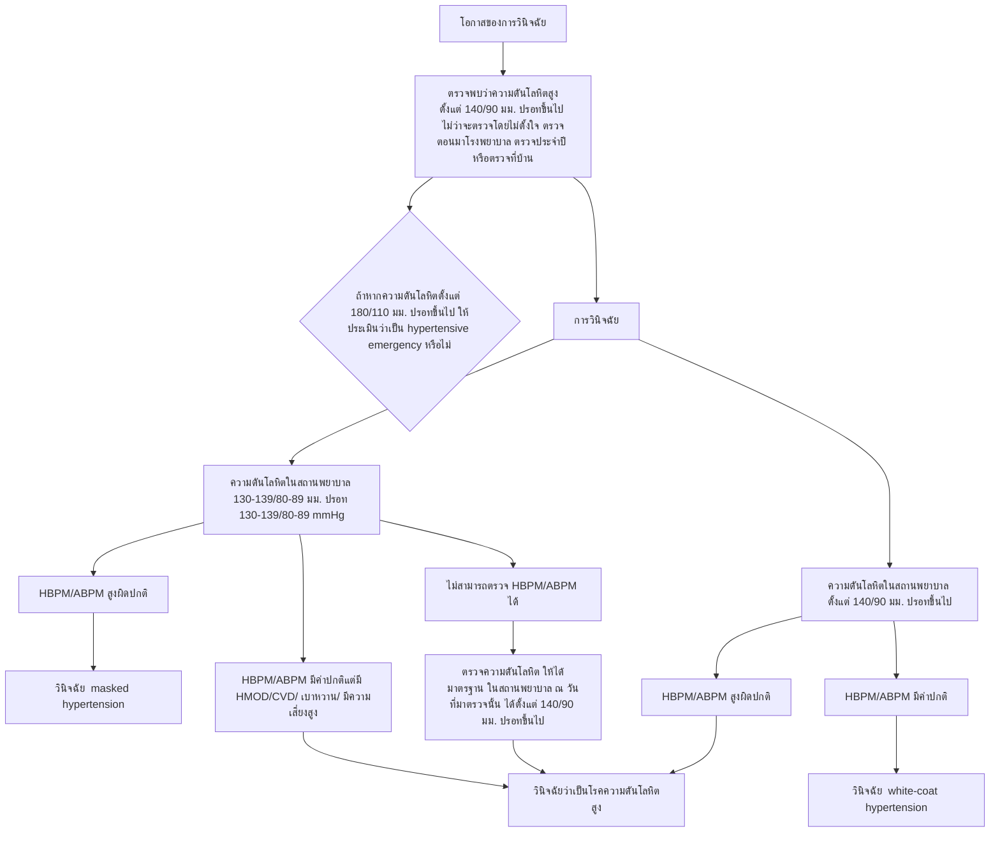
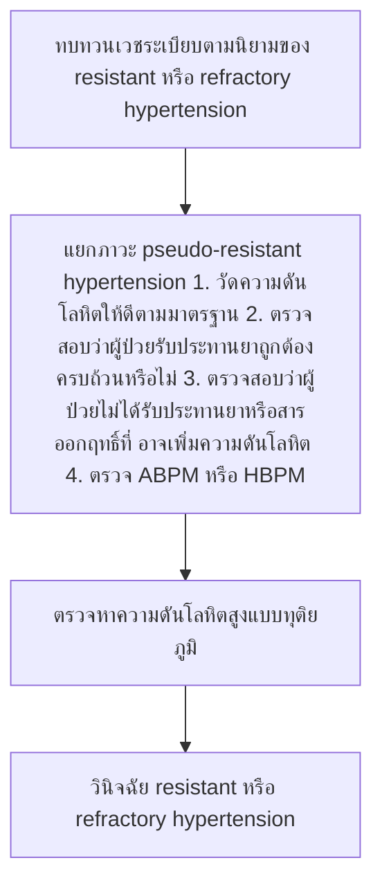

# โรค: ความดันโลหิตสูง (Hypertension)

## แหล่งข้อมูล: Thai Guidelines on the Treatment of Hypertension 2024

2024 Thai Guidelines on the Treatment of Hypertension

## แนวทางการรักษา
## โรคความดัน
## โลหิตสูง

### ในเวชปฏิบัติทั่วไป พ.ศ. 2567

สมาคมความดันโลหิตสูงแห่งประเทศไทย

2024 Thai Guidelines on the Treatment of Hypertension

### แนวทางการรักษาโรคความดันโลหิตสูงในเวชปฏิบัติทั่วไป พ.ศ. 2567
โดยสมาคมความดันโลหิตสูงแห่งประเทศไทย

(2024 Thai Guidelines on the Treatment of Hypertension by the Thai Hypertension Society)

ISBN 978-616-93320-2-2

พิมพ์ครั้งที่ 1

สิงหาคม 2567

จำนวน 2,000 เล่ม

ราคา 400 บาท

#### จัดพิมพ์โดย

สมาคมความดันโลหิตสูงแห่งประเทศไทย (Thai Hypertension Society)
อาคารเฉลิมพระบารมี 50 ปี ชั้น 10

เลขที่ 2 ซอยศูนย์วิจัย
ถนนเพชรบุรีตัดใหม่ ห้วยขวาง บางกะปิ กรุงเทพมหานคร

โทรศัพท์ 0 2716 6448-9

**E-mail**: info@thaihypertension.org

สงวนลิขสิทธิ์ตามพระราชบัญญัติลิขสิทธิ์

#### จัดพิมพ์ที่

โรงพิมพ์ ทริค ธิงค์ 24/5 ถ.นิมมานเหมินทร์ ต.สุเทพ อ.เมือง จ.เชียงใหม่
โทรศัพท์ 08 1288 3908

**E-mail**: trickthink@gmail.com

2024 Thai Guidelines on the Treatment of Hypertension

สมาคมความดันโลหิตสูงแห่งประเทศไทย สงวนลิขสิทธิ์

## แนวทางการรักษา
## โรคความดัน
## โลหิตสูง

### ในเวชปฏิบัติทั่วไป พ.ศ. 2567

สมาคมความดันโลหิตสูงแห่งประเทศไทย

คำนำ ก
คณะผู้จัดทำ ข
คำย่อ ค
คำชี้แจงน้ำหนักคำแนะนำและคุณภาพหลักฐาน ฉ

1. อารัมภบท 1
2. การวัดความดันโลหิต 4
3. การประเมินผู้ป่วยที่เป็นโรคความดันโลหิตสูง 19
4. การป้องกันและควบคุมโรคความดันโลหิตสูงโดยการปรับเปลี่ยนพฤติกรรมชีวิต 24
5. การให้ยารักษาโรคความดันโลหิตสูง 30
6. ความดันโลหิตสูงในผู้ป่วยที่มีโรคร่วม 43
    6.1. การรักษาความดันโลหิตสูงในผู้ป่วยที่เป็นโรคหลอดเลือดหัวใจ 44
    6.2. การรักษาความดันโลหิตสูงในผู้ป่วยที่มีภาวะหัวใจล้มเหลว 47
    6.3. การรักษาความดันโลหิตสูงในผู้ป่วยที่เป็นโรคไตเรื้อรัง 52
    ผู้ป่วยที่เป็นโรคของหลอดเลือดไตและผู้ป่วยที่ได้รับการเปลี่ยนไต
    6.4. การรักษาความดันโลหิตสูงในผู้ป่วยที่เป็นโรคหลอดเลือดสมอง (stroke) 57
    6.5. ผู้ป่วยความดันโลหิตสูงที่มี peripheral artery disease 62
    6.6. การรักษาความดันโลหิตสูงในผู้ป่วยที่เป็นโรคเบาหวาน 63
    6.7. การรักษาความดันโลหิตสูงในผู้ป่วยที่มีโรคของลิ้นหัวใจ 69
    6.8. การรักษาความดันโลหิตสูงในผู้ที่มีโรคอ้วน 70
    6.9. การรักษาความดันโลหิตสูงในผู้ป่วยที่มีภาวะหยุดหายใจ 74
    ขณะหลับจากการอุดกั้น (obstructive sleep apnea)
    6.10. การรักษาความดันโลหิตสูงในผู้ป่วยโรคมะเร็ง 76
    6.11. การรักษาความดันโลหิตสูงในผู้ที่เป็น atrial fibrillation 79
7. การรักษาความดันโลหิตสูงในสตรีตั้งครรภ์ 83
8. การควบคุมความดันโลหิตในผู้ที่จะได้รับการผ่าตัด 88
9. โรคความดันโลหิตสูงในวัยผู้ใหญ่ตอนต้น และ isolated diastolic hypertension 92
10. โรคความดันโลหิตสูงในผู้สูงอายุ และ isolated systolic hypertension 96
11. ความดันโลหิตสูงทุติยภูมิ 102

 
   
     
         12. Resistant และ refractory hypertension 
         108 
     
     
         13. Hypertensive crises 
         120 
     
     
         14. Device-based therapy 
         127 
     
     
         15. การลดความเสี่ยงในผู้ป่วยที่เป็นโรคความดันโลหิตสูง 
         130 
     
     
         16. การใช้ telemedicine เพื่อช่วยคุมความดันโลหิต 
         133 
     
     
         17. ยุทธศาสตร์เพื่อพัฒนาการรักษาและการควบคุมความดันโลหิตสูง 
         135 
     
     
         2024 Thai Guidelines on the Treatment of Hypertension by the Thai Hypertension Society 
         140 
     
     
         References 
         282 
     
   
 

สงวนลิขสิทธิ์
สมาคมความดันโลหิตสูง
แห่งประเทศไทย

ก แนวทางการรักษาโรคความดันโลหิตสูงในเวชปฏิบัติทั่วไป พ.ศ. 2567

โรคความดันโลหิตสูงเป็นภาวะที่พบได้บ่อยที่สุดในเวชปฏิบัติ โดยมีความชุกเพิ่มขึ้นตามอายุที่มากขึ้น ภาวะนี้ต้องได้รับความใส่ใจเป็นพิเศษ เนื่องจากเป็นสาเหตุหลักของภาวะแทรกซ้อนทางหัวใจ หลอดเลือด และไต อย่างไรก็ตาม โรคนี้มักถูกละเลยเพราะส่วนใหญ่ไม่แสดงอาการทางคลินิกที่ชัดเจน ด้วยเหตุนี้ จึงมีการรณรงค์ให้ประชาชนไทย โดยเฉพาะผู้ที่มีอายุ 30 ปีขึ้นไป เข้ารับการตรวจวัดความดันโลหิตอย่างสม่ำเสมอ บุคลากรทางการแพทย์จึงควรศึกษาและติดตามแนวทางการรักษาโรคดังกล่าวอย่างต่อเนื่อง เพื่อนำองค์ความรู้ใหม่ ๆ มาใช้ในการดูแลผู้ป่วยอย่างมีประสิทธิภาพ

ปัจจุบันการใช้เครื่องวัดความดันโลหิตชนิดอัตโนมัติสำหรับใช้ที่บ้านได้รับความนิยมมากขึ้น ผู้ป่วยและญาติควรได้รับคำแนะนำเกี่ยวกับวิธีการวัดความดันโลหิตที่ถูกต้องและน่าเชื่อถือ เพื่อให้แพทย์สามารถนำข้อมูลมาใช้ประกอบการรักษาได้อย่างแม่นยำ นอกจากนี้ บุคลากรทางการแพทย์ควรเน้นย้ำเรื่องการปรับเปลี่ยนพฤติกรรมแก่ผู้ป่วยอย่างสม่ำเสมอ

ในกรณีที่จำเป็นต้องเริ่มการรักษาด้วยยาลดความดันโลหิต แพทย์ควรพิจารณาเลือกใช้ยาให้เหมาะสมกับผู้ป่วยแต่ละราย พร้อมทั้งให้คำแนะนำเกี่ยวกับความสำคัญของการรับประทานยาอย่างต่อเนื่อง นอกเหนือจากการใช้ยา ปัจจุบันยังมีวิธีการรักษาใหม่ ๆ เช่น การจี้เส้นประสาทอัตโนมัติที่ควบคุมการทำงานของไตด้วยไฟฟ้า ซึ่งเป็นทางเลือกสำหรับผู้ป่วยที่ดื้อต่อการรักษาด้วยยา

ท้ายที่สุด ขอแสดงความขอบคุณต่อคณะผู้จัดทำ “แนวทางการรักษาโรคความดันโลหิตสูงในเวชปฏิบัติทั่วไป พ.ศ. 2567” ที่ได้รวบรวมและเรียบเรียงข้อมูลอันมีค่านี้จนสำเร็จเป็นรูปเล่ม ซึ่งจะเป็นประโยชน์อย่างยิ่งต่อแพทย์และบุคลากรทางการแพทย์ในการดูแลรักษาผู้ป่วยโรคความดันโลหิตสูงให้ได้รับประโยชน์สูงสุดต่อไป

ศาสตราจารย์ เกียรติคุณนายแพทย์พีระ บูรณะกิจเจริญ
ที่ปรึกษาสมาคมความดันโลหิตสูงแห่งประเทศไทย
9 กรกฎาคม 2567

แนวทางการรักษาโรคความดันโลหิตสูงในเวชปฏิบัติทั่วไป พ.ศ. 2567 ข

## คณะผู้จัดทำ

### คณะผู้จัดทำ
แนวทางการรักษาโรคความดันโลหิตสูง
ในเวชปฏิบัติทั่วไป พ.ศ. 2567

1. นายแพทย์อภิชาต  สุคนธสรรพ์
2. นายแพทย์ระพีพล  กุญชร ณ อยุธยา
3. นายแพทย์สุรพันธ์  สิทธิสุข
4. นายแพทย์ไพโรจน์  ฉัตรนุกูลชัย
5. แพทย์หญิงวีรนุช  รอบสันติสุข
6. นายแพทย์บัญชา  สถิระพจน์
7. นายแพทย์พงศ์อมร  บุนนาค
8. แพทย์หญิงนิจศรี  ชาญณรงค์
9. แพทย์หญิงสิรกานต์  เตชะวณิช
10. นายแพทย์ตวงสิทธิ์  วัฒกนารา
11. แพทย์หญิงเพียงบุหลัน  ยาปาน
12. แพทย์หญิงสิริสวัสดิ์  คุณานนท์
13. แพทย์หญิงแพรว  โคตรุฉิน
14. นายแพทย์ธาดา  คุณาวิศรุต
15. แพทย์หญิงทรงขวัญ  ศิลารักษ์
16. นายแพทย์ปริญญ์  วาทีสาธกกิจ
17. นายแพทย์ชวลิต  โชติเรืองนภา

ค แนวทางการรักษาโรคความดันโลหิตสูงในเวชปฏิบัติทั่วไป พ.ศ. 2567

* **AASK**: African American Study of Kidney Disease and Hypertension Study
* **ABI**: ankle-brachial Index
* **ABPM**: ambulatory blood pressure monitoring
* **ACCORD**: The Action to Control Cardiovascular Risk in Diabetes
* **ACEIs**: angiotensin converting enzyme inhibitors
* **ADHERE**: Acute Decompensated Heart Failure Registry
* **ADHF**: acute decompensated heart failure
* **AF**: atrial fibrillation
* **AKI**: acute kidney injury
* **AOBP**: automated office blood pressure measurement
* **AR**: aortic regurgitation
* **ARBs**: angiotensin receptor blockers
* **ARNI**: angiotensin receptor-neprilysin inhibitor
* **AS**: aortic stenosis
* **ASCOT-LLA**: The Anglo-Scandinavian Cardiac Outcomes Trial-Lipid Lowering Arm
* **ASCVD**: atherosclerotic cardiovascular disease
* **BMI**: body mass index
* **BP**: blood pressure
* **CAD**: coronary artery disease
* **CCBs**: calcium-channel blockers
* **CKD**: chronic kidney disease
* **COPD**: chronic obstructive pulmonary disease
* **COX-2**: cyclooxygenase-2
* **CPAP**: continuous positive airway pressure
* **CT**: computerized tomographic
* **CTA**: computed tomography angiography
* **CV**: cardiovascular
* **CVD**: cardiovascular disease
* **DASH**: Dietary Approaches to Stop Hypertension

แนวทางการรักษาโรคความดันโลหิตสูงในเวชปฏิบัติทั่วไป พ.ศ. 2567

* **DBP**: diastolic blood pressure
* **DKD**: diabetic kidney disease
* **DM**: diabetes mellitus
* **ECG**: electrocardiogram
* **eGFR**: estimated glomerular filtration rate
* **ESKD**: end-stage kidney disease
* **FDA**: Food and Drug Administration
* **GDMT**: guideline-directed medical therapy
* **GLP1-RAs**: glucagon like peptide 1 receptor agonists
* **HbA1c**: glycated hemoglobin
* **HBPM**: home blood pressure monitoring
* **HCTZ**: hydrochlorothiazide
* **HF**: heart failure
* **HFpEF**: heart failure with preserved ejection fraction
* **HFrEF**: heart failure with reduced ejection fraction
* **HMOD**: hypertension-mediated organ damage
* **IDH**: isolated diastolic hypertension
* **ISH**: isolated systolic hypertension
* **ISH**: international society of hypertension
* **LVEF**: left ventricular ejection fraction
* **MAP**: mean arterial pressure
* **MDRD**: The Modification of Diet in Renal Disease study
* **MI**: myocardial infarction
* **MIBG**: metaiodobenzylguanidine
* **MMSE**: mini-mental state examination
* **MR**: mitral regurgitation
* **MRA**: mineralocorticoid receptor antagonists
* **MRI**: magnetic resonance imaging
* **NCDs**: non-communicable diseases

แนวทางการรักษาโรคความดันโลหิตสูงในเวชปฏิบัติทั่วไป พ.ศ. 2567

* **NSAIDs**: nonsteroidal anti-inflammatory drugs
* **OSA**: obstructive sleep apnea
* **PA**: primary aldosteronism
* **PAD**: peripheral artery disease
* **PARAGON- HF**: prospective comparison of ARNI with ARB global outcomes in heart failure with preserved ejection fraction
* **POCUS**: point of care ultrasonography
* **PPGL**: pheochromocytoma and paraganglioma
* **PSH**: pre-critical symptomatic hypertension
* **PWV**: pulse wave velocity
* **RAAS**: renin-angiotensin-aldosterone system
* **RAS**: renin angiotensin system
* **RCTs**: randomized control trials
* **RDN**: renal denervation therapy
* **SELECT**: semaglutide effects on cardiovascular outcomes in people with overweight or obesity
* **SGLT2i**: selective sodium-glucose cotransporter-2 inhibitor
* **sICH**: spontaneous intracerebral hemorrhage
* **SPC**: single-pill combination
* **SPRINT**: systolic blood pressure intervention trial
* **STEP**: strategy of blood pressure intervention in the elderly hypertensive patients
* **THS**: Thai hypertension society
* **TIA**: transient ischemic attack
* **TIME**: The Treatment in Morning versus Evening
* **TOPCAT**: Treatment of Preserved Cardiac Function Heart Failure with an Aldosterone Antagonist
* **UACR**: urine albumin-to-creatinine ratio
* **VEGF**: vascular endothelial growth factor
* **WHO**: World Health Organization

แนวทางการรักษาโรคความดันโลหิตสูงในเวชปฏิบัติทั่วไป พ.ศ. 2567 ฉ

## คำชี้แจงน้ำหนักคำแนะนำและคุณภาพหลักฐาน

### น้ำหนักคำแนะนำ (Strength of recommendation)

**ระดับ I** หมายถึง “ควรปฏิบัติ” เนื่องจากความมั่นใจของคำแนะนำให้ปฏิบัติอยู่ในระดับสูง มีประโยชน์ต่อผู้ป่วย และมีความคุ้มค่า

**ระดับ IIa** หมายถึง “น่าปฏิบัติ” เนื่องจากความมั่นใจของคำแนะนำให้ปฏิบัติอยู่ในระดับปานกลาง น่าจะมีประโยชน์ต่อผู้ป่วยและน่าจะคุ้มค่า

**ระดับ IIb** หมายถึง “อาจปฏิบัติ” เนื่องจากยังไม่มีความมั่นใจเพียงพอที่จะแนะนำ ยังมีหลักฐานไม่เพียงพอว่าจะเกิดประโยชน์ต่อผู้ป่วย และอาจไม่คุ้มค่า แต่ไม่ก่อให้เกิดอันตรายต่อผู้ป่วย

**ระดับ III** หมายถึง “ไม่ควรปฏิบัติ” หรือ “ห้ามปฏิบัติ” เนื่องจากไม่มีประโยชน์และอาจก่อให้เกิดอันตรายแก่ผู้ป่วย

### คุณภาพหลักฐาน (Quality of evidence)

**A** หมายถึง หลักฐานที่ได้จากการศึกษาทางคลินิกแบบ randomized controlled ที่มีคุณภาพดีหลายการศึกษา หรือ หลักฐานจากการวิเคราะห์แบบ meta-analysis

**B** หมายถึง หลักฐานที่ได้จากการศึกษาทางคลินิกแบบ randomized controlled ที่มีคุณภาพดีอย่างน้อยหนึ่งการศึกษา หรือ การศึกษาแบบ non-randomized controlled ขนาดใหญ่ ซึ่งมีผลประจักษ์ถึงประโยชน์หรือโทษอย่างเด่นชัด

**C** หมายถึง หลักฐานที่ได้จากการศึกษาในลักษณะอื่น ๆ ที่มีคุณภาพดี หรือ การศึกษาย้อนหลังเชิงพรรณนา หรือการศึกษาแบบ registry หรือ ความเห็นพ้องของคณะผู้เชี่ยวชาญบนพื้นฐานประสบการณ์ทางคลินิก

สมาคมความดันโลหิตสูงแห่งประเทศไทย

## แนวทางการรักษาโรคความดันโลหิตสูง
## ในเวชปฏิบัติทั่วไป พ.ศ. 2567

โดยสมาคมความดันโลหิตสูงแห่งประเทศไทย

*สงวนลิขสิทธิ์*
*สมาคมความดันโลหิตสูง*
*แห่งประเทศไทย*

## อารัมภบท

*สงวนลิขสิทธิ์*
*สมาคมความดันโลหิตสูง*
*แห่งประเทศไทย*

2 แนวทางการรักษาโรคความดันโลหิตสูงในเวชปฏิบัติทั่วไป พ.ศ. 2567

## 01 อารัมภบท

สมาคมความดันโลหิตสูงแห่งประเทศไทย ได้นำเสนอแนวทางการรักษาโรคความดันโลหิตสูงของประเทศไทยเป็นครั้งแรกในปี พ.ศ. 2555 แนวทางปฏิบัติฉบับดังกล่าวเป็นแนวทางการรักษาความดันโลหิตสูงฉบับแรกของประเทศไทย ซึ่งได้มีการปรับปรุงครั้งแรกในอีกสามปีต่อมา หลังจากนั้นสมาคมฯ ได้มีการจัดทำแนวทางการรักษาโรคความดันโลหิตสูงของประเทศไทยอีกครั้งหนึ่งในปี พ.ศ. 2562

แม้ว่าในระยะเวลาสิบกว่าปีที่ผ่านมาได้มีการนำเสนอแนวทางปฏิบัติในการรักษาโรคความดันโลหิตสูงที่มีการปรับปรุงให้ทันสมัยจากองค์กรต่าง ๆ ทั้งในและต่างประเทศมาเป็นระยะเป็นจำนวนหลายแนวทางด้วยกัน แต่เป็นที่น่าเสียดายว่าสถานการณ์ในด้านการดูแลรักษาโรคความดันโลหิตสูงของประเทศไทยยังไม่ดีขึ้นอย่างที่ควรจะเป็น ดังนั้นสมาคมความดันโลหิตสูงแห่งประเทศไทยจึงได้จัดทำแนวทางการรักษาโรคความดันโลหิตสูงในเวชปฏิบัติทั่วไป พ.ศ. 2567 ขึ้นมาเพื่อหาทางแก้ไขสถานการณ์ดังกล่าวให้ดีขึ้น โดยแนวทางฉบับนี้ถูกออกแบบให้นำมาใช้ปฏิบัติในบุคคลที่มีอายุตั้งแต่ 18 ปี ขึ้นไปที่มีความดันโลหิตสูงผิดปกติ

สมาคมความดันโลหิตสูงแห่งประเทศไทย ได้ทำการคัดเลือกคณะกรรมการจัดทำแนวทางปฏิบัติฉบับปี พ.ศ. 2567 จากผู้เชี่ยวชาญหลายสาขา โดยคณะกรรมการจัดทำแนวทางดังกล่าวทุกท่านได้แสดงเจตนาเป็นลายลักษณ์อักษรที่จะดำเนินการจัดทำแนวทางปฏิบัติฉบับนี้โดยสุจริต และปราศจากอคติใด ๆ ทั้งสิ้น

คณะกรรมการจัดทำแนวทางปฏิบัติฯ ได้จัดให้มีการประชุมครั้งแรกในวันที่ 9 มิถุนายน 2566 และได้พยายามรวบรวมหลักฐานเชิงประจักษ์ต่าง ๆ จากการทบทวนผลงานวิจัยที่มีความน่าเชื่อถือในระดับสูง และเป็นที่ยอมรับในแวดวงวิชาการมารวบรวมและสร้างเป็นแนวทางปฏิบัติฯ ในครั้งนี้ โดยได้นำเอาหลักฐานที่สำคัญมาอ้างอิงไว้ในบรรณานุกรม

จากข้อมูลที่มีอยู่ในปัจจุบัน แสดงว่าโรคความดันโลหิตสูงสร้างปัญหาและก่อผลกระทบในระดับต่าง ๆ ต่างกันในแต่ละภูมิภาคทั่วโลก และยังมีความเหลื่อมล้ำของระดับความสำเร็จในการควบคุมรักษาโรคดังกล่าวในกลุ่มประเทศที่มีรายได้ต่ำและมีรายได้ปานกลาง เมื่อเปรียบเทียบกับกลุ่มประเทศที่มีรายได้สูง(1)

สำหรับประเทศไทยรายงานการสำรวจสุขภาพของประเทศครั้งที่ 6 ในปี พ.ศ. 2563 ได้แสดงว่าประชากรไทยในวัยผู้ใหญ่มีโรคความดันโลหิตสูงอยู่ถึงร้อยละ 25.4 ซึ่งมากกว่า

สมาคมความดันโลหิตสูงแห่งประเทศไทย สงวนลิขสิทธิ์

แนวทางการรักษาโรคความดันโลหิตสูงในเวชปฏิบัติทั่วไป พ.ศ. 2567 3

ผลจากรายงานการสำรวจทุกครั้งที่ผ่านมาบอกว่าการสำรวจครั้งนี้ ยิ่งไปกว่านั้นรายงานการสำรวจครั้งล่าสุดนี้ยังได้แสดงว่าสัดส่วนประชากรที่เป็นโรคความดันโลหิตสูงที่ตระหนักถึงการวินิจฉัยโรคที่เป็นอยู่ สัดส่วนของผู้ที่เข้ารับการรักษา และสัดส่วนของผู้ที่สามารถควบคุมความดันโลหิตให้ลงมาอยู่ในเกณฑ์ปกติได้มีจำนวนที่ลดลงกว่าการสำรวจครั้งที่ผ่านมา(2)

แม้ว่ากระทรวงสาธารณสุขได้ริเริ่มให้มีการคัดกรองเพื่อค้นหาผู้ที่มีความดันโลหิตสูงในประเทศไทยมาตลอดหลายปีที่ผ่านมา แต่กลับปรากฏว่าสัดส่วนของประชากรที่เป็นโรคความดันโลหิตสูงที่ตระหนักถึงการวินิจฉัยโรคดังกล่าวไม่ได้เพิ่มขึ้นตามที่คาดหมาย

จากข้อมูลที่รวบรวมจากประชากรชาวไทยกว่า 2 หมื่นคนที่เข้าร่วมในโครงการ May Measurement Month ซึ่งเป็นโครงการที่สมาคมความดันโลหิตสูงแห่งประเทศไทย ดำเนินการร่วมกับสมาคมความดันโลหิตสูงระหว่างประเทศ (International Society of Hypertension, ISH) ในปี พ.ศ. 2564 และปี พ.ศ. 2565 แสดงว่าการขาดความตระหนักถึงการเป็นโรคความดันโลหิตสูงของผู้ป่วยไทย ส่วนหนึ่งเกิดจากความไม่มั่นใจในการวินิจฉัยว่าถูกต้องหรือไม่ และเกิดจากความเข้าใจที่คลาดเคลื่อนเกี่ยวกับโรคความดันโลหิตสูงในผู้ป่วยบางกลุ่ม มากกว่าที่จะเกิดจากการไม่ได้รับการคัดกรอง หรือไม่ได้รับการวัดความดันโลหิตอย่างที่ควรจะเป็น ปัญหาที่เกิดขึ้นนี้จะนำไปสู่การวินิจฉัยโรคที่ล่าช้า และนำไปสู่การปฏิเสธการวินิจฉัยว่าเป็นความดันโลหิตสูง

สมาคมความดันโลหิตสูงแห่งประเทศไทย ได้จัดทำแนวทางการรักษาโรคความดันโลหิตสูงในเวชปฏิบัติทั่วไปฉบับใหม่นี้ เพื่อตอบสนองต่อปัญหาที่เกิดขึ้นดังกล่าวอย่างเหมาะสมและพยายามหาวิธีการเพื่อนำมาใช้ปฏิบัติในประเทศไทย ทางคณะกรรมการจัดทำแนวทางปฏิบัติได้ตระหนักดีถึงความจำเป็นที่จะต้องทำให้แนวทางปฏิบัติฉบับนี้มีความเหมาะสมต่อการนำมาใช้ในสถานการณ์จริงของประเทศ และความจำเป็นที่จะต้องใช้หลักฐานจากผลงานวิจัยที่ดีที่สุดมาประมวลให้เป็นแนวทางปฏิบัติฉบับใหม่ที่ดีกว่าเดิม ที่มีความเหมาะสมที่จะนำมาใช้ตามสภาวะของงบประมาณชาติและอุปสรรคต่าง ๆ ที่มีอยู่ในปัจจุบัน

สมาคมความดันโลหิตสูงแห่งประเทศไทย สงวนลิขสิทธิ์

4 แนวทางการรักษาโรคความดันโลหิตสูงในเวชปฏิบัติทั่วไป พ.ศ. 2567

## การวัดความดันโลหิต

*สงวนลิขสิทธิ์ สมาคมความดันโลหิตสูงแห่งประเทศไทย*

แนวทางการรักษาโรคความดันโลหิตสูงในเวชปฏิบัติทั่วไป พ.ศ. 2567 | 5

## 02 การวัดความดันโลหิต

### การวัดความดันโลหิต

การวัดความดันโลหิตอย่างแม่นยำเป็นขั้นตอนพื้นฐานของการวินิจฉัยและรักษาโรคความดันโลหิตสูง แต่เป็นที่น่าเสียดายที่ขั้นตอนนี้ที่สำคัญนี้มักจะถูกมองข้าม(3) และมีบุคลากรทางการแพทย์จำนวนมากที่ยังวัดความดันโลหิตด้วยวิธีที่ไม่เป็นไปตามมาตรฐาน(4,5,6)

การวัดความดันโลหิตแบบมาตรฐานในเวชปฏิบัติมีอยู่ 3 วิธี คือ

1. การวัดความดันโลหิตที่สถานพยาบาล

2. การวัดความดันโลหิตด้วยตนเองที่บ้าน

3. การวัดความดันโลหิตด้วยเครื่องชนิดติดตั้งตัวพร้อมวัดอัตโนมัติ (ambulatory blood pressure measurement หรือ monitoring, ABPM)

ผลของการวัดความดันโลหิตทั้ง 3 วิธี จะมีความแตกต่างกันบ้างในผู้ป่วยความดันโลหิตสูงบางประเภท ดังนั้นแพทย์จึงควรนำผลการตรวจต่างวิธีมาประมวลเข้าด้วยกัน เพื่อช่วยให้การวินิจฉัยและการรักษาความดันโลหิตสูงมีความแม่นยำยิ่งขึ้น ดังนั้นในการวินิจฉัยและติดตามการรักษาโรคความดันโลหิตสูงจึงควรใช้วิธีการตรวจวัดความดันโลหิตได้ทั้งวิธีการตรวจที่สถานพยาบาล วิธีการตรวจที่บ้าน และวิธีการตรวจด้วยเครื่องชนิดติดตั้งตัวพร้อมวัดอัตโนมัติ *(คำแนะนำระดับ I, คุณภาพหลักฐาน A)*

### เครื่องวัดความดันโลหิต

ควรเลือกเครื่องวัดความดันโลหิตที่ได้รับการตรวจสอบมาตรฐานแล้วเท่านั้น *(คำแนะนำระดับ I, คุณภาพหลักฐาน A)* ซึ่งแม้จะมีเครื่องวัดความดันโลหิตอยู่มากมายในท้องตลาด แต่ที่ได้รับมาตรฐานจริงๆ มีไม่ถึงร้อยละ 10(6) ผู้ใช้งานอาจตรวจสอบเครื่องวัดความดันโลหิตว่าผ่านการตรวจสอบมาตรฐานแล้วหรือไม่จาก websites ต่อไปนี้ www.stridebp.org, www.bihsoc.org/bp-monitors, และ www.validatebp.org เป็นต้น

เครื่องวัดความดันโลหิตที่ใช้ในสถานพยาบาลทั้งแบบปกติและแบบ ABPM ควรจะได้รับการตรวจสอบความแม่นยำอย่างน้อยปีละครั้ง ส่วนเครื่องวัดความดันโลหิตด้วยตนเองที่บ้านอาจไม่จำเป็นต้องตรวจสอบบ่อยนัก การบริการตรวจสอบความแม่นยำนี้อาจขอรับได้จากบริษัทผู้ผลิตเครื่องวัดความดันโลหิต หรือจากกรมวิทยาศาสตร์การแพทย์ กระทรวงสาธารณสุขก็ได้

6 แนวทางการรักษาโรคความดันโลหิตสูงในเวชปฏิบัติทั่วไป พ.ศ. 2567

อุปกรณ์พันรอบแขน (arm cuff) ของเครื่องวัดความดันโลหิตที่เลือกใช้ควรจะมีขนาดที่เหมาะสมกับเส้นรอบวงแขนตอนบนของผู้ที่จะรับการวัดความดันโลหิต โดยส่วนที่เป็นถุงลมในอุปกรณ์พันรอบแขน สำหรับเครื่องวัดความดันโลหิตที่ตรวจโดยใช้วิธีการฟังเสียง ควรจะยาวพอที่จะพันรอบวงแขนได้ราวร้อยละ 70 ถึง ร้อยละ 80 ดังแสดงในตารางที่ 1 แต่สำหรับเครื่องวัดความดันแบบอัตโนมัตินั้น บริษัทผู้ผลิตมักจะจัดทำ "wide-range cuffs" ซึ่งจะครอบคลุมเส้นรอบวงแขนได้เป็นส่วนใหญ่ (ตั้งแต่ 22 เซนติเมตร ไปจนถึง 42 เซนติเมตร) แต่อย่างไรก็ตามในการตรวจบุคคลที่มีรูปร่างอ้วนมากก็จำเป็นต้องใช้อุปกรณ์พันรอบแขนที่มีขนาดใหญ่พิเศษ

ตารางที่ 1 ขนาดของอุปกรณ์พันรอบแขนของเครื่องวัดความดันโลหิตที่เหมาะสมตามขนาดของรอบวงแขนตอนบนของผู้ที่จะรับการตรวจ

 
   
     
         ขนาดของอุปกรณ์พันรอบแขน 
         เส้นรอบวงของแขนตอนบนของผู้ที่จะรับการตรวจ (เซนติเมตร) 
         ขนาดของถุงลมในอุปกรณ์พันรอบแขน (เซนติเมตร) 
     
   
   
     
         เล็ก 
         22 ถึง 26 
         12 คูณ 22 
     
     
         กลาง (สำหรับผู้ใหญ่ทั่วไป) 
         27 ถึง 34 
         16 คูณ 30 
     
     
         ใหญ่ 
         35 ถึง 44 
         16 คูณ 36 
     
     
         ใหญ่พิเศษ 
         45 ถึง 52 
         16 คูณ 42 
     
   
 

## การเตรียมการวัดความดันโลหิต

ผู้ที่จะรับการวัดความดันโลหิตควรจะได้รับคำแนะนำไม่ให้สูบบุหรี่ ไม่ดื่มเครื่องดื่มที่มีคาเฟอีน และไม่ออกกำลังกายเป็นเวลาอย่างน้อย 30 นาที ก่อนการตรวจ ถ้ามีอาการปวดปัสสาวะควรไปปัสสาวะก่อน

ห้องที่ใช้วัดความดันโลหิตควรจะไม่มีเสียงดังและมีสิ่งแวดล้อมที่สุขสบาย ผู้ที่จะรับการวัดความดันโลหิตควรจะได้นั่งพักบนเก้าอี้ที่มีพนักพิงอย่างน้อย 3 ถึง 5 นาที ก่อนจะได้รับการตรวจวัดความดันโลหิต โดยวางแขนบนโต๊ะที่มีขนาดความสูงพอที่จะทำให้แขนส่วนบนอยู่ในระนาบเดียวกันกับระดับหัวใจ และวางเท้าทั้งสองข้างราบอยู่กับพื้น โดยห้ามไม่ให้นั่งไขว่ห้าง ห้ามไม่ให้กำมือหรือเกร็งแขน นอกจากนี้ก่อนที่จะทำการวัดความดันโลหิตและระหว่างการวัดความดันโลหิตไม่ควรมีการพูดคุยกันทั้งผู้ตรวจและผู้ที่ได้รับการตรวจ (ภาพที่ 1)

การไม่ทำตามวิธีการดังกล่าวอย่างเข้มงวดอาจทำให้ความดันโลหิตที่วัดได้สูงเกินจริงได้ระหว่าง 3 ถึง 5 มม. ปรอท ทำให้การวินิจฉัยผิดพลาดได้

แนวทางการรักษาโรคความดันโลหิตสูงในเวชปฏิบัติทั่วไป พ.ศ. 2567 | 7

ภาพที่ 1 การเตรียมการวัดความดันโลหิต

### การวัดความดันโลหิตในสถานพยาบาล

แนวทางการวินิจฉัยและรักษาความดันโลหิตสูงเกือบทั้งหมดถูกอ้างอิงมาจากการศึกษาทางคลินิก ที่ใช้วิธีการวัดความดันโลหิตในสถานพยาบาล ซึ่งมีเทคนิคที่ใช้วัดอยู่ 2 แบบ คือ auscultatory technique และ oscillometric technique

วิธีการตรวจแบบ auscultatory ใช้วิธีการฟังเสียง เป็นวิธีการตรวจแบบดั้งเดิม ซึ่งใช้เป็นมาตรฐานในการอ้างอิงวิธีการตรวจแบบอื่น ๆ ที่ตามมาในภายหลัง การตรวจด้วยวิธีการนี้จำเป็นจะต้องมีการฝึกอบรมเป็นรายบุคคล และต้องมีการให้ความร่วมมือในระยะยาว เนื่องจากขั้นตอนการตรวจจะต้องใช้เวลาและทักษะพอสมควร ดังนั้นจึงมีการนำเอาวิธีการตรวจแบบ oscillometric ซึ่งง่ายกว่ามาใช้ทดแทนมากขึ้นตามลำดับ

สมาคมความดันโลหิตสูงแห่งประเทศไทย แนะนำให้บุคลากรทางการแพทย์ทุกระดับใช้ความระมัดระวังในทุกขั้นตอนของการตรวจวัดความดันโลหิตแบบ auscultatory โดยมีขั้นตอนสำคัญ 7 ขั้นตอน ดังต่อไปนี้

#### ขั้นตอนที่ 1

นำเอาอุปกรณ์พันรอบแขนขนาดที่เหมาะสมมาพันรอบแขนตอนบนของผู้ที่จะรับการวัดความดันโลหิต โดยให้ขอบล่างของอุปกรณ์อยู่สูงกว่า antecubital fossa ประมาณ 2-3 เซนติเมตร เพื่อให้มีพื้นที่สำหรับวาง stethoscope

สมาคมความดันโลหิตสูงแห่งประเทศไทย สงวนลิขสิทธิ์

8 แนวทางการรักษาโรคความดันโลหิตสูงในเวชปฏิบัติทั่วไป พ.ศ. 2567

### ขั้นตอนที่ 2
จัดเครื่องหมายที่อยู่บนอุปกรณ์พันรอบแขนให้ตรงกับตำแหน่งของหลอดเลือดแดง brachial

### ขั้นตอนที่ 3
ประเมินความดันโลหิตซิสโตลิกอย่างคร่าว ๆ โดยการเพิ่มแรงดันในอุปกรณ์พันรอบแขนขึ้น ขณะที่ผู้ตรวจคลำชีพจร brachial อยู่จนกระทั่งคลำชีพจรไม่ได้ จากนั้นค่อย ๆ ลดแรงดันในอุปกรณ์พันรอบแขนลงมาช้า ๆ ประมาณ 2 ถึง 3 มม. ปรอทต่อวินาที จนคลำชีพจรได้อีก ค่าความดันโลหิตซิสโตลิกของผู้รับการวัดความดันโลหิตจะอยู่ที่ระดับความดันที่อ่านได้นี้

### ขั้นตอนที่ 4
รออย่างน้อย 1 นาที เพื่อให้การไหลเวียนโลหิตของแขนข้างนั้นคืนสู่ปกติก่อนจะเริ่มขั้นตอนที่ 5 โดยระหว่างนี้อาจตรวจชีพจรดูความสม่ำเสมอและนับอัตราเต้นของชีพจรไปก่อน

### ขั้นตอนที่ 5
วางหูฟังลงบนตำแหน่งหลอดเลือดแดง brachial แล้วเพิ่มแรงดันในอุปกรณ์พันรอบแขนขึ้นไปจนสูงกว่าระดับประเมินของความดันโลหิตซิสโตลิกที่ตรวจได้จากขั้นตอนที่ 3 ประมาณ 20 ถึง 30 มม. ปรอท แล้วค่อย ๆ ลดแรงดันลงมาช้า ๆ ประมาณ 2 ถึง 3 มม. ปรอทต่อวินาที พร้อมกับตรวจฟัง Korotkoff sound ไปด้วย โดยเสียงแรกที่จะได้ยิน คือ Korotkoff sound phase ที่ 1 ซึ่งจะตรงกับระดับความดันโลหิตซิสโตลิก เมื่อแรงดันลดลงมาจนกระทั่งเสียง Korotkoff sound หายไปจะเรียกว่าเป็น Korotkoff sound phase ที่ 5 ซึ่งระดับความดันโลหิตขณะนั้นจะตรงกับความดันโลหิตไดแอสโตลิก

### ขั้นตอนที่ 6
เป็นขั้นตอนเพิ่มเติมในผู้ป่วยโรคเบาหวาน ผู้สูงอายุ หรือผู้ที่มีอาการที่เกิดจากการเปลี่ยนท่าทางของร่างกาย *(คำแนะนำระดับ IIa, คุณภาพหลักฐาน C)* โดยจะทำการวัดความดันโลหิตในท่านอนก่อน หลังจากนั้นให้ผู้รับการวัดความดันโลหิตยืนขึ้นและวัดความดันโลหิตหลังจากยืน 1 นาที และ 3 นาที ตามลำดับ ถ้าหากพบว่าความดันโลหิตลดลงมาจากท่านอนตั้งแต่ 20/10 มม. ปรอท ขึ้นไป ให้วินิจฉัยว่ามีภาวะ orthostatic hypotension(7)

### ขั้นตอนที่ 7
ในผู้ป่วยที่มีหัวใจเต้นผิดจังหวะ การวัดความดันด้วยวิธี auscultatory น่าจะให้ผลลัพธ์ดีกว่าวิธีอื่น *(คำแนะนำระดับ IIa, คุณภาพหลักฐาน C)* โดยจะต้องวัดหลายครั้งและนำเอาค่าที่ได้มาเฉลี่ย

แนวทางการรักษาโรคความดันโลหิตสูงในเวชปฏิบัติทั่วไป พ.ศ. 2567 9

ในปัจจุบันเครื่องวัดความดันโลหิตแบบ oscillometric จะมีระบบแจ้งเตือนความเป็นไปได้ที่จะมีหัวใจเต้นผิดจังหวะ เช่น atrial fibrillation ขึ้นบนหน้าจอให้เห็นได้

เนื่องจากการตรวจวัดความดันโลหิตด้วยวิธี auscultatory มีรายละเอียดทางเทคนิคค่อนข้างมาก จึงทำให้ปัจจุบันมีการนำเอาวิธีวัดความดันแบบ oscillometric มาแทนอย่างแพร่หลาย โดยเมื่อผู้ตรวจใช้อุปกรณ์พันรอบแขน พันรอบแขนตอนบนของผู้รับการตรวจอย่างเหมาะสมแล้ว เพียงกดปุ่มเริ่มต้นที่เครื่องตรวจ เครื่องก็จะเพิ่มและลดแรงดันในอุปกรณ์พันรอบแขนเองโดยอัตโนมัติพร้อมกับจับสัญญาณชีพจร นำมาคำนวณเป็นค่าความดันโลหิตแสดงขึ้นที่หน้าจอทั้งค่าความดันโลหิตซิสโตลิกและไดแอสโตลิก รวมทั้งอัตราเต้นของชีพจร ซึ่งในอุปกรณ์บางรุ่นจะสามารถกำหนดให้วัดความดันได้มากกว่า 1 ครั้ง และคำนวณค่าเฉลี่ยของความดันโลหิตแสดงผลบนหน้าจอได้

การตรวจด้วยวิธี oscillometric จะช่วยลดปัญหาของการเลือกรายงานตัวเลขเต็มสิบ (digital preference) ที่มักจะรายงานเป็น 140/100 หรือ 150/90 มม. ปรอท เป็นต้น ทั้ง ๆ ที่ค่าจริงอาจสูงหรือต่ำกว่านี้ ปัญหาของการเลือกรายงานตัวเลขนี้มักจะเกิดขึ้นจากการวัดความดันโลหิตด้วยวิธี auscultatory ของบุคลากรทางการแพทย์(4)

การตรวจความดันโลหิตในสถานพยาบาลของผู้ที่มารับการตรวจครั้งแรกควรใช้เครื่องตรวจอัตโนมัติวัดความดันโลหิตจากแขนทั้งสองข้างพร้อมกัน (คำแนะนำระดับ I, คุณภาพหลักฐาน A) โดยหากตรวจแล้วพบว่าค่าความดันโลหิตซิสโตลิกของแขนทั้งสองข้างต่างกันมากกว่า 10 มม. ปรอท แนะนำให้ใช้ระดับความดันโลหิตจากแขนข้างที่สูงกว่าในการวินิจฉัยและประเมินครั้งต่อ ๆ ไป แต่ถ้าหากค่าความดันโลหิตจากแขนสองข้างต่างกันเกินกว่า 15 ถึง 20 มม. ปรอท แสดงว่าบุคคลนั้นอาจมีภาวะ atherosclerosis หรือโรคของหลอดเลือดแดงของแขน และควรพิจารณาให้การตรวจเพิ่มเติมต่อไป

การตรวจวัดความดันโลหิตด้วยเครื่องอัตโนมัติในห้องตรวจที่เงียบสงบ และไม่มีบุคลากรทางการแพทย์อยู่ในห้อง เป็นการตรวจที่เรียกว่า unattended automated office blood pressure measurement (AOBP) การตรวจวิธีนี้จะช่วยลดผลตรวจความดันโลหิตที่สูงเกินจริงในสถานพยาบาล (white-coat effect) ลงได้อย่างมาก แต่ระดับของความดันโลหิตที่ตรวจด้วยวิธีการนี้ที่จะใช้วินิจฉัยโรคความดันโลหิตสูงหรือใช้เป็นระดับเป้าหมายของการรักษาความดันโลหิตยังไม่ชัดเจนว่าควรจะต่ำกว่าระดับของความดันโลหิตที่วัดแบบปกติเท่าใด อย่างไรก็ตามวิธีการตรวจแบบ unattended AOBP นี้่น่าจะทำได้ยากในประเทศไทยด้วยข้อจำกัดหลายประการ ดังนั้นจึงควรปฏิบัติตามแนวทางมาตรฐานของการวัดความดันโลหิตในสถานพยาบาล เพื่อให้ได้ค่าของความดันโลหิตที่เชื่อถือได้ (คำแนะนำระดับ I, คุณภาพหลักฐาน A)

10 แนวทางการรักษาโรคความดันโลหิตสูงในเวชปฏิบัติทั่วไป พ.ศ. 2567

## การวัดความดันโลหิตด้วยตนเองที่บ้าน home blood pressure measurement หรือ monitoring, HBPM)

ปัจจุบันเครื่องวัดความดันโลหิตแบบอัตโนมัติมีราคาถูกลงกว่าแต่ก่อนมากทำให้การวัดความดันโลหิตที่บ้านทำได้ง่ายขึ้น วิธีการดังกล่าวจะช่วยลดปัญหา white-coat effect และช่วยวินิจฉัย masked hypertension ได้ นอกจากนี้ในผู้ป่วยความดันโลหิตสูงที่ได้รับยารักษาอยู่ การใช้ HBPM จะช่วยทำให้ผู้ป่วยรับประทานยาอย่างต่อเนื่องและสม่ำเสมอมากยิ่งขึ้น ซึ่งจะทำให้การควบคุมความดันโลหิตดีขึ้นกว่าเดิม ดังนั้นจึงแนะนำให้ใช้ HBPM ในผู้ป่วยความดันโลหิตสูงทุกรายที่ได้รับยาลดความดันโลหิต (คำแนะนำระดับ I, คุณภาพหลักฐาน A) ยกเว้นในผู้ที่ไม่สามารถวัดความดันด้วยตนเองและไม่มีผู้ที่จะช่วยวัดให้ได้ที่บ้าน

เครื่องวัดความดันโลหิตที่แนะนำให้ใช้ที่บ้าน คือ เครื่องแบบ oscillometric ที่วัดบริเวณแขนตอนบนที่ได้มาตรฐาน (คำแนะนำระดับ I, คุณภาพหลักฐาน A) และไม่ควรเลือกใช้เครื่องที่วัดความดันโลหิตจากข้อมือหรือนิ้วมือ ยกเว้นไม่มีทางเลือกจริงๆ เช่น ในผู้ป่วยที่อ้วนมากจนวัดความดันโลหิตจากแขนตอนบนไม่ได้

ปัจจุบันมีการพัฒนาเครื่องวัดความดันโลหิตโดยไม่ต้องใช้อุปกรณ์พันรอบแขนอยู่หลายวิธีแต่เนื่องจากยังไม่มีการกำหนดมาตรฐานอย่างแน่นอน จึงยังไม่แนะนำให้ใช้ทางคลินิก (คำแนะนำระดับ III, คุณภาพหลักฐาน C)

การวัดความดันโลหิตที่บ้านจำเป็นที่จะต้องมีการให้คำแนะนำทั้งตัวผู้ป่วยเอง หรือผู้ที่ให้การดูแลผู้ป่วย เพื่อให้การวัดเป็นไปอย่างถูกต้องตามมาตรฐาน และมีความถี่ของการวัดตามที่กำหนดในตารางที่ 2

ตารางที่ 2 ความถี่ของการวัดความดันโลหิตด้วยตนเองที่บ้านที่เหมาะสม

 
   
     
         ข้อบ่งชี้และสถานะ 
         ความถี่ของการวัดความดันโลหิต 
     
   
   
     
         เพื่อการวินิจฉัยโรคความดันโลหิตสูง 
         ควรวัดติดต่อกันเป็นเวลา 7 วัน หรือหากต้องการวินิจฉัยเร่งด่วนก็ควรวัดติดต่อกันเป็นเวลาอย่างน้อย 3 วัน 
     
     
         เพื่อติดตามการรักษาระหว่างการใช้ยาและการปรับยาลดความดันโลหิต 
         ควรวัดความดันโลหิตติดต่อกัน 7 วัน โดยเริ่มวัดหลังจากเริ่มยาหรือปรับขนาดยาไปแล้ว 2 สัปดาห์ และวัดอีกรอบหนึ่งติดต่อกัน 3 วัน ในสัปดาห์ก่อนที่จะถึงวันนัดพบแพทย์ 
     
     
         เพื่อติดตามระยะยาวในรายที่คุมความดันโลหิตได้แล้ว 
         ควรวัดความดันโลหิตสัปดาห์ละหนึ่งหรือสองครั้งหรือวัดความดันโลหิต 7 วัน ก่อนมาพบแพทย์แต่ละครั้ง และถ้าแพทย์นัดนาน ๆ ครั้งควรวัดความดันโลหิตอย่างน้อย 7 วัน ทุก ๆ 3 เดือน 
     
   
 

แนวทางการรักษาโรคความดันโลหิตสูงในเวชปฏิบัติทั่วไป พ.ศ. 2567 | 11

สำหรับการวัดความดันโลหิตในแต่ละวันควรจะวัดเป็นสองรอบ คือ รอบเช้าและรอบค่ำ โดยการวัดรอบเช้าควรจะวัดภายใน 1 ชั่วโมง หลังจากตื่นนอน และไปปัสสาวะเรียบร้อยแล้ว โดยวัดก่อนรับประทานยาและก่อนอาหารมื้อเช้า ส่วนการวัดรอบค่ำควรจะเป็นเวลาก่อนนอน ในการวัดแต่ละรอบควรจะวัดรอบละอย่างน้อย 2 ครั้ง โดยแต่ละครั้งห่างกัน 1 นาที และบันทึกความดันโลหิตของการวัดทุกครั้งไว้ โดยไม่มีการคัดออกและนำมาให้แพทย์พิจารณาในวันนัดตรวจ

การประเมินความดันโลหิตที่บ้านจะใช้ค่าเฉลี่ยของทั้งความดันโลหิตตอนเช้าและตอนค่ำ ผู้ที่ใช้เครื่องวัดความดันโลหิตด้วยตนเองควรเข้าใจประเด็นเกี่ยวกับธรรมชาติความแปรปรวนของความดันโลหิต และไม่แนะนำให้ปรับยาลดความดันด้วยตนเองและหากผู้ป่วยรายใดมีความวิตกกังวลหรือเครียดจากผลการตรวจ HBPM มากเกินไปก็ควรแนะนำให้เลิกตรวจได้

ความดันโลหิตที่วัดได้จาก HBPM จะต่ำกว่าที่วัดได้ในสถานพยาบาล ดังนั้นการใช้ระดับความดันโลหิตที่วัดจาก HBPM เพื่อการตัดสินการวินิจฉัย และกำหนดเป้าหมายการรักษาจะต่ำกว่าระดับที่วัดจากสถานพยาบาลเล็กน้อย รายละเอียดเพิ่มเติมเกี่ยวกับ HBPM สามารถอ่านเพิ่มเติมได้ในแนวทางปฏิบัติของสมาคมความดันโลหิตสูงแห่งประเทศไทยเกี่ยวกับเรื่องนี้ ซึ่งได้รับการตีพิมพ์ในปี พ.ศ. 2565(8)

### การวัดความดันโลหิตด้วยเครื่องชนิดติดตัวพร้อมวัดอัตโนมัติ (ABPM)

ABPM เป็นการวัดความดันโลหิตเป็นระยะตลอดทั้งวัน โดยผู้ที่ได้รับการตรวจจะอยู่ในสิ่งแวดล้อมตามปกตินอกสถานพยาบาล เครื่อง ABPM จะมีอุปกรณ์พันรอบแขนติดอยู่กับแขนข้างหนึ่งของผู้ได้รับการตรวจ ซึ่งมักจะเป็นแขนข้างที่ไม่ถนัดใช้งาน และเครื่องจะถูกตั้งให้วัดความดันโลหิตอย่างอัตโนมัติทุก 20 ถึง 30 นาที (ภาพที่ 2)

1) อุปกรณ์พันรอบแขน

2) ท่อลมเชื่อมต่อ

3) เครื่องวัดความดันโลหิต

ภาพที่ 2 การวัดความดันโลหิตด้วยเครื่องชนิดติดตัวพร้อมวัดอัตโนมัติ (ABPM)

สมาคมความดันโลหิตสูงแห่งประเทศไทย สงวนลิขสิทธิ์

12 แนวทางการรักษาโรคความดันโลหิตสูงในเวชปฏิบัติทั่วไป พ.ศ. 2567

ABPM มีประโยชน์ในการป้องกัน white-coat effect และช่วยวินิจฉัย masked hypertension ได้เช่นเดียวกับ HBPM แต่มีประโยชน์เหนือกว่าที่สามารถบันทึกความดันโลหิตตอนกลางคืนขณะนอนหลับ บันทึกการเพิ่มขึ้นของความดันโลหิตขณะตื่นนอนตอนเช้า (morning BP surge) และบันทึกความดันโลหิตได้ตลอดวัน จึงนำผลมาประเมินความแปรปรวนของความดันโลหิต (BP variability) ได้

ค่าความดันโลหิตจะมีความแตกต่างกันในช่วงเวลากลางวันและช่วงเวลากลางคืนเป็นลักษณะ diurnal pattern ซึ่งจะมีรูปแบบต่างกันในแต่ละบุคคล ดังแสดงในตารางที่ 3 ในคนปกติความดันโลหิตตอนกลางคืนจะลดลงจากตอนกลางวันตั้งแต่ร้อยละ 10 ไปถึงร้อยละ 20 จัดเป็นลักษณะที่เรียกว่า normal dipping บุคคลที่มีความดันโลหิตกลางคืนลดน้อยกว่านี้ ไม่ลดลง หรือเพิ่มขึ้นจะมีความเสี่ยงต่อโรคหัวใจและหลอดเลือดเพิ่มขึ้น(9,10)

นอกจากนี้ระดับของความดันโลหิตในตอนกลางคืนก็มีความสำคัญ โดยที่หากค่าเฉลี่ยของความดันโลหิตตอนกลางคืนอยู่ตั้งแต่ 120/70 มม. ปรอทขึ้นไป จะถือว่ามีภาวะ nocturnal hypertension ซึ่งจะเพิ่มความเสี่ยงต่อการเกิดโรคหัวใจและหลอดเลือด(9) ระดับความดันโลหิตตอนกลางคืนจะสัมพันธ์กับการเกิดปัญหาทางด้านหัวใจและหลอดเลือดมากกว่าระดับความดัน

โลหิตตอนกลางวัน และมากกว่าระดับความดันโลหิตที่สถานพยาบาล(10)

ในปัจจุบันการตรวจ ABPM ในประเทศไทยยังมีค่อนข้างน้อย โดยจะมีเฉพาะในโรงพยาบาลขนาดใหญ่ ดังนั้นแพทย์ผู้ดูแลผู้ป่วยความดันโลหิตสูงจึงควรหาทางให้มีการเพิ่มการบริการด้านนี้ในอนาคต สรุปคำแนะนำสำคัญเกี่ยวกับการวัดความดันโลหิต แสดงในตารางที่ 4

มีการศึกษาในประเทศไทยพบว่า ผู้ป่วยความดันโลหิตสูงที่รักษาในโรงพยาบาลถึงร้อยละ 74 มีลักษณะความดันโลหิตเป็นแบบ reduced dipping หรือ แบบ rising(11) ดังนั้นจึงชี้ถึงความจำเป็นที่จะต้องหาทางประเมินความดันโลหิตตอนกลางคืนในผู้ป่วยความดันโลหิตสูงชาวไทยด้วย

การตรวจ ABPM ยังมีประโยชน์ในการตรวจหาภาวะความดันโลหิตต่ำเกินไปจากการรักษา หรือความแปรปรวนของความดันโลหิตจากภาวะ autonomic failure ตลอดจนใช้ประเมินในกรณีที่มีความขัดแย้งกันมากระหว่างผลการตรวจความดันโลหิตที่สถานพยาบาลกับผลตรวจจากการวัดที่บ้าน ดังนั้นจึงแนะนำให้ใช้เครื่องวัดความดันโลหิตชนิดติดตัวพร้อมวัดอัตโนมัติเพื่อดู diurnal BP pattern, morning BP surge, และ BP variability (คำแนะนำระดับ I, คุณภาพหลักฐาน A)

แนวทางการรักษาโรคความดันโลหิตสูงในเวชปฏิบัติทั่วไป พ.ศ. 2567 | 13

### ตารางที่ 3 ลักษณะ diurnal patterns ของความดันโลหิตที่ตรวจได้จากเครื่องวัดความดันโลหิตชนิดติดตัวพร้อมวัดอัตโนมัติ (ABPM)

 
   
     
         ลักษณะที่พบ 
         การเปลี่ยนแปลงของความดันโลหิตในตอนกลางคืนเทียบกับตอนกลางวัน 
         ความเสี่ยงต่อโรคหัวใจและหลอดเลือด 
     
   
   
     
         Normal dipping 
         ลดลงมากกว่าร้อยละ 10 แต่ลดไม่เกินร้อยละ 20 
         ไม่เพิ่มความเสี่ยง 
     
     
         Extreme dipping 
         ลดลงมากกว่าร้อยละ 20 
         อาจเพิ่มความเสี่ยง 
     
     
         Reduced dipping 
         ลดลงเพียงร้อยละ 1 ถึง ร้อยละ 10 
         เพิ่มความเสี่ยง 
     
     
         Rising 
         ความดันโลหิตกลางคืนเพิ่มมากกว่าตอนกลางวัน 
         เพิ่มความเสี่ยง 
     
   
 

### ตารางที่ 4 คำแนะนำในการวัดความดันโลหิต

 
   
     
         คำแนะนำ 
         ระดับของคำแนะนำ 
         คุณภาพของหลักฐานสนับสนุน 
     
   
   
     
         ในการวินิจฉัย และติดตามการรักษาโรคความดันโลหิตสูงควรใช้วิธีการตรวจวัดความดันโลหิตได้ทั้งวิธีการตรวจที่สถานพยาบาล วิธีการตรวจที่บ้าน และวิธีการตรวจด้วยเครื่องชนิดติดตัวพร้อมวัดอัตโนมัติ 
     
     
         ควรใช้เครื่องวัดความดันโลหิตที่ได้รับการตรวจสอบมาตรฐานแล้ว และใช้อุปกรณ์พันรอบแขนตอนบนที่มีขนาดได้มาตรฐานในการวัดความดันโลหิต 
     
     
         ควรปฏิบัติตามแนวทางมาตรฐานของการวัดความดันโลหิตเพื่อให้ได้ค่าของความดันโลหิตที่เชื่อถือได้ 
     
   
 

14 แนวทางการรักษาโรคความดันโลหิตสูงในเวชปฏิบัติทั่วไป พ.ศ. 2567

 
   
     
         คำแนะนำ 
         ระดับของคำแนะนำ 
         คุณภาพของหลักฐานสนับสนุน 
     
   
   
     
         ในการตรวจครั้งแรกควรทำการวัดความดันโลหิตจากแขนทั้งสองข้างในเวลาเดียวกัน ถ้าพบความแตกต่างของความดันโลหิตมากกว่า 10 มม. ปรอท ให้ตรวจซ้ำเพื่อยืนยันและถ้ายังได้ผลเช่นเดิมให้ใช้ค่าความดันโลหิตจากแขนข้างที่ความดันโลหิตสูงกว่าในการวินิจฉัยและประเมินต่อไป ถ้าพบความแตกต่างของความดันโลหิตมากกว่า 15 มม. ปรอท ไปถึง 20 มม. ปรอท น่าจะตรวจหาโรคของหลอดเลือดแดงเพิ่มเติม 
     
     
         น่าจะมีการประเมินภาวะ orthostatic hypotension ในผู้ป่วยที่เป็นโรคเบาหวาน ผู้สูงอายุ หรือผู้ที่มีอาการ orthostatic 
         IIa 
     
     
         น่าจะวัดความดันโลหิตด้วยวิธี auscultatory ในผู้ป่วยที่มีหัวใจเต้นผิดจังหวะ และควรวัดความดันโลหิตหลาย ๆ ครั้ง เพื่อนำมาหาค่าเฉลี่ย เนื่องจากบุคคลเหล่านี้จะมีความแปรปรวนของความดันโลหิตได้มากกว่าบุคคลทั่วไป 
         IIa 
     
     
         ควรให้ผู้ที่ได้รับยาลดความดันโลหิตสูงทุกรายมีการตรวจวัดความดันโลหิตที่บ้าน เพื่อช่วยให้มีการรับประทานยาถูกต้องแม่นยำและต่อเนื่องมากขึ้น ช่วยวินิจฉัย white-coat effect และ masked uncontrolled hypertension โดยให้วัดความดันโลหิตจากแขนตอนบน และให้ใช้การวัดจากข้อมือเฉพาะเมื่อจำเป็นเท่านั้น เช่น ในผู้ที่อ้วนมาก ๆ 
     
     
         ไม่แนะนำให้ใช้เครื่องวัดความดันโลหิตแบบ cuffless ในการวินิจฉัยหรือประเมินการรักษาโรคความดันโลหิตสูง 
         III 
     
     
         ควรใช้เครื่องวัดความดันโลหิตชนิดติดตัวพร้อมวัดอัตโนมัติ เพื่อดู diurnal BP pattern, morning BP surge, และ BP variability 
     
   
 

แนวทางการรักษาโรคความดันโลหิตสูงในเวชปฏิบัติทั่วไป พ.ศ. 2567 | 15

## นิยามความดันโลหิตสูง

หมายถึง ภาวะที่ระดับความดันโลหิตซิสโตลิกมีค่าตั้งแต่ 140 มม. ปรอทขึ้นไป และ/หรือ ความดันโลหิตไดแอสโตลิกมีค่าตั้งแต่ 90 มม. ปรอทขึ้นไป โดยอ้างอิงจากผลการวัดความดันโลหิตที่สถานพยาบาลมากกว่า 1 ครั้ง(12-16)

อย่างไรก็ดีเนื่องจากระดับความดันโลหิตที่เพิ่มขึ้นจะสัมพันธ์อย่างต่อเนื่องกับการเกิดโรคหัวใจและหลอดเลือด การเกิดโรคไต และการเสียชีวิต โดยความเสี่ยงเหล่านี้จะเริ่มเพิ่มขึ้นตั้งแต่ค่าความดันโลหิตซิสโตลิกสูงกว่า 115 มม. ปรอท และค่าความดันโลหิตไดแอสโตลิกสูงกว่า 75 มม. ปรอท เป็นต้นไป(17) มีรายงานว่าประชากรชาวเอเชียจะมีความเสี่ยงต่อโรคหัวใจและหลอดเลือดเพิ่มขึ้นแม้ว่าระดับความดันโลหิตจะยังสูงไม่ถึงเกณฑ์การวินิจฉัยความดันโลหิตสูง ซึ่งได้แก่ 140/90 มม. ปรอท ก็ตาม(18-23)

ในปัจจุบันมีรายงานการศึกษาทางคลินิกที่แสดงว่าการรักษาให้ความดันโลหิตลดลงมาต่ำกว่า 130/80 มม. ปรอท จะช่วยลดการเกิดโรคหัวใจและหลอดเลือดได้(24-25) ด้วยเหตุนี้ แนวทางปฏิบัติของสมาคมความดันโลหิตสูงแห่งประเทศไทยฉบับใหม่ จึงได้เปลี่ยนระดับการจำแนกความรุนแรงของความดันโลหิตในระดับ 130-139/80-89 มม. ปรอท จากเดิมที่จัดอยู่ในระดับ high-normal มาเป็นระดับ BP at risk เพื่อสร้างความตระหนักถึงความสำคัญของความเสี่ยงที่เพิ่มขึ้นในผู้ที่มีระดับความดันโลหิตอยู่ในเกณฑ์ดังกล่าว และเพื่อจะได้หาทางลดความเสี่ยงลงมา (คำแนะนำระดับ I, คุณภาพหลักฐาน A)

### การจำแนกความดันโลหิตตามระดับความรุนแรง

แนวทางปฏิบัตินี้ได้จำแนกความรุนแรงของระดับความดันโลหิตที่ได้จากการวัดความดันโลหิตที่คลินิก โรงพยาบาล หรือสถานบริการทางสาธารณสุข ดังแสดงในตารางที่ 5 และกำหนดระดับความดันโลหิตที่ใช้วินิจฉัยโรคความดันโลหิตสูงจากการวัดความดันโลหิตด้วยวิธีต่างกันไว้ในตารางที่ 6

สมาคมความดันโลหิตสูง แห่งประเทศไทย สงวนลิขสิทธิ์

16 แนวทางการรักษาโรคความดันโลหิตสูงในเวชปฏิบัติทั่วไป พ.ศ. 2567

ตารางที่ 5 การจำแนกความรุนแรงของระดับความดันโลหิตตามระดับความดันโลหิตที่วัดได้จากสถานพยาบาลในบุคคลที่มีอายุตั้งแต่ 18 ปีขึ้นไป

 
   
     
         การวินิจฉัย 
         ค่าความดันโลหิตซิสโตลิก (มม. ปรอท) 
           
         ค่าความดันโลหิตไดแอสโตลิก (มม. ปรอท) 
     
   
   
     
         Optimal 
         น้อยกว่า 120 
         และ 
         น้อยกว่า 80 
     
     
         Normal 
         120 ถึง 129 
         และ/หรือ 
         น้อยกว่า 80 
     
     
         BP at risk 
         130 ถึง 139 
         และ/หรือ 
         80 ถึง 89 
     
     
         ความดันโลหิตสูงระดับ 1 
         140 ถึง 159 
         และ/หรือ 
         90 ถึง 99 
     
     
         ความดันโลหิตสูงระดับ 2 
         160 ถึง 179 
         และ/หรือ 
         100 ถึง 109 
     
     
         ความดันโลหิตสูงระดับ 3 
         ตั้งแต่ 180 ขึ้นไป 
         และ/หรือ 
         ตั้งแต่ 110 ขึ้นไป 
     
     
         Isolated systolic hypertension (ISH) 
         ตั้งแต่ 140 ขึ้นไป 
         และ 
         น้อยกว่า 90 
     
     
         Isolated diastolic hypertension (IDH) 
         น้อยกว่า 140 
         และ 
         ตั้งแต่ 90 ขึ้นไป 
     
   
 

ตารางที่ 6 ระดับความดันโลหิตที่ใช้วินิจฉัยโรคความดันโลหิตสูงจากการวัดความดันโลหิตด้วยวิธีต่างกัน

 
   
     
         วิธีการวัดความดันโลหิต 
         ค่าความดันโลหิต ซิสโตลิก (มม. ปรอท) 
           
         ค่าความดันโลหิต ไดแอสโตลิก (มม. ปรอท) 
     
   
   
     
         วัดความดันโลหิตที่สถานพยาบาล 
         ตั้งแต่ 140 ขึ้นไป 
         และ/หรือ 
         ตั้งแต่ 90 ขึ้นไป 
     
     
         HBPM 
         ตั้งแต่ 135 ขึ้นไป 
         และ/หรือ 
         ตั้งแต่ 85 ขึ้นไป 
     
     
         ABPM 
           
           
           
     
     
         ค่าเฉลี่ยความดันโลหิตตอนกลางวัน 
         ตั้งแต่ 135 ขึ้นไป 
         และ/หรือ 
         ตั้งแต่ 85 ขึ้นไป 
     
     
         ค่าเฉลี่ยความดันโลหิตตอนกลางคืน 
         ตั้งแต่ 120 ขึ้นไป 
         และ/หรือ 
         ตั้งแต่ 70 ขึ้นไป 
     
     
         ค่าเฉลี่ยความดันโลหิต 24 ชั่วโมง 
         ตั้งแต่ 130 ขึ้นไป 
         และ/หรือ 
         ตั้งแต่ 80 ขึ้นไป 
     
   
 

HBPM = home blood pressure measurement หรือ monitoring

ABPM = ambulatory blood pressure measurement หรือ monitoring

แนวทางการรักษาโรคความดันโลหิตสูงในเวชปฏิบัติทั่วไป พ.ศ. 2567 | 17

Isolated office hypertension หรือ white-coat hypertension หมายถึง การที่ผลการตรวจความดันโลหิตในสถานพยาบาลอยู่ในเกณฑ์ความดันโลหิตสูง (ความดันโลหิตซิสโตลิก ตั้งแต่ 140 มม. ปรอทขึ้นไป และ/หรือ ความดันโลหิตไดแอสโตลิกตั้งแต่ 90 มม. ปรอทขึ้นไป) แต่ระดับความดันโลหิตจากการวัดนอกสถานพยาบาลอยู่ในเกณฑ์ปกติ

Masked hypertension หมายถึง การที่ผลการตรวจความดันโลหิตในสถานพยาบาลอยู่ในเกณฑ์ปกติ แต่ระดับความดันโลหิตจากการวัดนอกสถานพยาบาลอยู่ในเกณฑ์ความดันโลหิตสูง

## การวินิจฉัยโรคความดันโลหิตสูง

ควรวินิจฉัยว่าบุคคลเป็นโรคความดันโลหิตสูงเมื่อตรวจพบว่าความดันโลหิตที่วัดในสถานพยาบาลอยู่ในเกณฑ์ของการวินิจฉัยความดันโลหิตสูงจากการเข้ามารับการตรวจมากกว่า 1 ครั้ง ขึ้นไป *(คำแนะนำระดับ I, คุณภาพหลักฐาน A)*

การศึกษาข้อมูลทางคลินิกของการวินิจฉัยและการรักษาความดันโลหิตสูงเกือบทั้งหมดได้มาจากการวัดความดันโลหิตในสถานพยาบาล ดังนั้นจึงเป็นวิธีการตรวจที่ใช้กันอย่างกว้างขวางที่สุด แต่ในทางปฏิบัติแล้วการวัดความดันโลหิตในสถานพยาบาลในชีวิตประจำวันมักจะไม่เป็นไปตามมาตรฐานที่เหมาะสม นำไปสู่การวินิจฉัยที่ผิดพลาดและอาจทำให้เกิดการรักษาที่ไม่จำเป็น ดังนั้นผู้ปฏิบัติงานจึงควรตรวจวัดความดันโลหิตให้เป็นไปตามมาตรฐานอยู่เสมอ เพื่อให้การประเมินความดันโลหิตเป็นไปอย่างถูกต้องแม่นยำ *(คำแนะนำระดับ I, คุณภาพหลักฐาน A)*

เคยมีการศึกษาการใช้ HBPM ในประเทศไทย พบว่ามีความชุกของ white-coat hypertension และ masked hypertension พอสมควร ดังนั้น Thai hypertension society (THS) จึงแนะนำให้ตรวจวัดความดันโลหิตนอกสถานพยาบาลร่วมไปด้วย เพื่อให้การวินิจฉัยโรคมีความแม่นยำมากยิ่งขึ้นถ้าสามารถทำได้ *(คำแนะนำระดับ I, คุณภาพหลักฐาน A)* และถ้าหากการตรวจวัดนอกสถานพยาบาลให้ผลไม่สอดคล้องกับการตรวจในสถานพยาบาล ควรวินิจฉัยความดันโลหิตสูงจากผลการตรวจนอกสถานพยาบาลเป็นหลัก เนื่องจากผลการตรวจความดันโลหิตนอกสถานพยาบาลจะทำนายการพยากรณ์โรคได้ดีกว่า *(คำแนะนำระดับ I, คุณภาพหลักฐาน A)*

อย่างไรก็ตามในกรณีที่ไม่สามารถทำการตรวจวัดความดันโลหิตนอกสถานพยาบาลได้ และบุคคลนั้นเคยมีประวัติความดันโลหิตสูงผิดปกติจากการวัดครั้งก่อน ๆ มาแล้ว ให้ทำการตรวจวัดความดันโลหิตที่สถานพยาบาลให้ได้ตามมาตรฐาน หรือตรวจ AOBP และถ้าพบว่าสูงก็ควรวินิจฉัยว่าเป็นโรคความดันโลหิตสูง *(คำแนะนำระดับ I, คุณภาพหลักฐาน A)*

บุคคลที่มาตรวจที่สถานพยาบาลพบความดันโลหิตอยู่ระหว่าง 130-139/80-89 มม. ปรอท และพบว่ามี hypertension-mediated organ damage (HMOD) หรือมีโรคหัวใจและหลอดเลือด หรือมีโรคเบาหวาน หรือมีความเสี่ยงต่อการเกิดโรคหัวใจและหลอดเลือดอยู่ในเกณฑ์สูง ควรวินิจฉัยว่าบุคคลนั้นเป็นโรคความดันโลหิตสูง แม้ว่าความดันโลหิตนอกสถานพยาบาลจะอยู่ในเกณฑ์ปกติ *(คำแนะนำระดับ I, คุณภาพหลักฐาน A)*

แนวทางการรักษาโรคความดันโลหิตสูงในเวชปฏิบัติทั่วไป พ.ศ. 2567

บุคคลที่มีความดันโลหิตจากการตรวจที่สถานพยาบาลอยู่ในเกณฑ์วินิจฉัยความดันโลหิตสูง แต่มีความดันโลหิตนอกสถานพยาบาลเป็นปกติให้วินิจฉัยว่าเป็น white-coat hypertension

บุคคลที่มีความดันโลหิตจากการตรวจที่สถานพยาบาลอยู่ระหว่าง 130-139/80-89 มม. ปรอท ควรตรวจความดันโลหิตนอกสถานพยาบาล และหากพบว่าความดันโลหิตนอกสถานพยาบาลอยู่ในเกณฑ์วินิจฉัยความดันโลหิตสูงให้วินิจฉัยว่าเป็น masked hypertension

การวินิจฉัยความดันโลหิตสูงในโรงพยาบาลมักอาศัยผลตรวจจากแผนกผู้ป่วยนอกเป็นส่วนใหญ่ อย่างไรก็ตามมีผู้ป่วยที่เข้านอนโรงพยาบาลจำนวนมากที่เป็นโรคความดันโลหิตสูง แต่ไม่เคยได้รับการวินิจฉัยมาก่อน ความดันโลหิตที่ตรวจวัดระหว่างนอนโรงพยาบาลและพบว่าสูงผิดปกติในบุคคลเหล่านี้มักจะถูกละเลย เนื่องจากคาดว่าอาจเกิดจากความวิตกกังวล ความเจ็บปวดไม่สบาย หรือเกิดจาก white-coat effect แต่มีหลักฐานแสดงว่าผู้ที่มีความดันโลหิตสูงระหว่างนอนโรงพยาบาลนั้น ส่วนใหญ่ยังมีความดันโลหิตสูงอยู่แม้จะกลับบ้านแล้วก็ตาม ดังนั้นจึงแนะนำให้วินิจฉัยผู้ป่วยที่มีระดับความดันโลหิตระหว่างนอนโรงพยาบาลอยู่ในเกณฑ์ที่สูงมาก (ความดันโลหิตสูงระดับ 3) ว่าเป็นโรคความดันโลหิตสูงได้ตั้งแต่ตอนนั้น (คำแนะนำระดับ I, คุณภาพหลักฐาน A) ส่วนผู้ที่ความดันโลหิตอยู่ในเกณฑ์สูงไม่มากควรนัดติดตามความดันโลหิตหลังจากออกจากโรงพยาบาลแล้ว เพื่อให้การวินิจฉัยอย่างถูกต้องในภายหลัง (คำแนะนำระดับ I, คุณภาพหลักฐาน A) THS แนะนำขั้นตอนการวินิจฉัยโรคความดันโลหิตสูง ดังแสดงในภาพที่ 3

ภาพที่ 3 แนะนำขั้นตอนการวินิจฉัยโรคความดันโลหิตสูง

สมาคมความดันโลหิตสูง แห่งประเทศไทย

### การประเมินผู้ป่วยที่เป็น โรคความดันโลหิตสูง

> สมาคมความดันโลหิตสูง แห่งประเทศไทย

20 แนวทางการรักษาโรคความดันโลหิตสูงในเวชปฏิบัติทั่วไป พ.ศ. 2567

## 03 การประเมินผู้ป่วยที่เป็นโรคความดันโลหิตสูง

วัตถุประสงค์ของการประเมินผู้ป่วยที่มีความดันโลหิตสูง คือ ค้นหาปัจจัยต่าง ๆ ที่อาจเป็นสาเหตุของความดันโลหิตสูง อันได้แก่ ปัจจัยด้านการรับประทานอาหาร ด้านการขาดการออกกำลังด้านที่เกิดจากยาที่ใช้ หรือปัจจัยทางกรรมพันธุ์ ค้นหาสาเหตุทุติยภูมิของโรคความดันโลหิตสูง ค้นหาปัจจัยเสี่ยงอื่น ๆ ของโรคหัวใจและหลอดเลือด (เช่น โรคเบาหวาน ไขมันในเลือดผิดปกติ โรคอ้วน) การตรวจหา hypertension-mediated organ damage (HMOD) การตรวจหาโรคหัวใจและหลอดเลือด หรือโรคไต ตลอดจนประเมินระดับความเสี่ยงต่อโรคหัวใจและหลอดเลือดโดยรวม เพื่อจะนำไปสู่การวางแนวทางการรักษาเฉพาะบุคคล รวมทั้งการเริ่มให้ยา การกำหนดเป้าหมายของความดันโลหิตที่เหมาะสม และการพิจารณาให้ยาในกลุ่ม Statin การประเมินควรครอบคลุมตั้งแต่ผู้ที่มีความดันโลหิตในเกณฑ์ BP at risk ขึ้นไป และผู้ป่วยที่เป็นโรคความดันโลหิตสูงทุกราย(12,16)

### การประเมินทางคลินิก

ควรซักประวัติให้ครอบคลุมถึงระยะเวลาการเป็นความดันโลหิตสูง ระดับของความดันโลหิตปัจจุบันและในอดีต ยาลดความดันโลหิตที่ใช้และเคยใช้ ผลลัพธ์และผลข้างเคียงของยาที่เคยใช้และกำลังใช้อยู่ ประวัติสมาชิกในครอบครัวที่มีความดันโลหิตสูง ประวัติโรคหัวใจและหลอดเลือด ประวัติโรคไต ประวัติการมี erectile dysfunction ประวัติเพิ่มเติมเกี่ยวกับโรคที่อาจทำให้ความดันโลหิตสูงแบบทุติยภูมิ ประวัติเกี่ยวกับปัจจัยเสี่ยงอื่น ๆ ของโรคหัวใจและหลอดเลือด ประวัติเกี่ยวกับอาการและการตรวจพบ HMOD นอกจากนี้ควรสอบถามเกี่ยวกับแบบแผนของการดำเนินชีวิตซึ่งควรจะครอบคลุมถึงระดับการออกกำลังกายในชีวิตประจำวัน การเปลี่ยนแปลงของน้ำหนักตัว ลักษณะการรับประทานอาหาร สถานะของการสูบบุหรี่และการดื่มแอลกอฮอล์ การใช้ชะเอมเทศ การใช้ยาหรือสารออกฤทธิ์ต่อจิตประสาท ความเครียดส่วนตัว และคุณภาพของการนอนหลับ

สำหรับการตรวจร่างกาย ควรจะตรวจตั้งแต่ลักษณะภายนอกของร่างกาย วัดขนาดรอบเอว ตรวจ fundoscopy เพื่อดู hypertensive retinopathy ตรวจหัวใจ ตรวจฟังเสียงบริเวณ carotid artery คลำ peripheral pulses ตรวจทางระบบประสาท ตรวจหาสาเหตุที่อาจทำให้เกิดความดันโลหิตสูงแบบทุติยภูมิ ตรวจหาโรคร่วมอื่น ๆ และตรวจหา HMOD นอกจากนี้อาจตรวจ ankle-brachial index (ABI) และ pulse wave velocity (PWV) หากสามารถทำได้ (คำแนะนำระดับ IIb, คุณภาพหลักฐาน B)

แนวทางการรักษาโรคความดันโลหิตสูงในเวชปฏิบัติทั่วไป พ.ศ. 2567 | 21

HMOD เป็นการเปลี่ยนแปลงของโครงสร้างหรือการทำงานของอวัยวะสำคัญที่ได้รับผลกระทบจากความดันโลหิตที่สูงขึ้น อันได้แก่ หลอดเลือด หัวใจ ไต สมอง และดวงตา การตรวจพบ HMOD จะบ่งถึง CVD ที่ยังไม่เกิดอาการแต่พร้อมจะทำให้เกิดโรคตามมาได้ HMOD พบได้บ่อยในผู้ที่มีความดันโลหิตสูงระดับรุนแรง หรือเป็นความดันโลหิตสูงอยู่นาน โดยไม่ได้รักษาอย่างถูกต้อง การตรวจพบ HMOD จะแสดงว่าบุคคลนั้นมีความเสี่ยงสูงที่จะเกิด CVD ในอนาคต

การตรวจทางห้องปฏิบัติการที่จำเป็นในผู้ป่วยความดันโลหิตสูง ได้แก่ การตรวจระดับ hemoglobin และ/หรือ hematocrit ตรวจ fasting plasma glucose และ glycated hemoglobin (HbA1c) ตรวจ lipid profiles ตรวจ serum creatinine เพื่อประเมิน glomerular filtration rate (eGFR) ทุกราย (คำแนะนำระดับ I, คุณภาพหลักฐาน B) ตรวจระดับโซเดียม โพแทสเซียม และกรดยูริก ควรตรวจปัสสาวะด้วย dipstick ดู urine albumin ทุกราย (คำแนะนำระดับ I, คุณภาพหลักฐาน B) และตรวจ urinary albumin/creatinine ratio หรือ urine microalbumin ในรายที่เป็นโรคเบาหวาน (คำแนะนำระดับ I, คุณภาพหลักฐาน A) นอกจากนี้ควรตรวจคลื่นไฟฟ้าหัวใจทุกราย (คำแนะนำระดับ I, คุณภาพหลักฐาน B)

ผู้ป่วยที่สงสัยหรือตรวจพบ HMOD ควรตรวจเพิ่มเติมด้วยการทำ transthoracic echocardiography ในผู้ที่มีคลื่นไฟฟ้าหัวใจผิดปกติ หรือผู้ที่สงสัยว่าจะมีโรคหัวใจ (คำแนะนำระดับ I, คุณภาพหลักฐาน B) และอาจตรวจ transthoracic echocardiography ในผู้ที่สงสัยว่ามีหัวใจห้องล่างซ้ายโต (คำแนะนำระดับ IIb, คุณภาพหลักฐาน B), PWV, อาจจะตรวจ carotid artery ultrasound ในผู้ที่มี carotid bruit ผู้ที่เป็น cerebrovascular disease หรือเป็นโรคของหลอดเลือดแดงบริเวณส่วนอื่น ๆ (คำแนะนำระดับ IIb, คุณภาพหลักฐาน B), อาจจะตรวจ coronary calcium scan ในผู้ที่มีระดับความเสี่ยงต่อโรคหัวใจและหลอดเลือดในระดับปานกลาง (คำแนะนำระดับ IIb, คุณภาพหลักฐาน C), ควรตรวจ ultrasound ของ abdominal aorta ในผู้ที่สงสัยว่ามี aortic aneurysm (คำแนะนำระดับ IIb, คุณภาพหลักฐาน C), น่าจะตรวจ kidney ultrasound และ Doppler ในผู้ที่เป็นโรคไตเรื้อรัง ผู้ที่มี albuminuria หรือสงสัยว่าเป็นความดันโลหิตสูงทุติยภูมิจาก renal artery stenosis (คำแนะนำระดับ IIa, คุณภาพหลักฐาน C), ตรวจ retinal microvasculature ในผู้ที่มีความดันโลหิตสูงระดับ 3 หรือเป็นโรคเบาหวาน (คำแนะนำระดับ I, คุณภาพหลักฐาน C) และตรวจ brain imaging ด้วย computerized tomographic (CT) Scan หรือ magnetic resonance imaging (MRI) ในผู้ที่มีอาการทางระบบประสาท หรือมี cognitive disorders (คำแนะนำระดับ IIa, คุณภาพหลักฐาน B) ทั้งนี้ให้พิจารณาตามความจำเป็น

แนวทางการรักษาโรคความดันโลหิตสูงในเวชปฏิบัติทั่วไป พ.ศ. 2567

## การประเมินความเสี่ยงต่อโรคหัวใจและหลอดเลือดโดยรวม

THS แนะนำให้ใช้ Thai CV risk score ในการประเมินความเสี่ยงต่อ CVD ในเวลา 10 ปีข้างหน้า และถ้าหากคำนวณได้ความเสี่ยงสูงกว่าร้อยละ 10 จะถือว่ามีความเสี่ยงต่อ CVD อยู่ในเกณฑ์สูง

การประเมินความเสี่ยงต่อ CVD อีกหนึ่งวิธี คือ risk factor clustering อันหมายถึง การดูจำนวนของปัจจัยเสี่ยงต่อไปนี้ คือ เพศชาย อายุเกิน 55 ปี สูบบุหรี่ เป็นโรคเบาหวาน เป็นโรคหลอดเลือดชนิด atherosclerotic หรือมีสัดส่วนของ cholesterol รวม / high-density lipoprotein cholesterol เกิน 6 หากนับได้ตั้งแต่ 3 ข้อ ขึ้นไป ให้ถือว่ามีความเสี่ยงอยู่ในเกณฑ์สูงได้เช่นกัน

ตารางที่ 7 คำแนะนำในการตรวจพิเศษสำหรับผู้ที่เป็นโรคความดันโลหิตสูง

 
   
     
         คำแนะนำ 
         ระดับของ คำแนะนำ 
         คุณภาพของ หลักฐาน สนับสนุน 
     
   
   
     
         การตรวจพิเศษเกี่ยวกับหัวใจ 
     
     
         ควรตรวจคลื่นไฟฟ้าหัวใจ 12 leads ในผู้ที่เป็นโรคความดันโลหิตสูงทุกราย 
     
     
         ควรตรวจ transthoracic echocardiography ในผู้ที่มีคลื่นไฟฟ้าหัวใจผิดปกติ หรือผู้ที่สงสัยว่าจะมีโรคหัวใจ 
     
     
         อาจจะตรวจ transthoracic echocardiography ในผู้ที่สงสัยมีหัวใจห้องล่างซ้ายโต 
         IIb 
     
     
         การตรวจพิเศษทางด้านหลอดเลือด 
     
     
         อาจจะตรวจ carotid artery ultrasound ในผู้ที่มี carotid bruit, ผู้ที่เป็น CVD หรือเป็นโรคของหลอดเลือดแดงบริเวณส่วนอื่น ๆ 
         IIb 
     
     
         อาจจะตรวจ coronary calcium scan ในผู้ที่มีระดับความเสี่ยงต่อโรคหัวใจและหลอดเลือดในระดับปานกลาง 
         IIb 
     
     
         ควรตรวจ ultrasound ของ abdominal aorta ในผู้ที่สงสัยมี aortic aneurysm 
     
     
         อาจตรวจ PWV 
         IIb 
     
     
         อาจตรวจ ABI 
         IIb 
     
   
 

สมาคมความดันโลหิตสูงแห่งประเทศไทย

แนวทางการรักษาโรคความดันโลหิตสูงในเวชปฏิบัติทั่วไป พ.ศ. 2567 23

 
   
     
         คำแนะนำ 
         ระดับของคำแนะนำ 
         คุณภาพของหลักฐานสนับสนุน 
     
   
   
     
         การตรวจพิเศษเกี่ยวกับไต 
     
     
         ควรตรวจ serum creatinine และประเมิน eGFR 
     
     
         ควรตรวจหา albumin ในปัสสาวะ 
     
     
         ควรตรวจหา urine microalbumin ในผู้ที่เป็นโรคเบาหวาน 
     
     
         น่าจะตรวจ kidney ultrasound และ Doppler ในผู้ที่เป็นโรคไตเรื้อรัง ผู้ที่มี albuminuria หรือสงสัยว่าเป็นความดันโลหิตสูงทุติยภูมิจาก renal artery stenosis 
         IIa 
     
     
         การตรวจตา 
     
     
         ควรตรวจ retina ในผู้ที่มีความดันโลหิตสูงมาก (ความดันโลหิตสูงระดับ 3) หรือเป็นโรคเบาหวาน 
     
     
         การตรวจสมอง 
     
     
         น่าจะส่งตรวจสมองด้วย CT scan หรือ MRI ในผู้ที่มีอาการทางระบบประสาท หรือมี cognitive disorders 
         IIa 
     
   
 

สมาคมความดันโลหิตสูงแห่งประเทศไทย สงวนลิขสิทธิ์

### การป้องกันและควบคุมโรคความดันโลหิตสูง โดยการปรับเปลี่ยนพฤติกรรมชีวิต

แนวทางการรักษาโรคความดันโลหิตสูงในเวชปฏิบัติทั่วไป พ.ศ. 2567 | 25

## 04 การป้องกันและควบคุมโรคความดันโลหิตสูงโดยการปรับเปลี่ยนพฤติกรรมชีวิต

การปรับเปลี่ยนพฤติกรรมชีวิตให้ได้ในระยะยาวถือเป็นหัวใจสำคัญของการป้องกันกลุ่มโรคไม่ติดต่อเรื้อรัง (non-communicable diseases, NCDs) ลดปัจจัยเสี่ยงต่อโรคหัวใจและหลอดเลือด รวมทั้งเป็นการป้องกันและชะลอการเกิดโรคความดันโลหิตสูง การปรับเปลี่ยนพฤติกรรมชีวิตให้ดีขึ้นยังถือเป็นการรักษาพื้นฐานสำหรับผู้ป่วยโรคความดันโลหิตสูงทุกรายไม่ว่าผู้ป่วยจะมีข้อบ่งชี้ในการใช้ยาหรือไม่ก็ตาม และในกรณีที่ใช้ยาลดความดันโลหิต การปรับเปลี่ยนพฤติกรรมชีวิตยังช่วยเสริมฤทธิ์การลดความดันโลหิตจากยาและอาจทำให้ลดปริมาณยาที่ใช้ลงได้ แพทย์หรือบุคลากรทางการแพทย์ควรให้คำแนะนำเกี่ยวกับการปรับเปลี่ยนพฤติกรรมชีวิตแก่ผู้ที่เสี่ยงต่อการเป็นโรคความดันโลหิตสูง หรือเป็นโรคแล้วทุกราย *(คำแนะนำระดับ I, คุณภาพหลักฐาน A)*

### รายละเอียดของการปรับเปลี่ยนพฤติกรรมชีวิตเพื่อควบคุมและป้องกันโรคความดันโลหิตสูง

#### 1. การลดน้ำหนักในผู้ที่มีน้ำหนักเกินหรือเป็นโรคอ้วน

ควรพยายามควบคุมให้มีค่าดัชนีมวลกายตั้งแต่ 18.5-22.9 กก./ตร.ม. และมีเส้นรอบเอวอยู่ในเกณฑ์มาตรฐาน สำหรับคนไทยผู้ชายน้อยกว่า 90 ซม. และผู้หญิงน้อยกว่า 80 ซม. หรือไม่เกินส่วนสูงหารด้วยสองทั้งเพศชายและเพศหญิง ทั้งนี้ในการลดและควบคุมน้ำหนักให้ได้ในระยะยาวแนะนำให้เน้นกระบวนการปรับความคิดและพฤติกรรม (cognitive-behavioral therapy)(26) ในกรณีที่ไม่สามารถลดน้ำหนักได้ด้วยการปรับพฤติกรรมเพียงอย่างเดียว สามารถพิจารณาการใช้ยาลดน้ำหนัก และ/หรือการผ่าตัดรักษาโรคอ้วน (bariatric surgery) ตามข้อบ่งชี้

#### 2. การปรับรูปแบบของการบริโภคอาหารเพื่อสุขภาพ

รูปแบบอาหารเพื่อสุขภาพต้นแบบในการลดระดับความดันโลหิต คือ รูปแบบอาหาร DASH (dietary approaches to stop hypertension)(27,28) อย่างไรก็ดีรูปแบบอาหารเพื่อสุขภาพอื่น ๆ มีหลักฐานชัดเจนว่าสามารถส่งผลช่วยลดระดับความดันโลหิตได้เช่นกัน เช่น รูปแบบอาหารมังสวิรัติที่รับประทานนมและไข่ร่วม และรูปแบบอาหารแบบเมดิเตอร์เรเนียน เป็นต้น(29) ซึ่งรูปแบบอาหารสุขภาพดังกล่าวมีลักษณะร่วมกัน คือ เน้นการรับประทานอาหารที่ไม่ผ่านกระบวนการแปรรูป แป้งและธัญพืชไม่ขัดสี ถั่วเปลือกแข็ง ผัก และผลไม้ เน้นโปรตีนที่มีไขมันอิ่มตัวต่ำ ได้แก่ เนื้อสัตว์ไม่ติดมัน โปรตีนจากพืช นมไขมันต่ำและผลิตภัณฑ์จากนมไขมันต่ำ

26 แนวทางการรักษาโรคความดันโลหิตสูงในเวชปฏิบัติทั่วไป พ.ศ. 2567

คำแนะนำรูปแบบอาหารเพื่อสุขภาพของแต่ละประเทศควรคำนึงถึงอาหารประจำท้องถิ่น วัฒนธรรม ปัจจัยทางเศรษฐกิจ และสังคม สำหรับประเทศไทยแนะนำให้รับประทานกินอาหารให้ครบ 5 หมู่ ทุกมื้อในปริมาณที่เหมาะสม โดยในแต่ละมื้อมีปริมาณอาหารที่เหมาะสมตามสูตร แนะนำให้ใช้สูตรจานอาหาร 2:1:1 ตามแนวทางของกรมอนามัย กระทรวงสาธารณสุข ซึ่งเป็นรูปแบบอาหารที่ใกล้เคียงกับรูปแบบอาหาร DASH กล่าวคือ แบ่งจานแบนขนาดเส้นผ่านศูนย์กลาง 9 นิ้ว ออกเป็น 4 ส่วน เท่า ๆ กัน โดย 2 ส่วนเป็นผักหลากสีอย่างน้อย 2 ชนิด อีก 1 ส่วน เป็นข้าวหรืออาหารที่มาจากแป้ง โดยเน้นข้าว แป้ง และธัญพืชไม่ขัดสี และอีก 1 ส่วน เป็นโปรตีน โดยเน้นเนื้อสัตว์ไม่ติดมัน เนื้อปลา และ/หรือโปรตีนจากพืช และทุกมื้อสามารถรับประทานผลไม้สดที่มีรสหวานน้อยร่วมด้วยในปริมาณ 1 ส่วน (ผลไม้ 1 ส่วน คือ ผลไม้ผลขนาดกลาง 1 ผล หรือผลไม้ผลขนาดเล็ก 4-6 ผล หรือผลไม้หั่นชิ้นวางชั้นเดียวขนาดจานรองกาแฟ หรือ ประมาณ 6-8 ชิ้นคำ) โดยเน้นการรับประทานผักใบและผลไม้รวมกันให้ได้อย่างน้อย 5 ส่วน (ผักใบ 1 ส่วน คือ ผักดิบ 2 ทัพพี หรือ ผักสุก 1 ทัพพี) หรือให้ได้น้ำหนักรวมอย่างน้อย 400 กรัม (ผักหรือผลไม้ 1 ส่วนมีน้ำหนัก 80 กรัม) ซึ่งจะทำให้ร่างกายได้รับโพแทสเซียม แมกนีเซียม แคลเซียม และใยอาหารอย่างเพียงพอ ซึ่งช่วยลดความดันโลหิตและอาจช่วยลดอัตราการเสียชีวิตจากโรคหัวใจและหลอดเลือด

อย่างไรก็ดีไม่แนะนำให้ใช้โพแทสเซียม และ/หรือแมกนีเซียมเสริมในรูปของผลิตภัณฑ์เสริมอาหาร เพื่อหวังผลในการช่วยลดระดับความดันโลหิต และสำหรับผู้ป่วยไตเรื้อรังควรได้รับคำแนะนำเรื่องแนวทางการบริโภคอาหารที่เหมาะสมจากแพทย์หรือนักกำหนดอาหาร ควรหลีกเลี่ยงผลิตภัณฑ์เสริมอาหารหรือสารสกัดจากสมุนไพรที่อาจส่งผลให้ความดันโลหิตสูงขึ้นได้ เช่น มาฮวง (Ma Huang หรือ Ephedra), ชะเอมเทศ (licorice), ส้มขม (bitter orange), โยฮิมบี (yohimbe) เป็นต้น

### 3. การจำกัดเกลือและโซเดียมในอาหาร

โซเดียมส่วนใหญ่ในอาหารอยู่ในรูปโซเดียมคลอไรด์ที่มีรสเค็ม ซึ่งมาจากเกลือแกง เครื่องปรุงรสต่าง ๆ ตามคำแนะนำขององค์การอนามัยโลกแนะนำให้บริโภคโซเดียมวันละไม่เกิน 2 กรัม เพื่อป้องกัน NCDs และยังช่วยลดความดันโลหิตในผู้ป่วยโรคความดันโลหิตสูง การจำกัดปริมาณโซเดียมที่เข้มงวดขึ้นในปริมาณไม่เกินวันละ 1.5 กรัม อาจช่วยลดความดันโลหิตได้เพิ่มขึ้น

ปริมาณโซเดียม 2 กรัม เทียบเท่าเกลือแกง (โซเดียมคลอไรด์) 1 ช้อนชา (5 กรัม) หรือน้ำปลาหรือซีอิ๊วขาว 3 ช้อนชา สามารถเลือกใช้เครื่องปรุงที่ใช้สารทดแทนเกลือ (salt substitute) เป็นทางเลือกในการลดโซเดียมได้ อย่างไรก็ดีแนะนำให้ลดการใช้เครื่องปรุงรสเค็มทุกประเภท เพื่อส่งเสริมพฤติกรรมลดเค็มอย่างยั่งยืนในระยะยาว ผลิตภัณฑ์กลุ่มนี้มักใช้เกลือโพแทสเซียมซึ่งมีรสเค็มกว่าเกลือโซเดียมแทนเกลือโซเดียมบางส่วน ดังนั้นผู้ป่วยไตเรื้อรังควรได้รับคำแนะนำที่เหมาะสมจากแพทย์หรือนักกำหนดอาหาร

สมาคมความดันโลหิตสูงแห่งประเทศไทย

แนวทางการรักษาโรคความดันโลหิตสูงในเวชปฏิบัติทั่วไป พ.ศ. 2567

แนะนำให้กินอาหารสดตามธรรมชาติ หลีกเลี่ยงอาหารที่ผ่านการแปรรูป และหลีกเลี่ยงการปรุงรสมากเกินความจำเป็นเพื่อลด/เลี่ยงการได้รับโซเดียมในปริมาณมาก ลดการบริโภคแหล่งอาหารที่มีสารประกอบโซเดียมอื่น ๆ ที่อาจไม่มีรสเค็ม เช่น เบกกิ้งโซดา หรือ ผงฟู (โซเดียมไบคาร์บอเนต) ในขนมปังและเค้ก, โโซเดียมอัลจิเนต (สารช่วยให้เกิดการคงตัวในนมช็อกโกแลตและไอศกรีม, โซเดียมเบนโซเอต (สารกันเสียในอาหาร เช่น ซอสปรุงรส น้ำสลัด), โซเดียมซอร์เบต (สารกันเสียในเนยแข็ง เนยเทียม เครื่องดื่ม), โซเดียมโปรปิโอเนต (สารกันราในขนมปัง เค้ก และเนยแข็งที่ผ่านการพาสเจอไรซ์), โซเดียมไนไตรต์ (สารกันเสียและสารคงสภาพในผลิตภัณฑ์เนื้อหมัก เช่น แฮม ไส้กรอก กุนเชียง), โซเดียมซัลไฟต์ (สารกันเสียและสารฟอกสีในผลไม้อบแห้ง), โซเดียมแอล-แอสคอเบต (สารกันหืนและสารเสริมฤทธิ์กันหืน) เป็นต้น

## 4. การเพิ่มกิจกรรมทางกายและการออกกำลังกายอย่างสม่ำเสมอ

ควรออกกำลังกายแบบแอโรบิก อย่างน้อยสัปดาห์ละ 5 วัน และไม่ควรงดออกกำลังกายติดต่อกันเกิน 2 วัน โดยสามารถเลือกออกกำลังกายที่ระดับความหนักแตกต่างกันได้หลายแบบ ดังนี้

**ระดับปานกลาง** หมายถึง ออกกำลังกายจนชีพจรเต้นร้อยละ 50-70 ของชีพจรสูงสุดตามอายุ (อัตราชีพจรสูงสุดคำนวณจาก 220 ลบด้วยจำนวนปีของอายุ) รวมเป็นระยะเวลาเฉลี่ยสัปดาห์ละ 150 นาที

**ระดับหนักมาก** หมายถึง ออกกำลังกายจนชีพจรเต้นมากกว่าร้อยละ 70 ของชีพจรสูงสุดตามอายุ รวมเป็นระยะเวลาเฉลี่ยสัปดาห์ละ 75 นาที

การออกกำลังกายแบบเกร็งกล้ามเนื้ออยู่กับที่ (isometric exercise) เช่น ยกน้ำหนัก เนื่องจากอาจทำให้ระดับความดันโลหิตสูงขึ้นได้ ดังนั้นหากยังควบคุมความดันโลหิตไม่ได้ควรปรึกษาแพทย์

ก่อนเริ่มการออกกำลังกายนอกเหนือจากที่กล่าวมานี้ ผู้ที่มีภาวะต่อไปนี้ควรได้รับคำแนะนำจากแพทย์ก่อนออกกำลังกาย หรือควรออกกำลังกายภายใต้คำแนะนำของแพทย์ เว้นแต่จะได้คำแนะนำจากแพทย์

*   ความดันโลหิตซิสโตลิก ตั้งแต่ 180 มม. ปรอท หรือ ไดแอสโตลิก ตั้งแต่ 110 มม. ปรอท ขึ้นไป
*   มีอาการเจ็บหน้าอกหรือหายใจไม่สะดวก โดยเฉพาะเมื่อออกแรงเล็กน้อยหรือขณะพัก
*   มีโรคหัวใจล้มเหลว
*   มีภาวะหัวใจเต้นผิดจังหวะ
*   โรคเบาหวานที่ยังควบคุมระดับน้ำตาลได้ไม่ดี
*   มีภาวะเจ็บป่วยเฉียบพลันอื่น ๆ
*   มีโรคเรื้อรังอื่น ๆ เช่น อัมพฤกษ์ ข้อเข่าเสื่อม โรคปอดเรื้อรัง เป็นต้น

นอกจากนี้ยังแนะนำให้ลดระยะเวลาของพฤติกรรมเฉื่อยนิ่งและเพิ่มการเคลื่อนไหวร่างกายบ่อย ๆ เมื่อ สามารถทำได้(26,30)

สมาคมความดันโลหิตสูงแห่งประเทศไทย

28 แนวทางการรักษาโรคความดันโลหิตสูงในเวชปฏิบัติทั่วไป พ.ศ. 2567

### 5. การจำกัดหรืองดเครื่องดื่มแอลกอฮอล์

เพื่อสุขภาพที่ดีโดยรวมผู้ที่ไม่เคยดื่มเครื่องดื่มแอลกอฮอล์ ไม่แนะนำให้ดื่ม หรือถ้าดื่มเครื่องดื่มแอลกอฮอล์อยู่ควรจำกัดปริมาณ กล่าวคือ ผู้หญิง ไม่เกิน 1 ดื่มมาตรฐาน (standard drink) ต่อวัน และผู้ชาย ไม่เกิน 2 ดื่มมาตรฐานต่อวัน ร่วมกับมีวันที่ไม่ดื่มแอลกอฮอล์ในแต่ละสัปดาห์ (alcohol-free days)(31) โดยประมาณ 1 ดื่มมาตรฐานของเครื่องดื่มแอลกอฮอล์ หมายถึง เครื่องดื่มที่มีแอลกอฮอล์ประมาณ 10 กรัม

### 6. การเลิกบุหรี่

ผู้ที่สูบบุหรี่แนะนำให้เลิกบุหรี่ ทั้งการสูบบุหรี่มวน บุหรี่ไฟฟ้า (e-cigarette) และการสูบบุหรี่ผ่านท่อน้ำ (waterpipe smoking)(32,33) แพทย์หรือบุคลากรทางการแพทย์ควรแนะนำให้ผู้ป่วยเลิกบุหรี่หรือกระตุ้นให้ผู้ป่วยเกิดความรู้สึกอยากเลิกบุหรี่ (คำแนะนำระดับ I, คุณภาพหลักฐาน A)

แพทย์และบุคลากรทางการแพทย์สามารถให้คำแนะนำผู้ป่วยรับบริการคำปรึกษาฟรีจากศูนย์เลิกบุหรี่ทางโทรศัพท์แห่งชาติ (ศบช.) ที่เรียกว่า “1600 สายด่วนเลิกบุหรี่” สามารถโทร 1600 ฟรีได้ทุกเครือข่ายและไม่เรียกเก็บค่าบริการ เปิดบริการระหว่าง 07.30-20.00 น. ตั้งแต่วันจันทร์–วันศุกร์ สำหรับนอกเวลาหรือวันหยุด สามารถฝากข้อความและเบอร์โทรกลับ หรือสามารถติดต่อขอรับบริการผ่านเว็บไซต์ www.thailandquitline.or.th ทั้งนี้จะเน้นการเลิกบุหรี่มวนและบุหรี่ไฟฟ้าโดยการปรับพฤติกรรม ไม่มีการให้ยาหรือสารทดแทนนิโคติน ผู้ที่ไม่สูบบุหรี่แนะนำให้หลีกเลี่ยงการสูดควันบุหรี่ (second-hand หรือ passive smoking)

### 7. การจัดการความเครียดทางอารมณ์(34-37)

ความเครียดทางอารมณ์เพิ่มความเสี่ยงของโรคความดันโลหิตสูงและโรคหัวใจและหลอดเลือด(38,39) แนะนำให้มีการจัดการความเครียดที่เหมาะสม ร่วมกับใช้เทคนิคเสริมเพื่อจัดการความเครียด เช่น การฝึกสมาธิ (meditation), การฝึกหายใจ (breathing control), ฟังเพลง, โยคะ เป็นต้น (คำแนะนำระดับ IIa, คุณภาพหลักฐาน B)

### 8. หลีกเลี่ยงสิ่งแวดล้อมที่อาจเพิ่มความเสี่ยงต่อการเพิ่มความดันโลหิต

แนะนำหลีกเลี่ยงสถานที่ที่มีมลพิษทางเสียง มลพิษทางอากาศ เป็นต้น(40,41) (คำแนะนำระดับ IIa, คุณภาพหลักฐาน C)

แนวทางการรักษาโรคความดันโลหิตสูงในเวชปฏิบัติทั่วไป พ.ศ. 2567 29

ตารางที่ 8 คำแนะนำของการปรับเปลี่ยนพฤติกรรมในการควบคุมและป้องกันโรคความดันโลหิตสูง

 
   
     
         คำแนะนำ 
         ระดับของคำแนะนำ 
         คุณภาพของหลักฐานสนับสนุน 
     
   
   
     
         ควรลดน้ำหนักในผู้ที่มีภาวะน้ำหนักเกินหรือเป็นโรคอ้วน 
     
     
         ควรรับประทานรูปแบบอาหารเพื่อสุขภาพเป็นประจำ 
     
     
         ควรจำกัดปริมาณเกลือและโซเดียมในอาหาร 
     
     
         ควรเพิ่มกิจกรรมทางกาย และ/หรือออกกำลังกายแบบแอโรบิกอย่างสม่ำเสมอ 
     
     
         ควรเลิกบุหรี่และหลีกเลี่ยงควันบุหรี่ 
     
     
         ควรจำกัดปริมาณเครื่องดื่มแอลกอฮอล์ 
     
     
         น่าจะพยายามหลีกเลี่ยงมลพิษทางเสียงและทางอากาศ 
         IIa 
     
     
         น่าจะพยายามจัดการความเครียด 
         IIa 
     
   
 

หมายเหตุ: ประสิทธิภาพตามคำแนะนำในตารางนี้เป็นประสิทธิภาพในการป้องกันการเกิดโรคความดันโลหิตสูงและลดระดับความดันโลหิต ไม่ใช่ประสิทธิภาพในการป้องกันโรคหัวใจและหลอดเลือด

สิ่งสำคัญในการสนับสนุนให้ผู้ป่วยสามารถปรับเปลี่ยนพฤติกรรมชีวิตได้ในระยะยาว คือ การให้คำปรึกษาให้เหมาะสมกับผู้ป่วยเป็นรายบุคคล ร่วมกับการตั้งเป้าหมายที่เป็นไปได้ร่วมกัน มีการติดตามประเมินผลเป็นระยะและหมั่นให้กำลังใจผู้ป่วย นอกจากนี้อาจพิจารณาส่งต่อผู้ป่วยให้บุคลากรทางการแพทย์ที่มีความชำนาญเฉพาะ เช่น นักกำหนดอาหาร ผู้เชี่ยวชาญด้านการออกกำลังกาย ตามความเหมาะสม

## การให้ยารักษา
## โรคความดันโลหิตสูง

แนวทางการรักษาโรคความดันโลหิตสูงในเวชปฏิบัติทั่วไป พ.ศ. 2567

 
 

## 05 การให้ยารักษาโรคความดันโลหิตสูง

### การเริ่มต้นให้ยาเพื่อลดความดันโลหิต

การตัดสินใจเริ่มให้ยาลดความดันโลหิตจะขึ้นอยู่กับข้อพิจารณา 4 ประการ ได้แก่
ประการแรก คือ ค่าเฉลี่ยของความดันโลหิตวัดจากสถานพยาบาลด้วยวิธีมาตรฐาน พิจารณาร่วมกับค่าเฉลี่ยของความดันโลหิต โดยวัดจากนอกสถานพยาบาลถ้าสามารถตรวจได้
ประการที่สอง คือ ระดับความเสี่ยงทางด้าน cardiovascular (CV) ของบุคคลผู้นั้น
ประการที่สาม คือ ภาวะโรคร่วมอื่น ๆ ในบุคคลผู้นั้น โดยที่สำคัญคือ cardiovascular disease (CVD) และโรคเบาหวาน

ประการสุดท้าย คือ การตรวจพบ และสถานะของ HMOD

เมื่อนำมาประมวลด้วยกันจะสรุปคำแนะนำในการเริ่มให้ยาลดความดันโลหิตได้ ดังแสดงในตารางที่ 9

ตารางที่ 9 คำแนะนำการเริ่มต้นให้ยาลดความดันโลหิตโดยพิจารณาจากระดับความดันโลหิตและความเสี่ยงต่อโรคหัวใจและหลอดเลือด*

 
   
     
         คำแนะนำ 
         ระดับของคำแนะนำ 
         คุณภาพของหลักฐานสนับสนุน 
     
   
   
     
         ควรจะเริ่มต้นให้ยาลดความดันโลหิตแก่บุคคลที่มีอาการจาก CVD หรือเป็นโรคเบาหวาน หรือมีความเสี่ยงที่จะเป็น CVD ในอีก 10 ปีข้างหน้า ตั้งแต่ร้อยละ 10 ขึ้นไป * ถ้าหากบุคคลผู้นั้นมีค่าเฉลี่ยของความดันโลหิตซิสโตลิกในสถานพยาบาลตั้งแต่ 130 มม. ปรอท ขึ้นไป และ/หรือมีความดันโลหิตไดแอสโตลิกเฉลี่ยในสถานพยาบาลตั้งแต่ 80 มม. ปรอทขึ้นไป 
         A สำหรับ ค่าซิสโตลิก 
     
     
         C สำหรับ ค่าไดแอสโตลิก 
     
     
         ควรจะเริ่มต้นให้ยาลดความดันโลหิตแก่บุคคลที่มีระดับเฉลี่ยของความดันโลหิตซิสโตลิกในสถานพยาบาลตั้งแต่ 140 มม. ปรอท ขึ้นไป และหรือมีความดันโลหิตไดแอสโตลิกเฉลี่ยในสถานพยาบาลตั้งแต่ 90 มม. ปรอทขึ้นไป 
     
   
 

* คำนวณจาก Thai CV risk score

32 แนวทางการรักษาโรคความดันโลหิตสูงในเวชปฏิบัติทั่วไป พ.ศ. 2567

## เป้าหมายของระดับความดันโลหิต

รายงานจาก systemic reviews และ meta-analysis ได้แสดงผลสรุปว่า การลดความดันโลหิตลงมาอย่างเข้มงวดจะสามารถลดโรคแทรกซ้อนทางระบบหัวใจและหลอดเลือด และลดอัตราเสียชีวิตได้ แนวทางฉบับนี้แนะนำให้ผู้ป่วยความดันโลหิตสูงส่วนใหญ่ควรจะได้รับการรักษาให้ความดันโลหิตลดลงมาเป็น 130/80 มม. ปรอท หรือต่ำกว่านั้น

อย่างไรก็ตามมีข้อพึงระวังอยู่ 2 ประการ ในการนำคำแนะนำไปใช้ปฏิบัติ ประการแรกคือ ควรจะลดความดันโลหิตของผู้ป่วยให้ลงมาต่ำกว่า 140/90 มม. ปรอท เสียก่อนในเบื้องต้น แล้วถ้าหากผู้ป่วยสามารถทนต่อการรักษาได้ดีค่อยปรับการรักษาให้ความดันโลหิตของผู้ป่วยลงมาที่ 130/80 มม. ปรอท หรือต่ำกว่านี้ ประการที่สอง คือ การลดความดันโลหิตต่ำเกินไปอาจมีผลเสียแก่ผู้ป่วยบางประเภท เช่น ผู้สูงอายุ ผู้ที่มีร่างกายทรุดโทรมและผู้ที่มี CVD หรือโรคอื่น ๆ อยู่ก่อนแล้ว ดังนั้นในผู้ป่วยกลุ่มเหล่านี้จึงควรกำหนดเป้าหมายของการรักษาที่เหมาะสมเฉพาะบุคคลเป็นราย ๆ ไป

ผู้สูงอายุจำนวนมากจะมีค่าความดันโลหิตไดแอสโตลิกต่ำกว่า 80 มม. ปรอท อยู่แล้วตั้งแต่นอนเริ่มให้ยารักษา ในผู้ป่วยเหล่านี้ควรให้ความสำคัญกับการลดความดันโลหิตซิสโตลิกเป็นสำคัญ โดยถ้าหากยังมีค่าสูงอยู่ก็สามารถลดลงมาได้อีกแม้ว่าความดันโลหิตไดแอสโตลิกจะต่ำกว่า 70 มม. ปรอท แล้วก็ตาม (คำแนะนำระดับ IIb, คุณภาพหลักฐาน B)

สรุปคำแนะนำเกี่ยวกับระดับความดันโลหิตเป้าหมายในการให้ยาลดความดันโลหิตในตารางที่ 10 และ ตารางที่ 11

ตารางที่ 10 ระดับความดันโลหิตเป้าหมายของการรักษาผู้ป่วยความดันโลหิตสูงจากการตรวจในสถานพยาบาล

 
   
     
         คำแนะนำ 
         ระดับของคำแนะนำ 
         คุณภาพของหลักฐานสนับสนุน 
     
   
   
     
         คำแนะนำสำหรับผู้ป่วยอายุระหว่าง 18 ปี ถึง 64 ปี 
     
     
         ควรลดระดับความดันโลหิตลงมาต่ำกว่า 130/80 มม. ปรอท 
     
     
         คำแนะนำสำหรับผู้ป่วยอายุตั้งแต่ 65 ปี ไปถึง 79 ปี 
     
     
         ควรลดระดับความดันโลหิตลงมาต่ำกว่า 140/90 มม. ปรอท ในเบื้องต้น 
     
     
         ควรลดระดับความดันโลหิตลงมาอีกจนต่ำกว่า 130/80 มม. ปรอท ถ้าหากผู้ป่วยทนต่อการรักษาได้เป็นอย่างดี 
     
   
 

แนวทางการรักษาโรคความดันโลหิตสูงในเวชปฏิบัติทั่วไป พ.ศ. 2567

 
 

 
   
     
         คำแนะนำ 
         ระดับของคำแนะนำ 
         คุณภาพของหลักฐานสนับสนุน 
     
   
   
     
         คำแนะนำสำหรับผู้ป่วยอายุระหว่าง 65 ถึง 79 ปี ที่มี isolated systolic hypertension 
     
     
         ควรลดระดับความดันโลหิตซิสโตลิกที่ตรวจในสถานพยาบาลลงมาอยู่ระหว่าง 140 ถึง 150 มม. ปรอท ก่อนในเบื้องต้น 
     
     
         อาจจะลดความดันโลหิตซิสโตลิกที่ตรวจในสถานพยาบาลลงมาจนอยู่ระหว่าง 130 ถึง 139 มม. ปรอท ถ้าหากผู้ป่วยสามารถทนต่อการรักษาได้ดี แม้ว่าผู้ป่วยจะมีความดันโลหิตไดแอสโตลิกต่ำกว่า 70 มม. ปรอท แล้วก็ตาม แต่ต้องค่อย ๆ ลดความดันโลหิตลงมาอย่างระมัดระวัง 
         IIb 
     
     
         คำแนะนำสำหรับผู้ป่วยอายุตั้งแต่ 80 ปี ขึ้นไป 
     
     
         ควรลดความดันโลหิตซิสโตลิกที่ตรวจในสถานพยาบาลลงมาอยู่ระหว่าง 140 ถึง 150 มม. ปรอท และลดความดันโลหิตไดแอสโตลิกลงมาต่ำกว่า 80 มม. ปรอท 
     
     
         อาจจะลดความดันโลหิตซิสโตลิกที่ตรวจในสถานพยาบาลลงมาจนอยู่ระหว่าง 130 ถึง 139 มม. ปรอท ถ้าหากผู้ป่วยสามารถทนต่อการรักษาได้ดี แม้ว่าผู้ป่วยจะมีความดันโลหิตไดแอสโตลิกต่ำกว่า 70 มม. ปรอทแล้วก็ตาม แต่ต้องค่อย ๆ ลดความดันโลหิตลงมาอย่างระมัดระวัง 
         IIb 
     
     
         คำแนะนำรวมสำหรับกรณีทั่วไป 
     
     
         ควรกำหนดเป้าหมายของการลดความดันโลหิตในสถานพยาบาลของผู้ป่วยที่มีสภาพร่างกายทรุดโทรมเป็นรายบุคคลไปตามความเหมาะสม 
     
     
         ไม่ควรวางเป้าหมายของการลดความดันโลหิตซิสโตลิกและไดแอสโตลิกในสถานพยาบาลให้ต่ำกว่า 120 มม. ปรอท และ 70 มม. ปรอท ตามลำดับ 
         III 
     
   
 

สมาคมความดันโลหิตสูงแห่งประเทศไทย

34 แนวทางการรักษาโรคความดันโลหิตสูงในเวชปฏิบัติทั่วไป พ.ศ. 2567

## ตารางที่ 11 ระดับความดันโลหิตเป้าหมายของการรักษาจากการตรวจที่บ้าน

 
   
     
         คำแนะนำ 
         ระดับของคำแนะนำ 
         คุณภาพของหลักฐานสนับสนุน 
     
   
   
     
         ควรรักษาให้ระดับของความดันโลหิตเฉลี่ยที่บ้านลงมาต่ำกว่า 130/80 มม. ปรอท 
     
     
         น่าจะรักษาให้ระดับของความดันโลหิตเฉลี่ยที่บ้านลดลงจนน้อยกว่า 125/75 มม. ปรอท ในผู้ป่วยที่เป็นโรคเบาหวาน โรคหัวใจ และหลอดเลือด หรือประเมินแล้วมีความเสี่ยงสูงหรือผู้ที่มีอายุระหว่าง 18 ถึง 65 ปี 
         IIa 
     
     
         ค่าความดันโลหิตเฉลี่ยจากการวัดที่บ้านของผู้ป่วยอายุระหว่าง 65 ถึง 79 ปี หรือผู้ที่เคยมีประวัติ stroke ควรจะต่ำกว่า 135/85 มม. ปรอท 
     
     
         อาจรักษาให้ระดับความดันโลหิตเฉลี่ยจากการตรวจที่บ้านของผู้ป่วยที่มีอายุตั้งแต่ 80 ปี ขึ้นไป อยู่ต่ำกว่า 140/80 มม. ปรอท 
         IIb 
     
   
 

### การเลือกใช้ยาลดความดันโลหิต

แนวทางการรักษาโรคความดันโลหิตสูงในเวชปฏิบัติทั่วไป พ.ศ. 2562 ของสมาคมความดันโลหิตสูงได้แนะนำให้เลือกใช้ยาลดความดันโลหิตจากยา 5 กลุ่มหลัก เป็นยาชนิดแรกในการเริ่มใช้ยารักษาความดันโลหิตสูง โดยประกอบไปด้วย angiotensin converting enzyme inhibitors (ACEIs), angiotensin receptor blockers (ARBs), beta-blockers, calcium-channel blockers (CCBs), และ thiazide/thiazide-like diuretics

การเลือกยาเหล่านี้เป็นทางเลือกแรก อาศัยเกณฑ์พิจารณา 3 ข้อ ดังต่อไปนี้

* **ข้อที่ 1.** เป็นยาที่สามารถลดความดันโลหิตได้ดีจากการใช้ยาเพียงชนิดเดียว

* **ข้อที่ 2.** มีหลักฐานจากการศึกษาแบบ randomized control trials (RCTs) ว่าสามารถลดโรคแทรกซ้อนและการเสียชีวิตจากโรคความดันโลหิตสูงได้

* **ข้อที่ 3.** มีความปลอดภัยและผู้ป่วยทนต่อยาได้ดี

การเลือกยาชนิดใดชนิดหนึ่งจาก 5 กลุ่มหลัก จะให้ผลในการลดความดันโลหิตซิสโตลิกและไดแอสโตลิกได้เท่าเทียมกัน แม้จะมีความแตกต่างกันในประสิทธิผลของการลด CVD ยกตัวอย่างเช่น ยาในกลุ่ม beta-blockers อาจป้องกันการเกิด stroke ได้น้อยกว่ายากลุ่มอื่น ๆ และยากลุ่ม CCBs อาจป้องกันหัวใจล้มเหลวได้ไม่เท่ายากลุ่มอื่น ๆ เป็นต้น แต่ผลในการป้องกัน CVD โดยรวมจะเท่าเทียมกัน

สมาคมความดันโลหิตสูงแห่งประเทศไทย สงวนลิขสิทธิ์

แนวทางการรักษาโรคความดันโลหิตสูงในเวชปฏิบัติทั่วไป พ.ศ. 2567 | 35

ดังนั้นแนวทางฉบับนี้จึงแนะนำให้เลือกยาที่จะใช้เป็นยาชนิดแรกเพื่อรักษาความดันโลหิตสูงจากยาหลักกลุ่มใดก็ได้ใน 5 กลุ่ม (คำแนะนำระดับ I, คุณภาพหลักฐาน A) ซึ่งไม่เปลี่ยนจากแนวทางปฏิบัติฉบับปี พ.ศ. 2562 โดยในการเลือกใช้ยานั้น แพทย์จะต้องพิจารณาถึงโรคร่วมต่าง ๆ ที่ผู้ป่วยอาจเป็นอยู่ตลอดจนข้อห้ามต่าง ๆ ของยาในแต่ละกลุ่มไปด้วยกัน

ในปี พ.ศ. 2564 ได้มีการเพิ่มข้อบ่งชี้ของยา angiotensin receptor-neprilysin inhibitor (ARNI) ให้นำมาใช้รักษาความดันโลหิตสูงในประเทศไทยได้ ARNI เป็นส่วนผสมของ ARBs หนึ่งชนิดคือ valsartan กับ neprilysin inhibitor คือ sacubitril ยาทั้งสองชนิดนี้จะร่วมกันปิดกั้นผลของ angiotensin II ที่ AT-1 receptor และยับยั้งการสลายตัวของ natriuretic peptides จึงทำให้เกิด peripheral vasodilatation และลดความดันโลหิต(42) จากผลการวิเคราะห์ meta-analysis เมื่อไม่นานมานี้รวบรวมจำนวนผู้ป่วยความดันโลหิตสูง จำนวน 5,931 ราย จาก 10 การศึกษา พบว่า ARNI สามารถลดความดันโลหิตซิสโตลิกได้ 6.5 มม. ปรอท ลดความดันโลหิตไดแอสโตลิกได้ 3.3 มม. ปรอท เมื่อเทียบกับยาหลอก(43) และสามารถลดความดันโลหิตซิสโตลิกและไดแอสโตลิกใน 24 ชั่วโมง ลงมาได้ 7.0 และ 3.2 มม. ปรอท ตามลำดับ

ปัจจุบัน ARNI ได้รับการอนุมัติให้ใช้รักษาได้ทั้งหัวใจล้มเหลวและความดันโลหิตสูงในประเทศไทย แต่เนื่องจากยังไม่เคยมีการศึกษาที่แสดงว่ายานี้สามารถลด CVD ในผู้ป่วยโรคความดันโลหิตสูงได้ จึงยังไม่อาจรับรองให้ใช้เป็นยาชนิดแรกที่เริ่มรักษาความดันโลหิตสูงได้ แต่ ARNI เป็นทางเลือกที่ดีในการรักษาผู้ป่วยที่มี true resistant hypertension (คำแนะนำระดับ IIb, คุณภาพหลักฐาน B) และในผู้ป่วยความดันโลหิตสูงที่มีหัวใจล้มเหลวชนิดที่ ejection fraction ลดลง (heart failure with reduced ejection fraction (HFrEF)) (คำแนะนำระดับ I, คุณภาพหลักฐาน A)

Selective sodium-glucose cotransporter - 2 inhibitors (SGLT2i) เป็นยาที่สามารถลดความดันโลหิตได้ผ่านกลไกการออกฤทธิ์หลายด้าน เช่น natriuresis และการลด sympathetic tone(44) รายงาน meta-analysis จากการศึกษาแบบ RCTs จำนวน 43 รายงาน มีจำนวนผู้ป่วยเบาหวานรวม 22,528 ราย แสดงว่า SGLT2i มีประสิทธิภาพในการลดความดันโลหิตได้(45)

Glucagon like peptide 1 receptor agonists (GLP1-RA) เป็นยาอีกชนิดหนึ่งที่สามารถลดความดันโลหิตได้ โดยผลการลดความดันโลหิตที่ปรากฏใน randomized trials จะเห็นได้ชัดตั้งแต่ระยะแรก ๆ ของการเริ่มให้ยาก่อนมีการเปลี่ยนแปลงของน้ำหนักตัวที่ลดลง(46) ซึ่งชี้ว่า GLP1-RAs น่าจะลดความดันโลหิตด้วยกลไกอย่างอื่น ซึ่งอาจเป็น natriuresis การขยายหลอดเลือด การลด sympathetic activity หรือการทำให้ endothelial function ดีขึ้น(47)

ยากลุ่ม SGLT2i และ GLP1-RAs น่าจะเป็นตัวยาเสริมที่มีประโยชน์ในการลดความดันโลหิตลงมาในกลุ่มผู้ป่วยที่มีความเสี่ยงสูง เช่น ผู้ที่เป็นโรคเบาหวานชนิดที่ 2 แต่เนื่องจากยังไม่มีการศึกษาแบบ randomized control trial ที่เจาะจงเฉพาะผู้ป่วยโรคความดันโลหิตสูง

36 แนวทางการรักษาโรคความดันโลหิตสูงในเวชปฏิบัติทั่วไป พ.ศ. 2567

และยังไม่ได้มีการรับรองให้ใช้ในการลดความดันโลหิตในประเทศไทย ดังนั้นจึงไม่ควรใช้เป็นยาทางเลือกแรก ของการใช้ยาลดความดันโลหิต แต่น่าจะนำมาใช้เป็นตัวยาเสริมในผู้ป่วยความดันโลหิตสูงที่มีโรค ร่วมต่าง ๆ ตามข้อบ่งชี้ของการใช้ SGLT2i หรือ GLP1-RAs (คำแนะนำระดับ IIa, คุณภาพหลักฐาน A)

### การใช้ยาลดความดันโลหิตร่วมกันมากกว่า 1 ชนิด

แนวทางการรักษาโรคความดันโลหิตสูงในเวชปฏิบัติทั่วไป พ.ศ. 2562 ของสมาคมความดันโลหิตสูงได้แนะนำให้ใช้ยาลดความดันโลหิตสองชนิดรวมอยู่ในเม็ดเดียวกันในลักษณะของ single-pill combination (SPC) เนื่องจากการลดจำนวนเม็ดยาที่ผู้ป่วยต้องรับประทานในแต่ละวันจะช่วยทำให้ผู้ป่วยรับประทานยาได้อย่างต่อเนื่องดีขึ้น และเพิ่มโอกาสของการคุมความดันโลหิตให้ดีได้มากขึ้น เมื่อไม่นานมานี้รายงานการศึกษาชื่อ START ได้แสดงว่าการใช้ยาลดความดันโลหิตแบบรวมเม็ด (SPC) สามารถลดอัตราการเสียชีวิต และลดโรคแทรกซ้อนทางหัวใจและหลอดเลือดได้ดีกว่าการใช้ยาชนิดเดียวกันแต่เป็นแบบแยกเม็ด(48) ดังนั้นแนวทางปฏิบัติของสมาคมความดันโลหิตสูงแห่งประเทศไทยฉบับใหม่นี้จึงแนะนำให้ใช้ SPC ในการรักษาความดันโลหิตทุกขั้นตอนหากสามารถทำได้ (คำแนะนำระดับ I, คุณภาพหลักฐาน A)

SPC ที่รวมยา 2 ชนิด ที่มีในประเทศไทยจะเป็นการนำเอา ACEIs หรือ ARBs มารวมกับ CCBs ชนิดที่ออกฤทธิ์นาน หรือมารวมกับ diuretic ทั้งที่เป็น thiazide หรือ thiazide-like นอกจากนี้ยังมีการนำเอา beta-blocker มารวมกับ diuretic หรือ CCBs ชนิดที่ออกฤทธิ์นาน ส่วน SPC ที่รวมยา 3 ชนิด ที่มีอยู่จะเป็นการรวม diuretic กับ renin angiotensin system (RAS) blocker และ CCBs เกือบทั้งสิ้น ยา SPC ที่มีเหล่านี้สามารถทำให้การเลือกใช้ SPC ทำได้ง่ายและปรับให้เข้ากับความจำเป็นและความเหมาะสมทางคลินิกของผู้ป่วยแต่ละรายได้อย่างดี

สมาคมความดันโลหิตสูงแห่งประเทศไทย มีคำแนะนำการใช้ยาลดความดันโลหิตในผู้ป่วยไทย ดังแสดงตารางที่ 12

แนวทางการรักษาโรคความดันโลหิตสูงในเวชปฏิบัติทั่วไป พ.ศ. 2567 | 37

## ตารางที่ 12 คำแนะนำของการใช้ยาเพื่อลดความดันโลหิตสูง

 
   
     
         คำแนะนำ 
         ระดับของคำแนะนำ 
         คุณภาพของหลักฐานสนับสนุน 
     
   
   
     
         ควรเลือกใช้ยาเริ่มต้นเพื่อรักษาความดันโลหิตสูงจากยาที่อยู่ในกลุ่มหลัก 5 กลุ่ม ประกอบไปด้วย ACEIs, ARBs, beta-blockers, CCBs, และ diuretics ทั้งประเภท thiazides และ thiazide-like diuretics และควรใช้ยาชนิดใดชนิดหนึ่งหรือหลายชนิดที่กล่าวนี้ร่วมกันเป็นพื้นฐานหลักในการลดความดันโลหิตของผู้ป่วยความดันโลหิตสูง 
     
     
         ควรเริ่มต้นรักษาความดันโลหิตสูงด้วยยารวมกันสองชนิดในผู้ป่วยส่วนใหญ่ โดยใช้ยาในกลุ่มที่ยับยั้ง RAS รวมกับกลุ่ม CCBs หรือ thiazide/thiazide-like diuretic แต่ยาชนิดอื่น ๆ ใน 5 กลุ่มหลัก ก็สามารถนำมาใช้ร่วมกัน 2 ชนิด ได้แล้วแต่ความเหมาะสม 
     
     
         ควรเริ่มต้นรักษาความดันโลหิตสูงด้วยยาเพียงชนิดเดียวในผู้ป่วยต่อไปนี้ • ผู้ป่วยสูงอายุมาก • ผู้ป่วยที่มีร่างกายอ่อนเพลีย ทรุดโทรม • ผู้ป่วยที่มีความดันโลหิตก่อนรักษาไม่สูงมาก (140-149/90-95 มม. ปรอท) และมีความเสี่ยงต่อ CVD ต่ำ • ผู้ป่วยที่มีความดันระดับ BP at risk แต่มีความเสี่ยงต่อ CVD สูง 
     
     
         หากใช้ยา 2 ชนิด จนถึงขนาดสูงสุดหรือขนาดที่ผู้ป่วยสามารถทนต่อยาได้ดีที่สุดแล้ว ยังควบคุมความดันโลหิตไม่ได้ควรเพิ่มตัวยาเป็น 3 ชนิด ซึ่งมักจะเป็น RAS blocker รวมกับ CCBs รวมกับ thiazide/thiazide-like diuretic และหนึ่งในสามชนิดควรจะเป็น thiazide-like diuretic ถ้าหากเป็นไปได้ 
     
   
 

แนวทางการรักษาโรคความดันโลหิตสูงในเวชปฏิบัติทั่วไป พ.ศ. 2567

 
   
     
         คำแนะนำ 
         ระดับของคำแนะนำ 
         คุณภาพของหลักฐานสนับสนุน 
     
   
   
     
         หากยังควบคุมความดันโลหิตไม่ได้จากการใช้ตัวยา 3 ชนิด จนถึงขนาดสูงสุดหรือขนาดที่ผู้ป่วยสามารถทนต่อยาได้ดีที่สุดแล้ว และหนึ่งในตัวยาที่ใช้คือ diuretic ควรให้การรักษาแบบ resistant hypertension 
     
     
         ควรเลือกใช้ยาที่นำยาลดความดันโลหิตต่างชนิดกันตั้งแต่ 2 ถึง 3 ชนิดมารวมเป็นเม็ดเดียวในทุก ๆ ขั้นตอนของการรักษา 
     
     
         ไม่ควรใช้ยา RAS blockers 2 ชนิด มาใช้ร่วมกัน เนื่องจากจะมีผลข้างเคียงเพิ่มขึ้น โดยเฉพาะอย่างยิ่งในผู้ป่วยที่มีโรคไตเรื้อรัง อาจเกิดไตวายเฉียบพลัน ระดับโปแตสเซียมสูง 
         III 
     
     
         อาจเลือกใช้ ARNI แทน RAS blocker ในผู้ป่วยที่มี resistant hypertension 
         IIb 
     
     
         น่าจะนำ SGLT2i หรือ GLP1-RAs ใช้เป็นยาเสริมในผู้ป่วยความดันโลหิตสูงที่มีโรคร่วมและจำเป็นต้องใช้ยาดังกล่าว 
         IIa 
     
     
         ไม่ควรนำเอา SGLT2i และ/หรือ GLP1-RAs มาใช้เพื่อวัตถุประสงค์ของการลดความดันโลหิตแต่เพียงอย่างเดียว 
         III 
     
   
 

## วิธีการสั่งยาลดความดันโลหิต

เป้าหมายหลักของการรักษาโรคความดันโลหิตสูง คือ การพยายามควบคุมความดันโลหิตให้ได้ตลอดเวลา 24 ชั่วโมง เพื่อให้ได้ตามเป้าหมายนี้แพทย์ควรจะต้องพิจารณาคุณสมบัติทางด้าน pharmacokinetics และ pharmacodynamics ของยาที่จะใช้ ซึ่งการใช้ยาวันละหลายครั้งแม้จะทำให้การควบคุมความดันโลหิตตลอด 24 ชั่วโมง ดีขึ้น แต่ก็จะทำให้ผู้ป่วยใช้ยาต่อเนื่องได้ลำบาก ดังนั้นแพทย์จึงควรเลือกใช้ยาชนิดที่ออกฤทธิ์นานครอบคลุม 24 ชั่วโมง โดยให้เพียงวันละครั้งจะดีที่สุด

การศึกษาประโยชน์ของยาลดความดันโลหิตที่ผ่านมาส่วนมากได้จากการศึกษาทางคลินิกที่ให้ยาลดความดันโลหิตในตอนเช้า อย่างไรก็ตามเนื่องจากปัญหาที่อาจมีผู้ป่วยบางรายที่มีความดันโลหิตตอนกลางคืนเป็นแบบ non-dipping หรือมีความดันโลหิตสูงตอนกลางคืน จึงทำให้เกิดสมมติฐานที่ว่า การให้ยาลดความดันโลหิตตอนกลางคืนอาจดีกว่าการให้ยาในตอนเช้า

สมาคมความดันโลหิตสูง แห่งประเทศไทย

แนวทางการรักษาโรคความดันโลหิตสูงในเวชปฏิบัติทั่วไป พ.ศ. 2567 39

การศึกษา TIME (The Treatment in Morning versus Evening) ในปี ค.ศ. 2022 ได้แสดงว่ากลุ่มผู้ป่วยที่ถูกแบ่งแบบ randomized ให้ได้รับยาลดความดันโลหิตตอนเย็นไม่ได้มีผลการเกิด major cardiovascular events และ vascular death ลดลงกว่ากลุ่มผู้ป่วยที่ได้รับยาลดความดันโลหิตในตอนเช้า(49) แต่มีการหยุดการรักษามากกว่า (ร้อยละ 39.0 เทียบกับ ร้อยละ 22.5, p  
   
     
         คำแนะนำ 
         ระดับของคำแนะนำ 
         คุณภาพของหลักฐานสนับสนุน 
     
   
   
     
         ควรให้ผู้ป่วยเลือกได้ว่าจะรับประทานยาลดความดันโลหิตตอนเช้าหรือตอนก่อนนอน 
     
     
         แพทย์อาจแนะนำให้ผู้ป่วยที่พิสูจน์แล้วว่ามีความดันโลหิตสูงตอนกลางคืนรับประทานยาตอนก่อนนอน 
         IIb 
     
     
         โดยทั่วไปควรแนะนำให้รับประทานยาลดความดันโลหิตตอนเช้าจะดีกว่าเพราะจะทำให้ผู้ป่วยรับประทานยาอย่างต่อเนื่องได้มากกว่า 
     
   
 

40 แนวทางการรักษาโรคความดันโลหิตสูงในเวชปฏิบัติทั่วไป พ.ศ. 2567

## การรักษา white-coat hypertension

white-coat hypertension หมายถึง สภาวะก่อนการรักษาที่ความดันโลหิตที่ได้จากการตรวจในสถานพยาบาลสูงผิดปกติ แต่ความดันโลหิตที่ตรวจนอกสถานพยาบาลอยู่ในเกณฑ์ปกติ ส่วนคำว่า white-coat effect หมายถึง ปรากฏการณ์ที่ความดันโลหิตจากการตรวจในสถานพยาบาลสูงกว่าการตรวจที่บ้านหรือตรวจด้วยเครื่อง ABPM

white-coat effect อาจพบได้ในผู้ป่วยความดันโลหิตสูงในทุกระดับ แม้ในผู้ที่เป็น resistant hypertension แต่ภาวะ white-coat hypertension จะพบได้บ่อยที่สุดในผู้ป่วยที่วัดความดันโลหิตในสถานพยาบาลอยู่ในเกณฑ์ความดันโลหิตสูงระดับ 1

ผู้ป่วยที่มี white-coat hypertension จะมีความชุกของ HMOD น้อยกว่าผู้ป่วยที่มี Sustained hypertension และมีความเสี่ยงต่อการเกิด CVD น้อยกว่า แต่เมื่อเทียบกับผู้ที่มีความดันปกติทั้งในและนอกสถานพยาบาลแล้วพบว่าผู้ป่วย white-coat hypertension จะมีการเพิ่ม adrenergic activity(50) มีปัจจัยเสี่ยงทางด้าน metabolic ต่าง ๆ ได้บ่อยกว่า และมี HMOD ที่ไม่มีอาการได้บ่อยกว่า(51) นอกจากนี้ยังมีความเสี่ยงระยะยาวที่จะเป็นเบาหวาน เป็น sustained hypertension และเสี่ยงต่อการเกิดการเสียชีวิตจาก CVD มากกว่าผู้ที่มีความดันเป็นปกติ(52-54)

ในผู้ที่มีความดันโลหิตตรวจในสถานพยาบาลได้ความดันโลหิตสูงระดับ 1 ควรจะตรวจหาว่าเป็น white-coat hypertension หรือไม่ โดยการตรวจวัดความดันโลหิตนอกสถานพยาบาล (คำแนะนำระดับ I, คุณภาพหลักฐาน B) ถ้าให้ดีอาจตรวจทั้ง ABPM และ HBPM เนื่องจากการตรวจ 2 วิธี นี้อาจให้ผลแตกต่างกันได้ ผู้ที่มี white-coat hypertension ที่ทั้ง ABPM และ HBPM เป็นปกติจะมีความเสี่ยงต่อการเกิด CVD ต่ำ ใกล้เคียงกับผู้ที่มีความดันโลหิตเป็นปกติ(55)

ผู้ที่วินิจฉัยว่าเป็น white-coat hypertension ทุกรายควรได้รับการประเมินปัจจัยเสี่ยงต่อ CVD และประเมินว่ามี HMOD หรือไม่ (คำแนะนำระดับ I, คุณภาพหลักฐาน B) นอกจากนี้ควรจะได้รับคำแนะนำให้ปรับวิธีการดำเนินชีวิตเพื่อลดความเสี่ยงต่อ CVD (คำแนะนำระดับ I, คุณภาพหลักฐาน B) ผู้ป่วยเหล่านี้ควรจะมีการนัดติดตามประเมิน HMOD เป็นระยะ รวมทั้งตรวจประเมินความดันโลหิตนอกโรงพยาบาลด้วย ABPM และ/หรือ HBPM เป็นระยะ เพื่อจะได้ตรวจพบ sustained hypertension ในเวลาอันเหมาะสม (คำแนะนำระดับ I, คุณภาพหลักฐาน B)

ปกติการให้ยาลดความดันโลหิตแก่ผู้ป่วยที่เป็น white-coat hypertension จะลดความดันโลหิตจากการวัดในสถานพยาบาลได้ดี แต่ผลในการลดความดันโลหิตจากการวัดนอกสถานพยาบาลจะไม่มากเท่าและมีความแปรปรวนมากน้อยไม่แน่นอน(56) ในขณะนี้ยังตอบไม่ได้แน่ชัดว่าผู้ที่มี white-coat hypertension ควรจะได้รับยาลดความดันโลหิตหรือไม่ แต่น่าจะให้ยาลดความดันโลหิตแก่ผู้ป่วย white-coat hypertension ที่มี HMOD หรือมีความเสี่ยงต่อการเกิด CVD สูง (คำแนะนำระดับ IIa, คุณภาพหลักฐาน C) ดังในตารางที่ 14

สมาคมความดันโลหิตสูงแห่งประเทศไทย

แนวทางการรักษาโรคความดันโลหิตสูงในเวชปฏิบัติทั่วไป พ.ศ. 2567 | 41

ตารางที่ 14 คำแนะนำการตรวจหาและดูแลผู้ป่วย white-coat hypertension

 
   
     
         คำแนะนำ 
         ระดับของ 
         คุณภาพของ 
     
     
         คำแนะนำ 
         หลักฐาน สนับสนุน 
     
   
   
     
         ควรตรวจหา white-coat hypertension โดยการตรวจวัดความดันโลหิตนอกโรงพยาบาลในผู้ที่ตรวจวัดความดันโลหิตในโรงพยาบาลอยู่ในระดับ 1 
     
     
         ควรตรวจประเมิน CV factors และตรวจหา HMOD ในผู้ที่เป็น white-coat hypertension 
     
     
         ควรแนะนำให้ผู้ป่วย white-coat hypertension มีการปรับรูปแบบการดำเนินชีวิตเพื่อลดความเสี่ยงต่อ CVD 
     
     
         ควรจะติดตามผู้ป่วย white-coat hypertension เป็นระยะ เพื่อคัดกรอง HMOD ที่อาจเกิดขึ้นใหม่ 
     
     
         ควรตรวจวัดความดันโลหิตนอกโรงพยาบาลแก่ผู้ป่วย white-coat hypertension เป็นระยะ เพื่อจะได้วินิจฉัย sustained hypertension ได้ในเวลาที่เหมาะสม 
     
     
         น่าจะพิจารณาให้ยาลดความดันโลหิตแก่ผู้ป่วย white-coat hypertension ที่มี HMOD และ/หรือมีความเสี่ยงต่อ CVD ระดับสูง 
         IIa 
     
   
 

### การตรวจหาและดูแล masked hypertension

Masked hypertension หมายถึง สภาวะก่อนการรักษาที่ความดันโลหิตที่ตรวจในสถานพยาบาลเป็นปกติ แต่ผลตรวจความดันโลหิตนอกสถานพยาบาลโดย HBPM หรือ ABPM สูงผิดปกติ

การตรวจคัดกรองเพื่อหา masked hypertension นั้นทำได้ลำบาก เนื่องจากไม่สามารถนำเอาผู้ที่ความดันโลหิตเป็นปกติในสถานพยาบาลทั้งหมดไปคัดกรองได้ แต่หากระดับความดันโลหิตที่วัดในสถานพยาบาลอยู่ในเกณฑ์ BP at risk (130 ถึง 139 และ/หรือ 80-89 มม. ปรอท) บุคคลกลุ่มนี้จะมีโอกาสเป็น masked hypertension ได้บ่อย ดังนั้นจึงแนะนำให้ตรวจ ABPM และ/หรือ HBPM ในผู้ป่วยกลุ่มนี้เพื่อคัดกรองหา masked hypertension (คำแนะนำระดับ I, คุณภาพหลักฐาน B)

Masked hypertension มักจะสัมพันธ์กับการตรวจพบ HMOD มักจะมีความเสี่ยงที่จะเกิดโรคเบาหวานและเป็น sustained hypertension(53,57) รายงานการวิเคราะห์แบบ meta-analysis แสดงว่า ความเสี่ยงต่อการเกิด CVD ของผู้ที่เป็น masked hypertension จะสูงกว่าผู้ที่มีความดันโลหิตปกติค่อนข้างมาก และมีความเสี่ยงในระดับใกล้เคียงกับผู้ที่เป็น sustained hypertension(58-59)

42 แนวทางการรักษาโรคความดันโลหิตสูงในเวชปฏิบัติทั่วไป พ.ศ. 2567

ขณะนี้ยังไม่เคยมีการศึกษาแบบ RCTs ในกลุ่มที่เป็น masked hypertension แต่ดังที่กล่าวว่าผู้ป่วยกลุ่มนี้จะมีการพยากรณ์โรคที่ไม่ค่อยดี จึงควรแนะนำให้ผู้ป่วยที่เป็น masked hypertension มีการปรับรูปแบบการดำเนินชีวิตอย่างเข้มงวดและมีการนัดติดตามอย่างใกล้ชิด (คำแนะนำระดับ I, คุณภาพหลักฐาน C) และน่าจะให้ยาลดความดันโลหิตแก่ผู้ป่วย masked hypertension ที่มีความเสี่ยงสูงต่อการเกิด CVD และ/หรือมี HMOD เกิดขึ้นแล้ว (คำแนะนำระดับ IIa, คุณภาพหลักฐาน C) ดังในตารางที่ 15

ตารางที่ 15 คำแนะนำการตรวจหาและดูแลผู้ป่วย masked hypertension

 
   
     
         คำแนะนำ 
         ระดับของคำแนะนำ 
         คุณภาพของหลักฐานสนับสนุน 
     
   
   
     
         ผู้ที่มีความดันโลหิตจากการตรวจในสถานพยาบาลอยู่ในเกณฑ์ BP at risk ควรจะได้รับการตรวจวัดความดันโลหิตนอกสถานพยาบาล โดยใช้ ABPM และ/หรือ HBPM เพื่อคัดกรองหา masked hypertension 
     
     
         ผู้ป่วยที่ยืนยันว่าเป็น masked hypertension ควรได้รับคำแนะนำให้ปรับรูปแบบการดำเนินชีวิตอย่างจริงจัง และติดตามอย่างใกล้ชิด เพื่อเฝ้าระวังการเกิด sustained hypertension และระวังการเกิด HMOD ขึ้นใหม่ 
     
     
         น่าจะให้ยาลดความดันโลหิตแก่ผู้ป่วย masked hypertension ที่มีความเสี่ยงสูงต่อการเกิด CVD และ/หรือมี HMOD เกิดขึ้นแล้ว 
         IIa 
     
   
 

## ความดันโลหิตสูง ในผู้ป่วยที่มีโรคร่วม

44 แนวทางการรักษาโรคความดันโลหิตสูงในเวชปฏิบัติทั่วไป พ.ศ. 2567

## 6.1 การรักษาความดันโลหิตสูงในผู้ป่วยที่เป็นโรคหลอดเลือดหัวใจ

ระดับความดันโลหิตที่เพิ่มสูงขึ้นตั้งแต่ 115/75 มม. ปรอท เป็นต้นไป จะสัมพันธ์กับการเพิ่มอัตราการเสียชีวิตที่เกี่ยวข้องกับโรคหลอดเลือดหัวใจ(17) การลดความดันโลหิตลงมาด้วยวิธีการที่เหมาะสมสามารถลดอุบัติการณ์ของโรคหลอดเลือดหัวใจในผู้ที่เป็นโรคความดันโลหิตสูงได้ โดยไม่ขึ้นกับชนิดของยาลดความดันโลหิตที่เลือกใช้(60) นอกจากนี้ยังมีมีการศึกษาแบบ randomized placebo-control trials หลายการศึกษาที่แสดงว่าการควบคุมความดันโลหิตซิสโตลิกอย่างเข้มงวดด้วยวิธีการที่เหมาะสมในผู้ป่วยโรคหลอดเลือดหัวใจจะช่วยป้องกันภาวะแทรกซ้อนต่าง ๆ ของโรคหลอดเลือดหัวใจได้ ในผู้ป่วยโรคหลอดเลือดหัวใจที่อยู่ในระยะสงบ ควรพิจารณาเริ่มให้ยาลดความดันโลหิตในช่วงของความดันโลหิตระหว่าง 130-139 และ/หรือ 85-89 มม. ปรอท **(คำแนะนำระดับ I, คุณภาพหลักฐาน A)** และกำหนดเป้าหมายการรักษาความดันโลหิตไว้ในระดับเดียวกันกับผู้ป่วยความดันโลหิตสูงทั่วไป **(คำแนะนำระดับ I, คุณภาพหลักฐาน A)**

ในระยะเวลาหลายปีมานี้มีความกังวลถึงความเป็นไปได้ที่การลดระดับความดันโลหิตไดแอสโตลิกในผู้ป่วยที่เป็นโรคหลอดเลือดหัวใจลงมามากเกินไป อาจส่งผลให้อุบัติการณ์ของโรคแทรกซ้อนทางระบบหัวใจและหลอดเลือดในผู้ป่วยกลุ่มดังกล่าวเพิ่มสูงขึ้น ดังที่เรียกกันว่า J-curve-phenomenon แต่ผลของการทบทวนงานวิจัยอย่างเป็นระบบและการวิเคราะห์แบบ meta-analysis ของการศึกษาแบบ randomized placebo-control trials จำนวน 7 การศึกษา รวบรวมผู้ป่วยโรคหลอดเลือดหัวใจที่มีความดันโลหิตไดแอสโตลิกระหว่างการได้รับยาลดความดันโลหิตอยู่ในระดับต่ำกว่า 80 มม. ปรอท จำนวน 34,814 ราย พบว่าการให้ยาลดความดันโลหิตในผู้ป่วยกลุ่มนี้มีความสัมพันธ์กับการลดความจำเป็นที่จะต้องทำ revascularization ของหลอดเลือดหัวใจลงมาได้ร้อยละ 11 และยังสัมพันธ์กับการลดอุบัติการณ์ของภาวะหัวใจล้มเหลวได้ร้อยละ 31(61) นอกจากนี้ยังมีรายงานผลการวิเคราะห์แบบ meta-analysis จากการศึกษาแบบ randomized control จำนวน 4 การศึกษา ได้แสดงว่าการให้ยาเพื่อลดความดันโลหิตไดแอสโตลิกลงมาต่ำกว่า 75 มม. ปรอท อาจช่วยลดอุบัติการณ์ของภาวะหัวใจล้มเหลวได้ร้อยละ 22(61)

ดังนั้นในการรักษาความดันโลหิตสูงของผู้ป่วยที่เป็นโรคหลอดเลือดหัวใจที่วางเป้าหมายของการลดความดันโลหิตซิสโตลิกให้ลงมาต่ำกว่า 130 มม.ปรอทนั้น แม้ว่าการรักษาดังกล่าวอาจทำให้ความดันโลหิตไดแอสโตลิกลดลงมาต่ำกว่า 80 มม. ปรอท ก็สามารถทำได้ และหากผู้ป่วยกลุ่มนี้บางรายมีระดับความดันไดแอสโตลิกต่ำกว่า 70 มม. ปรอท แล้ว แต่ความดันโลหิตซิสโตลิกยังสูงกว่าเป้าหมายของการรักษาอยู่มาก ก็น่าจะพิจารณาเพิ่มการรักษาเพื่อลดความดันโลหิตซิสโตลิกลงมาอีก แต่ก็ต้องใช้ความระมัดระวังในกรณีดังกล่าว **(คำแนะนำระดับ IIa, คุณภาพหลักฐาน C)**

สมาคมความดันโลหิตสูงแห่งประเทศไทย

แนวทางการรักษาโรคความดันโลหิตสูงในเวชปฏิบัติทั่วไป พ.ศ. 2567 45

ในการรักษาผู้ป่วยโรคหลอดเลือดหัวใจที่มีความดันโลหิตซิสโตลิกสูง แต่มีความดันโลหิตไดแอสโตลิกต่ำ น่าจะพิจารณาให้การลดความดันโลหิตลงมาด้วยความระมัดระวัง และเฝ้าระวังปัญหาที่อาจเกิดขึ้น เช่น การเกิดภาวะสมองขาดเลือด การเสื่อมการทำงานของไต การมีอาการปวดเค้นอก และการเปลี่ยนแปลงของคลื่นไฟฟ้าหัวใจ โดยเฉพาะอย่างยิ่งในผู้ป่วยสูงอายุ (คำแนะนำระดับ IIa, คุณภาพหลักฐาน C)

สำหรับการเลือกใช้ยาลดความดันโลหิต ควรเลือกใช้ยาที่พิสูจน์แล้วว่ามีผลดีต่อโรคหลอดเลือดหัวใจในด้านอื่นเป็นพิเศษ เช่น ยาในกลุ่ม ACEIs หรือกลุ่ม beta-blocker และถ้าหากผู้ป่วยทนต่อยา ACEIs ไม่ได้ก็สามารถใช้ยากลุ่ม ARBs แทนได้ (คำแนะนำระดับ I, คุณภาพหลักฐาน A) มีหลักฐานจากการศึกษาทางคลินิกแสดงว่าการเพิ่มอัตราเต้นของหัวใจในผู้ป่วยโรคหลอดเลือดหัวใจมีความสัมพันธ์กับการเพิ่มโรคแทรกซ้อนทางหัวใจและหลอดเลือด ดังนั้นจึงควรลดอัตราเต้นของหัวใจในผู้ป่วยกลุ่มนี้ให้ลงมาอยู่ระหว่าง 60-80 ครั้งต่อนาที โดยอาจเลือกใช้ยาในกลุ่ม beta-blocker หรือ non-dihydropyridine (DHP)-CCBs (คำแนะนำระดับ I, คุณภาพหลักฐาน B)

สำหรับผู้ป่วยโรคหลอดเลือดหัวใจที่มีอาการปวดเค้นอกควรใช้ยาในกลุ่ม beta-blocker และ/หรือ CCBs ทั้งประเภท DHP หรือ non-DHP ในการลดความดันโลหิต (คำแนะนำระดับ I, คุณภาพหลักฐาน A) โดยสามารถใช้ DHP-CCBs ร่วมกับ beta-blocker ได้ แต่ห้ามใช้ non-DHP CCBs ร่วมกับ beta-blocker

ตารางที่ 16 คำแนะนำการรักษาความดันโลหิตสูงในผู้ป่วยโรคหลอดเลือดหัวใจที่อยู่ในระยะสงบ

 
   
     
         คำแนะนำ 
         ระดับของคำแนะนำ 
         คุณภาพของหลักฐานสนับสนุน 
     
   
   
     
         ควรเริ่มให้ยาลดความดันโลหิตแก่ผู้ป่วยโรคหลอดเลือดหัวใจที่อยู่ในระยะสงบ หากผู้ป่วยรายนั้นมีความดันโลหิตอยู่ระหว่าง 130-139 และ/หรือ 85-89 มม. ปรอท 
     
     
         ควรกำหนดเป้าหมายของการลดความดันโลหิตให้แก่ผู้ป่วยโรคหลอดเลือดหัวใจที่อยู่ในระยะสงบในระดับเดียวกันกับผู้ป่วยความดันโลหิตสูงทั่วไป 
     
   
 

46 แนวทางการรักษาโรคความดันโลหิตสูงในเวชปฏิบัติทั่วไป พ.ศ. 2567

 
   
     
         คำแนะนำ 
         ระดับของคำแนะนำ 
         คุณภาพของหลักฐานสนับสนุน 
     
   
   
     
         ในผู้ป่วยความดันโลหิตสูงที่มีโรคหลอดเลือดหัวใจอยู่ในระยะสงบ และมีความดันโลหิตไดแอสโตลิกจากการวัดในสถานพยาบาลต่ำกว่า 70 มม. ปรอท แต่ยังมีความดันโลหิตซิสโตลิกสูงกว่าเป้าหมายอยู่พอสมควร น่าจะพิจารณาลดความดันโลหิตซิสโตลิกลงมาอีกด้วยความระมัดระวัง 
         IIa 
     
     
         ในผู้ป่วยความดันโลหิตสูงที่มีโรคหลอดเลือดหัวใจอยู่ในระยะสงบ และมีความดันโลหิตไดแอสโตลิกอยู่ในเกณฑ์ต่ำแต่ยังมีความดันโลหิตซิสโตลิกสูง น่าจะพิจารณาลดความดันโลหิตซิสโตลิกลงมาได้ โดยควรเฝ้าติดตามอาการและอาการแสดงของการขาดเลือดของอวัยวะต่าง ๆ ด้วยความระมัดระวังระหว่างการรักษา โดยเฉพาะในผู้ป่วยสูงอายุ 
         IIa 
     
     
         ควรเลือกใช้ยาลดความดันโลหิตในกลุ่ม ACEIs และ/หรือ กลุ่ม beta-blocker ในการรักษาผู้ป่วยโรคหลอดเลือดหัวใจที่อยู่ในระยะสงบและมีความดันโลหิตสูง โดยหากผู้ป่วยทนต่อยา ACEIs ไม่ได้ให้เลือกใช้ยาในกลุ่ม ARBs แทน 
     
     
         ควรเลือกใช้ยาลดความดันโลหิตในกลุ่ม beta-blocker และ/หรือ กลุ่ม CCBs ทั้งชนิด dihydropyridine หรือ non-dihydropyridine เพื่อลดความดันโลหิตในผู้ป่วยโรคหลอดเลือดหัวใจที่อยู่ในระยะสงบ มีความดันโลหิตสูงและมีอาการปวดเค้นอก 
     
     
         ควรลดอัตราเต้นของหัวใจของผู้ป่วยโรคหลอดเลือดหัวใจที่อยู่ในระยะสงบที่มีความดันโลหิตสูงให้ลงมาอยู่ระหว่าง 60-80 ครั้งต่อนาที โดยพิจารณาให้ยาลดความดันในกลุ่ม beta-blocker หรือกลุ่ม non-DHP CCBs 
     
   
 

สมาคมความดันโลหิตสูง แห่งประเทศไทย

แนวทางการรักษาโรคความดันโลหิตสูงในเวชปฏิบัติทั่วไป พ.ศ. 2567

 
 

## 6.2 การรักษาความดันโลหิตสูงในผู้ป่วยที่มีภาวะหัวใจล้มเหลว

หัวใจล้มเหลวเป็นปัญหาด้านสุขภาพที่สำคัญของประเทศไทย โดยมีผู้ที่ต้องเข้าโรงพยาบาลด้วยอาการหัวใจล้มเหลวเพิ่มขึ้นจาก 61,594 ราย ในปี พ.ศ. 2551 เป็น 80,246 ราย ในปี พ.ศ. 2556(62) ข้อมูลการลงทะเบียนผู้ป่วยหัวใจล้มเหลวและข้อมูลจากโรงพยาบาลในประเทศไทยแสดงตรงกันว่าโรคความดันโลหิตสูงเป็นโรคร่วมที่สำคัญในผู้ป่วยที่มีหัวใจล้มเหลว

Thai Acute Decompensated Heart Failure Registry (ADHERE) ได้เก็บข้อมูลจากผู้ป่วย acute decompensated heart failure (ADHF) จำนวน 1,612 ราย ระหว่าง ปี พ.ศ. 2549 ถึง พ.ศ. 2550 พบความชุกของโรคความดันโลหิตสูงในผู้ป่วยหัวใจล้มเหลวชาวไทยประมาณร้อยละ 65(63) และจากการติดตามข้อมูล ADHERE เป็นเวลา 10 ปี พบว่าผู้ป่วยมีอัตราเสียชีวิตสูงมากกว่าร้อยละ 70 โดยผู้ที่เสียชีวิตมีความดันโลหิตสูงเป็นโรคร่วมอยู่มากกว่าผู้ที่รอดชีวิต(64)

### การป้องกันหัวใจล้มเหลวในผู้ป่วยความดันโลหิตสูง

โรคความดันโลหิตสูงเป็นปัจจัยเสี่ยงที่ทำให้เกิดหัวใจล้มเหลวที่พบได้บ่อยที่สุด และเป็นปัจจัยเสี่ยงที่แก้ไขเปลี่ยนแปลงได้ ความดันโลหิตสูงจะมีผลเพิ่ม afterload ของหัวใจห้องล่างซ้ายมีผลกระตุ้นระบบ renin angiotensin aldosterone และระบบประสาท sympathetic ทำให้เซลล์กล้ามเนื้อหัวใจมี hypertrophy มีการเสียหายและเกิด fibrosis ความดันโลหิตสูงยังมีผลทำให้ coronary reserve ลดลง กระตุ้นให้เกิด myocardial infarction ซึ่งส่งผลให้เกิด ventricular remodeling การเสื่อมการทำงานของหัวใจและเกิดภาวะหัวใจล้มเหลว(65)

ข้อมูลจากรายงานของ Blood Pressure Lowering Trialists’ Collaboration แสดงผลจากการศึกษาแบบ RCTs จำนวน 48 การศึกษา จากกลุ่มประชากรจำนวน 344,716 ราย พบว่าการลดความดันโลหิตซิสโตลิกเพียง 5 มม. ปรอท จะช่วยลดความเสี่ยงต่อการเกิดหัวใจล้มเหลวได้ร้อยละ 13 ไม่ว่าบุคคลนั้นจะเคยเป็นโรคทางระบบหัวใจและหลอดเลือดมาก่อนหรือไม่(66) ยิ่งไปกว่านั้นอัตราการลดลงของหัวใจล้มเหลวนี้จะมากยิ่งขึ้นในกลุ่มผู้ป่วยความดันโลหิตสูงที่วางเป้าหมายในการลดความดันโลหิตลงมาอย่างเข้มงวด เมื่อเทียบกับกลุ่มผู้ป่วยที่วางเป้าหมายในการลดความดันโลหิตมาแบบปกติ ซึ่งเป็นข้อสรุปจากการศึกษาแบบ RCTs จำนวน 2 การศึกษา

ในการศึกษาแรก คือ SPRINT (Systolic Blood Pressure Intervention Trial) พบว่ากลุ่มผู้ป่วยความดันโลหิตสูงที่วางเป้าหมายในการลดความดันโลหิตซิสโตลิกลงมาให้ต่ำกว่า 120 มม. ปรอท มีอัตราการเกิด ADHF ลดลงร้อยละ 36 เมื่อเทียบกับกลุ่มผู้ป่วยที่วางเป้าหมายในการลดความดันโลหิตซิสโตลิกให้ลงมาต่ำกว่า 140 มม. ปรอท โดยเห็นผลในทุกกลุ่มย่อยของการศึกษา(67) ส่วนในการศึกษา STEP (Strategy of Blood Pressure Intervention in the Elderly Hypertensive Patients)

สมาคมความดันโลหิตสูงแห่งประเทศไทย สงวนลิขสิทธิ์

48 แนวทางการรักษาโรคความดันโลหิตสูงในเวชปฏิบัติทั่วไป พ.ศ. 2567

ก็พบว่า การตั้งเป้าหมายการรักษาความดันโลหิตในชาวจีนสูงอายุให้ความดันโลหิตซิสโตลิกลงมาระหว่าง 110-129 มม. ปรอท สามารถช่วยลดการเกิด ADHF ลงมาได้ถึงร้อยละ 73 เมื่อเทียบกับการตั้งเป้าหมายให้ความดันโลหิตซิสโตลิกอยู่ระหว่าง 130-150 มม. ปรอท(68)

ดังนั้นจึงควรรักษาความดันโลหิตสูงให้ดีเพื่อป้องกันการเกิดหัวใจล้มเหลว และยาลดความดันโลหิตจากทุกกลุ่มยาหลักสามารถนำมาใช้ลดความดันโลหิตเพื่อป้องกันการเกิดหัวใจล้มเหลวได้ (*คำแนะนำระดับ I, คุณภาพหลักฐาน A*)

ตารางที่ 17 คำแนะนำการป้องกันหัวใจล้มเหลวในผู้ป่วยความดันโลหิตสูง

 
   
     
         คำแนะนำ 
         ระดับของคำแนะนำ 
         คุณภาพของหลักฐานสนับสนุน 
     
   
   
     
         ควรรักษาความดันโลหิตสูงให้ดีเพื่อป้องกันการเกิดหัวใจล้มเหลว 
     
     
         ยาลดความดันโลหิตจากทุกกลุ่มยาหลักสามารถนำมาใช้ลดความดันโลหิตเพื่อป้องกันการเกิดหัวใจล้มเหลวได้ 
     
   
 

## การให้ยาลดความดันโลหิตในผู้ป่วยความดันโลหิตสูงที่มีหัวใจล้มเหลวชนิด ejection fraction ลดลง (heart failure with reduced ejection fraction, HFrEF)

ผลจากการศึกษาแบบ RCTs จนถึงปัจจุบันสนับสนุนให้ใช้ยา 4 กลุ่ม ในการรักษาผู้ป่วยที่เป็น HFrEF ซึ่งได้แก่ ยากลุ่ม ACEIs หรือ ยากลุ่ม ARBs หรือ ARNI, beta-blocker, spironolactone และกลุ่ม SGLT2i(69) ในบรรดายาเหล่านี้มี ACEIs, ARBs, ARNI และ beta-blocker ที่ได้รับอนุมัติให้ใช้ในการรักษาความดันโลหิตสูงในทะเบียนยาของประเทศไทย ส่วน spironolactone แนะนำให้ใช้ในผู้ป่วยที่มีภาวะความดันโลหิตสูงชนิดดื้อยา (resistant hypertension) สิ่งที่น่าสนใจคือ ยากลุ่ม SGLT2i ที่มีหลักฐานแสดงว่าสามารถลดความดันโลหิตจากการวัดที่สถานพยาบาลและจากการตรวจ ABPM ได้ โดยอ้างอิงจากผลการศึกษาแบบ RCTs ขนาดใหญ่ในผู้ป่วยโรคเบาหวาน เพื่อดูผลต่อโรคทางระบบหัวใจและหลอดเลือด(70) แต่ยากลุ่มนี้ยังไม่ได้รับการรับรองให้ใช้เพื่อวัตถุประสงค์ในการลดความดันโลหิต

ดังนั้นจึงควรเลือกใช้ยาชนิดต่าง ๆ ที่พิสูจน์แล้วว่าช่วยให้การพยากรณ์โรคของ HFrEF ดีขึ้น โดยใช้ร่วมกันหลายชนิด ประกอบด้วย ACEIs หรือ ARBs หรือ ARNI, beta-blocker, mineralocorticoid receptor antagonist (MRA) และ SGLT2i ถ้าหากผู้ป่วยสามารถทนต่อการรักษาได้ (*คำแนะนำระดับ I, คุณภาพหลักฐาน A*)

สมาคมความดันโลหิตสูง แห่งประเทศไทย

แนวทางการรักษาโรคความดันโลหิตสูงในเวชปฏิบัติทั่วไป พ.ศ. 2567 49

ยากลุ่ม diuretic มีข้อบ่งชี้ในการปรับความสมดุลของสารน้ำในร่างกายและลดการบวมน้ำในผู้ป่วยหัวใจล้มเหลว โดยถ้าหากไม่มีการคั่งของสารน้ำอย่างรุนแรงสามารถใช้ยากลุ่ม thiazide หรือ thiazide-like diuretic ได้ แต่หากผู้ป่วยมีอาการคั่งของสารน้ำ มีปอดบวมน้ำ หรือมีโรคไตเรื้อรังระยะท้าย (eGFR น้อยกว่า 30 มล./นาที/1.73 ม²) ควรเลือกใช้ loop diuretic

ถ้าหากความดันโลหิตของผู้ป่วยยังไม่สามารถคุมลงมาได้ตามเป้าหมายแม้ว่าจะใช้ยาแล้วครบทั้ง 4 กลุ่ม และได้ให้ diuretic แล้ว ควรจะเพิ่มยา DHP-CCBs เพื่อควบคุมความดันโลหิตลงมาอีก (คำแนะนำระดับ I, คุณภาพหลักฐาน B) แต่ยากลุ่ม non-DHP-CCBs มีผลเสียต่อผู้ป่วย HFrEF จึงไม่ควรใช้ (คำแนะนำระดับ III, คุณภาพหลักฐาน C)(69)

ตารางที่ 18 คำแนะนำการให้ยาลดความดันโลหิตในผู้ป่วยความดันโลหิตสูงที่มีหัวใจล้มเหลวชนิด ejection fraction ลดลง (HFrEF)

 
   
     
         คำแนะนำ 
         ระดับของคำแนะนำ 
         คุณภาพของหลักฐานสนับสนุน 
     
   
   
     
         ควรเลือกใช้ยาต่าง ๆ ที่ช่วยให้การพยากรณ์โรคของภาวะหัวใจล้มเหลวใน HFrEF ดีขึ้น ร่วมกันหลายชนิด ซึ่งประกอบด้วย ACEIs หรือ ARBs หรือ ARNI, beta-blocker, MRA และ SGLT2i ถ้าหากผู้ป่วยสามารถทนต่อการรักษาได้ 
     
     
         ถ้าหากความดันโลหิตของผู้ป่วยยังไม่สามารถลงมาได้ตามเป้าหมายแม้ว่าจะใช้ยาแล้วครบทั้ง 4 กลุ่ม และได้ให้ diuretic แล้ว ควรจะเพิ่มยา DHP-CCBs เพื่อควบคุมความดันโลหิตลง 
     
     
         ไม่ควรใช้ non-DHP-CCBs ในผู้ป่วย HFrEF 
         III 
     
   
 

## การให้ยาลดความดันโลหิตในผู้ป่วยความดันโลหิตสูงที่มีหัวใจล้มเหลวชนิด ejection fraction ไม่ลด (heart failure with preserved ejection fraction, HFpEF)

HFpEF เป็นภาวะหัวใจล้มเหลวที่พบได้บ่อยกว่า HFrEF แต่มักจะถูกมองข้าม ข้อมูลจาก ADHERE แสดงว่า ผู้ป่วยที่เป็น ADHF ส่วนใหญ่เกิดจาก HFpEF (ร้อยละ 61.5) อัตราการเสียชีวิตของผู้ป่วยกลุ่มนี้ไม่ต่างจากผู้ป่วยที่เป็น HFrEF(64)

50 แนวทางการรักษาโรคความดันโลหิตสูงในเวชปฏิบัติทั่วไป พ.ศ. 2567

จากการที่โรคความดันโลหิตสูงทำให้มีหัวใจห้องล่างซ้ายโต และเกิดภาวะ diastolic dysfunction จึงทำให้โรคนี้เป็นเหตุร่วมสำคัญในผู้ที่มี HFpEF และเนื่องจากการรักษาความดันโลหิตสูงให้ดีจะช่วยลด left ventricular mass ช่วยลด afterload และช่วยทำให้ diastolic function ของหัวใจดีขึ้น จึงเป็นการรักษาที่จำเป็นในผู้ป่วยที่มี HFpEF (คำแนะนำระดับ I, คุณภาพหลักฐาน A)

ในการศึกษาแบบ sub study ของ PARAGON-HF (The Prospective Comparison of ARNI with ARBs Global Outcomes in HF with Preserved Ejection Fraction) ซึ่งมีผู้ป่วย apparent resistant hypertension อยู่ร้อยละ 15 พบว่า ARNI ลดความดันโลหิตในผู้ป่วยกลุ่มนี้ได้ดีกว่า valsartan(71) ดังนั้นจึงอาจพิจารณาใช้ ARNI แทนยาในกลุ่ม RAS blocker อื่นในผู้ป่วย HFpEF ที่ยังคุมความดันโลหิตไม่ได้ (คำแนะนำระดับ I, คุณภาพหลักฐาน B)

ยาในกลุ่ม SGLT2i สามารถช่วยทำให้การพยากรณ์โรคของผู้ป่วย HFpEF ดีขึ้นได้ ไม่ว่าจะเป็นโรคเบาหวานอยู่หรือไม่ ดังนั้นจึงเป็นยาที่จำเป็นในผู้ป่วยกลุ่มนี้(72) แม้ว่าจะไม่ได้เป็นยาลดความดันโลหิต

Spironolactone มีประสิทธิภาพในการลดอุบัติการณ์ของการเข้านอนโรงพยาบาลด้วยอาการหัวใจล้มเหลวในผู้ป่วย HFpEF ได้ ยืนยันจากผลการศึกษาชื่อ TOPCAT (Treatment of Preserved Cardiac Function Heart Failure with an Aldosterone Antagonist) ดังนั้นจึงควรพิจารณาใช้เสริมการลดความดันโลหิตในผู้ป่วยกลุ่มนี้ โดยเฉพาะผู้ที่มี ejection fraction ของหัวใจห้องล่างซ้ายค่อนข้างอยู่ในเกณฑ์ต่ำ(73) (คำแนะนำระดับ IIb, คุณภาพหลักฐาน B)

ตัวยาที่กล่าวมาเหล่านี้ได้รับคำแนะนำให้ใช้เป็นยารักษาผู้ป่วยที่มี HFpEF ในแนวทางการปฏิบัติเพื่อดูแลหัวใจล้มเหลวของประเทศไทย ปี 2023(74)

ตารางที่ 19 คำแนะนำการให้ยาลดความดันโลหิตในผู้ป่วยความดันโลหิตสูงที่มีหัวใจล้มเหลวชนิด ejection fraction ไม่ลดลง (HFpEF)

 
   
     
         คำแนะนำ 
         ระดับของคำแนะนำ 
         คุณภาพของหลักฐานสนับสนุน 
     
   
   
     
         ควรควบคุมความดันโลหิตของผู้ป่วยที่มี HFpEF ให้ดี 
     
     
         อาจใช้ ARNI แทนยาในกลุ่ม RAS blocker ในผู้ที่สงสัยว่าจะมี Resistant Hypertension 
         IIb 
     
     
         อาจใช้ spironolactone ในผู้ป่วยที่มี HFpEF โดยเฉพาะผู้ที่มี left ventricular ejection fraction ค่อนข้างต่ำ แม้ว่าจะยังไม่สงสัย resistant hypertension 
         IIb 
     
   
 

สมาคมความดันโลหิตสูงแห่งประเทศไทย

แนวทางการรักษาโรคความดันโลหิตสูงในเวชปฏิบัติทั่วไป พ.ศ. 2567

## ระดับความดันโลหิตเป้าหมายในผู้ป่วยความดันโลหิตสูงที่มีหัวใจล้มเหลว

จากการที่ประชากรชาวเอเชียน่าจะมีความเสี่ยงต่อโรคระบบหัวใจและหลอดเลือดที่สืบเนื่องมาจากโรคความดันโลหิตสูงได้มากกว่าประชากรผิวขาว ดังนั้นมาตรการควบคุมความดันโลหิตเพื่อป้องกันหัวใจล้มเหลวในผู้ป่วยชาวเอเชียจึงมีความจำเป็นอย่างยิ่ง(75) แนวทางปฏิบัตินี้แนะนำให้ควบคุมความดันโลหิตของผู้ป่วยลงมาน้อยกว่า 130/80 มม. ปรอท ทั้งในผู้ที่มีความเสี่ยงต่อหัวใจล้มเหลว (หัวใจล้มเหลว stage A) (คำแนะนำระดับ I, คุณภาพหลักฐาน A) และผู้ที่มีหัวใจล้มเหลวทั้ง HFrEF และ HFpEF(76) (คำแนะนำระดับ I, คุณภาพหลักฐาน C)

ในผู้ป่วยที่มี advance หรือ refractory heart failure (หัวใจล้มเหลว stage D) แพทย์ควรปรับใช้ยารักษาโรคหัวใจล้มเหลวตาม guideline-directed medical therapy (GDMT) ให้เต็มที่เพื่อลดความดันโลหิต หากไม่มีข้อห้ามและผู้ป่วยสามารถทนต่อยาได้ดีก่อนจะเพิ่มยากลุ่มอื่น ๆ (คำแนะนำระดับ I, คุณภาพหลักฐาน C) เพื่อจะได้ทำให้การพยากรณ์โรคของผู้ป่วยดีขึ้น และควรกำหนดเป้าหมายของระดับความดันโลหิตที่จะลดลงตามความเป็นไปได้ของผู้ป่วยในการทนต่อยาและโอกาสในการรอดชีวิต(77)

ตารางที่ 20 สรุปคำแนะนำระดับความดันโลหิตเป้าหมายในผู้ป่วยความดันโลหิตสูงที่มีหัวใจล้มเหลว

 
   
     
         คำแนะนำ 
         ระดับของคำแนะนำ 
         คุณภาพของหลักฐานสนับสนุน 
     
   
   
     
         ควรควบคุมระดับความดันโลหิตของผู้ป่วยความดันโลหิตสูงที่มีความเสี่ยงต่อหัวใจล้มเหลวลงมาให้ต่ำกว่า 130/80 มม. ปรอท 
     
     
         ควรควบคุมระดับความดันโลหิตของผู้ป่วยความดันโลหิตสูงที่มี HFrEF ให้ความดันโลหิตซิสโตลิกต่ำกว่า 130 มม. ปรอท 
     
     
         ควรควบคุมระดับความดันโลหิตของผู้ป่วยความดันโลหิตสูงที่มี HFpEF ให้ความดันโลหิตซิสโตลิกต่ำกว่า 130 มม. ปรอท 
     
     
         ในผู้ป่วยที่มีหัวใจล้มเหลวระดับ advance หรือ refractory (stage D) ควรปรับยาตาม GDMT ให้ได้ระดับที่ดีที่สุด หากไม่มีข้อห้ามและผู้ป่วยสามารถทนต่อยาได้ดี 
     
   
 

52 แนวทางการรักษาโรคความดันโลหิตสูงในเวชปฏิบัติทั่วไป พ.ศ. 2567

## 6.3 การรักษาความดันโลหิตสูงในผู้ป่วยที่เป็นโรคไตเรื้อรัง ผู้ป่วยที่เป็นโรคของหลอดเลือดไตและผู้ป่วยที่ได้รับการเปลี่ยนไต

ผู้ป่วยที่เป็นโรคไตเรื้อรัง ได้แก่ ผู้ที่มีระดับ eGFR น้อยกว่า 60 มล./นาที/1.73 ม² หรือมีความผิดปกติของไต อาทิ พบว่ามีภาวะ albuminuria เกินกว่า 30 มก./กรัม ของ creatinine โดยคงอยู่เป็นเวลานานกว่า 3 เดือน

โรคความดันโลหิตสูงเป็นปัจจัยเสี่ยงสำคัญที่นำไปสู่โรคไตเรื้อรังและทำให้ผู้ที่เป็นโรคไตเรื้อรังมีอาการทรุดลงจนเข้าสู่โรคไตระยะสุดท้าย(78) ดังนั้นจึงควรติดตามเฝ้าระวังความดันโลหิตของผู้ป่วยที่เป็นโรคไตเรื้อรังอยู่เสมอไม่ว่าผู้ป่วยรายนั้นจะอยู่ในระยะใดของโรคไตก็ตาม (*คำแนะนำระดับ I, คุณภาพหลักฐาน A*) และหากพบว่าผู้ป่วยรายใดมีความดันโลหิตสูงตั้งแต่ 140/90 มม. ปรอท ขึ้นไปควรให้การรักษาด้วยการปรับเปลี่ยนพฤติกรรมชีวิตร่วมกับการให้ยาลดความดันโลหิตที่จำเป็น (*คำแนะนำระดับ I, คุณภาพหลักฐาน A*) มีหลักฐานชัดเจนที่แสดงว่า การลดความดันโลหิตในผู้ป่วยโรคไตเรื้อรัง ทั้งที่เป็นโรคเบาหวานและไม่เป็นโรคเบาหวานสามารถชะลอการเสื่อมการทำงานของไต ลดโอกาสที่จะเข้าสู่โรคไตระยะสุดท้าย และลดโรคแทรกซ้อนทางด้านหัวใจและหลอดเลือดลงมาได้

จากผลการวิเคราะห์กลุ่มย่อยของการศึกษา SPRINT เฉพาะกลุ่มผู้ป่วยความดันโลหิตสูงที่เป็นโรคไตเรื้อรัง พบว่าการลดความดันโลหิตที่ตั้งระดับเป้าหมายของการรักษาอย่างเข้มงวด (ให้ระดับความดันโลหิตซิสโตลิกต่ำกว่า 120 มม. ปรอท) สามารถลดอัตราเสียชีวิตของผู้ป่วยกลุ่มนี้ได้(79) แม้ว่าการรักษาดังกล่าวอาจทำให้เกิดผลแทรกซ้อนจากการรักษา เช่น การมีความดันโลหิตต่ำ การเกิดภาวะหมดสติชั่วคราว การเกิดความผิดปกติของเกลือแร่ในร่างกาย และการเกิดไตวายเฉียบพลันเพิ่มมากขึ้น เมื่อเทียบกับผู้ป่วยที่ตั้งระดับเป้าหมายของการรักษาตามปกติ

รายงานการวิเคราะห์แบบ meta-analysis ที่รวบรวมการศึกษาในผู้ป่วยโรคไตเรื้อรัง แสดงว่าการวางเป้าหมายของการลดความดันโลหิตลงมาอย่างเข้มงวด อาจช่วยลดอัตราการเสียชีวิตรวมจากทุกสาเหตุได้ถึงร้อยละ 14.0 เมื่อเทียบกับการวางเป้าหมายของการลดความดันโลหิตลงมาตามปกติ(80) ซึ่งสอดคล้องกับการวิเคราะห์ผลของการศึกษา MDRD (The Modification of Diet in Renal Disease Study) ร่วมกับการศึกษา AASK (African American Study of Kidney Disease and Hypertension Study) ซึ่งสรุปว่า การวางเป้าหมายของการรักษาความดันโลหิตในผู้ป่วยโรคไตเรื้อรังให้ต่ำลงมาจะช่วยลดความเสี่ยงต่อการเกิดโรคไตระยะสุดท้ายและลดอัตราการเสียชีวิตได้ โดยจะเห็นประโยชน์มากที่สุดในผู้ป่วยที่มีระดับ proteinuria ตั้งแต่ 0.44 กรัม/กรัม ของ creatinine ขึ้นไป(81)

ดังนั้นการลดความดันโลหิตของผู้ป่วยที่เป็นโรคไตเรื้อรัง โดยเฉพาะในผู้ที่มีภาวะ albuminuria และมีความเสี่ยงสูงที่จะเป็นโรคทางหัวใจและหลอดเลือด น่าจะตั้งเป้าหมายของการลดความดันโลหิตจากการวัดในสถานพยาบาลลงมาอยู่ระหว่าง 120-130/70-79 มม. ปรอท (*คำแนะนำระดับ IIa, คุณภาพหลักฐาน A*)

สมาคมความดันโลหิตสูง แห่งประเทศไทย

แนวทางการรักษาโรคความดันโลหิตสูงในเวชปฏิบัติทั่วไป พ.ศ. 2567 53

การศึกษาทางคลินิกในผู้ป่วยที่เป็นโรคไตเรื้อรัง ทั้งที่เป็นโรคเบาหวานและไม่เป็นโรคเบาหวานแสดงว่า ยากลุ่ม ACEIs หรือกลุ่ม ARBs เป็นยาที่ควรเลือกใช้ในการลดความดันโลหิตของผู้ป่วยกลุ่มนี้ที่มีภาวะ albuminuria(82-84) เนื่องจากยาทั้งสองกลุ่มดังกล่าวได้รับการพิสูจน์แล้วว่าช่วยลดภาวะ albuminuria ช่วยลดการเสื่อมการทำงานของไต และช่วยป้องกันความเสี่ยงที่จะเกิดโรคไตระยะสุดท้ายได้ แต่อย่างไรก็ตามมีรายงานว่าการให้ ACEIs อาจไม่ก่อประโยชน์ในผู้ป่วยโรคไตเรื้อรังที่มีโปรตีนในปัสสาวะไม่ถึงวันละ 500 มก.(85)

การลดความดันโลหิตในผู้ป่วยที่เป็นโรคไตเรื้อรังที่มี albuminuria น้อยกว่า 30 มก./กรัม ของ creatinine นั้น ควรเลือกยาลดความดันโลหิตมาตรฐานในกลุ่มใดก็ได้ ซึ่งประกอบด้วย ACEIs, ARBs, beta-blocker, CCBs หรือ thiazide/thiazide-like diuretic *(คำแนะนำระดับ I, คุณภาพหลักฐาน B)* แต่หากผู้ป่วยโรคไตเรื้อรังมี albuminuria ตั้งแต่ 30 มก./กรัม ของ creatinine ขึ้นไป ควรเลือกยาลดความดันโลหิตชนิด ACEIs หรือ ARBs เป็นยาชนิดแรกในการใช้ลดความดันโลหิต *(คำแนะนำระดับ I, คุณภาพหลักฐาน A)*

การใช้ ACEIs หรือ ARBs ในผู้ป่วยที่มีโรคไตที่มี albuminuria ควรจะต้องปรับขนาดยาขึ้นจนถึงขนาดสูงสุด หรือขนาดสูงสุดที่ผู้ป่วยจะสามารถรับได้ และหลังจากเริ่มให้ยาหรือปรับขนาดยาควรจะมีการตรวจติดตามระดับ creatinine ในเลือดภายใน 4 สัปดาห์ โดยหากระดับ creatinine ไม่ได้เพิ่มขึ้นมากกว่าร้อยละ 30 จากระดับก่อนให้ยาก็สามารถให้ยาขนาดเดิมต่อไปได้ อย่างไรก็ตามอาจจำเป็นต้องลดขนาดของ ACEIs หรือ ARBs ลงมาในผู้ที่มีอาการจากความดันโลหิตต่ำ มีภาวะโพแทสเซียมสูง หรือมีอาการจากภาวะ uremia ในผู้ที่มีไตวายเรื้อรังระยะที่ 5 ในผู้ป่วยโรคไตเรื้อรังที่มีภาวะโพแทสเซียมสูงอาจเพิ่มยา potassium binder เพื่อลดระดับโพแทสเซียมให้ลงมาเป็นปกติ (น้อยกว่า 5.5 มิลลิโมล/ลิตร) ซึ่งจะทำให้สามารถใช้ตัวยา ACEIs หรือ ARBs ต่อไปได้ในขนาดที่เหมาะสม(86)

โดยทั่วไปการลดความดันโลหิตในผู้ป่วยที่มีโรคไตเรื้อรังให้ลงมาถึงเป้าหมายมักจะต้องใช้ยาลดความดันมากกว่า 1 ชนิด ซึ่งควรจะประกอบด้วย ACEIs หรือ ARBs ร่วมกับ CCBs หรือ thiazide/thiazide-like diuretic ถ้าหากระดับ eGFR ยังสูงกว่า 45 มล./นาที/1.73 ม² แต่หากระดับ eGFR อยู่ระหว่าง 30 ถึง 45 มล./นาที/1.73 ม² ให้ใช้ loop diuretic แทน thiazide/thiazide-like diuretic อย่างไรก็ตามไม่ควรใช้ยา ACEIs ร่วมกับ ARBs เนื่องจากจะเพิ่มความเสี่ยงต่อภาวะโพแทสเซียมสูงและเสี่ยงต่อไตวายเฉียบพลัน(87-88) *(คำแนะนำระดับ III, คุณภาพหลักฐาน B)*

ในกรณีที่ผู้ป่วยมีความดันโลหิตสูงที่ดื้อต่อการรักษา การใช้ MRA จะช่วยลดความดันโลหิตลงมาได้ แต่อาจทำให้เกิดภาวะโพแทสเซียมสูง หรืออาจทำให้การทำงานของไตเสื่อมลงได้

54 แนวทางการรักษาโรคความดันโลหิตสูงในเวชปฏิบัติทั่วไป พ.ศ. 2567

## การรักษาความดันโลหิตสูงในผู้ป่วยที่เป็นโรคของหลอดเลือดไต

โรคของหลอดเลือดไตเป็นหนึ่งในสาเหตุที่พบได้ไม่น้อยในผู้ที่เป็นความดันโลหิตสูงแบบทุติยภูมิ โดยมีรายงานว่าอาจพบได้ถึงร้อยละ 30 ของผู้ป่วยกลุ่มดังกล่าว(89) ฉันทามติของผู้เชี่ยวชาญในปัจจุบันแนะนำให้ทำการเปิดหลอดเลือดไตด้วยวิธีการ revascularization ในผู้ป่วยความดันโลหิตสูงทุติยภูมิ ที่เกิดจาก atherosclerotic renovascular disease โดยเฉพาะอย่างยิ่งในรายที่มีภาวะปอดบวมน้ำเฉียบพลัน มีการเสื่อมลงของการทำงานของไตอย่างต่อเนื่อง หรือมีรอยตีบของ renal artery อย่างรุนแรง (มากกว่าร้อยละ 75 ของเส้นผ่าศูนย์กลางปกติ)(90)

ในการใช้ยาเพื่อลดความดันโลหิตอาจพิจารณาใช้ยา ACEIs หรือ ARBs ในผู้ที่มี atherosclerotic renovascular disease แต่ต้องเฝ้าติดตามอย่างใกล้ชิด *(คำแนะนำระดับ IIb, คุณภาพหลักฐาน B)* แต่มักจะมีความจำเป็นที่จะต้องใช้ยาลดความดันโลหิตกลุ่มอื่น ๆ ร่วมไปด้วย(91) ทั้งนี้ควรจะกำหนดความดันโลหิตเป้าหมายไว้ในระดับเดียวกันกับผู้ป่วยความดันโลหิตสูงที่เป็นโรคไตเรื้อรังชนิดอื่น *(คำแนะนำระดับ IIa, คุณภาพหลักฐาน B)*

## การรักษาความดันโลหิตสูงในผู้ป่วยที่ได้รับการเปลี่ยนไต

ผู้ป่วยที่ได้รับการเปลี่ยนไตแล้วหากมีความดันโลหิตสูงจะทำให้การทำงานของไตเสื่อมลง ทำให้เกิด HMOD จากความดันโลหิตสูง ทำให้อายุการใช้งานของไตที่เปลี่ยนสั้นลง และอาจเพิ่มอัตราการเสียชีวิต(92-93) อย่างไรก็ตามยังไม่มีการศึกษาทางคลินิกที่จะชี้ถึงระดับความดันโลหิตเป้าหมายของการรักษาที่ดีที่สุดในผู้ป่วยกลุ่มนี้ ดังนั้นจึงอาจใช้เป้าหมายการรักษาในระดับเดียวกันกับผู้ป่วยที่เป็นโรคไตเรื้อรังชนิดอื่น โดยอาจลดความดันโลหิตลงมาให้ต่ำกว่า 130/80 มม. ปรอท *(คำแนะนำระดับ IIb, คุณภาพหลักฐาน B)*

แม้ว่าในปัจจุบันยังไม่มีหลักฐานที่แสดงว่าการใช้ ACEIs, ARBs หรือ CCBs จะช่วยลดการเกิดปัญหาทางระบบหัวใจและหลอดเลือด หรือการเสียชีวิตในผู้ป่วยกลุ่มนี้ได้ แต่จากการวิเคราะห์แบบ meta-analysis พบว่า การใช้ ACEIs หรือ ARBs ในผู้ป่วยที่ได้รับการเปลี่ยนไตจะช่วยลดความเสี่ยงต่อ graft loss ได้ร้อยละ 38(94) ส่วนการใช้ยากลุ่ม DHP-CCBs มีรายงานแสดงว่า ช่วยให้ไตที่ได้รับการปลูกถ่ายมีอายุใช้งานนานขึ้นและช่วยลดผลของ calcineurin inhibitors ที่ทำให้หลอดเลือดตำแหน่ง preglomerular มีการหดตัว รวมทั้งมีการวิเคราะห์แบบ meta-analysis ที่แสดงว่า CCBs อาจลดความเสี่ยงต่อการเกิด graft loss ได้ร้อยละ 42(94) ดังนั้นจึงควรเลือกใช้ ACEIs หรือ ARBs หรือ DHP-CCB เป็นยาลดความดันโลหิตชนิดแรกในการลดความดันโลหิตของผู้ป่วยที่ได้รับการเปลี่ยนไต *(คำแนะนำระดับ I, คุณภาพหลักฐาน A)*

สมาคมความดันโลหิตสูง แห่งประเทศไทย สงวนลิขสิทธิ์

แนวทางการรักษาโรคความดันโลหิตสูงในเวชปฏิบัติทั่วไป พ.ศ. 2567 55

### ตารางที่ 21 สรุปคำแนะนำการรักษาความดันโลหิตสูงในผู้ป่วยที่เป็นโรคไตเรื้อรัง ผู้ป่วยที่เป็นโรคของหลอดเลือดไต และผู้ป่วยที่ได้รับการเปลี่ยนไต

 
   
     
         คำแนะนำ 
         ระดับของ คำแนะนำ 
         คุณภาพของ หลักฐาน สนับสนุน 
     
   
   
     
         ควรติดตามเฝ้าระวังความดันโลหิตของผู้ป่วยที่เป็นโรคไตเรื้อรังอยู่เสมอ ไม่ว่าผู้ป่วยรายนั้นจะมีโรคไตอยู่ในระยะใดก็ตาม 
     
     
         ควรให้การรักษาด้วยการปรับเปลี่ยนพฤติกรรมชีวิตร่วมกับการให้ยาลดความดันโลหิตที่จำเป็นแก่ผู้ป่วยโรคไตเรื้อรังโดยทันที หากพบว่ามีความดันโลหิตสูงตั้งแต่ 140/90 มม. ปรอทขึ้นไป ไม่ว่าผู้ป่วยรายนั้นจะมีโรคไตอยู่ในระยะใดก็ตาม 
     
     
         น่าจะตั้งเป้าหมายในการลดความดันโลหิตของผู้ป่วยความดันโลหิตสูงที่เป็นโรคไตเรื้อรัง โดยเฉพาะผู้ป่วยที่มีภาวะ albuminuria และมีความเสี่ยงสูงที่จะเป็นโรคทางหัวใจและหลอดเลือด น่าจะลดความดันโลหิตที่วัดได้ในสถานพยาบาลลงมาอยู่ระหว่าง 120-130/70-79 มม. ปรอท 
         IIa 
     
     
         ควรเลือกยาลดความดันโลหิตชนิด ACEIs หรือ ARBs เป็นยาชนิดแรกในการใช้ลดความดันโลหิตในผู้ป่วยโรคไตเรื้อรังที่มีสัดส่วนของ albumin ต่อ creatinine ตั้งแต่ 30 มก./กรัม ขึ้นไป 
     
     
         ควรเลือกยาลดความดันโลหิตมาตรฐานในกลุ่มใด ๆ ก็ได้ทั้ง ACEIs, ARBs, beta-blocker, CCBs หรือ thiazide/thiazide-like diuretic เพื่อรักษาความดันโลหิตสูงในผู้ป่วยโรคไตเรื้อรังที่มี albuminuria น้อยกว่า 30 มก./กรัม ของ creatinine 
     
     
         ไม่ควรใช้ยา ACEIs ร่วมกับ ARBs เพื่อลดความดันโลหิตในผู้ป่วยกลุ่มนี้ 
         III 
     
     
         น่าจะกำหนดความดันโลหิตเป้าหมายของการรักษาในผู้ป่วยที่เป็นโรคของหลอดเลือดไตให้อยู่ในระดับเดียวกันกับผู้ป่วยความดันโลหิตสูงที่เป็นโรคไตเรื้อรังชนิดอื่น 
         IIa 
     
   
 

สมาคมความดันโลหิตสูง แห่งประเทศไทย

แนวทางการรักษาโรคความดันโลหิตสูงในเวชปฏิบัติทั่วไป พ.ศ. 2567

 
   
     
         คำแนะนำ 
         ระดับของคำแนะนำ 
         คุณภาพของหลักฐานสนับสนุน 
     
   
   
     
         อาจพิจารณาใช้ยา ACEIs หรือ ARBs เพื่อลดความดันโลหิตที่เกิดจากโรคของหลอดเลือดไต ถ้าหากผู้ป่วยสามารถทนต่อการรักษาได้ดี และสามารถติดตามได้อย่างใกล้ชิด 
         IIb 
     
     
         อาจพิจารณาลดความดันโลหิตจากการวัดที่สถานพยาบาลของผู้ป่วยที่ได้รับการเปลี่ยนไตลงมาให้ต่ำกว่า 130/80 มม. ปรอท 
         IIb 
     
     
         ควรเลือกใช้ ACEIs หรือ ARBs หรือ DHP-CCBs เป็นยาลดความดันโลหิตชนิดแรกในการลดความดันโลหิตของผู้ป่วยที่ได้รับการเปลี่ยนไต 
     
   
 

สงวนลิขสิทธิ์
สมาคมความดันโลหิตสูง
แห่งประเทศไทย

แนวทางการรักษาโรคความดันโลหิตสูงในเวชปฏิบัติทั่วไป พ.ศ. 2567 | 57

## 6.4 การรักษาความดันโลหิตสูงในผู้ป่วยที่เป็นโรคหลอดเลือดสมอง (stroke)

ความดันโลหิตสูงเป็นปัจจัยเสี่ยงที่สำคัญต่อการเกิดทั้ง ischemic และ hemorrhagic stroke ที่สำคัญคือ การลดความดันโลหิตลงมาให้ดีจะช่วยลดความเสี่ยงต่อการเกิด stroke ได้ การลดความดันโลหิตอย่างจริงจังโดยวิธีการปรับเปลี่ยนพฤติกรรมชีวิตร่วมกับการให้ยาลดความดันโลหิตอย่างเหมาะสมจะสามารถช่วยป้องกันไม่ให้เกิด stroke ได้ ทั้งในผู้ป่วยความดันโลหิตสูงที่ยังไม่เคยเป็น stroke และผู้ที่เคยเป็น stroke มาแล้ว

ประเด็นที่ท้าทายในการรักษาความดันโลหิตสูงในผู้ป่วยที่เป็นโรคหลอดเลือดสมอง คือ การรักษาความดันโลหิตในช่วงระยะแรกของการเกิด stroke ในผู้ป่วยที่เป็น ischemic stroke ถ้าหากความดันโลหิตสูงเกินไปจะทำให้เกิด hemorrhagic transformation และสมองบวม ส่วนในผู้ป่วยที่มีเลือดออกในสมองการมีีความดันโลหิตสูงเกินไปจะนำไปสู่การขยายตัวของก้อนเลือด hematoma แต่ในทางกลับกันการลดความดันโลหิตลงมามากเกินไปในผู้ป่วยที่มี acute ischemic stroke อาจนำไปสู่ภาวะสมองขาดเลือดและจะทำให้ผู้ป่วยมีอาการทรุดลง ด้วยเหตุนี้การเฝ้าระวังความดันโลหิตอย่างใกล้ชิดจึงมีความจำเป็นอย่างยิ่งในระยะเฉียบพลันของการเกิด stroke การให้การรักษาในเวลาที่เหมาะสมจะช่วยลดภาวะแทรกซ้อนต่าง ๆ จาก stroke ได้

### การเปลี่ยนแปลงความดันโลหิตใน stroke ระยะเฉียบพลัน(95)

ผู้ป่วยส่วนใหญ่ที่เกิด stroke ในระยะเฉียบพลันจะมีความดันโลหิตสูงในระยะแรกสุดของการเกิดอาการ ผู้ป่วย ischemic stroke ในระยะเฉียบพลันจะมีระดับความดันโลหิตซิสโตลิกสูงกว่า 160 มม. ปรอท ได้มากกว่าร้อยละ 50 และจะค่อย ๆ ลดระดับลงมาเองภายใน 7 วันแรก ระดับความดันโลหิตที่สูงขึ้นนี้อาจเกิดขึ้นจากหลายปัจจัย เช่น เกิดจากการตอบสนองของระบบประสาท sympathetic จากความเครียด เกิดจากการเพิ่มความดันในกะโหลกศีรษะ การกระตุ้นระบบประสาทอัตโนมัติ และการที่ผู้ป่วยรายนั้นอาจมีความดันโลหิตสูงมาก่อนแล้ว แต่แม้จะเป็นเช่นนั้นก็ยังมีความจำเป็นที่จะต้องเฝ้าระวังความดันโลหิตในผู้ป่วยเหล่านี้อย่างใกล้ชิดและให้การรักษาที่ถูกต้องในเวลาที่เหมาะสม

ผู้ป่วยที่เป็น Stroke ในระยะเฉียบพลัน ควรจะได้รับการตรวจวัดความดันโลหิตจากแขนทั้งสองข้าง และต้องได้รับการประเมินเพื่อคัดกรองปัญหาฉุกเฉินอื่น ๆ ที่อาจพบร่วมกันได้ เช่น aortic dissection, hypertensive encephalopathy, ไตวายเฉียบพลัน, กล้ามเนื้อหัวใจตายเฉียบพลัน และภาวะปอดบวมน้ำ เป็นต้น หากตรวจพบว่ามีภาวะฉุกเฉินเหล่านี้เกิดขึ้นก็จะต้องให้การรักษาตามแนวทางปฏิบัติเฉพาะโรคอย่างทันท่วงที

สมาคมความดันโลหิตสูง แห่งประเทศไทย

58 แนวทางการรักษาโรคความดันโลหิตสูงในเวชปฏิบัติทั่วไป พ.ศ. 2567

## การควบคุมความดันโลหิตในผู้ป่วย ischemic stroke ในระยะเฉียบพลัน(96-100)

ระยะแรกของการรักษา การกำหนดเป้าหมายของการควบคุมความดันโลหิตของผู้ป่วย ischemic stroke ในระยะเฉียบพลันจะขึ้นอยู่กับการตัดสินใจที่จะทำ reperfusion ในผู้ป่วยที่เหมาะกับการรักษาด้วย thrombolytic therapy และ/หรือ การทำ mechanical thrombectomy ซึ่งหากให้การรักษาเร็วเท่าใดก็จะทำให้ผลลัพธ์ดีขึ้นเท่านั้น

ดังที่กล่าวแล้วว่า ความดันโลหิตที่สูงเกินไปจะเพิ่มความเสี่ยงต่อการเกิด hemorrhagic transformation ดังนั้น หากความดันโลหิตของผู้ป่วยสูงกว่า 185/110 มม. ปรอท ก็ควรจะต้องลดความดันโลหิตลงมาโดยเร็วก่อนจะเริ่มให้ thrombolytic therapy (คำแนะนำระดับ I, คุณภาพหลักฐาน B) หรือก่อนจะเริ่มทำ mechanical thrombectomy (คำแนะนำระดับ IIa, คุณภาพหลักฐาน B) ยาที่แนะนำให้ใช้ คือ nicardipine โดยเริ่มฉีดในขนาด 2 มก. ภายในเวลา 1-2 นาที ตามด้วยการหยดยาเข้าหลอดเลือดดำในอัตรา 5 มก. ต่อชั่วโมง และสามารถปรับขนาดยาขึ้นอีกคราวละ 2.5 มก. ต่อชั่วโมง ทุก ๆ 5 ถึง 15 นาที ตามความจำเป็น ยาอีกชนิดหนึ่งที่เลือกใช้ได้ คือ labetalol โดยเริ่มฉีดในขนาด 10 มก. ภายในเวลา 1-2 นาที จากนั้นตามด้วยการหยดยาเข้าหลอดเลือดดำในอัตรา 2 ถึง 8 มก. ต่อนาที (คำแนะนำระดับ I, คุณภาพหลักฐาน C)

หลังจากให้ thrombolysis หรือทำ mechanical thrombectomy แล้ว ควรเฝ้าติดตามความดันโลหิตของผู้ป่วยทุก 15 นาที เป็นเวลาอีก 2 ชั่วโมง หลังจากนั้นติดตามทุก 30 นาที อีก 6 ชั่วโมง แล้วติดตามทุก 60 นาที อีก 24 ชั่วโมง โดยควรพยายามคุมความดันโลหิตให้ต่ำกว่า 180/105 มม. ปรอท ตลอด 24 ชั่วโมง หลัง reperfusion (คำแนะนำระดับ I, คุณภาพหลักฐาน C) และไม่ควรใช้ nifedipine ชนิดออกฤทธิ์สั้นในผู้ป่วย ischemic stroke ในระยะเฉียบพลัน เนื่องจากจะมีความเสี่ยงต่อการลดความดันโลหิตลงมามากเกินไป (คำแนะนำระดับ III, คุณภาพหลักฐาน C)

สำหรับผู้ป่วยที่ไม่เหมาะสมหรือไม่สามารถให้ thrombolytic therapy หรือไม่สามารถทำ mechanical thrombectomy ได้ ถ้าหากพบว่าความดันโลหิตสูงกว่า 220/120 มม. ปรอท ควรให้ผู้ป่วยพักเป็นเวลาสั้น ๆ แล้วประเมินซ้ำอีกครั้ง ถ้าหากความดันโลหิตยังสูงกว่า 220/120 มม. ปรอท น่าจะให้ยาเพื่อคุมให้ความดันโลหิตซิสโตลิกลงมาต่ำกว่า 220 มม. ปรอท และความดันโลหิตไดแอสโตลิกลงมาต่ำกว่า 120 มม. ปรอท (คำแนะนำระดับ IIa, คุณภาพหลักฐาน C) โดยเลือกใช้ยาตามคำแนะนำที่กล่าวมาข้างต้น

ควรระมัดระวังหากตรวจพบผู้ป่วย ischemic stroke ในระยะเฉียบพลัน ที่มีความดันโลหิตเป็นปกติหรือค่อนข้างต่ำ เนื่องจากปกติแล้วผู้ป่วยกลุ่มนี้น่าจะมีความดันโลหิตสูง ในกรณีเช่นนี้ควรจะต้องพยายามหาสาเหตุที่อาจทำให้ในผู้ป่วยรายนี้ความดันโลหิตต่ำ เช่น ภาวะขาดสารน้ำ aortic dissection, กล้ามเนื้อหัวใจตายเฉียบพลัน และหัวใจเต้นผิดจังหวะ เป็นต้น หากตรวจพบก็ต้องให้การรักษา

แนวทางการรักษาโรคความดันโลหิตสูงในเวชปฏิบัติทั่วไป พ.ศ. 2567 59

## การควบคุมความดันโลหิตในผู้ป่วย spontaneous intracerebral hemorrhage (sICH) ในระยะเฉียบพลัน(101-105)

ในผู้ป่วยที่มี sICH ในระยะเฉียบพลัน และตรวจพบว่าความดันโลหิตซิสโตลิกสูงกว่า 180 มม. ปรอท น่าจะลดความดันโลหิตลงมาโดยให้ยาฉีดเข้าหลอดเลือดดำ (คำแนะนำระดับ IIa, คุณภาพหลักฐาน B) โดยเลือกยาเช่นเดียวกันกับที่ใช้ในผู้ป่วย ischemic stroke ในระยะเฉียบพลัน

ผู้ป่วยที่มี sICH ในระยะเฉียบพลัน ที่มีระดับความรุนแรงต่ำถึงปานกลางอาจจะทำการลดความดันโลหิตซิสโตลิกให้ลงมาถึงเป้าหมาย 140 มม. ปรอท ได้ เนื่องจากจะช่วยลดการขยายตัวของก้อนเลือด hematoma และอาจทำให้ functional outcome ดีขึ้น (คำแนะนำระดับ IIb, คุณภาพหลักฐาน B) และหากเห็นว่าจำเป็นต้องลดความดันโลหิตลงมาโดยเร็วก็ควรจะให้ยาลดความดันโลหิตชนิดฉีดเข้าหลอดเลือดดำแก่ผู้ป่วย และค่อย ๆ ปรับขนาดของยาให้ระดับของความดันโลหิตซิสโตลิกให้มีความแปรปรวนน้อยที่สุดเพื่อลดความเสี่ยงต่อการขยายตัวของก้อน hematoma และช่วยให้ functional outcome ดีขึ้น (คำแนะนำระดับ IIa, คุณภาพหลักฐาน C)

สำหรับผู้ป่วยในระยะเฉียบพลัน ที่มี sICH ขนาดใหญ่หรืออาการรุนแรง หรือจำเป็นต้องทำการผ่าตัดสมอง ยังไม่เป็นที่ชัดเจนว่าการลดความดันโลหิตลงมาอย่างเข้มงวดจะมีประโยชน์หรือมีความปลอดภัยหรือไม่

## การควบคุมความดันโลหิตหลังจากผ่าน stroke ระยะเฉียบพลันไปแล้ว

ในผู้ป่วยที่มีอาการทางระบบประสาทคงที่และพ้นจาก ischemic stroke ในระยะเฉียบพลันใน 72 ชั่วโมงแรกไปแล้วให้วางแผนการรักษาเป็น 2 แบบ ดังนี้

แบบที่ 1 ผู้ที่เคยได้รับการรักษาความดันโลหิตสูงมาก่อนที่จะเป็น stroke ครั้งนี้ ควรให้เริ่มใช้ยาลดความดันโลหิตที่เคยรับประทานมาก่อน (คำแนะนำระดับ I, คุณภาพหลักฐาน A) และน่าจะเริ่มให้การรักษาดังกล่าวก่อนที่ผู้ป่วยจะถูกจำหน่ายออกจากโรงพยาบาล (คำแนะนำระดับ IIa, คุณภาพหลักฐาน B)

แบบที่ 2 ผู้ที่ไม่เคยได้รับการรักษาความดันโลหิตสูงมาก่อนที่จะเป็น stroke ครั้งนี้ น่าจะเริ่มให้ยาลดความดันโลหิตแบบรับประทาน เมื่อระดับความดันโลหิตสูงกว่า 140/90 มม. ปรอท (คำแนะนำระดับ IIa, คุณภาพหลักฐาน B)

## การควบคุมความดันโลหิตเพื่อป้องกันการเกิด stroke ซ้ำ(106-109)

สำหรับผู้ที่เป็น ischemic stroke ไปแล้ว อาจพิจารณาให้ยาลดความดันโลหิตแบบรับประทานถ้าหากความดันโลหิตสูงกว่า 140/90 มม. ปรอท และตั้งเป้าหมายให้ความดันโลหิตลดลงมาอยู่ระหว่าง 120-130/70-80 มม. ปรอท (คำแนะนำระดับ IIb, คุณภาพหลักฐาน B) คำแนะนำนี้จะมีประโยชน์สูงสุดแก่ผู้ที่เป็น lacunar stroke ซึ่งการลดความดันโลหิตซิสโตลิกลงมาให้ต่ำกว่า 130 มม. ปรอท จะช่วยลดการเกิดเลือดออกในกะโหลกศีรษะได้ (คำแนะนำระดับ IIa, คุณภาพหลักฐาน B)

60 แนวทางการรักษาโรคความดันโลหิตสูงในเวชปฏิบัติทั่วไป พ.ศ. 2567

ในบางโอกาสจะพบผู้ป่วยที่มี intracranial artery stenosis ที่เกิดภาวะ transient ischemic attack (TIA) หรือเกิด ischemic stroke สืบเนื่องจากการลดความดันโลหิตลงมามากเกินไป ดังนั้นในผู้ป่วยเหล่านี้จำเป็นจะต้องใช้ความระมัดระวังเป็นพิเศษ และอาจกำหนดเป้าหมายของการลดความดันโลหิตจากการพิจารณาเป็นรายบุคคล (คำแนะนำระดับ IIb, คุณภาพหลักฐาน C) ส่วนผู้ป่วยที่เคยเป็น sICH น่าจะลดความดันโลหิตในระยะยาวลงมาให้ถึง 130/80 มม. ปรอท เพื่อป้องกันการเกิดซ้ำ (คำแนะนำระดับ IIa, คุณภาพหลักฐาน B)

ในการเลือกยาลดความดันโลหิต ควรจะเลือกยาที่สามารถลดความดันโลหิตลงมาได้ถึงเป้าหมายของการรักษา โดยควรยึดหลักการว่าการลดความดันโลหิตมีความสำคัญกว่าชนิดของยาที่ใช้ (คำแนะนำระดับ I, คุณภาพหลักฐาน A) ผู้ป่วยแต่ละรายควรผ่านการประเมินดูโรคร่วมต่าง ๆ โรคแทรกซ้อน และสาเหตุที่ทำให้เกิด stroke และนำข้อมูลมาพิจารณาเลือกใช้ยาลดความดันโลหิตที่เหมาะสมที่สุด อย่างไรก็ตามมีรายงานว่าการใช้ยาในกลุ่ม ARBs หรือ กลุ่ม ACEIs ร่วมกับ diuretic มีประโยชน์ในการป้องกัน ischemic stroke ได้ดี จึงอาจเป็นทางเลือกที่เหมาะสมกว่าการใช้ยาลดความดันโลหิตชนิดอื่น ๆ (คำแนะนำระดับ IIb, คุณภาพหลักฐาน B)

ตารางที่ 22 คำแนะนำการรักษาความดันโลหิตสูงในผู้ป่วยที่เป็นโรคหลอดเลือดสมอง

 
   
     
         คำแนะนำ 
         ระดับของคำแนะนำ 
         คุณภาพของหลักฐานสนับสนุน 
     
     
         การควบคุมความดันโลหิตในผู้ป่วย ischemic stroke ในระยะเฉียบพลัน 
     
   
   
     
         ควรจะลดความดันโลหิตในผู้ที่มีความดันโลหิตสูงกว่า 185/110 มม. ปรอท ลงมาโดยเร็วก่อนให้ยา thrombolysis ฉีดเข้าหลอดเลือดดำ 
     
     
         น่าจะลดความดันโลหิตในผู้ที่มีความดันโลหิตสูงกว่า 185/110 มม. ปรอท ลงมาโดยเร็วก่อนรักษาด้วย mechanical thrombectomy 
         IIa 
     
     
         ควรคุมระดับความดันโลหิตให้ต่ำกว่า 180/105 มม. ปรอท ภายใน 24 ชั่วโมงแรก หลังการทำ reperfusion ไม่ว่าจะเป็นการให้ thrombolysis หรือ mechanical thrombectomy 
     
     
         ไม่ควรใช้ nifedipine ชนิดออกฤทธิ์สั้นในผู้ป่วยที่มี ischemic stroke ในระยะเฉียบพลัน 
         III 
     
   
 

สมาคมความดันโลหิตสูงแห่งประเทศไทย

แนวทางการรักษาโรคความดันโลหิตสูงในเวชปฏิบัติทั่วไป พ.ศ. 2567 61

 
   
     
         คำแนะนำ 
         ระดับของคำแนะนำ 
         คุณภาพของหลักฐานสนับสนุน 
     
   
   
     
         การควบคุมความดันโลหิตในผู้ป่วย ischemic stroke ในระยะเฉียบพลัน ที่ไม่อาจให้ thrombolysis หรือทำ mechanical thrombectomy ได้ 
     
     
         น่าจะลดความดันโลหิตลงมาถ้าความดันโลหิตสูงเกิน 220/120 มม. ปรอท และคุมให้ความดันโลหิตซิสโตลิกต่ำกว่า 220 มม. ปรอท และความดันโลหิตไดแอสโตลิก ต่ำกว่า 120 มม. ปรอท 
         IIa 
     
     
         การควบคุมความดันโลหิตในผู้ป่วย spontaneous intracerebral hemorrhage ในระยะเฉียบพลัน 
     
     
         น่าจะให้ยาลดความดันโลหิตชนิดฉีดเข้าหลอดเลือดดำเพื่อลดความดันโลหิตในผู้ที่มีความดันโลหิตซิสโตลิกสูงกว่า 180 มม. ปรอท 
         IIa 
     
     
         อาจพิจารณาให้ยาลดความดันโลหิตแก่ผู้ป่วย sICH ในระยะเฉียบพลัน ที่มีระดับความรุนแรงต่ำถึงปานกลาง จนระดับความดันโลหิตซิสโตลิกลงมาถึง 140 มม. ปรอทได้ 
         IIb 
     
     
         การควบคุมความดันโลหิตเพื่อป้องกันการเกิด stroke ซ้ำ 
     
     
         อาจพิจารณาให้ยาลดความดันโลหิตชนิดรับประทานแก่ผู้ป่วยที่เกิด ischemic stroke ที่มีความดันโลหิตสูงกว่า 140/90 มม. ปรอท โดยตั้งเป้าหมายการรักษาไว้ที่ระดับความดันระหว่าง 120-130/70-80 มม. ปรอท 
         IIb 
     
     
         น่าจะลดความดันโลหิตในระยะยาวของผู้ป่วยที่เคยเป็น sICH ลงมาถึงระดับ 130/80 มม. ปรอท เพื่อป้องกันการเกิดซ้ำ 
         IIa 
     
   
 

สมาคมความดันโลหิตสูง แห่งประเทศไทย

62 แนวทางการรักษาโรคความดันโลหิตสูงในเวชปฏิบัติทั่วไป พ.ศ. 2567

## 6.5 ผู้ป่วยความดันโลหิตสูงที่มี Peripheral Artery Disease

โรคความดันโลหิตสูงเป็นปัจจัยเสี่ยงสำคัญต่อการเกิด peripheral artery disease (PAD) โดยสืบเนื่องมาจากการที่ความดันโลหิตสูงทำให้เกิดภาวะ atherosclerosis ซึ่งเป็นพยาธิสภาพสำคัญของ PAD(109) การควบคุมระดับความดันโลหิตให้ดีจะช่วยป้องกันไม่ให้ผู้ที่เป็นความดันโลหิตสูงเกิด PAD และช่วยป้องกันไม่ให้ PAD มีอาการทรุดลงจนเกิดโรคแทรกซ้อนต่าง ๆ ขึ้นมาได้(109,110) อย่างไรก็ตามยังไม่เคยมีการศึกษาแบบ randomized control เพื่อหาระดับความดันโลหิตที่เหมาะสมที่สุดในการป้องกัน PAD มาก่อน มีแต่เพียงข้อมูลที่แสดงว่าระดับความดันโลหิตซิสโตลิกที่ต่ำกว่า 120 มม. ปรอท หรือสูงกว่า 160 มม. ปรอท มีความสัมพันธ์กับการเพิ่มความเสี่ยงต่อโรคแทรกซ้อนต่าง ๆ ที่เกิดจาก PAD เมื่อเปรียบเทียบกับการที่ความดันโลหิตซิสโตลิกทรงอยู่ในระดับระหว่าง 120 ถึง 129 มม. ปรอท(111) ดังนั้น THS จึงแนะนำให้แพทย์รักษาระดับความดันโลหิตของผู้ป่วยให้อยู่ในเกณฑ์ปกติ (คำแนะนำระดับ I, คุณภาพหลักฐาน B) เหมือนกับผู้ป่วยความดันโลหิตสูงทั่วไป

สำหรับยาลดความดันโลหิตแนะนำให้ใช้ยากลุ่มหลักได้ทุกกลุ่ม ไม่ว่าจะเป็น diuretics, CCBs, RAS blockers หรือ beta-blockers (คำแนะนำระดับ I, คุณภาพหลักฐาน B)(111-112) นอกจากนี้ในผู้ป่วยความดันโลหิตสูงที่เป็น PAD แนะนำให้ลดปัจจัยเสี่ยงต่อการเกิด atherosclerosis โดยเฉพาะอย่างยิ่งการหยุดสูบบุหรี่ (คำแนะนำระดับ I, คุณภาพหลักฐาน C) เช่นเดียวกับแนวทางการปฏิบัติในผู้ป่วยโรคความดันโลหิตสูงทั่วไป(109,110)

ตารางที่ 23 คำแนะนำในการรักษาผู้ป่วยความดันโลหิตสูงที่มี Peripheral Artery Disease

 
   
     
         คำแนะนำ 
         ระดับของคำแนะนำ 
         คุณภาพของหลักฐานสนับสนุน 
     
   
   
     
         ผู้ป่วยความดันโลหิตสูงที่มี PAD ควรควบคุมความดันโลหิตให้อยู่ในระดับปกติ (ความดันโลหิตซิสโตลิกอยู่ระหว่าง 120 ถึง 129 มม. ปรอท) เพื่อลดความเสี่ยงต่อการเกิด CVD และอาจช่วยลดความเสี่ยงต่อการเกิดโรคแทรกซ้อนจาก PAD 
     
     
         ควรเลือกใช้ยาลดความดันโลหิตจากยากลุ่มหลักได้ทุกกลุ่มได้แก่ Diuretics, CCBs, RAS blockers หรือ beta-blockers 
     
     
         ผู้ป่วยความดันโลหิตสูงที่มี PAD ควรปรับเปลี่ยนพฤติกรรมชีวิตที่ไม่เหมาะสม โดยเฉพาะอย่างยิ่งควรหยุดสูบบุหรี่ และควบคุมปัจจัยเสี่ยงต่อการเกิด atherosclerosis ต่าง ๆ ไปพร้อมกัน 
     
   
 

แนวทางการรักษาโรคความดันโลหิตสูงในเวชปฏิบัติทั่วไป พ.ศ. 2567

 
 

## 6.6 การรักษาความดันโลหิตสูงในผู้ป่วยที่เป็นโรคเบาหวาน

ความดันโลหิตสูงเป็นโรคที่พบได้บ่อยทั้งในผู้ป่วยที่เป็นโรคเบาหวานชนิดที่ 1 และชนิดที่ 2 ผู้ป่วยโรคเบาหวานชนิดที่ 1 มักจะเริ่มเป็นความดันโลหิตสูงหลังจากการวินิจฉัยโรคเบาหวานไปแล้วอย่างน้อย 5 ถึง 10 ปี ซึ่งจะคู่ขนานไปกับการเริ่มเป็น diabetic kidney disease (DKD)(113-116) ส่วนผู้ป่วยโรคเบาหวานชนิดที่ 2 มักจะมีความดันโลหิตสูงร่วมไปกับ metabolic syndrome และอาจตรวจพบความดันโลหิตสูงได้ตั้งแต่แรกวินิจฉัยโรคเบาหวาน(115)

ความชุกของโรคความดันโลหิตสูงในผู้ป่วยโรคเบาหวานจะเพิ่มขึ้นตามระยะเวลาของการเป็นเบาหวาน(113) โดยในภาพรวมจะพบว่าผู้ป่วยโรคเบาหวานจะมีความดันโลหิตสูงอยู่ระหว่างร้อยละ 60 ถึง ร้อยละ 70(117,118) ผู้ป่วยที่มีทั้งโรคเบาหวานและโรคความดันโลหิตสูงจะมีความเสี่ยงต่อภาวะแทรกซ้อนทั้งทางด้าน micro- and macrovascular จากโรคเบาหวานเพิ่มขึ้นอย่างมาก(116) ดังนั้นความดันโลหิตสูงจึงจัดเป็นหนึ่งในเป้าหมายหลักของการรักษาผู้ป่วยที่เป็นเบาหวานร่วมกับการควบคุมระดับน้ำตาล ระดับไขมันในเลือด และการควบคุมน้ำหนัก(116,119)

ผลการศึกษาทางระบาดวิทยาจำนวนมากแสดงถึงความสัมพันธ์เชิงบวกระหว่างระดับความดันโลหิตกับการเกิด CVD ทั้งในผู้ที่เป็นและไม่เป็นโรคเบาหวาน(120-122) ความเสี่ยงที่เพิ่มขึ้นตามลำดับนี้เป็นไปอย่างต่อเนื่องตามระดับของความดันโลหิตโดยไม่มีพิกัดของการเริ่มต้นว่าความเสี่ยงจะเพิ่มที่ความดันโลหิตระดับใด(122)

ผลการศึกษาแบบ randomized control หลายการศึกษาแสดงประโยชน์ของการลดความดันโลหิตในบุคคลที่มีระดับความดันโลหิตซิสโตลิกจากการวัดในสถานพยาบาลตั้งแต่ 130 มม. ปรอทขึ้นไป ที่มีปัจจัยเสี่ยงต่อการเกิด CVD(123-125) แต่สำหรับผู้ป่วยที่เป็นโรคเบาหวานการศึกษาที่แสดงประโยชน์ของการลดความดันโลหิตให้ลงมา  
 

การวินิจฉัยโรคความดันโลหิตสูงในผู้ป่วยที่เป็นโรคเบาหวานควรกระทำเมื่อตรวจพบว่าความดันโลหิตของผู้ป่วยจากการวัดในสถานพยาบาลมีระดับตั้งแต่ 130/80 มม. ปรอทขึ้นไป จากการเข้ามาตรวจมากกว่า 1 ครั้ง ควรวินิจฉัยว่าเป็นโรคความดันโลหิตสูง *(คำแนะนำระดับ I, คุณภาพหลักฐาน A)* โดยนิยามของโรคความดันโลหิตสูงในผู้ป่วยโรคเบาหวาน คือ การที่ความดันโลหิตซิสโตลิกในสถานพยาบาลมีค่าตั้งแต่ 130 มม. ปรอทขึ้นไป และ/หรือความดันโลหิตไดแอสโตลิกในสถานพยาบาลมีค่าตั้งแต่ 80 มม. ปรอทขึ้นไป ทั้งนี้ต้องมีการเข้ามาตรวจอย่างน้อย 2 ครั้ง และในการเข้ามาแต่ละครั้งจะต้องมีการตรวจวัดความดันโลหิตให้ถูกต้องตามมาตรฐานอย่างน้อย 2 รอบ และนำค่าที่ได้มาเฉลี่ย *(คำแนะนำระดับ I, คุณภาพหลักฐาน A)*

อย่างไรก็ตามมีข้อยกเว้นในกรณีที่ผู้ป่วยโรคเบาหวานที่มีระดับความดันโลหิตในสถานพยาบาลตั้งแต่ 180/110 มม. ปรอทขึ้นไป จากการตรวจตามมาตรฐานมากกว่า 1 ครั้ง ก็ควรวินิจฉัยว่าเป็นความดันโลหิตสูงได้ โดยไม่ต้องนัดมาตรวจซ้ำเพื่อวินิจฉัย *(คำแนะนำระดับ I, คุณภาพหลักฐาน B)(119)*

การปรับเปลี่ยนพฤติกรรมถือว่าเป็นพื้นฐานสำคัญของการรักษาความดันโลหิตสูง(119) เนื่องจากจะช่วยทั้งในด้านการลดความดันโลหิตทำให้ประสิทธิภาพของยาลดความดันโลหิตดีขึ้น และยังทำให้สุขภาพโดยรวมของผู้ป่วยดีขึ้นอีกด้วย หลักสำคัญของการปรับเปลี่ยนพฤติกรรมชีวิต ประกอบด้วย การลดน้ำหนักลงมาอย่างน้อยร้อยละ 5 ถึง 7 ในผู้ที่มีน้ำหนักเกิน การออกกำลังกายแบบแอโรบิกระดับปานกลาง เช่น การเดินเร็ว การว่ายน้ำ การปั่นจักรยาน อย่างสม่ำเสมอ เป็นเวลาอย่างน้อยสัปดาห์ละ 150 นาที และการรับประทานอาหารตามแบบ DASH(119,133-135) ซึ่งประกอบด้วยการจำกัดเกลือโซเดียมลงมาให้น้อยกว่าวันละ 2300 มก. เพิ่มการรับประทานผักและผลไม้ (วันละ 8-10 ครั้ง) รับประทานผลิตภัณฑ์จากนมไขมันต่ำ (วันละ 2-3 ครั้ง) และหลีกเลี่ยงการดื่มแอลกอฮอล์มากเกินไป(135) ในผู้ที่มีความดันโลหิตอยู่ระหว่าง 130-139 / 80-89 มม. ปรอท ควรจะปรับพฤติกรรมชีวิต เช่น การควบคุมน้ำหนักตัว ลดการรับประทานโซเดียม ไม่ดื่มแอลกอฮอล์หรือดื่มแต่เพียงปานกลาง และเพิ่มการออกกำลังกาย *(คำแนะนำระดับ I, คุณภาพหลักฐาน A)*

ควรเริ่มใช้ยาลดความดันโลหิตในผู้ที่มีความดันโลหิตที่ตรวจในสถานพยาบาล มีระดับตั้งแต่ 140/90 มม. ปรอทขึ้นไป หรือมีระดับความดันโลหิตตั้งแต่ 130/80 มม. ปรอทขึ้นไป อย่างต่อเนื่องแม้ว่าจะปรับพฤติกรรมชีวิตไปแล้วอย่างน้อย 3 เดือน *(คำแนะนำระดับ I, คุณภาพหลักฐาน A)* และการเริ่มยาในผู้ที่มีความดันโลหิตจากการตรวจในสถานพยาบาลตั้งแต่ 150/90 มม. ปรอทขึ้นไป ควรเริ่มด้วยยาลดความดันโลหิตอย่างน้อย 2 ชนิด ซึ่งหากรวมเป็นเม็ดเดียวได้จะยิ่งเป็นผลดี *(คำแนะนำระดับ I, คุณภาพหลักฐาน A)*

สมาคมความดันโลหิตสูงแห่งประเทศไทย

66 แนวทางการรักษาโรคความดันโลหิตสูงในเวชปฏิบัติทั่วไป พ.ศ. 2567

การเลือกตัวยาลดความดันโลหิตให้เลือกใช้ยาที่พิสูจน์แล้วว่าช่วยป้องกัน CVD ในผู้ป่วยเบาหวาน ซึ่งได้แก่ ACEIs, ARBs, beta-blockers, thiazide-like diuretics หรือ DHP-CCBs *(คำแนะนำระดับ I, คุณภาพหลักฐาน A)* แต่สำหรับผู้ป่วยความดันโลหิตสูงที่เป็นเบาหวานและมี albuminuria (UACR > 30 มก/กรัม Creatinine) ควรเลือกใช้ ACEIs หรือ ARBs ในการลดความดันโลหิต *(คำแนะนำระดับ I, คุณภาพหลักฐาน A)* อย่างไรก็ตามการเลือกยาที่จะใช้ควรพิจารณาให้เหมาะสมเป็นรายบุคคลตามลักษณะทางคลินิกและโรคร่วมอื่น ๆ

สำหรับช่วงเวลาของการให้ยาลดความดันโลหิตมีข้อมูลเดิมที่แสดงว่าการให้ยาก่อนนอนอาจมีประโยชน์เพิ่มขึ้น แต่การศึกษาต่อมากลับไม่ได้สนับสนุนแนวทางดังกล่าว(136) ดังนั้นจึงไม่แนะนำการให้ยามื้อก่อนนอนเป็นพิเศษ แต่ควรปรับวิธีการให้ยาที่จะทำให้การรับประทานยาเป็นไปอย่างต่อเนื่องและสม่ำเสมอ เลือกใช้ยาที่ออกฤทธิ์คุมความดันโลหิตได้ตลอด 24 ชั่วโมง

ผู้ป่วยเบาหวานที่เป็นความดันโลหิตสูงและมี UACR ตั้งแต่ 300 มก/กรัม creatinine หรือมี UACR ระหว่าง 30 ถึง 299 มก/กรัม creatinine ควรจะได้รับยา ACEIs หรือ ARBs จนถึงขนาดสูงสุดที่จะสามารถใช้ได้(119,137-139) แต่ไม่ควรใช้ ACEIs ร่วมกับ ARBs *(คำแนะนำระดับ III, คุณภาพหลักฐาน A)* ในผู้ที่ได้รับ ACEIs หรือ ARBs ในขนาดเต็มที่แล้วแต่ยังมี albuminuria > 30 มก/กรัม creatinine อาจพิจารณาเพิ่มตัวยา non-steroidal mineralocorticoid receptor antagonist คือ finerenone(119,140-141)

แนะนำให้ใช้ยาลดระดับน้ำตาลในเลือดชนิดที่พิสูจน์แล้วว่ามีประโยชน์ในการลด CVD เช่น SGLT2i และ GLP1-RAs ในผู้ป่วยเบาหวานที่มีโรคความดันโลหิตสูงและมี atherosclerotic cardiovascular disease (ASCVD) *(คำแนะนำระดับ I, คุณภาพหลักฐาน A)*(132,142,143) ควรใช้ SGLT2i ในผู้ป่วยเบาหวานที่มีความดันโลหิตสูงและมีหัวใจล้มเหลว หรือมี CKD (eGFR  
 

## ตารางที่ 24 คำแนะนำการดูแลผู้ป่วยความดันโลหิตสูงที่เป็นเบาหวาน

 
   
     
         คำแนะนำ 
         ระดับของคำแนะนำ 
         คุณภาพของหลักฐานสนับสนุน 
     
   
   
     
         ควรให้การวินิจฉัยโรคความดันโลหิตสูงในผู้ป่วยเบาหวานเมื่อตรวจพบว่าความดันโลหิตจากการวัดในสถานพยาบาลมีระดับเฉลี่ยตั้งแต่ 130/80 มม. ปรอทขึ้นไป จากการเข้ามาตรวจมากกว่า 1 ครั้ง 
     
     
         นิยามของโรคความดันโลหิตสูงในผู้ป่วยโรคเบาหวาน คือ การที่ความดันโลหิตซิสโตลิกที่ตรวจในสถานพยาบาลมีค่าตั้งแต่ 130 มม. ปรอทขึ้นไป และ/หรือความดันโลหิตไดแอสโตลิกมีค่าตั้งแต่ 80 มม. ปรอทขึ้นไป ทั้งนี้ต้องมีการเข้ามาตรวจอย่างน้อย 2 ครั้ง และในการเข้ามาตรวจแต่ละครั้งจะต้องมีการตรวจวัดความดันโลหิตตามมาตรฐานอย่างน้อย 2 รอบ และนำค่าที่ได้มาเฉลี่ย 
     
     
         ผู้ป่วยเบาหวานที่มีความดันโลหิตซิสโตลิกตั้งแต่ 180 มม. ปรอทขึ้นไป และ/หรือความดันโลหิตไดแอสโตลิกตั้งแต่ 110 มม. ปรอทขึ้นไป ควรให้การวินิจฉัยว่าเป็นความดันโลหิตสูงได้ทันที 
     
     
         ผู้ป่วยเบาหวานที่มีความดันโลหิตสูงควรมีการตรวจ HBPM 
     
     
         ผู้ป่วยเบาหวานที่มีความดันโลหิตสูงควรได้รับการรักษาให้ความดันโลหิตจากการตรวจที่สถานพยาบาลลดลงมาต่ำกว่า 130/80 มม. ปรอท 
     
     
         ผู้ป่วยเบาหวานที่มีความดันโลหิตอยู่ระหว่าง 130-139/80-89 มม. ปรอท ควรได้รับคำแนะนำให้ปรับเปลี่ยนพฤติกรรมชีวิต เช่น การลดน้ำหนักในผู้ที่มีน้ำหนักเกิน การลดการบริโภคโซเดียม การลดหรือเลิกดื่มแอลกอฮอล์ และเพิ่มการออกกำลังกาย 
     
     
         ควรให้ยาลดความดันโลหิตแก่ผู้ป่วยเบาหวานที่มีความดันโลหิตจากการตรวจที่สถานพยาบาลตั้งแต่ 140/90 มม. ปรอทขึ้นไป หรือผู้ป่วยที่มีความดันโลหิตจากการตรวจที่สถานพยาบาลตั้งแต่ 130/80 มม. ปรอทขึ้นไป และได้พยายามปรับเปลี่ยนพฤติกรรมชีวิตมาแล้วอย่างน้อย 3 เดือน 
     
   
 

สมาคมความดันโลหิตสูงแห่งประเทศไทย

68 แนวทางการรักษาโรคความดันโลหิตสูงในเวชปฏิบัติทั่วไป พ.ศ. 2567

 
   
     
         คำแนะนำ 
         ระดับของคำแนะนำ 
         คุณภาพของหลักฐานสนับสนุน 
     
   
   
     
         ควรให้ยาลดความดันโลหิตเริ่มต้นสองชนิดในผู้ป่วยที่ตรวจจนแน่ใจแล้วว่าความดันโลหิตที่สถานพยาบาลมีระดับตั้งแต่ 150/90 มม. ปรอทขึ้นไป หากเป็นยารวมเม็ดได้จะยิ่งส่งผลดี 
     
     
         การเลือกยาชนิดแรกเพื่อลดความดันโลหิตแก่ผู้ป่วยโรคเบาหวานที่มีความดันโลหิตสูงจะใช้ยาในกลุ่มหลักชนิดใดก็ได้ 
     
     
         ในผู้ป่วยโรคเบาหวานที่มีความดันโลหิตสูงและมี albuminuria (UACR ≥30 มก/กรัม creatinine) ควรเลือกใช้ ACEIs หรือ ARBs เป็นยาลดความดันโลหิต 
     
     
         ไม่ควรใช้ ACEIs ร่วมกับ ARBs 
         III 
     
     
         ควรเลือกใช้ SGLT2i หรือ GLP1-RAs ในผู้ป่วยเบาหวานที่มีความดันโลหิตสูงที่มี ASCVD 
     
     
         ควรใช้ SGLT2i ในผู้ป่วยเบาหวานที่มีความดันโลหิตสูง และมีหัวใจล้มเหลว หรือ CKD (eGFR &lt; 60 มล/นาที/1.73 ม² หรือมี albuminuria) 
     
     
         น่าจะเลือกใช้ GLP1-RAs ในผู้ป่วยเบาหวานที่มีความดันโลหิตสูง และมีหัวใจล้มเหลว หรือ CKD 
         IIa 
     
   
 

แนวทางการรักษาโรคความดันโลหิตสูงในเวชปฏิบัติทั่วไป พ.ศ. 2567

 
 

## การรักษาความดันโลหิตสูงในผู้ป่วยที่มีโรคของลิ้นหัวใจ

### Aortic stenosis

การรักษาความดันโลหิตสูงในผู้ป่วยที่เป็น aortic stenosis (AS) ชนิดรุนแรงจะต้องทำด้วยความระมัดระวัง เนื่องจากถ้าหากลดความดันโลหิตลงมาอย่างรวดเร็วหรือลดลงมามากเกินไปอาจทำให้เกิดการลดลงของ cardiac output จนเกิด low-flow state ได้ เนื่องจากภาวะ left ventricular outflow obstruction ที่มีอยู่จาก AS

หลักฐานเท่าที่มีในปัจจุบันสนับสนุนให้ใช้ RAS blockers ในการลดความดันโลหิตของผู้ป่วยที่เป็น AS เนื่องจากอาจมีประโยชน์ในการลด Myocardial Fibrosis ได้(147) นอกจากนั้นการใช้ Beta-Blockers เพื่อควบคุมอัตราเต้นของหัวใจเมื่อมีความจำเป็นก็จะช่วยลดความดันโลหิตลงมาให้ถึงเป้าหมายของการรักษาได้ ซึ่งน่าจะกำหนดระดับเป้าหมายการรักษาไว้ในระดับเดียวกันกับผู้ป่วยความดันโลหิตสูงทั่วไปที่ไม่เป็น AS(147) (คำแนะนำระดับ IIa, คุณภาพหลักฐาน C)

### Aortic regurgitation

Aortic regurgitation (AR) เรื้อรังชนิดรุนแรงจะมี wide pulse pressure ทำให้มีระดับความดันโลหิตซิสโตลิกสูงกว่าผู้ที่ไม่เป็น AR แม้ว่าจะมี systemic vascular resistance เป็นปกติ(148) การเลือกใช้ยาเพื่อลดความดันโลหิตน่าจะใช้ยากลุ่ม ACEIs หรือ ARBs (คำแนะนำระดับ IIa, คุณภาพหลักฐาน C) เนื่องจากจะลดความดันโลหิตซิสโตลิกได้โดยไม่ค่อยลดความดันโลหิตไดแอสโตลิกลงมากนัก และไม่มีผลต่ออัตราเต้นของหัวใจ แต่อย่างไรก็ตามยังไม่มีการศึกษาแบบ randomized control ที่แสดงชัดเจนว่ายากลุ่มที่ออกฤทธิ์ขยายหลอดเลือดจะช่วยลดความรุนแรงของ AR หรือเปลี่ยนการพยากรณ์โรคได้(148)

สำหรับระดับความดันโลหิตที่ควรเริ่มให้ยาลดความดันโลหิตและระดับเป้าหมายของการรักษาควรใช้ระดับเดียวกันกับผู้ป่วยความดันโลหิตสูงทั่วไปที่ไม่เป็น AR(16) (คำแนะนำระดับ I, คุณภาพหลักฐาน C)

### Mitral regurgitation

ผู้ป่วยความดันโลหิตสูงที่มี mitral regurgitation (MR) จำเป็นจะต้องให้การรักษาความดันโลหิต เนื่องจากการเพิ่มขึ้นของ systolic pressure ในหัวใจห้องล่างซ้ายจะส่งผลในการทำให้ transmitral gradient ขณะหัวใจบีบตัวเพิ่มขึ้นทำให้ MR มีความรุนแรงมากขึ้น(148) โดยควรจะนำยาลดความดันโลหิตชนิดมาตรฐานต่าง ๆ ที่แนะนำในแนวทางปฏิบัติ โดยเฉพาะที่ออกฤทธิ์ขยายหลอดเลือดมาใช้รักษาได้ และควรกำหนดเป้าหมายของการรักษาไว้ที่ระดับเดียวกันกับผู้ป่วยความดันโลหิตสูงทั่วไปที่ไม่เป็น MR(148) (คำแนะนำระดับ I, คุณภาพหลักฐาน C)

สมาคมความดันโลหิตสูงแห่งประเทศไทย สงวนลิขสิทธิ์

70 แนวทางการรักษาโรคความดันโลหิตสูงในเวชปฏิบัติทั่วไป พ.ศ. 2567

## 6.8 การรักษาความดันโลหิตสูงในผู้ที่มีโรคอ้วน

ความชุกของโรคอ้วนและโรคความดันโลหิตสูงทั่วโลกได้เพิ่มขึ้นอย่างมาก จากรายงานขององค์การอนามัยโลกในปี พ.ศ. 2563 แสดงว่า มีประชากรเกือบ 1 พันล้านคน หรือประมาณร้อยละ 14 ของประชากรโลกที่เป็นโรคอ้วน (มีดัชนีมวลกายตั้งแต่ 30 กก./ม² ขึ้นไป) ซึ่งรวมทั้งในประเทศไทยด้วย(149) นอกจากนี้องค์การอนามัยโลกได้รายงานในปี พ.ศ. 2566 ว่าประมาณ 1 ใน 3 ของประชากรโลกหรือจำนวนกว่า 1.3 พันล้านคน มีโรคความดันโลหิตสูง(150) American Heart Association กำหนดให้ปัญหาเรื่องโรคอ้วนและโรคความดันโลหิตสูงเป็นภาวะวิกฤตของการสาธารณสุขระดับโลก(151,152)

โรคอ้วนมีความสัมพันธ์อย่างใกล้ชิดกับโรคความดันโลหิตสูง(153,154) ข้อมูลที่ได้จากการศึกษาประชากรกลุ่มใหญ่แสดงความสัมพันธ์ของดัชนีมวลกาย (body mass index, BMI) กับระดับความดันโลหิตอย่างชัดเจน(155,156) ผู้ที่มีโรคอ้วนจะมีความชุกของโรคความดันโลหิตสูง (ความชุก 42.5%) มากกว่าผู้ที่มีน้ำหนักในเกณฑ์ overweight (ความชุก 27.8%) และมากกว่าผู้ที่มีน้ำหนักปกติ (ความชุก 15.3%)(153)

โรคอ้วนมีกลไกที่เกี่ยวกับความดันโลหิตสูงหลายประการ เช่น hyperleptinemia การเพิ่ม sympathetic activity และการกระตุ้นระบบ renin-angiotensin-aldosterone system (RAAS) กลไกเหล่านี้จะทำให้เกิดการหดตัวของหลอดเลือด และทำให้ pressure-natriuresis curve มีการปรับไปทางขวามือทำให้มีการคั่งของเกลือและน้ำในร่างกาย นอกจากนี้การเกิด inflammation และ lipotoxicity ในโรคอ้วนจะส่งผลต่อหลอดเลือดและไตนำไปสู่โรคความดันโลหิตสูง

ภาวะ obstructive sleep apnea (OSA) เป็นปัจจัยสำคัญอย่างหนึ่งที่ทำให้เกิดความดันโลหิตสูงในผู้ป่วยที่เป็นโรคอ้วน เนื่องจากภาวะนี้จะรบกวนรูปแบบของการนอนหลับและทำให้มีการขาดออกซิเจนนำไปสู่การเพิ่ม inflammation และการกระตุ้นระบบประสาท sympathetic(160-162) การเพิ่มดัชนีมวลกายจะมีความสัมพันธ์กับความเสี่ยงต่อ OSA ที่เพิ่มมากขึ้น

การศึกษาในผู้ชายอายุระหว่าง 30 ถึง 49 ปี พบว่าความชุกของ OSA ในผู้ที่มี BMI  
   
     
         คำแนะนำ 
         ระดับของคำแนะนำ 
         คุณภาพของหลักฐานสนับสนุน 
     
   
   
     
         การลดน้ำหนักเป็นพื้นฐานสำคัญในการลดความดันโลหิตและลดความเสี่ยงต่อ CVD ในผู้ป่วยโรคอ้วนที่มีความดันโลหิตสูง 
     
     
         ควรตระหนักถึงโรคร่วมอื่น ๆ เช่น OSA ที่อาจเพิ่มความดันโลหิตในผู้ป่วยกลุ่มนี้ และถ้าหากตรวจพบก็ควรให้การรักษาอย่างเหมาะสม 
     
     
         ควรเลือกใช้ยาลดความดันโลหิตจากยากลุ่มหลักได้ทุกกลุ่มในผู้ป่วยโรคอ้วน หรือ metabolic syndrome ที่มีความดันโลหิตสูง 
     
     
         ควรเลือกใช้ตัวยาลดความดันโลหิตที่ไม่ทำให้น้ำหนักเพิ่มขึ้น และไม่ทำให้ metabolic profile รุนแรงขึ้น 
     
   
 

สมาคมความดันโลหิตสูงแห่งประเทศไทย

74 แนวทางการรักษาโรคความดันโลหิตสูงในเวชปฏิบัติทั่วไป พ.ศ. 2567

## 6.9 การรักษาความดันโลหิตสูงในผู้ป่วยที่มีภาวะหยุดหายใจขณะหลับจากการอุดกั้น (obstructive sleep apnea, OSA)

ภาวะ obstructive sleep apnea (OSA) พบได้ในประชากรไทยระหว่างร้อยละ 4.4 ถึง 11.4 แล้วแต่นิยามที่ใช้กำหนด OSA(188) โดยในผู้ที่มีภาวะ OSA จะพบความชุกของโรคความดันโลหิตสูงได้ระหว่างร้อยละ 35 ถึง ร้อยละ 80(189) มากน้อยตามความรุนแรงของภาวะการอุดกั้นทางเดินหายใจ ทั้งนี้ภาวะ OSA น่าจะทำให้เกิดความดันโลหิตสูงได้จากภาวะการขาดออกซิเจนชั่วคราวจนนำไปสู่ systemic inflammation และการเพิ่ม oxidative stress(189)

ภาวะความดันโลหิตสูงในผู้ที่มี OSA มักจะมีลักษณะแบบ non-dipping และมี nocturnal hypertension ซึ่งจะนำไปสู่โรคแทรกซ้อนทางหลอดเลือดได้มากเป็นพิเศษ(190) ลักษณะดังกล่าวจึงทำให้ความชุกของ masked hypertension และ resistant hypertension ในกลุ่มผู้ป่วย OSA มีมากกว่าประชากรความดันโลหิตสูงทั่ว ๆ ไป(191)

ควรสงสัยภาวะ OSA ในผู้ที่มีรูปร่างอ้วน มีอาการง่วงนอนตอนกลางวัน มีการนอนกรนเสียงดังตอนกลางคืน ร่วมกับการสำลักหรือหยุดหายใจเป็นช่วง ๆ ขณะนอนหลับ (คำแนะนำระดับ I, คุณภาพหลักฐาน A) และเมื่อสงสัยว่าผู้ป่วยรายใดมีภาวะ OSA ควรส่งตรวจ polysomnography เพิ่มเติม (คำแนะนำระดับ I, คุณภาพหลักฐาน A)

ผู้ป่วยความดันโลหิตสูงที่วินิจฉัยว่าเป็น OSA แล้วน่าจะตรวจเพิ่มเติมเพื่อค้นหาโรค primary aldosteronism (PA) ซึ่งจะพบร่วมกันได้บ่อย(193) (คำแนะนำระดับ IIa, คุณภาพหลักฐาน B)

การใช้ยาลดความดันโลหิตในผู้ป่วยความดันโลหิตสูงที่มีภาวะ OSA สามารถใช้ยามาตรฐานได้ทุกกลุ่ม แต่ข้อมูลการวิเคราะห์แบบ network meta-analysis พบว่าการเลือกใช้ยา MRA, ACEIs หรือ ARBs จะลดความดันโลหิตในผู้ป่วยเหล่านี้ได้ดีกว่ายากลุ่มอื่น(193) จึงควรเป็นยาที่ควรเลือกใช้ก่อน (คำแนะนำระดับ I, คุณภาพหลักฐาน A)

การใช้เครื่อง continuous positive airway pressure (CPAP) สามารถช่วยลดความดันโลหิตในผู้ป่วย OSA ที่มีความดันโลหิตสูงได้(192) ดังนั้นจึงน่าจะนำมาใช้ในผู้ป่วยกลุ่มนี้ (คำแนะนำระดับ IIa, คุณภาพหลักฐาน B)

แนวทางการรักษาโรคความดันโลหิตสูงในเวชปฏิบัติทั่วไป พ.ศ. 2567 | 75

## ตารางที่ 26 คำแนะนำการรักษาความดันโลหิตสูงในผู้ป่วยที่มีภาวะ obstructive sleep apnea (OSA)

 
   
     
         คำแนะนำ 
         ระดับของคำแนะนำ 
         คุณภาพของหลักฐานสนับสนุน 
     
   
   
     
         ควรสงสัยภาวะ OSA ในผู้ที่มีอาการง่วงนอนตอนกลางวัน มีการนอนกรนเสียงดังตอนกลางคืน ร่วมกับการสำลักหรือหยุดหายใจเป็นช่วง ๆ ขณะนอนหลับ โดยเฉพาะอย่างยิ่งหากผู้นั้นมีรูปร่างอ้วน 
     
     
         ควรส่งตรวจ polysomnography ในผู้ป่วยความดันโลหิตสูงที่สงสัยว่ามีภาวะ OSA 
     
     
         น่าจะตรวจหา PA ในผู้ป่วยความดันโลหิตสูงที่มีภาวะ OSA 
         IIa 
     
     
         ควรเลือกใช้ยากลุ่ม MRA, ACEIs หรือ ARBs ก่อนยากลุ่มอื่นในผู้ป่วยความดันโลหิตสูงที่มีภาวะ OSA 
     
     
         น่าจะพิจารณาใช้เครื่อง CPAP เสริมเพื่อลดความดันโลหิตในผู้ป่วยความดันโลหิตสูงที่มีภาวะ OSA 
         IIa 
     
   
 

สมาคมความดันโลหิตสูง แห่งประเทศไทย สงวนลิขสิทธิ์

76 แนวทางการรักษาโรคความดันโลหิตสูงในเวชปฏิบัติทั่วไป พ.ศ. 2567

## 6.10 การรักษาความดันโลหิตสูงในผู้ป่วยโรคมะเร็ง

ผู้ป่วยที่เป็นโรคมะเร็งมักจะมีความดันโลหิตสูงได้บ่อยกว่าประชากรทั่วไป(194) เนื่องจากโรคทั้งสองชนิดนี้มีปัจจัยเสี่ยงและพยาธิสรีรวิทยาที่คล้ายและทับซ้อนกันอยู่ เช่น การสูบบุหรี่ โรคเบาหวาน โรคไตเรื้อรัง การขาดการออกกำลังกาย โรคอ้วน ภาวะ oxidative stress และ inflammation เป็นต้น

ยารักษามะเร็งมีหลายชนิดที่อาจทำให้ระดับความดันโลหิตสูงเพิ่มขึ้น โดยเกิดจากกลไกหลายประการและมีความแตกต่างกันไปแล้วแต่ชนิดของยารักษามะเร็ง(195) กลไกของการเพิ่มความดันโลหิตของยากลุ่มนี้ ได้แก่ การยับยั้ง vascular endothelial growth factor (VEGF) การทำให้เกิด endothelial injury การลด nitric oxide การเพิ่ม endothelin การเพิ่ม oxidative stress การกระตุ้น RAAS การกระตุ้นระบบประสาท sympathetic การทำให้เกิด injury ต่อไต และการลด insulin sensitivity โดยทั่วไปความดันโลหิตสูงที่เกิดจากการใช้ยารักษามะเร็ง เช่น จาก VEGF inhibitors และ proteasome inhibitors มักจะกลับเป็นปกติได้เมื่อหยุดยาที่เป็นสาเหตุ

การรักษาเสริมบางอย่างในผู้ป่วยโรคมะเร็ง เช่น การใช้ corticosteroids การให้ exogeneous erythropoietin การให้ยากลุ่ม nonsteroidal anti-inflammatory drugs (NSAIDs) และ calcineurin inhibitors อาจมีผลเพิ่มความดันโลหิตได้ด้วยกลไกที่ต่างกัน นอกจากนี้การได้รับรังสีบริเวณช่องท้องอาจมีผลทำให้เกิดการตีบของหลอดเลือดไตได้(196) จึงอาจนำไปสู่การเกิด renovascular hypertension การได้รับรังสีบริเวณศีรษะและลำคออาจทำให้เกิด baroreflex failure และ vascular injury ทำให้ความดันโลหิตเพิ่มสูงขึ้นได้

ผู้ป่วยโรคมะเร็งมักจะมีอาการเจ็บปวดและวิตกกังวลอยู่เกือบทุกราย ดังนั้นก่อนการให้ยารักษามะเร็งควรจะต้องประเมินวัดความดันโลหิตด้วยความระมัดระวังให้แม่นยำเป็นพิเศษ โดยควรควบคุมอาการเจ็บปวดและความวิตกกังวลของผู้ป่วยให้ดีก่อนที่จะวินิจฉัยว่ามีความดันโลหิตสูง (คำแนะนำระดับ I, คุณภาพหลักฐาน A) โดยควรนำเอาวิธีการวัดความดันโลหิตนอกสถานพยาบาล เช่น ABPM หรือ HBPM มาใช้ประกอบทั้งการวินิจฉัยและการติดตามผู้ป่วย โดยเฉพาะหากผู้ป่วยรายนั้นได้รับยารักษามะเร็งที่อาจเพิ่มความดันโลหิตได้ (คำแนะนำระดับ I, คุณภาพหลักฐาน C)

ยารักษามะเร็งที่มักจะเพิ่มระดับความดันโลหิตได้ค่อนข้างมาก คือ VEGF signaling pathway inhibitors, tyrosine kinase inhibitors, alkylating agents และ corticosteroids ขนาดสูง ผู้ป่วยที่ได้รับ VEGF inhibitors อาจมีความดันโลหิตสูงขึ้นอย่างชัดเจนในวันแรก ๆ หลังจากเริ่มยาและอาจกำเริบกลายเป็นความดันโลหิตสูงแบบฉุกเฉินได้

เนื่องจากในปัจจุบันยังไม่มีหลักฐานเชิงประจักษ์จากการศึกษาแบบ randomized control

สมาคมความดันโลหิตสูงแห่งประเทศไทย

แนวทางการรักษาโรคความดันโลหิตสูงในเวชปฏิบัติทั่วไป พ.ศ. 2567 77

ที่จะชี้วิธีวิธีการให้ยารักษาความดันโลหิตสูงในผู้ป่วยโรคมะเร็ง ดังนั้นจึงแนะนำให้ใช้แนวทางการเริ่มให้ยาและใช้ระดับความดันโลหิตเป้าหมายเช่นเดียวกันกับผู้ป่วยโรคความดันโลหิตสูงทั่วไป โดยหากพบว่าผู้ป่วยมีระดับความดันโลหิตจากการวัดที่สถานพยาบาลตั้งแต่ 140/90 มม. ปรอท เป็นต้นไป หรือหากผู้ป่วยรายนั้นมีความเสี่ยงต่อโรคหัวใจและหลอดเลือดในระดับสูงและมีความดันโลหิตตั้งแต่ 130/80 มม. ปรอทขึ้นไป ก็ควรเริ่มให้ยาลดความดันโลหิตร่วมกับการปรับเปลี่ยนพฤติกรรมชีวิตก่อนการให้ยารักษามะเร็ง และไม่ควรให้ยารักษามะเร็งแก่ผู้ป่วยที่มีความดันโลหิตสูงตั้งแต่ 180/110 มม. ปรอทขึ้นไป จนกว่าจะเริ่มควบคุมความดันโลหิตได้ (คำแนะนำระดับ III, คุณภาพหลักฐาน C)

เป้าหมายของการรักษาความดันโลหิตสูงในผู้ป่วยโรคมะเร็งควรจะลดความดันโลหิตลงมาให้ต่ำกว่า 130/80 มม. ปรอท (คำแนะนำระดับ I, คุณภาพหลักฐาน C) และถ้าหากเป็นไปได้ก็ควรพยายามคุมความดันโลหิตให้ดีก่อนเริ่มต้นให้ยารักษามะเร็ง พอเริ่มให้ยารักษามะเร็งควรมีการติดตามผู้ป่วยอย่างใกล้ชิดอย่างน้อยใน 4 ถึง 8 สัปดาห์แรกหลังให้ยา ซึ่งอาจจำเป็นต้องมีการปรับขนาดของยาลดความดันโลหิตตามความจำเป็น

สำหรับการเลือกยาลดความดันโลหิตในผู้ป่วยโรคมะเร็งให้เลือกได้เช่นเดียวกับผู้ป่วยความดันโลหิตสูงทั่วไป แต่มีข้อควรระวังเป็นพิเศษในการใช้ thiazide/thiazide-like diuretics เนื่องจากอาจทำให้ระดับแคลเซียมในเลือดของผู้ป่วยที่มีมะเร็งลุกลามไปกระดูกมีระดับเพิ่มสูงขึ้น(197) อาจทำให้โพแทสเซียมในเลือดต่ำ และทำให้ QT interval ยาวขึ้น ซึ่งอาจทำให้หัวใจเต้นผิดจังหวะ นอกจากนี้ยังอาจทำให้ผู้ป่วยบางรายเกิดภาวะโซเดียมต่ำและเกิดภาวะขาดสารน้ำ ดังนั้นจึงน่าจะเลือกใช้ตัวยาลดความดันโลหิตชนิดนี้ต่อเมื่อมีความจำเป็นเท่านั้น (คำแนะนำระดับ IIa, คุณภาพหลักฐาน C) ยาอีกกลุ่มหนึ่งที่ต้องระวังคือ non-DHP-CCBs เนื่องจากอาจรบกวนกับเภสัชจลนศาสตร์ของยารักษามะเร็งบางชนิด จึงไม่ควรใช้ในกรณีดังกล่าว (คำแนะนำระดับ III, คุณภาพหลักฐาน B) นอกจากนี้ผล negative inotropic effects ของยากลุ่มนี้อาจทำให้อาการหัวใจล้มเหลวที่เกิดจากยารักษามะเร็งที่มีพิษต่อหัวใจทรุดลงกว่าเดิมได้

ผู้ป่วยที่มีความดันโลหิตสูงจากการได้รับยา VEGF inhibitors ควรลดความดันโลหิตด้วยวิธีการจำกัดการบริโภคเกลือร่วมกับการใช้ ACEIs, ARBs หรือ DHP-CCBs

หลังจากสิ้นสุดการให้ยารักษามะเร็งแล้วควรเฝ้าติดตามระดับความดันโลหิตของผู้ป่วยอย่างใกล้ชิด เช่น อาจใช้ ABPM หรือ HBPM เฝ้าติดตามในระยะ 4 ถึง 8 สัปดาห์แรกหลังการหยุดยา และอาจต้องลดขนาดของการรักษาลงมาตามความจำเป็นเพื่อหลีกเลี่ยงภาวะความดันโลหิตต่ำ

ผู้ป่วยที่รอดชีวิตจากโรคมะเร็งจะมีโอกาสเป็นความดันโลหิตสูงได้มากกว่าประชากรทั่วไป นอกจากนี้ยังมีความเสี่ยงต่อโรคแทรกซ้อนอื่น เช่น atrial fibrillation (AF), หัวใจล้มเหลว และโรคไตเรื้อรัง ดังนั้นจึงจำเป็นต้องมีการเฝ้าติดตามอย่างใกล้ชิด (คำแนะนำระดับ I, คุณภาพหลักฐาน C)

สมาคมความดันโลหิตสูงแห่งประเทศไทย สงวนลิขสิทธิ์

78 แนวทางการรักษาโรคความดันโลหิตสูงในเวชปฏิบัติทั่วไป พ.ศ. 2567

### ตารางที่ 27 คำแนะนำการรักษาความดันโลหิตสูงในผู้ป่วยโรคมะเร็ง

 
   
     
         คำแนะนำ 
         ระดับของ คำแนะนำ 
         คุณภาพของ หลักฐาน สนับสนุน 
     
   
   
     
         ควรวัดประเมินความดันโลหิตอย่างแม่นยำก่อนจะเริ่มให้ยารักษาโรคมะเร็ง 
     
     
         ควรใช้การวัดความดันโลหิตนอกสถานพยาบาล โดยวิธี ABPM หรือ HBPM ระหว่างการให้ยารักษามะเร็งและระหว่างการติดตามผล 
     
     
         ไม่ควรเริ่มให้ยารักษามะเร็งแก่ผู้ป่วยที่มีความดันโลหิตตั้งแต่ 180/110 มม. ปรอทขึ้นไป 
         III 
     
     
         ควรกำหนดระดับเป้าหมายการลดความดันโลหิตของผู้ป่วยโรคมะเร็งที่มีความดันโลหิตสูงให้อยู่ในระดับเป้าหมายเดียวกันกับผู้ป่วยความดันโลหิตสูงทั่วไป 
     
   
 

สมาคมความดันโลหิตสูง แห่งประเทศไทย

แนวทางการรักษาโรคความดันโลหิตสูงในเวชปฏิบัติทั่วไป พ.ศ. 2567

## 6.11 การรักษาความดันโลหิตสูงในผู้ที่เป็น atrial fibrillation

ผู้ป่วยที่มีภาวะหัวใจเต้นผิดปกติชนิด atrial fibrillation (AF) แม้จะไม่มีความดันโลหิตสูง จะมีโอกาสเสียชีวิต โอกาสเกิด stroke และโอกาสเกิดหัวใจล้มเหลวได้มากกว่าผู้ที่มีหัวใจเต้นในจังหวะปกติถึง 2 เท่า 5 เท่า และ 3 เท่า ตามลำดับ หากผู้ป่วย AF ร่วมกับความดันโลหิตสูงก็จะเพิ่มความเสี่ยงต่อการเกิด stroke ขึ้นไปอีก 1.8 เท่า ถึง 2 เท่า เมื่อเปรียบเทียบกับผู้ป่วย AF ที่มีความดันโลหิตเป็นปกติ(198) ดังนั้นจึงควรให้การวินิจฉัยและรักษาความดันโลหิตสูงในผู้ป่วยที่มีความเสี่ยงต่อการเกิด AF ตั้งแต่ระยะแรก *(คำแนะนำระดับ I, คุณภาพหลักฐาน C)*

ความชุกของความดันโลหิตสูงในผู้ป่วยที่มี AF ตามนิยามของ Joint National Committee ฉบับที่ 8 พบประมาณร้อยละ 62 แต่ความชุกของความดันโลหิตสูงในผู้ป่วยที่มี AF ตามนิยามของ American College of Cardiology /American Heart Association ปี 2017 (ซึ่งวินิจฉัยความดันโลหิตสูงตั้งแต่ระดับความดันโลหิตจากการตรวจที่สถานพยาบาลตั้งแต่ 130/80 มม. ปรอทขึ้นไป) จะพบได้ถึงร้อยละ 78(198) โดยแนวทางปฏิบัติดังกล่าวแนะนำให้วินิจฉัยความดันโลหิตสูงในผู้ป่วยที่มี AF ตั้งแต่ระดับความดันโลหิต 130/80 มม. ปรอทขึ้นไป และให้การรักษาเพื่อลดความดันโลหิตลงมาเป็น 120-129/ 2 DS 2 -VASc score เท่ากับ 1 ในเพศชาย และ 2 ในเพศหญิง) (คำแนะนำระดับ IIa, คุณภาพหลักฐาน B)

ในการลดความดันโลหิตสามารถเลือกใช้ยาลดความดันโลหิตได้ทุกกลุ่มหลัก แต่อาจพิจารณา beta-blockers และ ACEIs หรือ ARBs ก่อน เนื่องจากอาจช่วยป้องกันการเกิด AF และป้องกันการเกิด AF ซ้ำได้ และหากยังควบคุมความดันโลหิตไม่ได้ก็อาจเพิ่ม DHP-CCBs หรือ diuretics และหากยังควบคุมความดันโลหิตไม่ได้ก็ควรใช้ยาทั้ง 4 กลุ่มหลักรวมกัน และปรับขนาดยาขึ้นไปให้เหมาะสม

ข้อมูลจากการศึกษาแบบ randomized control ในการเปรียบเทียบ warfarin กับ direct oral anticoagulants พบว่าความเสี่ยงต่อการเกิด ischemic หรือ hemorrhagic stroke จะเพิ่มขึ้นหากความดันโลหิตซิสโตลิกของผู้ป่วยสูงเกิน 140 มม. ปรอท(210-212) ดังนั้นจึงควรควบคุมความดันโลหิตของผู้ป่วยที่มี AF ให้ลงมาต่ำกว่า 160 มม. ปรอท ก่อนจะให้ยาต้านการแข็งตัวของเลือดเพื่อลดความเสี่ยงต่อการเกิดเลือดออกรุนแรงและลดการเกิดเลือดออกในกะโหลกศีรษะ (คำแนะนำระดับ I, คุณภาพหลักฐาน B) และเมื่อให้ยาต้านการแข็งตัวของเลือดแล้วก็ควรพยายามลดความดันโลหิตลงมาให้ได้ตามเป้าหมาย โดยเลือกใช้ตัวยาเช่นเดียวกับผู้ป่วยความดันโลหิตสูงทั่วไป (คำแนะนำระดับ I, คุณภาพหลักฐาน B) แต่ต้องระวังการใช้ non-DHP CCBs เนื่องจากอาจมีปฏิกิริยากับยาต้านการแข็งตัวของเลือดและเพิ่มความเสี่ยงต่อการเกิดเลือดออก (คำแนะนำระดับ III, คุณภาพหลักฐาน B)

สมาคมความดันโลหิตสูงแห่งประเทศไทย

แนวทางการรักษาโรคความดันโลหิตสูงในเวชปฏิบัติทั่วไป พ.ศ. 2567

 
 

### ตารางที่ 28 คำแนะนำการรักษาผู้ป่วยความดันโลหิตสูงที่มี atrial fibrillation

 
   
     
         คำแนะนำ 
         ระดับของคำแนะนำ 
         คุณภาพของหลักฐานสนับสนุน 
     
   
   
     
         ควรให้การวินิจฉัยและรักษาความดันโลหิตสูงในผู้ป่วยที่มีความเสี่ยงต่อ AF ตั้งแต่ระยะแรกของโรค 
     
     
         ควรลดความดันโลหิตของผู้ที่มีความดันโลหิตสูงลงมาเพื่อลดความเสี่ยงของ incident AF และ recurrent AF โดยกำหนดระดับความดันโลหิตเป้าหมายการรักษาเช่นเดียวกับผู้ป่วยความดันโลหิตสูงทั่วไป 
     
     
         ควรเลือกใช้ยาลดความดันโลหิตได้จากทุกกลุ่มหลัก ทั้งการใช้ยาเพียง 1 ชนิด หรือหลายชนิดร่วมกัน 
     
     
         น่าจะพิจารณาใช้ยา ACEIs หรือ ARBs และ beta-blockers ในการป้องกัน recurrent AF 
         IIa 
     
     
         น่าจะตรวจวัดความดันโลหิตที่สถานพยาบาลในแต่ละครั้งที่มาตรวจโดยวิธี auscultation อย่างน้อย 3 ครั้ง เพื่อลดความแปรปรวนของระดับความดันโลหิต 
         IIa 
     
     
         น่าจะใช้ automated oscillatory BP device เป็นอีกทางเลือกหนึ่งในการตรวจวัดความดันโลหิตที่สถานพยาบาล โดยจะมีค่า SBP ที่เชื่อถือได้ แม้จะมีค่า DBP สูงเกินจริงไปเล็กน้อย 
         IIa 
     
     
         ควรเลือกใช้ beta-blockers เพื่อคุมอัตราเต้นของหัวใจให้น้อยกว่า 110 ครั้งต่อนาที ในผู้ป่วย AF ทั่วไป และคุมให้น้อยกว่า 80 ครั้งต่อนาที ในผู้ป่วย AF ที่มีอาการ 
     
     
         ไม่ควรใช้ beta-blockers ร่วมกับ non-DHP CCBs 
         III 
     
     
         น่าจะพิจารณาให้ยาต้านการแข็งตัวของเลือดเพื่อป้องกัน stroke ในผู้ป่วยความดันโลหิตสูง &gt;140/90 มม. ปรอท 
         IIa 
     
   
 

สมาคมความดันโลหิตสูงแห่งประเทศไทย

82 แนวทางการรักษาโรคความดันโลหิตสูงในเวชปฏิบัติทั่วไป พ.ศ. 2567

 
   
     
         คำแนะนำ 
         ระดับของคำแนะนำ 
         คุณภาพของหลักฐานสนับสนุน 
     
   
   
     
         ควรตั้งเป้าหมายของการลดความดันโลหิตและเลือกใช้ยาลดความดันโลหิตในผู้ป่วยความดันโลหิตสูงที่มี AF และได้รับยาต้านการแข็งตัวของเลือดเช่นเดียวกันกับผู้ป่วยความดันโลหิตสูงทั่วไป 
     
     
         การใช้ non-DHP CCBs เพื่อคุมอัตราเต้นของหัวใจอาจมีปฏิกิริยากับยาต้านการแข็งตัวของเลือดชนิดรับประทาน และเพิ่มความเสี่ยงต่อการเกิดเลือดออก จึงไม่ควรใช้หากไม่จำเป็นและถ้าจะใช้ต้องใช้ด้วยความระมัดระวัง 
         III 
     
   
 

สงวนลิขสิทธิ์
สมาคมความดันโลหิตสูง
แห่งประเทศไทย

## การรักษาความดันโลหิตสูงในสตรีตั้งครรภ์

84 แนวทางการรักษาโรคความดันโลหิตสูงในเวชปฏิบัติทั่วไป พ.ศ. 2567

## 07 การรักษาความดันโลหิตสูงในสตรีตั้งครรภ์

ความดันโลหิตที่สูงผิดปกติในสตรีตั้งครรภ์เป็นสาเหตุสำคัญของการเสียชีวิตของมารดาและทารกจำนวนมากทั่วโลก มีการประเมินว่าภาวะ preeclampsia อาจเกิดเป็นภาวะแทรกซ้อนของการตั้งครรภ์ได้ระหว่างร้อยละ 2 ถึง ร้อยละ 8 ปัจจุบันพบว่าอุบัติการณ์ของความดันโลหิตสูงในสตรีตั้งครรภ์และอุบัติการณ์ของภาวะ preeclampsia มีการเพิ่มมากขึ้นทั่วโลก ซึ่งเกิดจากการที่สตรีตั้งครรภ์มีอายุมากขึ้นกว่าแต่ก่อน ภาวะความดันโลหิตสูงจะมีส่วนเกี่ยวข้องกับการเสียชีวิตของสตรีตั้งครรภ์ในประเทศรายได้ต่ำถึงปานกลางในทวีปเอเชียได้ระหว่างร้อยละ 9 ถึง ร้อยละ 16(213-214)

ภาวะ preeclampsia-eclampsia วินิจฉัยจากการตรวจพบความดันโลหิตสูงร่วมกับ Proteinuria หรือ ความผิดปกติของ end-organ ในสตรีตั้งครรภ์ โดยที่ไม่เคยตรวจพบมาก่อนและไม่สามารถอธิบายได้จากสาเหตุอื่นใด การพบความผิดปกติของ End-Organ จะเป็นเครื่องบ่งชี้ความรุนแรงของ preeclampsia-eclampsia การวินิจฉัยภาวะ preeclampsia-eclampsia อาศัยเกณฑ์ในการวินิจฉัยดังแสดงในตารางที่ 29(215)

ตารางที่ 29 เกณฑ์ของการวินิจฉัยภาวะ preeclampsia-eclampsia

 
   
     
         คำแนะนำ 
         ระดับของคำแนะนำ 
         คุณภาพของหลักฐานสนับสนุน 
     
   
   
     
         ความดันโลหิตสูง 
     
     
         ตรวจพบความดันโลหิตซิสโตลิกตั้งแต่ 140 มม. ปรอทขึ้นไป และ/หรือความดันโลหิตไดแอสโตลิกตั้งแต่ 90 มม. ปรอทขึ้นไป จากการตรวจวัด 2 รอบ ที่ห่างกันอย่างน้อย 4 ชั่วโมง ในสตรีตั้งครรภ์ที่มีอายุครรภ์มากกว่า 20 สัปดาห์ และไม่เคยมีความดันโลหิตสูงมาก่อน 
     
     
         ตรวจพบความดันโลหิตซิสโตลิกตั้งแต่ 160 มม. ปรอทขึ้นไป และ/หรือความดันโลหิตไดแอสโตลิกตั้งแต่ 110 มม. ปรอทขึ้นไป จากการตรวจวัด 2 รอบ ที่ห่างกันเป็นนาทีในสตรีตั้งครรภ์ที่ไม่เคยทราบระดับความดันโลหิตมาก่อนโดยไม่คำนึงถึงอายุครรภ์ 
     
   
 

แนวทางการรักษาโรคความดันโลหิตสูงในเวชปฏิบัติทั่วไป พ.ศ. 2567 | 85

 
   
     
         คำแนะนำ 
         ระดับของคำแนะนำ 
         คุณภาพของหลักฐานสนับสนุน 
     
   
   
     
         ภาวะ proteinuria 
     
     
         ตรวจพบโปรตีนในปัสสาวะจากการเก็บรวม 24 ชั่วโมง มีปริมาณตั้งแต่ 300 มก. ขึ้นไป 
     
     
         ตรวจพบสัดส่วนของ protein/creatinine ในปัสสาวะตั้งแต่ 0.3 ขึ้นไป 
     
     
         ถ้าหากตรวจด้วยวิธีข้างต้นไม่ได้ให้ตรวจด้วย dipstick และวินิจฉัย proteinuria เมื่อผลตรวจเป็นบวกตั้งแต่ 2+ ขึ้นไป 
     
     
         ความผิดปกติของระบบอวัยวะอื่น 
     
     
         ภาวะเกล็ดเลือดต่ำ โดยมีจำนวนต่ำกว่า 100,000/ไมโครลิตร 
     
     
         ภาวะไตบกพร่อง : วินิจฉัยจากการตรวจ serum creatinine ได้ค่ามากกว่า 1.1 มก./ดล. หรือมีระดับที่สูงขึ้นจากการตรวจครั้งก่อนอย่างน้อยสองเท่า 
     
     
         ภาวะตับผิดปกติ : มี serum liver transaminases เพิ่มขึ้นกว่าปกติสองเท่า 
     
     
         เกิดภาวะปอดบวมน้ำ 
     
     
         มีอาการปวดศีรษะที่ไม่ตอบสนองต่อการให้ยา 
     
     
         มีอาการผิดปกติของการมองเห็นภาพ 
     
     
         มีอาการชักแบบ tonic-clonic 
     
   
 

ในการรักษา preeclampsia-eclampsia จะต้องคำนึงถึงความปลอดภัยของทั้งมารดาและทารก วิธีเดียวที่จะทำให้ preeclampsia-eclampsia หาย คือ การยุติการตั้งครรภ์ แต่อายุครรภ์ที่เหมาะสมต่อการยุติการตั้งครรภ์ได้นั้นจะไม่แน่นอน ขึ้นอยู่กับลักษณะของความรุนแรงที่เกิดขึ้นจากภาวะโรค

Preeclampsia-eclampsia ที่มีความผิดปกติของระบบอวัยวะต่าง ๆ จำเป็นที่จะต้องได้รับ Magnesium Sulfate ชนิดฉีดเพื่อป้องกันอาการชัก ส่วนรายที่มี hypertensive crisis จะต้องให้ยาลดความดันโลหิตให้ทันเวลา โดยมีตัวยาที่เลือกใช้ได้แสดงในตารางที่ 30(216-218)

สมาคมความดันโลหิตสูง แห่งประเทศไทย

86 แนวทางการรักษาโรคความดันโลหิตสูงในเวชปฏิบัติทั่วไป พ.ศ. 2567

## ตารางที่ 30 ยาลดความดันโลหิตที่ใช้ควบคุมความดันโลหิตเร่งด่วนในสตรีตั้งครรภ์

 
   
     
         คำแนะนำ 
         ระดับของคำแนะนำ 
         คุณภาพของหลักฐานสนับสนุน 
     
   
   
     
         Hydralazine ฉีดเข้าหลอดเลือดดำหรือเข้ากล้ามเนื้อแบบ bolus ขนาด 5 มก. และตามด้วย 1. ฉีด bolus เข้าหลอดเลือดดำในขนาด 5 ถึง 10 มก. ทุก 20 ถึง 40 นาที จนได้ขนาดรวมสูงสุดทั้งสิ้น 20 มก. หรือ 2. ใช้ผสมหยดเข้าหลอดเลือดดำในขนาดชั่วโมงละ 0.5 ถึง 10 มก. 
     
     
         Nifedipine รับประทานขนาด 10 ถึง 20 มก. ให้ซ้ำได้ภายใน 20 นาที ถ้าหากมีความจำเป็นแล้วให้ขนาด 10 ถึง 20 มก. ทุก 2 ถึง 6 ชั่วโมง จนควบคุมความดันโลหิตได้ แต่ไม่ควรให้ขนาดเกินวันละ 180 มก. 
     
     
         Labetalol ฉีดเข้าหลอดเลือดดำแบบ bolus ขนาด 10 ถึง 20 มก. และตามด้วย 1. ฉีดเข้าหลอดเลือดดำแบบ bolus ในขนาด 20 ถึง 80 มก. ทุก 10 ถึง 30 นาที จนได้ขนาดรวมสูงสุดทั้งสิ้น 300 มก. หรือ 2. ผสมหยดเข้าหลอดเลือดดำในขนาดนาทีละ 1 ถึง 2 มก. 
     
   
 

สตรีตั้งครรภ์ที่มีปัจจัยเสี่ยงที่จะเกิด preeclampsia-eclampsia ควรได้รับ aspirin ขนาดต่ำ (วันละ 81 มก.) เพื่อป้องกันการเกิด preeclampsia-eclampsia โดยควรจะเริ่มให้ยาระหว่างอายุครรภ์ 12 ถึง 28 สัปดาห์ (ควรจะให้ก่อนอายุครรภ์ 16 สัปดาห์จะดีที่สุด) และให้ยาต่อเนื่องไปจนถึงตอนคลอด(219) ดังคำแนะนำในตารางที่ 31

แนวทางการรักษาโรคความดันโลหิตสูงในเวชปฏิบัติทั่วไป พ.ศ. 2567 | 87

## ตารางที่ 31 คำแนะนำการให้ aspirin prophylaxis ตามระดับของความเสี่ยงต่อการเกิด preeclampsia-eclampsia

 
   
     
         คำแนะนำ 
         ระดับของคำแนะนำ 
         คุณภาพของหลักฐานสนับสนุน 
     
   
   
     
         ควรให้ aspirin ขนาดต่ำเมื่อสตรีตั้งครรภ์มีปัจจัยต่อไปนี้อย่างน้อย 1 ข้อ 1. มีประวัติ preeclampsia-eclampsia 2. มี multifetal gestation 3. มีโรคความดันโลหิตสูงอยู่เดิม 4. เป็นโรคเบาหวานชนิดที่ 1 หรือ ชนิดที่ 2 5. เป็นโรคไต 6. เป็นโรค autoimmune 
     
     
         ควรให้ aspirin ขนาดต่ำ เมื่อสตรีตั้งครรภ์มีปัจจัยต่อไปนี้อย่างน้อย 2 ข้อ 1. ไม่เคยมีบุตร 2. มีโรคอ้วน (BMI &gt;30 กก./ม²)  3. มีประวัติ preeclampsia-eclampsia ในญาติสายตรง 4. ลักษณะเสี่ยงทาง socio-demographic 5. มีอายุตั้งแต่ 35 ปีขึ้นไป 6. มีประวัติส่วนตัวเกี่ยวกับ low birth weight ตอนเป็นทารก, เคยมีโรคแทรกซ้อนขณะตั้งครรภ์ก่อนหน้า หรือมีระยะการตั้งครรภ์ครั้งก่อนตั้งแต่ 10 ปีขึ้นไป 
     
     
         ไม่ควรให้ aspirin ขนาดต่ำ ในสตรีที่เคยตั้งครรภ์ครบกำหนดมาก่อนโดยไม่มีโรคแทรกซ้อนใด ๆ 
         III 
     
   
 

### การควบคุมความดันโลหิต ในผู้ที่จะต้องได้รับการผ่าตัด

แนวทางการรักษาโรคความดันโลหิตสูงในเวชปฏิบัติทั่วไป พ.ศ. 2567 | 89

## การควบคุมความดันโลหิตในผู้ที่จะต้องได้รับการผ่าตัด

การควบคุมความดันโลหิตให้ดีก่อนการผ่าตัดมีความจำเป็นอย่างยิ่งในผู้ป่วยที่จะต้องรับการผ่าตัด non-Cardiac Surgery มีรายงานแสดงว่าผู้ป่วยความดันโลหิตสูงที่ไม่ได้รับการรักษาในระยะเวลา 1 เดือน ก่อนการผ่าตัดจะมีความเสี่ยงต่อการเสียชีวิตเพิ่มขึ้นในระยะเวลาหลังผ่าตัด 90 วัน อย่างมีนัยสำคัญ(220) หลักฐานนี้แสดงว่า แพทย์ควรจะประเมินความเสี่ยงของผู้ป่วยความดันโลหิตสูงที่จะต้องรับการผ่าตัดในด้านของโอกาสเกิด CVD และควรตรวจหา HMOD ในผู้ป่วยรายนั้น ๆ อย่างละเอียด (คำแนะนำระดับ I, คุณภาพหลักฐาน C) และหากพบว่าความดันโลหิตก่อนผ่าตัดของผู้ป่วยรายใดมีค่าสูงกว่า 140/90 มม. ปรอท ควรพิจารณาเริ่มยาลดความดันโลหิตได้ โดยเฉพาะหากผู้ป่วยรายนั้นมี HMOD อยู่แล้ว แม้ว่าหลักฐานที่จะยืนยันถึงประโยชน์ของวิธีดังกล่าวในการลดความเสี่ยงต่อ CVD ระหว่างและหลังการผ่าตัดจะยังไม่ชัดเจนมากนัก

การตัดสินใจที่จะชะลอการผ่าตัดออกไปในผู้ป่วยที่มีความดันโลหิตสูงควรพิจารณาจากความรุนแรงของความดันโลหิตที่ตรวจพบ กล่าวคือในผู้ป่วยที่มีความดันโลหิตสูง grade 1 หรือ grade 2 ไม่แนะนำให้เลื่อนการผ่าตัด(221-223) (คำแนะนำระดับ III, คุณภาพหลักฐาน C) แต่ในทางกลับกันหากผู้ป่วยมีความดันโลหิตซิสโตลิกตั้งแต่ 180 มม. ปรอทขึ้นไป และ/หรือมีความดันโลหิตไดแอสโตลิกตั้งแต่ 110 มม. ปรอทขึ้นไป แพทย์น่าจะพิจารณาเลื่อนการผ่าตัดออกไป โดยนำเอาปัจจัยอื่น ๆ คือ โรคร่วมต่าง ๆ สภาพความแข็งแรงของผู้ป่วยและความเร่งด่วนของการผ่าตัดมาร่วมพิจารณาด้วย และน่าจะเลื่อนการผ่าตัดออกไปจนกว่าจะควบคุมระดับความดันโลหิตได้ ยกเว้นในกรณีของการผ่าตัดฉุกเฉิน (คำแนะนำระดับ IIa, คุณภาพหลักฐาน B) สำหรับผู้ป่วยที่มีระดับความดันโลหิตซิสโตลิกสูงกว่า 160 มม. ปรอท และจะต้องรับการผ่าตัด elective non-cardiac surgery ควรจะลดความดันโลหิตลงมาตามแนวทางปฏิบัติที่ใช้ในผู้ป่วยความดันโลหิตสูงทั่วไป (คำแนะนำระดับ I, คุณภาพหลักฐาน B)

ผู้ป่วยที่จะได้รับการผ่าตัดควรได้รับการควบคุมความดันโลหิตระหว่างการผ่าตัดให้มีความแปรปรวนน้อยที่สุด (คำแนะนำระดับ I, คุณภาพหลักฐาน B) โดยมีรายงานจากการศึกษาแบบ randomized control บ่งชี้ว่าการควบคุมความดันโลหิตระหว่างการผ่าตัดและหลังการผ่าตัดให้มีความแปรปรวนไม่เกินร้อยละ 10 จากระดับก่อนผ่าตัดอาจช่วยลดความเสี่ยงต่อ organ dysfunction หลังการผ่าตัดได้(226) นอกจากนี้ยังมีรายงานแบบ meta-analysis ที่แสดงว่าการเกิดความดันโลหิตต่ำระหว่างทำการผ่าตัดจะสัมพันธ์กับการเพิ่มความเสี่ยงต่อการเกิดโรคแทรกซ้อน ปัญหาเกี่ยวกับหัวใจ การเกิด acute kidney injury (AKI) และการเสียชีวิตได้(227) ดังนั้นการเฝ้าระวังติดตามระดับความดันโลหิตทั้งระหว่างการผ่าตัดและหลังการผ่าตัดจึงมีความจำเป็นเพื่อคอยติดตามและแก้ไขความดันโลหิตของผู้ป่วยความดันโลหิตสูงไม่ให้มีความแปรปรวนขึ้นลงมากเกินไป แต่ไม่จำเป็นต้องใช้วิธีการตรวจแบบ invasive BP monitoring ยกเว้นในผู้ป่วยที่ต้องทำหัตถการที่มีความเสี่ยงสูงหรือมีภาวะ hypertensive crisis

90 แนวทางการรักษาโรคความดันโลหิตสูงในเวชปฏิบัติทั่วไป พ.ศ. 2567

สำหรับผู้ป่วยความดันโลหิตสูงที่เคยรับการรักษาอยู่แล้วควรจะให้ยาลดความดันโลหิตต่อไปในระหว่างการผ่าตัด ซึ่งอาจใช้ยาในกลุ่ม RAS blockers, CCBs, diuretics, หรือ beta-blockers(222,228) (คำแนะนำระดับ I, คุณภาพหลักฐาน B) แต่มีหลักฐานงานวิจัยในผู้ป่วยที่มีความเสี่ยงต่อการเกิดความดันโลหิตต่ำระหว่างการผ่าตัดที่แสดงว่าการหยุดยา RAS blockers ชั่วคราวก่อนผ่าตัดอาจมีประโยชน์(223,229) (คำแนะนำระดับ IIb, คุณภาพหลักฐาน B) และถ้าหากหยุด RAS blockers ไปแล้ว เมื่อเสร็จสิ้นการผ่าตัดก็ควรกลับมาให้ยาใหม่โดยเร็ว

สำหรับผู้ป่วยที่เคยได้รับยา beta-blockers มาเป็นเวลานานก่อนผ่าตัดควรจะต้องให้ยาต่อไปทั้งก่อนและหลังการผ่าตัดเพื่อป้องกันการเกิด rebound tachycardia และป้องกันความดันโลหิตสูง โดยไม่ควรหยุด beta-blockers อย่างกะทันหัน เพราะอาจเสี่ยงต่อการเกิด cardiovascular events ได้(230,231) (คำแนะนำระดับ III, คุณภาพหลักฐาน C)

ตารางที่ 32 คำแนะนำการดูแลผู้ป่วยความดันโลหิตสูงที่จะรับการผ่าตัด non-cardiac surgery

 
   
     
         คำแนะนำ 
         ระดับของคำแนะนำ 
         คุณภาพของหลักฐานสนับสนุน 
     
   
   
     
         ผู้ป่วยความดันโลหิตสูงที่จะรับการผ่าตัด non-cardiac surgery ควรได้รับการประเมินอย่างละเอียดเพื่อดูความเสี่ยงต่อการเกิดโรคหัวใจและหลอดเลือดและเพื่อประเมินหา HMOD 
     
     
         ในการผ่าตัด non-cardiac surgery ที่ไม่ใช่กรณีฉุกเฉินควรควบคุมระดับความดันโลหิตซิสโตลิกของผู้ป่วยลงมาให้ต่ำกว่า 160 มม. ปรอท เสียก่อน โดยวิธีการรักษามาตรฐานเพื่อลดโรคแทรกซ้อนและการเสียชีวิตหลังการผ่าตัด 
     
     
         ไม่ควรต้องเลื่อนการผ่าตัดในผู้ป่วยที่มีความดันโลหิตสูง grade 1 หรือ grade 2 
         III 
     
     
         ในผู้ป่วยที่มีระดับความดันโลหิตซิสโตลิกตั้งแต่ 180 มม. ปรอท ขึ้นไป และ/หรือความดันโลหิตไดแอสโตลิกตั้งแต่ 110 มม. ปรอท ขึ้นไป น่าจะพิจารณาชะลอการผ่าตัดไปก่อนจนกว่าจะควบคุมความดันโลหิตได้ ยกเว้นในกรณีที่ต้องผ่าตัดฉุกเฉิน 
         IIa 
     
   
 

สมาคมความดันโลหิตสูงแห่งประเทศไทย

แนวทางการรักษาโรคความดันโลหิตสูงในเวชปฏิบัติทั่วไป พ.ศ. 2567 91

 
   
     
         คำแนะนำ 
         ระดับของคำแนะนำ 
         คุณภาพของหลักฐานสนับสนุน 
     
   
   
     
         ควรควบคุมความดันโลหิตของผู้ป่วยความดันโลหิตสูงระหว่างการผ่าตัดให้มีความแปรปรวนน้อยที่สุด เพื่อลดความเสี่ยงของ organ dysfunction หลังการผ่าตัด 
     
     
         ผู้ป่วยความดันโลหิตสูงที่เคยได้รับยาลดความดันโลหิตมาแล้วควรให้ยาต่อไป 
     
     
         อาจพิจารณาหยุด RAS blockers ที่เคยได้รับอยู่ในผู้ป่วยที่กังวลว่าอาจเกิดความดันโลหิตต่ำระหว่างการผ่าตัด โดยหยุดเพียงชั่วคราว 
         IIb 
     
     
         ไม่ควรหยุด beta-blockers ที่ผู้ป่วยได้รับอยู่แล้วโดยทันที เนื่องจากอาจทำให้เกิดหัวใจเต้นเร็ว และความดันโลหิตสูงขึ้นหลังหยุดยา 
         III 
     
   
 

สมาคมความดันโลหิตสูง แห่งประเทศไทย สงวนลิขสิทธิ์

### โรคความดันโลหิตสูงในวัยผู้ใหญ่ตอนต้น และ isolated diastolic hypertension

แนวทางการรักษาโรคความดันโลหิตสูงในเวชปฏิบัติทั่วไป พ.ศ. 2567 | 93

## 09 โรคความดันโลหิตสูงในวัยผู้ใหญ่ตอนต้น และ isolated diastolic hypertension

โรคความดันโลหิตสูงในวัยผู้ใหญ่ตอนต้น หมายถึง การตรวจพบความดันโลหิตสูงในผู้ที่มีอายุน้อยกว่า 40 ปี การศึกษาทางระบาดวิทยาขนาดใหญ่ในประเทศไทย แสดงความชุกของโรคความดันโลหิตสูงในประชากรทั่วไปที่มีอายุน้อยกว่า 30 ปี จะอยู่ระหว่างร้อยละ 3.3 ถึง ร้อยละ 15.5 และในประชากรที่มีอายุระหว่าง 30 ถึง 40 ปี จะมีความชุกอยู่ระหว่างร้อยละ 13.1 ถึง ร้อยละ 24.2(2,232) จากการศึกษาพบว่า ประชากรกลุ่มนี้จะมีความตระหนักถึงโรคความดันโลหิตสูงที่เป็นอยู่ค่อนข้างน้อย และส่วนใหญ่จะไม่เคยได้รับการวินิจฉัยโรคมาก่อน จึงทำให้อัตราการควบคุมความดันโลหิตได้ต่ำกว่ากลุ่มอายุอื่น(2,232-233) ความดันโลหิตสูงในผู้ป่วยกลุ่มนี้จะเพิ่มความเสี่ยงต่อ HMOD เพิ่มความเสี่ยงต่อการเกิด CVD และการเสียชีวิตตามระดับของความดันโลหิตที่สูงขึ้น(234) คล้ายกับผู้ป่วยความดันโลหิตสูงโดยทั่วไป โดยยิ่งเป็นความดันโลหิตสูงมานานก็จะยิ่งมีโอกาสเกิดโรคแทรกซ้อนทาง CVD เพิ่มขึ้น ทำให้ผู้ที่เป็นความดันโลหิตสูงตั้งแต่อายุน้อยจะมีความเสี่ยงต่อการเสียชีวิตจาก CVD ได้มากกว่าผู้ที่เพิ่งเป็นความดันโลหิตสูงตอนอายุมาก(235) จึงควรให้การวินิจฉัยและการรักษาโรคความดันโลหิตสูงในผู้ป่วยวัยผู้ใหญ่ตอนต้นตามคำแนะนำในแนวทางการรักษาเช่นเดียวกับผู้ป่วยความดันโลหิตสูงทั่วไป (**คำแนะนำระดับ I, คุณภาพหลักฐาน B**)

ความชุกของความดันโลหิตสูงชนิดทุติยภูมิจะพบได้ในผู้ที่เป็นโรคความดันโลหิตสูงทั่วไปได้ประมาณร้อยละ 5 ถึง ร้อยละ 10 แต่จะพบในผู้ที่เป็นความดันโลหิตสูงในวัยผู้ใหญ่ตอนต้นได้ร้อยละ 8 ถึง ร้อยละ 28(236-239) ดังนั้นการสืบค้นหาสาเหตุของความดันโลหิตสูงชนิดทุติยภูมิในผู้ป่วยกลุ่มนี้จึงมีประโยชน์เพื่อจะได้ให้การรักษาอย่างถูกต้อง จึงอาจพิจารณาตรวจหาสาเหตุของความดันโลหิตสูงทุติยภูมิในผู้ป่วยความดันโลหิตสูงรายใหม่ ที่มีอายุน้อยกว่า 40 ปี ทุกราย หากสามารถทำได้ (*คำแนะนำระดับ IIb, คุณภาพหลักฐาน C*) แต่ก็ต้องพิจารณาในด้านของความคุ้มค่า ความสะดวก และปัญหาแทรกซ้อนที่อาจเกิดจากการตรวจเพิ่มเติมแบบ invasive บางชนิดร่วมไปด้วย ดังนั้นจึงแนะนำว่า น่าจะหาสาเหตุของความดันโลหิตสูงทุติยภูมิในผู้ป่วยความดันโลหิตสูงรายใหม่ ที่มีอายุน้อยกว่า 40 ปี และมีความดันโลหิตสูงในระดับ 2 ขึ้นไป และ/หรือมี HMOD (**คำแนะนำระดับ IIa, คุณภาพหลักฐาน C**)

หลักฐานจากการศึกษาแบบ randomized control ที่แสดงประโยชน์ของการรักษาความดันโลหิตสูงในผู้ป่วยวัยผู้ใหญ่ตอนต้นยังมีน้อย มีเพียงรายงานแบบ meta-analysis ที่แสดงว่าการให้ยาลดความดันโลหิตแก่ผู้ป่วยความดันโลหิตสูง ที่อายุน้อยกว่า 55 ปี นั้นมีประโยชน์ในการป้องกัน CVD(240)

94 แนวทางการรักษาโรคความดันโลหิตสูงในเวชปฏิบัติทั่วไป พ.ศ. 2567

## ตารางที่ 33 คำแนะนำการรักษาความดันโลหิตสูงในวัยผู้ใหญ่ตอนต้น

 
   
     
         คำแนะนำ 
         ระดับของคำแนะนำ 
         คุณภาพของหลักฐานสนับสนุน 
     
   
   
     
         ควรให้การวินิจฉัยและการรักษาโรคความดันโลหิตสูงในผู้ป่วยวัยผู้ใหญ่ตอนต้นตามคำแนะนำในแนวทางการรักษาเช่นเดียวกับผู้ป่วยความดันโลหิตสูงทั่วไป 
     
     
         น่าจะหาสาเหตุของความดันโลหิตสูงทุติยภูมิในผู้ป่วยความดันโลหิตสูงรายใหม่ ที่มีอายุน้อยกว่า 40 ปี และมีความดันโลหิตสูงในระดับ 2 ขึ้นไป และ/หรือมี HMOD 
         IIa 
     
     
         อาจพิจารณาตรวจหาสาเหตุของความดันโลหิตสูงทุติยภูมิในผู้ป่วยความดันโลหิตสูงรายใหม่ ที่มีอายุน้อยกว่า 40 ปี ทุกราย 
         IIb 
     
   
 

### Isolated diastolic hypertension (IDH)

ความชุกของ IDH ในประชากรทั่วไปตามนิยามที่ใช้ระดับความดันโลหิตไดแอสโตลิกจากการวัดที่สถานพยาบาล ตั้งแต่ 90 มม. ปรอทขึ้นไป โดยมีความดันโลหิตซิสโตลิกไม่ถึง 140 มม. ปรอท จะพบได้ประมาณร้อยละ 3.2 ถึง ร้อยละ 5.2 แต่จะพบได้มากกว่านี้ในผู้ที่อายุน้อยกว่า 50 ปี หรือน้อยกว่า 55 ปี(241,242) และจัดเป็นความดันโลหิตสูงประเภทที่พบบ่อยที่สุดในผู้ที่มีอายุน้อยกว่า 50 ปี ความชุกของ IDH จะสูงสุดในกลุ่มอายุระหว่าง 30 ถึง 49 ปี และเมื่ออายุมากขึ้นสัดส่วนของ IDH ก็จะน้อยลงตามลำดับ โดยจะพบน้อยกว่าร้อยละ 15 ในผู้ที่มีอายุ 50 หรือ 60 ปีขึ้นไป และพบน้อยมากในผู้ที่มีอายุมากกว่านี้

IDH จะมีความสัมพันธ์กับภาวะน้ำหนักเกินและโรคอ้วนอย่างใกล้ชิด โดยเฉพาะอย่างยิ่งกับลักษณะ central obesity โดยพบร่วมกับองค์ประกอบอื่น ๆ ของภาวะ metabolic syndrome ในผู้ที่มีอายุน้อย(242) ผู้ป่วยที่เป็น IDH จะไม่ค่อยตระหนักถึงโรคและการรักษาความดันโลหิตสูง ซึ่งอาจเกิดจากแนวคิดที่ถือว่าความดันโลหิตซิสโตลิกเท่านั้นที่กำหนดความเสี่ยงต่อ CVD และเกิดจากการที่ผู้ป่วยที่มี IDH มักจะมีอายุน้อยและไม่มีอาการจากความดันโลหิตสูง(241)

รายงานแบบ systemic review และการวิเคราะห์ meta-analysis ของการศึกษาแบบ cohort 13 การศึกษา รวบรวมอาสาสมัคร 489,814 ราย แสดงว่า IDH เพิ่มความเสี่ยงต่อ CVD เมื่อเทียบกับผู้ที่ไม่เป็นความดันโลหิตสูง(243) โดยอายุที่มากหรือน้อยกว่า 50 ปี จะเป็นตัวกำหนดความสัมพันธ์ของ IDH กับการเกิดโรคแทรกซ้อนทางด้าน CVD ว่ามีมากหรือน้อย(243,244)

แนวทางการรักษาโรคความดันโลหิตสูงในเวชปฏิบัติทั่วไป พ.ศ. 2567 | 95

จากการที่ผู้ป่วย IDH อายุน้อยจะมีความเสี่ยงสูงที่จะพัฒนาไปสู่การมีความดันโลหิตซิสโตลิกสูงขึ้นในภายหลัง และจากการที่ผู้ป่วยกลุ่มนี้มีความเสี่ยงต่อ CVD เพิ่มขึ้น ดังนั้นจึงจำเป็นที่จะต้องแนะนำให้ผู้ป่วยเริ่มต้นปรับวิธีการดำเนินชีวิตให้เหมาะสม และมีการติดตามระดับความดันโลหิตเป็นระยะอย่างสม่ำเสมอ (คำแนะนำระดับ I, คุณภาพหลักฐาน C)

รายงานการศึกษาผู้ป่วย IDH แบบย้อนหลังในอาสาสมัคร 71,297 ราย พบว่า การลดความดันโลหิตไดแอสโตลิกลงมามีผลในการช่วยลด CVD ได้(245) แต่ในปัจจุบันยังไม่มีการศึกษาแบบ randomized control ที่แสดงประโยชน์ของการใช้ยาลดความดันโลหิตในผู้ป่วย IDH อย่างชัดเจน สำหรับการใช้ยาเพื่อลดความดันโลหิตไดแอสโตลิกของผู้ป่วย IDH นั้น ควรใช้ยาลดความดันโลหิตเช่นเดียวกับในผู้ป่วยความดันโลหิตสูงทั่วไป (คำแนะนำระดับ I, คุณภาพหลักฐาน C) แต่ควรต้องระมัดระวังไม่ให้ความดันโลหิตซิสโตลิกลดลงมามากเกินไปด้วย

ตารางที่ 34 คำแนะนำการรักษา isolated diastolic hypertension

 
   
     
         คำแนะนำ 
         ระดับของคำแนะนำ 
         คุณภาพของหลักฐานสนับสนุน 
     
   
   
     
         ควรแนะนำให้ผู้ป่วยที่มี IDH ทุกรายมีการปรับเปลี่ยนวิธีการดำเนินชีวิตให้เหมาะสม 
     
     
         ควรใช้ยาลดความดันโลหิตให้แก่ผู้ที่มี IDH เช่นเดียวกับในผู้ป่วยความดันโลหิตสูงทั่วไป 
     
   
 

### โรคความดันโลหิตสูงในผู้สูงอายุ และ isolated systolic hypertension

แนวทางการรักษาโรคความดันโลหิตสูงในเวชปฏิบัติทั่วไป พ.ศ. 2567

## 10 โรคความดันโลหิตสูงในผู้สูงอายุและ isolated systolic hypertension

ผู้สูงอายุอาจแบ่งได้เป็นสองกลุ่ม คือ กลุ่มผู้สูงอายุตอนต้น (อายุระหว่าง 60 ถึง 79 ปี) และกลุ่มผู้สูงอายุตอนปลาย (อายุตั้งแต่ 80 ปีขึ้นไป) ผู้ที่มีอายุตั้งแต่ 60 ปีขึ้นไป จะมีการเปลี่ยนแปลงทั้งในด้านกิจกรรมทางร่างกาย สมรรถภาพร่างกาย สุขภาพจิต และรูปแบบของการดำเนินชีวิต นอกจากนี้ยังอาจมีโรคหรือภาวะร่วมอื่น ๆ ทำให้มีการพยากรณ์โรคและการทนทานต่อการรักษาความดันโลหิตแตกต่างจากผู้ป่วยความดันโลหิตสูงทั่วไป ดังนั้นเมื่อเป็นความดันโลหิตสูงก็ต้องกำหนดแนวทางการรักษาให้ต่างออกไป

### กลุ่มผู้สูงอายุตอนต้น(25)

ผู้ป่วยความดันโลหิตสูงกลุ่มนี้ให้กำหนดระดับความดันโลหิตจากการวัดที่สถานพยาบาลที่จะเริ่มให้การรักษาเช่นเดียวกับกลุ่มผู้ป่วยทั่วไป (คำแนะนำระดับ I, คุณภาพหลักฐาน A)(130) โดยมีเป้าหมายของการรักษาดังนี้

*   **เป้าหมายปฐมภูมิ :** ควรลดความดันโลหิตลงมาที่ 130-140/70-79 มม. ปรอท (คำแนะนำระดับ I, คุณภาพหลักฐาน A)

*   **เป้าหมายทุติยภูมิ :** ควรลดความดันโลหิตลงมาระหว่าง 120-129/70-79 มม. ปรอท หากผู้ป่วยสามารถทนต่อการรักษาได้ดี (คำแนะนำระดับ I, คุณภาพหลักฐาน B)

*   ไม่ควรพยายามลดความดันโลหิตลงมาให้ต่ำกว่า 120/70 มม. ปรอท (คำแนะนำระดับ III, คุณภาพหลักฐาน C)

การแนะนำให้ผู้ป่วยกลุ่มนี้ออกกำลังกายควรปรับให้เหมาะสมตามข้อจำกัดทางด้านสมรรถภาพร่างกายของแต่ละบุคคล เช่นเดียวกับการแนะนำให้ลดปริมาณเกลือในมื้ออาหารหรือการลดน้ำหนัก เนื่องจากอาจมีผลเสียในด้านการลดความอยากอาหารและการลดมวลกล้ามเนื้อตามมาได้

การใช้ยาลดความดันโลหิตในผู้สูงอายุจะมีผลข้างเคียงจากยามากกว่าในผู้ป่วยทั่วไป ดังนั้นจึงควรใช้หลักการแบบ “เริ่มแต่น้อยและค่อยเป็นค่อยไป” จะเหมาะสมมากกว่า(246) โดยเลือกยาจากยากลุ่มหลักชนิดใดก็ได้ ควรเลือก beta-blockers ในผู้ที่มีข้อบ่งชี้สำหรับยานี้ เพื่อหลีกเลี่ยงผลข้างเคียงที่พบได้บ่อยในผู้สูงอายุ

การรักษาความดันโลหิตสูงในผู้สูงอายุจะต้องมีการตรวจหาภาวะ orthostatic hypotension อย่างสม่ำเสมอ (คำแนะนำระดับ I, คุณภาพหลักฐาน C) เนื่องจากเป็นภาวะที่อาจเกิดได้บ่อยจากการให้ยาลดความดันโลหิตในผู้ป่วยกลุ่มนี้ การตรวจด้วย HBPM และ ABPM จะช่วยตรวจหาภาวะความดันโลหิตต่ำจากยา และภาวะ postprandial hypotension ซึ่งอาจถูกกระตุ้นจากการใช้

98 แนวทางการรักษาโรคความดันโลหิตสูงในเวชปฏิบัติทั่วไป พ.ศ. 2567

diuretic และ vasodilators นอกจากนี้ ABPM ยังช่วยให้ข้อมูลของ non-dipper, reverse dipper และ early morning surge phenotype จึงให้ข้อมูลที่มีประโยชน์ในการปรับขนาดและเวลาของการรับประทานยาลดความดันโลหิตในผู้สูงอายุ

## กลุ่มผู้สูงอายุตอนปลาย(247)

การรักษาความดันโลหิตควรใช้หลักการแบบ “เริ่มแต่น้อยและค่อยเป็นค่อยไป” (คำแนะนำระดับ I, คุณภาพหลักฐาน C) มีหลักฐานยืนยันถึงประโยชน์ของการลดความดันโลหิตให้แก่ผู้ป่วยกลุ่มนี้ที่ยังมีสมรรถภาพร่างกายดีและมีสภาพทรุดโทรมระดับปานกลาง(247,248) แต่หากเป็นผู้ที่มีสภาพร่างกายทรุดโทรมมากจะไม่เกิดประโยชน์ใด ๆ ดังนั้นในกลุ่มผู้สูงอายุตอนปลายนี้จึงควรประเมินสภาพความทรุดโทรมของร่างกาย (frailty) และสมรรถภาพร่างกาย (functionality) ก่อนจะเริ่มให้การรักษา และควรจะประเมินซ้ำเพื่อติดตามการเปลี่ยนแปลงทุกปี (คำแนะนำระดับ I, คุณภาพหลักฐาน C)

ระดับความดันโลหิตจากการวัดที่สถานพยาบาล ที่ควรเริ่มให้ยารักษาความดันโลหิตในผู้ป่วยกลุ่มสูงอายุตอนปลาย คือ ความดันโลหิตซิสโตลิก 160 มม. ปรอท (คำแนะนำระดับ I, คุณภาพหลักฐาน A) แต่อาจเริ่มให้ยาในระดับความดันโลหิตซิสโตลิกระหว่าง 140 ถึง 159 มม. ปรอท แก่ผู้ป่วยบางรายได้ (คำแนะนำระดับ IIb, คุณภาพหลักฐาน C) และควรกำหนดเป้าหมายเบื้องต้นของการลดความดันโลหิตซิสโตลิกไว้ที่ระหว่าง 140 ถึง 150 มม. ปรอท และลดความดันโลหิตไดแอสโตลิกลงมาต่ำกว่า 80 มม. ปรอท (คำแนะนำระดับ I, คุณภาพหลักฐาน A) อาจพิจารณาลดระดับความดันโลหิตซิสโตลิกลงมาอยู่ระหว่าง 130 ถึง 139 มม. ปรอท ถ้าหากผู้ป่วยทนต่อการรักษาได้ดี แต่ก็ยังต้องระมัดระวังหากผู้ป่วยมีระดับความดันโลหิตไดแอสโตลิกต่ำกว่า 70 มม. ปรอทอยู่แล้ว (คำแนะนำระดับ IIb, คุณภาพหลักฐาน B) น่าจะพิจารณาลดการรักษาลงหรือหยุดการให้ยาในผู้สูงอายุตอนปลาย ที่มีระดับความดันโลหิตซิสโตลิกต่ำกว่า 120 มม. ปรอท หรือมี orthostatic hypotension ในระดับรุนแรง หรือมีสภาพร่างกายที่ทรุดโทรมมาก (คำแนะนำระดับ IIa, คุณภาพหลักฐาน C)

## การประเมิน frailty และ functionality

ให้ประเมิน mental functionality โดยใช้ MMSE-Thai 2002 ของกระทรวงสาธารณสุข ส่วนการประเมินข้อจำกัดทางด้านกายภาพและการช่วยเหลือตนเองในชีวิตประจำวันให้ประเมินโดย Katz index ซึ่งจะมีคะแนนเริ่มจาก 0 (หมายถึง ไม่สามารถช่วยเหลือตัวเองได้) ไปจนถึง 6 (หมายถึง สามารถช่วยเหลือตัวเองได้ทุกอย่าง) โดยได้คะแนนมาจาก การประเมินด้านการอาบน้ำ การแต่งตัว การเข้าห้องน้ำ การรับประทานอาหาร การเคลื่อนที่ และการควบคุมการขับถ่าย รวม 6 ข้อ ซึ่งในแต่ละข้อจะให้คะแนนตั้งแต่ 0 จนถึง 1 โดย 0 หมายถึง ไม่สามารถช่วยเหลือตัวเองได้ 0.5 หมายถึง ต้องให้การช่วยเหลือบ้าง และ 1 หมายถึง ไม่ต้องให้การช่วยเหลือ

แนวทางการรักษาโรคความดันโลหิตสูงในเวชปฏิบัติทั่วไป พ.ศ. 2567 99

การใช้ mini-mental state examination (MMSE) score และ Katz score มาประเมินร่วมกับโรคร่วมต่าง ๆ จะทำให้จัดระดับของ frailty ได้เป็น 3 กลุ่ม ดังนี้

กลุ่มที่ 1 มี frailty ในระดับต่ำ (ค่อนข้างแข็งแรง) จะมี Katz score ตั้งแต่ 5 คะแนนขึ้นไป ไม่มีภาวะ dementia, MMSE ≥20/30 และสามารถเดินได้ตามปกติ

กลุ่มที่ 2 มี frailty ระดับปานกลาง จะมีคุณสมบัติอยู่ระหว่างกลุ่มที่ 1 และกลุ่มที่ 3

กลุ่มที่ 3 มี frailty ระดับรุนแรง จะมี Katz score ≤2 หรือมี dementia อย่างรุนแรง หรือ MMSE ≤ 10/30) หรือไม่สามารถลุกจากเตียงได้ หรืออยู่ในภาวะใกล้เสียชีวิต

สำหรับผู้ที่มีระดับ frailty และ functionality และ/หรือ dementia อยู่ในระดับปานกลางหรือรุนแรงควรจะกำหนดวิธีการรักษาให้เหมาะสมเป็นรายบุคคล (คำแนะนำระดับ I, คุณภาพหลักฐาน C)

## Isolated systolic hypertension ในผู้สูงอายุ(249)

Isolated systolic hypertension (ISH) หมายถึง การมีความดันโลหิตซิสโตลิกตั้งแต่ 140 มม. ปรอทขึ้นไป โดยที่ความดันโลหิตไดแอสโตลิกต่ำกว่า 90 มม. ปรอท ISH มักจะตรวจพบในผู้ที่มีอายุมากกว่า 50 ปี ในเพศหญิงและในผู้ที่มีน้ำหนักเกิน(250)

ข้อมูลจากการวิเคราะห์ meta-analysis แสดงว่าการรักษา ISH สามารถช่วยลดการเกิด CVD ได้ร้อยละ 26 ลดการเสียชีวิตจาก CVD ได้ร้อยละ 18 และลดการเสียชีวิตรวมจากทุกสาเหตุได้ร้อยละ 13(251)

การวินิจฉัย ISH ควรวัดความดันโลหิตหลาย ๆ ครั้ง และนำมาหาค่าเฉลี่ยหรือนำเอา HBPM มาใช้ เนื่องจากผู้ป่วยสูงอายุกลุ่มนี้มักจะมี BP variability ได้มาก (คำแนะนำระดับ I, คุณภาพหลักฐาน C)

ระดับความดันโลหิตของผู้ป่วย ISH ที่ควรเริ่มให้ยาลดความดันโลหิต คือ ระดับความดันโลหิตซิสโตลิกตั้งแต่ 140 มม. ปรอทขึ้นไป โดยพิจารณาสถานะของ functionality, frailty และโรคร่วมอื่น ๆ ร่วมไปด้วย และควรกำหนดเป้าหมายปฐมภูมิของการรักษาให้ความดันโลหิตซิสโตลิกอยู่ระหว่าง 140 ถึง 150 มม. ปรอท (คำแนะนำระดับ I, คุณภาพหลักฐาน A) และอาจกำหนดเป้าหมายทุติยภูมิไว้ที่ระดับ 130 ถึง 139 มม. ปรอท หากผู้ป่วยทนต่อการรักษาได้ดี และระดับความดันโลหิตไดแอสโตลิกไม่ได้ลดลงต่ำกว่า 70 มม. ปรอท (คำแนะนำระดับ IIb, คุณภาพหลักฐาน B)(247)

ISH เป็นภาวะที่รักษาค่อนข้างยาก และต้องหาความสมดุลในการพยายามลดความดันโลหิตซิสโตลิกลงมา โดยไม่ทำให้ความดันโลหิตไดแอสโตลิกลดลงมากเกินไปจนอวัยวะสำคัญเกิดการขาดเลือด(252)

ยาลดความดันที่ควรเลือกใช้ คือ CCBs และ thiazide/thiazide-like diuretics (คำแนะนำระดับ I, คุณภาพหลักฐาน A) ส่วน ACEIs และ ARBs จะลดความดันโลหิตได้น้อยกว่า แต่ก็ควรนำเอา ACEIs หรือ ARBs มาใช้ร่วมกับ CCBs หรือ thiazide/thiazide-like diuretics ในผู้ที่มี

สมาคมความดันโลหิตสูงแห่งประเทศไทย สงวนลิขสิทธิ์

100 แนวทางการรักษาโรคความดันโลหิตสูงในเวชปฏิบัติทั่วไป พ.ศ. 2567

ข้อบ่งชี้จำเป็น เช่น มี CAD มี CKD มีโรคเบาหวาน หรือหัวใจล้มเหลวร่วมอยู่ด้วย (คำแนะนำระดับ I, คุณภาพหลักฐาน B) และควรจะเริ่มต้นการรักษาด้วยยา 2 ชนิด ตั้งแต่แรกในผู้สูงอายุที่มี ISH และมีสุขภาพไม่ทรุดโทรมมาก (คำแนะนำระดับ I, คุณภาพของหลักฐาน C)

ตารางที่ 35 คำแนะนำการดูแลผู้สูงอายุที่มีความดันโลหิตสูงและผู้ที่มี isolated systolic hypertension

 
   
     
         คำแนะนำ 
         ระดับของคำแนะนำ 
         คุณภาพของหลักฐานสนับสนุน 
     
   
   
     
         **สำหรับผู้ที่มีอายุ 60 ถึง 79 ปี** 
           
           
     
     
         ควรเริ่มให้ยาลดความดันโลหิตเมื่อความดันโลหิตที่วัดในสถานพยาบาลได้ตั้งแต่ 140/90 มม. ปรอทขึ้นไป 
     
     
         เป้าหมายของการลดความดันโลหิตเบื้องต้นคือ 130-140/70-79 มม. ปรอท 
     
     
         เป้าหมายของการลดความดันโลหิตถัดมาคือ 120-129/70-79 มม. ปรอท ถ้าหากผู้ป่วยทนต่อการรักษาได้ดี 
     
     
         **สำหรับผู้ที่มีอายุ 80 ปีขึ้นไป** 
           
           
     
     
         ควรประเมิน frailty/functionality ก่อนเริ่มการรักษาและติดตามประเมินซ้ำปีละครั้ง 
     
     
         ควรเริ่มให้ยาลดความดันโลหิตเมื่อความดันโลหิตซิสโตลิกจากการวัดที่สถานพยาบาลมีค่าตั้งแต่ 160 มม. ปรอทขึ้นไป 
     
     
         อาจเริ่มให้ยาลดความดันโลหิตในผู้ที่ความดันโลหิตซิสโตลิกอยู่ระหว่าง 140 ถึง 159 มม. ปรอท ได้ในบางกรณี 
         IIb 
     
     
         ควรกำหนดเป้าหมายการรักษาความดันโลหิตซิสโตลิกที่สถานพยาบาลอยู่ที่ 140-150 มม. ปรอท และความดันโลหิตไดแอสโตลิกต่ำกว่า 80 มม. ปรอท 
     
     
         อาจลดความดันโลหิตซิสโตลิกลงมาอยู่ระหว่าง 130-139 มม. ปรอท ถ้าผู้ป่วยทนต่อการรักษาได้ดี และระดับความดันโลหิตไดแอสโตลิกไม่ต่ำเกินไป 
         IIb 
     
   
 

แนวทางการรักษาโรคความดันโลหิตสูงในเวชปฏิบัติทั่วไป พ.ศ. 2567
101

 
   
     
         คำแนะนำ 
         ระดับของคำแนะนำ 
         คุณภาพของหลักฐานสนับสนุน 
     
   
   
     
         ควรเริ่มยาลดความดันโลหิตในขนาดต่ำ และปรับขนาดยาขึ้นช้า ๆ 
     
     
         ควรตรวจหา orthostatic hypertension อย่างสม่ำเสมอ 
     
     
         ไม่ควรตั้งเป้าหมายของการลดความดันโลหิตจากการตรวจที่สถานพยาบาลให้ความดันโลหิตซิสโตลิกต่ำกว่า 120 มม. ปรอท หรือให้ความดันโลหิตไดแอสโตลิกต่ำกว่า 70 มม. ปรอท 
         III 
     
     
         น่าจะพิจารณาลดหรือหยุดยาลดความดันโลหิตในผู้สูงอายุตอนปลายที่มีความดันโลหิตซิสโตลิกต่ำกว่า 120 มม. ปรอท หรือมี orthostatic hypotension รุนแรง หรือมี frailty ระดับรุนแรง 
         IIa 
     
     
         ในผู้ป่วยที่มี frailty/functionality และ/หรือ dementia ในระดับปานกลางขึ้นไป ควรกำหนดแผนการรักษาเป็นรายบุคคล 
     
     
         การรักษา ISH ในผู้สูงอายุ 
     
     
         ควรตรวจวัดความดันโลหิตที่สถานพยาบาลหลายครั้งเพื่อนำมาเฉลี่ย และควรใช้ HBPM มาใช้ช่วยวินิจฉัย ISH เพื่อแก้ปัญหาเกี่ยวกับ variability ของความดันโลหิตซิสโตลิก 
     
     
         เป้าหมายเบื้องต้นของการรักษา คือ การลดความดันโลหิตซิสโตลิกจากการตรวจที่สถานพยาบาลลงมาอยู่ระหว่าง 140 ถึง 150 มม. ปรอท 
     
     
         อาจพิจารณาลดความดันโลหิตซิสโตลิกจากการตรวจที่สถานพยาบาลลงมาอยู่ระหว่าง 130 ถึง 139 มม. ปรอท ถ้าผู้ป่วยสามารถทนต่อการรักษาได้ดี และมีค่าความดันโลหิตไดแอสโตลิกไม่ต่ำเกินไป 
         IIb 
     
     
         ควรเลือกใช้ CCBs, และ thiazide/thiazide-like diuretics เป็นยาทางเลือกแรกแต่อาจใช้ยากลุ่มหลักอื่น ๆ ได้ตามข้อบ่งชี้จำเป็น และนำมาร่วมรักษา 
     
     
         ควรเริ่มรักษาผู้ป่วย ISH สูงอายุที่มีสุขภาพดี โดยใช้ยาลดความดันโลหิต 2 ชนิด ตั้งแต่แรก 
     
   
 

สมาคมความดันโลหิตสูงแห่งประเทศไทย

### ความดันโลหิตสูงทุติยภูมิ

สงวนลิขสิทธิ์
สมาคมความดันโลหิตสูง
แห่งประเทศไทย

แนวทางการรักษาโรคความดันโลหิตสูงในเวชปฏิบัติทั่วไป พ.ศ. 2567 | 103

## 11 ความดันโลหิตสูงทุติยภูมิ

ความดันโลหิตสูงชนิดทุติยภูมิ พบได้ไม่บ่อยนักแต่หากค้นหาสาเหตุได้และรักษาอย่างถูกต้องก็สามารถทำให้ผู้ป่วยหายจากโรคความดันโลหิตสูงได้ และควรสงสัยว่าผู้ป่วยความดันโลหิตสูงอาจเป็นความดันโลหิตสูงชนิดทุติยภูมิ ในผู้ป่วยที่มีอายุน้อยกว่า 40 ปี หรือมีภาวะ resistant hypertension หรือมีความดันโลหิตเพิ่มสูงขึ้นอย่างรวดเร็วโดยไม่มีคำอธิบายที่สมเหตุสมผล ซึ่งการซักประวัติ การตรวจร่างกาย และการตรวจทางห้องปฏิบัติการเบื้องต้นจะช่วยชี้นำไปสู่สาเหตุบางอย่างของความดันโลหิตสูงชนิดทุติยภูมิได้

สาเหตุที่พบบ่อยทางต่อมไร้ท่อของความดันโลหิตสูงทุติยภูมิ คือ Cushing’s syndrome, pheochromocytoma และ paraganglioma, และ primary aldosteronism

ตารางที่ 36 สาเหตุของความดันโลหิตสูงทุติยภูมิ

 
   
     
         Endocrine causes 
         • Primary aldosteronism • Pheochromocytoma/paraganglioma • Cushing syndrome • Hyperthyroidism and hypothyroidism • Hypercalcemia and primary hyperparathyroidism • Congenital adrenal hyperplasia • Acromegaly 
     
     
         Metabolic disease 
         • Obstructive sleep apnea 
     
     
         Renal causes 
         • Renal parenchymal disease e.g., glomerulonephritis, polycystic kidney disease, and chronic kidney disease • Renal artery stenosis 
     
     
         Cardiovascular causes 
         • Coarctation of aorta 
     
   
 

104 แนวทางการรักษาโรคความดันโลหิตสูงในเวชปฏิบัติทั่วไป พ.ศ. 2567

## Cushing’s syndrome

แพทย์ควรสงสัย Cushing’s syndrome ในผู้ป่วยความดันโลหิตสูงที่มีลักษณะจำเพาะของโรค ตัวอย่างเช่น มีรอยช้ำง่าย มี facial plethora มี proximal muscle weakness และมี striae สีม่วง ขนาดกว้างกว่า 1 เซนติเมตร และควรตรวจเพิ่มเติมเพื่อยืนยันการวินิจฉัยในผู้ป่วยที่มีลักษณะดังกล่าว

ลักษณะบางอย่างของ Cushing’s syndrome เป็นลักษณะที่ไม่จำเพาะและอาจพบได้ในผู้ป่วยทั่วไปที่เป็นโรคอ้วน อาทิ การตรวจพบ dorsocervical fat pad การมีใบหน้ากลม และมี supraclavicular fullness(253) ควรพิจารณาตรวจหา Cushing’s syndrome ในผู้ป่วยอายุน้อยที่มีภาวะ osteoporosis และผู้ป่วยที่ตรวจพบ adrenal incidentaloma เพื่อดูว่าใช่ autonomous cortisol secretion adenoma หรือไม่(254)

การตรวจวินิจฉัย Cushing’s Syndrome ขั้นแรกจะต้องดูว่าผู้ป่วยได้รับ glucocorticoid จากภายนอกร่างกายหรือไม่ ซึ่งจะได้ข้อมูลจากการซักประวัติและตรวจหาระดับ cortisol ตอนเช้า 8 นาฬิกา ซึ่งหากพบว่าระดับ cortisol ที่ตรวจได้มีระดับต่ำแสดงว่าลักษณะตรวจพบแบบ Cushingoid ของผู้ป่วยรายนั้นน่าจะเกิดจากการได้รับ glucocorticoid ภายนอกเข้ามาในร่างกาย

การตรวจเบื้องต้นในขั้นตอนถัดมาประกอบด้วยการตรวจ salivary cortisol ตอนดึก การตรวจ free cortisol ในปัสสาวะ 24 ชั่วโมง และการตรวจ overnight 1 mg dexamethasone suppression test ซึ่งการเลือกวิธีตรวจจะขึ้นกับลักษณะทางคลินิกของผู้ป่วยและความพร้อมทางห้องปฏิบัติการ

Overnight 1 mg dexamethasone suppression Test เป็นวิธีการตรวจที่ควรพิจารณาในผู้ที่มี adrenal incidentaloma และภาวะไตวาย การตรวจ dexamethasone suppression tests ไม่ว่าจะเป็นแบบ overnight 1 mg หรือแบบ standard low dose จะมีข้อจำกัดบางอย่าง คือ ไม่ควรใช้ตรวจสตรีที่ได้รับ estrogen หรือสตรีตั้งครรภ์ เนื่องจาก estrogen จะเพิ่ม cortisol binding globulin ทำให้เกิดผลบวกเทียมได้(255) นอกจากนี้ยังไม่ควรนำไปใช้ตรวจผู้ป่วยที่ได้รับยาที่รบกวน metabolism ของ dexamethasone เช่น phenobarbital, phenytoin, carbamazepine, rifampicin และ pioglitazone

วิธีการตรวจที่เหมาะสมในสตรีตั้งครรภ์และผู้ป่วยที่ใช้ยาที่รบกวน metabolism ของ dexamethasone และผู้ป่วยที่สงสัย cyclic Cushing’s syndrome คือ การตรวจ urine-free cortisol 24 ชั่วโมง และตรวจ salivary cortisol ตอนดึก การตรวจ 2 วิธี ที่กล่าวมานี้ควรตรวจอย่างน้อย 2 ครั้ง โดยหากครั้งแรกให้ผลตรวจเป็นบวก ควรตรวจซ้ำอีกครั้งเพื่อยืนยันการวินิจฉัย และหากตรวจครั้งที่สองและยังให้ผลเป็นบวก ควรส่งผู้ป่วยต่อให้แพทย์เฉพาะทางด้านต่อมไร้ท่อเพื่อวินิจฉัยหาสาเหตุของ Cushing’s syndrome ต่อไป

สมาคมความดันโลหิตสูงแห่งประเทศไทย

แนวทางการรักษาโรคความดันโลหิตสูงในเวชปฏิบัติทั่วไป พ.ศ. 2567 105

## Pheochromocytoma และ paraganglioma (PPGL)

PPGL จะมีกลุ่มอาการสำคัญ 3 อย่าง คือ อาการปวดศีรษะ อาการใจสั่นเต้นแรง และอาการเหงื่อออกมาก ซึ่งจะเกิดขึ้นเป็นระยะ ๆ แบบ paroxysmal ผู้ป่วยความดันโลหิตสูงที่มีอาการสำคัญที่กล่าวนี้ควรตรวจเพิ่มเติมเพื่อดูว่ามี PPGL หรือไม่ นอกจากนี้ควรตรวจหา PPGL ในผู้ที่มี adrenal incidentaloma ที่มี unenhanced CT attenuation มากกว่า 10 hounsfield units ทั้งที่มีและไม่มีความดันโลหิตสูง เนื่องจากผู้ป่วย PPGL บางรายอาจมีความดันโลหิตเป็นปกติได้(254)

การตรวจหา PPGL ขั้นต้น คือ การวัดระดับของ plasma-free metanephrines หรือตรวจ urinary fractionated metanephrines 24 ชั่วโมง โดยการตรวจระดับ plasma-free metanephrines ควรจะตรวจหลังจากให้ผู้ป่วยนอนหงายเป็นเวลาอย่างน้อย 20 นาที(256) ส่วนการตรวจ fractionated metanephrines จากปัสสาวะ 24 ชั่วโมง ควรต้องตรวจ urine creatinine ด้วยเพื่อให้แน่ใจว่าเก็บปัสสาวะได้ครบถ้วน และควรจะหยุดตัวยาต่าง ๆ ที่อาจรบกวนผลตรวจก่อนจะเก็บตัวอย่างปัสสาวะเพื่อให้ได้ผลตรวจที่ถูกต้อง หากผลตรวจพบว่ามากกว่าค่าสูงสุดของระดับมาตรฐาน 2 เท่า น่าจะส่งผู้ป่วยเพื่อปรึกษาแพทย์เฉพาะทางด้านต่อมไร้ท่อ

ผู้ป่วยที่เป็น PPGL ควรได้รับการส่งตรวจ CT Scan ทุกราย และถ้าหากพบก้อนเนื้องอกที่มีขนาดใหญ่กว่า 5 เซนติเมตร หรือตรวจ CT หรือ MRI แล้วไม่พบเนื้องอกแต่สงสัยว่าจะเป็น PPGL ก็น่าจะพิจารณาส่งตรวจ metaiodobenzylguanidine (MIBG)(257)

ผู้ป่วยที่สงสัย PPGL ทุกรายควรใช้ยา alpha-adrenergic receptor blockers เพื่อควบคุมความดันโลหิตก่อนเริ่มให้ยา beta-blockers (คำแนะนำระดับ I, คุณภาพหลักฐาน A) และน่าจะพิจารณาตรวจทางด้านกรรมพันธุ์ในผู้ป่วยที่เป็น PPGL หากสามารถทำได้ (คำแนะนำระดับ IIa, คุณภาพหลักฐาน B)

ตารางที่ 37 คำแนะนำสำหรับผู้ป่วยความดันโลหิตสูงที่เป็น pheochromocytoma และ paraganglioma (PPGL)

 
   
     
         คำแนะนำ 
         ระดับของคำแนะนำ 
         คุณภาพของหลักฐานสนับสนุน 
     
   
   
     
         ควรเลือกใช้ alpha-adrenergic receptor blockers เพื่อคุมความดันโลหิตในผู้ป่วยที่สงสัยจะเป็น PPGL ก่อนเริ่มใช้ bata-blockers 
     
     
         น่าจะพิจารณาตรวจทางกรรมพันธุ์ให้แก่ผู้ป่วยที่เป็น PPGL หากสามารถทำได้ 
         IIa 
     
   
 

106 แนวทางการรักษาโรคความดันโลหิตสูงในเวชปฏิบัติทั่วไป พ.ศ. 2567

## Primary aldosteronism (PA)

Primary aldosteronism (PA) เป็นสาเหตุของความดันโลหิตสูงที่เกิดจากระบบต่อมไร้ท่อที่พบได้บ่อยที่สุด แพทย์ควรสงสัย PA และทำการตรวจเพิ่มเติมในผู้ป่วยที่เริ่มเป็นความดันโลหิตสูงตั้งแต่อายุน้อยกว่า 40 ปี (คำแนะนำระดับ I, คุณภาพหลักฐาน B) หรือมีภาวะโพแทสเซียมต่ำ (ไม่ว่าจะเกิดจากการใช้ยา diuretic หรือไม่ก็ตาม) หรือมี adrenal incidentaloma หรือมี resistant hypertension (คำแนะนำระดับ I, คุณภาพหลักฐาน A) ส่วนผู้ป่วยความดันโลหิตสูงที่มีภาวะ OSA หรือมี AF ที่ไม่มีสาเหตุน่าจะพิจารณาตรวจเพิ่มเติมได้ (คำแนะนำระดับ IIa, คุณภาพหลักฐาน B)

การตรวจคัดกรอง PA ใช้วิธีตรวจหาความเข้มข้นของ aldosterone ในพลาสมาและตรวจ plasma renin (ใช้ได้ทั้งการตรวจ plasma renin activity หรือ ตรวจความเข้มข้นของ renin โดยตรง) แต่มีข้อควรระวังก่อนตรวจ คือ ต้องแก้ไขภาวะโพแทสเซียมต่ำก่อน เนื่องจากภาวะดังกล่าวจะทำให้ความเข้มข้นของ aldosterone ในพลาสมาลดลงได้ นอกจากนี้ควรจะเปลี่ยนยาลดความดันโลหิตที่รบกวนระดับของ aldosterone และ Renin เป็นยาลดความดันโลหิตชนิดอื่นก่อนตรวจ โดยแนะนำให้ใช้ยา verapamil SR, hydralazine หรือ alpha-adrenergic receptor blockers ควรระมัดระวังในการประเมินผลการตรวจคัดกรองหากไม่สามารถเปลี่ยนยาได้

หากผลการตรวจคัดกรองพบว่า มีระดับความเข้มข้นของ aldosterone ในพลาสมาในระดับสูง และมี suppressed renin ควรจะสงสัยว่าผู้ป่วยรายนั้นมี PA โดยหากพบว่า aldosterone มีความเข้มข้น >20 ng/dl และตรวจไม่พบ renin รวมทั้งมีภาวะโพแทสเซียมต่ำที่เกิดขึ้นโดยไม่มีสาเหตุอื่นก็สามารถวินิจฉัย PA ได้โดยไม่ต้องตรวจเพิ่มเติม(258) หรือหากผลการคัดกรองเข้าได้กับ PA แต่ยังจำเป็นต้องตรวจเพิ่มเติมเพื่อยืนยันก็ควรส่งผู้ป่วยต่อเพื่อปรึกษาผู้เชี่ยวชาญด้านโรคต่อมไร้ท่อ ซึ่งผู้ป่วยที่วินิจฉัยว่าเป็น PA ควรตรวจ CT scan ตาม adrenal protocol ทุกราย (คำแนะนำระดับ I, คุณภาพหลักฐาน A)

มาตรฐานการตรวจที่ดีที่สุดในการแยก PA ที่เป็นข้างเดียวออกจาก PA ที่เป็นสองข้าง คือ adrenal venous sampling(259) แต่ผู้ป่วยที่อายุน้อยกว่า 35 ปี มีภาวะโพแทสเซียมต่ำที่เกิดขึ้นเองโดยไม่มีสาเหตุอื่นมีระดับ aldosterone สูงมาก และผลตรวจ CT scan พบ adrenal adenoma เพียงข้างเดียว ไม่จำเป็นต้องตรวจ adrenal venous sampling ก่อนส่งไปทำการผ่าตัด unilateral adrenalectomy

ผู้ป่วยที่เป็น unilateral PA ควรให้การรักษาด้วยการทำ unilateral adrenalectomy (คำแนะนำระดับ I, คุณภาพหลักฐาน A) แต่ผู้ที่เป็น bilateral PA หรือ unilateral PA ที่ผ่าตัดไม่ได้ ให้รักษาด้วยการให้ spironolactone (คำแนะนำระดับ I, คุณภาพหลักฐาน B) ซึ่งในกรณีนี้อาจจะตั้งเป้าหมายในการรักษาระยะยาวให้ได้ plasma renin activity เกินกว่า 1 ng/ml/min เพื่อลดอัตราการเกิดโรคแทรกซ้อน และลดอัตราการเสียชีวิต (คำแนะนำระดับ IIb, คุณภาพหลักฐาน B)(260)

แนวทางการรักษาโรคความดันโลหิตสูงในเวชปฏิบัติทั่วไป พ.ศ. 2567 107

## ตารางที่ 38 คำแนะนำสำหรับผู้ป่วยความดันโลหิตสูงที่เป็น primary aldosteronism

 
   
     
         คำแนะนำ 
         ระดับของคำแนะนำ 
         คุณภาพของหลักฐานสนับสนุน 
     
   
   
     
         ควรตรวจคัดกรองหา PA ในผู้ป่วยความดันโลหิตสูงที่เริ่มเป็นตั้งแต่อายุยังไม่ถึง 40 ปี 
     
     
         ควรตรวจคัดกรองหา PA ในผู้ป่วยความดันโลหิตสูงที่มี adrenal incidentaloma หรือมีโพแทสเซียมในเลือดต่ำ หรือมี resistant hypertension 
     
     
         น่าจะตรวจคัดกรองหา PA ในผู้ป่วยความดันโลหิตสูงที่เป็น OSA หรือมี AF ชนิดที่ไม่มีสาเหตุ 
         IIa 
     
     
         ควรตรวจ CT scan โดยใช้ adrenal protocol ในผู้ป่วย PA ทุกราย 
     
     
         ควรรักษาผู้ป่วย unilateral PA ด้วยการผ่าตัด unilateral adrenalectomy 
     
     
         ควรให้ spironolactone รักษาผู้ป่วย bilateral PA หรือ unilateral PA ที่ไม่สามารถผ่าตัดได้ 
     
     
         ในการให้ spironolactone รักษาระยะยาวอาจกำหนด plasma renin activity เป้าหมายของการรักษาให้มากกว่า 1 ng/ml/min เพื่อลดโรคแทรกซ้อน และลดอัตราการเสียชีวิต 
         IIb 
     
   
 

### Resistant และ refractory hypertension

แนวทางการรักษาโรคความดันโลหิตสูงในเวชปฏิบัติทั่วไป พ.ศ. 2567
109

## 12 Resistant และ refractory hypertension

Resistant hypertension คือ ภาวะที่ความดันโลหิตของผู้ป่วยโรคความดันโลหิตสูงยังคงสูงกว่าเป้าหมายของการรักษา แม้ว่าจะได้รับยาลดความดันโลหิตที่อยู่ในกลุ่มที่แตกต่างกันไปแล้ว ตั้งแต่ 3 ชนิดขึ้นไป ซึ่งมักจะประกอบไปด้วย long-acting CCBs, RAS blockers ซึ่งอาจเป็น ACEIs หรือ ARBs และ diuretic โดยได้ปรับขนาดยาที่ให้จนถึงขนาดสูงสุดตามคำแนะนำหรือจนถึงขนาดสูงสุดที่ผู้ป่วยจะทนต่อยาได้แล้ว(261-262)

Refractory hypertension คือ ภาวะที่ความดันโลหิตของผู้ป่วยยังคงสูงกว่าเป้าหมายของการรักษาแม้ว่าจะได้ยาลดความดันโลหิตที่อยู่ในกลุ่มที่แตกต่างกันอยู่แล้วตั้งแต่ 5 ชนิดขึ้นไป ซึ่งรวมทั้ง long-acting thiazide-like diuretic และ spironolactone ในขนาดสูงสุดตามคำแนะนำหรือขนาดสูงสุดที่ผู้ป่วยจะทนต่อยาได้(263) ดังแสดงในภาพที่ 4

ภาพที่ 4 แสดงการจัดประเภทของความดันโลหิตสูงตามผลลัพธ์ของความดันโลหิตจากการตรวจในสถานพยาบาล

 
   
     
         Controlled resistant hypertension 
         ตั้งแต่ 5 ชนิดขึ้นไป 
         Refractory hypertension 
     
     
         Resistant hypertension 
     
     
         Controlled hypertension 
         3* 
     
     
         Uncontrolled hypertension 
     
     
     
     
         ความดันโลหิตจากการตรวจในสถานพยาบาลต่ำ กว่า 140/90 มม. ปรอท 
         ชนิดของยาลด ความดันโลหิต 
         ความดันโลหิตจากการ ตรวจในสถานพยาบาลสูง ตั้งแต่ 140/90 มม. ปรอท ขึ้นไป 
     
   
 

ควรตรวจหาลักษณะ masked effect

* รวมทั้งยากลุ่ม diuretics ด้วย

ควรตรวจสอบให้แน่ชัดว่าไม่มีสภาวะ ดังต่อไปนี้
* เทคนิคการวัดความดันโลหิตไม่ถูกต้อง
* white-coat effect
* การไม่รับประทานยาต่อเนื่องอย่างถูกต้อง
* secondary hypertension

110 แนวทางการรักษาโรคความดันโลหิตสูงในเวชปฏิบัติทั่วไป พ.ศ. 2567

การวินิจฉัย resistant hypertension จะต้องแยกภาวะที่อาจไม่ใช่ resistant hypertension ที่แท้จริงออกไป ซึ่งหากพบว่าผู้ป่วยรายใดที่ยังคุมความดันโลหิตจากการวัดที่สถานพยาบาลยังไม่ได้ และได้รับยาลดความดันไปแล้วตั้งแต่ 3 ชนิดขึ้นไป ให้วินิจฉัยว่าเป็น apparent treatment-resistant Hypertension และต้องตรวจเพิ่มเติมให้แน่ชัดว่าไม่ใช่ภาวะ pseudo-resistance hypertension

ผู้ป่วยที่มีภาวะ resistant hypertension จะมีความเสี่ยงต่อการเกิด HMOD และเสี่ยงต่อโรคหัวใจและหลอดเลือด และโรคไตมากกว่าผู้ป่วยที่เป็นโรคความดันโลหิตสูงทั่วไป(264-267) การลดความดันโลหิตของผู้ป่วย resistant hypertension ลงมาจะช่วยลดโรคแทรกซ้อนต่าง ๆ เหล่านี้ โดยเฉพาะ stroke และโรคหลอดเลือดหัวใจ(265,268)

มีการประเมินว่าภาวะ resistant hypertension ที่กำหนดระดับความดันโลหิตเป้าหมายของการรักษาไว้ที่ต่ำกว่า 140/90 มม. ปรอท โดยคัดผู้ที่มีค่าความดันโลหิตนอกโรงพยาบาลไม่สูง คัดผู้ที่ไม่ได้รับประทานยาสม่ำเสมอ และคัดผู้ป่วยที่มีโรคความดันโลหิตสูงแบบทุติยภูมิออกไป จะมีสัดส่วนอยู่ประมาณร้อยละ 5 ของประชากรความดันโลหิตสูงทั้งหมด(16)

สำหรับในประเทศไทยยังไม่เคยมีรายงานความชุกของภาวะ resistant hypertension มาก่อน แต่มีรายงานการสำรวจทั่วประเทศระหว่างปี พ.ศ. 2557 ถึง ปี พ.ศ. 2558 รวบรวมผู้ป่วยความดันโลหิตสูง 65,667 ราย จากโรงพยาบาล 833 แห่ง พบว่า มีผู้ป่วยที่ได้รับยาลดความดันตั้งแต่ 3 ชนิดขึ้นไป จำนวน 11,229 ราย คิดเป็นร้อยละ 17.1(269) ในจำนวนนี้มีผู้ที่สามารถคุมความดันโลหิตลงมาต่ำกว่า 140/90 มม. ปรอท อยู่ร้อยละ 69 และเหลืออีกร้อยละ 31 ที่อาจอยู่ในกลุ่ม resistant hypertension ดังนั้นผู้ป่วยชาวไทยที่อาจเป็น resistant hypertension จึงมีอยู่ร้อยละ 5.3 ของผู้ป่วยความดันโลหิตสูงทั้งหมดที่มารับการรักษา ซึ่งในจำนวนนี้ส่วนหนึ่งอาจเป็นผู้ป่วยซึ่งไม่ได้เป็น resistant hypertension อยู่จริง เนื่องจากอาจมีความดันโลหิตนอกโรงพยาบาลไม่สูง ไม่ได้รับประทานยาสม่ำเสมอ หรือเป็นความดันโลหิตสูงแบบทุติยภูมิ ซึ่งน่าจะมีอยู่ประมาณร้อยละ 33 ถึงร้อยละ 37 ดังนั้นหากประมาณการโดยใช้ตัวเลขนี้สัดส่วนของผู้ป่วยที่มี resistant hypertension ที่แท้จริงในผู้ป่วยความดันโลหิตสูงชาวไทยน่าจะอยู่ที่ประมาณร้อยละ 3.4 ซึ่งต่ำกว่ารายงานผลการศึกษาแบบ meta-analysis ของกลุ่มประชากรเชื้อชาติอื่น(16)

ปัจจัยที่ส่งเสริมให้เกิดภาวะ resistant hypertension ได้แก่ โรคอ้วน การดื่มสุรามากเกินไป การรับประทานเกลือโซเดียมปริมาณมาก การเป็น ASCVD และการมี HMOD นอกจากนี้ผู้ป่วย resistant hypertension มักจะมีโรคร่วมอื่น ๆ ได้บ่อย เช่น โรคเบาหวาน โรคไตเรื้อรัง โรคหลอดเลือดหัวใจ และ stroke(266)

แนวทางการรักษาโรคความดันโลหิตสูงในเวชปฏิบัติทั่วไป พ.ศ. 2567
111

## การตรวจประเมินผู้ป่วยที่สงสัย resistant hypertension

ควรตรวจผู้ป่วยที่สงสัยภาวะ resistant hypertension ให้แน่ชัดว่าไม่ใช่ภาวะ pseudo-resistant hypertension ซึ่งจะต้องอาศัยการตรวจวัดความดันโลหิตที่สถานพยาบาลให้ได้ตามมาตรฐาน (standardized office BP measurement) การยืนยันให้แน่ชัดว่าผู้ป่วยได้รับประทานยาลดความดันโลหิตอย่างถูกต้อง และแน่ชัดว่าผู้ป่วยไม่ได้ใช้ยาหรือสารที่เพิ่มความดันโลหิต ดังแสดงในตารางที่ 39 นอกจากนี้ควรตรวจให้แน่ชัดว่าผู้ป่วยไม่มีปัญหาเกี่ยวกับ white-coat effect (*คำแนะนำระดับ I, คุณภาพหลักฐาน A*)

#### ตารางที่ 39 ยาและสารออกฤทธิ์ต่าง ๆ ที่อาจมีผลเพิ่มความดันโลหิต

 
   
     
         ยาและสารออกฤทธิ์ต่าง ๆ ที่อาจมีผลเพิ่มความดันโลหิต 
     
   
   
     
         NSAIDs และ selective cyclooxygenase-2 (COX-2) inhibitors 
          
     
     
         ยาคุมกำเนิด 
          
     
     
         Glucocorticoids 
         mineralocorticoids 
          
     
     
         Sympathomimetic amines: amphetamine 
         ephedrine 
         pseudoephedrine 
         phenylpropanolamine 
     
     
         Antidepressants 
          
     
     
         Erythropoietin-stimulating agents 
          
     
     
         Alcohol 
          
     
     
         Cocaine 
          
     
     
         Cyclosporine 
         tacrolimus 
          
     
     
         VEGF (vascular endothelial growth factor) inhibitors 
          
     
     
         สมุนไพรบางชนิด 
          
     
   
 

หลังจากการตรวจคัดกรองว่าผู้ป่วยน่าจะเป็น resistant hypertension แล้ว ควรจะต้องประเมินผู้ป่วยต่อไปว่ามีความดันโลหิตสูงแบบทุติยภูมิ ดังแสดงในตารางที่ 36 หรือไม่ โดยอาศัยข้อมูลจากการซักประวัติและตรวจร่างกาย เพื่อนำไปสู่การตรวจพิเศษต่าง ๆ ตามความเหมาะสม (*คำแนะนำระดับ I, คุณภาพหลักฐาน A*)

สมาคมความดันโลหิตสูงแห่งประเทศไทย สงวนลิขสิทธิ์

112 แนวทางการรักษาโรคความดันโลหิตสูงในเวชปฏิบัติทั่วไป พ.ศ. 2567

การตรวจร่างกายผู้ป่วยที่มี resistant hypertension จะต้องมีการประเมินภาวะ HMOD และตรวจร่างกายหาร่องรอยของความดันโลหิตแบบทุติยภูมิ ซึ่งควรจะตรวจวัดความดันโลหิตจากแขนทั้งสองข้าง ตรวจ fundoscopy ตรวจชีพจร carotid และ peripheral ตรวจฟังว่ามี abdominal bruit ที่อาจบ่งถึงภาวะโรคของหลอดเลือดไตหรือไม่ การตรวจลักษณะทั่วไปของผู้ป่วยอาจทำให้ค้นพบร่องรอยบางอย่างที่ช่วยวินิจฉัย hypercortisolism, hyperthyroidism, pheochromocytoma, และ acromegaly และเมื่อสงสัยโรคใดโรคหนึ่งก็ควรจะตรวจพิเศษเพิ่มเติมเพื่อยืนยันต่อไป อย่างไรก็ตามหากไม่สามารถตรวจพิเศษเพิ่มได้ก็ควรส่งผู้ป่วยต่อไปยังศูนย์การแพทย์ที่มีศักยภาพสูงกว่าเพื่อยืนยันการวินิจฉัย แต่ควรจะให้การรักษาด้วยการปรับเพิ่มหรือเปลี่ยนยารักษาความดันโลหิตที่จำเป็นก่อนในระหว่างขั้นตอนของการส่งต่อผู้ป่วย (คำแนะนำระดับ I, คุณภาพหลักฐาน A)

สรุปคำแนะนำการประเมินผู้ป่วยที่มี resistant หรือ refractory hypertension ตามภาพที่ 5

ภาพที่ 5 แนวทางการประเมินผู้ป่วยที่มี resistant หรือ refractory hypertension

แนวทางการรักษาโรคความดันโลหิตสูงในเวชปฏิบัติทั่วไป พ.ศ. 2567 | 113

## การรักษา resistant hypertension

การรักษาภาวะ resistant hypertension ประกอบด้วย การปรับเปลี่ยนพฤติกรรมชีวิต การให้ยาลดความดันโลหิตที่ออกฤทธิ์ในกลไกการลดความดันโลหิตต่างกันตามขั้นตอนที่เหมาะสม และการพิจารณาใช้อุปกรณ์เสริมเพื่อลดความดันโลหิตเมื่อมีความจำเป็น (ภาพที่ 6)

### ภาพที่ 6 ขั้นตอนการรักษา resistant hypertension

#### ขั้นตอนที่ 1
การปรับเปลี่ยนพฤติกรรมชีวิต
* การจำกัดเกลือโซเดียม
* การควบคุมน้ำหนัก
* การออกกำลังกาย
* การนอนหลับอย่างเพียงพอ

#### ขั้นตอนที่ 2
การใช้ยาลดความดันโลหิตกลุ่มหลัก
* ใช้ยาให้ครบ 3 กลุ่มหลัก ในขนาดเต็มที่หรือเท่าที่ผู้ป่วยจะรับได้
* เปลี่ยนยา thiazide เป็น long-acting thiazide-like diuretic เช่น chlorthalidone หรือ indapamide หรือเปลี่ยนเป็น loop diuretic ถ้าผู้ป่วยมี eGFR  
   
     
         คำแนะนำ 
         ระดับของคำแนะนำ 
         คุณภาพของหลักฐานสนับสนุน 
     
   
   
     
         ควรพยายามแยกภาวะ pseudo-resistant hypertension ออกไปในการประเมินผู้ป่วยที่สงสัยว่าจะมี resistant hypertension 
     
     
         ควรประเมินหาภาวะความดันโลหิตสูงชนิดทุติยภูมิในผู้ป่วยที่ยืนยันแล้วว่าเป็น resistant hypertension 
     
     
         ควรเริ่มให้ยาลดความดันโลหิตได้ทันทีระหว่างการประเมินหาภาวะความดันโลหิตสูงชนิดทุติยภูมิ โดยไม่ต้องรอผลสรุป 
     
     
         ควรให้ผู้ป่วยที่เป็น resistant hypertension รับประทานโซเดียมวันละไม่เกิน 2 กรัม (เกลือโซเดียมคลอไรด์ วันละไม่เกิน 5 กรัม) ร่วมกับการรับประทานอาหารแบบ DASH 
     
   
 

แนวทางการรักษาโรคความดันโลหิตสูงในเวชปฏิบัติทั่วไป พ.ศ. 2567 119

 
   
     
         คำแนะนำ 
         ระดับของคำแนะนำ 
         คุณภาพของหลักฐานสนับสนุน 
     
   
   
     
         ควรให้ผู้ป่วย resistant hypertension ที่มีน้ำหนักเกินหรือเป็นโรคอ้วนควบคุมน้ำหนัก โดยการควบคุมอาหารและออกกำลังกายอย่างสม่ำเสมอ 
     
     
         ไม่แนะนำให้ทำการรักษาด้วยวิธี bariatric surgery แต่เพียงอย่างเดียว เพื่อวัตถุประสงค์ในการลดความดันโลหิตในผู้ป่วย resistant hypertension 
         III 
     
     
         น่าจะพิจารณาตรวจคัดกรองผู้ป่วยที่มี resistant hypertension เพื่อค้นหาภาวะ OSA และเมื่อพบว่าผู้ป่วยมีภาวะดังกล่าวอาจพิจารณาให้ใช้เครื่อง CPAP 
         IIa 
     
   
 

สมาคมความดันโลหิตสูง แห่งประเทศไทย
สงวนลิขสิทธิ์

### Hypertensive crises

สงวนลิขสิทธิ์
สมาคมความดันโลหิตสูง
แห่งประเทศไทย

แนวทางการรักษาโรคความดันโลหิตสูงในเวชปฏิบัติทั่วไป พ.ศ. 2567
121

## 13 Hypertensive crises

Hypertensive crises เป็นภาวะของโรคที่มีความรุนแรงอยู่หลายระดับที่ต่อเนื่องกัน เริ่มตั้งแต่ความดันโลหิตสูงที่คุมไม่ได้อยู่เป็นเวลานานต่อไปถึงความดันโลหิตสูงที่เริ่มมีอาการต่าง ๆ และนำไปสู่ความดันโลหิตที่สูงขึ้นอย่างเฉียบพลันจนเกิดความเสียหายต่อ vital organs ที่จัดเป็นภาวะ hypertensive emergency

ลักษณะของความต่อเนื่องเช่นนี้ทำให้การติดตามและการควบคุมความดันโลหิตให้ดีมีความจำเป็นอย่างยิ่ง เนื่องจากการควบคุมดังกล่าวจะช่วยป้องกันไม่ให้โรคความดันโลหิตสูงดำเนินไปสู่ภาวะ hypertensive emergency ได้ และยังป้องกันไม่ให้เกิดความเสียหายแก่อวัยวะสำคัญและป้องกันโรคแทรกซ้อนต่าง ๆ ทางหัวใจและหลอดเลือดได้อีกด้วย

### Hypertensive emergency

ภาวะ hypertensive emergency คือ ภาวะวิกฤตที่มีความดันโลหิตเพิ่มสูงขึ้นอย่างรวดเร็ว จนเกินระดับความรุนแรง grade 3 ทำให้มีความเสี่ยงสูงมากที่จะเกิดความเสียหายต่ออวัยวะสำคัญ จึงจำเป็นต้องให้การรักษาด้วยยาอย่างรวดเร็ว และมีประสิทธิภาพเพื่อป้องกันภาวะแทรกซ้อนต่าง ๆ ที่จะตามมา(130,131,296)

เนื่องจากอัตราเร่งของการเพิ่มความดันโลหิตนั้นมีความสำคัญพอ ๆ กับระดับสูงมากของความดันโลหิตที่เป็นอยู่ในขณะนั้น ดังนั้นจึงอาจพบ hypertensive emergency ได้ แม้ว่าระดับความดันโลหิตอาจยังไม่รุนแรงถึง grade 3 แต่ก็มีหลักฐานแสดงการเกิดความเสียหายต่ออวัยวะสำคัญจากความดันโลหิตที่เพิ่มอย่างรวดเร็วได้ ซึ่งในภาวะเช่นนี้ก็จำเป็นที่จะต้องให้การรักษาโดยทันทีเพื่อป้องกันไม่ให้ความเสียหายที่เกิดขึ้นนั้นมีการลุกลามต่อไป

### Pre-critical symptomatic hypertension

แนวทางปฏิบัติฉบับนี้จะใช้คำว่า “pre-critical symptomatic hypertension (PSH)” แทนคำ “hypertensive urgency” ที่ใช้กันอยู่แต่เดิม เนื่องจากการใช้คำว่า hypertensive urgency ไม่ได้มีความจำเพาะที่แสดงถึงอาการหรือความรุนแรงของภาวะนี้ได้อย่างชัดเจน และอาจทำให้เกิดความสับสนจนเกิดความผิดพลาดในการรักษา ตัวอย่างเช่น อาจมีการให้ยาลดความดันโลหิตชนิดฉีดจนทำให้ความดันโลหิตลดลงเร็วเกินไป เป็นต้น

PSH หมายถึง การที่ความดันโลหิตเพิ่มสูงขึ้นมากอย่างเฉียบพลันจนถึงระดับที่มักจะสูงกว่าความรุนแรง Grade 3 และมักจะมีอาการร่วม เช่น ปวดศีรษะเล็กน้อย เวียนศีรษะ คลื่นไส้ แต่ไม่มีความเสียหายเกิดขึ้นต่อระบบอวัยวะใด ๆ(297) แพทย์จึงจำเป็นจะต้องแยก PSH ออกจาก hypertensive emergency ให้ได้

122 แนวทางการรักษาโรคความดันโลหิตสูงในเวชปฏิบัติทั่วไป พ.ศ. 2567

## การประเมินเพื่อค้นหา end-organ damage

การดูแลผู้ป่วยความดันโลหิตสูงกลุ่มนี้จำเป็นจะต้องประเมินเพื่อค้นหาการเกิด organ damage อย่างละเอียด(296) (*คำแนะนำระดับ I, คุณภาพหลักฐาน B*) ซึ่งประกอบไปด้วยการประเมินดังต่อไปนี้ คือ

1. การประเมินระบบหัวใจและหลอดเลือด ตัวอย่างเช่น ค้นหา acute coronary syndromes, หัวใจล้มเหลว และ aortic dissection
2. การประเมินระบบไต ตัวอย่างเช่น ภาวะไตวายเฉียบพลัน
3. การประเมินระบบประสาทส่วนกลาง ตัวอย่างเช่น ภาวะ hypertensive encephalopathy stroke TIA และประเมินว่ามี malignant hypertension หรือไม่
4. การประเมินการเปลี่ยนแปลงของ retina ได้แก่ ดู retinopathy ทั้งชนิดที่มีเลือดออกและชนิด Papilledema
5. การประเมินปัญหาทางคลินิกอื่น ๆ ที่อาจพบได้ เช่น hypertensive thrombotic microangiopathy ซึ่งเป็นภาวะที่ความดันโลหิตสูงรุนแรงทำให้เกิด hemolysis และเกล็ดเลือดต่ำ ซึ่งจะดีขึ้นได้ด้วยการลดความดันโลหิตลง

การประเมินการเกิด organ damage ทำได้ด้วยการตรวจร่างกายอย่างละเอียด และการส่งตรวจทางห้องปฏิบัติการที่จำเป็น เช่น creatinine เกลือแร่ในร่างกาย CBC ปัสสาวะ ตรวจ Point of Care Ultrasonography (POCUS) คลื่นไฟฟ้าหัวใจ เอกซเรย์ทรวงอก fundoscopy ระดับ cardiac troponin transthoracic echocardiogram CT angiography บริเวณช่องท้องและทรวงอก ตรวจ CT หรือ MRI ของสมองตามความจำเป็น(296)

การตรวจเบื้องต้นดังกล่าวจะช่วยชี้นำการวางแผนรักษาที่เหมาะสมในผู้ป่วยแต่ละรายให้ทันท่วงที เนื่องจากการรักษาที่ล่าช้าจะทำให้การพยากรณ์โรคของผู้ป่วยแย่ลงได้ สิ่งที่จะต้องระลึกเสมอคือการลดความดันโลหิตลงมาเร็วเกินไปในผู้ป่วยที่มีความดันโลหิตสูงอยู่เป็นเวลานาน อาจทำให้กลไก autoregulation ปรับตัวได้ไม่ทันและอาจทำให้เกิด cerebrovascular events หรือเกิดกล้ามเนื้อหัวใจขาดเลือดได้(298)

## การรักษา hypertensive emergencies

การรักษา hypertensive emergencies จะต้องเริ่มโดยทันทีเพื่อลดความเสี่ยงไม่ให้มี organ damage เพิ่มขึ้นและลดภาวะแทรกซ้อน ตลอดจนลดอัตราการเสียชีวิต (*คำแนะนำระดับ I, คุณภาพหลักฐาน A*) โดยการรักษาในระยะเฉียบพลันตามสภาวะทางคลินิกแบบต่าง ๆ ได้แสดงไว้ในตารางที่ 41

สมาคมความดันโลหิตสูง แห่งประเทศไทย

แนวทางการรักษาโรคความดันโลหิตสูงในเวชปฏิบัติทั่วไป พ.ศ. 2567

 
123
 

ตารางที่ 41 การรักษาเฉียบพลันที่เหมาะสมในผู้ป่วยที่มีภาวะ hypertensive emergencies รูปแบบต่าง ๆ (296,304-306)

 
   
     
         สภาวะทางคลินิก 
         เป้าหมายของระดับความดันโลหิต 
         ระยะเวลาที่ใช้ดำเนินการ 
         วิธีการรักษาที่แนะนำ 
         หมายเหตุ 
     
   
   
     
         Acute coronary syndromes 
         SBP ต่ำกว่า 140 มม. ปรอท 
         เร็วที่สุดที่จะทำได้ 
         Nitroglycerine, labetalol* 
         ไม่ควรลดระดับ SBP ลงมาน้อยกว่า 110 มม. ปรอท หรือ DBP ลงมาน้อยกว่า 60 มม. ปรอท 
     
     
         Acute decompensated heart failure (cardiogenic pulmonary edema) 
         SBP ต่ำกว่า 140 มม. ปรอท 
         เร็วที่สุดที่จะทำได้ 
         Nitroglycerine, nitroprusside 
         เพิ่ม loop diuretics ตามความจำเป็น 
     
     
         Malignant hypertension 
         ลด MAP ลงมาร้อยละ 20-25 
         2 ถึง 3 ชั่วโมง 
         Nicardipine, labetalol 
         อาจใช้ nitroprusside ถ้าการรักษาขั้นแรกยังไม่ได้ผลดี 
     
     
         Acute (ischemic หรือ hemorrhagic) stroke 
         ให้รักษาตามแนวทางการรักษาผู้ที่มี acute stroke 
     
     
         Hypertensive encephalopathy 
         ลด MAP ลงมาร้อยละ 20-25 
         เร็วที่สุดที่จะทำได้ 
         Nicardipine, labetalol 
         อาจใช้ nitroprusside ถ้าการรักษาขั้นแรกยังไม่ได้ผลดี 
     
     
         Acute aortic diseases 
         SBP ต่ำกว่า 120 มม. ปรอท และชีพจรต่ำกว่า 60 ครั้งต่อนาที 
         เร็วที่สุดที่จะทำได้ 
         Esmolol, labetalol, nicardipine, nitroglycerine 
         อาจต้องใช้ยาลดความดันโลหิตร่วมกัน 2 กลุ่ม เพื่อคุมให้ได้ทั้ง SBP และอัตราชีพจร 
     
   
 

สมาคมความดันโลหิตสูง แห่งประเทศไทย สงวนลิขสิทธิ์

MAP = mean arterial pressure

* เลี่ยงการใช้ labetalol ในผู้ที่มี pulmonary congestion อย่างรุนแรง

124 แนวทางการรักษาโรคความดันโลหิตสูงในเวชปฏิบัติทั่วไป พ.ศ. 2567

## การรักษา pre-critical symptomatic hypertension (PSH)

ก่อนการรักษาต้องมั่นใจก่อนว่าผู้ป่วยไม่มี end-organ damage นอกจากนั้นจะต้องค้นหาปัจจัยที่กระตุ้นให้ความดันโลหิตสูงขึ้นและทำการแก้ไขอย่างเหมาะสม (*คำแนะนำระดับ I, คุณภาพหลักฐาน B*) ในผู้ป่วยที่มีอาการเครียดหรือวิตกกังวล การให้ผู้ป่วยพัก(299-300) ฝึกหายใจแบบผ่อนคลาย(301) และการให้ยาลดความวิตกกังวล(302) อาจช่วยลดอาการเครียดหรือวิตกกังวลดังกล่าวจนทำให้ความดันโลหิตลดลงมาได้บ้าง (*คำแนะนำระดับ IIb, คุณภาพหลักฐาน B*) การระงับอาการเจ็บปวดในผู้ที่มีความเจ็บปวดตั้งแต่ปานกลางถึงรุนแรงก็อาจช่วยลดความดันโลหิตลงมาได้เช่นกัน (*คำแนะนำระดับ IIa, คุณภาพหลักฐาน B*)

เนื่องจากประโยชน์ของการให้ยาลดความดันโลหิตโดยทันทีแก่ผู้ป่วยที่อยู่ในภาวะ PSH ยังมีข้อถกเถียงกันอยู่และยังไม่มีฉันทามติว่าควรจะลดความดันโลหิตลงมาเร็วแค่ไหน ดังนั้นคำแนะนำในการรักษาโดยทั่วไปก็คือ ควรค่อย ๆ ลดความดันโลหิตลงมาภายในเวลา 24 ถึง 48 ชั่วโมง (*คำแนะนำระดับ I, คุณภาพหลักฐาน B*)(130,131) แทนที่จะลดความดันโลหิตลงมาโดยเร็ว

ผู้ป่วยที่มี PSH และมีสภาวะโรคหัวใจและหลอดเลือดที่มีความเสี่ยงสูงอยู่แล้ว เช่น โรคหัวใจล้มเหลว CAD โรคของ aorta, TIA หรือ stroke ควรจะได้รับการรักษาอย่างเข้มงวดกว่าผู้ป่วยที่มีเฉพาะ PSH ทั่วไป การรักษาอย่างเข้มงวดที่กล่าวนี้ไม่ได้หมายถึงการลดความดันโลหิตลงมาโดยเร็วหรือการรับเข้านอนในโรงพยาบาล แต่หมายถึงการที่แพทย์วางแผนที่จะค่อย ๆ ลดความดันโลหิตลงมาตามวิธีการอย่างเหมาะสม และต้องให้ผู้ป่วยได้รับยาลดความดันโลหิตกลับบ้านอย่างเพียงพอจนถึงวันนัดครั้งต่อไป (*คำแนะนำระดับ I, คุณภาพหลักฐาน B*) และได้รับคำแนะนำด้านสุขภาพอย่างเพียงพอก่อนกลับบ้าน การให้ยาลดความดันโลหิตนี้ควรเริ่มด้วยยาร่วมกันมากกว่า 1 ชนิด ตามมาตรฐานของแนวทางการรักษาความดันโลหิตสูง (*คำแนะนำระดับ I, คุณภาพหลักฐาน A*)

ควรนัดผู้ป่วยเพื่อติดตามอาการและให้การรักษาอย่างต่อเนื่องภายใน 2 ถึง 4 สัปดาห์ เพื่อจะได้มีการประเมินอาการทางคลินิก และปรับขนาดยาลดความดันโลหิตอย่างเหมาะสม (*คำแนะนำระดับ I, คุณภาพหลักฐาน C*)(303) รวมทั้งน่าจะให้คำแนะนำถึงความจำเป็นที่จะต้องติดตามและเฝ้าระวังระดับความดันโลหิตอย่างต่อเนื่อง ทั้งการเข้ามาตรวจตามนัด หรือตรวจด้วยวิธี out-of-office measurements (*คำแนะนำระดับ IIa, คุณภาพหลักฐาน C*)

แนวทางการรักษาโรคความดันโลหิตสูงในเวชปฏิบัติทั่วไป พ.ศ. 2567

 
125
 

ตารางที่ 42 คำแนะนำในการประเมิน และดูแลรักษาผู้ป่วยที่มาด้วยภาวะ hypertensive crises

 
   
     
         คำแนะนำ 
         ระดับของคำแนะนำ 
         คุณภาพของหลักฐานสนับสนุน 
     
   
   
     
         **คำแนะนำทั่วไป** 
     
     
         ควรตรวจร่างกายผู้ป่วยอย่างละเอียด และส่งตรวจพิเศษทางห้องปฏิบัติการต่าง ๆ ที่จำเป็น เพื่อค้นหาภาวะต่าง ๆ เช่น ischemic หรือ hemorrhagic stroke, acute heart failure, ACS, acute aortic syndromes, acute renal failure และให้แน่ใจว่าไม่มี acute organ damage 
     
     
         **คำแนะนำในผู้ป่วยที่เป็น hypertensive emergencies** 
     
     
         ควรลดความดันโลหิตของผู้ป่วยลงมาโดยทันที เพื่อป้องกันไม่ให้เกิด organ damage เพิ่มขึ้น 
     
     
         ควรใช้ยาลดความดันโลหิตแบบฉีดเข้าหลอดเลือดดำในการรักษา เนื่องจากเป็นยาที่ออกฤทธิ์เร็วและปรับขนาดได้ง่าย ส่วนการเลือกชนิดของยาให้เลือกตามชนิดของ organ damage ที่ปรากฏอยู่ 
     
     
         ในระยะแรก ๆ ของการรักษา ควรเฝ้าติดตามระดับความดันโลหิตและประเมินภาวะ organ damage ซ้ำอย่างต่อเนื่อง เพื่อชี้นำและปรับการรักษาตามความจำเป็น 
     
     
         **คำแนะนำของผู้ที่อยู่ในภาวะ pre-critical symptomatic hypertension (PSH)** 
     
     
         ควรค้นหาปัจจัยกระตุ้นให้ความดันโลหิตเพิ่มสูงขึ้นอย่างกระทันหัน ตัวอย่างเช่น ความเครียด ความวิตกกังวล การได้รับยาหรือสารที่เพิ่มความดันโลหิต ความเจ็บปวดรุนแรง การขาดยาลดความดันโลหิต การไม่เคยได้รับยาลดความดันโลหิต หรือการมีภาวะ white-coat hypertension อย่างรุนแรง 
     
     
         อาจใช้วิธีการผ่อนคลาย ฝึกการหายใจ และใช้ยาลดความวิตกกังวล เพื่อบรรเทาอาการและช่วยลดความดันโลหิตในผู้ป่วยที่มีความเครียดหรือวิตกกังวล 
         IIb 
     
   
 

สมาคมความดันโลหิตสูงแห่งประเทศไทย

126 แนวทางการรักษาโรคความดันโลหิตสูงในเวชปฏิบัติทั่วไป พ.ศ. 2567

 
   
     
         คำแนะนำ 
         ระดับของคำแนะนำ 
         คุณภาพของหลักฐานสนับสนุน 
     
   
   
     
         น่าจะให้ยาเพื่อบรรเทาอาการเจ็บปวดเพื่อบรรเทาอาการและช่วยลดความดันโลหิตในผู้ป่วยที่มีความเจ็บปวดในระดับปานกลางถึงรุนแรง 
         IIa 
     
     
         ควรจะตั้งเป้าหมายในการรักษาโดยค่อย ๆ ลดความดันโลหิตลงมาในเวลา 24 ถึง 48 ชั่วโมง แทนที่จะรีบลดความดันโลหิตลงมาเป็นปกติโดยเร็ว 
     
     
         ควรยืนยันให้แน่ใจว่าผู้ป่วยทุกรายได้รับยาลดความดันโลหิตกลับบ้านอย่างเหมาะสม 
     
     
         ควรรักษาผู้ป่วยรายใหม่ที่ไม่เคยได้รับยาลดความดันโลหิตมาก่อนตามแนวทางการรักษาความดันโลหิตสูงมาตรฐาน 
     
     
         ควรนัดผู้ป่วยกลับมาภายในเวลา 2 ถึง 4 สัปดาห์ เพื่อประเมินอาการทางคลินิกและปรับยาลดความดันโลหิตให้เข้าสู่เป้าหมายของการรักษา 
     
     
         หลังจากจำหน่ายผู้ป่วยแล้ว น่าจะแนะนำให้ผู้ป่วย PSH ได้มีการเฝ้าระวังระดับความดันโลหิตอย่างสม่ำเสมอไม่ว่าจะเป็นการวัดที่สถานพยาบาลหรือนอกสถานพยาบาล 
         IIa 
     
   
 

### Device-based therapy

สงวนลิขสิทธิ์โดยสมาคมความดันโลหิตสูงแห่งประเทศไทย

128 แนวทางการรักษาโรคความดันโลหิตสูงในเวชปฏิบัติทั่วไป พ.ศ. 2567

## 14 Device-based therapy

เนื่องจากมีผู้ป่วยความดันโลหิตสูงบางกลุ่ม เช่น ผู้ที่มี resistant หรือ refractory hypertension และผู้ที่มีปัญหาจากผลข้างเคียงของยาลดความดันโลหิตต่าง ๆ ต่างกันหลายชนิด จนทำให้ไม่สามารถลดความดันโลหิตให้ลงมาถึงเป้าหมายได้ ดังนั้นจึงมีความจำเป็นที่จะต้องหาทางนำเอาวิธีการใหม่ ๆ นอกเหนือจากการใช้ยาลดความดันโลหิตมาใช้ในผู้ป่วยเหล่านี้

วิธีการใหม่ ๆ เหล่านี้ที่มีรายงาน ได้แก่ renal denervation (RDN) โดยการใช้ radiofrequency ablation(307) ใช้ ultrasonic ablation(308) ใช้ alcohol-mediated perivascular ablation(309) ทำ carotid baroreceptor activation(310) ทำ central arteriovenous anastomosis(311) และทำ median nerve stimulation(312) ซึ่งในบรรดาวิธีการเหล่านี้มีเพียงการทำ renal denervation therapy โดยใช้ radiofrequency หรือใช้ ultrasonic ablation เท่านั้น ที่องค์การอาหารและยาของสหรัฐอเมริกาได้ยอมรับให้นำมาใช้รักษาความดันโลหิตสูงได้ตั้งแต่ ปี พ.ศ. 2566 ส่วนวิธีการอื่น ๆ ยังอยู่ในขั้นตอนของการศึกษาและพัฒนาจึงยังไม่มีการรับรองให้ใช้รักษาได้ในปัจจุบัน โดยในประเทศไทยมีการนำ renal denervation therapy system โดยวิธี radiofrequency ablation มาใช้ตั้งแต่ ปี พ.ศ. 2555 โดยมีข้อมูลที่สนับสนุนวิธีการดังกล่าวจากการศึกษาทางคลินิกจำนวนมาก(307,308,313-315)

ผลของการทำ renal denervation ในการลดความดันโลหิตเป็นผลที่เกิดขึ้นต่อเนื่องตลอดเวลา ซึ่งต่างจากการใช้ยา และมีการศึกษาจากการติดตามผู้ป่วยจำนวนมาก อันได้แก่ Global SYMPLICITY registry(313) SPYRAL HTN-ON MED(314) SYMPLICITY HTN-3(307) และรายงานผู้ป่วยของประเทศไทย(315) ยืนยันว่า renal denervation มีประสิทธิภาพในการลดความดันโลหิตเป็นระยะเวลาอย่างน้อย 3 ปี หลังจากทำการหัตถการ

ผลจากการศึกษา SYMPLICITY HTN-3 แสดงว่า หลังจากมีการติดตามเป็นเวลา 3 ปี การทำ renal denervation therapy สามารถลดความดันโลหิตซิสโตลิกจากการตรวจ ABPM ลงมาได้ 15.6 มม. ปรอท ซึ่งต่างจากกลุ่มผู้ป่วยที่ไม่ได้ทำ renal denervation (กลุ่ม sham control) ที่ลดความดันโลหิตซิสโตลิกลงมาได้เพียง 0.3 มม. ปรอท ซึ่งมีนัยสำคัญทางสถิติ(307)

ในการศึกษาผู้ป่วยชาวไทยที่มี resistant หรือ refractory hypertension จำนวน 18 ราย พบว่า การทำ renal denervation therapy ได้ผลดีในผู้ป่วยจำนวนมากกว่าร้อยละ 80 จากการติดตามเป็นเวลาเฉลี่ย 52 เดือน(315)

อย่างไรก็ตาม renal denervation therapy ยังมีข้อจำกัดในการนำมาใช้อยู่หลายประการ ได้แก่

ประการแรก หัตถการนี้จะทำได้เฉพาะแพทย์ผู้มีความชำนาญพิเศษในโรงพยาบาลขนาดใหญ่ที่มีความพร้อมเท่านั้น

แนวทางการรักษาโรคความดันโลหิตสูงในเวชปฏิบัติทั่วไป พ.ศ. 2567 129

ประการที่สอง หัตถการนี้ยังถือว่าเป็นหัตถการที่ invasive และมีค่าใช้จ่ายสูง
ประการที่สาม ยังไม่มีเครื่องบ่งชี้ทางคลินิกชนิดใดที่จะบอกถึงการตอบสนองต่อการรักษาว่าจะลดความดันโลหิตลงมาได้มากหรือน้อย

สมาคมความดันโลหิตสูงแห่งประเทศไทย ได้จัดทำข้อเสนอแนะการนำเอา renal denervation therapy มาใช้รักษาผู้ที่มีความดันโลหิตสูงอย่างเหมาะสมใน ปี พ.ศ. 2566(295) สรุปได้ดังในตารางที่ 43

### ตารางที่ 43 คำแนะนำการทำ renal denervation therapy

 
   
     
         คำแนะนำ 
         ระดับของคำแนะนำ 
         คุณภาพของหลักฐานสนับสนุน 
     
   
   
     
         ควรทำ renal denervation therapy ในผู้ป่วยที่มี refractory hypertension ที่ได้รับยาลดความดันโลหิตอยู่แล้วในขนาดสูงสุดที่สามารถทนต่อยาได้ 
     
     
         น่าจะพิจารณาทำ renal denervation therapy ในผู้ป่วยที่เป็นโรค ASCVD อยู่แล้ว และ/หรือ มีหลักฐานแสดงว่ามี progressive HMOD และมี resistant hypertension ที่ได้รับยาลดความดันโลหิตอยู่แล้วในขนาดสูงสุดที่สามารถทนต่อยาได้ 
         IIa 
     
     
         อาจพิจารณาทำ renal denervation therapy ในผู้ป่วยที่มี resistant hypertension ที่ได้รับยาลดความดันโลหิตอยู่แล้วในขนาดสูงสุดที่สามารถทนต่อยาได้ 
         IIb 
     
     
         อาจพิจารณาทำ renal denervation therapy ในผู้ป่วยที่ไม่อาจทนต่อยาลดความดันโลหิตได้ไม่ว่าชนิดใดก็ตาม และ/หรือ ไม่สามารถรับประทานยาได้อย่างต่อเนื่องได้ 
         IIb 
     
   
 

ไม่ควรนำเอาวิธี renal denervation therapy มารักษาผู้ป่วยความดันโลหิตสูงทั่ว ๆ ไป และก่อนที่จะส่งผู้ป่วยที่มีข้อบ่งชี้มารักษาด้วยวิธีการนี้ควรจะต้องคัดกรองหาความดันโลหิตสูงทุติยภูมิและยืนยันว่าความดันโลหิตของผู้ป่วยสูงอยู่จริง โดยการตรวจด้วย ABPM นอกจากนี้ควรจะต้องยืนยันให้แน่ชัดว่าผู้ป่วยได้รับประทานยาลดความดันโลหิตครบตามที่แพทย์สั่ง

ควรหลีกเลี่ยงการทำ renal denervation therapy ในผู้ป่วยที่มี eGFR น้อยกว่า 30 มล/นาที/1.73 ม2 เมื่อทำเสร็จแล้วควรประเมินการทำงานของไตซ้ำในวันรุ่งขึ้น และหลังจากนั้นอีก 1 ถึง 2 สัปดาห์ ควรประเมินการตอบสนองต่อการทำ renal denervation therapy ด้วยการตรวจ ABPM หลังจากทำหัตถการไปแล้ว 3 ถึง 6 เดือน

สมาคมความดันโลหิตสูงแห่งประเทศไทย

### การลดความเสี่ยงในผู้ป่วยที่เป็นโรคความดันโลหิตสูง

แนวทางการรักษาโรคความดันโลหิตสูงในเวชปฏิบัติทั่วไป พ.ศ. 2567 | 131

## 15 การลดความเสี่ยงในผู้ป่วยที่เป็นโรคความดันโลหิตสูง

เป้าหมายสำคัญของการรักษาโรคความดันโลหิตสูง คือ การบรรเทาความเสียหายที่จะเกิดขึ้นแก่อวัยวะสำคัญของร่างกาย และป้องกันภาวะ atherosclerosis ที่จะนำไปสู่การเกิด CAD และโรคของหลอดเลือดสมองชนิดต่าง ๆ การป้องกันโรคในองค์รวมจะต้องทำการควบคุมความดันโลหิตพร้อมกันไปกับการควบคุมปัจจัยเสี่ยงของโรคหัวใจและหลอดเลือดอื่น ๆ เช่น การสูบบุหรี่ ภาวะไขมันในเลือดผิดปกติ และโรคเบาหวาน เป็นต้น

มีการศึกษาทางคลินิกจำนวนมากที่แสดงถึงประสิทธิภาพของ statins ในการลดความเสี่ยงต่อ CV events เช่น การศึกษา The Anglo-Scandinavian Cardiac Outcomes Trial-Lipid Lowering Arm (ASCOT-LLA)(316) แสดงให้เห็นว่าการให้ยา atorvastatin ขนาดวันละ 10 มก. ในผู้ป่วยที่เป็นความดันโลหิตสูง และมีปัจจัยเสี่ยงต่อโรคหัวใจและหลอดเลือดให้ผลในการป้องกัน CAD แบบปฐมภูมิได้ดีกว่าการให้ยาหลอก และงานวิจัยเมื่อไม่นานมานี้ช่วยสนับสนุนประโยชน์ของการให้ Statins ในผู้ป่วยที่มีความดันโลหิตสูง โดยแสดงประโยชน์ในการลดอัตราการเสียชีวิตรวมจากทุกสาเหตุได้ร้อยละ 17 ลดอัตราการเสียชีวิตจากโรคหัวใจและหลอดเลือดได้ร้อยละ 15 และสามารถลดความเสี่ยงของการเกิด MI ได้ร้อยละ 34 ในสตรีที่เป็นความดันโลหิตสูง(317)

ผลการรวบรวมวิเคราะห์รายงานแบบ meta-analysis(318) ยืนยันประโยชน์ของ statins ในการป้องกันโรคหัวใจและหลอดเลือดได้ไม่ว่าผู้ที่ได้รับยาจะมีความดันโลหิตอยู่ในระดับใด และแม้ว่าการให้ statins อาจมีผลข้างเคียง เช่น อาการปวดกล้ามเนื้อเล็กน้อยในผู้ป่วยบางราย แต่ก็เทียบไม่ได้กับประโยชน์ที่ได้รับในการช่วยป้องกัน CVD(319)

Aspirin เป็นยาที่มีบทบาทสำคัญในการป้องกันโรคหัวใจและหลอดเลือดสำหรับผู้ป่วยที่เป็น CAD หรือ stroke จากสมองขาดเลือดอยู่แล้ว แต่การให้ aspirin เพื่อป้องกันโรคในผู้ที่ยังไม่เคยมี CVD มาก่อนนั้นยังมีข้อถกเถียงกันอยู่มาก การวิเคราะห์งานวิจัย 13 รายงาน แบบ meta-analysis ที่รวบรวมอาสาสมัครที่ไม่เคยมีประวัติของ CVD จำนวน 164,225 ราย พบว่าการให้ aspirin แก่ประชากรกลุ่มดังกล่าวช่วยลดความเสี่ยงต่อการเกิด cardiovascular Events ได้ (ลดความเสี่ยงสัมบูรณ์ได้ร้อยละ 0.41) แต่เพิ่มความเสี่ยงต่อการเกิด major bleeding (เพิ่มความเสี่ยงสัมบูรณ์ร้อยละ 0.47) จึงไม่แนะนำให้ใช้ Aspirin ในการป้องกัน CVD แบบปฐมภูมิในผู้ที่ยังไม่เคยมีประวัติ CVD มาก่อนโดยไม่จำเป็น *(คำแนะนำระดับ III, คุณภาพหลักฐาน A)*

มีรายงานจากประเทศจีนเมื่อไม่นานมานี้แสดงความสัมพันธ์ของมลภาวะทางอากาศกับการเพิ่มระดับความดันโลหิตอย่างชัดเจน(321) โดยผู้ทำการวิจัยประเมินว่าร้อยละ 11.75 ของผู้ที่มีความดันโลหิตสูงในการศึกษาน่าจะเป็นผลมาจากมลภาวะ PM 2.5  ในอากาศ แสดงว่าการสัมผัสมลภาวะจาก PM 2.5  เป็นเวลานานน่าจะเป็นปัจจัยเสี่ยงต่อความดันโลหิตสูงที่สำคัญอย่างหนึ่งในชาวจีน

สมาคมความดันโลหิตสูงแห่งประเทศไทย สงวนลิขสิทธิ์

132 แนวทางการรักษาโรคความดันโลหิตสูงในเวชปฏิบัติทั่วไป พ.ศ. 2567

นอกจากนี้ยังมีีการศึึกษาอื่่น ๆ (322,323) ที่่แสดงว่่าการได้้รัับมลภาวะจาก PM 2.5  เป็็นเวลานานนั้้นมีีความสััมพัันธ์์กัับการเพิ่่มความดัันโลหิิต และเพิ่่มความชุุกของโรคความดัันโลหิิตสููง

คำแนะนำจาก American Heart Association ให้้หาทางลดผลกระทบจากมลภาวะของ PM ที่่มีีต่่อสุุขภาพทั้้งในกลุ่่มประชากรและในระดัับบุุคคล(324) แผนปฏิิบััติิดัังกล่่าวควรจะยึึดมั่่นในหลัักการสำคััญ 3 ประการ ได้้แก่่

ก. ควรเป็็นแผนที่่เหมาะสมแก่่การปฏิิบััติิ มีีความปลอดภััย และไม่่ใช้้เงิินมาก

ข. ควรเป็็นแผนปฏิิบััติิที่่ออกแบบมาอย่่างเหมาะสมต่่อลัักษณะความเสี่่ยงรายบุุคคล โดยเฉพาะผู้้ที่่ได้้รัับผลกระทบ

ค. ควรเป็็นแผนปฏิิบััติิที่่เข้้าถึึงได้้ง่่าย

THS แนะนำให้้ผู้้ที่่มีีความดัันโลหิิตสููงพยายามหลีีกเลี่่ยงการได้้รัับมลภาวะทางอากาศ ซึ่่งรวมทั้้ง PM 2.5  แม้้ว่่าจะไม่มีีรายงานการศึึกษาที่่แสดงประโยชน์์ของวิิธีีการดัังกล่่าวอย่่างชััดเจนก็็ตาม

ตารางที่่ 44 คำแนะนำเพื่่อลดความเสี่่ยงในผู้้ป่่วยที่่เป็็นความดัันโลหิิตสููง

 
   
     
         คำแนะนำ 
         ระดับของคำแนะนำ 
         คุณภาพของหลักฐานสนับสนุน 
     
   
   
     
         ผู้้ป่่วยทุุกรายควรได้้รัับการประเมิินความเสี่่ยงโดยการใช้้ Thai CV risk score 
     
     
         ผู้้ป่่วยที่่มีีปััจจััยเสี่่ยง* ตั้้งแต่่ 3 ข้อขึ้้นไป ควรจะได้รับ Statin 
     
     
         ผู้้ป่่วยที่่สููบบุุหรี่่ควรจะได้้รัับคำแนะนำให้้หยุุดบุุหรี่่ หรืือได้้รัับยาที่่ช่่วยให้้เลิิกบุุหรี่่ได้้ 
     
     
         ผู้้ป่่วยที่่มีีผลการประเมิินจาก Thai CV risk score (ชนิิดที่่ใช้้ผลตรวจเลืือด) พบความเสี่่ยงตั้้งแต่่ร้้อยละ 10 ขึ้้นไป น่่าจะได้้รัับการพิิจารณาให้้ใช้้ statin 
         IIa 
     
     
         ผู้้ป่่วยความดัันโลหิิตสููงควรหลีีกเลี่่ยงการสััมผัสมลภาวะทางอากาศ เช่่น PM 2.5  
         IIa 
     
     
         ไม่่ควรใช้้ aspirin เพื่่อป้้องกัันโรคหััวใจและหลอดเลืือดแบบ primary prevention โดยไม่่จำเป็็น 
         III 
     
   
 

* ปััจจััยเสี่่ยงประกอบด้้วย: เพศชาย การมีีอายุุมากกว่่า 55 ปีี ประวััติิสููบบุุหรี่่ การมีีหััวใจห้้องล่่างซ้้ายโต การมีีประวััติิ CVD ในครอบครััวตั้้งแต่่อายุุไม่่มาก การมีี albuminuria การเป็็นโรคเบาหวาน การมีีภาวะ atherosclerosis หรืือ การมีีสััดส่่วนของ total cholesterol/HDL-C ≥6

## การใช้ telemedicine เพื่อช่วยคุมความดันโลหิต

สมาคมความดันโลหิตสูงแห่งประเทศไทย

134 แนวทางการรักษาโรคความดันโลหิตสูงในเวชปฏิบัติทั่วไป พ.ศ. 2567

## 16 การใช้ telemedicine เพื่อช่วยคุมความดันโลหิต

Telemedicine หรือ การแพทย์ทางไกล เป็นวิธีการที่พัฒนาขึ้นเพื่อเสริมการดูแลรักษาผู้ป่วยที่เป็นโรคเรื้อรังชนิดต่าง ๆ และเป็นแนวทางใหม่ที่นำมาใช้ติดตามและควบคุมความดันโลหิตให้แก่ผู้ที่มีความดันโลหิตสูง ในระยะที่มีการระบาดของโรค COVID-19 ข้อจำกัดที่เกิดขึ้นระหว่างนั้นทำให้การแพทย์ทางไกลได้รับการพัฒนาให้ก้าวหน้าขึ้นอย่างรวดเร็ว และทำให้ทั้งแพทย์และผู้ป่วยเริ่มคุ้นเคยกับการนำเทคโนโลยีใหม่นี้มาใช้ปฏิบัติ โดยไม่ต้องให้ผู้ป่วยมาตรวจในโรงพยาบาล(325-328)

Home BP telemonitoring เป็นการเฝ้าระวังสัญญาณชีพของผู้ป่วยจากระยะไกล โดยผลตรวจจะถูกส่งเข้ามายังศูนย์การแพทย์ โดยใช้อุปกรณ์ digital HBPM วิธีการนี้จะทำให้บุคลากรทางการแพทย์ได้รับข้อมูลที่เป็นปัจจุบัน ทำให้สั่งการรักษาเป็นรายบุคคลได้อย่างทันท่วงที โดยมีการศึกษาทางคลินิกแสดงว่าวิธีการเหล่านี้สามารถช่วยให้ผู้ป่วยควบคุมความดันโลหิตได้ดีขึ้น และอาจช่วยลดโรคแทรกซ้อนทางหัวใจและหลอดเลือดได้(325-328)

อย่างไรก็ตามจากสถานการณ์ของประเทศไทยในปัจจุบันยังไม่สามารถสรุปได้ว่าควรนำเอาการแพทย์ทางไกลมาใช้ในระดับประเทศหรือไม่ เนื่องจากการนำการแพทย์ทางไกลมาใช้จะต้องมีบุคลากรที่รับผิดชอบติดต่อกับผู้ป่วยเป็นการเฉพาะ มีระบบ internet พื้นฐานอย่างเพียงพอและทั่วถึง และผู้ใช้งานจะต้องปฏิบัติตามแนวทางของกฎหมาย เพื่อป้องกันการรั่วไหลของข้อมูลผู้ป่วยและรักษาความเป็นส่วนตัวของผู้ที่เกี่ยวข้องอย่างดีที่สุด การจะปฏิบัติให้ได้ตามมาตรฐานนี้ต้องอาศัยความร่วมมือจากผู้ที่เกี่ยวข้องหลายฝ่าย เช่น สำนักงานหลักประกันสุขภาพแห่งชาติ กระทรวงสาธารณสุข กระทรวงดิจิทัลเพื่อเศรษฐกิจและสังคม เป็นต้น หากมีความร่วมมือในลักษณะนี้จึงจะพัฒนาจนสามารถนำการแพทย์ทางไกลมาใช้ได้อย่างยั่งยืน

สมาคมความดันโลหิตสูงแห่งประเทศไทย สงวนลิขสิทธิ์

## ยุทธศาสตร์เพื่อพัฒนาการ
## รักษาและการควบคุม
## ความดันโลหิตสูง

136 แนวทางการรักษาโรคความดันโลหิตสูงในเวชปฏิบัติทั่วไป พ.ศ. 2567

## 17 ยุทธศาสตร์เพื่อพัฒนาการรักษาและการควบคุมความดันโลหิตสูง

### ปัญหาที่มีอยู่ในปัจจุบัน

ปัญหาสำคัญของการควบคุมความดันโลหิตสูงของประเทศไทยในปัจจุบัน คือ การที่ความชุกของโรคความดันโลหิตสูงในกลุ่มประชากรวัยผู้ใหญ่ได้เพิ่มสูงขึ้น ขณะที่สัดส่วนของผู้ที่ตระหนักรู้ถึงการวินิจฉัย ผู้ที่เข้าถึงการรักษา และสัดส่วนของผู้ที่สามารถควบคุมความดันโลหิตได้ลดลงกว่าในอดีต(2)

การขาดการตระหนักรู้ว่าเป็นโรคความดันโลหิตสูงในประชากรชาวไทยไม่ได้เกิดจากการตรวจคัดกรองที่ไม่พอเพียง แต่เกิดจากการขาดความมั่นใจว่าเป็นโรคนี้จริงหรือไม่ เนื่องจากความดันโลหิตสูงเป็นโรคที่มักจะไม่มีอาการใด ๆ การขาดความมั่นใจในการวินิจฉัยนี้ส่วนหนึ่งเกิดจากการคัดกรองที่มีการวัดความดันโลหิตอย่างไม่ได้มาตรฐาน ทำให้มีความแปรปรวนของระดับความดันโลหิตต่างไปจากครั้งที่ผู้ป่วยเคยไปวัดความดันโลหิตด้วยตนเองในโอกาสต่าง ๆ นอกจากนี้การขาดความมั่นใจยังเกิดได้จากการที่บุคลากรทางการแพทย์ไม่ได้ให้เวลาแก่ผู้ป่วยในการอธิบายข้อเท็จจริงเกี่ยวกับโรคความดันโลหิตสูง และตอบข้อซักถามต่าง ๆ อย่างเพียงพอ

การที่แพทย์ให้การวินิจฉัยโรคความดันโลหิตสูงล่าช้าเป็นปัญหาสำคัญอีกข้อหนึ่งที่ควรแก้ไข มีรายงานซึ่งไม่ได้รับการตีพิมพ์จากโรงพยาบาลหลายแห่งในประเทศไทยที่แสดงว่าแพทย์ไม่ได้ให้การวินิจฉัยว่าผู้ป่วยเป็นโรคความดันโลหิตสูง แม้ว่าจะมีมีความดันโลหิตที่วัดได้ในโรงพยาบาลสูงกว่าระดับ Grade 2 ลักษณะของการปฏิบัติงานที่ไม่เป็นไปตามมาตรฐานเช่นนี้จะทำให้ผู้ป่วยเกิดความไม่มั่นใจในการวินิจฉัย เมื่อแพทย์บางท่านแจ้งว่าเป็นโรคความดันโลหิตสูง แต่แพทย์อื่นก่อนหน้านั้นไม่ได้ให้ความสนใจ

แม้ว่าประชาชนไทยทุกรายจะได้รับสิทธิในการรักษาพยาบาลจากรัฐโดยไม่ต้องเสียค่าใช้จ่ายในการรักษาโรคพื้นฐาน เช่น โรคความดันโลหิตสูง แต่ยังพบว่ามีผู้ป่วยจำนวนมากที่ไม่ได้รับการรักษาหรือได้รับการรักษาอย่างไม่ถูกต้อง โดยสาเหตุส่วนหนึ่งน่าจะมาจากความหนาแน่นของผู้เข้ารับบริการในสถานพยาบาลของภาครัฐแทบทุกแห่งทำให้ต้องรอเป็นเวลานานและเหลือเวลาน้อยมากที่ได้พบกับแพทย์หรือเจ้าหน้าที่การแพทย์จนไม่มีเวลารับคำแนะนำใด ๆ เกี่ยวกับยาหรือแผนการรักษา นอกจากนี้ยังมักจะได้รับการจ่ายยาชนิดเดิม ๆ อยู่เสมอโดยไม่ได้มีการปรับชนิดหรือขนาดของยาอย่างเหมาะสม จนทำให้ผู้ป่วยไม่อยากเข้ามาโรงพยาบาลเพื่อรับการรักษาอย่างต่อเนื่อง

ปัจจุบันมีการศึกษาวิจัยทางคลินิกและคำรับรองจากแนวทางปฏิบัติในการรักษาความดันโลหิตสูงทั่วโลกที่ยืนยันว่าการใช้ยาลดความดันโลหิตแบบรวมเม็ด SPC มีประโยชน์ ทำให้สามารถควบคุมความดันโลหิตได้ดีขึ้นกว่าเดิมเมื่อเทียบกับยาชนิดเดียวกันแบบแยกเม็ด(329) แต่จนถึงปัจจุบันยังไม่มียาลดความดันโลหิตแบบ SPC ชนิดใดเลยที่อยู่ในบัญชียาหลักแห่งชาติของประเทศ

แนวทางการรักษาโรคความดันโลหิตสูงในเวชปฏิบัติทั่วไป พ.ศ. 2567 137

ซึ่งเป็นผลจากการที่คณะกรรมการได้พิจารณาว่า SPC มีราคาแพงเกินกว่าจะยอมรับได้ ทำให้แพทย์สามารถสั่งใช้ SPC ได้เฉพาะในบางสิทธิการรักษาเท่านั้น

ความชุกของ true resistant hypertension ในบรรดาผู้ป่วยที่ได้รับการรักษาความดันโลหิตสูงอยู่ในประเทศไทยน่าจะมีน้อยกว่าร้อยละ 5 สาเหตุที่ทำให้การควบคุมความดันโลหิตในสถานพยาบาลไม่ดีเท่าที่ควรส่วนหนึ่งเกิดจากความไม่กระตือรือร้นของแพทย์ที่ไม่ปรับการรักษาให้ผู้ป่วยแม้ว่าจะยังมีความดันโลหิตสูงเกินเป้าหมายซ้ำแล้วซ้ำเล่า ส่วนทางด้านผู้ป่วยก็รู้สึกพอใจกับการได้รับยาในขนาดและชนิดเดิม ๆ เนื่องจากไม่รู้สึกว่ามีอาการอะไรจากการมีความดันโลหิตสูงผิดปกติ

การที่แพทย์ใส่ใจปรับยาลดความดันโลหิตให้แก่ผู้ป่วยมักจะทำให้แพทย์ต้องใช้เวลากับผู้ป่วยนานขึ้น เพื่ออธิบายถึงความจำเป็นที่ต้องปรับยา ผลข้างเคียงที่อาจเกิดขึ้นให้แก่ผู้ป่วยจนเข้าใจ และมักจะต้องนัดให้ผู้ป่วยกลับมาตรวจเร็วกว่ากำหนดเดิมโดยทั่วไป

## ข้อเสนอแนะ

ความชุกของโรคความดันโลหิตสูงในกลุ่มประชากรไทยวัยผู้ใหญ่มีสาเหตุจากการบริโภคเกลือมากเกินไป จากการมีน้ำหนักตัวเพิ่มขึ้น และจากมลภาวะทางอากาศ ซึ่งการแก้ปัญหาในเชิงระบบไม่ใช่เรื่องที่สามารถทำได้ง่ายและจะไม่กล่าวในที่นี้

จากการศึกษาแบบสังเกตการณ์ในประชากรชาวเอเชียหลายครั้งพบว่าผู้ที่มีความดันโลหิตจากการตรวจที่สถานพยาบาลอยู่ในระดับ 130-139/80-89 มม. ปรอท จะมีความเสี่ยงต่อการเกิด CVD เพิ่มขึ้น เมื่อเทียบกับผู้ที่มีความดันโลหิตต่ำกว่า 120/80 มม. ปรอท(330-332)

ในแนวทางปฏิบัติเดิมฉบับปี พ.ศ. 2555, 2558 และ ปี พ.ศ. 2562 ของสมาคมความดันโลหิตสูงแห่งประเทศไทยได้จัดให้ความดันโลหิตระดับ 130-139/80-89 มม. ปรอท นี้อยู่ในระดับ “high-normal” ซึ่งการใช้คำว่า “high-normal” จะสื่อว่าระดับความดันโลหิตในเกณฑ์นี้ค่อนข้างปลอดภัยและไม่ต้องให้ความใส่ใจเป็นพิเศษ ซึ่งค้านกับหลักฐานที่ปรากฏในปัจจุบัน ดังนั้นในแนวทางปฏิบัติฉบับใหม่นี้จึงได้เรียกความดันโลหิตระดับ 130-139/80-89 มม. ปรอท จากการวัดในสถานพยาบาลนี้ว่า “BP at risk” และหวังว่าการใช้นิยามเพื่อจำแนกความรุนแรงใหม่นี้จะสร้างความตระหนักถึงความเสี่ยงจากโรคความดันโลหิตสูงในประเทศไทยทั้งต่อผู้ป่วยและผู้ปฏิบัติงานได้มากขึ้นกว่าเดิม

ดังที่กล่าวมาแล้วว่าส่วนหนึ่งของการไม่ตระหนักว่าเป็นโรคความดันโลหิตสูงนั้นเกิดจากการขาดความมั่นใจในการวินิจฉัย ดังนั้นแนวทางนี้จึงมีข้อเสนอแนะมาตรการที่ควรนำไปใช้ปฏิบัติอยู่ 3 ประการ คือ

1. ควรจะวัดความดันโลหิตให้ถูกต้องตามวิธีมาตรฐานทุกครั้งไม่ว่าจะเพื่อการวินิจฉัยหรือติดตามผู้ป่วย เพื่อให้แน่ใจว่าการวินิจฉัยและการวางแผนการรักษาเป็นไปอย่างแม่นยำ (*คำแนะนำระดับ I, คุณภาพหลักฐาน A*)

138 แนวทางการรักษาโรคความดันโลหิตสูงในเวชปฏิบัติทั่วไป พ.ศ. 2567

2. ควรจะให้เวลาในการอธิบายให้ผู้ป่วยเข้าใจถึงความจำเป็นในการรักษาโรคความดันโลหิตสูง ประโยชน์ที่จะได้รับ ยาที่ใช้ และตอบคำถามต่าง ๆ จนผู้ป่วยเข้าใจดี โดยเฉพาะในการเริ่มวินิจฉัยโรคครั้งแรก (คำแนะนำระดับ I, คุณภาพหลักฐาน C)

3. ควรจะใช้ HBPM (คำแนะนำระดับ I, คุณภาพหลักฐาน B)

วิธีการที่จะเพิ่มความกระตือรือร้นของแพทย์ เพื่อลดความล่าช้าทั้งการวินิจฉัย การเริ่มให้ยารักษา และการปรับขนาดของยา คือต้องหาทางเสริมความรู้ความเข้าใจถึงความเสี่ยงของการเกิด CVD ที่มาจากโรคความดันโลหิตสูงและประโยชน์ที่ผู้ป่วยจะได้รับจากการควบคุมความดันโลหิตให้ดี การเสริมความรู้นี้จะได้จากการสร้างระบบการศึกษาต่อเนื่องสำหรับแพทย์และบุคลากรให้สอดคล้องกับแนวทางปฏิบัติของการดูแลรักษาโรคความดันโลหิตสูงที่ทันสมัย

ผู้ป่วยที่มีความดันโลหิตสูงหากได้รับการให้ความรู้อย่างเหมาะสมถึงระดับความดันโลหิตเป้าหมายที่ควรจะเป็น และมีโอกาสได้ใช้ HBPM อย่างถูกวิธีจะช่วยให้ได้ข้อมูลที่จำเป็น และมีความรอบรู้ที่จะสอบถามแพทย์ได้หากไม่ได้มีการปรับการรักษาเมื่อความดันโลหิตยังสูงกว่าเป้าหมาย โดยสมาคมความดันโลหิตสูงแห่งประเทศไทยแนะนำให้ผู้ป่วยควรมีโอกาสวัดความดันโลหิตโดย HBPM ที่บ้านเพื่อลดความล่าช้าของแพทย์ในการเริ่มให้ยา และความล่าช้าในการปรับขนาดยาให้เหมาะสม (คำแนะนำระดับ I, คุณภาพหลักฐาน B)(333) ส่วนความเป็นไปได้ที่จะใช้ระบบแพทย์ทางไกลและส่งข้อมูลการวัดความดันโลหิตที่บ้านมายังสำนักงานแพทย์นั้นน่าจะเป็นประโยชน์ แต่ยังไม่อาจปฏิบัติได้อย่างทั่วถึงในปัจจุบัน

ปัจจุบันมีการพัฒนาเทคโนโลยีด้านดิจิทัลทำให้ระบบแพทย์ทางไกลสามารถติดตั้ง applications ลงในโทรศัพท์มือถือเป็นรายบุคคลได้แพร่หลายมากขึ้น การพัฒนานี้จะทำให้ผู้ป่วยมีความรู้เกี่ยวกับโรคมากขึ้นและน่าจะทำให้คุมความดันโลหิตให้ดีขึ้นได้ แต่ก็ยังเร็วเกินไปที่จะสรุปว่าเป็นวิธีการที่มีประโยชน์อย่างแท้จริงแก่ผู้ป่วยส่วนใหญ่ และหากจะนำมาใช้อย่างจริงจังก็จะต้องมีผู้ปฏิบัติงานเฉพาะทางการแพทย์ที่ทำหน้าที่รับผิดชอบระบบให้ทำงานอย่างมีประสิทธิภาพ ซึ่งจากการที่หน่วยงานสาธารณสุข ภาครัฐยังมีข้อจำกัดด้านจำนวนของบุคลากรที่ไม่เพียงพออยู่เป็นส่วนใหญ่ ดังนั้นการจะนำระบบนี้มาใช้จึงน่าจะเป็นไปได้อย่างล่าช้า และจะทำได้เฉพาะในบางหน่วยงานเท่านั้น

วิธีการพัฒนาด้านอื่น ๆ ที่เป็นไปได้อาจใช้วิธีการนัดผู้ป่วยให้มาบ่อยขึ้นเพื่อให้ปรับการรักษาได้เร็วขึ้นหากมีความจำเป็น แต่ต้องหาทางลดภาระงานของแพทย์ลง โดยการจัดทำแนวทางอย่างง่ายของการปรับยาลดความดันโลหิตในผู้ป่วยที่ไม่ซับซ้อน และให้พยาบาลชำนาญการหรือเภสัชกรช่วยในการปรับการรักษาโดยไม่ต้องพบแพทย์ นอกจากนี้ยังมีข้อเสนอแนะในการให้รางวัลแก่แพทย์หรือหน่วยงานที่สามารถคุมความดันโลหิตให้แก่ผู้ป่วยได้ดี ซึ่งอาจนำมาใช้ปฏิบัติได้

แนวทางการรักษาโรคความดันโลหิตสูงในเวชปฏิบัติทั่วไป พ.ศ. 2567 139

เคยมีการศึกษาในกลุ่มผู้ป่วยความดันโลหิตสูงจำนวนมากแสดงว่าการนำเอามาตรการ 3 ข้อ คือ ก.) การวัดความดันโลหิตให้แม่นยำ ข.) ให้การรักษาอย่างรวดเร็ว และ ค.) สร้างสัมพันธภาพระหว่างผู้ป่วยและบุคลากร มาใช้ในการดูแลผู้ป่วยอย่างเข้มงวดจะช่วยลดความล่าช้าในการรักษาผู้ป่วยได้ และทำให้การควบคุมความดันโลหิตประสบความสำเร็จได้ดีขึ้น(334)

ความล่าช้าในการรักษาส่วนหนึ่งอาจเกิดจากการที่ผู้ป่วยมีความลังเลที่จะเริ่มหรือเพิ่มยาลดความดันโลหิต ซึ่งการหันมาใช้ยาลดความดันโลหิตแบบ SPC จะทำให้จำนวนเม็ดยาที่ผู้ป่วยต้องรับประทานในแต่ละวันลดลงแม้จะมีปริมาณยาเพิ่มขึ้น นอกจากนี้การให้เวลานานขึ้นในการพูดคุยและอธิบายให้ผู้ป่วยเข้าใจจะช่วยแก้ปัญหานี้ได้เป็นส่วนมาก

พื้นฐานสำคัญของการวางแผนรักษาผู้ป่วยที่มีความดันโลหิตสูง คือ การให้ผู้ป่วยเป็นศูนย์กลาง แนวคิดในการให้ความสำคัญแก่ผู้ป่วยเป็นหลักจะทำให้ผู้ป่วยเข้าถึงข้อมูลที่ถูกต้องและเปิดโอกาสให้ผู้ป่วยสามารถตัดสินใจแผนการรักษาร่วมกับแพทย์ได้ ขบวนการนี้ได้รับการพิสูจน์แล้วว่าช่วยให้ผู้ป่วยรับประทานยาได้นานขึ้น และปรับวิธีการดำเนินชีวิตอย่างเหมาะสมได้ดีขึ้น(333,335-336) วิธีการตามแนวคิดนี้ควรนำมาใช้ตั้งแต่การวางเป้าหมายของการลดความดันโลหิต การเปิดโอกาสรับฟังความคิดเห็นจากผู้ป่วย การให้ผู้ป่วยเฝ้าติดตามความดันโลหิตด้วยตนเอง การให้ความรู้และสร้างแรงจูงใจ ซึ่งอาจใช้การแพทย์ทางไกล และ mobile health เทคโนโลยีต่าง ๆ มาสนับสนุน

การสร้างความร่วมมือระหว่างทีมผู้ให้การรักษาและผู้ป่วยจำต้องอาศัยการทำงานของบุคลากรหลายฝ่ายร่วมกันเป็นทีมสหสาขาวิชาชีพทางการแพทย์ และทำการวางแผนการรักษาเป็นรายบุคคลโดยคำนึงถึงปัจจัยรอบด้านทั้งด้านเศรษฐานะ ด้านวัฒนธรรม และด้านสังคมของผู้ป่วยแต่ละราย

ตารางที่ 45 คำแนะนำด้านยุทธศาสตร์เพื่อพัฒนาการรักษา และการควบคุมความดันโลหิตสูง

 
   
     
         คำแนะนำ 
         ระดับของคำแนะนำ 
         คุณภาพของหลักฐานสนับสนุน 
     
   
   
     
         ควรวัดความดันโลหิตให้ได้ตามมาตรฐานที่ถูกต้องทั้งในการวินิจฉัยโรคครั้งแรก และระหว่างการติดตามรักษาต่อเนื่อง 
     
     
         ควรให้เวลาเพื่ออธิบายรายละเอียดของแผนการรักษา และตอบข้อซักถามจากผู้ป่วยให้เพียงพอ โดยเฉพาะในการวินิจฉัยความดันโลหิตสูงเป็นครั้งแรก 
     
     
         ควรใช้ HBPM ในการวินิจฉัยและติดตามการรักษา 
     
     
         ควรใช้ HBPM เพื่อลดความล่าช้าของการเริ่มให้ยา และลดความล่าช้าในการปรับขนาดของยาลดความดันโลหิต 
     
   
 

สมาคมความดันโลหิตสูงแห่งประเทศไทย

130
♥ 67

สมาคมความดันโลหิตสูง แห่งประเทศไทย
สงวนลิขสิทธิ์

## 2024 Thai Guidelines on the Treatment of Hypertension

### Thai Hypertention Society
