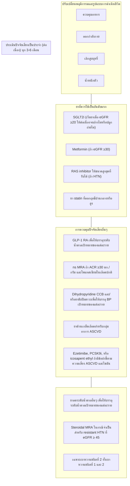
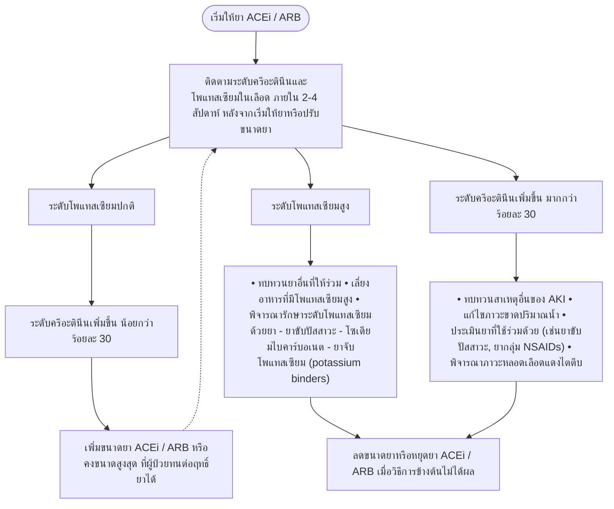

# โรค: ไตเรื้อรัง (Chronic Kidney Disease)

## แหล่งข้อมูล: แนวทางการดูแลผู้ป่วยโรคไตเรื้อรังก่อนการบำบัดทดแทนไต 2565

## คำแนะนำสำหรับการดูแลผู้ป่วยโรคไตเรื้อรัง
## ก่อนการบำบัดทดแทนไต พ.ศ. 2565

(ฉบับปรับปรุงเพิ่มเติม)

Clinical Practice Recommendations for Evaluation
and Management of Chronic Kidney Disease in Adults 2022
(Revised edition)

สมาคมโรคไตแห่งประเทศไทย
The Nephrology Society of Thailand

## ข้อแนะนำเวชปฏิบัติการดูแลผู้ป่วยโรคไตเรื้อรัง
## ก่อนการบำบัดทดแทนไต พ.ศ. 2565
## (ฉบับปรับปรุงเพิ่มเติม)

Clinical Practice Recommendation for the Evaluation and Management of
Chronic Kidney Disease in Adults 2022
(Revised edition)

## สมาคมโรคไตแห่งประเทศไทย

The Nephrology Society of Thailand


ข้อแนะนำเวชปฏิบัตินี้ เป็นเครื่องมือส่งเสริมคุณภาพการบริการผู้ป่วย โรคไตเรื้อรังก่อนการบำบัดทดแทนไตที่เหมาะสมกับทรัพยากรและบริบทของสังคมไทย โดยหวังผลในการส่งเสริมและพัฒนาการบริการ ให้มีประสิทธิภาพ เกิดประโยชน์สูงสุดและคุ้มค่า

ข้อแนะนำต่างๆ ในแนวทางการดูแลนี้ไม่ใช่ข้อบังคับของการปฏิบัติ ผู้ใช้สามารถปฏิบัติแตกต่างจากข้อแนะนำนี้ได้ในกรณีที่สถานการณ์แตกต่างออกไป หรือมีข้อจำกัดของสถานบริการและทรัพยากรหรือมีเหตุผลอันสมควร โดยใช้วิจารณญาณซึ่งเป็นที่ยอมรับบนพื้นฐานหลักวิชาการและจรรยาบรรณ

*   **ISBN**: 978-616-8032-17-6
*   **พิมพ์ครั้งที่ 1**: 2565
*   **บรรณาธิการ**: คณะอนุกรรมการป้องกันโรคไตเรื้อรัง สมาคมโรคไตแห่งประเทศไทย
*   **ภาพปก**: อาจารย์ แพทย์หญิง สมกัญญา ตั้งสง่า
*   **พิมพ์ที่**: บริษัท ศรีเมืองการพิมพ์ จำกัด E-mail: smprt1966@gmail.com


## รายนามคณะอนุกรรมการป้องกันโรคไตเรื้อรังปี 2563-2565

 
   
     
       รองศาสตราจารย์ นายแพทย์สุรศักดิ์ กันตชูเวสศิริ 
       ที่ปรึกษา 
     
   
   
     
       ผู้ช่วยศาสตราจารย์ แพทย์หญิงวรางคณา พิชัยวงศ์ 
       ที่ปรึกษา 
     
     
       รองศาสตราจารย์ แพทย์หญิงธนันดา ตระการวนิช 
       ที่ปรึกษา 
     
     
       ตัวแทนจากเลขาธิการสำนักงานหลักประกันสุขภาพแห่งชาติ 
       ที่ปรึกษา 
     
     
       น.อ.หญิง แพทย์หญิงวรวรรณ ชัยลิมปมนตรี 
       ประธาน 
     
     
       ร.อ.หญิง แพทย์หญิงกมลวรรณ ภัคโชตานนท์ 
       อนุกรรมการ 
     
     
       รองศาสตราจารย์ แพทย์หญิงกาญจนา ตั้งนรารัชชกิจ 
       อนุกรรมการ 
     
     
       ผู้ช่วยศาสตราจารย์ แพทย์หญิงไกรวิพร เกียรติสุนทร 
       อนุกรรมการ 
     
     
       อาจารย์ นายแพทย์จิรายุทธ จันทร์มา 
       อนุกรรมการ 
     
     
       อาจารย์ นายแพทย์เจริญ เกียรติวัชรชัย 
       อนุกรรมการ 
     
     
       รองศาสตราจารย์ นายแพทย์ มล.ชาครีย์ กิติยากร 
       อนุกรรมการ 
     
     
       อาจารย์ แพทย์หญิงตรีชฎา จำรัสพันธุ์ 
       อนุกรรมการ 
     
     
       ร.ท. นายแพทย์ปรมัตถ์ ธิมาไชย 
       อนุกรรมการ 
     
     
       อาจารย์ แพทย์หญิงปาจารีย์ กฤษณพันธุ์ 
       อนุกรรมการ 
     
     
       อาจารย์ นายแพทย์พฤทธิ์ คูสิริสิน 
       อนุกรรมการ 
     
     
       อาจารย์ แพทย์หญิงวรรณิยา มีนุ่น 
       อนุกรรมการ 
     
     
       อาจารย์ นายแพทย์วิวัฒน์ จันเจริญฐานะ 
       อนุกรรมการ 
     
     
       อาจารย์ แพทย์หญิงศศิธร คุณูปการ 
       อนุกรรมการ 
     
     
       รองศาสตราจารย์ แพทย์หญิงศิริรัตน์ อนุตระกูลชัย 
       อนุกรรมการ 
     
     
       อาจารย์ แพทย์หญิงสมกัญญา ตั้งสง่า 
       อนุกรรมการ 
     
     
       พ.ต.หญิง สรวีย์ จินตนา 
       อนุกรรมการ 
     
     
       อาจารย์ นายแพทย์สิโรตม์ คุณาพรไพโรจน์ 
       อนุกรรมการ 
     
     
       อาจารย์ นายแพทย์โสฬส จาตุรพิศานุกูล 
       อนุกรรมการ 
     
     
       พ.ต.อ.นายแพทย์อรรถพล วนาเดช 
       อนุกรรมการ 
     
     
       พว.พรพรรณ ชคัถธาดา 
       อนุกรรมการ 
     
     
       น.ท.หญิง รัตตินันท์ สิงห์ประเสริฐ 
       อนุกรรมการ 
     
     
       คุณธนพลธ์ ดอกแก้ว 
       อนุกรรมการ 
     
     
       รองศาสตราจารย์ แพทย์หญิงปิยวรรณ กิตติสกุลนาม 
       อนุกรรมการและเลขานุการ 
     
   
 


## รายนามคณะอนุกรรมการป้องกันโรคไตเรื้อรังปี 2565-2567

ศาสตราจารย์ นายแพทย์เกรียง ตั้งสง่า ที่ปรึกษา

รองศาสตราจารย์ นายแพทย์สุรศักดิ์ กันตชูเวสศิริ ที่ปรึกษา

ศาสตราจารย์ นายแพทย์เถลิงศักดิ์ กาญจนบุษย์ ที่ปรึกษา

ผู้ช่วยศาสตราจารย์ แพทย์หญิงวรางคณา พิชัยวงศ์ ที่ปรึกษา

ตัวแทนจากเลขาธิการสำนักงานหลักประกันสุขภาพแห่งชาติ ที่ปรึกษา

น.อ.หญิง แพทย์หญิงวรวรรณ ชัยลิมปมนตรี ที่ปรึกษา

รองศาสตราจารย์ แพทย์หญิงศิริรัตน์ อนุตระกูลชัย ประธาน

รองศาสตราจารย์ แพทย์หญิงธนันดา ตระการวนิช อนุกรรมการ

ผู้ช่วยศาสตราจารย์ นายแพทย์พรชัย กิ่งวัฒนกุล อนุกรรมการ

ศาสตราจารย์ นายแพทย์ มล.ชาครีย์ กิติยากร อนุกรรมการ

รองศาสตราจารย์ (พิเศษ) นายแพทย์พิสุทธิ์ กตเวทิน อนุกรรมการ

ศาสตราจารย์ นายแพทย์อดิศว์ ทัศณรงค์ อนุกรรมการ

ผู้ช่วยศาสตราจารย์ แพทย์หญิงไกรวิพร เกียรติสุนทร อนุกรรมการ

อาจารย์ นายแพทย์จิรายุทธ จันทร์มา อนุกรรมการ

อาจารย์ นายแพทย์ธีรยุทธ เจียมจริยาภรณ์ อนุกรรมการ

อาจารย์ แพทย์หญิงตรีชฎา จำรัสพันธุ์ อนุกรรมการ

อาจารย์ นายแพทย์ณรงค์ฤทธิ์ ศิริวัฒนสิทธิ์ อนุกรรมการ

อาจารย์ นายแพทย์ภูมิ ณรงค์เกียรติคุณ อนุกรรมการ

อาจารย์ นายแพทย์สุนทรวิทย์ ประดิษฐอุกฤษฏ์ อนุกรรมการ

อาจารย์ แพทย์หญิงวรรณิยา มีนุ่น อนุกรรมการ

น.ต.หญิง แพทย์หญิงปาลิตา จิตตินันทน์ อนุกรรมการ

อาจารย์ นายแพทย์วิวัฒน์ จันเจริญฐานะ อนุกรรมการ

พ.ต.อ. นายแพทย์อรรถพล วนาเดช อนุกรรมการ

อาจารย์ นายแพทย์เอกลักษณ์ ลักขณาลิขิตกุล อนุกรรมการ

อาจารย์ แพทย์หญิงกัตติกา หาลือ อนุกรรมการ

อาจารย์ แพทย์หญิงชัญชนา บุญญไกร อนุกรรมการ

อาจารย์ นายแพทย์กฤษฏา หาญบรรเจิด อนุกรรมการ

ผู้ช่วยศาสตราจารย์ ดร.ชนิดา ปโชติการ อนุกรรมการ

พว.สุชาดา บุญแก้ว อนุกรรมการ

พว.นันทา มหัธนันท์ อนุกรรมการ

คุณธนพลธ์ ดอกแก้ว อนุกรรมการ

รองศาสตราจารย์ แพทย์หญิงปิยวรรณ กิตติสกุลนาม อนุกรรมการ และเลขานุการ


## รายนามคณะผู้จัดทำ

ร.อ.หญิง แพทย์หญิงกมลวรรณ ภัคโชตานนท์
ผู้ช่วยศาสตราจารย์ แพทย์หญิงไกรวิพร เกียรติสุนทร
อาจารย์ นายแพทย์จิรายุทธ จันทร์มา
ผู้ช่วยศาสตราจารย์ ชนิดา ปโชติการ
รองศาสตราจารย์ นายแพทย์ มล.ชาครีย์ กิติยากร
อาจารย์ นายแพทย์ธนรร งามวิชชุกร
รองศาสตราจารย์ แพทย์หญิงธนันดา ตระการวนิช
นายแพทย์ ธีรยุทธ เจียมจริยาภรณ์
ร.ท.นายแพทย์ปรมัตถ์ ธิมาไชย
อาจารย์ แพทย์หญิงปาจารีย์ กฤษณพันธุ์
อาจารย์ แพทย์หญิง ปาลิตา จิตตินันทน์
รองศาสตราจารย์ แพทย์หญิงปิยวรรณ กิตติสกุลนาม
น.อ. นายแพทย์พงศธร คชเสนี
น.ท.หญิง รัตตินันท์ สิงห์ประเสริฐ
อาจารย์ แพทย์หญิงวรรณิยา มีนุ่น
น.อ.หญิง แพทย์หญิงวรวรรณ ชัยลิมปมนตรี
อาจารย์ นายแพทย์วุฒิเดช โอภาศเจริญสุข
อาจารย์ นายแพทย์วิวัฒน์ จันเจริญฐานะ
รองศาสตราจารย์ แพทย์หญิงศิริรัตน์ อนุตระกูลชัย
อาจารย์ แพทย์หญิงสมกัญญา ตั้งสง่า
อาจารย์ นายแพทย์โสฬส จาตุรพิศานุกูล
กนอ.เอื้อชัชญา กาลสัมฤทธิ์


โรคไตเรื้อรัง (Chronic Kidney Disease, CKD) เป็นโรคที่พบบ่อยและเป็นปัญหาด้านสาธารณสุขของประเทศไทย เป็นโรคเรื้อรังที่รักษาไม่หายขาด จำเป็นต้องรับการรักษาอย่างต่อเนื่อง และมีค่าใช้จ่ายในการรักษาสูงมาก โดยเฉพาะเมื่อเข้าสู่โรคไตวายระยะสุดท้าย (End Stage Kidney Disease, ESKD) ซึ่งจำเป็นต้องให้การรักษาโดยการฟอกเลือดด้วยเครื่องไตเทียม การล้างไตทางช่องท้องแบบต่อเนื่อง หรือการผ่าตัดปลูกถ่ายไต ทำให้ผู้ป่วยได้รับความทุกข์ทรมาน สถานการณ์ของประเทศไทยในปัจจุบัน หลังจากที่มีนโยบายทางสาธารณสุขให้ผู้ป่วยโรคไตเรื้อรังระยะสุดท้ายสามารถเข้าถึงการบำบัดทดแทนไตได้ พบว่ามีจำนวนผู้ป่วยเพิ่มขึ้นอย่างรวดเร็ว โดยในปัจจุบันมีผู้ป่วยที่ได้รับการบำบัดทดแทนไตทั้งสิ้นมากกว่า 170,000 ราย และมีจำนวนผู้ป่วยรายใหม่เพิ่มขึ้นเฉลี่ยปีละ 19,000-22,000 ราย (ข้อมูลการบำบัดทดแทนไตในประเทศไทย พ.ศ. 2563) ซึ่งเป็นจำนวนที่แสดงถึงผู้ป่วยที่ได้รับการบำบัดทดแทนไต เท่านั้น ยังไม่ได้รวมกลุ่มผู้ป่วยที่มีโรคไตเรื้อรังระยะแรกๆ ซึ่งคาดว่ามีจำนวนมากกว่า 8 ล้านคนทั่วประเทศ จากอุบัติการณ์ของโรคไตเรื้อรังและโรคไตวายระยะสุดท้ายที่เพิ่มสูงขึ้นอย่างมากทำให้โรคไตเรื้อรังมีแนวโน้มเป็นปัญหาที่มีความรุนแรงเพิ่มขึ้นในอนาคตอย่างมาก จึงมีความจำเป็นที่จะต้องให้การดูแลรักษาผู้ป่วยโรคไตเรื้อรังเพื่อป้องกันหรือชะลอไม่ให้เกิดโรคไตวายระยะสุดท้าย โดยควรให้การดูแลรักษาตั้งแต่ระยะเริ่มต้นเพื่อชะลอการเสื่อมของไตให้ได้ผลดี

ข้อแนะนำเวชปฏิบัติสำหรับโรคไตเรื้อรังก่อนการบำบัดทดแทนไตฉบับนี้ได้จัดทำขึ้นโดยคณะอนุกรรมการป้องกันโรคไตเรื้อรังของสมาคมโรคไตแห่งประเทศไทยปี 2563-2565 โดยมีการปรับปรุงเนื้อหาจากแนวทางเวชปฏิบัติสำหรับโรคไตเรื้อรังก่อนการบำบัดทดแทนไตปี 2558 ให้มีความทันสมัย ผ่านการวิเคราะห์แนวทางการปฏิบัติเพื่อให้สามารถปฏิบัติได้จริงในบริบทของประเทศไทยจากผู้ทรงคุณวุฒิสาขาต่างๆ ได้แก่ แพทย์ผู้เชี่ยวชาญด้านโรคไต พยาบาลโรคไต นักกำหนดอาหาร และเภสัชกร และได้รับประชาพิจารณ์จากราชวิทยาลัยอายุรแพทย์แห่งประเทศไทย และแพทย์โรคไตที่เป็นสมาชิกที่ส่งความเห็นที่เป็นประโยชน์มาที่สมาคมฯ โดยผ่านการกลั่นกรองสุดท้ายจากกรรมการบริหารสมาคมโรคไตฯ เพื่อให้แพทย์และบุคลากรทางการแพทย์ใช้เป็นแนวทางในการดูแลผู้ป่วยโรคไตเรื้อรังก่อนการบำบัดทดแทนไต โดยไม่ได้รวมถึงแนวทางปฏิบัติในการดูแลรักษาผู้ป่วยโรคไตวายระยะสุดท้ายที่ได้รับการบำบัดทดแทนไต

อนึ่งเนื่องจากในช่วง 1 ปีที่ผ่านมามีองค์ความรู้ใหม่ที่ส่งผลให้การดูแลรักษาผู้ป่วยโรคไตเรื้อรังดีขึ้น คณะผู้จัดทำจึงได้ปรับปรุงและเพิ่มเติมเนื้อหาในส่วนนี้เข้าไปในแนวทางเวชปฏิบัติสำหรับโรคไตเรื้อรังก่อนการบำบัดทดแทนไตปี 2565 เป็นฉบับปรับปรุงเพิ่มเติม

รองศาสตราจารย์ นายแพทย์สุรศักดิ์ กันตชูเวสศิริ
นายกสมาคมโรคไตแห่งประเทศไทยปี 2563-2565
อาจารย์ นายแพทย์วุฒิเดช โอภาศเจริญสุข
นายกสมาคมโรคไตแห่งประเทศไทยปี 2565-2567


นาวาอากาศเอกหญิง แพทย์หญิงวรวรรณ ชัยลิมปมนตรี
ประธานคณะอนุกรรมการป้องกันโรคไตเรื้อรังปี 2563-2565

รองศาสตราจารย์ แพทย์หญิงศิริรัตน์ อนุตระกูลชัย
ประธานคณะอนุกรรมการป้องกันโรคไตเรื้อรังปี 2565-2567

รองศาสตราจารย์ แพทย์หญิงปิยวรรณ กิตติสกุลนาม
เลขานุการคณะอนุกรรมการป้องกันโรคไตเรื้อรังปี 2563-2567

สมาคมโรคไตแห่งประเทศไทย

มีนาคม 2566


 
   
     
           
         หน้า 
     
   
   
     
         หลักการของคำแนะนำสำหรับการดูแลผู้ป่วยโรคไตเรื้อรังก่อนการบำบัดทดแทนไต 
     
     
         รายนามคณะอนุกรรมการป้องกันโรคไตเรื้อรัง 
     
     
         รายนามคณะผู้จัดทำ 
     
     
     
     
     
     
         น้ำหนักคำแนะนำและคุณภาพหลักฐาน 
     
     
         คำจำกัดความของโรคไตเรื้อรัง 
     
     
     
     
         วัตถุประสงค์และเป้าหมายของการดูแลผู้ป่วยโรคไตเรื้อรัง 
     
     
         ข้อแนะนำเวชปฏิบัติที่ 1. 
     
     
         การเลือกผู้ป่วยที่มีความเสี่ยงสูงต่อการเกิดโรคไตเรื้อรังเพื่อเข้ารับการตรวจคัดกรอง 
           
     
     
         ข้อแนะนำเวชปฏิบัติที่ 2. 
     
     
         การคัดกรองโรคไตเรื้อรัง 
           
     
     
         ข้อแนะนำเวชปฏิบัติที่ 3. 
     
     
         การติดตามระดับการทำงานของไต 
           
     
     
         ข้อแนะนำเวชปฏิบัติที่ 4. 
     
     
         การส่งปรึกษาหรือส่งต่อผู้ป่วย 
           
     
     
         ข้อแนะนำเวชปฏิบัติที่ 5. 
     
     
         การควบคุมความดันโลหิต 
           
     
     
         ข้อแนะนำเวชปฏิบัติที่ 6. 
     
     
         การลดปริมาณโปรตีนในปัสสาวะ 
           
     
     
         ข้อแนะนำเวชปฏิบัติที่ 7. 
     
     
         การควบคุมระดับน้ำตาลในเลือดของผู้ป่วยเบาหวานที่มีโรคไตเรื้อรัง 
           
     
     
          
          
     
     
         ข้อแนะนำเวชปฏิบัติที่ 8. 
     
     
         การควบคุมระดับไขมันในเลือด 
           
     
   
 


 
   
     
           
         หน้า 
     
   
   
     
         ข้อแนะนำเวชปฏิบัติที่ 9. การงดสูบบุหรี่ 
     
     
         ข้อแนะนำเวชปฏิบัติที่ 10. โภชนบำบัดสำหรับผู้ป่วยโรคไตเรื้อรัง 
     
     
         ข้อแนะนำเวชปฏิบัติที่ 11. การดูแลรักษาความผิดปกติของแคลเซียมและฟอสเฟต 
     
     
         ข้อแนะนำเวชปฏิบัติที่ 12. การดูแลรักษาภาวะโลหิตจาง 
     
     
         ข้อแนะนำเวชปฏิบัติที่ 13. การดูแลรักษาภาวะเลือดเป็นกรด 
     
     
         ข้อแนะนำเวชปฏิบัติที่ 14. การตรวจทางรังสีวิทยาและการใช้ยาหรือสารที่มีผลต่อภาวะโรคไตเรื้อรัง 
     
     
         ข้อแนะนำเวชปฏิบัติที่ 15. การเสริมภูมิคุ้มกันด้วยการฉีดวัคซีนในผู้ป่วยโรคไตเรื้อรัง 
     
     
         ข้อแนะนำเวชปฏิบัติที่ 16. การลดความเสี่ยงและการคัดกรองโรคหัวใจและหลอดเลือด 
     
     
         ข้อแนะนำเวชปฏิบัติที่ 17. การเตรียมตัวเพื่อการบำบัดทดแทนไต 
     
   
 


## น้ำหนักคำแนะนำ (Strength of Recommendation)

ระดับ 1 หมายถึง ความมั่นใจของคำแนะนำที่จะให้ทำอยู่ในระดับสูง เพราะมาตรการดังกล่าวมีประโยชน์อย่างยิ่งต่อผู้ป่วยและคุ้มค่า **“ควรทำเป็นอย่างยิ่ง/ ต้องทำ” (Recommend)**

ระดับ 2 หมายถึงความมั่นใจของคำแนะนำที่จะให้ทำอยู่ในระดับปานกลางเนื่องจากมาตรการดังกล่าวอาจมีประโยชน์ต่อผู้ป่วยและอาจคุ้มค่า **“แนะนำ” (Suggest)**

ระดับ **“Not Graded”** หมายถึง คำแนะนำที่มีความสำคัญจากเหตุผลที่ได้จากการอุปมานจากข้อเท็จจริง แต่ไม่สามารถจัดอยู่ในคำแนะนำระดับที่ 1 หรือ 2 เนื่องจากไม่มีการศึกษาวิจัยในประเด็นดังกล่าว หรือมีหลักฐานการศึกษาที่ไม่เพียงพอซึ่งไม่ได้หมายความว่าคำแนะนำนั้นไม่จำเป็นหรือมีความสำคัญน้อยกว่าระดับที่ 1 และระดับที่ 2 ตัวอย่างเช่น การให้ความสำคัญกับการให้คำปรึกษา (counseling) แก่ผู้ป่วยโรคไตเรื้อรัง ความจำเป็นการส่งต่อผู้ป่วยเพื่อพบผู้เชี่ยวชาญด้านอื่นๆ เพื่อการดูแลผู้ป่วยแบบองค์รวม เป็นต้น ซึ่งในบางบทได้มีข้อแนะนำที่จัดเป็น **“ข้อควรปฏิบัติ (practice points)”** ที่ได้มาจากความคิดเห็นของคณะผู้เชี่ยวชาญโดยมีความเกี่ยวข้องกับการดูแลผู้ป่วยในเรื่องที่เฉพาะเจาะจงและเพื่อสนับสนุนคำแนะนำที่ควรทำเป็นอย่างยิ่ง นอกจากนี้ข้อควรปฏิบัติบางเรื่องจะถูกนำเสนอในรูปแบบตาราง รูปภาพ หรือ ขั้นตอนวิธี (algorithm) ดูแลผู้ป่วยเพื่อให้ง่ายต่อการนำไปใช้

### คุณภาพหลักฐาน (Quality of Evidence)

ระดับ A หมายถึง คุณภาพของหลักฐาน **“สูงมาก”**

[The true effect lies close to the estimate of the effect]

ระดับ B หมายถึง คุณภาพของหลักฐาน **“ปานกลาง”**

[The true effect is likely to be close to the estimate of the effect, but there is a possibility that it is substantially different]

ระดับ C หมายถึง คุณภาพของหลักฐาน **“ต่ำ”**

[The true effect may be substantially different from the estimate of effect]

ระดับ D หมายถึง คุณภาพของหลักฐาน **“ต่ำมาก”**

[The estimate of effect is very uncertain, and often will be far from the truth]


## คำจำกัดความของโรคไตเรื้อรัง

โรคไตเรื้อรัง (chronic kidney disease, CKD) หมายถึง ภาวะที่ผู้ป่วยมีความผิดปรกติทางโครงสร้าง หรือหน้าที่ของไตเป็นระยะเวลานานเกิน 3 เดือนซึ่งส่งผลต่อสุขภาพ โดยตรวจพบลักษณะอย่างใดอย่างหนึ่ง หรือพบร่วมกันในสองข้อต่อไปนี้

1. ผู้ป่วยมีลักษณะที่แสดงถึงความผิดปกติของไต (kidney damage) อย่างใดอย่างหนี่งต่อไปนี้ต่อเนื่อง นานเกิน 3 เดือน โดยไม่ขึ้นกับค่าอัตราการกรองของไต (glomerular filtration rate, GFR)

I. ตรวจพบอัลบูมินในปัสสาวะ (albuminuria) โดยค่าปริมาณอัลบูมินในปัสสาวะ (albumin excretion rate, AER) ≥ 30 มก.ต่อวัน หรือสัดส่วนของอัลบูมินต่อครีแอตินีนในปัสสาวะ (albumin-to-creatinine ratio, ACR) ≥ 30 มก.ต่อกรัมของครีอะตินีน

II. ตรวจพบความผิดปรกติของการตรวจตะกอนปัสสาวะ (urine sediments) โดยเฉพาะตรวจพบเม็ดเลือดแดงในปัสสาวะ (hematuria)

III. มีความผิดปกติของเกลือแร่ (electrolyte) ที่เกิดจากความผิดปกติของหลอดฝอยไต (renal tubules)

IV. ตรวจพบความผิดปกติของไตทางรังสีวิทยา

V. ตรวจพบความผิดปกติทางพยาธิสภาพของไต

VI. มีประวัติการได้รับการผ่าตัดปลูกถ่ายไต

2. ผู้ป่วยที่มีอัตราการกรองของไตต่ำกว่า 60 มล./นาที/ 1.73 ตร.ม. ติดต่อกันนานเกิน 3 เดือน โดยอาจจะตรวจพบหรือไม่พบว่ามีภาวะไตผิดปกติ

### การแบ่งระยะของโรคไตเรื้อรัง

การแบ่งโรคไตเรื้อรังตามเกณฑ์ของ Kidney Disease Improving Global Outcomes (KDIGO) พ.ศ. 2555 แนะนำให้พิจารณาตามสาเหตุ (cause), อัตราการกรองของไต (GFR, G1-G5) และปริมาณอัลบูมินในปัสสาวะ (albuminuria, A1-A3) ดังแสดงในตารางที่ 1 และ 2

ตารางที่ 1 การแบ่งระยะของโรคไตเรื้อรังตามเกณฑ์ของอัตราการกรองของไต

 
   
     
         ระยะของโรคไตเรื้อรัง 
         อัตราการกรองของไต (มล./นาที/1.73 ตร.ม.) 
     
   
   
     
         ระยะที่ 1 
         ≥ 90 
     
     
         ระยะที่ 2 
         60-89 
     
     
         ระยะที่ 3a 
         45-59 
     
     
         ระยะที่ 3b 
         30-44 
     
     
         ระยะที่ 4 
         15-29 
     
     
         ระยะที่ 5 
         &lt; 15 
     
   
 

หมายเหตุ โรคไตวายเรื้อรังระยะสุดท้าย หมายถึง โรคไตเรื้อรังระยะที่ 5 ที่มีระดับอัตราการกรองของไตต่ำกว่า 6 มล./นาที/ 1.73 ตร.ม. หรือจำเป็นต้องได้รับการบำบัดทดแทนไตวิธีใดวิธีหนึ่ง


ตารางที่ 2 การแบ่งโรคไตเรื้อรังตามเกณฑ์ระดับอัลบูมินในปัสสาวะ

 
   
     
         ระยะ 
         ปริมาณอัลบูมิน ในปัสสาวะ (มก./24 ชั่วโมง) 
         สัดส่วนของอัลบูมินต่อครีแอตินีนในปัสสาวะ 
         คำนิยาม 
     
     
         (มก./มิลลิโมล) 
         (มก./กรัม) 
     
   
   
     
         &lt; 30 
         &lt; 3 
         &lt; 30 
         ปกติ หรือ เพิ่มขึ้นเล็กน้อย 
     
     
         30 - 300 
         3 - 30 
         30 - 300 
         เพิ่มขึ้นปานกลาง 
     
     
         &gt; 300 
         &gt; 30 
         &gt; 300 
         เพิ่มขึ้นมาก 
     
   
 

### การพยากรณ์โรคไตเรื้อรัง

สามารถพยากรณ์โรคไตเรื้อรังตามความสัมพันธ์ของ GFR และระดับอัลบูมินในปัสสาวะ ดังแสดงใน ตารางที่ 3

ตารางที่ 3 การพยากรณ์โรคไตตามความสัมพันธ์ของ GFR และระดับอัลบูมินในปัสสาวะ

 
   
     
   
 ระดับอัลบูมินในปัสสาวะ 
     
     
     
     
 &lt; 30 มก./ก. 
 30 - 300 มก./ก. 
 &gt; 300 มก./ก. 
     
     
 &lt; 3 มก./มิลลิโมล 
 3 - 30 มก./มิลลิโมล 
 &gt; 30 มก./มิลลิโมล 
     
     
 ระยะของโรคไต เรื้อรัง ตามระดับ GFR (ml/min/1.73m²) 
 ระยะที่ 1 
 ≥ 90 
 ความเสี่ยงต่ำ 
 ความเสี่ยงปานกลาง 
 ความเสี่ยงสูง 
     
     
 ระยะที่ 2 
 60-89 
 ความเสี่ยงต่ำ 
 ความเสี่ยงปานกลาง 
 ความเสี่ยงสูง 
     
     
 ระยะที่ 3a 
 45-59 
 ความเสี่ยงปานกลาง 
 ความเสี่ยงสูง 
 ความเสี่ยงสูงมาก 
     
     
 ระยะที่ 3b 
 30-44 
 ความเสี่ยงสูง 
 ความเสี่ยงสูงมาก 
 ความเสี่ยงสูงมาก 
     
     
 ระยะที่ 4 
 15-29 
 ความเสี่ยงสูงมาก 
 ความเสี่ยงสูงมาก 
 ความเสี่ยงสูงมาก 
     
     
 ระยะที่ 5 
 &lt; 15 
 ความเสี่ยงสูงมาก 
 ความเสี่ยงสูงมาก 
 ความเสี่ยงสูงมาก 
     
   
 

*   ความเสี่ยงต่ำ
*   ความเสี่ยงปานกลาง
*   ความเสี่ยงสูง
*   ความเสี่ยงสูงมาก


1. สมาคมโรคไตแห่งประเทศไทย. คำแนะนำสำหรับการดูแลผู้ป่วยโรคไตเรื้อรังก่อนการบำบัดทดแทนไต พ.ศ. 2558

2. สมาคมโรคไตแห่งประเทศไทย. คำแนะนำสำหรับการดูแลรักษาโรคไตเรื้อรังแบบองค์รวมชนิดประคับประคอง พ.ศ. 2560

3. Kidney Disease: Improving Global Outcomes (KDIGO) CKD Work Group. KDIGO 2012 clinical practice guideline for the evaluation and management of chronic kidney disease. Kidney inter (Supplement) 2013;3(1).


 
   
     
         ABPM 
         Ambulatory blood pressure monitoring 
     
     
         ACEi 
         Angiotensin converting enzyme Inhibitor(s) 
     
     
         ACR 
         Albumin-to-creatinine ratio 
     
     
         AER 
         Albumin excretion rate 
     
     
         ARB 
         Angiotensin II receptor blocker(s) 
     
     
         BMD 
         Bone mineral density 
     
     
         CCB 
         Calcium-channel blocker 
     
     
         CGM 
         Continuous glucose monitoring 
     
     
         CKD 
         Chronic kidney disease 
     
     
         CKD-EPI 
         Chronic Kidney Disease Epidemiology Collaboration equation 
     
     
         CKD-MBD 
         Chronic kidney disease-metabolic bone disease 
     
     
         CrCl 
         Creatinine clearance 
     
     
         DBP 
         Diastolic blood pressure 
     
     
         Dkk-1 
         Dickkopf-related protein 1 
     
     
         DPP-4 
         Dipeptidyl peptidase-4 
     
     
         DRI 
         Direct renin inhibitor 
     
     
         DXA 
         Dual energy x-ray absorptiometry 
     
     
         eGFR 
         Estimated glomerular filtration rate 
     
     
         ESA 
         Erythropoietin-stimulating agent 
     
     
         ESKD 
         End stage kidney disease 
     
     
         GLP-1 RA 
         Glucagon-like peptide-1 receptor agonist(s) 
     
     
         GMI 
         Glucose management indicator 
     
     
         HBPM 
         Home blood pressure monitoring 
     
     
         HDL 
         High-density lipoprotein 
     
     
         IBW 
         Ideal body weight 
     
     
         KDIGO 
         Kidney Disease Improving Global Outcomes 
     
     
         KUB 
         Kidneys, ureters, and bladder 
     
     
         LDL 
         Low-density lipoprotein 
     
     
         LVEF 
         Left ventricular ejection fraction 
     
     
         MAP 
         Mean arterial pressure 
     
     
         NCDs 
         Non-communicable diseases 
     
   
 


* **NEAP**: Net endogenous acid production
* **nPNA**: Normalized protein equivalent of nitrogen appearance
* **NSAIDs**: Non-steroidal anti-inflammatory drugs
* **ns-MRA**: Nonsteroidal mineralocorticoid receptor antagonist
* **NUN**: Non urea nitrogen
* **PCR**: Protein-to-creatinine ratio
* **PER**: Protein excretion rate
* **PEW**: Protein-energy wasting
* **PTH**: Parathyroid hormone
* **RAS**: Renin-angiotensin system
* **SBP**: Systolic blood pressure
* **SCr**: Serum creatinine
* **SCys**: Serum cystatin C
* **SGLT2i**: Sodium–glucose cotransporter-2 inhibitor(s)
* **SMBG**: Self-monitoring of blood glucose
* **TG**: Triglyceride
* **TRACP5b**: Tartrate-resistant acid phosphatase 5b
* **TSAT**: Ttransferrin saturation
* **UNA**: Urea nitrogen appearance
* **UUN**: Urinary urea nitrogen


## วัตถุประสงค์และเป้าหมายของการดูแลผู้ป่วยโรคไตเรื้อรัง

ผู้ป่วยโรคไตเรื้อรังควรได้รับการดูแลโดยมีวัตถุประสงค์และเป้าหมายดังนี้

1. คัดกรองและส่งปรึกษาหรือส่งต่อ (screening and consultation or referral) เพื่อให้สามารถวินิจฉัยโรคไตเรื้อรังได้ในระยะแรกของโรคและส่งปรึกษาหรือส่งต่อผู้ป่วยให้อายุรแพทย์โรคไตได้อย่างเหมาะสม

2. ชะลอการเสื่อมของไต (slowing the progression of kidney disease) เพื่อป้องกันหรือยืดระยะเวลาการเกิดโรคไตเรื้อรังและการบำบัดทดแทนไต

3. ประเมินและรักษาภาวะแทรกซ้อนของโรคไตเรื้อรัง (evaluation and treating complications) เพื่อให้แพทย์ผู้ดูแลสามารถวินิจฉัยและให้การดูแลรักษาที่เหมาะสมเพื่อป้องกันการเกิดภาวะแทรกซ้อนที่รุนแรง

4. ลดความเสี่ยงต่อการเกิดโรคหัวใจและหลอดเลือด (cardiovascular risk reduction) เพื่อป้องกันการเกิดและลดการเสียชีวิตจากโรคหัวใจและหลอดเลือด ซึ่งเป็นสาเหตุของการเสียชีวิตที่สำคัญของผู้ป่วยโรคไตเรื้อรัง

5. เตรียมผู้ป่วยเพื่อการบำบัดทดแทนไต (preparation for renal replacement therapy) เพื่อให้ผู้ป่วยโรคไตเรื้อรังได้รับการเตรียมพร้อมสำหรับการบำบัดทดแทนไตในระยะเวลาที่เหมาะสม

ISBN : 978-616-8032-17-6


## ข้อแนะนำเวชปฏิบัติที่ 1

### การเลือกผู้ป่วยที่มีความเสี่ยงสูงต่อการเกิดโรคไตเรื้อรังเพื่อเข้ารับการตรวจคัดกรอง

ผู้ป่วยที่มีประวัติดังต่อไปนี้จัดเป็นผู้ที่มีความเสี่ยงสูงต่อการเกิดโรคไตเรื้อรัง ได้แก่

1.1 โรคเบาหวาน (1, A)

1.2 โรคความดันโลหิตสูง (1, A)

1.3 โรคแพ้ภูมิตนเอง (autoimmune diseases) ที่อาจก่อให้เกิดไตผิดปกติ (2, B)

1.4 ตรวจพบนิ่วในไตหรือในระบบทางเดินปัสสาวะ (2, B)

1.5 อายุมากกว่า 60 ปีขึ้นไป (2, C)

1.6 โรคหัวใจและหลอดเลือด (cardiovascular disease) (2, C)

1.7 มีมวลเนื้อไต (renal mass) ลดลง หรือมีไตข้างเดียว ทั้งที่เป็นมาแต่กำเนิดหรือเป็นในภายหลัง (2, C)

1.8 มีประวัติญาติสายตรงเป็นโรคถุงน้ำในไตชนิดถ่ายทอดทางพันธุกรรมชนิดยีนเด่น (autosomal dominant cystic kidney disease) หรือตรวจพบถุงน้ำในไตมากกว่า 3 ตำแหน่งขึ้นไป (2, C)

1.9 มีประวัติไตวายเฉียบพลัน (2, C)

1.10 ได้รับยาแก้ปวดกลุ่มที่ไม่ใช่สเตียรอยด์ (non-steroidal anti-inflammatory drugs) หรือสารที่มีผลกระทบต่อไต (nephrotoxic agents) เป็นประจำ (2, C)

1.11 โรคติดเชื้อระบบทางเดินปัสสาวะส่วนบนซ้ำหลายครั้ง (2, C)

1.12 โรคเก๊าท์ (gout) หรือระดับกรดยูริคในเลือดสูง (2, C)

1.13 มีประวัติโรคไตเรื้อรังในครอบครัว (2, C)

1.14 ใช้ยาสมุนไพรติดต่อกันเป็นระยะเวลานาน (2, C)

1.15 โรคติดเชื้อในระบบต่างๆ (systemic infection) ที่อาจก่อให้เกิดโรคไต (Not Graded)


1. คณะอนุกรรมการลงทะเบียนการบำบัดทดแทนไตในประเทศไทย. Thailand Renal Replacement Therapy: Year2015. 2015.

2. แนวทางเวชปฏิบัติสำหรับการดูแลผู้ป่วยโรคไตเรื้อรังก่อนการบำบัดทดแทนไต พ.ศ.2558 [Internet]. 2558. Available from: www.nephrothai.org/images/10-11-2016/Final_คมอ_CKD_2015.pdf.


3. Hsu CC, Wang H, Hsu YH, Chuang SY, Huang YW, Chang YK, et al. Use of nonsteroidal anti-inflammatory drugs and risk of chronic kidney disease in subjects with hypertension: nationwide longitudinal cohort study. *Hypertension*. 2015; 66(3): 524-533.

4. Ingsathit A, Thakkinstian A, Chaiprasert A, Sangthawan P, Gojaseni P, Kiattisunthorn K, et al. Prevalence and risk factors of chronic kidney disease in the Thai adult population: Thai SEEK study. *Nephrol Dial Transplant*. 2010; 25(5): 1567-75.

5. Jitraknatee J, Ruengorn C, Nochaiwong S. Prevalence and risk factors of chronic kidney disease among type 2 diabetes patients: a cross-sectional study in primary care practice. *Sci Rep*. 2020; 10(1): 6205.

6. KDIGO work group. KDIGO 2012 Clinical Practice Guideline for the Evaluation and Management of Chronic Kidney Disease. *Kidney Int Suppl (2011)*. 2013; 3(1): 3.

7. Kim S, Chang Y, Lee YR, Jung HS, Hyun YY, Lee KB, et al. Solitary kidney and risk of chronic kidney disease. *Eur J Epidemiol*. 2019; 34(9): 879-88.

8. Koye DN, Shaw JE, Reid CM, Atkins RC, Reutens AT, Magliano DJ. Incidence of chronic kidney disease among people with diabetes: a systematic review of observational studies. *Diabet Med*. 2017; 34(7): 887-901.

9. See EJ, Jayasinghe K, Glassford N, Bailey M, Johnson DW, Polkinghorne KR, et al. Long-term risk of adverse outcomes after acute kidney injury: a systematic review and meta-analysis of cohort studies using consensus definitions of exposure. *Kidney Int*. 2019; 95(1): 160-172.


## ข้อแนะนำเวชปฏิบัติที่ 2
## การคัดกรองโรคไตเรื้อรัง

ผู้ที่มีปัจจัยเสี่ยงข้อใดข้อหนึ่งจากข้อแนะนำเวชปฏิบัติที่ 1 ควรได้รับการตรวจเพื่อวินิจฉัยโรคไตเรื้อรัง ดังนี้

2.1 ประเมินค่าอัตราการกรองของไต (estimated glomerular filtration rate, eGFR) อย่างน้อยปีละ 1 ครั้ง ด้วยการตรวจระดับครีแอตินีนในเลือด (serum creatinine, SCr) และคำนวณด้วยสมการ “CKD-EPI (Chronic Kidney Disease Epidemiology Collaboration) equation” (ตารางที่ 2.1) **(1, B)**

ตารางที่ 2.1 สมการ CKD-EPI จำแนกตามเพศและระดับครีแอตินีนในเลือด

 
   
     
         เพศ 
         ระดับครีแอตินีนในเลือด (มก./ดล.) 
         สมการ 
     
   
   
     
         หญิง 
         ≤ 0.7 
         eGFR = 144 x (SCr/0.7) ⁻⁰.³²⁹ x (0.993)ᴬᵍᵉ 
     
     
         &gt; 0.7 
         eGFR = 144 x (SCr/0.7) ⁻¹.²⁰⁹ x (0.993)ᴬᵍᵉ 
     
     
         ชาย 
         ≤ 0.9 
         eGFR = 141 x (SCr/0.9) ⁻⁰.⁴¹¹ x (0.993)ᴬᵍᵉ 
     
     
         &gt; 0.9 
         eGFR = 141 x (SCr/0.9) ⁻¹.²⁰⁹ x (0.993)ᴬᵍᵉ 
     
   
 

#### 2.1.1 ข้อแนะนำในการตรวจทางห้องปฏิบัติการ (1, B)

2.1.1.1 ควรใช้ค่าระดับครีแอตินีนในเลือดที่วัดด้วยวิธี enzymatic method เพื่อเพิ่มความแม่นยำในการประเมินค่าอัตราการกรองของไต

2.1.1.2 การรายงานผลค่าระดับครีแอตินีนในเลือด ควรรายงานผลเป็นค่าทศนิยม 2 ตำแหน่ง เช่น ค่าครีแอตินีน เท่ากับ 1.01 มก./ดล. และควรรายงานควบคู่กับค่าอัตราการกรองของไตที่ระบุสูตรที่ใช้คำนวณ เช่น eGFR (CKD-EPI) โดยใช้หน่วยเป็น มล./นาที/1.73 ตร.ม. (ml/min/1.73m²)

2.1.1.3 สามารถใช้สูตรคำนวณอัตราการกรองของไตอื่นๆได้ ในกรณีที่ได้มีการพิสูจน์ว่ามีความถูกต้องเท่ากับหรือมากกว่า CKD-EPI equation เช่น สมการ “Thai estimated GFR equation” ดังนี้

$$eGFR = 375.5 \times SCr^{(-0.848)} \times Age^{(-0.364)} \times 0.712 \text{ (ถ้าเป็นผู้หญิง)}$$

2.1.1.4 ข้อแนะนำให้ตรวจทางห้องปฏิบัติการเพิ่มเพื่อยืนยันการวินิจฉัยโรคไตเรื้อรังในกรณีต่อไปนี้

(1) พิจารณาตรวจระดับสารซิสตาตินซี (cystatinC) ในเลือด (SCys) (ถ้าทำได้) ในผู้ป่วยที่มีค่าอัตราการกรองของไตที่คำนวณจากระดับครีแอตินีนในเลือดมีค่าระหว่าง 45 - 59 มล./นาที/1.73


ตร.ม.และไม่มีความผิดปกติของไตจากการตรวจอื่นๆ โดยนำผลการตรวจระดับครีแอตินีนในเลือดและระดับซิสตาตินซีมาคำนวณหาค่าอัตราการกรองของไตด้วยสมการ “2012 CKD-EPI creatinine-cystatin C based GFR equation” (2, C) (ตารางที่ 2.2) ดังนี้

ตารางที่ 2.2 สมการ CKD-EPI จำแนกตามเพศ ระดับครีแอตินีนและระดับซิสตาตินซีในเลือด

 
   
     
         เพศ 
         ระดับครีแอตินีน ในเลือด (มก./ดล.) 
         ระดับซิสตาตินซี ในเลือด (มก./ล.) 
         สมการ 
     
   
   
     
         หญิง 
         ≤ 0.7 
         ≤ 0.8 
         130 × (SCr/0.7)−0.248 × (SCys/0.8)−0.375 × 0.995Age 
     
     
         &gt; 0.8 
         130 × (SCr/0.7)−0.248 × (SCys/0.8)−0.711 × 0.995Age 
     
     
         หญิง 
         &gt; 0.7 
         ≤ 0.8 
         130 × (SCr/0.7)−0.601 × (SCys/0.8)−0.375 × 0.995Age 
     
     
         &gt; 0.8 
         130 × (SCr/0.7)−0.601 × (SCys/0.8)−0.711 × 0.995Age 
     
     
         ชาย 
         ≤ 0.9 
         ≤ 0.8 
         135 × (SCr/0.9)−0.207 × (SCys/0.8)−0.375 × 0.995Age 
     
     
         &gt; 0.8 
         135 × (SCr/0.9)−0.207 × (SCys/0.8)−0.711 × 0.995Age 
     
     
         ชาย 
         &gt; 0.9 
         ≤ 0.8 
         135 × (SCr/0.9)−0.601 × (SCys/0.8)−0.375 × 0.995Age 
     
     
         &gt; 0.8 
         135 × (SCr/0.9)−0.601 × (SCys/0.8)−0.711 × 0.995Age 
     
   
 

(2) พิจารณาตรวจปัสสาวะ 24 ชั่วโมง เพื่อคำนวณ creatinine clearance (CrCl) ในกรณีที่ต้องการยืนยันการวินิจฉัยโรคไตเรื้อรัง ในผู้ป่วยที่มีปัจจัยรบกวนการวัดค่าระดับครีแอตินีนในเลือด (2, C)

2.2 ตรวจหาอัลบูมินจากตัวอย่างปัสสาวะโดยใช้แถบสีจุ่ม (dipstick)

2.2.1 ถ้าตรวจพบมีโปรตีนรั่วทางปัสสาวะตั้งแต่ระดับ 1+ ขึ้นไป และไม่มีสาเหตุอื่นที่สามารถทำให้เกิดผลบวกลวง ถือได้ว่ามีความผิดปกติ (2, C)

2.2.2 ข้อแนะนำในกรณีผู้ป่วยเบาหวานและ/หรือความดันโลหิตสูงที่ตรวจไม่พบโปรตีนรั่วทางปัสสาวะด้วยแถบสีจุ่ม ควรพิจารณาตรวจเพิ่มด้วยวิธีใดวิธีหนึ่งดังนี้ (2, B)

2.2.2.1 ตรวจสัดส่วนของอัลบูมินต่อครีแอตินีนในปัสสาวะ (albumin-to-creatinine ratio, ACR) จากการเก็บปัสสาวะตอนเช้า (spot morning urine) ถ้ามีค่า 30-300 มก./กรัม แสดงว่ามีภาวะ microalbuminuria (ปัจจุบันใช้คำว่า moderately increased albuminuria)

2.2.2.2 ตรวจปัสสาวะแบบจุ่มด้วยแถบสีสำหรับ microalbumin (cut-off level: 20 มก./ลิตร) ถ้าผลเป็นบวก แสดงว่ามีภาวะ albuminuria ควรส่งตรวจซ้ำอีก 1-2 ครั้งใน 3 เดือน หากพบ albuminuria 2 ใน 3 ครั้งถือว่ามีภาวะไตผิดปกติ


2.3 ตรวจหาเม็ดเลือดแดงในปัสสาวะด้วยแถบสีจุ่ม ถ้าได้ผลบวกให้ทำการตรวจ microscopic examination โดยละเอียด หากพบเม็ดเลือดแดงมากกว่า 5 เซลล์/กำลังขยายสูง (high power field) ในปัสสาวะที่ได้รับการปั่นและไม่มีสาเหตุที่สามารถทำให้เกิดผลบวกปลอม ถือได้ว่ามีความผิดปกติ **(2, D)**

2.4 ในกรณีที่ตรวจพบความผิดปกติตามข้อ 2.1-2.3 ควรได้รับการตรวจซ้ำอีกครั้งในระยะเวลา 3 เดือน หากยืนยันความผิดปกติสามารถให้การวินิจฉัยว่าผู้ป่วยเป็นโรคไตเรื้อรัง หากผลการตรวจซ้ำไม่ยืนยันความผิดปกติ ให้ทำการตรวจคัดกรองผู้ป่วยในปีถัดไป **(2, D)**

2.5 การตรวจอื่นๆ เช่น การตรวจทางรังสี (plain KUB) และ/หรือการตรวจอัลตราซาวด์ (ultrasonography of KUB) ขึ้นอยู่กับข้อบ่งชี้ในผู้ป่วยแต่ละราย **(Not Graded)**


1. Kidney Disease Improving Global Outcomes (KDIGO) CKD Work Group. KDIGO 2012 clinical practice guideline for the evaluation and management of chronic kidney disease. *Kidney Int Suppl* 2013; 3: 1–150.

2. Levey AS, Stevens LA, Schmid CH, et al. A new equation to estimate glomerular filtration rate. *Ann Intern Med* 2009; 150(9): 604-612.

3. Matsushita K, Mahmoodi BK, Woodward M et al. Comparison of risk prediction using the CKD-EPI equation and the MDRD study equation for estimated glomerular filtration rate. *JAMA* 2012; 307: 1941–1951.

4. Praditpornsilpa K, Townamchai N, Chaiwatanarat T, et al. The need for robust validation for MDRD-based glomerular filtration rate estimation in various CKD populations. *Nephrol Dial Transplant.* 2011; 26(9): 2780-2785.

5. Inker LA, Schmid CH, Tighiouart H et al. Estimating glomerular filtration rate from serum creatinine and cystatin C. *N Engl J Med* 2012; 367: 20–29.

6. Levey AS, Bosch JP, Lewis JB, Greene T, Rogers N, Roth D. A more accurate method to estimate glomerular filtration rate from serum creatinine: a new prediction equation. Modification of Diet in Renal Disease Study Group. *Ann Intern Med.* 1999; 130(6): 461-470.

7. Graziani MS, Gambaro G, Mantovani L, et al. Diagnostic accuracy of a reagent strip for assessing urinary albumin excretion in the general population. *Nephrol Dial Transplant.* 2009; 24(5): 1490-1494.

8. Hallan SI, Ritz E, Lydersen S, Romundstad S, Kvenild K, Orth SR. Combining GFR and albuminuria to classify CKD improves prediction of ESRD. *J Am Soc Nephrol.* 2009; 20(5): 1069-1077.


## ข้อแนะนำเวชปฏิบัติที่ 3
## การติดตามระดับการทำงานของไต

ควรมีการติดตามระดับการทำงานของไตโดยการตรวจค่าอัตราการกรองของไต (eGFR) และอัลบูมินจากตัวอย่างปัสสาวะในผู้ป่วยโรคไตเรื้อรังอย่างน้อยปีละ 1 ครั้ง **(Not Graded)** แต่ควรตรวจถี่ขึ้นในกรณีที่ผู้ป่วยมีความเสี่ยงสูงที่จะมีอัตราการกรองของไตลดลงอย่างรวดเร็วหรือเพื่อใช้ในการตัดสินใจหรือติดตามการรักษา โดยมีข้อแนะนำสำหรับความถี่ในการตรวจซึ่งแบ่งตามระยะของโรคไตเรื้อรังดังนี้

3.1 ในผู้ป่วยที่มีอาการคงที่โดยไม่มีโรคประจำตัวที่อาจส่งผลต่อการทำงานของไตอย่างเฉียบพลัน **(Not Graded)**

3.1.1 โรคไตเรื้อรังระยะที่ 1 และ 2 ควรติดตามอย่างน้อยทุก 12 เดือนหรือทุก 6 เดือน ถ้าตรวจพบสัดส่วนของอัลบูมินต่อครีแอตินีนในปัสสาวะ (ACR) มากกว่า 300 มก./กรัม หรือสัดส่วนของโปรตีนต่อครีแอตินีนในปัสสาวะ (protein-to-creatinine ratio, PCR) มากกว่า 500 มก./กรัม

3.1.2 โรคไตเรื้อรังระยะที่ 3a ควรติดตามอย่างน้อยทุก 6 เดือน หรือ

3.1.2.1 ทุก 4 เดือน ถ้าตรวจพบ ACR มากกว่า 300 มก./กรัม หรือ PCR มากกว่า 500 มก./กรัม

3.1.2.2 ทุก 12 เดือน ถ้าระดับการทำงานของไตคงที่และตรวจไม่พบโปรตีนในปัสสาวะ

3.1.3 โรคไตเรื้อรังระยะที่ 3b ควรติดตามอย่างน้อยทุก 6 เดือน หรือควรติดตามทุก 4 เดือน ถ้าตรวจพบ ACR มากกว่า 30 มก./กรัม หรือ PCR มากกว่า 150 มก./กรัม

3.1.4 โรคไตเรื้อรังระยะที่ 4 ควรติดตามอย่างน้อยทุก 4 เดือน หรือควรติดตามทุก 3 เดือน ถ้าตรวจพบ ACR มากกว่า 300 มก./กรัม หรือ PCR มากกว่า 500 มก./กรัม

3.1.5 โรคไตเรื้อรังระยะที่ 5 ควรติดตามอย่างน้อยทุก 1-3 เดือนตามอาการ

3.2 ในผู้ป่วยที่มีโรคประจำตัวหรือการเปลี่ยนแปลงการรักษาที่อาจส่งผลต่อการทำงานของไต **(Not Graded)**

3.2.1 ผู้ป่วยโรคไตเรื้อรังระยะที่ 3a-5 ควรติดตามระดับครีแอตินีนและโพแทสเซียมในเลือดภายใน 2–4 สัปดาห์ของการเริ่มต้นหรือเพิ่มขนาดของ angiotensin-converting enzyme inhibitors (ACEi) หรือ angiotensin II receptor blockers (ARB) หรือ mineralocorticoid receptor antagonist (MRA)

3.2.2 ผู้ป่วยโรคไตเรื้อรังระยะที่ 3a-5 ที่มีโรคประจำตัว โดยเฉพาะอย่างยิ่งภาวะหัวใจล้มเหลว หรือการเปลี่ยนแปลงการรักษา (เช่น ได้รับยา non-steroidal anti-inflammatory drugs (NSAIDs) และ


diuretics) หรือการเจ็บป่วยเฉียบพลันที่อาจส่งผลต่อการทำงานของไต ควรติดตามบ่อยขึ้นตามความเสี่ยงของ

### โรคร่วม


1. Kidney Disease: Improving Global Outcomes (KDIGO) Diabetes Work Group. KDIGO 2020 Clinical Practice Guideline for Diabetes Management in Chronic Kidney Disease. Kidney Int. 2020 Oct;98(4S):S1-S115.

2. Kidney Disease: Improving Global Outcomes (KDIGO) Blood Pressure Work Group. KDIGO 2021 Clinical Practice Guideline for the Management of Blood Pressure in Chronic Kidney Disease. Kidney Int. 2021 Mar;99(3S):S1-S87.

3. Chronic kidney disease: assessment and management NICE guideline [NG203]
https://www.nice.org.uk/guidance/ng203


## ข้อแนะนำเวชปฏิบัติที่ 4
## การส่งปรึกษาหรือส่งต่อผู้ป่วย

4.1 ควรส่งปรึกษาหรือส่งต่อผู้ป่วยเพื่อพบอายุรแพทย์ เมื่อ (1, B)

4.1.1 ผู้ป่วยมีอัตราการกรองของไต 30-59 มล./นาที/1.73 ตร.ม. ร่วมกับมีการเสื่อมของไต ไม่มากกว่า (ไม่เกิน) 5 มล./นาที/1.73 ตร.ม.ต่อปี โดยเฉพาะเมื่อมีข้อบ่งชี้ร่วมอื่นๆ

4.2 ควรส่งปรึกษาหรือส่งต่อผู้ป่วยเพื่อพบอายุรแพทย์โรคไต เมื่อ (1, B)

4.2.1 ผู้ป่วยมีภาวะการลดลงของการทำงานของไตอย่างต่อเนื่อง ได้แก่

4.2.1.1 มีการเปลี่ยนของระยะไตเรื้อรัง (CKD staging) เข้าสู่ระยะที่มีการทำงานของไตลดลงจากเดิม หรือมีค่าอัตราการกรองของไตลดลงมากกว่าร้อยละ 25 จากค่าตั้งต้น

4.2.1.2 มีการลดลงของอัตราการกรองของไตมากกว่า 5 มล./นาที/1.73 ตร.ม.ต่อปี

4.2.2 ผู้ป่วยมีอัตราการกรองของไตน้อยกว่า 30 มล./นาที/1.73 ตร.ม. โดยเฉพาะเมื่อมีข้อบ่งชี้ร่วมอื่นๆ

4.3 ข้อบ่งชี้ร่วมอื่นๆ ได้แก่ (1, B)

4.3.1 ผู้ป่วยที่มีภาวะไตวายเฉียบพลันที่ให้การรักษาไม่ดีขึ้น หรือมีแนวโน้มต้องรักษาบำบัดทดแทนไต

4.3.2 ผู้ป่วยมีสัดส่วนของอัลบูมินต่อครีแอตินีนในปัสสาวะ (ACR) ตั้งแต่ 300 มก./กรัม หรือมีอัลบูมินในปัสสาวะ (albumin excretion rate, AER) ตั้งแต่ 300 มก./วัน หรือเทียบเท่ากับมีสัดส่วนของโปรตีนต่อครีแอตินีนในปัสสาวะ (PCR) ตั้งแต่ 500 มก./กรัม หรือมีค่าโปรตีนในปัสสาวะ (urine protein excretion rate, PER) ตั้งแต่ 500 มก./วัน หลังได้รับการควบคุมความดันโลหิตได้ตามเป้าหมายแล้ว

4.3.3 มีภาวะความดันโลหิตสูงที่ควบคุมไม่ได้ด้วยยาลดความดันโลหิตตั้งแต่ 4 ชนิดขึ้นไป

4.3.4 ผู้ป่วยที่ตรวจพบ red blood cell cast และ/หรือ มีเม็ดเลือดแดงในปัสสาวะมากกว่า 20 เซลล์/กำลังขยายสูง และหาสาเหตุไม่ได้

4.3.5 ผู้ป่วยที่มีระดับโพแทสเซียมในเลือดสูงเรื้อรัง

4.3.6 ผู้ป่วยที่รับการวินิจฉัยว่ามีโรคนิ่วในทางเดินปัสสาวะมากกว่า 1 ครั้ง หรือร่วมกับภาวะอุดกั้นทางเดินปัสสาวะ และส่งปรึกษาศัลยแพทย์ระบบทางเดินปัสสาวะร่วมดูแลรักษา

4.3.7 ผู้ป่วยที่มีโรคไตเรื้อรังที่เกิดจากการถ่ายทอดทางพันธุกรรม

4.3.8 ผู้ป่วยที่มีภาวะหลอดเลือดเลือดที่ไตตีบ


1. Kidney Disease: Improving Global Outcomes (KDIGO) CKD Work Group. KDIGO 2012 Clinical practice guideline for the evaluation and management of chronic kidney disease. Kidney Int Suppl 2013; 1–150.

2. Chronic kidney disease in adults: assessment and management Clinical guideline Published: 23 July 2014 www.nice.org.uk/guidance/cg182


## ข้อแนะนำเวชปฏิบัติที่ 5
## การควบคุมความดันโลหิต

5.1 ผู้ป่วยโรคไตเรื้อรังทุกรายควรได้รับการประเมินระดับความดันโลหิตในสถานพยาบาล (office blood pressure [BP] measurement) ด้วยวิธีมาตรฐาน **(1, B)**

5.2 พิจารณาใช้การวัดความดันโลหิตด้วยเครื่องชนิดพกพาที่บ้าน (self หรือ home BP monitoring, HBPM) หรือการวัดความดันโลหิตด้วยเครื่องชนิดติดตัวพร้อมวัดอัตโนมัติ (ambulatory BP monitoring, ABPM) ในการรักษาระดับความดันโลหิตร่วมกับการใช้ office BP ในผู้ป่วยโรคไตเรื้อรัง (ตารางที่ 5.1) **(2, B)**

5.3 แนะนำปรับเปลี่ยนพฤติกรรมเพื่อลดความดันโลหิตและป้องกันโรคหัวใจและหลอดเลือด โดยสนับสนุนให้ผู้ป่วยโรคไตเรื้อรังจำกัดการรับประทานโซเดียมให้น้อยกว่า 2,000 มก./วัน (เกลือโซเดียมคลอไรด์ น้อยกว่า 5 กรัม/วัน) **(2, C)** และแนะนำให้ออกกำลังกายแบบ moderate intensity อย่างน้อยสัปดาห์ละ 150 นาที หรือออกกำลังกายที่เหมาะสมกับสภาวะของหัวใจและโรคร่วมของผู้ป่วย **(2, C)**

5.4 ปรับเป้าหมายของระดับความดันโลหิตและชนิดของยาลดความดันโลหิตในผู้ป่วยแต่ละรายโดยคำนึงถึงอายุการคาดหมายคงชีพ (life expectancy) โรคหัวใจและหลอดเลือด ความเสี่ยงต่อการเสื่อมของไต ความทนต่อยา และผลข้างเคียงของการรักษา โดยเฉพาะภาวะความดันโลหิตต่ำ เกลือแร่ผิดปกติ และภาวะไตวายเฉียบพลัน **(Not Graded)**

5.5 เป้าหมายของระดับความดันโลหิตในผู้ป่วยโรคไตเรื้อรังที่ยังไม่ได้รับการบำบัดทดแทนไต (G1–G4, A1–A3) คือ น้อยกว่า 130/80 มม.ปรอท **(1, B)**

5.6 ผู้ป่วยโรคไตเรื้อรังที่เป็นเบาหวานร่วมกับมีความดันโลหิตสูง และมี ACR มากกว่า 30 มก./กรัม (G1–G4, A2 และ A3) ควรได้รับยากลุ่ม ACEi หรือ ARB ถ้าไม่มีข้อห้ามในการใช้ **(1, B)**

5.7 ผู้ป่วยโรคไตเรื้อรังที่ไม่เป็นเบาหวานร่วมกับมีความดันโลหิตสูง และมี ACR มากกว่า 300 มก./กรัม (G1–G4, A3) ควรได้รับยากลุ่ม ACEi หรือ ARB ถ้าไม่มีข้อห้ามในการใช้ **(1, B)**

5.8 ผู้ป่วยโรคไตเรื้อรังที่ไม่เป็นเบาหวานร่วมกับมีความดันโลหิตสูง และมี ACR 30-300 มก./กรัม (G1–G4, A2) แนะนำยากลุ่ม ACEi หรือ ARB ถ้าไม่มีข้อห้ามในการใช้ **(2, C)**

5.9 ผู้ป่วยโรคไตเรื้อรังทั้งที่เป็นเบาหวานและไม่เป็นเบาหวาน ร่วมกับมีความดันโลหิตสูง และมี ACR ปกติ (น้อยกว่า 30 มก./กรัม; A1) อาจพิจารณาได้รับยากลุ่ม ACEi หรือ ARB ถ้าไม่มีข้อห้ามในการใช้ **(Not Graded)**

5.10 ผู้ป่วยโรคไตเรื้อรังทั้งที่เป็นเบาหวานและไม่เป็นเบาหวาน หลีกเลี่ยงการใช้ยา ACEi ร่วมกับ ARB และหลีกเลี่ยงการใช้ยา ACEi, ARB, และ direct renin inhibitor (DRI) ร่วมกัน **(1, B)**


5.11 ผู้ป่วยโรคไตเรื้อรังที่ได้รับยากลุ่ม ACEi หรือ ARB ควรได้รับยาในขนาดสูงสุดเท่าที่ทนได้ ตามที่มีการศึกษาวิจัยถึงผลดีของยาในผู้ป่วยโรคไตเรื้อรัง (ตารางที่ 5.2) (Not Graded)

5.12 ผู้ป่วยโรคไตเรื้อรังที่ได้รับยากลุ่ม ACEi หรือ ARB ควรได้รับการติดตามระดับความดันโลหิต และระดับครีแอตินีนและโพแทสเซียมในเลือด 2–4 สัปดาห์หลังเริ่มให้ยาหรือปรับขนาดยา และติดตามเป็นระยะ ตามระดับของอัตราการกรองของไตและระดับโพแทสเซียม (ตารางที่ 5.3) (Not Graded)

5.13 ผู้ป่วยโรคไตเรื้อรังที่ได้รับยากลุ่ม ACEi หรือ ARB และมีระดับครีแอตินีนในเลือดเพิ่มขึ้นไม่เกินร้อยละ 30 ภายใน 4 สัปดาห์หลังจากเริ่มให้หรือปรับขนาดยา สามารถให้ยาโดยไม่จำเป็นต้องปรับขนาดหรือหยุดยา (Not Graded)

5.14 ผู้ป่วยโรคไตเรื้อรังที่มีระดับโพแทสเซียมในเลือดไม่เกิน 5.5 มิลลิโมล/ลิตร จากการใช้ยากลุ่ม ACEi หรือ ARB ควรหาสาเหตุอื่นที่ทำให้เกิดภาวะระดับโพแทสเซียมสูงในเลือดร่วมด้วย และควรได้รับการแก้ไข โดยไม่จำเป็นต้องลดหรือหยุดยา (Not Graded)

5.15 พิจารณาลดขนาดหรือหยุดยา ACEi หรือ ARB หากผู้ป่วยมี symptomatic hypotension, ผู้ป่วยมีระดับโพแทสเซียมในเลือดสูงที่ไม่ตอบสนองต่อการรักษาอื่น หรือเพื่อลดอาการของภาวะยูรีเมีย (uremia) ในผู้ป่วยที่ค่าอัตราการกรองของไตน้อยกว่า 15 มล./นาที/1.73 ตร.ม. (Not Graded)

5.16 ผู้ป่วยโรคไตเรื้อรังส่วนใหญ่จำเป็นต้องใช้ยาลดความดันโลหิตอย่างน้อย 2 ชนิดร่วมกัน เพื่อควบคุมความดันโลหิตให้อยู่ในระดับเป้าหมาย (Not Graded)

### คำอธิบาย

ภาวะความดันโลหิตสูงมีความสัมพันธ์กับผู้ป่วยโรคไตเรื้อรังดังนี้ 1) โรคความดันโลหิตสูงเป็นสาเหตุสำคัญอันดับสองของโรคไตวายเรื้อรังระยะสุดท้ายรองจากโรคไตจากเบาหวาน 2) ผู้ป่วยโรคไตเรื้อรังจากสาเหตุต่างๆมีความดันโลหิตสูงเป็นโรคร่วมหรือภาวะแทรกซ้อน โดยที่ระดับความดันโลหิตจะสูงขึ้นเรื่อยๆ สัมพันธ์กับการทำงานของไตที่ลดลง และ 3) ภาวะความดันโลหิตสูงเป็นปัจจัยเสี่ยงหรือเป็นกลไกที่สำคัญในการทำให้พยาธิสภาพของไตและการทำงานของไตเสื่อมลงไปเรื่อยๆอย่างต่อเนื่องหากไม่ได้รับการรักษาที่เหมาะสม นอกจากนี้ผู้ป่วยโรคไตเรื้อรังอาจจะพบภาวะ resistant hypertension (สภาวะที่ไม่สามารถควบคุมให้ระดับความดันโลหิตให้อยู่ในเกณฑ์ที่เหมาะสมได้ แม้ว่าผู้ป่วยได้ปรับพฤติกรรมและได้รับยาลดความดันโลหิตในขนาดที่เหมาะสมแล้วอย่างน้อย 3 กลุ่ม โดยที่มียาลดความดันโลหิตหนึ่งในจำนวนยาที่ใช้เป็นยาขับปัสสาวะ), ภาวะ masked hypertension [ระดับความดันโลหิตจากการวัดที่สถานพยาบาลเป็นปกติ [ความดันซิสโตลิก (systolic blood pressure, SBP)   B(งดพูดคุยระหว่างวัดความดันโลหิต)
    A --> C(วางแขนไว้ราบกับโต๊ะ ให้ arm cuff อยู่ระดับเดียวกับหัวใจ)
    A --> D(ไม่กำมือและไม่เกร็งแขน ขณะวัดความดันโลหิต)
    A --> E(ไม่สูบบุหรี่ และไม่ดื่มชาหรือกาแฟ ก่อนทำการวัดอย่างน้อย 30 นาที)
    A --> F(ไม่มีเสียงรบกวนในห้อง ที่ทำการวัดความดันโลหิต)
    A --> G(ไม่นั่งไขว่ห้าง เท้าสองข้างวางราบติดพื้น)
    A --> H(นั่งบนเก้าอี้ หลังตรงและพิงพนักเก้าอี้)
```

รูปที่ 5.1 การเตรียมผู้ป่วยก่อนและหลังวัดความดันโลหิต(1)


นอกเหนือจากการวัดความดันโลหิตในสถานพยาบาล ในปัจจุบันการวัดความดันโลหิตด้วยเครื่องชนิดพกพาที่บ้าน (HBPM) และการวัดความดันโลหิตด้วยเครื่องชนิดติดตัวพร้อมวัดอัตโนมัติ (ABPM) มีความสำคัญทั้งในการวินิจฉัย การพยากรณ์โรคและติดตามผลการรักษาภาวะความดันโลหิตสูงอีกด้วย การใช้ HBPM หรือ ABPM ช่วยในการวินิจฉัยภาวะ white-coat hypertension และ masked hypertension ซึ่งมีผลช่วยในการพิจารณาให้การรักษาทั้งในผู้ป่วยที่ไม่มีโรคไตเรื้อรัง และผู้ป่วยโรคไตเรื้อรังทุกๆระยะ การวินิจฉัยภาวะความดันโลหิตสูงจากการใช้ HBPM หรือ ABPM ดูจากตารางที่ 5.1(1)

ตารางที่ 5.1 เกณฑ์การวินิจฉัยความดันโลหิตสูงจากการวัดความดันโลหิตด้วยวิธีต่างๆ(1)

 
   
     
         วิธีการวัดความดันโลหิต 
         SBP (มม. ปรอท) 
           
         DBP (มม. ปรอท) 
     
   
   
     
         การวัดความดันโลหิตในสถานพยาบาล 
         ≥ 140 
         และ/หรือ 
         ≥ 90 
     
     
         การวัดความดันโลหิตด้วยเครื่องชนิดพกพาที่บ้าน 
         ≥ 135 
         และ/หรือ 
         ≥ 85 
     
     
         การวัดความดันโลหิตด้วยเครื่องชนิดติดตัวพร้อมวัดอัตโนมัติ 
     
     
         ความดันโลหิตเฉลี่ยในช่วงกลางวัน 
         ≥ 135 
         และ/หรือ 
         ≥ 85 
     
     
         ความดันโลหิตเฉลี่ยในช่วงกลางคืน 
         ≥ 120 
         และ/หรือ 
         ≥ 70 
     
     
         ความดันโลหิตเฉลี่ยทั้งวัน 
         ≥ 130 
         และ/หรือ 
         ≥ 80 
     
   
 

SBP = systolic blood pressure, DBP = diastolic blood pressure

การปรับเปลี่ยนพฤติกรรมชีวิตในระยะยาวเป็นหัวใจสำคัญของการป้องกันกลุ่มโรคไม่ติดต่อ (non-communicable diseases, NCDs) รวมทั้งโรคความดันโลหิตสูงและโรคไตเรื้อรัง และยังเป็นพื้นฐานการควบคุมความดันโลหิตและป้องกันโรคหัวใจและหลอดเลือดสำหรับผู้ป่วยโรคความดันโลหิตสูงทุกรายทั้งที่เป็นหรือไม่เป็นโรคไตเรื้อรัง และไม่ว่าผู้ป่วยจะมีข้อบ่งชี้ในการใช้ยาหรือไม่ก็ตาม แพทย์หรือบุคลากรทางการแพทย์ควรให้คำแนะนำเกี่ยวกับการปรับเปลี่ยนพฤติกรรมชีวิตแก่ผู้ที่เสี่ยงต่อการเป็นความดันโลหิตสูงหรือเป็นโรคความดันโลหิตสูงแล้วทุกราย ได้แก่ จำกัดการรับประทานโซเดียมให้น้อยกว่า 2,000 มก./วัน (เกลือโซเดียมคลอไรด์น้อยกว่า 5 กรัม/วัน) และแนะนำให้ออกกำลังกายแบบ moderate intensity อย่างน้อยสัปดาห์ละ 150 นาที หรือออกกำลังกายที่เหมาะสมกับสภาวะของหัวใจและโรคร่วมของผู้ป่วย รวมทั้งการปรับเปลี่ยนพฤติกรรมชีวิตวิธีอื่น เช่น การลดน้ำหนักในผู้ที่มีน้ำหนักเกินหรืออ้วน การจำกัดหรือ งดเครื่องดื่มแอลกอฮอล์ การเลิกบุหรี่ เป็นต้น(1)


ข้อมูลจาก meta-analysis พบว่าการลดระดับความดันโลหิตในผู้ป่วยโรคไตเรื้อรัง สามารถลดอัตราการเกิดโรคไตวายเรื้อรังระยะสุดท้ายโดยเฉพาะอย่างยิ่งในผู้ป่วยที่มีอัลบูมินรั่วออกมาในปัสสาวะ(2) และยังลดอัตราการเสียชีวิตได้อีกด้วย(3)

เป้าหมายของระดับความดันโลหิต (blood pressure targets) ที่เหมาะสมในผู้ป่วยโรคไตเรื้อรัง ยังเป็นที่ถกเถียงกันอยู่ตั้งแต่อดีตจนถึงปัจจุบัน เนื่องจากการศึกษาถึงผลของการลดระดับความดันโลหิตในผู้ป่วยโรคไตเรื้อรังมีจำนวนไม่มาก และกลุ่มประชากรที่เข้าร่วมการศึกษามีความแตกต่างกัน จาก meta-analysis เพื่อดูผลของการลดระดับความดันโลหิตในผู้ป่วยโรคไตเรื้อรัง(2) พบว่ากลุ่มที่ลดระดับความดันโลหิตอย่างเข้มงวด มีโอกาสเกิดผลลัพธ์ต่อการเสื่อมของไต (composite endpoints: doubling of serum creatinine and a > 50% reduction in eGFR or ESKD) น้อยกว่ากลุ่มที่ลดระดับความดันโลหิตแบบไม่เข้มงวดเฉพาะในกลุ่มผู้ป่วยที่มีปริมาณโปรตีนในปัสสาวะ (PCR) > 220 มก./กรัมเท่านั้น ซึ่งเป็นผลที่ได้รับอิทธิพลมาจาก 2 การศึกษาที่สำคัญ ได้แก่ Modification of Diet in Renal Disease (MDRD)(4) และ African-American Study of Kidney Disease and Hypertension (AASK)(5) ซึ่งเป็นการศึกษาในกลุ่มผู้ป่วยโรคไตเรื้อรังจากหลายสาเหตุ พบว่าการลดระดับความดันอย่างเข้มงวดโดยให้เป้าหมายของ mean arterial pressure (MAP)   1 กรัม/วัน และผู้ป่วยโรคถุงน้ำในไต ไม่ได้ร่วมการศึกษานี้ ผลการศึกษาพบว่าการลดระดับความดันโลหิตอย่างเข้มงวด (ใช้ standardized unattended office BP  
   
     
         ชื่อยา 
         ขนาดเริ่มต้น 
         ขนาดสูงสุดที่ควรได้รับต่อวัน 
         การปรับขนาดยาในผู้ป่วยโรคไตเรื้อรัง 
     
   
   
     
         ยากลุ่ม ACE inhibitors 
     
     
         ● Benazepril 
         10 มก. วันละครั้ง 
         80 มก. 
         CrCl ≥ 30 มล./นาที: ไม่ต้องปรับขนาดยา CrCl &lt; 30 มล./นาที: ลดขนาดยาเหลือวันละ 5 มก. 
     
     
         ● Captopril 
         6.25–25 มก. 3 ครั้งต่อวัน 
         150 มก. 3 ครั้งต่อวัน 
         CrCl 10–50 มล./นาที: ลดขนาดยาเหลือร้อยละ 75 CrCl &lt; 10 มล./นาที: ลดขนาดยาเหลือร้อยละ 50 
     
     
         ● Enalapril* 
         5 มก. วันละครั้ง 
         40 มก. โดยอาจแบ่งให้ 1–2 ครั้ง 
         CrCl ≤ 30 มล./นาที: ลดขนาดยาเริ่มต้นเหลือ 2.5 มก. 
     
     
         ● Fosinopril 
         10 มก. วันละครั้ง 
         80 มก. 
         ไม่จำเป็นต้องปรับขนาดยา 
     
     
         ● Lisinopril 
         10 มก. วันละครั้ง 
         40 มก. 
         CrCl 10–30 มล./นาที: ลดขนาดยาเริ่มต้นร้อยละ 50 CrCl &lt; 10 มล./นาที: ลดขนาดยาเริ่มต้นเหลือ 2.5 มก. 
     
     
         ● Perindopril 
         4 มก. วันละครั้ง 
         8 มก. 
         ไม่ควรใช้เมื่อ CrCl &lt; 30 มล./นาที 
     
   
 


 
   
     
         ชื่อยา 
         ขนาดเริ่มต้น 
         ขนาดสูงสุดที่ควรได้รับต่อวัน 
         การปรับขนาดยาในผู้ป่วยโรคไตเรื้อรัง 
     
   
   
     
         ● Quinapril 
         10–20 มก. วันละครั้ง 
         80 มก. 
         CrCl 61–89 มล./นาที: ขนาดยาเริ่มต้นเหลือ 10 มก. CrCl 30–60 มล./นาที: ลดขนาดยาเริ่มต้นเหลือ 5 มก. CrCl 10–29 มล./นาที: ลดขนาดยาเริ่มต้นเหลือ 2.5 มก. CrCl &lt; 10 มล./นาที: ไม่มีข้อมูล 
     
     
         ● Ramipril 
         2.5 มก. วันละครั้ง 
         20 มก. ต่อวัน 
         CrCl &lt; 40 มล./นาที: ลดขนาดยาเริ่มต้นเหลือ 1.25 มก. 
     
     
         ● Transdolapril 
         1 มก. วันละครั้ง 
         4 มก. ต่อวัน 
         CrCl &lt; 30 มล./นาที: ลดขนาดยาเริ่มต้นเหลือ 0.5 มก. 
     
     
         ยากลุ่ม ARBs 
     
     
         ● Azilsartan 
         20–80 มก. วันละครั้ง 
         80 มก. 
         ไม่จำเป็นต้องปรับขนาดยา 
     
     
         ● Candesartan 
         16 มก. วันละครั้ง 
         32 มก. 
         CrCl &lt; 30 มล./นาที: AUC และ Cmax เพิ่มขึ้น 2 เท่า 
     
     
         ● Fimazartan 
         60 มก. วันละครั้ง 
         120 มก. 
         CrCl &lt; 30 มล./นาที: ลดขนาดยาเริ่มต้นเหลือ 30 มก. 
     
     
         ● Irbesartan 
         150 มก. วันละครั้ง 
         150–300 มก. 
         ไม่จำเป็นต้องปรับขนาดยา 
     
     
         ● Losartan* 
         25–50 มก. วันละครั้ง 
         100 มก. 
         ไม่จำเป็นต้องปรับขนาดยา 
     
     
         ● Omesartan 
         20 มก. วันละครั้ง 
         40 มก. 
         CrCl &lt; 40 มล./นาที: ไม่ต้องปรับขนาดยาเริ่มต้น CrCl &lt; 20 มล./นาที: AUC เพิ่มขึ้น 3 เท่า 
     
     
         ● Telmisartan 
         40 มก. วันละครั้ง 
         80 มก. 
         ไม่จำเป็นต้องปรับขนาดยา 
     
     
         ● Valsartan 
         80 มก. วันละครั้ง 
         320 มก. 
         CrCl &lt; 30 มล./นาที: ไม่มีข้อมูลการปรับขนาดยา ใช้ด้วยความระมัดระวัง 
     
   
 

\* ยาในบัญชียาหลักแห่งชาติ

CrCl = creatinine clearance (สูตร Crockcoft-Gault); AUC = area under the curve; Cmax = maximum or peak concentration

ข้อควรระวังในการใช้ยา ACEi หรือ ARB ในผู้ป่วยโรคไตเรื้อรัง ได้แก่ มีระดับความดันโลหิตลดลงเร็วเกินไป การทำงานของไตลดลงในระยะแรกได้ และภาวะ hyperkalemia ซึ่งจำเป็นต้องตรวจติดตามระดับความดันโลหิต ระดับครีแอตินีน ค่าอัตราการกรองของไต และระดับโพแทสเซียมในเลือด 2–4 สัปดาห์หลังจากเริ่มให้ยาหรือปรับขนาดยา และต้องติดตามต่อเนื่องเป็นระยะขึ้นกับระดับความดันโลหิตและการทำงานของไตตามตารางที่ 5.3


ตารางที่ 5.3 ช่วงเวลาที่แนะนำในการติดตามความดันโลหิต ค่าอัตราการกรองของไต หรือโพแทสเซียมในเลือดเพื่อเฝ้าระวังผลแทรกซ้อนจากการใช้ยากลุ่ม ACEi หรือ ARB ในผู้ป่วยโรคไตเรื้อรัง

 
   
     
         ค่าที่วัดได้ 
     
   
   
     
         ค่าความดันโลหิตซิสโตลิค (มม.ปรอท) 
         ≥ 120 
         110 – 119 
         &lt; 110 
     
     
         ค่าอัตราการกรองของไต (มล./นาที/1.73 ตร.ม.) 
         ≥ 60 
         30 - 59 
         &lt; 30 
     
     
         ค่าอัตราการกรองของไตที่ลดลงในช่วงแรก (ร้อยละ) 
         &lt; 15 
         15 - 30 
         &gt; 30 
     
     
         ระดับโพแทสเซียมในเลือด (มิลลิโมล/ลิตร) 
         ≤ 4.5 
         4.6 - 5.0 
         &gt; 5 
     
     
         ช่วงเวลาที่แนะนำในการติดตาม 
     
     
         หลังจากเริ่มใช้ยา หรือเพิ่มขนาดยา 
         4-12 สัปดาห์ 
         2-4 สัปดาห์ 
         &lt; 2 สัปดาห์ 
     
     
         หลังจากค่าความดันโลหิตถึงเป้าหมาย และขนาดยาคงที่ 
         6-12 เดือน 
         3-6 เดือน 
         1-3 เดือน 
     
   
 

ผู้ป่วยโรคไตเรื้อรังที่ได้รับยากลุ่ม ACEi หรือ ARB และมีระดับครีแอตินีนในเลือดเพิ่มขึ้นไม่เกินร้อยละ 30 ภายใน 4 สัปดาห์หลังจากเริ่มให้หรือปรับขนาดยา สามารถให้ยาโดยไม่จำเป็นต้องปรับขนาดหรือหยุดยา ถ้าเพิ่มขึ้นเกินร้อยละ 30 แต่ไม่ถึงร้อยละ 50 พิจารณาลดขนาดยาลงครึ่งหนึ่ง แต่ถ้าเพิ่มขึ้นเกินร้อยละ 50 ให้หยุดยา ACEi หรือ ARB ทั้งนี้ผู้ป่วยที่มีระดับครีแอตินีนในเลือดเพิ่มขึ้นเกินร้อยละ 30 ควรพิจารณาหาสาเหตุที่ทำให้การทำงานของไตเสื่อมลง ได้แก่ มีภาวะเลือดไปเลี้ยงไตลดลงจากการสูญเสียสารน้ำปริมาณมาก ภาวะหัวใจล้มเหลว ภาวะหลอดเลือดแดงไปเลี้ยงไตตีบทั้งสองข้าง หรือตีบข้างเดียวในกรณีที่มีไตข้างเดียว หรือมีการใช้ยาอื่นที่มีผลเสียต่อไต (เช่น NSAIDs หรือสมุนไพร) เป็นต้น

การใช้ยากลุ่ม ACEi หรือ ARB อาจจะทำให้ระดับโพแทสเซียมในเลือดสูงขึ้นจากระดับก่อนใช้ได้ แต่ไม่มาก ในผู้ป่วยโรคไตเรื้อรังมีความเสี่ยงที่ระดับโพแทสเซียมในเลือดสูงเกินค่าปกติ (hyperkalemia) ซึ่งพบอุบัติการณ์ประมาณร้อยละ 2–4 ในการศึกษาการใช้ยากลุ่มนี้ในผู้ป่วยโรคไตเรื้อรัง หากพบภาวะ hyperkalemia ควรหาสาเหตุปัจจัยที่ทำให้ระดับโพแทสเซียมในเลือดสูง เช่น การบริโภคเกลือที่ใช้โพแทสเซียมแทนโซเดียม การรับประทานผักหรือผลไม้ที่มีปริมาณโพแทสเซียมสูง การใช้ยา (เช่น NSAIDs) เป็นต้น และควรแก้ไขโดยไม่จำเป็นต้องลดหรือหยุดยา เช่น จำกัดอาหารและยาดังกล่าวข้างต้น ให้ยาขับปัสสาวะที่มีฤทธิ์ขับโพแทสเซียม และใช้ยาที่ช่วยเพิ่มการขับโพแทสเซียมทางลำไส้ เป็นต้น

พิจารณาลดขนาดหรือหยุดยา ACEi หรือ ARB หากผู้ป่วยมี symptomatic hypotension ผู้ป่วยมีระดับโพแทสเซียมในเลือดสูงที่ไม่ตอบสนองต่อการรักษาอื่น หรือเพื่อลดอาการของภาวะ ยูรีเมียในผู้ป่วยที่

WNA1U1 2565-2567


ค่าอัตราการกรองของไตน้อยกว่า 15 มล./นาที/1.73 ตร.ม. ข้อห้ามที่สำคัญของการใช้ยากลุ่ม ACEi หรือ ARB คือ ห้ามใช้สตรีมีครรภ์เนื่องจากเพิ่มความเสี่ยงต่อความพิการในทารกได้

ในการคุมระดับความดันโลหิตในผู้ป่วยโรคไตเรื้อรังส่วนใหญ่ต้องใช้ยาลดความดันเฉลี่ย 2 – 3 ชนิด ในการควบคุมความดันโลหิตให้ถึงเป้าหมาย ซึ่งนอกเหนือจากยา ACEi หรือ ARB แล้วอาจพิจารณาให้ยากลุ่ม long-acting dihydropyridine calcium-channel blockers (CCB) หรือยาขับปัสสาวะร่วมด้วย หรือใช้ยาทั้ง 3 กลุ่มร่วมกัน หากยังคุมระดับความดันโลหิตยังไม่ได้อาจจะพิจารณาใช้ยากลุ่มอื่น เช่น $\beta$-blockers, $\alpha$1-blockers, central-acting $\alpha$-agonists, vasodilators, และกลุ่ม mineralocorticoid receptor antagonist เป็นต้น ร่วมด้วย ทั้งนี้การเลือกชนิดของยาเพิ่มเติม ควรพิจารณาถึงข้อบ่งชี้เฉพาะ ของโรคร่วมของผู้ป่วย ผลข้างเคียงของยาแต่ละตัว และอันตรกิริยาต่อยาอื่นๆที่ผู้ป่วยใช้อยู่เดิม


1. แนวทางการรักษาโรคความดันโลหิตสูง ในเวชปฏิบัติทั่วไป พ.ศ. 2562 (2019 Thai Guidelines on The Treatment of Hypertension) โดยสมาคมความดันโลหิตสูงแห่งประเทศไทย

2. Lv J, Ehteshami P, Sarnak MJ, Tighiouart H, Jun M, Ninomiya T, et al. Effects of intensive blood pressure lowering on the progression of chronic kidney disease: a systematic review and meta-analysis. *CMAJ* 2013; 185(16): 949–957.

3. Malhotra R, Nguyen HA, Benavente O, Mete M, Howard BV, Mant J, et al. Association between more intensive vs less intensive blood pressure lowering and risk of mortality in chronic kidney disease stages 3 to 5: a systematic review and meta-analysis. *JAMA Intern Med* 2017; 177(10): 1498–1505.

4. Klahr S, Levey AS, Beck GJ, Caggiula AW, Hunsicker L, Kusek JW, et al. The effects of dietary protein restriction and blood-pressure control on the progression of chronic renal disease. Modification of Diet in Renal Disease Study Group. *N Engl J Med.* 1994; 330(13): 877–884.

5. Wright JT Jr., Bakris G, Greene T, Agodoa LY, Appel LJ, Charleston J, et al. Effect of blood pressure lowering and antihypertensive drug class on progression of hypertensive kidney disease: results from the AASK trial. *JAMA* 2002; 288(19): 2421–2431.

6. SPRINT Research Group. A randomized trial of intensive versus standard blood-pressure control. *N Engl J Med* 2015; 373: 2103–2116.

7. Whelton PK, Carey RM, Aronow WS, et al. 2017 ACC/AHA/AAPA/ABC/ACPM/AGS/APhA/ASH/ ASPC/ NMA/PCNA Guideline for the Prevention, Detection, Evaluation, and Management of High Blood Pressure in Adults: A Report of the American College of Cardiology/American Heart Association Task Force on Clinical Practice Guidelines. *J Am Coll Cardiol* 2018; 71: e127-e248.


8. Williams B, Mancia G, Spiering W, Agabiti Rosei E, Azizi M, Burnier M, et al.; ESC Scientific Document Group. 2018 ESC/ESH Guidelines for the management of arterial hypertension. *Eur Heart J.* 2018; 39(33): 3021-3104.

9. Unger T, Borghi C, Charchar F, Khan NA, Poulter NR, Prabhakaran D, et al. 2020 International Society of Hypertension Global Hypertension Practice Guidelines. *Hypertension* 2020; 75(6): 1334-1357.

10. Kidney Disease: Improving Global Outcomes (KDIGO) Blood Pressure Work Group. KDIGO 2021 Clinical Practice Guideline for the Management of Blood Pressure in Chronic Kidney Disease. *Kidney Int* 2021; 99(3S): S1–S87.

11. Lewis EJ, Hunsicker LG, Clarke WR, Berl T, Pohl MA, Lewis JB, et al. Renoprotective effect of the angiotensin-receptor antagonist irbesartan in patients with nephropathy due to type 2 diabetes. *N Engl J Med* 2001; 345(12): 851-860.

12. Brenner BM, Cooper ME, de Zeeuw D, Keane WF, Mitch WE, Parving HH, et al. Effects of losartan on renal and cardiovascular outcomes in patients with type 2 diabetes and nephropathy. *N Engl J Med* 2001; 345(12): 861-869.

13. Lewis EJ, Hunsicker LG, Bain RP, Rohde RD. The effect of angiotensin converting-enzyme inhibition on diabetic nephropathy. *N Engl J Med* 1993; 329(20): 1456-1462.

14. Maschio G, Alberti D, Janin G, Locatelli F, Mann JF, Motolese M, et al. Effect of the angiotensin-converting enzyme inhibitor benazepril on the progression of chronic renal insufficiency. The Angiotensin-Converting-Enzyme Inhibition in Progressive Renal Insufficiency Study Group. *N Engl J Med* 1996; 334: 939–945.

15. The GISEN Group (Gruppo Italiano di Studi Epidemiologici in Nefrologia). Randomised placebo-controlled trial of effect of ramipril on decline in glomerular filtration rate and risk of terminal renal failure in proteinuric, non-diabetic nephropathy. *Lancet* 1997; 349: 1857–1863.

16. Ruggenenti P, Perna A, Gherardi G, Garini G, Zoccali C, Salvadori M et al. Renoprotective properties of ACE-inhibition in non-diabetic nephropathies with non-nephrotic proteinuria. *Lancet* 1999; 354: 359–364.

17. Kidney Disease: Improving Global Outcomes (KDIGO) Diabetes Work Group. KDIGO 2020 Clinical Practice Guideline for Diabetes Management in Chronic Kidney Disease. *Kidney Int* 2020; 98(4S): S1–S115.


## ข้อแนะนำเวชปฏิบัติที่ 6
## การลดปริมาณโปรตีนในปัสสาวะ

6.1 เป้าหมายของระดับโปรตีนในปัสสาวะที่หวังผลชะลอการเสื่อมของไตในผู้ป่วยโรคไตเรื้อรังทั้งที่เป็นเบาหวานและไม่ได้เป็นเบาหวาน คือลดระดับโปรตีนในปัสสาวะให้ต่ำที่สุดเท่าที่จะทำได้ โดยไม่เกิดผลข้างเคียงจากยาที่รักษา (2, B)

6.2 แนะนำให้ใช้ยากลุ่ม ACEi หรือ ARB ในผู้ป่วยโรคไตเรื้อรังที่เป็นเบาหวานและมี AER 30-300 มก./วัน หรือ ACR 30-300 มก./กรัม (2, A)

6.3 แนะนำให้ใช้ยา ACEi หรือ ARB ในผู้ป่วยโรคไตเรื้อรังทั้งที่เป็นเบาหวานและไม่ได้เป็นเบาหวานที่มี AER มากกว่า 300 มก./วัน หรือ ACR มากกว่า 300 มก./กรัม (1, A)

6.4 ผู้ป่วยโรคไตเรื้อรังที่ได้รับยากลุ่ม ACEi หรือ ARB ควรปรับเพิ่มขนาดยาจนปริมาณโปรตีนในปัสสาวะถึงเป้าหมาย โดยไม่เกิดผลข้างเคียงจากยาหรือจนถึงขนาดยาสูงสุด (2, A)

6.5 ไม่แนะนำให้ยากลุ่ม ACEi หรือ ARB ในผู้ป่วยโรคเบาหวานที่ไม่มีความดันโลหิตสูง และปริมาณอัลบูมินในปัสสาวะน้อยกว่า 30 มก./วัน (2, A)

6.6 พิจารณาให้ใช้ยากลุ่ม Sodium–glucose cotransporter-2 inhibitor (SGLT2i) ในผู้ป่วยโรคไตเรื้อรังที่เป็นเบาหวานและมีอัตราการกรองของไตมากกว่าหรือเท่ากับ 20 มล./นาที/1.73 ตร.ม. เพื่อหวังผลลดปริมาณโปรตีนในปัสสาวะและชะลอความเสื่อมของไต (2, A) และสามารถพิจารณาใช้ต่อเนื่องหากอัตราการกรองของไตน้อยกว่า 20 มล./นาที/1.73 ตร.ม. หรือตามคำแนะนำของฉลากยา และให้หยุดยาหากเข้าระยะบำบัดทดแทนไตหรือเกิดผลข้างเคียง (Not Graded)

6.7 การใช้ยากลุ่ม SGLT2i ในผู้ป่วยโรคไตเรื้อรังที่ไม่เป็นเบาหวาน แนะนำพิจารณาใช้ยาตามคำแนะนำการใช้ยา sodium-glucose cotransporter-2 inhibitors (SGLT2i) ในผู้ป่วยโรคไตเรื้อรัง (เพิ่มเติมจากข้อแนะนำเวชปฏิบัติการดูแลผู้ป่วยโรคไตเรื้อรังก่อนการบำบัดทดแทนไต พ.ศ. 2565)

6.8 แนะนำให้ใช้ยากลุ่ม Glucagon-like peptide-1 receptor agonist (GLP-1 RA) ในผู้ป่วยโรคไตเรื้อรังที่เป็นเบาหวาน และมีอัตราการกรองของไตมากกว่าหรือเท่ากับ 30 มล./นาที/1.73 ตร.ม. ร่วมกับมีความเสี่ยงของโรคหลอดเลือดหัวใจหรือโรคทางเมตาบอลิกและยังไม่สามารถคุมน้ำตาลในเลือดได้ด้วยยา metformin หรือยากลุ่ม SGLT2i หรือมีข้อห้ามในการใช้ยาดังกล่าว เพื่อหวังผลลดปริมาณโปรตีนในปัสสาวะและชะลอความเสื่อมของไต (2, A)

6.9 แนะนำให้ควบคุมน้ำหนักอยู่ในเกณฑ์ปกติ (ดัชนีมวลกาย 18.5-22.9 กก./ตร.ม.) (2, B)

6.10 แนะนำให้บริโภคโซเดียมน้อยกว่า 2 กรัม/วัน (เกลือแกง 1 ช้อนชา หรือโซเดียมคลอไรด์ 5 กรัม/วัน) (1, A)


6.11 แนะนำให้บริโภคอาหารโปรตีนต่ำ ปริมาณไม่เกิน 0.6 กรัม/กก.น้ำหนักอุดมคติ/วัน ในผู้ป่วยที่ไม่ได้เป็นเบาหวานที่เป็นโรคไตเรื้อรังตั้งแต่ระยะ G3a ขึ้นไป **(1, A)** และปริมาณไม่เกิน 0.6-0.8 กรัม/กก. น้ำหนักอุดมคติ/วัน ในผู้ป่วยเบาหวานที่เป็นโรคไตเรื้อรังตั้งแต่ระยะ G3a ขึ้นไป **(not graded)**

6.12 สำหรับการลดปริมาณโปรตีนในปัสสาวะของผู้ป่วยโรคไตเรื้อรังจากโรคไตโกลเมอรูลัส ควรได้รับการรักษาตามข้อแนะนำเวชปฏิบัติทั่วไปสำหรับโรคไตโกลเมอรูลัสในผู้ใหญ่ พ.ศ. 2561 **(1, A)**


1. Ruggenenti P, Perna A, Remuzzi G, Investigators GG. Retarding progression of chronic renal disease: the neglected issue of residual proteinuria. *Kidney Int* 2003; 63(6): 2254-2261.

2. Atkins RC, Briganti EM, Lewis JB, Hunsicker LG, Braden G, Champion de Crespigny PJ, et al. Proteinuria reduction and progression to renal failure in patients with type 2 diabetes mellitus and overt nephropathy. *Am J Kidney Dis* 2005; 45(2): 281-287.

3. de Zeeuw D, Remuzzi G, Parving HH, Keane WF, Zhang Z, Shahinfar S, et al. Proteinuria, a target for renoprotection in patients with type 2 diabetic nephropathy: lessons from RENAAL. *Kidney Int* 2004; 65(6): 2309-2230.

4. Brenner BM, Cooper ME, de Zeeuw D, Keane WF, Mitch WE, Parving HH, et al. Effects of losartan on renal and cardiovascular outcomes in patients with type 2 diabetes and nephropathy. *N Engl J Med* 2001; 345(12): 861-869.

5. Wu HY, Huang JW, Lin HJ, Liao WC, Peng YS, Hung KY, et al. Comparative effectiveness of renin-angiotensin system blockers and other antihypertensive drugs in patients with diabetes: systematic review and bayesian network meta-analysis. *BMJ* 2013; 347: f6008.

6. Wright JT, Jr., Bakris G, Greene T, Agodoa LY, Appel LJ, Charleston J, et al. Effect of blood pressure lowering and antihypertensive drug class on progression of hypertensive kidney disease: results from the AASK trial. *JAMA* 2002; 288(19): 2421-231.

7. Jafar TH, Stark PC, Schmid CH, Landa M, Maschio G, Marcantoni C, et al. Proteinuria as a modifiable risk factor for the progression of non-diabetic renal disease. *Kidney Int* 2001; 60(3): 1131-1140.

8. Hou FF, Xie D, Zhang X, Chen PY, Zhang WR, Liang M, et al. Renoprotection of Optimal Antiproteinuric Doses (ROAD) Study: a randomized controlled study of benazepril and losartan in chronic renal insufficiency. *J Am Soc Nephrol* 2007; 18(6): 1889-1898.

9. Aranda P, Segura J, Ruilope LM, Aranda FJ, Frutos MA, Lopez V, et al. Long-term renoprotective effects of standard versus high doses of telmisartan in hypertensive nondiabetic nephropathies. *Am J Kidney Dis* 2005; 46(6): 1074-9.


10. Hollenberg NK, Parving HH, Viberti G, Remuzzi G, Ritter S, Zelenkofske S, et al. Albuminuria response to very high-dose valsartan in type 2 diabetes mellitus. *J Hypertens* 2007; 25(9): 1921-1926.

11. Rossing K, Schjoedt KJ, Jensen BR, Boomsma F, Parving HH. Enhanced renoprotective effects of ultrahigh doses of irbesartan in patients with type 2 diabetes and microalbuminuria. *Kidney Int* 2005; 68(3): 1190-1198.

12. Ruggenenti P, Perna A, Ganeva M, Ene-Iordache B, Remuzzi G, Group BS. Impact of blood pressure control and angiotensin-converting enzyme inhibitor therapy on new-onset microalbuminuria in type 2 diabetes: a post hoc analysis of the BENEDICT trial. *J Am Soc Nephrol* 2006; 17(12): 3472-3481.

13. Ruggenenti P, Fassi A, Ilieva AP, Bruno S, Iliev IP, Brusegan V, et al. Preventing microalbuminuria in type 2 diabetes. *N Engl J Med* 2004; 351(19): 1941-1951.

14. Mann JF, Schmieder RE, McQueen M, Dyal L, Schumacher H, Pogue J, et al. Renal outcomes with telmisartan, ramipril, or both, in people at high vascular risk (the ONTARGET study): a multicentre, randomised, double-blind, controlled trial. *Lancet* 2008; 372(9638): 547-553.

15. Yusuf S, Teo KK, Pogue J, Dyal L, Copland I, Schumacher H, et al. Telmisartan, ramipril, or both in patients at high risk for vascular events. *N Engl J Med* 2008; 358(15): 1547-1559.

16. Heerspink HJL, Stefansson BV, Correa-Rotter R, Chertow GM, Greene T, Hou FF, et al. Dapagliflozin in Patients with Chronic Kidney Disease. *N Engl J Med* 2020; 383(15): 1436-1446.

17. Wiviott SD, Raz I, Bonaca MP, Mosenzon O, Kato ET, Cahn A, et al. Dapagliflozin and Cardiovascular Outcomes in Type 2 Diabetes. *N Engl J Med* 2019;380(4):347-357.

18. Neal B, Perkovic V, Mahaffey KW, de Zeeuw D, Fulcher G, Erondu N, et al. Canagliflozin and Cardiovascular and Renal Events in Type 2 Diabetes. *N Engl J Med* 2017; 377(7): 644-657.

19. Perkovic V, Jardine MJ, Neal B, Bompoint S, Heerspink HJL, Charytan DM, et al. Canagliflozin and Renal Outcomes in Type 2 Diabetes and Nephropathy. *N Engl J Med* 2019; 380(24): 2295-2306.

20. Perkovic V, de Zeeuw D, Mahaffey KW, Fulcher G, Erondu N, Shaw W, et al. Canagliflozin and renal outcomes in type 2 diabetes: results from the CANVAS Program randomised clinical trials. *Lancet Diabetes Endocrinol* 2018; 6(9): 691-704.

21. Wanner C, Inzucchi SE, Lachin JM, Fitchett D, von Eynatten M, Mattheus M, et al. Empagliflozin and Progression of Kidney Disease in Type 2 Diabetes. *N Engl J Med* 2016; 375(4): 323-334.

22. Cherney DZI, Dekkers CCJ, Barbour SJ, Cattran D, Abdul Gafor AH, Greasley PJ, et al. Effects of the SGLT2 inhibitor dapagliflozin on proteinuria in non-diabetic patients with chronic kidney disease (DIAMOND): a randomised, double-blind, crossover trial. *Lancet Diabetes Endocrinol* 2020; 8(7): 582-593.

23. Zelniker TA, Wiviott SD, Raz I, Im K, Goodrich EL, Furtado RHM, et al. Comparison of the Effects of Glucagon-Like Peptide Receptor Agonists and Sodium-Glucose Cotransporter 2 Inhibitors for Prevention


of Major Adverse Cardiovascular and Renal Outcomes in Type 2 Diabetes Mellitus. *Circulation* 2019; 139(17): 2022-2031.

24. Kristensen SL, Rorth R, Jhund PS, Docherty KF, Sattar N, Preiss D, et al. Cardiovascular, mortality, and kidney outcomes with GLP-1 receptor agonists in patients with type 2 diabetes: a systematic review and meta-analysis of cardiovascular outcome trials. *Lancet Diabetes Endocrinol* 2019; 7(10): 776-785.

25. Muskiet MHA, Tonneijck L, Huang Y, Liu M, Saremi A, Heerspink HJL, et al. Lixisenatide and renal outcomes in patients with type 2 diabetes and acute coronary syndrome: an exploratory analysis of the ELIXA randomised, placebo-controlled trial. *Lancet Diabetes Endocrinol* 2018; 6(11): 859-869.

26. Marso SP, Daniels GH, Brown-Frandsen K, Kristensen P, Mann JF, Nauck MA, et al. Liraglutide and Cardiovascular Outcomes in Type 2 Diabetes. *N Engl J Med* 2016; 375(4): 311-322.

27. Marso SP, Bain SC, Consoli A, Eliaschewitz FG, Jodar E, Leiter LA, et al. Semaglutide and Cardiovascular Outcomes in Patients with Type 2 Diabetes. *N Engl J Med* 2016; 375(19): 1834-1844.

28. Gerstein HC, Colhoun HM, Dagenais GR, Diaz R, Lakshmanan M, Pais P, et al. Dulaglutide and cardiovascular outcomes in type 2 diabetes (REWIND): a double-blind, randomised placebo-controlled trial. *Lancet* 2019; 394(10193): 121-130.

29. Navaneethan SD, Yehnert H, Moustarah F, Schreiber MJ, Schauer PR, Beddhu S. Weight loss interventions in chronic kidney disease: a systematic review and meta-analysis. *Clin J Am Soc Nephrol* 2009; 4(10): 1565-1574.

30. Bolignano D, Zoccali C. Effects of weight loss on renal function in obese CKD patients: a systematic review. *Nephrol Dial Transplant* 2013; 28 Suppl 4: iv82-98.

31. Afshinnia F, Wilt TJ, Duval S, Esmaeili A, Ibrahim HN. Weight loss and proteinuria: systematic review of clinical trials and comparative cohorts. *Nephrol Dial Transplant* 2010; 25(4): 1173-1183.

32. Slagman MC, Waanders F, Hemmelder MH, Woittiez AJ, Janssen WM, Lambers Heerspink HJ, et al. Moderate dietary sodium restriction added to angiotensin converting enzyme inhibition compared with dual blockade in lowering proteinuria and blood pressure: randomised controlled trial. *BMJ* 2011; 343: d4366.

33. Hahn D, Hodson EM, Fouque D. Low protein diets for non-diabetic adults with chronic kidney disease. *Cochrane Database Syst Rev* 2020; 10: CD001892.

34. Robertson L, Waugh N, Robertson A. Protein restriction for diabetic renal disease. *Cochrane Database Syst Rev* 2007(4): CD002181.

35. Menon V, Kopple JD, Wang X, Beck GJ, Collins AJ, Kusek JW, et al. Effect of a very low-protein diet on outcomes: long-term follow-up of the Modification of Diet in Renal Disease (MDRD) Study. *Am J Kidney Dis* 2009; 53(2): 208-217.


36. สมาคมโรคไตแห่งประเทศไทย เครือข่ายโรคไตโกลเมอรูลัส, สถาบันวิจัยระบบสาธารณสุข, ข้อแนะนำเวชปฏิบัติทั่วไปสำหรับโรคไตโกลเมอรูลัสในผู้ใหญ่ 2018.

37. The EMPA-KIDNEY Collaborative Group; Herrington W, Staplin N, Wanner C, Green J, Hauske S, Emberson J, et al. Empagliflozin in Chronic Kidney Disease. N Eng J Med 2023; 388(2):117-127.

38. Ikizler TA, Burrowes JD, Byham-Gray LD, Campbell KL, Carrero JJ, Chan W, et al. KDOQI Clinical Practice Guideline for Nutrition in CKD: 2020 Update. Am J Kidney Dis 2020;76(3 Suppl 1):S1-S107.


## ข้อแนะนำเวชปฏิบัติที่ 7
## การควบคุมระดับน้ำตาลในเลือดของผู้ป่วยเบาหวานที่มีโรคไตเรื้อรัง

### หัวข้อหลักที่ 7.1: การดูแลรักษาผู้ป่วยเบาหวานที่มีโรคไตเรื้อรังแบบครอบคลุม (comprehensive care)
#### หัวข้อย่อยที่ 7.1.1 การจัดการดูแลแบบครอบคลุม

**ข้อควรปฏิบัติที่ 7.1.1.1**

ผู้ป่วยเบาหวานที่มีโรคไตเรื้อรังควรได้รับการดูแลรักษาแบบครอบคลุมเพื่อชะลอการเสื่อมของไตและลดความเสี่ยงของการเกิดโรคหัวใจและหลอดเลือด (รูปที่ 7.1 และรูปที่ 7.2) (Not Graded)

**รูปที่ 7.1** การดูแลรักษาผู้ป่วยเบาหวานเพื่อลดปัจจัยเสี่ยงของไตเสื่อมหน้าที่และการเกิดโรคหัวใจและหลอดเลือด ผู้ป่วยเบาหวานที่มีโรคไตเรื้อรังทุกรายควรได้รับคำแนะนำเกี่ยวกับการดูแลสุขภาพตนเองด้วยการปรับเปลี่ยนพฤติกรรมและวิถีการดำเนินชีวิต; ยาที่ควรใช้เป็นอันดับแรกประกอบด้วย (1) ยาอินซูลินสำหรับควบคุมระดับน้ำตาลในเลือดสำหรับผู้ป่วยเบาหวานชนิดที่ 1 (T1D) และยากลุ่ม metformin (ให้เมื่ออัตราการกรองของไต $\ge$ 30 มล./นาที/1.73 ตร.ม.) และ/หรือ sodium-glucose cotransporter-2 inhibitors (SGLT2i เริ่มยาเมื่ออัตราการกรองของไต $\ge$ 20 มล./นาที/1.73 ตร.ม. และให้ต่อเนื่องถ้าผู้ป่วยสามารถทนต่อฤทธิ์ยาได้และหยุดยาเมื่อเริ่มล้างไต) สำหรับผู้ป่วยเบาหวานชนิดที่ 2 (T2D), (2) ยากลุ่ม renin-angiotensin system (RAS) blockade ในผู้ป่วยเบาหวานที่มีอัลบูมินในปัสสาวะและความดันโลหิตสูง (hypertension, HTN) และ (3) ยาลดไขมันกลุ่ม statin; ผู้ป่วยเบาหวานชนิดที่ 2 ที่ไม่สามารถใช้หรือควบคุมระดับน้ำตาลได้ตามเป้าหมายด้วยยา SGLT2i และ metformin แนะนำใช้ยา glucagon-like peptide-1


receptor agonists (GLP-1 RA); เมื่อให้ยาอันดับแรกแก่ผู้ป่วยเบาหวานชนิดที่ 2 แล้วยังมีความเสี่ยงสูงที่ไตจะทำงานแย่ลงและเกิดโรคหัวใจและหลอดเลือด เช่น ACR ยังมากกว่า 30 มก./กรัม ต่อเนื่อง สามารถเพิ่มยา nonsteroidal mineralocorticoid receptor antagonist (ns-MRA); ควรให้ยาแอสไพรินตลอดชีวิตเพื่อเป็น secondary prevention ในกลุ่มผู้ป่วยเบาหวานที่เกิดโรคหัวใจและหลอดเลือดแล้ว และอาจพิจารณาให้ยาแอสไพรินเพื่อป้องกันโรคหัวใจและหลอดเลือด (primary prevention) ในกลุ่มที่มีความเสี่ยงสูงของภาวะ atherosclerotic cardiovascular disease (ASCVD)

#### การดูแลรักษาแบบองค์รวมเพื่อลดปัจจัยเสี่ยงของโรคหัวใจและโรคไตเรื้อรังในผู้ป่วยเบาหวาน



**รูปที่ 7.2 แนวทางการดูแลผู้ป่วยแบบองค์รวมเพื่อเพิ่มผลลัพธ์การรักษาสำหรับผู้ป่วยเบาหวานที่มีโรคไตเรื้อรัง** ยา angiotensin-converting enzyme inhibitor (ACEi) หรือยา angiotensin II receptor blocker (ARB) ควรเป็นการรักษาอันดับแรกสำหรับภาวะความดันโลหิตสูง (HTN) ที่มีภาวะอัลบูมินในปัสสาวะร่วมด้วย โดยอาจพิจารณาเพิ่มยากลุ่ม dihydropyridine calcium channel blocker (CCB) หรือยาขับปัสสาวะเพื่อให้บรรลุเป้าหมายของระดับความดันโลหิต หลักฐานการศึกษาปัจจุบันพบว่ายา finerenone ซึ่งเป็น nonsteroidal mineralocorticoid receptor antagonist (MRA) มีประโยชน์ในการชะลอไตเสื่อมและป้องกันโรคหัวใจและหลอดเลือด ACR, albumin–creatinine ratio; ASCVD, atherosclerotic cardiovascular disease; CVD, cardiovascular disease; eGFR, estimated glomerular filtration rate; GLP-1 RA, glucagon-like peptide-1 receptor agonist; PCSK9i, proprotein convertase subtilisin/kexin type 9 inhibitor; RAS, renin–angiotensin system; SGLT2i, sodium-glucose cotransporter-2 inhibitor

**AER** Albumin excretion rate; **ARB** Angiotensin II receptor blocker(s); **BMD** Bone mineral density; **CCB** Calcium-channel blocker; **CGM** Continuous glucose monitoring; **CKD** Chronic kidney disease; **CKD-EPI** Chronic Kidney Disease Epidemiology Collaboration equation; **CKD-MBD** Chronic kidney disease-metabolic bone disease; **CrCl** Creatinine clearance; **DBP** Diastolic blood pressure; **DRI** Direct renin inhibitor; **DXA** Dual energy x-ray absorptiometry; **ESA** Erythropoietin-stimulating agent; **ESKD** End stage kidney disease; **KDIGO** Kidney Disease: Improving Global Outcomes; **LDL** Low-density lipoprotein; **MAP** Mean arterial pressure; **NCDS** Non-communicable diseases


#### หัวข้อย่อยที่ 7.1.2 การรักษาเพื่อยับยั้ง renin–angiotensin system (RAS blockade)

**ข้อแนะนำที่ 7.1.2.1** แนะนำให้เริ่มรักษาผู้ป่วยเบาหวานที่มีความดันโลหิตสูงและอัลบูมินในปัสสาวะด้วยยา ACEi หรือ ARB และควรปรับเพิ่มขนาดยาจนถึงขนาดสูงสุดที่มีการแนะนำและสามารถทนต่อฤทธิ์ยาได้ **(1, B)**

**ข้อควรปฏิบัติที่ 7.1.2.1** ผู้ป่วยเบาหวานที่มีอัลบูมินในปัสสาวะและค่าความดันโลหิตปกติ อาจพิจารณาให้ยา ACEi หรือ ARB *(Not Graded)*

**ข้อควรปฏิบัติที่ 7.1.2.2** ติดตามการเปลี่ยนแปลงของระดับความดันโลหิต ค่าครีแอตินินและโพแทสเซียมในเลือด ภายใน 2–4 สัปดาห์เมื่อเริ่มใช้ยาหรือเมื่อเพิ่มขนาดยา ACEi หรือ ARB (รูปที่ 2) *(Not Graded)*

**ข้อควรปฏิบัติที่ 7.1.2.3** ให้ยา ACEi หรือ ARB ต่อเนื่อง ถ้าระดับครีแอตินีนไม่เพิ่มขึ้นมากกว่าร้อยละ 30 ภายใน 4 สัปดาห์หลังการเริ่มให้ยาหรือเมื่อเพิ่มขนาดยา (รูปที่ 2) *(Not Graded)*

**ข้อควรปฏิบัติที่ 7.1.2.4** แนะนำผู้ป่วยหญิงที่กำลังรับประทานยา ACEi หรือ ARB ให้คุมกำเนิด และหยุดยากลุ่มนี้เมื่อตัดสินใจจะตั้งครรภ์หรือกำลังตั้งครรภ์ *(Not Graded)*

**ข้อควรปฏิบัติที่ 7.1.2.5** เมื่อเกิดภาวะโพแทสเซียมในเลือดสูงที่สัมพันธ์กับการได้รับยา ACEi หรือ ARB พิจารณาให้การดูแลด้วยวิธีการลดระดับโพแทสเซียมในเลือดมากกว่าที่จะลดขนาดยาหรือหยุดยา ACEi หรือ ARB ทันที (รูปที่ 7.3) *(Not Graded)*

**ข้อควรปฏิบัติที่ 7.1.2.6** พิจารณาลดขนาดยาหรือหยุดยา ACEi หรือ ARB ในกรณีที่มีอาการจากภาวะความดันโลหิตต่ำหรือไม่สามารถควบคุมภาวะโพแทสเซียมในเลือดสูงได้แม้จะให้ยาตามข้อควรปฏิบัติที่ 7.1.2.5 แล้ว หรือเพื่อลดอาการจากภาวะยูรีเมียในภาวะไตวาย (ค่าอัตราการกรองของไตน้อยกว่า 15 มล./นาที/1.73 ตร.ม.) *(Not Graded)*

**ข้อควรปฏิบัติที่ 7.1.2.7** การรักษาเพื่อยับยั้งระบบ RAS ควรใช้ยาชนิดเดียว การใช้ยา ACEi ร่วมกับ ARB หรือการใช้ยา ACEi หรือ ARB ร่วมกับยายับยั้งเรนินโดยตรง (direct renin inhibitor) มีโอกาสเกิดอันตรายสูง *(Not Graded)*




รูปที่ 7.3 การติดตามระดับครีแอตินีนและโพแทสเซียมระหว่างการรักษาด้วยยา ACEi หรือ ARB และการปรับขนาดยาและการติดตามผลข้างเคียง (ACEi, angiotensin-converting enzyme; AKI, acute kidney injury; ARB, angiotensin II receptor blocker; NSAID, nonsteroidal anti-inflammatory drug)

### หัวข้อย่อยที่ 7.1.3 ยา nonsteroidal mineralocorticoid receptor antagonist (ns-MRA)

**ข้อแนะนำที่ 7.1.3.1** แนะนำใช้ยา ns-MRA (เช่น finerenone เป็นต้น) ซึ่งมีหลักฐานการศึกษาว่ามีประโยชน์ ลดการเสื่อมของไตและป้องกันโรคหัวใจและหลอดเลือดในผู้ป่วยเบาหวานชนิดที่ 2 ที่มีอัตราการกรองไต ≥ 25 มล./นาที/1.73 ตร.ม., ระดับโพแทสเซียมในซีรัมไม่เกิน 4.8 มิลลิโมล/ลิตร และปริมาณอัลบูมินในปัสสาวะยัง ≥ 30 มก./กรัม ( ≥ 3 มก./มิลลิโมล) แม้ว่าจะได้ยากลุ่ม RAS inhibitor (RASi) ขนาดสูงสุดที่สามารถทนต่อฤทธิ์ยาได้แล้ว (2, A)

**ข้อควรปฏิบัติที่ 7.1.3.1** กลุ่มผู้ป่วยที่มีความเหมาะสมที่สุดสำหรับการใช้ยา ns-MRA ได้แก่ผู้ป่วยเบาหวานชนิดที่ 2 ที่มีความเสี่ยงสูงต่อการดำเนินโรคไตแย่ลงและการเกิดโรคหัวใจและหลอดเลือด กล่าวคือยังมีปริมาณอัลบูมินในปัสสาวะสูงอย่างต่อเนื่องแม้จะได้รับการดูแลตามมาตรฐานแล้ว (Not Graded)

**ข้อควรปฏิบัติที่ 7.1.3.2** สามารถใช้ยา ns-MRA ในผู้ป่วยเบาหวานที่ได้รับยา RASi แล้วแต่ทนผลข้างเคียงของยากลุ่ม SGLT2i ไม่ได้ หรือในผู้ป่วยที่ได้รับยา RASi ร่วมกับ SGLT2i แล้ว แต่ประโยชน์ของการใช้ยา

ABPM: Ambulatory blood pressure monitoring
ACEi: Angiotensin converting enzyme Inhibitor(s)
ACR: Albumin-to-creatinine ratio
AER: Albumin excretion rate
ARB: Angiotensin II receptor blocker(s)
BMD: Bone mineral density
CCB: Calcium-channel blocker
CGM: Continuous glucose monitoring
CKD: Chronic kidney disease
CKD-EPI: Chronic Kidney Disease Epidemiology Collaboration equation
CKD-MBD: Chronic kidney disease-metabolic bone disease
CrCl: Creatinine clearance
DBP: Diastolic blood pressure
DXA: Dual energy x-ray absorptiometry
GLP-1 RA: Glucagon-like peptide-1 receptor agonist(s)
GMI: Glucose management indicator
LDL: Low-density lipoprotein
LVEF: Left ventricular ejection fraction
MAP: Mean arterial pressure
NCDs: Non-communicable diseases


ns-MRA ร่วมกับ SGLT2i เพื่อเสริมฤทธิ์ (ประสิทธิภาพ) ในการลดการเสื่อมของไตและป้องกันโรคหัวใจและหลอดเลือดยังไม่ชัดเจน (Not Graded)

**ข้อควรปฏิบัติที่ 7.1.3.3** เพื่อลดความเสี่ยงของภาวะโพแทสเซียมในเลือดสูง ควรเลือกใช้ยา ns-MRA ในผู้ป่วยที่มีระดับโพแทสเซียมในซีรัมไม่เกิน 4.8 มิลลิโมล/ลิตร และมีการติดตามความเข้มข้นของโพแทสเซียมในซีรัมสม่ำเสมอหลังเริ่มใช้ยา (Not Graded)

**ข้อควรปฏิบัติที่ 7.1.3.4** ควรพิจารณาเลือกใช้ยา MRA ชนิด nonsteroid ที่มีหลักฐานการศึกษาที่พบว่ามีประโยชน์ในการชะลอไตเสื่อมและลดโรคหัวใจและหลอดเลือด (Not Graded)

**ข้อควรปฏิบัติที่ 7.1.3.5** อาจพิจารณาใช้ยา steroidal MRA (เช่น spinolactone เป็นต้น) สำหรับการรักษาภาวะหัวใจวาย, hyperaldosteronism, หรือความดันโลหิตสูงที่ควบคุมยาก (refractory hypertension) แต่อาจทำให้เกิด ภาวะโพแทสเซียมในเลือดสูง หรือมีการลดลงของอัตราการกรองของไตชั่วคราวซึ่งดีขึ้นเมื่อหยุดยา โดยเฉพาะในผู้ป่วยที่มีค่าอัตราการกรองของไตต่ำ (Not Graded)

ยา finerenone เป็นยาในกลุ่ม ns-MRA ที่มีผลการศึกษาทางคลินิก 2 การศึกษาที่มีการติดตามผู้ป่วยระยะยาว โดยใช้ยา finerenone ในผู้ป่วยเบาหวานที่มีโรคไตเรื้อรังและได้รับยา RASi ขนาดสูงแล้วยังมีอัลบูมินในปัสสาวะและระดับโพแทสเซียมในเลือด $\le$ 4.8 มิลลิโมล/ลิตร [ ได้แก่ (1) การศึกษา FInerenone in reducing KiDnEy faiLure and dIsease prOgression in Diabetic Kidney Disease, FIDELIO-DKD ศึกษาผู้ป่วยเบาหวานจำนวนที่มีโรคไตเรื้อรัง eGFR 25 –   ร้อยละ 57 หรือการเสียชีวิตจากโรคไต) ร้อยละ 23 (HR: 0.77; ระดับช่วงความเชื่อมั่นร้อยละ

**NCDS**: Non-communicable diseases


95: 0.67–0.88), และลดอุบัติการณ์ของการบำบัดทดแทนไต(ล้างไตหรือปลูกถ่ายไต) ร้อยละ 20 (HR: 0.80; ระดับช่วงความเชื่อมั่นร้อยละ 95: 0.64–0.99)

การศึกษา FIDELIO-DKD และ FIGARO-DKD ได้วางแนวทางการคัดเลือกและติดตามผู้ป่วยที่ใช้ยา finerenone เพื่อควบคุมและป้องกันผลไม่พึงประสงค์โดยเฉพาะภาวะโพแทสเซียมในเลือดสูง ซึ่ง KDIGO 2022 ได้แนะนำแนวทางโดยอ้างอิงตามสองการศึกษานี้ซี่งสามารถนำไปประยุกต์ใช้ในทางคลินิกดังที่แสดงใน ตารางที่ 7.1

ตารางที่ 7.1 การติดตามระดับโพแทสเซียมในซีรัมระหว่างให้การรักษาด้วยยา finerenone

 
   
     
         ระดับโพแทสเซียมในซีรัม (มิลลิโมล/ลิตร) 
     
     
         ≤ 4.8 
         4.9 – 5.5 
         &gt; 5.5 
     
   
   
     
         • เริ่มให้ยา finerenone -10 มก./วัน ถ้า eGFR 25–59 มล./นาที/ 1.73 ตร.ม. - 20 มก./วัน ถ้า eGFR ≥60 มล./นาที/ 1.73 ตร.ม. • ติดตามระดับโพแทสเซียมในซีรัมเมื่อเริ่มให้ยา 1 เดือน หลังจากนั้นทุก 4 เดือน • เพิ่มขนาดยาถึง 20 มก./วัน ถ้ากำลังรับประทานยา 10 มก./วัน • ถ้าเคยหยุดยาชั่วคราวเพราะภาวะโพแทสเซียมในเลือดสูง กลับไปเริ่มยา 10 มก./วัน เมื่อระดับโพแทสเซียมลดเหลือ≤ 5.0 (มิลลิโมล/ลิตร) 
         • ให้ยา finerenone ต่อในขนาด 10-20 มก./วัน • ติดตามระดับโพแทสเซียมในซีรัมทุก 4 เดือน 
         • หยุดยา finerenone • พิจารณาปรับลดอาหารที่มีโพแทสเซียมสูงหรือปรับยาที่ใช้ร่วมด้วยเพื่อลดภาวะโพแทสเซียมในเลือดสูง • ติดตามระดับโพแทสเซียมในซีรัมซ้ำ • พิจารณากลับไปเริ่มยา finerenone เมื่อระดับโพแทสเซียมลดเหลือ ≤ 5.0 (มิลลิโมล/ลิตร) 
     
   
 

### หัวข้อย่อยที่ 7.1.4 การหยุดสูบบุหรี่

**ข้อแนะนำที่ 7.1.4.1** ผู้ป่วยเบาหวานที่มีโรคไตเรื้อรังและยังสูบบุหรี่ ควรได้รับการแนะนำให้หยุดใช้บุหรี่และผลิตภัณฑ์ยาสูบ (1, D)

**ข้อควรปฏิบัติที่ 7.1.4.1** แพทย์ควรให้ข้อเสนอแนะแก่ผู้ป่วยเบาหวานที่มีโรคไตเรื้อรังลดการสัมผัสควันบุหรี่จากผู้อื่น (secondhand smoke exposure) (Not Graded)

ACEi: Angiotensin-converting enzyme inhibitor
AER: Albumin excretion rate
ARB: Angiotensin II receptor blocker(s)
BMD: Bone mineral density
CCB: Calcium channel blocker
CGM: Continuous glucose monitoring
CKD: Chronic kidney disease
CKD-EPI: Chronic Kidney Disease Epidemiology Collaboration equation
CKD-MBD: Chronic kidney disease-metabolic bone disease
CrCl: Creatinine clearance
DBP: Diastolic blood pressure
Dkk-1: Dickkopf-1
DPP-4: Dipeptidyl peptidase-4
DRI: Direct renin inhibitor
eGFR: Estimated glomerular filtration rate
ESKD: End-stage kidney disease
GMI: Glucose management indicator
HBPM: Home blood pressure monitoring
HDL: High-density lipoprotein
IBW: Ideal body weight
KDIGO: Kidney Disease Improving Global Outcomes
KUB: Kidneys, ureters, and bladder
MAP: Mean arterial pressure
NCDs: Non-communicable diseases


## หัวข้อหลักที่ 7.2: การติดตามระดับน้ำตาลและเป้าหมายที่เหมาะสมในผู้ป่วยเบาหวานที่มีโรคไตเรื้อรัง
### หัวข้อย่อยที่ 7.2.1 การติดตามระดับน้ำตาลในเลือด

**ข้อแนะนำที่ 7.2.1.1** แนะนำให้ใช้ค่า hemoglobin A1c (HbA1c) ในการติดตามการควบคุมระดับน้ำตาลในเลือดของผู้ป่วยเบาหวานที่มีโรคไตเรื้อรัง (1, C)

**ข้อควรปฏิบัติที่ 7.2.1.1** ผู้ป่วยเบาหวานควรได้รับการติดตามค่า HbA1c ปีละ 2 ครั้ง เพื่อติดตามการควบคุมระดับน้ำตาลระยะยาว และอาจเพิ่มการตรวจบ่อยขึ้น เช่น 4 ครั้งต่อปี ถ้ายังไม่สามารถควบคุมระดับน้ำตาลถึงเป้าหมาย หรือเมื่อมีการปรับเปลี่ยนวิธีการรักษาหรือปรับขนาดยาเบาหวาน (Not Graded)

**ข้อควรปฏิบัติที่ 7.2.1.2** ความถูกต้องและความแม่นยำของการตรวจวัดค่า HbA1c ลดลงในผู้ป่วยโรคไตเรื้อรังระยะรุนแรง (G4–G5) โดยเฉพาะผู้ป่วยที่กำลังรักษาด้วยการล้างไต (dialysis) พบว่าการวัดค่า HbA1c จะมีความน่าเชื่อถือต่ำ (Not Graded)

**ข้อควรปฏิบัติที่ 7.2.1.3** ผู้ป่วยที่ระดับ HbA1c ที่รายงานจากห้องปฏิบัติการไม่สอดคล้องกับระดับกลูโคสในเลือดหรืออาการทางคลินิก สามารถใช้การประมาณค่าเฉลี่ย HbA1c จากค่า glucose management indicator (GMI) ซึ่งคำนวณจากค่าเฉลี่ยกลูโคสที่ได้จากการติดตามวัดระดับกลูโคสต่อเนื่อง (continuous glucose monitoring: CGM) (Not Graded)

**ข้อควรปฏิบัติที่ 7.2.1.4** การติดตามระดับน้ำตาลทุกวันด้วยวิธี CGM หรือวัดน้ำตาลในเลือดด้วยตนเอง (self-monitoring of blood glucose: SMBG) อาจช่วยป้องกันภาวะน้ำตาลในเลือดต่ำและทำให้การควบคุมน้ำตาลดีขึ้น เมื่อกำลังรักษาด้วยยาที่เสี่ยงต่อการเกิดภาวะน้ำตาลในเลือดต่ำ (Not Graded)

**ข้อควรปฏิบัติที่ 7.2.1.5** ผู้ป่วยเบาหวานชนิดที่ 2 ที่มีโรคไตเรื้อรังและไม่สามารถติดตามระดับน้ำตาลทุกวันด้วยวิธี CGM หรือ SMBG ควรใช้ยาเบาหวานที่มีความเสี่ยงต่ำต่อการเกิดภาวะน้ำตาลในเลือดต่ำ และให้ขนาดยาที่เหมาะสมกับระดับของค่าอัตราการกรองของไต (Not Graded)

### หัวข้อย่อยที่ 7.2.2 เป้าหมายของระดับน้ำตาลในเลือด

**ข้อแนะนำที่ 7.2.2.1** ระดับเป้าหมายของ HbA1c ในผู้ป่วยเบาหวานที่มีโรคไตเรื้อรังและไม่ได้รับการล้างไต ควรพิจารณาให้เหมาะสมในผู้ป่วยแต่ละราย โดยอยู่ในช่วงตั้งแต่ 6.5 % ถึง  
   
     
         ระยะของโรคไตเรื้อรัง 
     
   
   
     
         ไม่พบหรือรุนแรงน้อย 
         อาการแทรกซ้อนของโรคหลอดเลือดขนาดใหญ่ 
         รุนแรงมาก 
     
     
         เล็กน้อย 
         โรคหรือภาวะร่วม 
         มาก 
     
     
         ยาวนาน 
         การคาดว่าจะมีชีวิต 
         ไม่นาน 
     
   
 
 
   
     
         สูง 
         การตระหนักภาวะน้ำตาลในเลือดต่ำ 
         ต่ำ 
     
     
         สูง 
         ความสามารถในการรักษาภาวะน้ำตาลในเลือดต่ำด้วยตนเอง 
         ต่ำ 
     
     
         ต่ำ 
         โอกาสการเกิดภาวะน้ำตาลในเลือดต่ำจากยาที่ใช้รักษา 
         สูง 
     
   
 

รูปที่ 7.4 ปัจจัยที่ประกอบการพิจารณาเพื่อกำหนดระดับเป้าหมายของค่า HbA1c ในผู้ป่วยเบาหวานที่มีโรคไตเรื้อรัง (CKD, chronic kidney disease; G1, ค่าอัตราการกรองของไตตั้งแต่ 90 มล./นาที/ 1.73 ตร.ม; G5, ค่าอัตราการกรองของไตน้อยกว่า 15 มล./นาที/ 1.73 ตร.ม; HbA1c, glycated hemoglobin)

**ข้อควรปฏิบัติที่ 7.2.2.1** ในการตั้งเป้าหมายระดับน้ำตาลทางค่าต่ำ (เช่น  
   
     
         ปัจจัยร่วม 
         ยาที่เหมาะสมมากกว่า 
         ยาที่เหมาะสมน้อย 
     
   
   
     
         ภาวะหัวใจล้มเหลว 
         GLP1RA 
         TZD 
     
     
         เสี่ยงสูงต่อ ASCVD 
         GLP1RA 
         - 
     
     
         ประสิทธิภาพการลดระดับน้ำตาล 
         GLP1RA insulin 
         DPP4i, TZD, AGI 
     
     
         หลีกเลี่ยงภาวะระดับน้ำตาลในเลือดต่ำ 
         GLP1RA, DPP4i, TZD, AGI 
         SU insulin 
     
     
         หลีกเลี่ยงการฉีดยา 
         DPP4i, TZD, SU, AGI, oral GLP1RA 
         GLP1RA insulin 
     
     
         ลดน้ำหนัก 
         GLP1RA 
         SU, insulin, TZD 
     
     
         ราคาถูก 
         SU, TZD, AGI 
         GLP1RA, DPP4i insulin 
     
     
         eGFR &lt;15 หรือล้างไต 
         DPP4i, insulin TZD 
         SU, AGI 
     
   
 

รูปที่ 7.6 ปัจจัยด้านผู้ป่วยที่มีผลต่อการเลือกใช้ยาเบาหวานเพิ่มเติมจากยาทางเลือกแรก (SGLT2i และ metformin) ในผู้ป่วยเบาหวานชนิดที่ 2 ที่มีโรคไตเรื้อรัง (AGI, alpha-glucosidase inhibitor; ASCVD, atherosclerotic cardiovascular disease; CKD, chronic kidney disease; DPP4i, dipeptidyl peptidase-4 inhibitor; eGFR, estimated glomerular filtration rate (หน่วย มล./นาที/1.73 ตร.ม.); GLP1RA, glucagon-like peptide-1 receptor agonist; SGLT2i, sodium–glucose cotransporter-2 inhibitor; SU, sulfonylurea; T2D, type 2 diabetes; TZD, thiazolidinedione)


### หัวข้อย่อยที่ 7.4.1 ยา metformin

**ข้อแนะนำที่ 7.4.1.1** แนะนำรักษาผู้ป่วยเบาหวานชนิดที่ 2 ที่มีโรคไตเรื้อรังและค่าอัตราการกรองของไต $\ge$ 30 มล./นาที/1.73 ตร.ม. ด้วยยา metformin **(1, B)**

**ข้อควรปฏิบัติที่ 7.4.1.1** รักษาผู้ป่วยที่ได้รับการปลูกถ่ายไตและเป็นโรคเบาหวานชนิดที่ 2 ที่ค่า eGFR $\ge$ 30 มล./นาที/1.73 ตร.ม. ด้วยยา metformin ตามข้อแนะนำสำหรับผู้ป่วยเบาหวานชนิดที่ 2 ที่มีโรคไตเรื้อรัง **(Not Graded)**

**ข้อควรปฏิบัติที่ 7.4.1.2** ควรติดตามระดับค่าอัตราการกรองของไตในผู้ป่วยที่รักษาด้วยยา metformin และติดตามบ่อยขึ้นเมื่อค่าอัตราการกรองของไตน้อยกว่า   Decision{  Stop([ไม่เริ่มยาหรือหยุดยา metformin])
    Decision -- ≥ 30 --> Split[ ]
    
    Split --> G60[eGFR ≥ 60]
    Split --> G45[eGFR 45-59]
    Split --> G30[eGFR 30-44]
    
    G60 & G45 --> StartDose[ขนาดยาที่เริ่มให้]
    
    StartDose --> IR[**ยาชนิดออกฤทธิ์เร็ว (immediate release)** • ขนาดเริ่มต้น 500 มก. หรือ 850 มก. วันละครั้ง • เพิ่มขนาดยา 500 มก./วัน หรือ 850 มก./วัน ทุก 7 วัน จนถึงขนาดสูงสุด หรือ **ยาชนิดออกฤทธิ์ยาว (extended release)** • พิจารณาใช้หากมีผลข้างเคียงระบบทางเดินอาหารจากยาออกฤทธิ์เร็ว • ขนาดเริ่มต้น 500 มก. • เพิ่มขนาดยา 500 มก./วัน ทุก 7 วันจนถึงขนาดสูงสุด]
    
    G30 --> HalfDose[เริ่มยาในขนาดครึ่งหนึ่งของปกติ และเพิ่มขนาดยาถึงครึ่งหนึ่งของขนาดสูงสุด]
    
    IR & HalfDose --> MonitorB12[ติดตามระดับวิตามินบี 12 ปีละครั้ง หากรับประทาน metformin มานานกว่า 4 ปี หรือมีความเสี่ยงต่อภาวะขาดวิตามินบี 12]
    
    MonitorB12 --> Mon1[ติดตามระดับการทำงานของไต อย่างน้อยปีละครั้ง]
    MonitorB12 --> Mon2[ติดตามระดับการทำงานของไต อย่างน้อยทุก 3-6 เดือน]
    
    Mon1 --> FinalG60[eGFR ≥ 60]
    Mon2 --> FinalG45[eGFR 45-59]
    Mon2 --> FinalG30[eGFR 30-44]
    
    FinalG60 --> SameDose[ใช้ขนาดยาเดิม]
    FinalG45 --> AdjDose[ใช้ขนาดยาเดิม พิจารณาลดยาในรายที่เสี่ยงต่อภาวะ hypoperfusion และภาวะ hypoxemia]
    FinalG30 --> ReduceDose[ลดขนาดยาลงครึ่งหนึ่ง]
```

รูปที่ 7.7 แนวทางการปรับขนาดยา metformin ตามระดับการทำงานของไต (eGFR, estimated glomerular filtration rate (หน่วย มล./นาที/1.73 ตร.ม.)

 
   
     
         ABPM 
         Ambulatory blood pressure monitoring 
     
     
         ACEi 
         Angiotensin converting enzyme Inhibitor(s) 
     
     
         ACR 
         Albumin-to-creatinine ratio 
     
     
         AER 
         Albumin excretion rate 
     
     
         ARB 
         Angiotensin II receptor blocker(s) 
     
     
         BMD 
         Bone mineral density 
     
     
         CCB 
         Calcium-channel blocker 
     
     
         CGM 
         Continuous glucose monitoring 
     
     
         CKD 
         Chronic kidney disease 
     
     
         CKD-EPI 
         Chronic Kidney Disease Epidemiology Collaboration equation 
     
     
         CKD-MBD 
         Chronic kidney disease-metabolic bone disease 
     
     
         CrCl 
         Creatinine clearance 
     
     
         DBP 
         Diastolic blood pressure 
     
     
         Dkk-1 
         Dickkopf-1 
     
     
         DPP-4 
         Dipeptidyl peptidase-4 
     
     
         DRI 
         Direct renin inhibitor 
     
     
         DXA 
         Dual energy x-ray absorptiometry 
     
     
         eGFR 
         Estimated glomerular filtration rate 
     
     
         ESA 
         Erythropoietin-stimulating agent 
     
     
         ESKD 
         End stage kidney disease 
     
     
         GLP-1 RA 
         Glucagon-like peptide-1 receptor agonist(s) 
     
     
         GMI 
         Glucose management indicator 
     
     
         HBPM 
         Home blood pressure monitoring 
     
     
         HDL 
         High-density lipoprotein 
     
     
         IBW 
         Ideal body weight 
     
     
         KDIGO 
         Kidney Disease Improving Global Outcomes 
     
     
         LVEF 
         Left ventricular ejection fraction 
     
     
         MAP 
         Mean arterial pressure 
     
     
         NCDS 
         Non-communicable diseases 
     
   
 


**หัวข้อย่อยที่ 7.4.2 ยา sodium–glucose cotransporter-2 inhibitors (SGLT2i)**

**ข้อแนะนำที่ 7.4.2.1** แนะนำให้รักษาผู้ป่วยเบาหวานชนิดที่ 2 ที่มีโรคไตเรื้อรังและค่าอัตราการกรองของไต ≥ 20 มล./นาที/1.73 ตร.ม. ด้วยยา SGLT2i **(1, A)**

**ข้อควรปฏิบัติที่ 7.4.2.1** ข้อแนะนำการใช้ยา SGLT2i คือเพื่อป้องกันการเสื่อมของไตและโรคหัวใจและหลอดเลือดและยามีความปลอดภัยและประโยชน์ในผู้ป่วยโรคไตเรื้อรังซึ่งรวมถึงผู้ป่วยที่ไม่เป็นเบาหวานด้วย ดังนั้นผู้ป่วยเบาหวานที่กำลังได้รับการรักษาด้วยยาลดระดับน้ำตาลชนิดอื่น สามารถเพิ่มยา SGLT2i เพื่อใช้ร่วมด้วย (รูปที่ 7.8) *(Not Graded)*

**ข้อควรปฏิบัติที่ 7.4.2.2** การเลือกชนิดของยาในกลุ่ม SGLT2i ควรเลือกยาที่มีหลักฐานว่ามีประโยชน์ด้านการป้องกันและลดโรคหัวใจและหลอดเลือดและชะลอการเสื่อมของไต โดยใช้ระดับค่าอัตราการกรองของไตมาประกอบในการเลือกใช้ชนิดยา *(Not Graded)*

**ข้อควรปฏิบัติที่ 7.4.2.3** พิจารณาหยุดยา SGLT2i ชั่วคราว เมื่ออยู่ในภาวะที่เสี่ยงต่อการเกิด ketosis เช่น ในช่วงที่งดอาหารเป็นเวลานาน ช่วงที่ได้รับการผ่าตัด หรือเจ็บป่วยขั้นวิกฤติ *(Not Graded)*

**ข้อควรปฏิบัติที่ 7.4.2.4** ในกรณีที่ผู้ป่วยเสี่ยงต่อภาวะขาดปริมาตรน้ำในกระแสเลือด (hypovolemia) พิจารณาลดขนาดยาขับปัสสาวะ thiazide หรือ loop diuretic ก่อนเริ่มให้ยา SGLT2i และแนะนำผู้ป่วยเกี่ยวกับอาการของภาวะขาดปริมาตรน้ำและความดันโลหิตต่ำและติดตามสภาวะปริมาตรน้ำในร่างกายหลังจากเริ่มให้ยา *(Not Graded)*

**ข้อควรปฏิบัติที่ 7.4.2.5** เมื่อเริ่มให้ยา SGLT2i อาจเกิดการลดลงของค่าอัตราการกรองของไตซึ่งกลับคืนมาได้ และโดยทั่วไปจะไม่ใช่ข้อบ่งชี้ในการหยุดยา *(Not Graded)*

**ข้อควรปฏิบัติที่ 7.4.2.6** เมื่อเริ่มให้ยา SGLT2i แล้วพิจารณาให้ยาต่อแม้ระดับค่าอัตราการกรองของไตลดลงต่ำกว่า 20 มล./นาที/ 1.73 ตร.ม. ยกเว้นผู้ป่วยที่ทนต่อยาไม่ได้หรือเริ่มการรักษาทดแทนไต *(Not Graded)*

**ข้อควรปฏิบัติที่ 7.4.2.7** เนื่องจากการศึกษาเกี่ยวกับการใช้ยา SGLT2i ในผู้ป่วยปลูกถ่ายไตยังไม่มากเพียงพอ ถึงแม้ผู้ป่วยอาจได้ประโยชน์จากยา แต่การที่ผู้ป่วยเหล่านี้มีภูมิต้านทานที่ลดลงและเสี่ยงต่อการติดเชื้อทำให้ข้อแนะนำการใช้ยา SGLT2i นี้ยังไม่ได้นำมาใช้ปฏิบัติในผู้ป่วยปลูกถ่ายไต *(Not Graded)*


## แนวทางปฏิบัติสำหรับการเริ่มใช้ยา SGLT2i ในผู้ป่วยเบาหวานชนิดที่ 2 ที่มีโรคไตเรื้อรัง

รูปที่ 7.8 แนวทางปฏิบัติเมื่อเริ่มใช้ยา SGLT2 inhibitor ในผู้ป่วยเบาหวานชนิดที่ 2 ที่มีโรคไตเรื้อรัง (1)

โปรโตคอลสำหรับวันที่ไม่สบาย (sick day protocol) เมื่อเจ็บป่วย, ออกกำลังกายหนักหรือดื่มอัลกอฮอล์ ควรหยุดยา SGLT2i ชั่วคราวโดยยังคงดื่มน้ำและรับประทานอาหาร (ถ้าเป็นไปได้), และเมื่อมีอาการผิดปรกติควรพบแพทย์ตั้งแต่ระยะแรกๆ เพื่อตรวจติดตามระดับน้ำตาลในเลือดและคีโตนในเลือดบ่อยขึ้น (2) การดูแลช่วงระหว่างได้รับการทำหัตถการหรือผ่าตัด ควรแนะนำผู้ป่วยเกี่ยวกับความเสี่ยงของภาวะ diabetic ketoacidosis, หยุดยา SGLT2i ในช่วงวันที่ได้รับการทำหัตถการและจำกัดการงดอาหารให้น้อยที่สุดเท่าที่จำเป็น, หยุดยา SGLT2i ล่วงหน้าอย่างน้อย 2 วันและในวันที่ทำหัตถการหรือผ่าตัด (ในกรณีที่รักษาในโรงพยาบาลและหรือใช้เวลาเตรียมลำไส้นานอย่างน้อย 1 วัน และในช่วงดังกล่าวอาจจำเป็นต้องเพิ่มยาเบาหวานชนิดอื่น), ติดตามระดับน้ำตาลและคีโตนในเลือดช่วงที่รักษาในโรงพยาบาล และสามารถดำเนินหัตถการ/ผ่าตัดถ้าผู้ป่วยอาการดีและระดับคีโตน  
   
     
         Abbreviation 
         Full Name 
     
   
   
     
         ABPM 
         Ambulatory blood pressure monitoring 
     
     
         ACEi 
         Angiotensin converting enzyme Inhibitor(s) 
     
     
         ACR 
         Albumin-to-creatinine ratio 
     
     
         AER 
         Albumin excretion rate 
     
     
         ARB 
         Angiotensin II receptor blocker(s) 
     
     
         BMD 
         Bone mineral density 
     
     
         CCB 
         Calcium-channel blocker 
     
     
         CGM 
         Continuous glucose monitoring 
     
     
         CKD 
         Chronic kidney disease 
     
     
         CKD-EPI 
         Chronic Kidney Disease Epidemiology Collaboration equation 
     
     
         CKD-MBD 
         Chronic kidney disease-metabolic bone disease 
     
   
 


**ข้อควรปฏิบัติที่ 7.4.3.1** การเลือกชนิดของยาในกลุ่ม GLP-1 RA ควรพิจารณาจากหลักฐานที่มีประโยชน์ด้านการป้องกันและลดโรคหัวใจและหลอดเลือด (Not Graded)

**ข้อควรปฏิบัติที่ 7.4.3.2** ควรเริ่มยาขนาดต่ำและเพิ่มขนาดยาช้าๆ เพื่อลดผลข้างเคียงต่อระบบทางเดินอาหาร (Not Graded)

**ข้อควรปฏิบัติที่ 7.4.3.3** ไม่ควรใช้ยา GLP-1 RA ร่วมกับยากลุ่ม dipeptidyl peptidase-4 (DPP-4) inhibitors (Not Graded)

**ข้อควรปฏิบัติที่ 7.4.3.4** โดยทั่วไปเมื่อใช้ยา GLP-1 RA อย่างเดียวมีความเสี่ยงน้อยต่อการเกิดภาวะน้ำตาลในเลือดต่ำ แต่ความเสี่ยงจะเพิ่มขึ้นเมื่อใช้ยา GLP-1 RA ร่วมกับยาเบาหวานกลุ่มอื่น เช่น sulfonylureas หรืออินซูลิน ซึ่งอาจจำเป็นต้องลดขนาดยา sulfonylurea และ/หรือ อินซูลิน (Not Graded)

**ข้อควรปฏิบัติที่ 7.4.3.5** ยา GLP-1 RA อาจจะพิจารณาเลือกใช้ในผู้ป่วยเบาหวานชนิดที่ 2 ที่มีภาวะอ้วนและโรคไตเรื้อรัง เพื่อจุดประสงค์ตั้งใจลดน้ำหนัก (Not Graded)

## หัวข้อหลักที่ 7.5: แนวทางการดูแลรักษาผู้ป่วยเบาหวานที่มีโรคไตเรื้อรัง

### หัวข้อย่อยที่ 7.5.1 โปรแกรมที่ให้ความรู้เพื่อเน้นการดูแลตนเอง (Self-management education programs)

**ข้อแนะนำที่ 7.5.1.1** แนะนำให้จัดทำโปรแกรมที่ให้ความรู้อย่างเป็นระบบเพื่อเน้นการดูแลตนเอง และนำไปใช้ในการดูแลผู้ป่วยเบาหวานที่มีโรคไตเรื้อรัง (รูปที่ 7.9) (1, C)

**ข้อควรปฏิบัติที่ 7.5.1.1** หน่วยงานที่ดูแลด้านสุขภาพควรพิจารณานำโปรแกรมที่ให้ความรู้เพื่อเน้นการดูแลตนเองไปใช้ในผู้ป่วยเบาหวานที่มีโรคไตเรื้อรัง โดยพิจารณาตามความเหมาะสมของบริบทวัฒนธรรมและทรัพยากรที่มีในพื้นที่นั้น (Not Graded)

> **วัตถุประสงค์หลักในการดูแลผู้ป่วย ควรครอบคลุมด้านต่าง ๆ ดังนี้**
> * พัฒนาความรู้ ความเชื่อและทักษะในการดูแลตนเองที่เกี่ยวกับโรคเบาหวาน
> * พัฒนาวิธีการดูแลตนเองและการเสริมสร้างแรงจูงใจในการดูแลตนเอง
> * กระตุ้นให้มีการปรับเปลี่ยนวิถีการดำเนินชีวิตและให้คงอยู่ต่อเนื่อง
> * ลดปัจจัยเสี่ยงของการเกิดโรคหลอดเลือด
> * ปรับเพิ่มให้เกิดการใช้ยาที่เหมาะสม การติดตามระดับน้ำตาล และโปรแกรมที่คัดกรองผลแทรกซ้อนของโรคเบาหวาน
> * ลดความเสี่ยงเพื่อป้องกันการเกิดผลแทรกซ้อนจากโรคเบาหวาน รวมถึงให้การดูแลผลแทรกซ้อนได้ดียิ่งขึ้น
> * พัฒนาภาวะสุขภาพทางจิตใจและอารมณ์, ความพึงพอใจต่อการรักษาที่ได้รับ และคุณภาพชีวิต

รูปที่ 7.9 วัตถุประสงค์หลักสำหรับโปรแกรมที่ให้ความรู้เพื่อเน้นการดูแลตนเอง

**AER** Albumin excretion rate
**BMD** Bone mineral density
**CrCl** Creatinine clearance
**DBP** Diastolic blood pressure
**DRI** Direct renin inhibitor
**GMI** Glucose management indicator
**HBPM** Home blood pressure monitoring
**KUB** Kidneys, ureters, and bladder
**MAP** Mean arterial pressure
**NCDS** Non-communicable diseases


### หัวข้อย่อยที่ 7.5.2 การดูแลผสมผสานในลักษณะทีมสหสาขา (Team-based integrated care)

**ข้อแนะนำที่ 7.5.2.1** หน่วยงานที่กำหนดนโยบาย ควรจัดตั้งให้มีการทำงานร่วมกันระหว่างสหสาขาวิชาชีพ เพื่อเน้นการประเมินความเสี่ยง การสร้างเสริมพลังให้แก่ผู้ป่วย (empowerment) และการดูแลแบบครอบคลุมสำหรับผู้ป่วยเบาหวานที่มีโรคไตเรื้อรัง (2, B)

**ข้อควรปฏิบัติที่ 7.5.2.1** ทีมสหสาขาที่ดูแลผสมผสาน ควรประกอบด้วยแพทย์และบุคลากรสาธารณสุขด้านอื่นๆ (เช่น พยาบาลที่ได้รับการฝึกอบรม นักกำหนดอาหารหรือโภชนากร เภสัชกร ผู้ช่วยดูแลสุขภาพ เวชกรรมสังคม และหน่วยงานสนับสนุน) ที่ร่วมกำหนดรูปแบบการดูแล ประเมินและติดตามผู้ป่วยให้ครอบคลุมด้านต่างๆ (รูปที่ 7.10) (Not Graded)

รูปที่ 7.10 การดูแลแบบผสมผสานโดยทีมสหสาขาวิชาชีพ ซึ่งประกอบด้วยแพทย์และบุคลากรสาธารณสุขอื่นๆ ที่ได้รับการสนับสนุน จากหน่วยงานที่กำหนดนโยบายขององค์กร (GLP1RA, glucagon-like peptide-1 receptor agonist; RASi, renin-angiotensin system inhibitor; SGLT2i, sodium–glucose cotransporter-2 inhibitor)

 
   
     
         Abbreviation 
         Full Term 
     
   
   
     
         BMD 
         Bone mineral density 
     
     
         CCB 
         Calcium-channel blocker 
     
     
         CGM 
         Continuous glucose monitoring 
     
     
         CKD-EPI 
         Chronic Kidney Disease Epidemiology Collaboration equation 
     
     
         CKD-MBD 
         Chronic kidney disease-metabolic bone disease 
     
     
         CrCl 
         Creatinine clearance 
     
     
         DBP 
         Diastolic blood pressure 
     
     
         Dkk-1 
         Dickkopf-related protein 1 
     
     
         DPP-4 
         Dipeptidyl peptidase-4 
     
     
         DRI 
         Direct renin inhibitor 
     
     
         DXA 
         Dual energy x-ray absorptiometry 
     
     
         eGFR 
         Estimated glomerular filtration rate 
     
     
         ESA 
         Erythropoietin-stimulating agent 
     
     
         ESKD 
         End stage kidney disease 
     
     
         GLP-1 RA 
         Glucagon-like peptide-1 receptor agonist(s) 
     
     
         GMI 
         Glucose management indicator 
     
     
         HBPM 
         Home blood pressure monitoring 
     
     
         KUB 
         Kidneys, ureters, and bladder 
     
     
         LDL 
         Low-density lipoprotein 
     
     
         LVEF 
         Left ventricular ejection fraction 
     
     
         MAP 
         Mean arterial pressure 
     
     
         NCDS 
         Non-communicable diseases 
     
   
 


1. Kidney Disease: Improving Global Outcomes (KDIGO) Diabetes Work Group. KDIGO 2020 Clinical Practice Guideline for Diabetes Management in Chronic Kidney Disease. Kidney Int 2020; 98(4S): S1-S115.

2. Rossing P, Caramori ML, Chan JCN, Heerspink HJL, Hurst C, Khunti K, et al. Executive summary of the KDIGO 2022 Clinical Practice Guideline for Diabetes Management in Chronic Kidney Disease: an update based on rapidly emerging new evidence. Kidney Int 2022;102(5):990-999.

3. Kidney Disease: Improving Global Outcomes (KDIGO) Diabetes Work Group. KDIGO 2022 clinical practice guideline for diabetes management in chronic kidney disease. Kidney Int 2022;102(5S):S1-S127.

4. Navaneethan SD, Zoungas S, Caramori ML, Chan JCN, Heerspink HJL, Hurst C, et al. Diabetes management in chronic kidney disease: synopsis of the KDIGO 2022 clinical practice guideline update. Ann Intern Med 2023 Jan 10. Epub ahead of print.

5. Zoungas S, de Boer IH. SGLT2 inhibitors in diabetic kidney disease. Clin J Am Soc Nephrol 2021;16(4):631-633.

6. Bakris GL, Agarwal R, Anker SD, Pitt B, Ruilope LM, Rossing P, et al. Effect of finerenone on chronic kidney disease outcomes in type 2 diabetes. N Engl J Med 2020; 383(23):2219-2229.

7. Pitt B, Filippatos G, Agarwal R, Anker SD, Bakris GL, Rossing P, et al. Cardiovascular events with finerenone in kidney disease and type 2 diabetes. N Engl J Med 2021;385(24):2252-2263.

8. Agarwal R, Filippatos G, Pitt B, Anker SD, Rossing P, Joseph A, et al. Cardiovascular and kidney outcomes with finerenone in patients with type 2 diabetes and chronic kidney disease: the FIDELITY pooled analysis. Eur Heart J 2022;43(6):474-484.

9. Ortiz A, Ferro CJ, Balafa O, et al, for the European Renal and Cardiovascular Medicine (EURECA-m) Working Group of the European Renal Association – European Dialysis and Transplant Association (ERA-EDTA) and the Hypertension and the Kidney Working Group of the European Society of Hypertension (ESH). Mineralocorticoid receptor antagonists for nephroprotection and cardioprotection in patients with diabetes mellitus and chronic kidney disease. Nephrol Dial Transplant 2023; 38: 10–25.


## ข้อแนะนำเวชปฏิบัติที่ 8
## การควบคุมระดับไขมันในเลือด

เมื่อหน้าที่การทำงานของไตลดลงจะเพิ่มความเสี่ยงต่อภาวะโรคหัวใจมากขึ้นทั้งจากหลอดเลือดแข็งตัวหรือลักษณะทางกายวิภาคของหัวใจผิดปกติไป (structural heart disease) ผู้ป่วยที่เป็นโรคไตเรื้อรังระยะ 3a ขึ้นไป ถือว่าเป็นกลุ่มเสี่ยงสูงโดยเฉพาะผู้ป่วยโรคไตเรื้อรังระยะที่ 4-5 รวมทั้งผู้ป่วยที่ทำการบำบัดทดแทนไตทั้งล้างไตทางช่องท้องหรือฟอกเลือดด้วยเครื่องไตเทียม ถือว่าเป็นกลุ่มเสี่ยงสูงมากต่อการเกิดโรคหลอดเลือดหัวใจ (atherosclerotic cardiovascular disease) **(2, B)**

ทั้งนี้คำแนะนำนี้มีวัตถุประสงค์เพื่อป้องกันแบบปฐมภูมิ (primary prevention) โรคหัวใจและหลอดเลือดเป็นหลัก ในกรณีที่เป็นการป้องกันแบบทุติยภูมิ (secondary prevention) ควรปฏิบัติตามข้อแนะนำในโรคนั้นๆ

### 8.1 การตรวจวัดระดับไขมันในเลือดในผู้ป่วยโรคไตเรื้อรัง (Assessment of lipid status in adults with chronic kidney disease)

8.1.1 ผู้ป่วยโรคไตเรื้อรังรายใหม่ควรได้รับการตรวจระดับไขมันในเลือด (lipid profile) ได้แก่ total cholesterol, LDL cholesterol, HDL cholesterol และ triglyceride (TG) โดยมีวัตถุประสงค์เพื่อค้นหาภาวะอื่นที่ทำให้มีภาวะไขมันสูง (secondary causes) **(2, B)** ดังตารางที่ 8.1

ในกรณีที่ตรวจพบระดับ fasting TG มากกว่า 1,000 มก./ดล. หรือ LDL มากกว่า 190 มก./ดล. ควรส่งปรึกษาผู้เชี่ยวชาญ

8.1.2 การตรวจติดตามระดับไขมันเลือดในผู้ป่วยโรคไตเรื้อรัง เพื่อติดตามอาการหรือผลการรักษา **(2, B)**

(1) เพื่อประเมินว่าผู้ป่วยรับประทานยาตามแพทย์สั่งหรือไม่

(2) เมื่อมีการเปลี่ยนวิธีการบำบัดทดแทนไต

(3) ในกรณีที่สงสัยว่าอาจมีโรคหรือภาวะอื่นที่ทำให้มีภาวะไขมันสูง

(4) เพื่อประเมินความเสี่ยงต่อภาวะโรคหลอดเลือดหัวใจในระยะเวลา 10 ปี (10-year cardiovascular risk*) ในผู้ป่วยโรคไตเรื้อรังที่อายุน้อยกว่า 50 ปี และไม่ได้รับยาลดไขมันชนิด statin

8.1.3 เป้าหมายของระดับไขมันเพื่อป้องกันโรคหัวใจและหลอดเลือดแบบปฐมภูมิในผู้ป่วยโรคไตเรื้อรัง ระดับ LDL ควรน้อยกว่า 100 มก./ดล. **(2, C)** สำหรับ TG ยังไม่มีระดับเป้าหมายที่ชัดเจน อาจพิจารณารักษาระดับ TG ให้น้อยกว่า 150 มก./ดล. เพื่อลดความเสี่ยงภาวะโรคหัวใจและหลอดเลือด (Not Graded)


8.1.4 ระยะเวลาในการติดตามตรวจระดับไขมันในเลือดหลังการเริ่มต้นรักษา ติดตามผลการรักษาเป็นครั้งคราว เช่น ทุก 3-12 เดือน (2, C)

8.1.5 หากผลการลดระดับไขมัน LDL ไม่เป็นไปตามเป้าหมาย ควรตรวจสอบเรื่องการรับประทานยาว่าสม่ำเสมอหรือไม่ และแนะนำให้ปรับเปลี่ยนพฤติกรรมการใช้ชีวิตก่อนที่จะเปลี่ยนแปลงการรักษา (Not Graded)

ตารางที่ 8.1 แสดงโรคหรือภาวะอื่นที่ทำให้มีภาวะไขมันสูง (secondary causes)

> **สาเหตุจากโรคหรือภาวะต่างๆ**
> * Nephrotic syndrome
> * Excessive alcohol consumption
> * Hypothyroidism
> * Liver disease
> * Diabetes
>
> **สาเหตุจากยา**
> * 13-cis-retinoic acid
> * Androgens
> * Anticonvulsants
> * Oral contraceptives
> * Highly active anti-retroviral therapy
> * Corticosteroids
> * Diuretics
> * Cyclosporine
> * Beta-blockers
> * Sirolimus
>
> 

### 8.2 ชนิดของยาลดไขมันในเลือดที่ใช้ในผู้ป่วยโรคไตเรื้อรัง

#### 8.2.1 ผู้ป่วยดังต่อไปนี้ ควรพิจารณาให้ยาลดไขมัน

8.2.1.1 ผู้ป่วยอายุตั้งแต่ 50 ปีขึ้นไปและมีอัตราการกรองของไตน้อยกว่า 60 มล./นาที/ 1.73 ตร.ม. (โรคไตเรื้อรังระยะที่ 3a-5) ที่ยังไม่ได้รับการบำบัดทดแทนไต พิจารณาให้ยาลดไขมันชนิด statin หรือ statin/ ezetimibe combination (2, B)

ACEi: Albumin excretion rate; ARB: Angiotensin II receptor blocker(s); BMD: Bone mineral density; CCB: Calcium channel blocker; CGM: Continuous glucose monitoring; CKD: Chronic kidney disease; CKD-EPI: Chronic Kidney Disease Epidemiology Collaboration; CKD-MBD: Chronic kidney disease-mineral and bone disorder; CrCl: Creatinine clearance; DBP: Diastolic blood pressure; Dkk-1: Dickkopf-1; DPP-4: Dipeptidyl peptidase-4; DRI: Dietary Reference Intake; DXA: Dual-energy X-ray absorptiometry; eGFR: estimated Glomerular Filtration Rate; ESA: Erythropoietin-stimulating agent; ESKD: End stage kidney disease; GLP-1 RA: Glucagon-like peptide-1 receptor agonist(s); GMI: Glucose management indicator; HBPM: Home blood pressure monitoring; HDL: High-density lipoprotein; IBW: Ideal body weight; KDIGO: Kidney Disease: Improving Global Outcomes; KUB: Kidney, ureter, and bladder; LVEF: Left ventricular ejection fraction; MAP: Mean arterial pressure; NCDS: Non-communicable diseases


8.2.1.2 ผู้ป่วยอายุตั้งแต่ 50 ปีขึ้นไปและมีอัตราการกรองของไตตั้งแต่ 60 มล./นาที/1.73 ตร.ม. (โรคไตเรื้อรังระยะที่ 1-2) พิจารณาให้ยาลดไขมันชนิด statin (2, B)

8.2.1.3 ผู้ป่วยอายุ 18–49 ปีที่ยังไม่ได้รับการบำบัดทดแทนไต พิจารณาให้ยาลดไขมันชนิด statin ในกรณีดังต่อไปนี้ (2, B)

(1) มีภาวะโรคหลอดเลือดหัวใจ (myocardial infarction or coronary revascularization)

(2) เป็นโรคเบาหวานร่วมด้วย

(3) โรคหลอดเลือดสมองชนิดที่เป็นสมองขาดเลือด (ischemic stroke)

(4) ประเมินความเสี่ยงต่อภาวะโรคหลอดเลือดหัวใจในระยะเวลา 10 ปี มากกว่าร้อยละ 10*

8.2.1.4 ผู้ป่วยที่ได้รับการปลูกถ่ายไต (2, B)

* การประเมินความเสี่ยงต่อภาวะโรคหลอดเลือดหัวใจในระยะเวลา 10 ปี (10-year incidence of coronary death or non-fatal MI) สามารถใช้ตามการศึกษาดังนี้

1. Framingham risk score (Wilson PW, D’Agostino RB, Levy D et al. Prediction of coronary heart disease using risk factor categories. Circulation 1998; 97: 1837–1847).

2. SCORE (Perk J, De Backer G, Gohlke H et al. European Guidelines on cardiovascular disease prevention in clinical practice (version 2012). The Fifth Joint Task Force of the European Society of Cardiology and Other Societies on Cardiovascular Disease Prevention in Clinical Practice (constituted by representatives of nine societies and by invited experts). Eur Heart J 2012; 33: 1635–1701.)

3. PROCAM(Assmann G, Cullen P, Schulte H. Simple scoring scheme for calculating the risk of acute coronary events based on the 10-year follow-up of the prospective cardiovascular Munster (PROCAM) study. Circulation 2002; 105: 310–315.)

4.. ASSIGN (Woodward M, Brindle P, Tunstall-Pedoe H. Adding social deprivation and family history to cardiovascular risk assessment: the ASSIGN score from the Scottish Heart Health Extended Cohort (SHHEC). Heart 2007; 93: 172–176.)

5. QRISK2 (Hippisley-Cox J, Coupland C, Vinogradova Y et al. Predicting cardiovascular risk in England and Wales: prospective derivation and validation of QRISK2. BMJ 2008; 336: 1475–1482.)

### 8.3 ขนาดยาลดไขมันที่ใช้ในผู้ป่วยโรคไตเรื้อรัง

8.3.1 ขนาดยาลดไขมันชนิด statin หรือ statin/ezetimibe combination ที่ใช้ในผู้ป่วยโรคไตเรื้อรัง (ตารางที่ 8.2)


ตารางที่ 8.2 ขนาดยาลดไขมันชนิด statin และ/หรือ ezetimibe ในผู้ป่วยโรคไตเรื้อรัง

 
   
     
         ชื่อยา (มก./วัน) 
         ระยะของโรคไตเรื้อรัง 
     
     
         ระยะที่ 1-2 
         ระยะ 3a 
         ระยะ 3b-5 
     
   
   
     
         Atorvastatin 
         40-80 
         40-80 
         20-40 
     
     
         Fluvastatin 
         ไม่มีข้อมูล 
     
     
         Pitavastatin 
     
     
         Pravastatin 
     
     
         Rosuvastatin 
     
     
         Simvastatin 
         20-40 
     
     
         Simvastatin/Ezetimibe 
         40/10 
         40/10 
         20/10 
     
   
 

8.3.2 ขนาดยาลดไขมันชนิด non-statin ที่ใช้ในผู้ป่วยโรคไตเรื้อรัง (ตารางที่ 8.3)

ตารางที่ 8.3 ขนาดยาลดไขมันชนิด non-statin ในผู้ป่วยโรคไตเรื้อรัง

 
   
     
         ชื่อยา (มก./วัน) 
         ระยะของโรคไตเรื้อรัง 
     
     
         ระยะที่ 1-2 
         ระยะ 3a 
         ระยะ 3b-5 
     
   
   
     
         Bile acid sequestrants 
     
     
         Cholestyramine 
     
     
         Fibric acid derivatives 
     
     
         Fenofibrate 
         150 
         150 
         ไม่ควรใช้ 
     
     
         Fenofibrate (micronized form) 
         100 
         100 
         ไม่ควรใช้ 
     
     
         Fenofibrate (micronized and micro coated form) 
         ไม่ควรใช้ 
     
     
         Fenofibrate (nanotechnology form) 
         72.5 
         72.5 
         ไม่ควรใช้ 
     
     
         Gemfibrozil 
         1,200 
         1,200 
         600 
     
     
         อื่นๆ 
     
     
         Ezetimibe 
     
     
         Niacin 
         2,000 
         2,000 
         1,000 
     
     
         Omega-3 fatty acids (EPA/DHA) 
         4,000 
         4,000 
         4,000 
     
   
 

ทั้งนี้การเลือกใช้ชนิดยากลุ่ม statin นั้นให้แพทย์พิจารณาจากตัวยาที่มีใช้ในสถานพยาบาลนั้นๆ และพิจารณาจากข้อมูลเกี่ยวกับความปลอดภัยของยา statin ในผู้ป่วยโรคไตเรื้อรัง


#### 8.4 การรักษาภาวะ hypertriglyceridemia ในผู้ป่วยโรคไตเรื้อรัง

8.4.1 ผู้ป่วยโรคไตเรื้อรังที่มีภาวะ hypertriglyceridemia แนะนำให้ควบคุมโดยการควบคุมอาหาร ลดน้ำหนัก ออกกำลังกายอย่างสม่ำเสมอ และลดหรือเลิกดื่มเครื่องดื่มที่มีแอลกอฮอล์ผสม (2, B)

8.4.2 ผู้ป่วยโรคไตเรื้อรังที่มีค่าอัตราการกรองของไตน้อยกว่า 60 มล./นาที/1.73 ตร.ม. อาจพิจารณาเริ่มยาเมื่อระดับ TG ≥ 1,000 มก./ดล. (2, C)

**เอกสารอ้างอิง**

1. Wilson PW, D'Agostino RB, Levy D, Belanger AM, Silbershatz H, Kannel WB. Prediction of coronary heart disease using risk factor categories. Circulation. 1998; 97(18): 1837-1847.

2. Perk J, De Backer G, Gohlke H, Graham I, Reiner Z, Verschuren M, et al.; European Association for Cardiovascular Prevention & Rehabilitation (EACPR); ESC Committee for Practice Guidelines (CPG). European Guidelines on cardiovascular disease prevention in clinical practice (version 2012). The Fifth Joint Task Force of the European Society of Cardiology and Other Societies on Cardiovascular Disease Prevention in Clinical Practice (constituted by representatives of nine societies and by invited experts). Eur Heart J. 2012; 33(13): 1635-1701.

3. Assmann G, Cullen P, Schulte H. Simple scoring scheme for calculating the risk of acute coronary events based on the 10-year follow-up of the prospective cardiovascular Münster (PROCAM) study. Circulation. 2002; 105(3): 310-315.

4. Woodward M, Brindle P, Tunstall-Pedoe H; SIGN group on risk estimation. Adding social deprivation and family history to cardiovascular risk assessment: the ASSIGN score from the Scottish Heart Health Extended Cohort (SHHEC). Heart. 2007; 93(2): 172-176.

5. Hippisley-Cox J, Coupland C, Vinogradova Y, Robson J, Minhas R, Sheikh A, et al. Predicting cardiovascular risk in England and Wales: prospective derivation and validation of QRISK2. BMJ. 2008; 336(7659): 1475-1482.

6. Kidney Disease: Improving Global Outcomes (KDIGO) Lipid Work Group. KDIGO Clinical Practice Guideline for Lipid Management in Chronic Kidney Disease. Kidney Int Suppl. 2013; 3: 259–305.

7. 2019 ESC/EAS Guidelines for the management of dyslipidaemias: lipid modification to reduce cardiovascular risk. The European Society of Cardiology and the European Atherosclerosis Association 2019.

8. Zeitouni M, Sabouret P, Kerneis M, Silvain J, Collet JP, Bruckert E, Montalescot G. 2019 ESC/EAS Guidelines for management of dyslipidaemia: strengths and limitations. Eur Heart J Cardiovasc Pharmacother. 2021; 7(4): 324-333.


9. Kidney Disease: Improving Global Outcomes (KDIGO) Lipid Work Group. KDIGO Clinical Practice Guideline for Lipid Management in Chronic Kidney Disease. *Kidney Int.* 2013; 3: 259–305.

10. แนวทางเวชปฏิบัติการใช้ยารักษาภาวะไขมันผิดปกติ เพื่อป้องกันโรคหัวใจและหลอดเลือด พ.ศ. 2559 (2016 RCPT Clinical Practice Guideline on Pharmacologic Therapy of Dyslipidemia for Atherosclerotic Cardiovascular Disease Prevention)

**ACEi** Angiotensin-converting enzyme inhibitor(s)
**ARB** Angiotensin II receptor blocker(s)
**BMD** Bone mineral density
**CCB** Calcium-channel blocker
**CGM** Continuous glucose monitoring
**CKD** Chronic kidney disease
**CKD-EPI** Chronic Kidney Disease Epidemiology Collaboration equation
**CKD-MBD** Chronic kidney disease-metabolic bone disease
**CrCl** Creatinine clearance
**DBP** Diastolic blood pressure
**Dkk-1** Dickkopf-1
**DPP-4** Dipeptidyl peptidase-4
**DRI** Direct renin inhibitor
**DXA** Dual energy x-ray absorptiometry
**eGFR** Estimated glomerular filtration rate
**ESA** Erythropoietin-stimulating agent
**ESKD** End stage kidney disease
**GLP-1 RA** Glucagon-like peptide-1 receptor agonist(s)
**GMI** Glucose management indicator
**HBPM** Home blood pressure monitoring
**HDL** High-density lipoprotein
**IBW** Ideal body weight
**KDIGO** Kidney Disease Improving Global Outcomes
**KUB** Kidneys, ureters, and bladder
**LDL** Low-density lipoprotein
**LVEF** Left ventricular ejection fraction
**MAP** Mean arterial pressure
**NCDS** Non-communicable diseases


## ข้อแนะนำเวชปฏิบัติที่ 9
## การงดสูบบุหรี่

9.1 แนะนำการงดสูบบุหรี่ เนื่องจากพบว่ากลุ่มผู้ป่วยที่ยังคงสูบบุหรี่ (current smoker) เกิด ESKD เร็วขึ้น เมื่อเทียบกับกลุ่มที่ไม่ได้สูบบุหรี่ (never-smoker) หรือกลุ่มที่เคยสูบและมีการหยุดสูบบุหรี่ไปแล้ว (Ex-smoker) **(1, A)**

9.2 ไม่แนะนำให้สูบบุหรี่ เนื่องจากว่าพบอัตราการลดลงของการทำงานของไต และภาวะอัลบูมินรั่วในปัสสาวะ จะมีค่ามากกว่าในกลุ่มที่ยังคงสูบบุหรี่ (current smoker) และคนที่เคยสูบบุหรี่ (Ex-smoker) เมื่อเปรียบเทียบกับกลุ่มที่ไม่เคยสูบบุหรี่ (never-smoker) **(1, A)**

9.3 อัตราการเสียชีวิตในกลุ่มผู้ป่วยเบาหวานและยังคงสูบบุหรี่ (current smoker) มีค่าสูงกว่าอย่างมีนัยสำคัญเมื่อเปรียบเทียบกับกลุ่มที่ไม่เคยสูบบุหรี่ (never-smoker) **(1, A)**

9.4 ผู้ป่วยที่ยังคงสูบบุหรี่ (current smoker) มีแนวโน้มที่ค่าอัตราการกรองของไตลดลง และมีค่าฟอสฟอรัสในเลือดและค่า FGF-23 ในเลือดสูงกว่าเมื่อเปรียบเทียบกับผู้ป่วยที่ไม่เคยสูบบุหรี่ (never-smoker) **(1, B)**

9.5 ผู้ป่วยโรคไตเรื้อรังที่สูบบุหรี่มีภาวะการเกิดโรคของหัวใจและหลอดเลือด (cardiovascular disease) สูงมากขึ้นเมื่อเปรียบเทียบผู้ป่วยที่ไม่ได้สูบบุหรี่ **(1, A)**


1. Xia J, Wang L, Ma Z, Zhong L, Wang Y, Gao Y, et al. Cigarette smoking and chronic kidney disease in the general population: a systematic review and meta-analysis of prospective cohort studies. *Nephrol Dial Transplant.* 2017; 32(3): 475-487.

2. Jones-Burton C, Seliger SL, Scherer RW, Mishra SI, Vessal G, Brown J, et al. Cigarette smoking and incident chronic kidney disease: a systematic review. *Am J Nephrol.* 2007; 27(4): 342-351.

3. Hall ME, Wang W, Okhomina V, Agarwal M, Hall JE, Dreisbach AW, et al. Cigarette smoking and chronic kidney disease in African Americans in the Jackson Heart Study. *J Am Heart Assoc.* 2016; 5(6): e003280.

4. Yokomichi H, Nagai A, Hirata M, Kiyohara Y, Muto K, Ninomiya T, et al; BioBank Japan Cooperative Hospital Group, Yamagata Z. Survival of macrovascular disease, chronic kidney disease, chronic respiratory disease, cancer and smoking in patients with type 2 diabetes: BioBank Japan cohort. *J Epidemiol.* 2017; 27(3S): S98-S106.


5. Franceschini N, Deng Y, Flessner MF, Eckfeldt JH, Kramer HJ, Lash JP, et al. Smoking patterns and chronic kidney disease in US Hispanics: Hispanic community health study/Study of Latinos. *Nephrol Dial Transplant.* 2016; 31(10): 1670-1676.

6. Santos GDD, Elias RM, Dalboni MA, Silva GVD, Moysés RMA. Chronic kidney disease patients who smoke have higher serum phosphorus. *J Bras Nefrol.* 2019; 41(2): 288-292.

7. Li NC, Thadhani RI, Reviriego-Mendoza M, Larkin JW, Maddux FW, Ofsthun NJ. Association of smoking status with mortality and hospitalization in hemodialysis patients. *Am J Kidney Dis.* 2018; 72(5): 673-681.

8. Orth SR, Hallan SI. Smoking: a risk factor for progression of chronic kidney disease and for cardiovascular morbidity and mortality in renal patients absence of evidence or evidence of absence? *Clin J Am Soc Nephrol.* 2008; 3(1): 226-236.

9. Nakamura K, Nakagawa H, Murakami Y, Kitamura A, Kiyama M, Sakata K, et al; EPOCH–JAPAN research group. Smoking increases the risk of all-cause and cardiovascular mortality in patients with chronic kidney disease. *Kidney Int.* 2015; 88(5): 1144-1152.


## ข้อแนะนำเวชปฏิบัติที่ 10
## โภชนบำบัดสำหรับผู้ป่วยโรคไตเรื้อรัง

### 10.1 การประเมินภาวะทางโภชนาการ

10.1.1 ผู้ป่วยโรคไตเรื้อรังควรได้รับการชั่งน้ำหนัก วัดความดันโลหิตและตรวจอาการบวม ทุกครั้งที่มาพบแพทย์ (1, C)

10.1.2 ผู้ป่วยโรคไตเรื้อรังควรได้รับการคำนวณค่าดัชนีมวลกาย และ/หรือสัดส่วนของร่างกาย ในการตรวจครั้งแรกและอย่างน้อยทุก 3-6 เดือน (1, C)

10.1.3 ผู้ป่วยโรคไตเรื้อรังควรได้รับการคัดกรองภาวะทางโภชนาการและการประเมินความเสี่ยงต่อภาวะขาดโปรตีนและพลังงาน (protein-energy wasting, PEW) อย่างน้อยทุก 6 เดือน (1, C)

10.1.4 ผู้ป่วยโรคไตเรื้อรังควรได้รับการตรวจระดับอัลบูมินในเลือดทุก 3-6 เดือน (2, C)

10.1.5 ผู้ป่วยโรคไตเรื้อรังควรได้รับคำแนะนำด้านโภชนาการจากแพทย์ นักกำหนดอาหาร หรือ นักโภชนาการที่มีประสบการณ์ และได้รับการปรับเปลี่ยนคำแนะนำตามความรุนแรงของภาวะทางโภชนาการ และระยะของโรคไตเรื้อรัง (1, B)

10.1.6 ผู้ป่วยโรคไตเรื้อรังที่ต้องได้รับโภชนบำบัดควรได้รับการประเมินภาวะทางโภชนาการ ด้วย nutrition alert form (NAF) หรือ 7-point subjective global assessment (SGA) เพิ่มเติม (1, C)

10.2 ผู้ป่วยโรคไตเรื้อรังควรได้รับพลังงานที่เพียงพอจากอาหารประมาณ 25 - 35 กิโลแคลอรี/น้ำหนักตัว 1 กก./วัน ซึ่งควรพิจารณาจากอายุ ภาวะเจ็บป่วยของร่างกายและระดับกิจกรรมของผู้ป่วยร่วมด้วย ทั้งนี้อาจใช้น้ำหนักในอุดมคติ (ideal body weight, iBW) ในผู้ป่วยที่มีดัชนีมวลกายสูงหรือต่ำผิดปกติ (1, B) โดยสามารถคำนวณ iBW ได้หลายวิธี อาทิเช่น

$$ เพศชาย = ความสูง (ซม.) – 100 $$

$$ เพศหญิง = ความสูง (ซม.) – 105 $$

10.3 ผู้ป่วยโรคไตเรื้อรังที่ยังไม่ได้รับการบำบัดทดแทนไต ควรได้รับอาหารที่มีโปรตีนต่ำเพื่อชะลอการเสื่อมของไตโดยกำหนดระดับอาหารโปรตีนที่ผู้ป่วยควรได้รับต่อวัน แบ่งกลุ่มผู้ป่วยและปริมาณโปรตีนที่แนะนำดังนี้

10.3.1 ผู้ป่วยโรคไตเรื้อรังระยะที่ 3a-5 ที่ไม่ได้เป็นเบาหวาน แนะนำให้รับประทาน

(1) อาหารโปรตีนต่ำ คือ ปริมาณโปรตีนเท่ากับ 0.6 กรัม/น้ำหนักตัว 1 กก./วัน (1, A) หรือ


(2) อาหารโปรตีนต่ำมาก คือปริมาณโปรตีนน้อยกว่า 0.4 กรัม/น้ำหนัก 1 กก./วัน ร่วมกับ การให้สารคู่เหมือนของกรดอะมิโน (keto acid/ amino acid analogs) เพื่อให้ได้โปรตีนเทียบเท่ากับ 0.6 กรัม/น้ำหนักตัว 1 กก./วัน (1, A)

10.3.2 ผู้ป่วยโรคไตเรื้อรังระยะที่ 3a - 5 ที่เป็นเบาหวาน และต้องการควบคุมระดับน้ำตาล สามารถรับประทานอาหารโปรตีน 0.6-0.8 กรัม/น้ำหนักตัว 1 กก./วัน ภายใต้คำแนะนำและติดตามอย่างใกล้ชิด (2, D)

10.3.3 ผู้ป่วยโรคไตเรื้อรังระยะที่ 1-5 ที่มีความเสี่ยงต่อการดำเนินของโรคไปเป็นโรคไตเรื้อรังระยะสุดท้าย ไม่ควรได้รับโปรตีนมากกว่า 1.3 กรัม/น้ำหนักตัว 1 กก./วัน (1, B)

10.3.4 ผู้ป่วยโรคไตเรื้อรังระยะที่ 1-5 ในกรณีที่มีการเจ็บป่วยเฉียบพลัน มีภาวะเมแทบอลิซึมในร่างกายที่สูงขึ้น หรือมีภาวะสูญเสียโปรตีนและพลังงาน (protein energy wasting, PEW) ควรเพิ่มปริมาณการได้รับโปรตีนเป็น 1.0 - 2.5 กรัม/น้ำหนักตัว 1 กก./วัน ตามระดับของการเจ็บป่วยเฉียบพลัน และติดตามค่าการทำงานของไตร่วมด้วย (1, C)

10.3.5 ผู้ป่วยโรคไตเรื้อรังควรได้รับการประเมินปริมาณโปรตีนที่ผู้ป่วยรับประทานทุก 3-6 เดือน โดยวิธีเก็บปัสสาวะ 24 ชั่วโมง เพื่อคำนวณหาค่า normalized protein equivalent of nitrogen appearance (nPNA) หรือแบบจดบันทึกอาหาร (dietary record) หรืออาจใช้วิธี dietary recall (2, C)

#### วิธีการคำนวณค่า nPNA

UNA = UUN (กรัม ไนโตรเจน/วัน) + NUN (กรัม ไนโตรเจน/วัน)

NUN = 0.031 (กรัม ไนโตรเจน) x body weight (กก.)

PNA = UNA x 6.25

เมื่อ UNA = urea nitrogen appearance

UUN = 24-hour urinary urea nitrogen (กรัม ไนโตรเจน/วัน)

NUN = non urea nitrogen (กรัม ไนโตรเจน/วัน)

PNA = protein equivalent of total nitrogen appearance (กรัม/วัน)

#### ตัวอย่างการคำนวณ

ผู้ป่วยชายอายุ 50 ปี น้ำหนัก 60 กก. เก็บปัสสาวะ 24 ชั่วโมงตรวจทางห้องปฏิบัติการได้ผลดังนี้

**Urea nitrogen**: 457.1 มก./ดล.

**Creatinine**: 46.1 มก./ดล.

**Volume**: 2,430 มล.

จะได้ว่า NUN = 0.031 x 60 กก. = 1.86 กรัม ไนโตรเจน/วัน


UUN = (457.1 มก./ดล.) x (2,430 มล.) = 11.11 กรัม ไนโตรเจน/วัน

UNA = 11.11 + 1.86 = 12.97 กรัม ไนโตรเจน/วัน

PNA = 12.97 x 6.25 = 81.06 กรัม/วัน

ดังนั้น nPNA = 81.06/60 = 1.35 กรัม/กก./วัน

### 10.4 คำแนะนำเรื่องโซเดียม

10.4.1 ผู้ป่วยโรคไตเรื้อรังควรได้รับคำแนะนำให้รับประทานโซเดียมน้อยกว่า 2,000 มก./วัน ดังแสดงใน ตารางที่ 10.1 โดยเฉพาะผู้ป่วยโรคไตเรื้อรังที่มีความดันโลหิตสูง หรือมีโปรตีนในปัสสาวะ หรือมีอาการบวม **(1, B)**

ตารางที่ 10.1 ตัวอย่างปริมาณโซเดียมในอาหารชนิดต่างๆ

 
   
     
         คุณค่าทางอาหารต่อ 1 ส่วน 
         โซเดียม (มก.) 
     
   
   
     
         เกลือ 
         1 ช้อนชา 
         2,000 
     
     
         น้ำปลา/ ซีอิ๊ว 
         1 ช้อนชา 
         400 
     
     
         ผงปรุงรส 
         1 ช้อนชา 
         950 
     
     
         ผงชูรส 
         1 ช้อนชา 
         600 
     
     
         กะปิ 
         1 ช้อนชา 
         240 
     
     
         น้ำจิ้มไก่/ ซอสพริก 
         1 ช้อนชา 
     
   
 

### 10.5 คำแนะนำเรื่องโพแทสเซียม

10.5.1 ผู้ป่วยโรคไตเรื้อรังควรได้รับการดูแลรักษาให้มีระดับโพแทสเซียมในเลือดอยู่ในเกณฑ์ปกติ ในกรณีที่ผู้ป่วยมีระดับโพแทสเซียมในเลือดสูงควรค้นหาสาเหตุ เช่น จากการใช้ยากลุ่ม ACEi หรือยาขับปัสสาวะที่ลดการขับสารโพแทสเซียม เป็นต้น และควรแนะนำให้รับประทานอาหารที่มีโพแทสเซียมต่ำ (ตารางที่ 10.2) **(1, B)**

10.6 ไม่แนะนำให้เสริมวิตามินเป็นประจำ (routine supplement) ในผู้ป่วยโรคไตเรื้อรังทุกรายแต่แนะนำให้เสริมในรายที่มีหลักฐานว่ามีการขาดวิตามิน เช่น มีผลตรวจทางห้องปฏิบัติการบ่งชี้ภาวะพร่องวิตามิน มีอาการและ/หรืออาการแสดงทางคลินิก หรือมีความเสี่ยงต่อการขาดวิตามินเท่านั้น **(Not Graded)** รายละเอียดแสดงในตารางที่ 10.3

10.7 ไม่แนะนำให้เสริมแร่ธาตุ (trace elements) เป็นประจำในผู้ป่วยโรคไตเรื้อรังทุกรายแต่แนะนำให้ในรายที่มีหลักฐานสนับสนุนว่ามีการขาดแร่ธาตุ หรือมีความเสี่ยงต่อการขาดแร่ธาตุ **(Not Graded)**


ตารางที่ 10.2 ปริมาณโพแทสเซียมในอาหารชนิดต่างๆ

 
   
     
         ประเภท 
         มีระดับโพแทสเซียมต่ำถึงปานกลาง (100-200 มก./ 100 กรัม) 
         มีระดับโพแทสเซียมสูง (250-350 มก./ 100 กรัม) 
     
   
   
     
         ผัก 
         แตงกวา แตงร้าน ฟักเขียว ฟักแม้ว บวบ มะระ มะเขือยาว มะละกอดิบ ถั่วแขก หอมใหญ่ กะหล่ำปลี ผักกาดแก้ว ผักกาดหอม ผักกาดขาว พริกหวาน พริกหยวก 
         เห็ด หน่อไม้ฝรั่ง บรอคโคลี ดอกกะหล่ำ แครอท แขนงกะหล่ำ ผักโขม ผักบุ้ง ผักคะน้า ผักกวางตุ้ง ยอดฟักแม้ว ใบแค ใบคื่นช่าย ข้าวโพด มันเทศ มันฝรั่ง ฟักทอง อโวคาโด น้ำมะเขือเทศ น้ำแครอท กระเจี๊ยบ น้ำผัก ผักแว่น ผักหวาน สะเดา หัวปลี 
     
     
         ผลไม้ 
         สับปะรด แตงโม ส้มโอ ส้มเขียวหวาน ชมพู่ พุทรา มังคุด ลองกอง องุ่นเขียว เงาะ แอปเปิ้ล 
         กล้วย กล้วยหอม กล้วยตาก ฝรั่ง ขนุน ทุเรียน น้อยหน่า กระท้อน ลำไย ลูกพลับ ลูกพรุน ลูกเกด มะม่วง มะเฟือง มะปราง มะขามหวาน แคนตาลูป ฮันนี่ดิว น้ำส้มคั้น น้ำมะพร้าว 
     
   
 

ตารางที่ 10.3 แสดงขนาดและคำแนะนำการให้วิตามินเสริมในผู้ป่วยโรคไตเรื้อรัง

 
   
     
         วิตามิน 
         ขนาดที่ควรได้รับเสริมหากมีภาวะขาดวิตามิน 
     
   
   
     
         วิตามินบี 1 (thiamine) 
         1.2 มิลลิกรัม/วัน 
     
     
         วิตามินบี 2 (riboflavin) 
         1.3 มิลลิกรัม/วัน 
     
     
         วิตามินบี 3 (niacin) 
         16 มิลลิกรัม/วัน 
     
     
         วิตามินบี 5 (pantothenic acid) 
         5 มิลลิกรัม/วัน 
     
     
         วิตามินบี 6 (pyridoxine HCl) 
         5 มิลลิกรัม/วัน* 
     
     
         วิตามินบี 9 (folic acid) 
         1 มิลลิกรัม/วัน 
     
     
         วิตามินบี 12 (cyanocobalamin) 
         2.4 ไมโครกรัม/วัน 
     
     
         วิตามินซี (ascorbic acid) 
         90 มิลลิกรัม/วัน ในเพศชาย 70 มิลลิกรัม/วัน ในเพศหญิง 
     
   
 

*5 มก. ของ pyridoxine HCl = 4.105 มก. free pyridoxine


1. สมาคมโรคไตแห่งประเทศไทย. คำแนะนำสำหรับการดูแลผู้ป่วยโรคไตเรื้อรังก่อนการบำบัดทดแทนไต พ.ศ.2558

2. คำแนะนำแนวทางเวชปฏิบัติโภชนบำบัดสำหรับผู้ป่วยโรคไตในผู้ใหญ่ พ.ศ. 2561 ปรับปรุงครั้งที่ 1 เมื่อ มีนาคม พ.ศ. 2563

3. Pai, M. P. and F. P. Paloucek "The origin of the "ideal" body weight equations." Ann Pharmacother 2000; 34(9): 1066-1069.

4. Peterson, C. M., et al."Universal equation for estimating ideal body weight and body weight at any BMI." Am J Clin Nutr 2016; 103(5): 1197-1203.

5. Cano N, Fiaccadori E, Tesinsky P, Toigo G, Druml W, Kuhlmann M, et al. ESPEN Guidelines on Enteral Nutrition: Adult renal failure. Clin Nutr. 2006; 25(2):295-310.

6. Avesani CM, Kamimura MA, Cuppari L. Energy expenditure in chronic kidney disease patients. J Ren Nutr. 2011; 21(1):27-30.

7. Kalantar-Zadeh K, Cano NJ, Budde K, Chazot C, Kovesdy CP, Mak RH, et al. Diets and enteral supplements for improving outcomes in chronic kidney disease. Nat Rev Nephrol. 2011;7(7):369-84.

8. Knight EL, Stampfer MJ, Hankinson SE, Spiegelman D, Curhan GC. The impact of protein intake on renal function decline in women with normal renal function or mild renal insufficiency. Ann Intern Med. 2003; 138(6):460-7.

9. Hahn, D., et al. Low protein diets for non-diabetic adults with chronic kidney disease. Cochrane Database Syst Rev 2020; 10: CD001892.

10. Ikizler TA, Cano NJ, Franch H, Fouque D, Himmelfarb J, Kalantar-Zadeh K, et al. Prevention and treatment of protein energy wasting in chronic kidney disease patients: a consensus statement by the International Society of Renal Nutrition and Metabolism. Kidney Int. 2013;84(6):1096-107.

11. Garneata L, Stancu A, Dragomir D, Stefan G, Mircescu G. Ketoanalogue-supplemented vegetarian very low-protein diet and CKD progression. J Am Soc Nephrol. 2016; 27(7):2164-2176.

12. Koppe L, Cassani de Oliveira M, Fouque D. Ketoacid analogues supplementation in chronic kidney disease and future perspectives. Nutrients. 2019; 11(9):2071.

13. Ikizler TA, Burrowes J, Byham-Gray L, Campbell K, Carrero JJ, Chan W, et al. KDOQI Nutrition in CKD Guideline Work Group. KDOQI clinical practice guideline for nutrition in CKD: 2020 update. Am J Kidney Dis 2020; in press.

14. Steiber AL, Kopple JD. Vitamin status and needs for people with stages 3-5 chronic kidney disease. J Ren Nutr. 2011;21(5):355-68.

15. Jankowska M, Rutkowski B, Debska-Slizien A. Vitamins and microelement bioavailability in different stages of chronic kidney disease. Nutrients. 2017;9(3):282.


## ข้อแนะนำเวชปฏิบัติที่ 11
## การดูแลรักษาความผิดปกติของแคลเซียมและฟอสเฟต

11.1 การวินิจฉัยและการดูแลรักษาภาวะความผิดปกติของสมดุลแร่ธาตุและกระดูกที่เกิดจากโรคไตเรื้อรังในผู้ป่วยโรคไตเรื้อรังระยะก่อนบำบัดทดแทนไต

11.1.1 การวินิจฉัยและการติดตามการเปลี่ยนแปลงของผลชีวเคมีที่เกี่ยวข้องกับความผิดปกติของสมดุลแร่ธาตุและกระดูกที่เกิดจากโรคไตเรื้อรัง

11.1.1.1 แนะนำให้เริ่มตรวจวัดระดับแคลเซียม, ฟอสเฟต, ฮอร์โมนพาราไธรอยด์ (parathyroid hormone, PTH) และ alkaline phosphatase (ALP) ในผู้ป่วยโรคไตเรื้อรังระยะที่ 3b เป็นต้นไป **(2, C)**

11.1.1.2 ระยะห่างของการตรวจติดตามระดับแคลเซียม, ฟอสเฟต, PTH และ ALP ในผู้ป่วยโรคไตเรื้อรังระยะที่ 3b-5 ขึ้นอยู่กับระยะของโรคไตและความรุนแรงของความผิดปกติของผลการตรวจทางห้องปฏิบัติการ โดยอาจเพิ่มความถี่ของการตรวจตามความเหมาะสมเพื่อประเมินแนวโน้มการตอบสนองต่อการรักษาและผลข้างเคียงของยา **(2, C)**

(1) ผู้ป่วยโรคไตเรื้อรังระยะ 3a-3b ควรได้รับการติดตามระดับของแคลเซียมและฟอสเฟตในเลือดทุก 6-12 เดือน ในกรณีที่พบว่าค่า PTH ตั้งต้นสูงกว่า 65 พิโคกรัม/มล. หรือมีการลดลงของอัตราการกรองของไต ควรมีการติดตามระดับ ของ intact PTH ทุก 12 เดือน

(2) ผู้ป่วยโรคไตเรื้อรังระยะ 4 ควรได้รับการติดตามระดับของแคลเซียมและฟอสเฟตในเลือดทุก 3-6 เดือน และระดับของ intact PTH ทุก 6-12 เดือน

(3) ผู้ป่วยโรคไตเรื้อรังระยะ 5 ควรได้รับการติดตามระดับของแคลเซียมและฟอสเฟตในเลือดทุก 1-3 เดือน และระดับของ intact PTH ทุก 3-6 เดือน

11.1.2 ในผู้ป่วยโรคไตเรื้อรังระยะที่ 3b-5 แนะนำให้พิจารณาแนวโน้มการเปลี่ยนแปลงของระดับแคลเซียม ฟอสเฟต, PTH และ ALP ร่วมกัน เพื่อประกอบการตัดสินใจในการเปลี่ยนแปลงการรักษา **(2, C)**

#### คำอธิบาย

โรคไตเรื้อรัง ทำให้มีการเปลี่ยนแปลงสมดุลของแคลเซียม ฟอสฟอรัสและวิตามินดีในร่างกาย ซึ่งจะมีผลต่ออวัยวะต่างๆ โดยเฉพาะกระดูกและระบบหัวใจและไหลเวียนโลหิต ผ่านทางฮอร์โมนพาราไธรอยด์ และ fibroblast growth factor-23 (FGF-23) ร่วมกับการลดลงของโปรตีน klotho โดยเริ่มสังเกตเห็นปรากฏการณ์ที่มีระดับของ FGF-23 ในเลือดสูงขึ้นตั้งแต่โรคไตเรื้อรังระยะ 2 เป็นต้นไป แต่ผลทางคลินิกมัก


ปรากฏชัดขึ้นเมื่ออัตราการกรองของไตน้อยกว่า 45 มล./นาที/1.73 ตร.ม. ที่พบว่ามีระดับของ PTH สูงขึ้น(1-3) ถึงแม้ว่าระดับของแคลเซียมและฟอสเฟตในเลือดจะยังคงปกติอยู่ก็ตาม เมื่อโรคไตเรื้อรังมีความรุนแรงมากขึ้น หรือปัจจัยกระตุ้นการสังเคราะห์และหลั่ง PTH ยังคงอยู่ ได้แก่ การได้รับฟอสฟอรัสเข้าสู่ร่างกายมาก ระดับฟอสเฟตในเลือดสูง ระดับแคลเซียมในเลือดต่ำ และ ภาวะขาดวิตามินดี จะทำให้ผู้ป่วยเหล่านี้มีภาวะฮอร์โมนพาราไธรอยด์สูงชนิดทุติยภูมิ (secondary hyperparathyroidism) ที่รุนแรง ยากต่อการรักษาและมักต้องใช้ยา calcitriol ยากลุ่ม vitamin D receptor analogs และ calcimimetics เมื่อเข้าสู่ภาวะไตวายเรื้อรังระยะสุดท้ายตั้งแต่ 1 ปีแรก(4) อาจต้องพิจารณาการผ่าตัด parathyroidectomy

การตรวจคัดกรองความผิดปกติของระดับแคลเซียม ฟอสเฟตและ PTH ในเลือด ตั้งแต่โรคไตเรื้อรังระยะ 3a น่าจะทำให้แพทย์สามารถวางแผนการรักษาได้ดีขึ้นในเชิงป้องกัน และแก้ไขความผิดปกติได้ตั้งแต่ระยะแรก นอกจากนั้นการติดตามการเปลี่ยนแปลงของระดับแคลเซียม ฟอสเฟต และ PTH ในเลือดเป็นระยะตามความรุนแรงของโรคไตเรื้อรังและการรักษาจะทำให้สามารถหลีกเลี่ยงภาวะฮอร์โมนพาราไธรอยด์สูงชนิดทุติยภูมิที่รุนแรง และภาวะแทรกซ้อนที่เกิดจากการรักษา ได้แก่ ภาวะแคลเซียมในเลือดสูง และภาวะฟอสเฟตในเลือดสูง จากการใช้วิตามินดีและยาแคลเซียม ซึ่งในระยะยาวจะมีผลทำให้เร่งการสะสมของตะกอนแคลเซียมในผนังหลอดเลือดแดง (vascular calcification) ที่มีความสัมพันธ์กับอัตราการเสียชีวิตในผู้ป่วยเหล่านี้

### 11.2 การวินิจฉัยภาวะกระดูกผิดปกติจากโรคไตเรื้อรังและภาวะกระดูกพรุนในโรคไตเรื้อรังระยะก่อนบำบัดทดแทนไต

#### 11.2.1 ผู้ป่วยโรคไตเรื้อรังระยะ 3b-5 ควรได้รับการประเมินความเสี่ยงของการเกิดกระดูกหักจากโรคกระดูกพรุน โดยอาศัยข้อมูลจากประวัติ และ FRAX® Score **(2, B)**

#### 11.2.2 ในผู้ป่วยโรคไตเรื้อรังระยะที่ 3b-5 แนะนำให้ตรวจวัดระดับ PTH หรือ bone alkaline phosphatase (BAP) เพื่อประเมินความผิดปกติของกระดูกโดยระดับ PTH หรือ BAP ที่สูงมากหรือต่ำมากผิดปกติอาจช่วยทำนายพยาธิสภาพของกระดูกได้ **(2, B)**

#### 11.2.3 ในผู้ป่วยโรคไตเรื้อรังระยะที่ 3b-5 ซึ่งมีปัจจัยเสี่ยงต่อการเกิดโรคกระดูกพรุน แนะนำให้ตรวจวัดความหนาแน่นของกระดูก (bone mineral density, BMD) ที่กระดูกสะโพก กระดูกสันหลังส่วนเอว กระดูกปลายแขนโดยใช้วิธี dual-energy x-ray absorptiometry (DEXA) เพื่อประเมินความเสี่ยงต่อการเกิดกระดูกหัก ถ้าผลการตรวจนั้นทำให้เกิดการเปลี่ยนแปลงการรักษา **(2, B)**


11.2.4 ในผู้ป่วยโรคไตเรื้อรังระยะที่ 3b-5 อาจพิจารณาตัดชิ้นเนื้อกระดูก (bone biopsy) เพื่อตรวจพยาธิสภาพกระดูก (bone histomorphometry) ถ้าผลการตรวจนั้นทำให้เกิดการเปลี่ยนแปลงการรักษา หรือในกรณีดังต่อไปนี้ (2, C)

(1) ผู้ที่มีผลของ intact PTH ร่วมกับ bone specific alkaline phosphatase และ/หรือ Tartrate-resistant Acid Phosphatase 5b (TRACP 5b) ไม่สามารถบ่งบอก bone turnover ได้ และผลของ bone turnover มีผลต่อการพิจารณาการรักษาภาวะกระดูกผิดปกติจากโรคไตเรื้อรัง หรือภาวะกระดูกพรุน

(2) ผู้ที่มีภาวะปวดกระดูก หรือมีภาวะกระดูกหักที่ไม่ทราบสาเหตุ

(3) ผู้ที่มีความน่าจะเป็นโรคภาวะเกิดพิษจาก aluminum (aluminum toxicity)

### คำอธิบาย

ผู้ป่วยโรคไตเรื้อรังมีความเสี่ยงต่อการเกิดกระดูกหักจากกระดูกเปราะบางสูงกว่าประชากรทั่วไป โดยเฉพาะอย่างยิ่งผู้ที่มีอัตราการกรองของไตน้อยกว่า 60 มล./นาที/1.73 ตร.ม.(5) ปัจจัยเสี่ยงพื้นฐานที่สัมพันธ์กับโรคกระดูกพรุนมักเป็นลักษณะที่พบได้บ่อยในกลุ่มโรคไตเรื้อรัง ได้แก่ อายุมาก ภาวะขาดฮอร์โมนเพศ ภาวะขาดวิตามินดี ขาดการออกกำลังกาย และมีกิจกรรมที่เคลื่อนไหวร่างกายน้อย นอกจากนั้นภาวะความผิดปกติของสมดุลแร่ธาตุและกระดูกที่เกิดจากโรคไตเรื้อรังทำให้มีผลต่อทั้งปริมาณและคุณภาพของเนื้อกระดูก ทำให้ความแข็งแรงและความยืดหยุ่นต่อแรงกระทำลดลง ผลของโรคไตเรื้อรังเองและโรคประจำตัว อาจทำให้มีโอกาสเสี่ยงต่อภาวะทุพโภชนการ และภาวะมวลกล้ามเนื้อน้อย ร่วมกับการใช้ยาบางชนิด ทำให้ผู้ป่วยมีความสามารถของการทรงตัวลดลง มีความเสี่ยงสูงต่อการพลัดตกหกล้มได้(6, 7)

ความแข็งแรงของกระดูกขึ้นกับทั้งมวลกระดูก (bone quantity) และคุณภาพของกระดูก (bone quality) ทั้งกระบวนการ bone turnover ที่อาศัยการทำงานของ osteoclast และ osteoblast เกี่ยวข้องใน bone resorption และ osteoid formation และกระบวนการ bone mineralization ที่อาศัยแคลเซียมและฟอสฟอรัสเป็นหลัก ล้วนมีผลต่อปริมาณและคุณภาพของกระดูก ปัจจัยที่มีผลต่อมวลกระดูกในผู้ป่วยไตเรื้อรังมีดังที่กล่าวข้างต้นร่วมกับ renal osteodystrophy ซึ่งนอกจากจะมีผลต่อปริมาณของมวลกระดูกแล้ว ยังมีผลต่อคุณภาพของกระดูกที่ขึ้นกับการจัดเรียงตัวของ bone trabeculae และส่วนประกอบย่อยทั้ง collagenous และ non-collagenous protein ในกรณีของ hyperparathyroid bone disease ชนิดรุนแรงปานกลาง ที่แม้จะมี bone turnover ที่สูงขึ้น แต่จะมีการจัดเรียงตัวของ bone trabeculae และ bone matrix ที่ไม่เป็นระเบียบทำให้สูญเสียความยืดหยุ่นของกระดูกต่อการรับแรงกดกระแทก ทำให้มีความเสี่ยงของกระดูกหัก(8)


การประเมินความเสี่ยงของกระดูกหักทั้งในคนทั่วไปและผู้ป่วยโรคไตเรื้อรัง สามารถทำได้โดยการใช้ Fracture Risk Assessment Tool หรือ FRAX® score ซึ่งใช้ข้อมูลปัจจัยเสี่ยงในการคำนวน ได้แก่ เพศ อายุ ขนาดร่างกาย ประวัติกระดูกหัก ประวัติกระดูกสะโพกหักของบิดาหรือมารดา การสูบบุหรี่และการดื่มสุรา โรคประจำตัวและการใช้ยาสเตียรอยด์ที่ทำให้เสี่ยงต่อโรคกระดูกพรุน โดยสามารถใช้แอพพลิเคชันผ่านเว็บไซต์ https://www.sheffield.ac.uk/FRAX/tool.aspx? และใส่ข้อมูลประเทศเป็น "ประเทศไทย" จะได้ผลการคำนวณความเสี่ยงของคนไทย ข้อมูลในปัจจุบันพบความสัมพันธ์ระหว่างมวลกระดูกที่วัดโดยการ ใช้ Dual energy x-ray absorptiometry (DXA) scan กับการทำนายความเสี่ยงของกระดูกหักในผู้ป่วยโรคไตเรื้อรัง มากขึ้น(5, 9)

อย่างไรก็ตาม ถึงแม้ว่าการตรวจวัด DXA scan สามารถทำได้ง่าย ใช้เวลาน้อย ราคาปานกลาง แต่อาจมีข้อจำกัดด้านการเข้าถึงเครื่องมือ มักจะมีเครื่องมือตรวจนี้ในโรงพยาบาลทั่วไปขนาดกลางขึ้นไป ดังนั้น ผู้ป่วยโรคไตเรื้อรังควรได้รับการประเมินความเสี่ยงของกระดูกหักเบื้องต้น จากการประเมินด้วย FRAX® score ก่อน และพิจารณาตรวจวัดมวลกระดูกสำหรับผู้ที่มีความเสี่ยงต่อโรคกระดูกพรุน หรือผู้ที่เคยมีประวัติกระดูกหักที่ไม่สัมพันธ์กับอุบัติเหตุรุนแรง หรือมีความเสี่ยงต่อกระดูกหักจากกระดูกพรุนสูงกว่าร้อยละ 20 หรือ กระดูกสะโพกหักสูงกว่าร้อยละ 3 ซึ่งเป็นกลุ่มที่มีข้อบ่งชี้สำหรับการรักษาโรคกระดูกพรุน(10, 11)

การตรวจ Three-dimensional bone histomorphometry สามารถให้ข้อมูลของ bone turnover, mineralization และ bone volume ได้ แต่การทำ bone biopsy with double tetracycline labelling เพื่อให้ได้ชิ้นเนื้อกระดูกมาตรวจวัดมีค่าใช้จ่ายสูง ต้องอาศัยอุปกรณ์และพยาธิแพทย์ที่มีความเชี่ยวชาญเฉพาะ จึงมีข้อจำกัดมากในการใช้ในเวชปฏิบัติแต่ยังมีประโยชน์ในการประเมินความผิดปกติของกระดูกบางชนิดที่จำเป็นต้องได้รับการรักษาจำเพาะ และไม่สามารถใช้ผลการตรวจเลือดตัดสินการวินิจฉัยแยกโรคได้ชัดเจน เช่น ภาวะ aluminum bone disease, อาการปวดกระดูกที่ไม่อธิบายจาก renal osteodystrophy หรือบอกสาเหตุได้, ผลการตรวจ PTH ร่วมกับ bone biomarker ที่ยังก้ำกึ่งในการตัดสินการรักษา hyperparathyroid bone disease และควรพิจารณาส่งปรึกษาอายุรแพทย์โรคไตหากมีความผิดปกติ

### 11.3 การรักษาระดับฟอสเฟตในเลือดสูงในโรคไตเรื้อรัง

11.3.1 เป้าหมายของการรักษา เพื่อลดระดับฟอสเฟตในเลือดให้กลับมาปกติ *(2, C)* และหลีกเลี่ยงภาวะแคลเซียมในเลือดสูง *(2, C)*

11.3.2 ผู้ป่วยโรคไตเรื้อรังระยะ 3a-5 ควรได้รับคำแนะนำหลีกเลี่ยงอาหารที่มีส่วนประกอบฟอสฟอรัสชนิดอนินทรีย์ (inorganic phosphorus) สูง โดยเฉพาะอาหารที่มีส่วนผสมทางเคมีที่ใช้ในการถนอมอาหารและปรุงอาหาร *(2, C)*


11.3.3 ผู้ป่วยโรคไตเรื้อรังระยะ 3a-4 ที่มีระดับฟอสเฟตในเลือดสูงกว่า 4.5 มก./ดล. และระยะ 5 ที่มีระดับฟอสเฟตในเลือดสูงกว่า 5.5 มก./ดล. ควรได้รับการประเมินองค์ประกอบของโปรตีนและฟอสฟอรัสในอาหารและยา โดยควรวางแผนโภชนาการและการใช้ยาเพื่อหลีกเลี่ยงการได้รับปริมาณฟอสฟอรัสมากเกินจำเป็น แนะนำให้รับประทานอาหารที่มีฟอสเฟตเป็นส่วนประกอบไม่เกิน 800-1,000 มิลลิกรัมต่อวัน (2, B)

11.3.4 ผู้ป่วยโรคไตเรื้อรังระยะ 3a-5 ที่มีระดับฟอสฟอรัสในเลือดสูงค้าง ถึงแม้ได้รับการปรับแหล่งของฟอสฟอรัสจากอาหารและยาอย่างเหมาะสมแล้ว ควรได้รับยาจับฟอสฟอรัสในทางเดินอาหารเพื่อลดระดับฟอสฟอรัสลงมาอยู่ในระดับปกติ (1, C)

11.3.5 ผู้ป่วยโรคไตเรื้อรังระยะ 3a-5 ที่มีระดับแคลเซียมในเลือดสูงกว่า 10 มก./ดล. ควรหลีกเลี่ยงยาที่มีแคลเซียมเป็นส่วนประกอบ ทั้งในกรณีการให้แคลเซียมทดแทนและเป็นยาจับฟอสฟอรัสในทางเดินอาหาร (2, B)

11.3.6 แนะนำจำกัดการใช้ยาจับฟอสเฟตที่มีแคลเซียมเป็นส่วนประกอบในผู้ป่วยที่มีระดับฟอสเฟตในเลือดสูง และภาวะแคลเซียมเกาะหลอดเลือด (vascular calcification) (2, B)

11.3.7 แนะนำให้หลีกเลี่ยงการใช้ยาจับฟอสเฟตที่มีอะลูมินัมเป็นส่วนประกอบเป็นระยะเวลานาน เพื่อป้องกันการเกิดภาวะอะลูมินัมเป็นพิษ (2, C)

#### คำอธิบาย

ภาวะฟอสเฟตในเลือดสูงมีผลทำให้เกิดภาวะฮอร์โมนพาราไธรอยด์สูงชนิดทุติยภูมิ และเป็นปัจจัยสำคัญที่มีผลต่อความรุนแรงของ vascular calcification ในผู้ป่วย โรคไตเรื้อรัง(12,13) นอกจากนี้ยังแสดงความสัมพันธ์กับการเพิ่มอัตราการเสียชีวิตในผู้ป่วยกลุ่มนี้ด้วย(13-15) โดยเฉพาะโรคไตเรื้อรังระยะสุดท้าย ข้อมูลการศึกษาในปัจจุบันแสดงให้เห็นว่าการลดระดับฟอสเฟตในเลือด ได้ผลลดอัตราการเสียชีวิตในผู้ป่วยไตวายเรื้อรังระยะสุดท้ายที่มีระดับฟอสเฟตในเลือดสูงกว่าปกติแล้ว(15,16) และยังไม่มีข้อมูลสนับสนุนว่าการพยายามให้ยาจับฟอสเฟตในทางเดินอาหารได้ผลลดการเสียชีวิต หรือผลต่อระดับ PTH, FGF-23 มวลกระดูกหรือ vascular calcification เมื่อเทียบกับกลุ่มยาหลอกและยังอาจพบภาวะแคลเซียมในเลือดสูงได้มากขึ้นในกลุ่มที่ได้ยาแคลเซียมด้วย(17, 18)

อย่างไรก็ตามการให้ความรู้แก่ผู้ป่วยในการจำกัดและหลีกเลี่ยงอาหารที่มีส่วนประกอบของฟอสฟอรัสสูง โดยเฉพาะ inorganic phosphorus มีความจำเป็นในเบื้องต้นสำหรับผู้ป่วยไตเรื้อรัง(19,20) เพื่อลดการบริโภคผลิตภัณฑ์ต่างๆที่มีฟอสฟอรัสสูงแต่มีคุณค่าทางโภชนการต่ำ และผู้ป่วยควรได้รับการประเมินความเข้าใจและการปฏิบัติเป็นระยะ อย่างน้อยทุก 6 เดือน เพื่อป้องกันภาวะทุพโภชนาการด้วย


ในกรณีที่ผู้ป่วยมีระดับฟอสเฟตในเลือดสูงค้าง ทั้งที่ปรับลดการได้รับฟอสฟอรัสที่ไม่จำเป็นจากอาหารและยาแล้ว ควรได้รับยาจับฟอสเฟตในทางเดินอาหารโดยเลือกชนิดของยาให้เหมาะสม หลีกเลี่ยงการใช้ยาที่มีแคลเซียมเป็นส่วนประกอบในผู้ป่วยที่มีระดับแคลเซียมสูง(21,22)หรือพบหลักฐานว่ามี vascular calcification ที่รุนแรง(23) โดยเฉพาะผู้ที่มีอาการแสดงของ atherosclerotic disease แล้ว หากมีการบริหารยากลุ่มวิตามินดีในรายนั้นด้วย แพทย์ควรพิจารณาข้อบ่งชี้และขนาดของวิตามินดี ร่วมกับการเลือกชนิดและขนาดของยาจับฟอสเฟต เพื่อให้ยังได้ผลสำเร็จของการลดระดับฟอสเฟตโดยไม่มีภาวะแคลเซียมในเลือดสูง

การเริ่มบำบัดทดแทนไต มีที่ใช้ในผู้ป่วยโรคไตเรื้อรังรุนแรง และให้พิจารณาร่วมกับข้อบ่งชี้อื่นๆ ของการเริ่มบำบัดทดแทนไตด้วย ซึ่งระดับฟอสเฟตในเลือดที่สูงมากจนไม่สามารถควบคุมได้ด้วยยามักถูกพบเมื่ออัตราการกรองของไตต่ำมากแล้ว และมักพบเมื่อมีอาการ อาการแสดงของโรคไตวายเรื้อรังระยะสุดท้าย(24)

11.4 การรักษาภาวะฮอร์โมนพาราไธรอยด์สูงชนิดทุติยภูมิ และภาวะขาดวิตามินดีในโรคไตเรื้อรังระยะก่อนบำบัดทดแทนไต

11.4.1 ผู้ป่วยโรคไตเรื้อรังระยะ 3a-5 ที่มีระดับ intact PTH สูงค้างมากกว่า 65 พิโคกรัม/ มล. หรือมีระดับสูงขึ้นอย่างต่อเนื่อง ควรได้รับการประเมินหาสาเหตุ ได้แก่ การได้รับฟอสฟอรัสเข้าสู่ร่างกายมาก ระดับฟอสเฟตในเลือดสูง ระดับแคลเซียมในเลือดต่ำ และภาวะขาดวิตามินดี *(2,C)* แพทย์ควรพิจารณาแก้ไขสาเหตุที่พบและติดตามการเปลี่ยนแปลงของระดับ intact PTH ในเลือด *(2, C)*

11.4.2 แนะนำให้ใช้ calcitriol หรือ vitamin D analog ในการรักษาภาวะฮอร์โมนพาราไธรอยด์สูงชนิดทุติยภูมิที่มีระดับ PTH เพิ่มสูงขึ้นอย่างต่อเนื่อง ในผู้ป่วยโรคไตเรื้อรังระยะ 4-5 ในกรณีที่ไม่พบว่ามีระดับฟอสเฟตในเลือดสูงหรือการได้รับฟอสเฟตมากเกินกำหนด และมีระดับ 25 hydroxyvitamin D มากกว่า 30 นาโนกรัม/มล. *(2, B)*

11.4.3 ผู้ป่วยโรคไตเรื้อรังระยะ 3a-5 ที่มีระดับแคลเซียมในเลือดสูงควรได้รับการพิจารณาให้หลีกเลี่ยงยา calcitriol หรือ vitamin D analog *(2, C)*

### คำอธิบาย

โรคไตเรื้อรังทำให้กระดูกมีภาวะต้านต่อการออกฤทธิ์ของ PTH (skeletal resistant to PTH) จึงต้องอาศัยระดับของ PTH ที่สูงขึ้นเพื่อคงรักษาให้ bone turnover ยังคงปกติ ร่วมกับการเพิ่มขึ้นของ Dickkopf-related protein 1 (Dkk-1) และ sclerostin ที่มีผลลดมวลกระดูก(25, 26) ทำให้มีความเสี่ยงต่อโรคกระดูกพรุน ปัจจุบันยังไม่มีระดับของ PTH ที่ถูกกำหนดเป็นเป้าหมายของการรักษาในผู้ป่วยโรคไตเรื้อรัง แต่ไม่ควรเกิน 300 พิโคกรัม/มล.(4) โดยใช้เป็นวิธีการติดตามการเปลี่ยนแปลง ถ้ามีแนวโน้มจะสูงขึ้นจากเดิมอย่างต่อเนื่องควรให้

**AER** Albumin excretion rate
**ARB** Angiotensin II receptor blocker(s)
**BMD** Bone mineral density
**CCB**     
**CKD-EPI** Chronic Kidney Disease Epidemiology Collaboration equation
**CKD-MBD** Chronic kidney disease-metabolic bone disease
**CrCl** Creatinine clearance
**DBP**     
**DXA**     
**GLP-1 RA**     
**HBPM** Home blood pressure monitoring
**HDL** High-density lipoprotein
**IBW**     
**LDL**     
**LVEF** Left ventricular ejection fraction
**MAP** Mean arterial pressure
**NCDS** Non-communicable diseases


การรักษาด้วยการทบทวนการได้รับฟอสฟอรัสที่ไม่จำเป็น การรักษาเพื่อลดระดับฟอสเฟตในเลือด และแก้ไขภาวะขาดวิตามินดีเมื่อมีข้อบ่งชี้

การเลือกชนิดของวิตามินดี ควรพิจารณาจากระยะของโรคไตเรื้อรัง ร่วมกับระดับของวิตามินดีในเลือด ถ้ายังมีระดับของวิตามินดีต่ำกว่า 20 นาโนกรัม/มล. ควรให้การทดแทนด้วยวิตามินดีธรรมชาติ (natural vitamin D) จนได้ระดับสูงกว่า 30 นาโนกรัม/มล. และติดตามระดับของ PTH ว่ายังคงสูงขึ้นอีกหรือไม่(27) ถ้ายังไม่สามารถควบคุมได้ ควรพิจารณาการให้ calcitriol หรือ alfacalcidol แต่ต้องมีการติดตามระดับแคลเซียมและฟอสเฟตในเลือดอย่างใกล้ชิด และยังคงต้องควบคุมระดับฟอสเฟตในเลือดให้ไม่เกินค่าปกติ

ภาวะฮอร์โมนพาราไธรอยด์สูงชนิดทุติยภูมิที่รุนแรง หรือภาวะฮอร์โมนพาราไธรอยด์สูงชนิดตติยภูมิ (tertiary hyperparathyroidism) ที่ไม่สามารถควบคุมระดับแคลเซียมและ/หรือฟอสเฟตในเลือดได้ พบได้น้อยมากในผู้ป่วยระยะก่อนบำบัดทดแทนไต ในกรณีเช่นนี้ ควรพิจารณาสืบค้นหาสาเหตุอื่นร่วมด้วย โดยเฉพาะภาวะฮอร์โมนพาราไธรอยด์สูงชนิดปฐมภูมิ (primary hyperparathyroidism) ซึ่งถ้าได้รับการวินิจฉัยและการแก้ไขเหมาะสม จะสามารถหลีกเลี่ยงความผิดปกติรุนแรงของกระดูกจนเกิดกระดูกหักได้

### 11.5 การรักษาภาวะกระดูกพรุนในโรคไตเรื้อรังระยะก่อนบำบัดทดแทนไต

11.5.1 ในผู้ป่วยโรคไตเรื้อรังระยะที่ 1-3 ที่ยังไม่มีความผิดปกติทางห้องปฏิบัติการที่บ่งถึงภาวะความผิดปกติของเกลือแร่และกระดูก ได้แก่ระดับแคลเซียม ฟอสเฟต และ PTH สามารถใช้เกณฑ์การวินิจฉัยโรคกระดูกพรุนตามนิยามเชิงปฏิบัติการขององค์การอนามัยโลกในการวินิจฉัยโรคกระดูกพรุน และตรวจคัดกรองด้วยการตรวจมวลกระดูกด้วยวิธี Dual-energy X-ray Absorptiometry (DXA) ตามแนวทางเวชปฏิบัติเช่นเดียวกับผู้ป่วยทั่วไป **(1, A)**

11.5.2 ผู้ป่วยโรคไตเรื้อรังระยะ 1-2 และมีโรคกระดูกพรุน (T-score  
   
     
         Abbreviation 
         Full Term 
     
   
   
     
         ACEi 
         Angiotensin-converting enzyme inhibitor 
     
     
         ARB 
         Angiotensin II receptor blocker 
     
     
         CGM 
         Continuous glucose monitoring 
     
     
         CrCl 
         Creatinine clearance 
     
     
         Dkk-1 
         Dickkopf-1 
     
     
         DPP-4 
         Dipeptidyl peptidase-4 
     
     
         DRI 
         Direct renin inhibitor 
     
     
         DXA 
         Dual energy x-ray absorptiometry 
     
     
         eGFR 
         Estimated glomerular filtration rate 
     
     
         ESA 
         Erythropoietin-stimulating agent 
     
     
         ESKD 
         End stage kidney disease 
     
     
         GLP-1 RA 
         Glucagon-like peptide-1 receptor agonist(s) 
     
     
         GMI 
         Glucose management indicator 
     
     
         HBPM 
         Home blood pressure monitoring 
     
     
         HDL 
         High-density lipoprotein 
     
     
         IBW 
         Ideal body weight 
     
     
         KDIGO 
         Kidney Disease Improving Global Outcomes 
     
     
         KUB 
         Kidneys, ureters, and bladder 
     
     
         LDL 
         Low-density lipoprotein 
     
     
         LVEF 
         Left ventricular ejection fraction 
     
     
         MAP 
         Mean arterial pressure 
     
     
         NCDS 
         Non-communicable diseases 
     
   
 


## ข้อแนะนำเวชปฏิบัติที่ 12
## การดูแลรักษาภาวะโลหิตจาง

### 12.1 คำจำกัดความ

คำจำกัดความของภาวะโลหิตจางในผู้ป่วยโรคไตเรื้อรังเหมือนกับคำจำกัดความของภาวะโลหิตจางในประชากรทั่วไป ได้แก่ มีระดับความเข้มข้นเลือด (hemoglobin) น้อยกว่า 13.0 กรัม/ดล. ในเพศชายและน้อยกว่า 12.0 กรัม/ดล. ในเพศหญิง (Not Graded)

### 12.2 การตรวจเพื่อหาสาเหตุของภาวะโลหิตจาง

ผู้ป่วยโรคไตเรื้อรังก่อนการบำบัดทดแทนไตที่มีภาวะโลหิตจางที่เป็นอย่างต่อเนื่องหรือมีอาการหรือก่อนได้รับการรักษาด้วยยากระตุ้นเม็ดเลือด (recombinant erythropoietin หรือ erythropoietin-stimulating agents, ESAs) ควรได้รับการค้นหาสาเหตุของภาวะโลหิตจางด้วยการตรวจร่างกาย และการตรวจทางห้องปฏิบัติการเพิ่มเติมตามความเหมาะสม (2, C)

### 12.3 การติดตามภาวะโลหิตจางในผู้ป่วยโรคไตเรื้อรังก่อนการบำบัดทดแทนไต (2, C)

12.3.1 ในผู้ป่วยโรคไตเรื้อรังก่อนการบำบัดทดแทนไตที่ยังไม่มีภาวะโลหิตจาง แนะนำให้ตรวจค่าความเข้มข้นเลือดเมื่อมีข้อบ่งชี้ทางคลินิก และ/หรือ

(1) ผู้ป่วยโรคไตเรื้อรังระยะที่ 3 ควรมีการตรวจอย่างน้อยปีละครั้ง

(2) ผู้ป่วยโรคไตเรื้อรังระยะที่ 4-5 ที่ยังไม่ได้รับการบำบัดทดแทนไต ควรมีการตรวจอย่างน้อยทุก 6 เดือน

12.3.2 ในผู้ป่วยโรคไตเรื้อรังก่อนการบำบัดทดแทนไตที่มีภาวะโลหิตจาง แต่ยังไม่ได้รับการรักษาด้วยยา ESA แนะนำให้ตรวจค่าความเข้มข้นเลือดเมื่อมีข้อบ่งชี้ทางคลินิก และ/หรืออย่างน้อยทุก 3 เดือน ในผู้ป่วยโรคไตเรื้อรังระยะที่ 3a-5 ที่ยังไม่ได้รับการรักษาด้วยการบำบัดทดแทนไต

### 12.4 การตรวจประเมินและรักษาภาวะขาดธาตุเหล็ก

12.4.1 ผู้ป่วยโรคไตเรื้อรังก่อนการบำบัดทดแทนไตควรได้รับการตรวจประเมินการขาดธาตุเหล็ก ได้แก่ serum ferritin, serum iron, total iron-binding capacity และ transferrin saturation (TSAT) ในกรณีดังต่อไปนี้ (2, C)

(1) มีภาวะโลหิตจางหรือมีอาการทางคลินิกที่สงสัยภาวะขาดเหล็ก เช่น มีประวัติการเสียเลือด หรือการตรวจ peripheral blood smear พบลักษณะเม็ดเลือดแดงแบบ hypochromic microcytic red blood cells

(2) ก่อนการตัดสินใจให้ ESA และติดตามอย่างน้อยทุก 3-6 เดือนระหว่างการให้ ESA


12.4.2 ในผู้ป่วยโรคไตเรื้อรังก่อนการบำบัดทดแทนไตที่มีภาวะโลหิตจาง แต่ยังไม่เคยได้รับธาตุเหล็กหรือ ESA มาก่อน พิจารณาให้ธาตุเหล็กเมื่อตรวจพบค่า TSAT น้อยกว่าหรือเท่ากับร้อยละ 30 และ/หรือค่า serum ferritin น้อยกว่าหรือเท่ากับ 500 ไมโครกรัม/ลิตร ด้วยวิธีรับประทานเป็นระยะเวลา 1-3 เดือน ในกรณีที่ไม่ตอบสนองต่อชนิดรับประทาน พิจารณาให้ธาตุเหล็กชนิดแบบฉีดเข้าหลอดเลือดดำ โดยยังไม่ต้องเริ่มให้ ESA **(1, A)**

12.4.3 ในผู้ป่วยโรคไตเรื้อรังก่อนการบำบัดทดแทนไตที่ได้รับ ESA อยู่เดิม พิจารณาให้ธาตุเหล็กเมื่อตรวจพบค่า TSAT น้อยกว่าหรือเท่ากับร้อยละ 30 และ/หรือค่า serum ferritin น้อยกว่าหรือเท่ากับ 500 ไมโครกรัม/ลิตร ด้วยวิธีรับประทานเป็นระยะเวลา 1-3 เดือน ในกรณีที่ไม่ตอบสนองต่อชนิดรับประทาน พิจารณาให้ธาตุเหล็กชนิดแบบฉีดเข้าหลอดเลือดดำ โดยยังไม่ต้องปรับขนาด ESA **(1, A)**

### 12.5 แนวทางการให้ ESA

12.5.1 ก่อนเริ่มให้ ESA ควรหาสาเหตุอื่นๆ ของภาวะโลหิตจางก่อนและระมัดระวังการให้ ESA ในผู้ป่วยที่มีประวัติของเส้นเลือดทางสมองตีบ **(1, A)** หรือมีโรคมะเร็งที่กำลังได้รับเคมีบำบัดหรือไม่สามารถควบคุมโรคได้ **(1, B)**

12.5.2 ในผู้ป่วยที่คาดว่าจะได้ประโยชน์จากการให้ ESA รักษาภาวะโลหิตจาง แนะนำให้เริ่มให้ ESA ในผู้ป่วยโรคไตเรื้อรังระยะที่ 3-5 เมื่อระดับความเข้มข้นเลือดน้อยกว่า 10 กรัม/เดซิลิตร **(2, B)**

12.5.3 การให้ ESA มีเป้าหมายคือให้รักษาระดับความเข้มข้นเลือดอยู่ระหว่าง 10-12 กรัม/ ดล. และหลีกเลี่ยงการใช้ ESA เพื่อเพิ่มระดับความเข้มข้นเลือดเกิน 13 กรัม/ดล. **(1, B)**

12.5.4 เมื่อระดับความเข้มข้นเลือดสูงกว่าเป้าหมายให้พิจารณาลดขนาดยา ESA มากกว่าที่จะหยุดยาทันที **(2, C)**

### 12.6 สารและยาอื่นๆ เพื่อรักษาภาวะซีด

12.6.1 แนะนำไม่ให้ใช้สารแอนโดรเจน (androgens) ในการรักษาหรือเสริม ESA ในการรักษาภาวะซีด **(2, C)**

12.6.2 แนะนำไม่ใช้สารอื่น ๆ เพื่อเสริม ESA ในการรักษาภาวะซีด ได้แก่ วิตามินซี วิตามินดี วิตามินอี กรดโฟลิก L-carnitine และ pentoxifylline **(2, C)**

 
     
         AER 
         Albumin excretion rate 
     
     
         ARB 
         Angiotensin II receptor blocker(s) 
     
     
         BMD 
         Bone mineral density 
     
     
         CCB 
         Calcium channel blocker 
     
     
         CKD-EPI 
         Chronic Kidney Disease Epidemiology Collaboration 
     
     
         CKD-MBD 
         Chronic Kidney Disease-Mineral and Bone Disorder 
     
     
         DBP 
         Diastolic blood pressure 
     
     
         Dkk-1 
         Dickkopf-1 
     
     
         DPP-4 
         Dipeptidyl peptidase-4 
     
     
         DRI 
         Direct renin inhibitor 
     
     
         DXA 
         Dual-energy X-ray absorptiometry 
     
     
         ESA 
         Erythropoiesis-stimulating agent 
     
     
         GMI 
         Glomerular morphology index 
     
     
         HBPM 
         Home blood pressure monitoring 
     
     
         HDL 
         High-density lipoprotein 
     
     
         IBW 
         Ideal body weight 
     
     
         KUB 
         Kidneys, ureters, and bladder 
     
     
         LDL 
         Low-density lipoprotein 
     
     
         LVEF 
         Left ventricular ejection fraction 
     
     
         MAP 
         Mean arterial pressure 
     
     
         NCDS 
         Non-communicable diseases 
     
 


1. World Health Organization. Worldwide Prevalence of Anaemia 1993-2005: WHO Global Database on Anaemia. In: de Benoist B, McLean E, Egil I and Cogswell M, 2008.

2. KDIGO Clinical Practice Guideline for Anemia in Chronic Kidney Disease: *Kidney Int.* 2012; 2: 279-335.

3. Mikhail A, Brown C, Williams JA, Mathrani V, Shrivastava R, Evans J, et al. Renal association clinical practice guideline on Anaemia of Chronic Kidney Disease. *BMC Nephrol.* 2017; 18(1): 345.

4. Ratcliffe LE, Thomas W, Glen J, Padhi S, Pordes BA, Wonderling D, et al. Diagnosis and Management of Iron Deficiency in CKD: A Summary of the NICE Guideline Recommendations and Their Rationale. *Am J Kidney Dis.* 2016; 67(4): 548-558.

5. Macdougall IC, Bock AH, Carrera F, Eckardt K, Gaillard C, Wyck DV, et al.; the FIND-CKD Study Investigators, FIND-CKD: a randomized trial of intravenous ferric carboxymaltose versus oral iron in patients with chronic kidney disease and iron deficiency anaemia, *Nephrol Dial Transplant.* 2014; 29(11): 2075-2084.

6. Cody J, Daly C, Campbell M, Donaldson C, Grant A, Khan I, et al. Recombinant human erythropoietin for chronic renal failure anaemia in pre-dialysis patients. *Cochrane Database Syst Rev.* 2001; 4: CD003266.

7. สมาคมโลหิตวิทยาแห่งประเทศไทย. แนวทางเวชปฏิบัติการให้เม็ดเลือดแดงเข้มข้น. อภิรักษ์ ปาลวัฒน์ วิไชย (บรรณาธิการ). แนวปฏิบัติบริการสาธารณสุข Quick reference guide สำหรับการรักษาผู้ป่วยทั่วไป. กรุงเทพ: สำนักงานโครงการพัฒนาแนวทางบริการสาธารณสุข, 2549: 150-3

8. Yang Q, Abudou M, Xie XS, Wu T. Androgens for anaemia of chronic kidney disease in adults. *Cocrane Database Syst Rev.* 2014; 10: CD006881.

9. Bolignano D, D'Arrigo G, Pisano A, Coppolino G. Pentoxifylline for Anemia in Chronic Kidney Disease: A Systematic Review and Meta-Analysis. *PLoS One.* 2015; 10(8): e0134104.

10. Chen N, Hao C, Peng X, Lin H, Yin A, Hao L, et al. Roxadustat for anemia in patients with kidney disease not receiving dialysis. *N Engl J Med.* 2019; 381(11): 1001-1010.


## ข้อแนะนำเวชปฏิบัติที่ 13
## การดูแลรักษาภาวะเลือดเป็นกรด

13.1 ผู้ป่วยโรคไตเรื้อรังระยะที่ 3-5 ควรแนะนำให้รับประทานผักหรือผลไม้ได้ หากไม่มีภาวะสมดุลเกลือแร่ในเลือดผิดปกติ เพื่อหวังผลลด net endogenous acid production (NEAP) ซึ่งส่งผลให้ความเป็นกรดในร่างกายลดลง (2, A)(1-2)

13.2 ผู้ป่วยโรคไตเรื้อรังระยะที่ 3-5 แนะนำให้รักษาภาวะเลือดเป็นกรด (ระดับไบคาร์บอเนตในเลือดน้อยกว่า 22 มิลลิโมล/ลิตร) ด้วยยาโซเดียมไบคาร์บอเนต เพื่อหวังผลช่วยชะลอความเสื่อมของค่าการทำงานของไต (1, A)(3-7)

13.3 ผู้ป่วยโรคไตเรื้อรังระยะที่ 3-5 ควรได้รับการรักษาภาวะเลือดเป็นกรด โดยมีเป้าหมายให้ความเป็นกรดด่างในเลือดอยู่ในเกณฑ์ปกติ (ระดับไบคาร์บอเนตในเลือดประมาณ 24-26 มิลลิโมล/ลิตร) (2, B)(8)

### ภาคผนวก

ปริมาณการรับประทานกรดสุทธิ (net acid intake) สามารถประมาณได้จากค่า NEAP ซึ่งคำนวณได้จากสูตร

$$ NEAP (mEq/day) = -10.2 + 54.5 * [protein intake (g/day) / potassium (mEq/day)] $$


1. Banerjee T, Crews DC, Wesson DE, Tilea AM, Saran R, Ríos-Burrows, et al.; Centers for Disease Control and Prevention Chronic Kidney Disease Surveillance Team. High dietary acid load predicts ESRD among adults with CKD. J Am Soc Nephrol. 2015; 26(7): 1693-1700.

2. Scialla JJ, Appel LJ, Astor BC, Miller ER 3rd, Beddhu S, Woodward M, et al.; African American Study of Kidney Disease and Hypertension Study Group. Net endogenous acid production is associated with a faster decline in GFR in African Americans. Kidney Int. 2012; 82(1): 106-112.

3. Goraya N, Simoni J, Jo CH, Wesson DE. A comparison of treating metabolic acidosis in CKD stage 4 hypertensive kidney disease with fruits and vegetables or sodium bicarbonate. Clin J Am Soc Nephrol. 2013; 8(3): 371-381.

4. Goraya N, Simoni J, Jo CH, Wesson DE. Treatment of metabolic acidosis in patients with stage 3 chronic kidney disease with fruits and vegetables or oral bicarbonate reduces urine angiotensinogen and preserves glomerular filtration rate. Kidney Int. 2014; 86(5): 1031-1038.

5. Goraya N, Simoni J, Jo C, Wesson DE. Dietary acid reduction with fruits and vegetables or bicarbonate attenuates kidney injury in patients with a moderately reduced glomerular filtration rate due to hypertensive nephropathy. Kidney Int. 2012; 81(1): 86-93.


6. de Brito-Ashurst I, Varagunam M, Raftery MJ, Yaqoob MM. Bicarbonate supplementation slows progression of CKD and improves nutritional status. *J Am Soc Nephrol.* 2009; 20(9): 2075-2084.

7. Verove C, Maisonneuve N, El Azouzi A, Boldron A, Azar R. Effect of the correction of metabolic acidosis on nutritional status in elderly patients with chronic renal failure. *J Ren Nutr.* 2002; 12(4): 224-228.

8. Kittiskulnam P, Srijaruneruang S, Chulakadabba A, Thokanit NS, Praditpornsilpa K, Tungsanga K, Eiam-Ong S. Impact of serum bicarbonate levels on muscle mass and kidney function in pre-dialysis chronic kidney disease patients. *Am J Nephrol.* 2020; 51(1): 24-34.

**CCB** Calcium-channel blocker
**CGM** Continuous glucose monitoring
**CKD** Chronic kidney disease
**CKD-EPI** Chronic Kidney Disease Epidemiology Collaboration equation
**CKD-MBD** Chronic kidney disease-metabolic bone disease
**CrCl** Creatinine clearance
**DBP** Diastolic blood pressure
**Dkk-1**     
**DPP-4** Dipeptidyl peptidase-4
**DRI** Direct renin inhibitor
**DXA** Dual energy x-ray absorptiometry
**eGFR** Estimated glomerular filtration rate
**ESA** Erythropoietin-stimulating agent
**ESKD** End stage kidney disease
**GLP-1 RA** Glucagon-like peptide-1 receptor agonist(s)
**GMI** Glucose management indicator
**HBPM** Home blood pressure monitoring
**HDL** High-density lipoprotein
**IBW** Ideal body weight
**KDIGO** Kidney Disease Improving Global Outcomes
**KUB** Kidneys, ureters, and bladder
**LDL** Low-density lipoprotein
**LVEF** Left ventricular ejection fraction
**MAP** Mean arterial pressure
**NCDS** Non-communicable diseases


## ข้อแนะนำเวชปฏิบัติที่ 14
## การตรวจทางรังสีวิทยาและการใช้ยาหรือสารที่มีผลต่อภาวะโรคไตเรื้อรัง

14.1 ผู้ป่วยโรคไตเรื้อรังทุกราย ควรได้รับการประเมินประโยชน์ของการตรวจทางรังสีวิทยา เปรียบเทียบกับความเสี่ยงของการเสื่อมของไตจากสารทึบรังสีที่ใช้ในการตรวจวินิจฉัยทางรังสีวิทยา ก่อนการตรวจทุกครั้ง (Not Graded)

### สารทึบรังสี (Radiocontrast)

14.2 หลีกเลี่ยงการได้รับยากลุ่มต้านการอักเสบที่ไม่ใช่สเตียรอยด์ (non-steroidal anti-inflammatory drugs, NSAIDs รวมถึงประเภท cyclooxygenase-2 (COX-2) inhibitors) รวมทั้งควรใช้ยากลุ่ม aminoglycosides และสมุนไพรต่างๆด้วยความระมัดระวัง เพราะอาจมีผลทำให้ไตเสื่อมเร็วขึ้นได้ (Not Graded)

14.3 ผู้ป่วยโรคไตเรื้อรังควรหลีกเลี่ยงการได้รับสารทึบรังสี แต่ถ้าไม่สามารถหลีกเลี่ยงได้ควรเลือกใช้สารทึบรังสีชนิดประเภท low- หรือ iso-osmolar non-ionic agents และควรได้รับการรักษาเพื่อป้องกันการเสื่อมของไต ได้แก่ การให้สารน้ำทางหลอดเลือดดำ (1, A) และควรมีการติดตามค่าอัตราการกรองของไตที่ 48-96 ชั่วโมงภายหลังจากการได้รับสารทึบรังสี (2, C)

### สารทึบรังสี Gadolinium-based contrast agent

14.4 ผู้ป่วยโรคไตเรื้อรังที่มีค่าอัตราการกรองของไตน้อยกว่า 15 มล./นาที/1.73 ตร.ม. (ผู้ป่วยโรคไตเรื้อรังระยะที่ 5) ควรหลีกเลี่ยงการได้รับสารทึบรังสี gadolinium-based contrast agents เว้นแต่ไม่มีวิธีการวินิจฉัยอื่นๆที่ดีกว่า โดยขนาดของ gadolinium-based contrast agent ที่ได้รับไม่ควรเกินจากที่ระบุไว้ในฉลากผลิตภัณฑ์ และควรเว้นระยะของการให้ซ้ำอย่างเหมาะสม (1, B)

14.5 ผู้ป่วยโรคไตเรื้อรังที่มีค่าอัตราการกรองของไตน้อยกว่า 30 มล./นาที/1.73 ตร.ม. (ผู้ป่วยโรคไตเรื้อรังระยะที่ 4-5) ที่จำเป็นต้องได้รับสารทึบรังสี gadolinium-based contrast agents ควรเลือกให้ชนิด macrocyclic chelate preparation (2, B)

### การเตรียมลำไส้ (Bowel preparation)

14.6 ในการเตรียมลำไส้เพื่อรับการตรวจวินิจฉัยส่องกล้องทางลำไส้ใหญ่ ไม่แนะนำให้ใช้ oral phosphate-containing bowel preparations ในผู้ป่วยโรคไตเรื้อรังที่มีค่าอัตราการกรองของไตน้อยกว่า 60 มล./นาที/1.73 ตร.ม. หรือผู้ที่มีความเสี่ยงต่อการเกิดภาวะ phosphate nephropathy (1, A)


1. Kidney Disease Improving Global Outcomes (KDIGO): Acute Kidney Injury Work Group. KDIGO Clinical Practice Guideline for Acute Kidney Injury. *Kidney Int Suppl.* 2012; 2: 1-138.

2. Hoffmanová I, Kraml P, Anděl M. Renal risk associated with sodium phosphate medication: safe in healthy individuals, potentially dangerous in others. *Expert Opin Drug Saf.* 2015; 14(7): 1097-1110.

3. Korsten MA, Spungen AM, Rosman AR, Ancha HR, Post JB, Shaw S, et al. A prospective assessment of renal impairment after preparation for colonoscopy: oral sodium phosphate appears to be safe in well-hydrated subjects with normal renal status. *Dig Dis Sci.* 2010; 55(7): 2021-2029.

**CGM** Continuous glucose monitoring
**CKD** Chronic kidney disease
**CKD-EPI** Chronic Kidney Disease Epidemiology Collaboration equation
**CKD-MBD** Chronic kidney disease-metabolic bone disease
**CrCl** Creatinine clearance
**DBP** Diastolic blood pressure
**Dkk-1** Dickkopf-1
**DPP-4** Dipeptidyl peptidase-4
**DRI** Direct renin inhibitor
**DXA** Dual energy x-ray absorptiometry
**eGFR** Estimated glomerular filtration rate
**ESA** Erythropoietin-stimulating agent
**ESKD** End stage kidney disease
**GLP-1 RA** Glucagon-like peptide-1 receptor agonist(s)
**GMI** Glucose management indicator
**HBPM** Home blood pressure monitoring
**HDL** High-density lipoprotein
**IBW** Ideal body weight
**KDIGO** Kidney Disease Improving Global Outcomes
**KUB** Kidneys, ureters, and bladder
**LDL** Low-density lipoprotein
**LVEF** Left ventricular ejection fraction
**MAP** Mean arterial pressure
**NCDS** Non-communicable diseases


## ข้อแนะนำเวชปฏิบัติที่ 15
### การเสริมภูมิคุ้มกันด้วยการฉีดวัคซีนในผู้ป่วยโรคไตเรื้อรัง

15.1 ผู้ป่วยโรคไตเรื้อรังควรได้รับการซักประวัติ และการตรวจคัดกรองไวรัสและภูมิคุ้มกันตับอักเสบบี ถ้าตรวจพบว่ายังไม่มีภูมิคุ้มกัน ควรได้รับวัคซีนป้องกันไวรัสตับอักเสบบี (hepatitis B vaccine) โดยใช้ขนาดยาปรกติในผู้ป่วยโรคไตเรื้อรังระยะ 1-2 จำนวน 3 เข็ม (เดือนที่ 0,1,6) ผู้ป่วยระยะ 3-4 แนะนำขนาดยาปรกติแต่เพิ่มเป็น 4 เข็ม (เดือนที่ 0, 1, 2, 6) ส่วนผู้ป่วยระยะ 5 แนะนำเพิ่มขนาดยาเป็น 2 เท่าของคนปกติจำนวน 4 เข็ม (เดือนที่ 0, 1, 2, 6) โดยแบ่งครึ่งและฉีดเข้ากล้ามเนื้อ deltoid ทั้งสองข้าง และมีการติดตามระดับภูมิคุ้มกันหลังฉีดเข็มสุดท้ายที่ 1-2 เดือน ถ้าพบว่ายังไม่มีภูมิคุ้มกัน (anti-HBs  
   
     
         ACR 
         Albumin-to-creatinine ratio 
     
     
         AER 
         Albumin excretion rate 
     
     
         BMD 
         Bone mineral density 
     
     
         CCB 
         Calcium channel blocker 
     
     
         CKD 
         Chronic kidney disease 
     
     
         CKD-EPI 
         Chronic Kidney Disease Epidemiology Collaboration equation 
     
     
         CrCl 
         Creatinine clearance 
     
     
         DBP 
         Diastolic blood pressure 
     
     
         Dkk-1 
         Dickkopf-1 
     
     
         DPP-4 
         Dipeptidyl peptidase-4 
     
     
         DRI 
         Direct renin inhibitor 
     
     
         DXA 
         Dual energy x-ray absorptiometry 
     
     
         eGFR 
         Estimated glomerular filtration rate 
     
     
         ESA 
         Erythropoietin-stimulating agent 
     
     
         ESKD 
         End stage kidney disease 
     
     
         GLP-1 RA 
         Glucagon-like peptide-1 receptor agonist(s) 
     
     
         GMI 
         Glucose management indicator 
     
     
         HBPM 
         Home blood pressure monitoring 
     
     
         HDL 
         High-density lipoprotein 
     
     
         IBW 
         Ideal body weight 
     
     
         KDIGO 
         Kidney Disease Improving Global Outcomes 
     
     
         KUB 
         Kidneys, ureters, and bladder 
     
     
         LDL 
         Low-density lipoprotein 
     
     
         LVEF 
         Left ventricular ejection fraction 
     
     
         MAP 
         Mean arterial pressure 
     
     
         NCDS 
         Non-communicable diseases 
     
   
 


## ข้อแนะนำเวชปฏิบัติที่ 16
### การลดความเสี่ยงและการคัดกรองโรคหัวใจและหลอดเลือด

16.1 แนะนำให้ประเมินผู้ป่วยเพื่อลดความเสี่ยงต่อการเกิดโรคหัวใจและหลอดเลือด โดยถือว่าผู้ป่วยโรคไตเรื้อรังมีความเสี่ยงต่อการเกิดโรคหลอดเลือดหัวใจระดับสูงมาก (very high risk) (1, A)(1-4)

16.2 แนะนำให้ตรวจคัดกรองโรคหัวใจและหลอดเลือดตั้งแต่ครั้งแรกที่ได้รับการวินิจฉัยโรคไตเรื้อรัง และได้รับการตรวจติดตามในกรณีที่มีข้อบ่งชี้ (1, A)(1-8)

16.3 แนะนำให้ตรวจคัดกรองโรคหัวใจและหลอดเลือดอื่นๆตามข้อบ่งชี้เช่นเดียวกับผู้ป่วยทั่วไปที่ไม่ได้เป็นโรคไตเรื้อรัง (1, A)(9, 10)

16.4 แนะนำให้ดูแลรักษาโรคหัวใจและหลอดเลือดตามข้อบ่งชี้เช่นเดียวกับผู้ป่วยทั่วไปที่ไม่ได้เป็นโรคไตเรื้อรัง (2, A)(11-15)

16.5 ในผู้ป่วยที่มีอัตราการกรองของไตน้อยกว่า 60 มล./นาที/ตร.ม. แนะนำให้แปลผลค่าระดับ BNP/NT-proBNP ในการวินิจฉัยภาวะหัวใจล้มเหลว (heart failure) ด้วยความระมัดระวัง (1, B)(16-18)

16.6 ในผู้ป่วยที่มีอัตราการกรองของไตน้อยกว่า 60 มล./นาที/ตร.ม. แนะนำให้แปลผลค่าระดับ serum troponin ในการวินิจฉัยภาวะกล้ามเนื้อหัวใจขาดเลือดเฉียบพลัน (acute myocardial infarction) ด้วยความระมัดระวัง (1, B)(19-22)

16.7 แนะนำให้ลดความเสี่ยงและป้องกันโรคหลอดเลือดหัวใจ (coronary arterial disease) และภาวะกล้ามเนื้อหัวใจขาดเลือด (myocardial infarction) ดังนี้(23)

* 16.7.1 ไม่แนะนำให้ยาต้านเกล็ดเลือดแอสไพรินสำหรับ primary prevention (2, A)(24, 25)
* 16.7.2 แนะนำให้ยาต้านเกล็ดเลือดแอสไพรินสำหรับ secondary prevention (1, A)(25)
* 16.7.3 แนะนำให้ยาลดระดับไขมันในเลือดกลุ่ม statins และ/หรือ ezetimibe ตามข้อแนะนำเวชปฏิบัติที่ 8 (1, A)(14, 26-29)

16.8 แนะนำให้ลดความเสี่ยงและป้องกันภาวะหัวใจล้มเหลว (congestive heart failure) ดังนี้(30, 31)

* 16.8.1 แนะนำให้ควบคุมความดันโลหิต ตามข้อแนะนำเวชปฏิบัติที่ 5 (1, B)(32-34)
* 16.8.2 ในผู้ป่วยที่มี heart failure with reduced ejection fraction  2 DS 2 -VASc score ≥ 2 แนะนำให้ยาต้านการแข็งตัวของเลือด ได้แก่ warfarin หรือยากลุ่ม direct oral anticoagulants (DOACs) (ยกเว้น dabigatran ให้ใช้เฉพาะค่าอัตราการกรองของไต ≥ 30 มล./นาที/1.73 ตร.ม จากการคำนวณด้วยสมการ Cockcroft-Gault) เพื่อป้องกันภาวะ embolic stroke หากไม่มีข้อห้าม **(1, A)**(73-81)

16.9.2 ในผู้ป่วยที่มีค่าอัตราการกรองของไตน้อยกว่า 15 มล./นาที/1.73 ตร.ม. ร่วมกับมี CHA 2 DS 2 -VASc score ≥2 อาจพิจารณาให้ยาต้านการแข็งตัวของเลือดชนิด warfarin เป็นรายบุคคล เพื่อป้องกันภาวะ embolic stroke หากไม่มีข้อห้าม **(2, C)**(82-87)


16.10 แนะนำให้ลดความเสี่ยงและป้องกันภาวะโรคหลอดเลือดสมอง (cerebrovascular disease) ดังนี้(88, 89)

16.10.1 แนะนำพิจารณาให้ยาละลายลิ่มเลือดเพื่อรักษาภาวะสมองขาดเลือดเฉียบพลันได้ตามข้อบ่งชี้ American Heart Association/American Stroke Association guidelines **(1, B)**(90, 91)

16.10.2 ไม่แนะนำให้ยาต้านเกล็ดเลือด aspirin สำหรับ primary prevention **(2, A)**(24)

16.10.3 แนะนำให้ยาต้านเกล็ดเลือด aspirin สำหรับ secondary prevention **(1, A)**(92)

16.10.4 แนะนำให้พิจารณาให้ยาต้านเกล็ดเลือด aspirin คู่กับยา rivaroxaban ขนาดต่ำ สำหรับ secondary prevention ในผู้ป่วยที่มีอัตราการกรองของไตระหว่าง 30-59 มล./นาที/1.73 ตร.ม. ที่มีประวัติโรคหลอดเลือดหัวใจหรือโรคหลอดเลือดส่วนปลายร่วมด้วย **(2, B)**(81)

16.10.5 แนะนำให้ยาลดระดับไขมันในเลือดกลุ่ม statins และ/หรือ ezetimibe ตามข้อแนะนำเวชปฏิบัติที่ 8 **(1, A)**(14, 26-29)

16.11 แนะนำให้ลดความเสี่ยงและป้องกันภาวะโรคหลอดเลือดส่วนปลาย (peripheral arterial disease) ดังนี้(88, 93)

16.11.1 แนะนำให้ตรวจคัดกรองโรคหลอดเลือดส่วนปลายในผู้ป่วยโรคไตเรื้อรังทุกราย **(1, A)**(94-97)

16.11.2 ในผู้ป่วยที่มีโรคเบาหวานร่วมด้วย แนะนำให้ตรวจแผลที่เท้าจากภาวะเบาหวานเป็นประจำ และแนะนำให้ควบคุมระดับน้ำตาลในเลือดตามข้อแนะนำเวชปฏิบัติที่ 7 **(2, A)**(98)

16.11.3 แนะนำให้พิจารณาให้ยาต้านเกล็ดเลือด cilostazol สำหรับ secondary prevention **(2, C)**(99)

16.11.4 ไม่แนะนำให้ใช้ clopidogrel สำหรับ primary หรือ secondary prevention **(Not Graded)**

16.11.5 แนะนำให้ยาลดระดับไขมันในเลือดกลุ่ม statins และ/หรือ ezetimibe ตามข้อแนะนำเวชปฏิบัติที่ 8 **(1, A)**(14, 26-29)

16.12 แนะนำให้ควบคุมระดับแคลเซียม, ฟอสเฟต และ intact PTH ตามข้อแนะนำเวชปฏิบัติที่ 11 **(1, A)**(100)

16.13 แนะนำให้ปรับเปลี่ยนวิถีชีวิต (lifestyle modification) โดยการงดบุหรี่ ออกกำลังกายสม่ำเสมอ ลดน้ำหนักให้อยู่ในเกณฑ์ปกติ และลดการบริโภคโซเดียม เพื่อลดความเสี่ยงของโรคหัวใจและหลอดเลือด **(1, B)**(101-103)


1. Herzog CA, Asinger RW, Berger AK, Charytan DM, Diez J, Hart RG, et al. Cardiovascular disease in chronic kidney disease. A clinical update from Kidney Disease: Improving Global Outcomes (KDIGO). Kidney Int 2011;80:572-86.

2. Matsushita K, Ballew SH, Coresh J, Arima H, Arnlov J, Cirillo M, et al. Measures of chronic kidney disease and risk of incident peripheral artery disease: a collaborative meta-analysis of individual participant data. Lancet Diabetes Endocrinol 2017;5:718-28.

3. Anavekar NS, McMurray JJ, Velazquez EJ, Solomon SD, Kober L, Rouleau JL, et al. Relation between renal dysfunction and cardiovascular outcomes after myocardial infarction. N Engl J Med 2004;351:1285-95.

4. Wright RS, Reeder GS, Herzog CA, Albright RC, Williams BA, Dvorak DL, et al. Acute myocardial infarction and renal dysfunction: a high-risk combination. Ann Intern Med 2002;137:563-70.

5. Gerstein HC, Mann JF, Yi Q, Zinman B, Dinneen SF, Hoogwerf B, et al. Albuminuria and risk of cardiovascular events, death, and heart failure in diabetic and nondiabetic individuals. JAMA 2001;286:421-6.

6. Hallan S, Astor B, Romundstad S, Aasarod K, Kvenild K, Coresh J. Association of kidney function and albuminuria with cardiovascular mortality in older vs younger individuals: The HUNT II Study. Arch Intern Med 2007;167:2490-6.

7. Ibsen H, Wachtell K, Olsen MH, Borch-Johnsen K, Lindholm LH, Mogensen CE, et al. Albuminuria and cardiovascular risk in hypertensive patients with left ventricular hypertrophy: the LIFE Study. Kidney Int Suppl 2004:S56-8.

8. Menon V, Shlipak MG, Wang X, Coresh J, Greene T, Stevens L, et al. Cystatin C as a risk factor for outcomes in chronic kidney disease. Ann Intern Med 2007;147:19-27.

9. McIntyre CW, Odudu A, Eldehni MT. Cardiac assessment in chronic kidney disease. Curr Opin Nephrol Hypertens 2009;18:501-6.

10. Klocke FJ, Baird MG, Lorell BH, Bateman TM, Messer JV, Berman DS, et al. ACC/AHA/ASNC guidelines for the clinical use of cardiac radionuclide imaging--executive summary: a report of the American College of Cardiology/American Heart Association Task Force on Practice Guidelines (ACC/AHA/ASNC Committee to Revise the 1995 Guidelines for the Clinical Use of Cardiac Radionuclide Imaging). J Am Coll Cardiol 2003;42:1318-33.

11. Jardine MJ, Ninomiya T, Perkovic V, Cass A, Turnbull F, Gallagher MP, et al. Aspirin is beneficial in hypertensive patients with chronic kidney disease: a post-hoc subgroup analysis of a randomized controlled trial. J Am Coll Cardiol 2010;56:956-65.

12. Angiolillo DJ, Bernardo E, Capodanno D, Vivas D, Sabate M, Ferreiro JL, et al. Impact of chronic kidney disease on platelet function profiles in diabetes mellitus patients with coronary artery disease taking dual antiplatelet therapy. J Am Coll Cardiol 2010;55:1139-46.


13. Best PJ, Steinhubl SR, Berger PB, Dasgupta A, Brennan DM, Szczech LA, et al. The efficacy and safety of short- and long-term dual antiplatelet therapy in patients with mild or moderate chronic kidney disease: results from the Clopidogrel for the Reduction of Events During Observation (CREDO) trial. Am Heart J 2008;155:687-93.

14. Baigent C, Landray MJ, Reith C, Emberson J, Wheeler DC, Tomson C, et al. The effects of lowering LDL cholesterol with simvastatin plus ezetimibe in patients with chronic kidney disease (Study of Heart and Renal Protection): a randomised placebo-controlled trial. Lancet 2011;377:2181-92.

15. Bangalore S, Maron DJ, O'Brien SM, Fleg JL, Kretov EI, Briguori C, et al. Management of Coronary Disease in Patients with Advanced Kidney Disease. N Engl J Med 2020;382:1608-18.

16. Mueller C, Laule-Kilian K, Scholer A, Nusbaumer C, Zeller T, Staub D, et al. B-type natriuretic peptide for acute dyspnea in patients with kidney disease: insights from a randomized comparison. Kidney Int 2005;67:278-84.

17. Vickery S, Price CP, John RI, Abbas NA, Webb MC, Kempson ME, et al. B-type natriuretic peptide (BNP) and amino-terminal proBNP in patients with CKD: relationship to renal function and left ventricular hypertrophy. Am J Kidney Dis 2005;46:610-20.

18. Takami Y, Horio T, Iwashima Y, Takiuchi S, Kamide K, Yoshihara F, et al. Diagnostic and prognostic value of plasma brain natriuretic peptide in non-dialysis-dependent CRF. Am J Kidney Dis 2004;44:420-8.

19. Abbas NA, John RI, Webb MC, Kempson ME, Potter AN, Price CP, et al. Cardiac troponins and renal function in nondialysis patients with chronic kidney disease. Clin Chem 2005;51:2059-66.

20. Iliou MC, Fumeron C, Benoit MO, Tuppin P, Courvoisier CL, Calonge VM, et al. Factors associated with increased serum levels of cardiac troponins T and I in chronic haemodialysis patients: Chronic Haemodialysis And New Cardiac Markers Evaluation (CHANCE) study. Nephrol Dial Transplant 2001;16:1452-8.

21. Wood GN, Keevil B, Gupta J, Foley R, Bubtana A, McDowell G, et al. Serum troponin T measurement in patients with chronic renal impairment predicts survival and vascular disease: a 2 year prospective study. Nephrol Dial Transplant 2003;18:1610-5.

22. de Lemos JA, Drazner MH, Omland T, Ayers CR, Khera A, Rohatgi A, et al. Association of troponin T detected with a highly sensitive assay and cardiac structure and mortality risk in the general population. JAMA 2010;304:2503-12.

23. Sarnak MJ, Amann K, Bangalore S, Cavalcante JL, Charytan DM, Craig JC, et al. Chronic Kidney Disease and Coronary Artery Disease: JACC State-of-the-Art Review. J Am Coll Cardiol 2019;74:1823-38.

24. Major RW, Oozeerally I, Dawson S, Riddleston H, Gray LJ, Brunskill NJ. Aspirin and cardiovascular primary prevention in non-endstage chronic kidney disease: A meta-analysis. Atherosclerosis 2016;251:177-82.

25. Palmer SC, Di Micco L, Razavian M, Craig JC, Perkovic V, Pellegrini F, et al. Effects of antiplatelet therapy on mortality and cardiovascular and bleeding outcomes in persons with chronic kidney disease: a systematic review and meta-analysis. Ann Intern Med 2012;156:445-59.


26. Wanner C, Krane V, Marz W, Olschewski M, Mann JF, Ruf G, et al. Atorvastatin in patients with type 2 diabetes mellitus undergoing hemodialysis. N Engl J Med 2005;353:238-48.

27. Fellstrom BC, Jardine AG, Schmieder RE, Holdaas H, Bannister K, Beutler J, et al. Rosuvastatin and cardiovascular events in patients undergoing hemodialysis. N Engl J Med 2009;360:1395-407.

28. Sabatine MS, Giugliano RP, Keech AC, Honarpour N, Wiviott SD, Murphy SA, et al. Evolocumab and Clinical Outcomes in Patients with Cardiovascular Disease. N Engl J Med 2017;376:1713-22.

29. Charytan DM, Sabatine MS, Pedersen TR, Im K, Park JG, Pineda AL, et al. Efficacy and Safety of Evolocumab in Chronic Kidney Disease in the FOURIER Trial. J Am Coll Cardiol 2019;73:2961-70.

30. House AA, Wanner C, Sarnak MJ, Pina IL, McIntyre CW, Komenda P, et al. Heart failure in chronic kidney disease: conclusions from a Kidney Disease: Improving Global Outcomes (KDIGO) Controversies Conference. Kidney Int 2019;95:1304-17.

31. Ponikowski P, Voors AA, Anker SD, Bueno H, Cleland JGF, Coats AJS, et al. 2016 ESC Guidelines for the diagnosis and treatment of acute and chronic heart failure: The Task Force for the diagnosis and treatment of acute and chronic heart failure of the European Society of Cardiology (ESC)Developed with the special contribution of the Heart Failure Association (HFA) of the ESC. Eur Heart J 2016;37:2129-200.

32. Upadhya B, Rocco M, Lewis CE, Oparil S, Lovato LC, Cushman WC, et al. Effect of Intensive Blood Pressure Treatment on Heart Failure Events in the Systolic Blood Pressure Reduction Intervention Trial. Circ Heart Fail 2017;10.

33. Brenner BM, Cooper ME, de Zeeuw D, Keane WF, Mitch WE, Parving HH, et al. Effects of losartan on renal and cardiovascular outcomes in patients with type 2 diabetes and nephropathy. N Engl J Med 2001;345:861-9.

34. Rahman M, Ford CE, Cutler JA, Davis BR, Piller LB, Whelton PK, et al. Long-term renal and cardiovascular outcomes in Antihypertensive and Lipid-Lowering Treatment to Prevent Heart Attack Trial (ALLHAT) participants by baseline estimated GFR. Clin J Am Soc Nephrol 2012;7:989-1002.

35. Cleland JG, Tendera M, Adamus J, Freemantle N, Polonski L, Taylor J, et al. The perindopril in elderly people with chronic heart failure (PEP-CHF) study. Eur Heart J 2006;27:2338-45.

36. Massie BM, Carson PE, McMurray JJ, Komajda M, McKelvie R, Zile MR, et al. Irbesartan in patients with heart failure and preserved ejection fraction. N Engl J Med 2008;359:2456-67.

37. Edner M, Benson L, Dahlstrom U, Lund LH. Association between renin-angiotensin system antagonist use and mortality in heart failure with severe renal insufficiency: a prospective propensity score-matched cohort study. Eur Heart J 2015;36:2318-26.

38. Yusuf S, Pfeffer MA, Swedberg K, Granger CB, Held P, McMurray JJ, et al. Effects of candesartan in patients with chronic heart failure and preserved left-ventricular ejection fraction: the CHARM-Preserved Trial. Lancet 2003;362:777-81.

39. Beldhuis IE, Streng KW, Ter Maaten JM, Voors AA, van der Meer P, Rossignol P, et al. Renin-Angiotensin System Inhibition, Worsening Renal Function, and Outcome in Heart Failure Patients With Reduced and Preserved Ejection Fraction: A Meta-Analysis of Published Study Data. Circ Heart Fail 2017;10.


40. Tokmakova MP, Skali H, Kenchaiah S, Braunwald E, Rouleau JL, Packer M, et al. Chronic kidney disease, cardiovascular risk, and response to angiotensin-converting enzyme inhibition after myocardial infarction: the Survival And Ventricular Enlargement (SAVE) study. Circulation 2004;110:3667-73.

41. Ghali JK, Wikstrand J, Van Veldhuisen DJ, Fagerberg B, Goldstein S, Hjalmarson A, et al. The influence of renal function on clinical outcome and response to beta-blockade in systolic heart failure: insights from Metoprolol CR/XL Randomized Intervention Trial in Chronic HF (MERIT-HF). J Card Fail 2009;15:310-8.

42. Cice G, Ferrara L, D'Andrea A, D'Isa S, Di Benedetto A, Cittadini A, et al. Carvedilol increases two-year survivalin dialysis patients with dilated cardiomyopathy: a prospective, placebo-controlled trial. J Am Coll Cardiol 2003;41:1438-44.

43. Weir MA, Dixon SN, Fleet JL, Roberts MA, Hackam DG, Oliver MJ, et al. beta-Blocker dialyzability and mortality in older patients receiving hemodialysis. J Am Soc Nephrol 2015;26:987-96.

44. Anker SD, Butler J, Filippatos G, Khan MS, Marx N, Lam CSP, et al. Effect of Empagliflozin on Cardiovascular and Renal Outcomes in Patients With Heart Failure by Baseline Diabetes Status: Results From the EMPEROR-Reduced Trial. Circulation 2021;143:337-49.

45. Packer M, Anker SD, Butler J, Filippatos G, Ferreira JP, Pocock SJ, et al. Effect of Empagliflozin on the Clinical Stability of Patients With Heart Failure and a Reduced Ejection Fraction: The EMPEROR-Reduced Trial. Circulation 2021;143:326-36.

46. Zannad F, Ferreira JP, Pocock SJ, Anker SD, Butler J, Filippatos G, et al. SGLT2 inhibitors in patients with heart failure with reduced ejection fraction: a meta-analysis of the EMPEROR-Reduced and DAPA-HF trials. Lancet 2020;396:819-29.

47. Wheeler DC, Stefansson BV, Jongs N, Chertow GM, Greene T, Hou FF, et al. Effects of dapagliflozin on major adverse kidney and cardiovascular events in patients with diabetic and non-diabetic chronic kidney disease: a prespecified analysis from the DAPA-CKD trial. Lancet Diabetes Endocrinol 2021;9:22-31.

48. Anker SD, Butler J, Filippatos G, Ferreira JP, Bocchi E, Böhm M, et al. EMPEROR-Preserved Trial Investigators. Empagliflozin in Heart Failure with a Preserved Ejection Fraction. N Engl J Med 2021;385:1451-61.

49. He J, Shlipak M, Anderson A, Roy JA, Feldman HI, Kallem RR, et al. Risk Factors for Heart Failure in Patients With Chronic Kidney Disease: The CRIC (Chronic Renal Insufficiency Cohort) Study. J Am Heart Assoc 2017;6.

50. Zelniker TA, Wiviott SD, Raz I, Im K, Goodrich EL, Bonaca MP, et al. SGLT2 inhibitors for primary and secondary prevention of cardiovascular and renal outcomes in type 2 diabetes: a systematic review and meta-analysis of cardiovascular outcome trials. Lancet 2019;393:31-9.

51. Cosentino F, Grant PJ, Aboyans V, Bailey CJ, Ceriello A, Delgado V, et al. 2019 ESC Guidelines on diabetes, pre-diabetes, and cardiovascular diseases developed in collaboration with the EASD. Eur Heart J 2020;41:255-323.

Non-communicable diseases


52. Wanner C, Lachin JM, Inzucchi SE, Fitchett D, Mattheus M, George J, et al. Empagliflozin and Clinical Outcomes in Patients With Type 2 Diabetes Mellitus, Established Cardiovascular Disease, and Chronic Kidney Disease. Circulation 2018;137:119-29.

53. Kosiborod MN, Jhund PS, Docherty KF, Diez M, Petrie MC, Verma S, et al. Effects of Dapagliflozin on Symptoms, Function, and Quality of Life in Patients With Heart Failure and Reduced Ejection Fraction: Results From the DAPA-HF Trial. Circulation 2020;141:90-9.

54. Wiviott SD, Raz I, Bonaca MP, Mosenzon O, Kato ET, Cahn A, et al. Dapagliflozin and Cardiovascular Outcomes in Type 2 Diabetes. N Engl J Med 2019;380:347-57.

55. Neal B, Perkovic V, Mahaffey KW, de Zeeuw D, Fulcher G, Erondu N, et al. Canagliflozin and Cardiovascular and Renal Events in Type 2 Diabetes. N Engl J Med 2017;377:644-57.

56. Perkovic V, de Zeeuw D, Mahaffey KW, Fulcher G, Erondu N, Shaw W, et al. Canagliflozin and renal outcomes in type 2 diabetes: results from the CANVAS Program randomised clinical trials. Lancet Diabetes Endocrinol 2018;6:691-704.

57. Jardine MJ, Zhou Z, Mahaffey KW, Oshima M, Agarwal R, Bakris G, et al. Renal, Cardiovascular, and Safety Outcomes of Canagliflozin by Baseline Kidney Function: A Secondary Analysis of the CREDENCE Randomized Trial. J Am Soc Nephrol 2020;31:1128-39.

58. Filippatos G, Anker SD, Bohm M, Gheorghiade M, Kober L, Krum H, et al. A randomized controlled study of finerenone vs. eplerenone in patients with worsening chronic heart failure and diabetes mellitus and/or chronic kidney disease. Eur Heart J 2016;37:2105-14.

59. Pitt B, Zannad F, Remme WJ, Cody R, Castaigne A, Perez A, et al. The effect of spironolactone on morbidity and mortality in patients with severe heart failure. Randomized Aldactone Evaluation Study Investigators. N Engl J Med 1999;341:709-17.

60. Quach K, Lvtvyn L, Baigent C, Bueti J, Garg AX, Hawley C, et al. The Safety and Efficacy of Mineralocorticoid Receptor Antagonists in Patients Who Require Dialysis: A Systematic Review and Meta-analysis. Am J Kidney Dis 2016;68:591-8.

61. Tseng WC, Liu JS, Hung SC, Kuo KL, Chen YH, Tarng DC, et al. Effect of spironolactone on the risks of mortality and hospitalization for heart failure in pre-dialysis advanced chronic kidney disease: A nationwide population-based study. Int J Cardiol 2017;238:72-8.

62. Vardeny O, Wu DH, Desai A, Rossignol P, Zannad F, Pitt B, et al. Influence of baseline and worsening renal function on efficacy of spironolactone in patients With severe heart failure: insights from RALES (Randomized Aldactone Evaluation Study). J Am Coll Cardiol 2012;60:2082-9.

63. Zannad F, McMurray JJ, Krum H, van Veldhuisen DJ, Swedberg K, Shi H, et al. Eplerenone in patients with systolic heart failure and mild symptoms. N Engl J Med 2011;364:11-21.

64. Solomon SD, Zile M, Pieske B, Voors A, Shah A, Kraigher-Krainer E, et al. The angiotensin receptor neprilysin inhibitor LCZ696 in heart failure with preserved ejection fraction: a phase 2 double-blind randomised controlled trial. Lancet 2012;380:1387-95.

**NCDS**: Non-communicable diseases


65. Nakhoul GN, Schold JD, Arrigain S, Harb SC, Jolly S, Wilkoff BL, et al. Implantable cardioverter-defibrillators in patients with CKD: a propensity-matched mortality analysis. Clin J Am Soc Nephrol 2015;10:1119-27.

66. Levin A, Thompson CR, Ethier J, Carlisle EJ, Tobe S, Mendelssohn D, et al. Left ventricular mass index increase in early renal disease: impact of decline in hemoglobin. Am J Kidney Dis 1999;34:125-34.

67. Go AS, Yang J, Ackerson LM, Lepper K, Robbins S, Massie BM, et al. Hemoglobin level, chronic kidney disease, and the risks of death and hospitalization in adults with chronic heart failure: the Anemia in Chronic Heart Failure: Outcomes and Resource Utilization (ANCHOR) Study. Circulation 2006;113:2713-23.

68. Anker SD, Comin Colet J, Filippatos G, Willenheimer R, Dickstein K, Drexler H, et al. Ferric carboxymaltose in patients with heart failure and iron deficiency. N Engl J Med 2009;361:2436-48.

69. Anker SD, Kirwan BA, van Veldhuisen DJ, Filippatos G, Comin-Colet J, Ruschitzka F, et al. Effects of ferric carboxymaltose on hospitalisations and mortality rates in iron-deficient heart failure patients: an individual patient data meta-analysis. Eur J Heart Fail 2018;20:125-33.

70. Ponikowski P, Filippatos G, Colet JC, Willenheimer R, Dickstein K, Luscher T, et al. The impact of intravenous ferric carboxymaltose on renal function: an analysis of the FAIR-HF study. Eur J Heart Fail 2015;17:329-39.

71. Macdougall IC, Bircher AJ, Eckardt KU, Obrador GT, Pollock CA, Stenvinkel P, et al. Iron management in chronic kidney disease: conclusions from a "Kidney Disease: Improving Global Outcomes" (KDIGO) Controversies Conference. Kidney Int 2016;89:28-39.

72. Turakhia MP, Blankestijn PJ, Carrero JJ, Clase CM, Deo R, Herzog CA, et al. Chronic kidney disease and arrhythmias: conclusions from a Kidney Disease: Improving Global Outcomes (KDIGO) Controversies Conference. Eur Heart J 2018;39:2314-25.

73. Bonde AN, Lip GY, Kamper AL, Hansen PR, Lamberts M, Hommel K, et al. Net clinical benefit of antithrombotic therapy in patients with atrial fibrillation and chronic kidney disease: a nationwide observational cohort study. J Am Coll Cardiol 2014;64:2471-82.

74. Connolly SJ, Ezekowitz MD, Yusuf S, Eikelboom J, Oldgren J, Parekh A, et al. Dabigatran versus warfarin in patients with atrial fibrillation. N Engl J Med 2009;361:1139-51.

75. Giugliano RP, Ruff CT, Braunwald E, Murphy SA, Wiviott SD, Halperin JL, et al. Edoxaban versus warfarin in patients with atrial fibrillation. N Engl J Med 2013;369:2093-104.

76. Granger CB, Alexander JH, McMurray JJ, Lopes RD, Hylek EM, Hanna M, et al. Apixaban versus warfarin in patients with atrial fibrillation. N Engl J Med 2011;365:981-92.

77. Hart RG, Pearce LA, Asinger RW, Herzog CA. Warfarin in atrial fibrillation patients with moderate chronic kidney disease. Clin J Am Soc Nephrol 2011;6:2599-604.

78. Hijazi Z, Hohnloser SH, Oldgren J, Andersson U, Connolly SJ, Eikelboom JW, et al. Efficacy and safety of dabigatran compared with warfarin in relation to baseline renal function in patients with atrial fibrillation: a RE-LY (Randomized Evaluation of Long-term Anticoagulation Therapy) trial analysis. Circulation 2014;129:961-70.


79. Patel MR, Mahaffey KW, Garg J, Pan G, Singer DE, Hacke W, et al. Rivaroxaban versus warfarin in nonvalvular atrial fibrillation. N Engl J Med 2011;365:883-91.

80. Eikelboom JW, Connolly SJ, Gao P, Paolasso E, De Caterina R, Husted S, et al. Stroke risk and efficacy of apixaban in atrial fibrillation patients with moderate chronic kidney disease. J Stroke Cerebrovasc Dis 2012;21:429-35.

81. Fox KAA, Eikelboom JW, Shestakovska O, Connolly SJ, Metsarinne KP, Yusuf S. Rivaroxaban Plus Aspirin in Patients With Vascular Disease and Renal Dysfunction: From the COMPASS Trial. J Am Coll Cardiol 2019;73:2243-50.

82. Tan J, Liu S, Segal JB, Alexander GC, McAdams-DeMarco M. Warfarin use and stroke, bleeding and mortality risk in patients with end stage renal disease and atrial fibrillation: a systematic review and meta-analysis. BMC Nephrol 2016;17:157..

83. Kooiman J, van der Hulle T, Maas H, Wiebe S, Formella S, Clemens A, et al. Pharmacokinetics and Pharmacodynamics of Dabigatran 75 mg b.i.d. in Patients With Severe Chronic Kidney Disease. J Am Coll Cardiol 2016;67:2442-4.

84. Dias C, Moore KT, Murphy J, Ariyawansa J, Smith W, Mills RM, et al. Pharmacokinetics, Pharmacodynamics, and Safety of Single-Dose Rivaroxaban in Chronic Hemodialysis. Am J Nephrol 2016;43:229-36.

85. De Vriese AS, Caluwe R, Bailleul E, De Bacquer D, Borrey D, Van Vlem B, et al. Dose-finding study of rivaroxaban in hemodialysis patients. Am J Kidney Dis 2015;66:91-8.

86. Wang X, Tirucherai G, Marbury TC, Wang J, Chang M, Zhang D, et al. Pharmacokinetics, pharmacodynamics, and safety of apixaban in subjects with end-stage renal disease on hemodialysis. J Clin Pharmacol 2016;56:628-36.

87. Mavrakanas TA, Samer CF, Nessim SJ, Frisch G, Lipman ML. Apixaban Pharmacokinetics at Steady State in Hemodialysis Patients. J Am Soc Nephrol 2017;28:2241-8.

88. Johansen KL, Garimella PS, Hicks CW, Kalra PA, Kelly DM, Martens S, et al. Central and peripheral arterial diseases in chronic kidney disease: conclusions from a Kidney Disease: Improving Global Outcomes (KDIGO) Controversies Conference. Kidney Int 2021;100:35-48.

89. Kernan WN, Ovbiagele B, Black HR, Bravata DM, Chimowitz MI, Ezekowitz MD, et al. Guidelines for the prevention of stroke in patients with stroke and transient ischemic attack: a guideline for healthcare professionals from the American Heart Association/American Stroke Association. Stroke 2014;45:2160-236.

90. Powers WJ, Rabinstein AA, Ackerson T, Adeoye OM, Bambakidis NC, Becker K, et al. 2018 Guidelines for the Early Management of Patients With Acute Ischemic Stroke: A Guideline for Healthcare Professionals From the American Heart Association/American Stroke Association. Stroke 2018;49:e46-e110.

91. Carr SJ, Wang X, Olavarria VV, Lavados PM, Rodriguez JA, Kim JS, et al. Influence of Renal Impairment on Outcome for Thrombolysis-Treated Acute Ischemic Stroke: ENCHANTED (Enhanced Control of Hypertension and Thrombolysis Stroke Study) Post Hoc Analysis. Stroke 2017;48:2605-9.


92. Rothwell PM, Algra A, Chen Z, Diener HC, Norrving B, Mehta Z. Effects of aspirin on risk and severity of early recurrent stroke after transient ischaemic attack and ischaemic stroke: time-course analysis of randomised trials. Lancet 2016;388:365-75.

93. O'Hare AM. Management of peripheral arterial disease in chronic kidney disease. Cardiol Clin 2005;23:225-36.

94. Bello AK, Hemmelgarn B, Lloyd A, James MT, Manns BJ, Klarenbach S, et al. Associations among estimated glomerular filtration rate, proteinuria, and adverse cardiovascular outcomes. Clin J Am Soc Nephrol 2011;6:1418-26.

95. Wattanakit K, Folsom AR, Criqui MH, Kramer HJ, Cushman M, Shea S, et al. Albuminuria and peripheral arterial disease: results from the multi-ethnic study of atherosclerosis (MESA). Atherosclerosis 2008;201:212-6.

96. de Vinuesa SG, Ortega M, Martinez P, Goicoechea M, Campdera FG, Luno J. Subclinical peripheral arterial disease in patients with chronic kidney disease: prevalence and related risk factors. Kidney Int Suppl 2005:S44-7.

97. O'Hare AM, Glidden DV, Fox CS, Hsu CY. High prevalence of peripheral arterial disease in persons with renal insufficiency: results from the National Health and Nutrition Examination Survey 1999-2000. Circulation 2004;109:320-3.

98. Margolis DJ, Hofstad O, Feldman HI. Association between renal failure and foot ulcer or lower-extremity amputation in patients with diabetes. Diabetes Care 2008;31:1331-6.

99. Ishii H, Kumada Y, Toriyama T, Aoyama T, Takahashi H, Yamada S, et al. Cilostazol improves long-term patency after percutaneous transluminal angioplasty in hemodialysis patients with peripheral artery disease. Clin J Am Soc Nephrol 2008;3:1034-40.

100. Ketteler M, Block GA, Evenepoel P, Fukagawa M, Herzog CA, McCann L, et al. Executive summary of the 2017 KDIGO Chronic Kidney Disease-Mineral and Bone Disorder (CKD-MBD) Guideline Update: what's changed and why it matters. Kidney Int 2017;92:26-36.

101. Boyce ML, Robergs RA, Avasthi PS, Roldan C, Foster A, Montner P, et al. Exercise training by individuals with predialysis renal failure: cardiorespiratory endurance, hypertension, and renal function. Am J Kidney Dis 1997;30:180-92.

102. Halimi JM, Giraudeau B, Vol S, Caces E, Nivet H, Lebranchu Y, et al. Effects of current smoking and smoking discontinuation on renal function and proteinuria in the general population. Kidney Int 2000;58:1285-92.

103. Navaneethan SD, Yehnert H, Moustarah F, Schreiber MJ, Schauer PR, Beddhu S. Weight loss interventions in chronic kidney disease: a systematic review and meta-analysis. Clin J Am Soc Nephrol 2009;4:1565-74.

**LVEF**: Left ventricular ejection fraction
**MAP**: Mean arterial pressure
**NCDS**: Non-communicable diseases


## ข้อแนะนำเวชปฏิบัติที่ 17
## การเตรียมตัวเพื่อการบำบัดทดแทนไต

17.1 ผู้ป่วยโรคไตเรื้อรังควรได้รับคำแนะนำให้เตรียมตัวเพื่อการบำบัดทดแทนไต เมื่อเริ่มเข้าสู่โรคไตเรื้อรังระยะที่ 4 (ค่าอัตราการกรองของไตน้อยกว่า 30 มล./นาที/1.73 ตร.ม.) **(1, B)**

17.2 ผู้ป่วยโรคไตเรื้อรังระยะที่ 4 ขึ้นไป ควรได้รับความรู้และคำแนะนำทางเลือก วิธีการรักษา ค่าใช้จ่าย สิทธิประโยชน์ต่างๆ รวมทั้งข้อดีและข้อด้อยของการบำบัดทดแทนไต ครอบคลุมการฟอกเลือดด้วยเครื่องไตเทียม การล้างไตทางช่องท้อง การปลูกถ่ายไตก่อนการเริ่มฟอกไต (pre-emptive kidney transplantation) การปลูกถ่ายไต และการรักษาแบบประคับประคอง **(1, B)**

17.3 ผู้ป่วยโรคไตเรื้อรังระยะที่ 4 ที่มีการทำงานของไตลดลงอย่างต่อเนื่อง ทีมสหสาขาควรบันทึกผลการทบทวนการเตรียมแผนการรักษาไว้ล่วงหน้า ข้อมูลการตัดสินใจเลือกวิธีการบำบัดทดแทนไต และประเมินการรับรู้ของผู้ป่วยและครอบครัวลงในเวชระเบียนอย่างน้อยปีละครั้ง **(1, B)**

17.4 ผู้ป่วยโรคไตเรื้อรังที่ตัดสินใจเลือกการฟอกเลือดด้วยเครื่องไตเทียม ควรได้รับการเตรียมเส้นเลือดถาวรใช้สำหรับการฟอกเลือดชนิด arteriovenous fistula (AVF) หรือ arteriovenous graft (AVG) ให้พร้อมใช้เมื่อเริ่มการฟอกเลือด ทั้งนี้ระยะเวลาการเตรียมขึ้นกับอัตราการกรองของไตขณะนั้นและอัตราการเสื่อมของไต ภายใต้ดุลยพินิจของอายุรแพทย์โรคไตและศัลยแพทย์หลอดเลือด **(1, B)**

17.5 ผู้ป่วยโรคไตเรื้อรังที่ได้รับการเตรียมเส้นเลือดถาวร ทีมสหสาขาควรให้คำแนะนำเรื่องการบริหารเส้นเลือดหลังการผ่าตัด และติดตามความสมบูรณ์ของเส้นเลือด **(1, B)**

17.6 ผู้ป่วยโรคไตเรื้อรังที่ตัดสินใจเลือกการล้างไตทางช่องท้อง ควรได้รับการใส่สายล้างช่องท้องอย่างน้อย 2 สัปดาห์ก่อนเริ่มล้างไตทางช่องท้อง **(Not Graded)**

17.7 แนะนำให้ผู้ป่วยโรคไตเรื้อรังระยะที่ 4 ที่มีค่าอัตราการกรองของไตน้อยกว่า 20 มล./นาที/1.73 ตรม. และผู้ป่วยโรคไตเรื้อรังระยะที่ 5 ที่ยังไม่ได้รับการล้างไต ควรได้รับการประเมินเพื่อทำ pre-emptive living donor kidney transplantation ทุกราย **(Not Graded)**

17.8 แนะนำให้ทำ pre-emptive living donor kidney transplantation ในผู้ป่วยโรคไตเรื้อรังผู้ใหญ่เมื่อค่าอัตราการกรองของไตน้อยกว่า 10 มล./นาที/1.73 ตรม. และในผู้ป่วยเด็กเมื่อค่าอัตราการกรองของไตน้อยกว่า 15 มล./นาที/1.73 ตรม. หรือทำเร็วกว่านั้นทั้งในเด็กและผู้ใหญ่หากผู้ป่วยมีอาการยูรีเมีย **(1, D)**


1. Fontseré N, Mestres G, Yugueros X, López T, Yuguero A, Bermudez P, et al. Effect of a postoperative exercise program on arteriovenous fistula maturation: a randomized controlled trial. *Hemodial Int.* 2016; 20(2): 306-314.

2. Inker LA, Astor BC, Fox CH, Isakova T, Lash JP, Peralta CA, et al. KDOQI US commentary on the 2012 KDIGO clinical practice guideline for the evaluation and management of CKD. *Am J Kidney Dis.* 2014; 63(5): 713-735.

3. Liu Y, Zhang L, Lin A, Ni Z, Qian J, Fang W. Impact of break-in period on the short-term outcomes of patients started on peritoneal dialysis. *Perit Dial Int.* 2014; 34(1): 49-56.

4. Lok CE, Huber TS, Lee T, Shenoy S, Yevzlin AS, Abreo K, et al. KDOQI Clinical Practice Guideline for Vascular Access: 2019 Update. *Am J Kidney Dis.* 2020; 75(4 Suppl 2): S1-S164.

5. Salimi F, Majd Nassiri G, Moradi M, Keshavarzian A, Farajzadegan Z, Saleki, M, et al. Assessment of effects of upper extremity exercise with arm tourniquet on maturity of arteriovenous fistula in hemodialysis patients. *J Vasc Access.* 2013; 14(3): 239-244.

6. คณะอนุกรรมการกำหนดแนวทางการรักษาด้วยการฟอกเลือดและการกรองพลาสมา (บรรณาธิการ). คู่มือการรักษาด้วยการฟอกเลือดและการกรองพลาสมาสำหรับผู้ป่วยโรคไต พ.ศ. 2561 สมาคมโรคไตแห่งประเทศไทย.

7. Kidney Disease: Improving Global Outcomes (KDIGO) CKD Work Group. KDIGO 2012 clinical practice guideline for the evaluation and management of chronic kidney disease. *Kidney int (Suppl)* 2013;3(1).

8. NKF-DOQI Clinical practice: Guidelines for Hemodialysis Adequacy:2015 *Am J Kidney Dis.* 2015;66(5): 884-930.

9. Association UKR. The Sixth Edition of the Clinical Practice Guidelines: Planning, Initiating and Withdrawal of Renal Replacement Therapy. [cited 19 October 2021]; Available from: URL:http//renal.org/wp-content/uploads/2017/06/planning-initiation-finalf506a031181561659443ff000014d4d8.pdf

10. Chadban SJ, Ahn C, Axelrod DA, et al. KDIGO Clinical Practice Guideline on the Evaluation and Management of Candidates for Kidney Transplantation. *Transplantation.* 2020; 104 (4S1 Suppl 1): S11-S103.

11. Thai Transplant Society [Internet]. Bangkok: Print and More, Ltd; 2020. Thai Transplant Care 3: Guidelines to evaluate kidney transplant candidate/recipient; 2020 Oct [cited 2021 Dec 16]. Available from: https://www.transplantthai.org/upload/editor/file/ BookThaiTransplantationCare3.pdf
